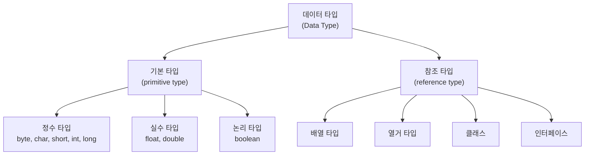
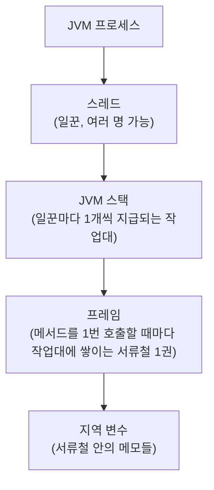
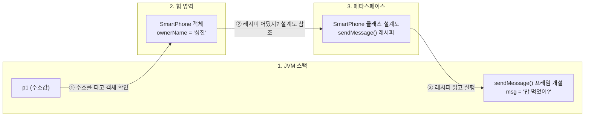
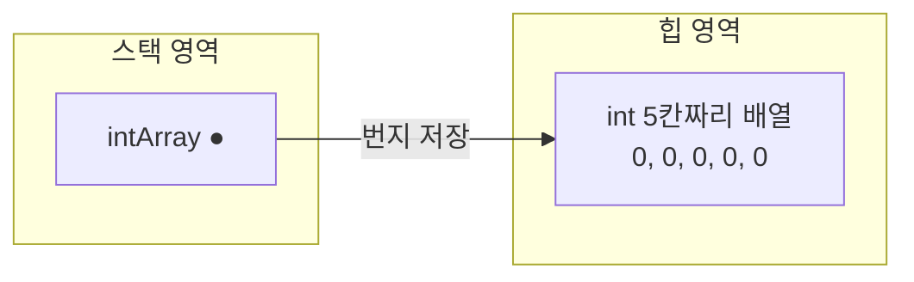
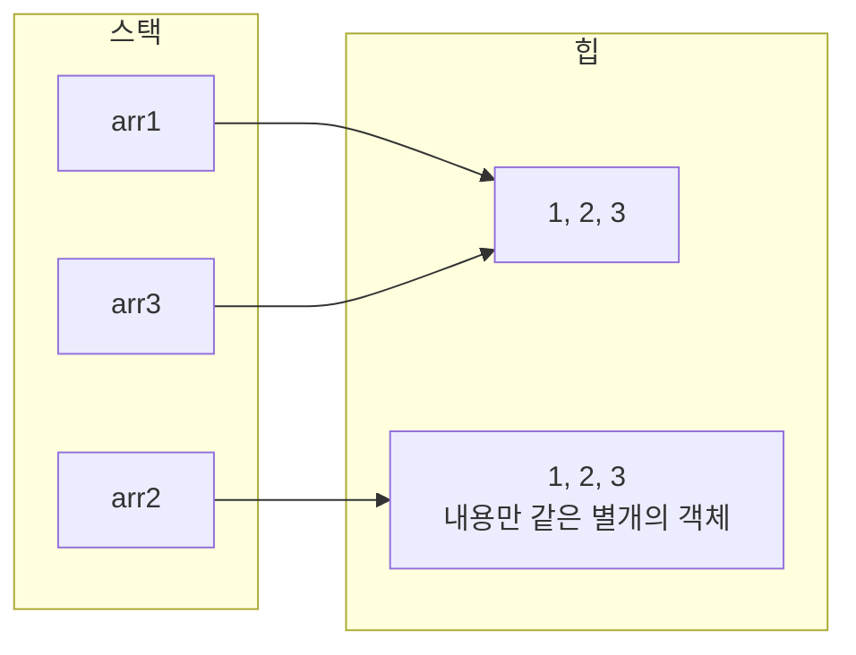
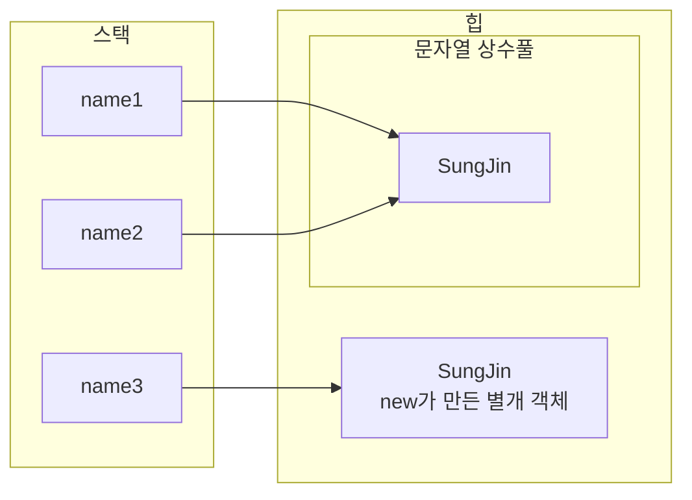
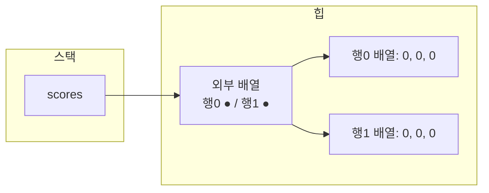

# 자바 참조 타입 완전 정리 — 메모리 구조부터 String, 배열, 열거 타입까지

자바의 데이터 타입은 기본 타입과 참조 타입 둘로 나뉜다. 그중에서도 진짜 자바다운 코드는 전부 참조 타입 위에서 펼쳐진다. <br>
이 글에서는 메모리 구조, 참조 변수의 비교, null, String, 배열, 열거 타입 순서로 설명한다. 
<br>
참고로 『이것이 자바다』(2015)를 베이스로 공부하며 정리한 글이라, 지금 기준(Java 17~21 시대)으로 보충이 필요한 부분은 중간중간 따로 짚었다.


---

## 1. 데이터 타입 분류 — 모든 것의 출발점



둘의 차이는 딱 하나다. **변수에 저장되는 값이 무엇이냐.**

| 구분 | 기본 타입 | 참조 타입 |
|------|-----------|-----------|
| 변수에 저장되는 것 | 실제 값 | 객체의 **번지(주소)** |
| 값이 사는 곳 | 스택 (변수 안에 직접) | 힙 (변수는 주소만 가리킴) |
| 개수 | 딱 8개 | 무한 (모든 클래스가 참조 타입) |

기본 타입 변수는 값을 직접 품고, 참조 타입 변수는 "실제 물건은 저기 있다"고 가리키는 **주소표**만 있다. 이 글의 모든 내용이 이 한 문장에서 파생된다.

---

 **Modern JVM Memory Layout (Java 8 ~ 21+)**

```mermaid
graph TD
    %% ──────────────────────────────────────────────────────────
    %% JVM Runtime Data Area (상단 거대 그룹)
    %% ──────────────────────────────────────────────────────────
    subgraph RDA ["JVM Runtime Data Area (JVM이 직접 관리)"]
        direction LR

        %% [1] JVM 스택 영역 (좌측 배치)
        subgraph STACK_AREA ["1. JVM 스택 영역 (Stack) - 스레드마다 하나씩 · 비공유(Private)"]
            direction TD
            subgraph THREAD1 ["스레드-1 (일꾼 / 실행 주체)"]
                subgraph JVM_ST ["JVM 스택 (이 일꾼 전용 작업대)"]
                    direction TD
                    F_N["프레임-n (가장 최근 호출된 메서드)<br>= 지역변수 배열 + 피연산자 스택"]
                    F_1["프레임-1 (시작 메서드: main 등)<br>= 지역변수 배열 + 피연산자 스택"]
                    
                    F_1 -->|push ⬇️| F_N
                    F_N -->|pop ⬆️| F_1
                end
            end
            
            %% 💡 완전한 정중앙 정렬을 위해 텍스트 전용 가상의 상자로 독립 선언
            subgraph STACK_TEXT_BOX [" "]
                direction LR
                STACK_TEXT["스레드-2 ~ n: 각자 자기 스택을 하나씩 소유 (같은 구조)<br><b>포함 관계 : 스레드 ⊃ 스택 ⊃ 프레임 ⊃ 지역변수</b>"]
            end
            THREAD1 -->| | STACK_TEXT_BOX
        end

        %% 좌우 영역 밸런스용 투명 링크
        STACK_AREA ~~~ HEAP_AREA

        %% [2] 힙 영역 (우측 배치)
        subgraph HEAP_AREA ["2. 힙 영역 (Heap) - 모든 스레드가 공유 · GC의 관할 구역"]
            direction TD
            
            %% 1층: 객체 인스턴스 배열 그룹
            subgraph OBJECTS ["new 로 생성된 인스턴스 · 배열"]
                direction LR
                OBJ1["객체-1"]
                ARR2["배열-2"]
                OBJN["객체-n ..."]
            end
            
            %% 밀착 링크
            OBJECTS -->| | MOVED_ITEMS

            %% 💡 2층: [이사 옴] 단어를 상위 공통 타이틀로 통일하고 내부 텍스트 슬림화
            subgraph MOVED_ITEMS ["[이사 옴] 힙으로 이동한 영역 (Java 7 / 8 ~)"]
                direction LR
                SF["static 필드 (Java 8 ~)<br>java.lang.Class 객체 안에 보관된다"]
                SP["문자열 상수풀 (String Pool) (Java 7 ~)<br>같은 리터럴 문자열은 하나의 객체를 공유"]
            end
            
            %% 밀착 링크
            MOVED_ITEMS -->| | HEAP_TEXT
            HEAP_TEXT["* 힙으로 이사 온 것은 '문자열 풀'까지다.<br><b>클래스별 런타임 상수풀은 아래 메타스페이스에 남는다.</b><br>덩치 큰 장기 거주자들을 힙으로 옮겨 GC가 청소할 수 있게 한 것"]
        end

    end

    %% ──────────────────────────────────────────────────────────
    %% Native Memory (하단 거대 그룹)
    %% ──────────────────────────────────────────────────────────
    subgraph NATIVE_MEM ["Native Memory (운영체제(OS)가 관리)"]
        subgraph METASPACE ["3. 메타스페이스 (Metaspace) - 구 '메서드 영역'의 현재 구현 (PermGen 철거 후 이전)"]
            direction TD
            
            %% 💡 메타스페이스 상단 텍스트도 완전 정중앙 독립 박스로 격리
            subgraph MS_TEXT_BOX [" "]
                direction LR
                MS_TEXT["값이나 변수는 살지 않는다 · 순수 설계도(메타데이터) 전용 · RAM이 허용하는 한 자동 확장"]
            end
            
            subgraph CLASS_INFOS [" "]
                direction LR
                subgraph CL1 ["클래스-1 구조 정보"]
                    C1["바이트코드 (메서드·생성자 코드)<br>런타임 상수풀 (클래스별)"]
                end
                
                subgraph CLN ["클래스-n 구조 정보"]
                    CN["바이트코드 (메서드·생성자 코드)<br>런타임 상수풀 (클래스별)"]
                end
                
                CL1 ~~~ CLN
            end
            
            %% 상단 텍스트와 하단 좌우 상자 밀착
            MS_TEXT_BOX -->| | CLASS_INFOS
        end
    end

    %% 영역 간 관계 화살표
    RDA -->|클래스 설계도 참조| NATIVE_MEM

    %% ──────────────────────────────────────────────────────────
    %% 스타일 레이어 (색상 및 외관 설정)
    %% ──────────────────────────────────────────────────────────
    classDef rda_style fill:#ffffff,stroke:#4a5568,stroke-width:3px,font-weight:bold;
    classDef native_style fill:#ffffff,stroke:#dd6b20,stroke-width:3px,font-weight:bold;
    
    classDef stack_box fill:#ffffff,stroke:#3182ce,stroke-width:2px,color:#2b6cb0;
    classDef thread_box fill:#ffffff,stroke:#805ad5,stroke-width:2px;
    classDef frame_box fill:#f7fafc,stroke:#a0aec0,stroke-width:1px;
    
    classDef heap_box fill:#ffffff,stroke:#38a169,stroke-width:2px,color:#276749;
    classDef moved_group fill:#ffffff,stroke:#d69e2e,stroke-width:2px,color:#b7791f;
    classDef move_box fill:#faf089,stroke:#ecc94b,stroke-width:1px,color:#744210;
    classDef obj_box fill:#edf2f7,stroke:#cbd5e0,stroke-width:1px;
    
    classDef meta_box fill:#ffffff,stroke:#805ad5,stroke-width:2px,color:#553c9a;
    classDef transparent_group fill:none,stroke:none;

    class RDA rda_style;
    class NATIVE_MEM native_style;
    
    class STACK_AREA stack_box;
    class STACK_TEXT_BOX transparent_group;
    class THREAD1 thread_box;
    class F_N,F_1 frame_box;
    
    class HEAP_AREA heap_box;
    class MOVED_ITEMS moved_group;
    class SF,SP move_box;
    class OBJ1,ARR2,OBJN obj_box;
    
    class METASPACE meta_box;
    class CLASS_INFOS,MS_TEXT_BOX transparent_group;
    class CL1,CLN obj_box;

    %% 텍스트 라벨 투명화 및 정돈
    style STACK_TEXT fill:none,stroke:none,text-align:center,color:#4a5568;
    style HEAP_TEXT fill:none,stroke:none,text-align:left,color:#e53e3e;
    style MS_TEXT fill:none,stroke:none,text-align:center;
    
    %% 밀착용 및 정렬용 투명 연결선 숨기기 프로퍼티
    linkStyle 2,3,4,5,6,7,8 stroke:none,stroke-width:0px;
```




### 1. JVM 스택 (Stack): "지역 변수 담당"



JVM스택 영역은 스레드 마다 하나씩 존재하며 스레드가 시작될 때 할당.
<br>
메서드를 호출할 때마다 프레임을 추가(push)하고 종료되면 제거(pop)하는 구조.
<br>
프레임 내부에는 로컬 변수 스택이 존재하며 메서드 내부의 임시 지역 변수들만 보관.

### 2. 힙 영역 (Heap Area): "대재개발 구역"

힙 영역은 new 연산자로 생성된 인스턴스 객체와 배열이 저장되는 공간이다. 모든 스레드가 공유하며, 가비지 컬렉터(GC)의 관리 대상이다.
Java 버전이 올라가면서 원래 메서드 영역(PermGen)에 있던 데이터 중 일부가 힙 영역으로 이동했다.
<br>
`static 필드` (Java 8~) — 클래스의 static 변수들은 힙 영역에 생성되는 java.lang.Class 객체의 일부로 저장된다.
<br>
`문자열 상수풀 / String Pool` (Java 7~) — 문자열 리터럴을 모아 관리하는 공간으로, 같은 리터럴은 하나의 String 객체를 공유한다. 
<br>
단, 힙으로 이동한 것은 문자열 풀이며 **클래스별 런타임 상수풀은 메타스페이스**에 남는다.
<br>
이동의 목적은 **메모리 관리 효율**이다. static 변수와 문자열 풀은 프로그램 종료 시까지 유지되는 경우가 많아 고정 크기의 PermGen에 두면 `공간 부족(OutOfMemoryError: PermGen space)`이 발생하기 쉬웠다. 이들을 GC의 관리 범위인 힙으로 옮김으로써, 참조되지 않는 데이터를 주기적으로 회수해 메모리 부족을 방지할 수 있게 되었다.

### 3. 메타스페이스 (Metaspace): "JVM 외부로의 독립 - 구 메서드 영역"

이제 데이터(static 값)는 힙으로 쫓아내고, 오직 "클래스의 뼈대(바이트코드), 메서드의 구조" 같은 순수한 설계도 정보만 저장

과거 (책의 '메소드 영역'): JVM 내부의 `PermGen`이라는 제한된 공간에서 데이터와 설계도가 엉켜있어 방이 쉽게 터짐.

현재: `PermGen`이라는 방을 완전히 부수고 JVM 외부인 컴퓨터의 실제 RAM(네이티브 메모리) 영역에 `'메타스페이스'`라는 새 공간을 만듦.

여기에는 값(Value)이나 변수가 전혀 살지 않는다. 오직 JVM이 코드를 실행할 때 읽어야 하는 "클래스 자체의 뼈대, 메서드 코드 자체, 생성자의 기계어 코드" 같은 순수 설계도(메타데이터)만 저장. RAM이 허용하는 한 용량이 자동으로 늘어나므로 메모리가 터질 일이 거의 없다.
<br>
**참고 : 메서드 영역 vs 메서드**

`메소드 영역`은 메소드의 설계도(코드)가 들어앉아 있는 메모리상의 '공간',
<br>
`메소드`는 그 공간에 저장되어 있다가 호출되면 스택 프레임을 열고 일을 시작하는 실제 '기능(코드 덩어리)'
<br>
프로그램을 실행하면 자바는 클래스 파일들을 읽어서 메타스페이스라는 공간에 집어넣는다. 이때 '메소드의 실제 기계어 코드(레시피)'도 이 공간에 저장된다.
<br>
코드가 실행되다가 메소드가 호출되면 (h1.info();): 자바는 메타스페이스(메소드 영역)로 달려가서 info()라는 메소드를 찾는다.
<br>
그 레시피를 복사해서 JVM 스택 영역에 프레임(Frame)을 만들고, 그 안에서 지역 변수들을 조합해 진짜로 실행한다.

```java
public class SmartPhone {
    // 1. 인스턴스 필드 (폰마다 주인이 다름)
    String ownerName; 

    // 2. static 필드 (힙 영역 Class 객체에 딱 1개만)
    static String kakaoServerIp = "211.234.56.78"; 

    // 3. 메소드 (메시지를 전송하는 기능/레시피)
    public void sendMessage(String msg) {
        System.out.println(ownerName + "님이 대화방에 [" + msg + "]를 전송합니다.");
    }
}
```
참고 : ownerName은 객체가 생성될 때마다 그 객체의 인스턴스 내부에 하나씩 새로 생겨남

```java
public static void main(String[] args) {
    SmartPhone p1 = new SmartPhone();
    p1.ownerName = "성진";
    
    // 바로 이 코드가 실행될 때!
    p1.sendMessage("밥 먹었어?"); 
}
```



① [스택 ──► 힙] : 폰 주인을 찾기 (`p1.`)
컴퓨터는 먼저 JVM 스택 영역에 있는 p1 상자를 연다. 거기엔 힙 영역에 생성된 스마트폰 객체의 '주소값'이 있고, 그 주소를 타고 힙(Heap) 영역으로 건너가서 "아, 주인이 '성진'인 스마트폰 객체구나!" 하고 알맹이를 확인.

② [힙 ──► 메타스페이스] : 행동 레시피 (`sendMessage()`)
객체 방에 도착한 컴퓨터는 "메시지 보내는 기능 작동"라는 명령을 받은 상태. 하지만 객체 몸통 안에는 ownerName 같은 '데이터'만 있지, 실제 코드가 어떻게 돌아가는지 적힌 '레시피'는 없음.

컴퓨터는 메타스페이스에 있는 SmartPhone 클래스 설계도 공간으로 감. 거기 보관된 sendMessage()의 진짜 기계어 코드(레시피)를 슥 읽어온다.

③ [메타스페이스 ──► 스택] : 작업실을 열고 요리 시작
레시피를 읽었으니 이제 실행할 차례다. 컴퓨터는 다시 실행 담당 구역인 JVM 스택 영역으로 돌아와 sendMessage() `전용 프레임(Frame)` 박스를 한 층 새로 쌓아 올린다.

이 프레임 박스 내부(지역 변수 공간)에 전달받은 알맹이인 `msg = "밥 먹었어?`를 집어넣고 코드를 한 줄씩 실행한다. 실행이 끝나 화면에 출력이 완료되면, 이 프레임 박스는 스택에서 깔끔하게 터져서(pop) 사라지게 된다.


## 2. JVM 메모리 구조 — 참조가 움직이는 무대

`java` 명령으로 JVM이 시작되면 메모리를 크게 세 영역으로 나눠 쓴다.

| 영역 | 담기는 것 | 특징 |
|------|-----------|------|
| 메소드 영역 | 클래스 정보(상수풀, 필드·메소드 데이터, 코드) | JVM 시작 시 생성, 모든 스레드 공유 |
| 힙 영역 | 객체와 배열 | `new`로 생성된 모든 것. 참조가 끊기면 GC가 회수 |
| JVM 스택 | 메소드 호출마다 쌓이는 프레임과 지역 변수 | 스레드마다 하나. 메소드가 끝나면 프레임이 pop |

참조 타입 변수가 만들어지는 과정은 항상 같은 3단계다.

```java
int[] intArray = new int[5];
```



1. `new` — 힙에 객체(여기서는 int 5칸짜리 배열)를 생성한다
2. JVM이 생성된 **번지를 리턴**한다
3. 스택의 변수에는 그 **번지가 저장**된다

> **2021년 책 vs 지금 — 메소드 영역 보충**
> "메소드 영역"은 JVM 명세 기준의 논리적 구분이다. 실제 HotSpot JVM에서는 Java 8부터 **메타스페이스(Metaspace)**가 이 역할을 맡으며 네이티브 메모리에 잡히고, static 변수와 문자열 상수풀은 힙 쪽에서 관리된다. "메소드 영역 = PermGen"은 이제 옛날 지식이니 주의.

---

## 3. 참조 변수의 == 와 != — 번지를 비교한다

기본 타입에서 `==`는 값 비교다. 하지만 참조 타입에서 `==`는 **번지 비교**, 즉 "같은 객체를 가리키는가"를 묻는다.

```java
int[] arr1 = new int[] {1, 2, 3};
int[] arr2 = new int[] {1, 2, 3};
int[] arr3 = arr1;

System.out.println(arr1 == arr2);  // false → 내용은 같지만 서로 다른 객체
System.out.println(arr1 == arr3);  // true  → 같은 객체를 가리킨다
```



`arr3 = arr1`처럼 참조 변수끼리 대입하면 **객체가 복사되는 게 아니라 번지가 복사**된다. 그래서 `arr3[0] = 99`로 바꾸면 `arr1[0]`도 99가 된다. 같은 객체니까. 참조 타입에서 벌어지는 온갖 "왜 저것도 같이 바뀌지?" 현상의 정체가 전부 이것이다.

---

## 4. null과 NullPointerException — 참조 타입만의 특권이자 함정

참조 타입 변수는 "아무것도 가리키지 않는 상태"를 가질 수 있다. 그게 `null`이다. 기본 타입에는 null이 없다.

```java
String hobby = null;    // 힙의 어떤 객체도 가리키지 않음
System.out.println(hobby == null);  // true → null도 == 비교 가능
```

문제는 null인 변수로 객체를 쓰려고 할 때다. 가리키는 객체가 없는데 그 객체의 메소드를 부르면, 자바에서 가장 유명한 예외가 터진다.

```java
String author = null;
System.out.println(author.length());
// 실행 시 NullPointerException 발생!
```

**NullPointerException(NPE)은 컴파일 에러가 아니라 실행 중에 터지는 예외**라는 게 핵심이다. 코드는 멀쩡히 컴파일되고, 실행해서 그 줄에 도달해야 터진다. 그래서 참조 타입을 다룰 때는 "이 변수가 지금 null일 수 있나?"를 항상 의식해야 한다.

null의 쓸모도 있다. 더 이상 객체가 필요 없을 때 변수에 null을 대입하면 참조가 끊기고, 아무도 가리키지 않게 된 힙의 객체는 **가비지 컬렉터(GC)**가 알아서 회수한다. 자바에서 개발자가 메모리를 직접 해제하지 않는 이유다.

> **지금 기준 보충 — 친절해진 NPE**
> Java 14부터 NPE 메시지가 "정확히 무엇이 null이었는지"를 알려주도록 개선됐다(Helpful NullPointerExceptions). 예전엔 스택트레이스 줄 번호만 보고 추리해야 했지만, 지금은 `Cannot invoke "String.length()" because "author" is null`처럼 범인을 직접 지목해 준다.

---

## 5. String — 가장 많이 쓰는 참조 타입

String은 클래스이므로 참조 타입이다. 즉 String 변수에는 문자열이 아니라 **String 객체의 번지**가 저장된다. 그런데 String에는 다른 참조 타입에 없는 독특한 성질이 두 가지 있다.

### ① 리터럴 생성 vs new 생성 — 같은 문자열, 다른 객체

```java
String name1 = "SungJin";           // 리터럴 방식
String name2 = "SungJin";           // 리터럴 방식
String name3 = new String("SungJin"); // new 방식

System.out.println(name1 == name2);  // true  → 같은 객체!
System.out.println(name1 == name3);  // false → 다른 객체
```



자바는 **같은 리터럴 문자열은 하나의 객체를 공유**하도록 최적화한다(문자열 상수풀). 반면 `new String(...)`은 무조건 새 객체를 만든다. 그래서 `==` 비교 결과가 갈리는 것이다.

여기서 철칙이 나온다. **문자열 내용 비교는 무조건 `equals()`.**

```java
name1.equals(name3)   // true → 번지가 달라도 내용이 같으면 true
```

`==`는 생성 방식에 따라 결과가 오락가락하지만 `equals()`는 항상 내용을 본다. 실무에서 문자열을 `==`로 비교하는 코드는 그 자체로 버그라고 봐도 된다.

### ② 불변성(immutable) — String은 수정되지 않는다

String 객체는 한 번 만들어지면 **내부 문자열을 절대 바꿀 수 없다**. 바꾸는 것처럼 보이는 연산은 전부 새 객체를 만든다.

```java
String blog = "SungJin";
blog = blog + "의 개발 블로그";
// "SungJin" 객체가 수정된 게 아니라,
// "SungJin의 개발 블로그"라는 새 객체가 힙에 생기고 blog가 그쪽을 가리킬 뿐
```

원래의 `"SungJin"` 객체는 그대로 힙에 남아 있다가, 아무도 참조하지 않으면 GC가 회수한다. 그래서 반복문에서 `+`로 문자열을 수천 번 이어붙이는 건 새 객체를 수천 개 만드는 짓이 되고, 이럴 때는 `StringBuilder`를 쓴다.

### 자주 쓰는 String 메소드

| 메소드 | 하는 일 | 예시 |
|--------|---------|------|
| `length()` | 문자 수 | `"SungJin".length()` → 7 |
| `charAt(i)` | i번째 문자 | `"SungJin".charAt(0)` → 'S' |
| `equals(s)` | 내용 비교 | 문자열 비교의 표준 |
| `indexOf(s)` | 위치 찾기 (없으면 -1) | `"sungjin.dev".indexOf(".")` → 7 |
| `substring(a, b)` | 잘라내기 (a부터 b 직전까지) | `"SungJin".substring(0, 4)` → "Sung" |
| `replace(a, b)` | 치환한 **새 문자열** 리턴 | 원본은 그대로 (불변성!) |
| `split(regex)` | 구분자로 쪼개 배열로 | `"a,b,c".split(",")` |
| `trim()` | 앞뒤 공백 제거 | 입력값 정리의 단골 |
| `valueOf(x)` | 다른 타입 → 문자열 | `String.valueOf(42)` → "42" |

> **지금 기준 보충 — 새로 생긴 String 기능들**
> 2021년 이후 실무에서 흔히 쓰게 된 것들: `isBlank()`(공백뿐인지 검사, Java 11), `strip()`(유니코드까지 처리하는 개선판 trim, Java 11), `repeat(n)`(반복, Java 11), 그리고 여러 줄 문자열을 따옴표 세 개로 쓰는 **텍스트 블록**(`"""..."""`, Java 15 정식화). 특히 텍스트 블록은 JSON이나 SQL을 코드에 넣을 때 삶의 질이 달라진다.

---

## 6. 배열 — 같은 타입을 줄 세우는 참조 타입

### 선언과 생성

배열은 **같은 타입의 값들을 연속된 공간에 저장**하고 인덱스로 접근하는 자료구조다. 생성 방법은 두 가지다.

```java
// ① 값 목록으로 생성
String[] members = { "SungJin", "Mina", "Hoon" };

// ② new로 크기만 정해 생성 (기본값으로 자동 초기화)
int[] scores = new int[3];   // {0, 0, 0}
```

new로 생성하면 각 칸이 타입별 기본값으로 채워진다.

| 타입 | 기본값 |
|------|--------|
| 정수 타입 (byte, short, int, long) | 0 |
| 실수 타입 (float, double) | 0.0 |
| boolean | false |
| char | '\u0000' |
| **참조 타입 (String 등)** | **null** |

마지막 줄이 중요하다. `new String[3]`으로 만든 배열의 각 칸은 null이므로, 값을 넣기 전에 `strArray[0].length()`를 호출하면 NPE다. 4절의 null 이야기가 배열에서 그대로 재현된다.

주의할 문법 하나. 값 목록 `{ }` 방식은 **선언과 동시에**만 쓸 수 있다.

```java
String[] members;
members = { "SungJin", "Mina" };              // 컴파일 에러!
members = new String[] { "SungJin", "Mina" }; // 이미 선언된 변수에는 new를 붙여야 한다
```

### length와 향상된 for문

```java
int[] scores = { 85, 90, 77 };

// 배열 길이는 length "필드" (String의 length()는 메소드라는 점과 대비)
for (int i = 0; i < scores.length; i++) {
    System.out.println(scores[i]);
}

// 인덱스가 필요 없다면 향상된 for문이 깔끔하다
for (int score : scores) {
    System.out.println(score);
}
```

배열 범위 밖의 인덱스에 접근하면 `ArrayIndexOutOfBoundsException`이 터진다. NPE와 함께 자바 입문자의 양대 예외다.

### 다차원 배열 — 배열을 담는 배열

자바의 2차원 배열은 "행렬"이 아니라 **배열의 배열**이다. 이것도 결국 참조 구조다.

```java
int[][] scores = new int[2][3];
```



`scores`는 "int 배열 2개를 담은 배열"을 가리키고, 그 각 칸이 또 다른 배열을 가리킨다. 그래서 행마다 길이가 다른 계단식 배열도 가능하다.

```java
int[][] scores = new int[2][];
scores[0] = new int[3];   // 첫 행은 3칸
scores[1] = new int[5];   // 둘째 행은 5칸
```

### 배열 복사 — 번지 복사와 값 복사를 구분하라

3절에서 본 대로, 배열 변수의 대입은 번지 복사다. 내용을 복사한 **새 배열**이 필요하면 복사 메소드를 써야 한다.

```java
int[] original = { 1, 2, 3 };

int[] fake = original;                          // 번지 복사 (같은 배열)
int[] real = java.util.Arrays.copyOf(original, original.length);  // 값 복사 (새 배열)

fake[0] = 99;
System.out.println(original[0]);  // 99 ← 같이 바뀜!
real[0] = 77;
System.out.println(original[0]);  // 99 ← real은 별개라 영향 없음
```

단, 객체 배열을 복사하면 칸에 든 **번지들이 복사**되므로, 새 배열과 원본이 같은 객체들을 공유한다. 이걸 **얕은 복사(shallow copy)**라고 한다. 객체 자체까지 새로 만드는 **깊은 복사(deep copy)**가 필요하면 직접 순회하며 복사해야 한다.

---

## 7. 열거 타입 — 한정된 값만 허용하는 참조 타입

요일, 계절, 회원 등급처럼 **가질 수 있는 값이 몇 개로 정해진** 데이터가 있다. 이걸 문자열이나 숫자로 관리하면 `"MONDAY"`를 `"Monday"`로 잘못 쓰는 실수를 컴파일러가 못 잡는다. 열거 타입은 이런 값을 타입 차원에서 강제한다.

```java
public enum Week {
    MONDAY, TUESDAY, WEDNESDAY, THURSDAY, FRIDAY, SATURDAY, SUNDAY
}
```

```java
Week today = Week.FRIDAY;
Week wrong = Week.FUNDAY;   // 컴파일 에러! 존재하지 않는 값은 아예 못 쓴다
```

여기서 중요한 사실: **열거 상수 하나하나가 힙에 생성되는 객체**다. `Week.MONDAY`는 Week 타입의 객체이고, 변수 `today`에는 그 객체의 번지가 저장된다. 열거 타입이 참조 타입으로 분류되는 이유다. 다만 각 상수의 객체는 **딱 하나씩만** 만들어져 공유되므로, 열거 타입만큼은 예외적으로 `==` 비교가 안전하다.

```java
today == Week.FRIDAY   // true. 열거 타입은 == 비교가 공식적으로 허용된다
```

### 열거 타입의 기본 메소드

```java
Week today = Week.FRIDAY;

today.name();          // "FRIDAY"  (상수 이름 문자열)
today.ordinal();       // 4         (선언 순번, 0부터)
Week.valueOf("MONDAY") // Week.MONDAY (문자열 → 열거 객체)
Week.values()          // 모든 상수를 담은 Week[] 배열
```

`values()`가 리턴하는 배열의 구조는 6절에서 본 객체 배열 그대로다. 배열의 각 칸이 힙에 있는 열거 객체들의 번지를 담는다.

```java
Week[] days = Week.values();
for (Week day : days) {
    System.out.println(day.name());
}
```

> **지금 기준 보충 — 열거 타입과 switch**
> Java 14부터 정식화된 **switch 표현식**은 열거 타입과 특히 궁합이 좋다.
> ```java
> String mood = switch (today) {
>     case FRIDAY -> "SungJin 퇴근 후 블로그 쓰는 날";
>     case SATURDAY, SUNDAY -> "휴식";
>     default -> "출근";
> };
> ```
> 화살표 문법에 break가 필요 없고, 모든 상수를 다뤘는지 컴파일러가 검사해 준다. 열거 타입을 쓴다면 이 문법부터 익히는 걸 추천한다.

---

## 8. 클래스와 인터페이스 — 참조 타입의 본체

참조 타입 4형제 중 배열과 열거를 다뤘으니 남은 건 클래스와 인터페이스다. 이 둘은 각각 별도의 챕터가 필요한 큰 주제라 여기서는 참조 타입 관점의 핵심만 짚는다.

- **클래스** — 개발자가 직접 정의하는 참조 타입. `new`로 객체를 힙에 만들고, 변수는 그 번지를 가진다. String도, 우리가 만들 모든 클래스도 이 규칙을 따른다.
- **인터페이스** — 구현 객체를 담기 위한 참조 타입. 인터페이스 타입 변수에는 그 인터페이스를 구현한 객체의 번지가 저장된다. 다형성의 핵심 장치다.

즉 앞으로 어떤 클래스를 만나든, 이 글에서 정리한 규칙(번지 저장, == 는 번지 비교, null 가능, 대입은 번지 복사)이 똑같이 적용된다. **참조 타입의 문법은 여기서 끝나고, 이후는 전부 응용이다.**

---

## 9. 한 장 요약

| 주제 | 핵심 한 줄 |
|------|-----------|
| 분류 | 기본 타입은 값을, 참조 타입은 **번지**를 저장한다 |
| 메모리 | 객체는 힙에, 변수는 스택에, 클래스 정보는 메소드 영역(메타스페이스)에 |
| == 비교 | 참조 타입의 ==는 번지 비교. 내용 비교는 `equals()` |
| 대입 | 참조 변수 간 대입은 객체가 아니라 **번지 복사** |
| null | 참조 타입만 가질 수 있는 "가리키는 곳 없음" 상태. null에 접근하면 NPE |
| String | 리터럴은 상수풀 공유, new는 별개 객체. 불변이라 수정 연산은 전부 새 객체 생성 |
| 배열 | new 생성 시 기본값 초기화(참조 타입 칸은 null). 복사는 얕은/깊은 구분 |
| 열거 | 상수 하나하나가 객체. 유일하게 == 비교가 안전한 참조 타입 |
| 클래스/인터페이스 | 위 규칙이 전부 그대로 적용되는 참조 타입의 본체 |

참조 타입을 관통하는 그림은 결국 하나다. **스택의 변수가 힙의 객체를 가리키는 화살표.** 이 화살표가 복사되는지(대입), 같은 곳을 가리키는지(==), 아무 데도 안 가리키는지(null)만 구분할 수 있으면, 참조 타입에서 헷갈릴 일은 없다.
