## 1. 알고리즘

### 1-1. 알고리즘 개념

알고리즘은 어떠한 문제를 해결하기 위한 **정해진 일련의 절차나 방법을 공식화한 형태로 표현한 기법**이다.

표현 방법은 자연어, 순서도, **의사 코드**, 프로그래밍 언어 등이 있다. 즉, 프로그래밍 언어가 아니어도 알고리즘 표현은 가능하다.

### 1-2. 알고리즘 특성 5가지

| 특성 | 설명 |
|---|---|
| 입력 | 외부로부터 입력되는 자료가 **0개 이상** |
| 출력 | 출력되는 결과가 **1개 이상** |
| 명확성 | 각 명령어의 의미가 명확 |
| 유한성 | 정해진 단계를 지나면 종료 |
| 유효성 | 모든 명령은 실행 가능한 연산이어야 함 |

> ![star] 암기 팁: **입출명유유** — 입력은 0개 이상, 출력은 1개 이상이라는 숫자 차이가 자주 출제된다.

### 1-3. 알고리즘 설계 기법 ![star] 자주 출제

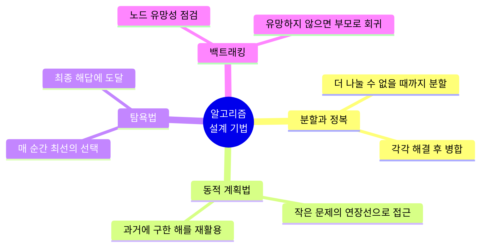

| 기법 | 설명 |
|---|---|
| 분할과 정복 (Divide and Conquer) | 문제를 나눌 수 없을 때까지 나누고, 각각을 풀면서 다시 병합하여 답을 얻는다 |
| 동적 계획법 (Dynamic Programming) | 문제를 더 작은 문제의 연장선으로 생각하고, 과거에 구한 해를 활용한다 |
| 탐욕법 (Greedy) | 결정해야 할 때마다 그 순간 가장 좋다고 생각되는 것을 선택해 최종 해답에 도달한다 |
| 백트래킹 (Backtracking) | 노드의 유망성을 점검한 후, 유망하지 않으면 부모 노드로 되돌아가 다른 자손 노드를 검색한다 |

### 1-4. 시간 복잡도에 따른 알고리즘 분류 ![star] 자주 출제

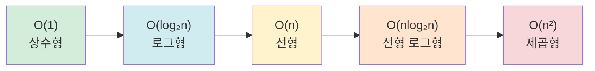

왼쪽으로 갈수록 빠르고, 오른쪽으로 갈수록 느리다.

| 복잡도 | 설명 | 대표 알고리즘 |
|---|---|---|
| O(1) | 자료 크기와 무관하게 항상 같은 속도로 작동 | 해시 함수 |
| O(log₂n) | 해결 단계 수가 log₂n번만큼의 수행 시간 | 이진 탐색 |
| O(n) | 입력 자료를 차례로 하나씩 모두 처리, 자료 크기와 정비례 | 순차 탐색 |
| O(nlog₂n) | 해결 단계 수가 nlog₂n번만큼의 수행 시간 | 퀵 정렬, 합병 정렬, 힙 정렬 |
| O(n²) | 주요 처리 루프 구조가 2중인 경우 | 거품 정렬, 삽입 정렬, 선택 정렬 |

> ![star] n이 작을 때는 n²이 nlog₂n보다 빠를 수도 있다는 점도 함께 기억하자.

---

## 2. 해싱 함수

### 2-1. 해싱 함수 개념

해싱 함수(해시 함수)는 **데이터를 키로 변환하는 함수**다. 길고 복잡한 문자열을 짧고 단순한 문자열(또는 수열)로 변경한다.

정확히는 **임의의 길이의 데이터를 고정된 길이의 데이터로 매핑**하는 함수다.

### 2-2. 해싱 함수 종류 ![star] 자주 출제

| 기법 | 설명 |
|---|---|
| 제산법 (Division) | 나머지 연산자(%)를 사용하여 테이블 주소를 계산 |
| 제곱법 (Mid Square) | 레코드 키값을 제곱한 후 결괏값의 **중간 부분** 몇 비트를 선택해 홈 주소로 사용 |
| 숫자 분석법 (Digit Analysis) | 키를 구성하는 수들의 자리별 분포를 조사해 고른 분포의 자릿수를 선택 |
| 폴딩법 (Folding) | 키를 여러 부분으로 나누고, 각 부분을 더하거나 XOR한 값을 홈 주소로 사용 |
| 기수 변환법 (Radix Conversion) | 키를 다른 진법으로 간주하고 변환하여 홈 주소를 얻음 (예: 16진수 → 10진수 간주) |
| 무작위 방법 (Random) | 난수를 발생시켜 각 레코드 키의 홈 주소를 결정 |

해싱 함수 선택 시 고려사항: **계산과정의 단순화, 충돌의 최소화, 기억장소 낭비의 최소화, 오버플로우 최소화**

---

## 3. 검색 알고리즘

### 3-1. 순차 검색 (Sequential Search)

배열의 처음부터 끝까지 **차례대로 비교**하여 원하는 데이터를 찾는 알고리즘이다.

- 리스트가 길면 비효율적
- 하지만 가장 단순해서 구현이 쉽고, **정렬되지 않은 리스트에서도 사용 가능**

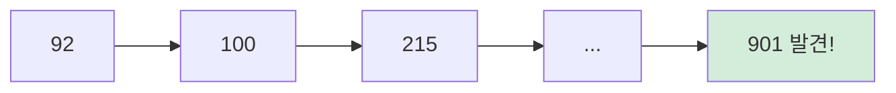

**예제**: 11개 데이터 `92, 100, 215, 341, 625, 716, 812, 813, 820, 901, 902`에서 901 찾기
→ 첫 번째부터 하나씩 비교, **10번 시도**에 발견.

### 3-2. 이진 검색 (Binary Search) ![star] 자주 출제

**정렬된 리스트**에서 탐색 범위를 **절반씩 좁혀가며** 데이터를 탐색하는 알고리즘이다. 탐색 효율이 높고 시간이 적게 든다.

**가운데 레코드 번호 공식** (소수점은 버림):

$$M = \left[\frac{F+L}{2}\right]$$

- F: 남은 범위 내 첫 번째 레코드 번호
- L: 남은 범위 내 마지막 레코드 번호
- M: 남은 범위 내 가운데 레코드 번호

**예제**: 위와 같은 11개 데이터에서 901 찾기

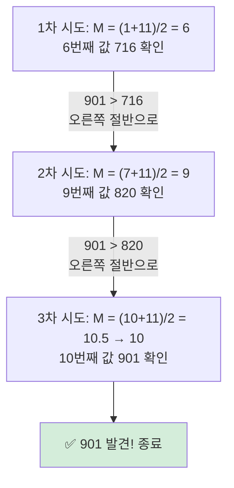

순차 검색은 10번, 이진 검색은 **3번** 만에 찾았다. 이게 O(n)과 O(log₂n)의 차이다.

---

## 4. 정렬 알고리즘

### 4-1. 정렬 알고리즘 한눈에 비교

| 정렬 | 최적 | 평균 | 최악 | 핵심 키워드 |
|---|---|---|---|---|
| 퀵 정렬 | O(nlog₂n) | O(nlog₂n) | **O(n²)** | 피벗 |
| 합병 정렬 | O(nlog₂n) | O(nlog₂n) | O(nlog₂n) | 분할 후 병합 |
| 힙 정렬 | O(nlog₂n) | O(nlog₂n) | O(nlog₂n) | 완전이진트리 |
| 거품 정렬 | O(n²) | O(n²) | O(n²) | 인접 원소 교환 |
| 삽입 정렬 | **O(n)** | O(n²) | O(n²) | 정렬된 부분에 삽입 |
| 선택 정렬 | O(n²) | O(n²) | O(n²) | 최솟값 선택 후 교환 |

> ![star] 퀵 정렬만 최악이 O(n²), 삽입 정렬만 최적이 O(n)이라는 예외를 기억하자.

### 4-2. 퀵 정렬 (Quick Sort)

**피벗**을 두고 피벗의 왼쪽에는 작은 값, 오른쪽에는 큰 값을 두는 과정을 반복하는 알고리즘이다. 레코드의 많은 자료 이동을 없애고 하나의 파일을 부분적으로 나누어 가면서 정렬한다.

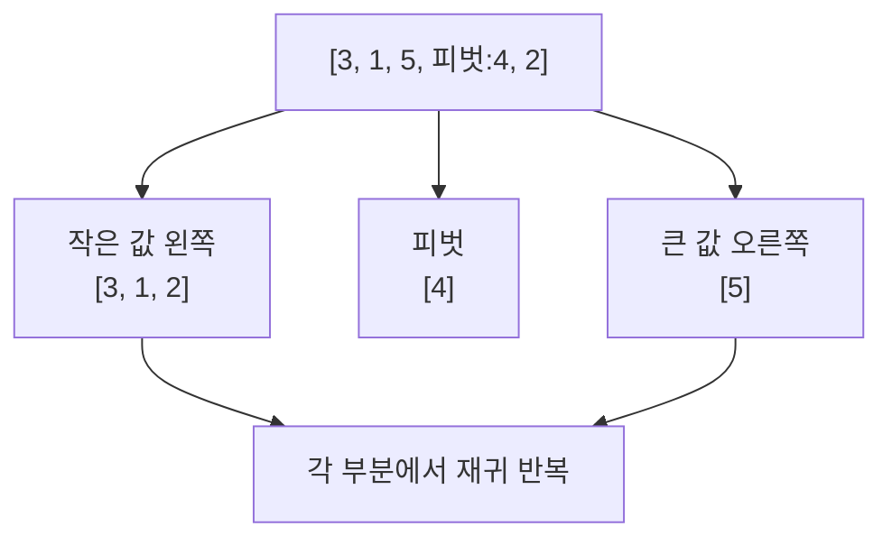

### 4-3. 합병 정렬 (Merge Sort)

전체 원소를 **하나의 단위로 분할**한 후, 분할한 원소를 다시 **합병**해서 정렬하는 알고리즘이다.

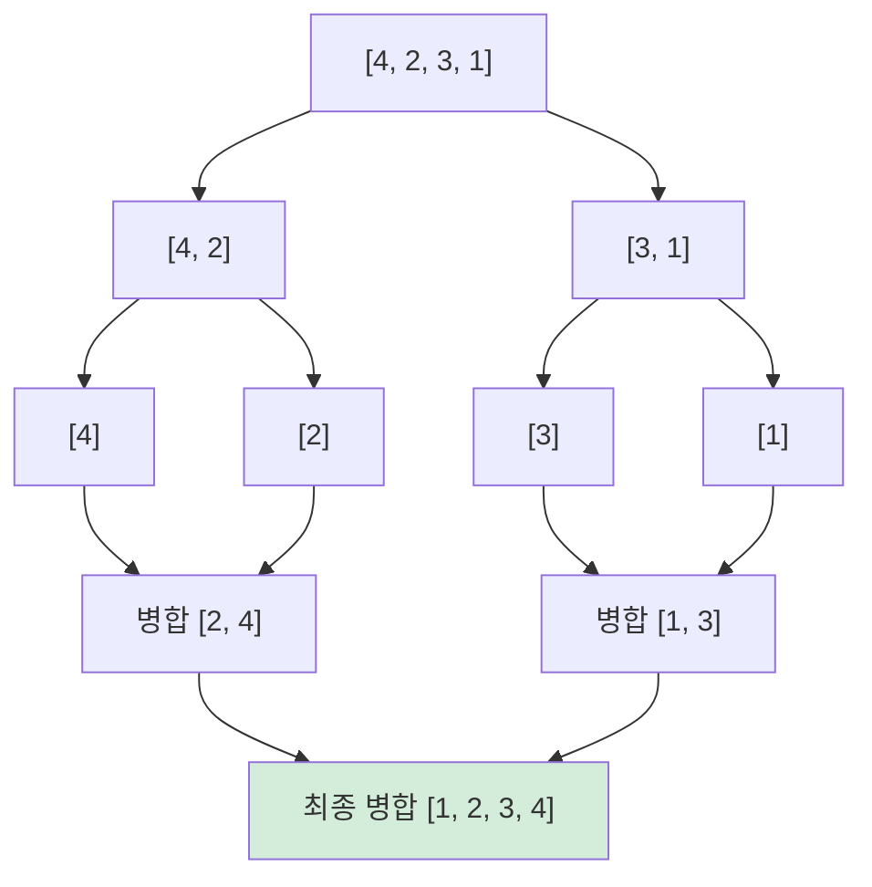

### 4-4. 힙 정렬 (Heap Sort)

정렬할 입력 레코드들로 **힙을 구성**하고, 가장 큰 키값을 갖는 **루트 노드를 제거하는 과정을 반복**하여 정렬하는 알고리즘이다.

**완전이진트리(Complete Binary Tree)**로 입력 자료의 레코드를 구성한다.

### 4-5. 거품 정렬 (Bubble Sort) ![star] 자주 출제

**인접한 2개의 레코드 키값을 비교**하여 크기에 따라 위치를 서로 교환하는 알고리즘이다. 교환 과정이 거품 모양 같다고 해서 이런 이름이 붙었다.

한 PASS를 수행할 때마다 **가장 큰 값이 맨 뒤로 이동**하므로, PASS를 `요소의 개수 - 1`번 수행하면 정렬이 완료된다.

**예제**: `4, 2, 3, 5, 1` 오름차순 정렬

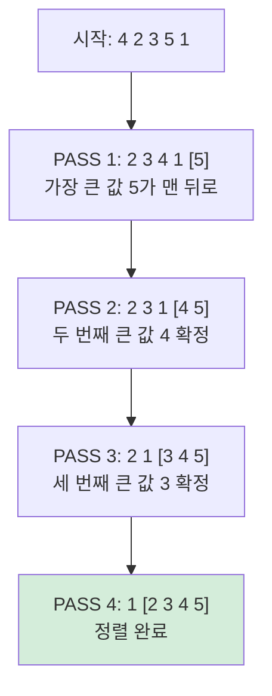

원소가 5개면 PASS 4까지만 돌면 된다. 나머지 1개는 자동으로 맨 앞에 위치하기 때문에 PASS 5는 필요 없다.

### 4-6. 삽입 정렬 (Insertion Sort)

n번째 키를 **앞의 (n-1)개 키와 비교**하여 알맞은 순서에 **삽입**하는 알고리즘이다. 모든 요소를 앞에서부터 이미 정렬된 배열 부분과 비교하여 자신의 위치를 찾아 삽입한다.

**예제**: `4, 2, 3, 5, 1` 오름차순 정렬

| 단계 | 상태 | 설명 |
|---|---|---|
| 시작 | `[4]` 2 3 5 1 | 4는 정렬되었다고 가정 |
| PASS 1 | `[2 4]` 3 5 1 | 2를 {4}에 삽입 |
| PASS 2 | `[2 3 4]` 5 1 | 3을 {2, 4}에 삽입 |
| PASS 3 | `[2 3 4 5]` 1 | 5를 {2, 3, 4}에 삽입 |
| PASS 4 | `[1 2 3 4 5]` | 1을 {2, 3, 4, 5}에 삽입 → 완료 |

### 4-7. 선택 정렬 (Selection Sort)

정렬되지 않은 데이터 중 **가장 작은 데이터를 찾아** 정렬되지 않은 부분의 **가장 앞 데이터와 교환**해 나가는 알고리즘이다.

**예제**: `4, 2, 3, 5, 1` 오름차순 정렬

| 단계 | 상태 | 설명 |
|---|---|---|
| PASS 1 | `[1]` 2 3 5 4 | 최솟값 1과 첫 요소 4 교환 |
| PASS 2 | `[1 2]` 3 5 4 | 최솟값 2는 이미 제자리 |
| PASS 3 | `[1 2 3]` 5 4 | 최솟값 3은 이미 제자리 |
| PASS 4 | `[1 2 3 4]` 5 | 최솟값 4와 5 교환 → 완료 |

> ![star] 거품·삽입·선택 정렬의 차이를 예제 흐름으로 구분해서 기억하자. 거품은 "인접 비교", 삽입은 "정렬된 부분에 끼워넣기", 선택은 "최솟값 찾아 교환"이다.

---

## 5. 소스 코드 품질 분석

### 5-1. 개념

소스 코드 품질 분석은 코딩 스타일, 코딩 표준, 코드 복잡도, **메모리 누수**, **스레드 결함** 등을 발견하기 위한 활동이다.

### 5-2. 정적 분석 vs 동적 분석

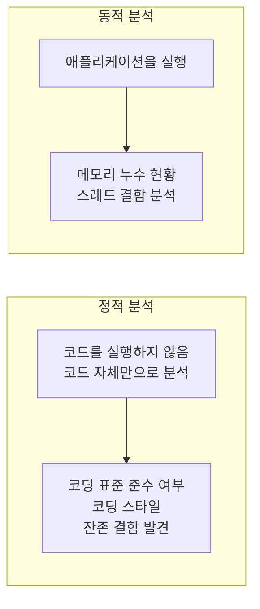

### 5-3. 소스 코드 품질 분석 도구 ![star] 자주 출제

| 구분 | 도구명 | 설명 |
|---|---|---|
| 정적 | pmd | 자바 및 타 언어 소스 코드의 버그, 데드 코드 분석 |
| 정적 | cppcheck | C/C++ 코드의 메모리 누수, 오버플로우 등 분석 |
| 정적 | SonarQube | 소스 코드 품질 통합 플랫폼, 플러그인 확장 가능 |
| 정적 | checkstyle | 자바 코드의 코딩 표준 검사 |
| 정적 | ccm | 다양한 언어의 코드 **복잡도** 분석, 리눅스·맥 CLI 지원 |
| 정적 | cobertura | jcoverage 기반 테스트 **커버리지** 측정 |
| 동적 | Avalanche | Valgrind 프레임워크 및 STP 기반 소프트웨어 에러·취약점 동적 분석 |
| 동적 | Valgrind | 자동화된 메모리 및 스레드 결함 발견 분석 |

> ![star] 동적 분석 도구는 **Avalanche, Valgrind** 딱 2개다. 나머지는 전부 정적이라고 기억하면 편하다.

---

## 6. 맥케이브 회전 복잡도 (McCabe Cyclomatic Complexity)

### 6-1. 개념

소프트웨어의 **제어 흐름을 그래프로 표현**하고 소스 코드의 복잡도를 **정량적**으로 나타내는 지표다.

특징: 정량적 지표, 구조적 평가(실제 동작 이전 상태의 품질 측정), 간접 방식(효율·기능성·품질의 간접적 측정)

### 6-2. 계산식

| 식 | 설명 |
|---|---|
| **V(G) = E − N + 2** | 간선(E) 수와 노드(N) 수로 계산 |
| **V(G) = P + 1** | 조건 분기문(P)의 수로 계산 |

그래프 구성: **Node(원)** = 프로세싱 태스크 표현, **Edge(화살표)** = 태스크 간 제어 흐름 표현

### 6-3. 계산 예제

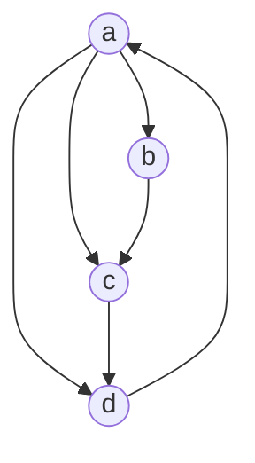

- E(간선 수) = 6, N(노드 수) = 4
- **V(G) = E − N + 2 = 6 − 4 + 2 = 4**

---

## 7. 코드 최적화와 클린 코드

### 7-1. 코드 최적화 개념

소스 코드 최적화는 **읽기 쉽고 변경 및 추가가 쉬운 클린 코드를 작성**하는 것으로, 소스 코드 품질을 위해 지킬 원칙과 기준을 정의한다.

### 7-2. 클린 코드 vs 배드 코드

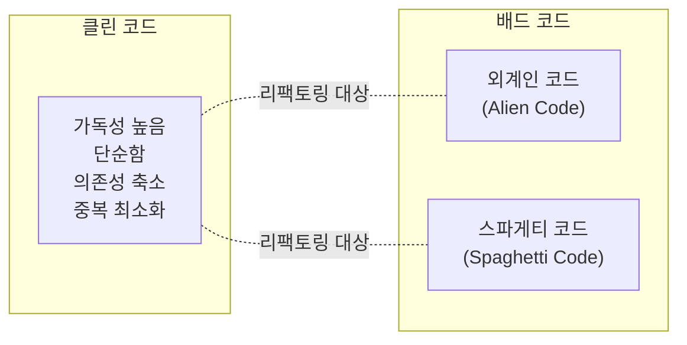

**클린 코드 특징**
- 중복 코드 제거로 애플리케이션 설계가 개선된다
- 가독성이 높아 기능을 쉽게 이해할 수 있다
- **버그**를 찾기 쉬워지고, 프로그래밍 속도가 빨라진다

**배드 코드 유형** ![star] 자주 출제

| 유형 | 설명 |
|---|---|
| 외계인 코드 (Alien Code) | 매우 오래되거나 참고 문서·개발자가 없어 유지보수가 몹시 어려운 코드 |
| 스파게티 코드 (Spaghetti Code) | 소스 코드가 복잡하게 얽힌 모습을 스파게티 면발에 비유. 작동은 정상이지만 읽으면서 동작을 파악하기 어려운 코드 |

### 7-3. 클린 코드 작성 원칙 ![star] 자주 출제

| 작성 원칙 | 설명 |
|---|---|
| 가독성 | 누구든지 읽기 쉽게 작성, 이해하기 쉬운 용어와 들여쓰기 사용 |
| 단순성 | 한 번에 한 가지 처리만 수행, 클래스/메서드/함수를 최소 단위로 분리 |
| 의존성 최소 | 영향도를 최소화, 코드 변경이 다른 부분에 영향 없게 작성 |
| 중복성 제거 | 중복된 코드를 제거, 공통된 코드를 사용 |
| 추상화 | 클래스/메서드/함수에 대해 같은 수준의 추상화 구현, 상세 내용은 하위에서 구현 |

> ![star] 암기 팁: **가단의중추** (가독성·단순성·의존성·중복성·추상화)

### 7-4. 클린 코드 유형

| 유형 | 핵심 내용 |
|---|---|
| 의미 있는 이름 | 의도가 분명한 이름 사용. 클래스는 명사, 함수는 동사로 |
| 간결하고 명확한 주석 | 주석은 간결·명확하게, 변경 이력은 형상 관리 도구 사용 |
| 보기 좋은 배치 | 괄호·들여쓰기로 표현, 빈 줄로 선언부와 구현부 구별, 반복 구문은 **리팩토링** |
| 작은 함수 | 함수는 작게, 함수 하나당 하는 일은 하나만 |
| 읽기 쉬운 제어 흐름 | if/else 조건문에서 긍정적이고 간단한 내용을 앞쪽에 배치 |
| 오류 처리 | 오류 코드 반환보다 **예외 처리** 활용, Null 전달/반환 금지 |
| 클래스 분할 배치 | 클래스는 하나의 역할·책임만 수행하도록 응집도를 높이고 작게 작성 |
| 느슨한 결합 기법 적용 | 인터페이스 클래스를 이용해 클래스 간 의존성 최소화 |
| 코딩 형식 기법 적용 | 줄바꿈으로 개념 구분, 호출하는 함수를 먼저 배치, 지역 변수는 함수 맨 처음에 선언 |

---

## 8. 인터페이스 구현

### 8-1. 인터페이스 기능 확인

인터페이스 기능은 **이기종 시스템 또는 컴포넌트 간 데이터 교환 및 처리**를 위한 기능이다.

- 인터페이스 설계서를 보고 인터페이스 기능을 확인할 수 있다
- 인터페이스 정의서를 통해 외부 및 내부 모듈의 기능을 확인할 수 있다

### 8-2. 데이터 표준 확인

인터페이스 데이터 표준 확인은 상호 연계하려는 시스템 간 **데이터 형식과 표준을 정의**하는 과정이다. 송·수신 데이터 중 공통 영역을 추출해 정의하거나, 한쪽의 데이터를 변환하는 경우가 있다.

---

## 9. EAI와 ESB ![star] 자주 출제

시스템 인터페이스를 위해 외부 및 내부 모듈을 연계하는 대표적인 방법은 **EAI 방식**과 **ESB 방식**이다.

### 9-1. EAI (Enterprise Application Integration)

기업에서 운영되는 서로 다른 플랫폼 및 애플리케이션 간의 **정보 전달, 연계, 통합**을 가능하게 해주는 솔루션이다. 비즈니스 간 통합·연계성을 증대시켜 효율성과 확장성을 높인다.

**EAI 구축 유형 4가지**

**① 포인트 투 포인트 (Point-to-Point)** — 미들웨어 없이 애플리케이션 간 1:1 직접 연결

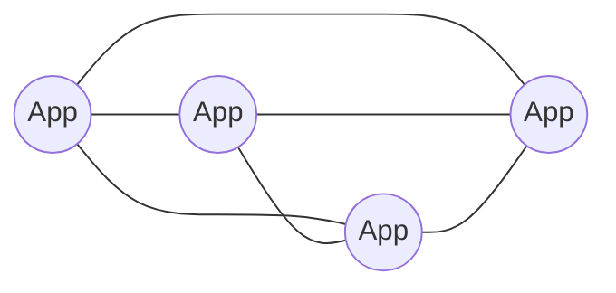

**② 허브 앤 스포크 (Hub & Spoke)** — 단일 허브 시스템을 통한 중앙 집중식. 단, **허브 장애 시 전체 장애 발생**

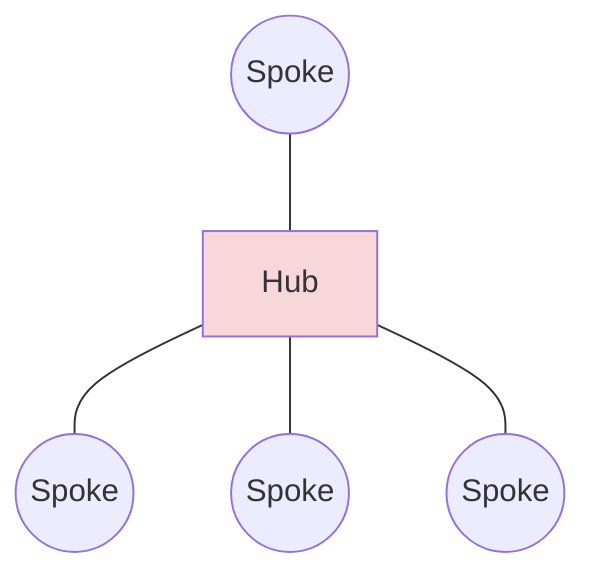

**③ 메시지 버스 (Message Bus)** — 애플리케이션 사이에 미들웨어(버스)를 두어 연계. **뛰어난 확장성, 대용량 데이터 처리 가능**

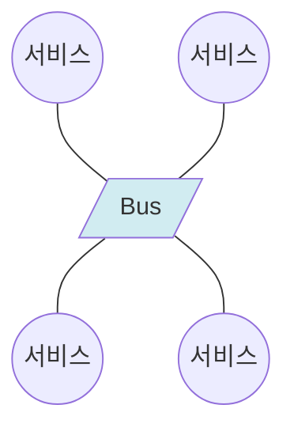

**④ 하이브리드 (Hybrid)** — 그룹 내는 허브 앤 스포크, 그룹 간은 메시지 버스 방식을 사용하는 통합 방식

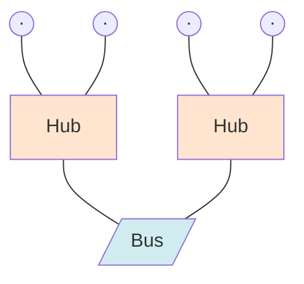

### 9-2. ESB (Enterprise Service Bus)

서로 다른 플랫폼·애플리케이션들을 **하나의 시스템으로 관리 운영**할 수 있도록 **서비스 중심의 통합**을 지향하는 아키텍처 또는 기술이다.

버스를 중심으로 각각의 프로토콜이 호환되도록 애플리케이션 통합을 **낮은 결합(느슨한 결합)** 방식으로 지원한다.

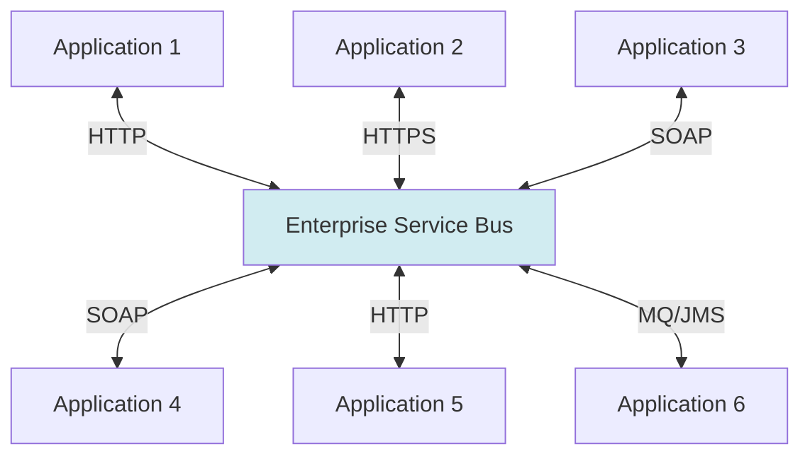

> ![star] EAI는 "애플리케이션 통합", ESB는 "서비스 중심 + 낮은 결합"이 핵심 키워드다.

---

## 10. 인터페이스 데이터 포맷과 교환 기술

### 10-1. 인터페이스 데이터 포맷 (JSON, XML, YAML)

| 포맷 | 설명 |
|---|---|
| JSON (JavaScript Object Notation) | 비동기 브라우저/서버 통신(AJAX)을 위해 "속성-값 쌍", "키-값 쌍"으로 이루어진 데이터 오브젝트를 전달하기 위해 인간이 읽을 수 있는 텍스트를 사용하는 개방형 표준 포맷 |
| XML (eXtensible Markup Language) | W3C에서 개발된, 다른 특수한 목적을 갖는 **마크업 언어**를 만드는 데 사용하도록 권장하는 다목적 마크업 언어 |
| YAML (YAML Ain't Markup Language) | 데이터를 **사람이 쉽게 읽을 수 있는 형태**로 표현하기 위해 사용하는 데이터 직렬화 양식 |

### 10-2. 인터페이스 데이터 교환 기술 (REST, AJAX)

| 기술 | 설명 |
|---|---|
| REST (Representational State Transfer) | 웹과 같은 분산 하이퍼 미디어 환경에서 자원의 존재/상태 정보를 **표준화된 HTTP 메서드**로 주고받는 웹 아키텍처 |
| AJAX (Asynchronous JavaScript and XML) | 자바스크립트를 사용하여 웹 서버와 클라이언트 간 **비동기적**으로 XML 데이터를 교환하고 조작하기 위한 웹 기술 |

---

## 11. 인터페이스 구현 검증 도구 ![star] 자주 출제

인터페이스 구현 검증 도구는 인터페이스 **동작 상태를 검증하고 모니터링**할 수 있는 도구다. 세부 기능을 기능 단위로 테스트하는 단위 테스트와 전체 흐름을 확인하는 시나리오 기반 통합 테스트가 필요하다.

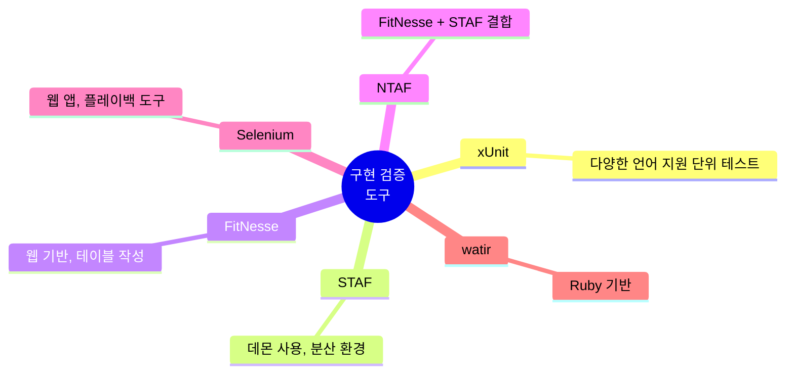

| 도구 | 설명 |
|---|---|
| xUnit | Java(jUnit), C++(cppUnit), .Net(nUnit), Web(httpUnit) 등 **다양한 언어를 지원하는 단위 테스트 프레임워크** |
| STAF | 서비스 호출, 컴포넌트 재사용 등 다양한 환경 지원. 각 테스트 대상 분산 환경에 **데몬**을 사용하여 테스트를 수행·통합·자동화하는 검증 도구 |
| FitNesse | **웹 기반** 테스트 케이스 설계/실행/결과 확인 지원. 사용자가 **테스트 케이스 테이블**을 작성하면 빠르고 편하게 자동 테스트 가능 |
| NTAF | **FitNesse와 STAF의 장점을 결합**한 테스트 자동화 프레임워크 |
| Selenium | 다양한 브라우저·개발 언어를 지원하는 웹 애플리케이션 테스트 프레임워크. 테스트 스크립트 언어를 학습할 필요 없이 기능 테스트를 만드는 **플레이백 도구** 제공 |
| watir | **Ruby 기반** 웹 애플리케이션 테스트 프레임워크. 모든 언어 기반의 웹 앱 테스트와 브라우저 호환성 테스팅 가능 |

> ![star] NTAF = FitNesse + STAF 조합이라는 것, watir = Ruby라는 것이 단골 출제 포인트다.

---

## 12. 인터페이스 보안

### 12-1. 인터페이스 보안의 중요성

인터페이스는 시스템 모듈 간 통신·정보 교환의 중요한 접점이라, 보안 취약성이 시스템에 심각한 피해를 입힐 수 있다.

**인터페이스 보안 취약점**

| 취약점 | 설명 |
|---|---|
| 데이터 통신 시 데이터 탈취 위협 | **스니핑**을 통해 데이터 전송 내역을 감청하여 데이터를 탈취 |
| 데이터 통신 시 데이터 위·변조 위협 | 전송 데이터에 대한 삽입, 삭제, 변조 공격을 통한 시스템 위협 |

### 12-2. 시큐어 코딩 가이드

인터페이스 개발 시 보안 취약점을 방지할 수 있는 시큐어 코딩 가이드에 따른 개발이 필요하다.

| 적용 대상 | 보안 약점 | 대응 방안 |
|---|---|---|
| 입력 데이터 검증 및 표현 | 입력값 검증 누락·부적절한 검증, 잘못된 형식 지정 | 유효성 검증 체계 수립, 실패 시 처리 설계·구현 |
| 보안 기능 | 인증·접근 제어·기밀성·암호화·권한 관리의 부적절한 구현 | 인증·접근 통제·권한 관리·비밀번호 정책을 적절하게 반영 |
| 시간 및 상태 | 병렬 시스템·멀티 프로세스 환경에서 시간·상태의 부적절한 관리 | 공유 자원 접근 직렬화, 병렬 실행 가능 프레임워크 사용, 블록문 내에서만 재귀 함수 호출 |
| 에러 처리 | 에러 미처리·불충분한 처리로 에러 메시지에 중요 정보 포함 | 중요 정보 유출 등 보안 약점이 발생하지 않도록 시스템 설계·구현 |
| 코드 오류 | 개발자가 범할 수 있는 코딩 오류 | 코딩 규칙 도출 후 검증 가능한 스크립트 구성, 경고 순위 최상향 조정 후 경고 메시지 코드 제거 |
| 캡슐화 | 기능성이 불충분한 캡슐화로 인가되지 않은 사용자에게 데이터 누출 | 디버거 코드 제거, 필수 정보 외 클래스 내 private 접근자 지정 |
| API 오용 | 의도된 사용에 반하는 API 사용, 보안에 취약한 API 사용 | 개발 언어별 취약 API 확보, 취약 API 검출 프로그램 사용 |

### 12-3. 데이터베이스 암호화 기법

중요 민감 데이터는 안전성이 검증된 암호화 알고리즘으로 반드시 암호화한다.

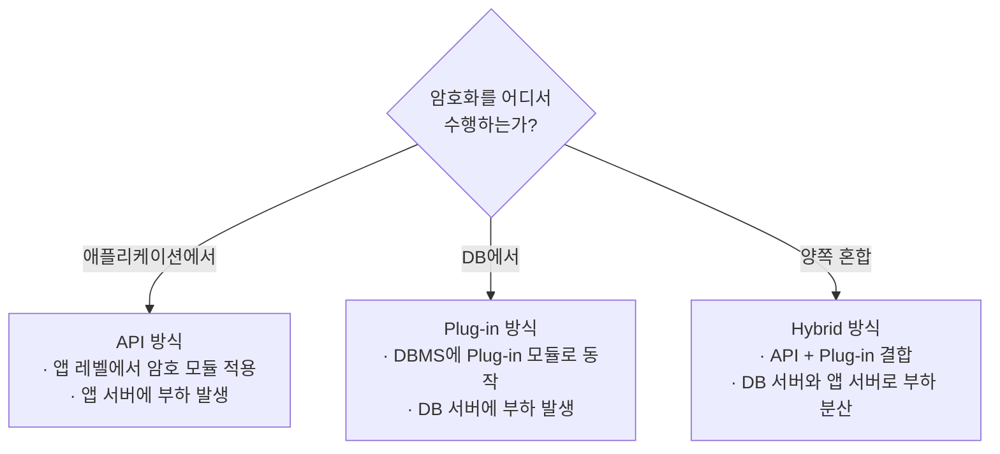

### 12-4. 중요 인터페이스 데이터의 암호화 전송 ![star] 자주 출제

민감한 정보를 통신 채널로 전송할 때는 반드시 암·복호화 과정을 거쳐야 하고, **S-HTTP, IPSec, SSL/TLS** 등 보안 채널을 활용하여 전송한다.

**① S-HTTP (Secure Hypertext Transfer Protocol)**
- 클라이언트와 서버 간 전송되는 **모든 메시지를 각각 암호화**하여 전송
- HTTP를 사용한 애플리케이션에 대해서만 메시지 보호 가능

**② IPSec (IP Security)**
- **IP 계층(3계층)**에서 무결성과 인증을 보장하는 인증헤더(AH)와 기밀성을 보장하는 암호화(ESP)를 이용해 양 종단 간 보안 서비스를 제공하는 **터널링 프로토콜**
- 동작 모드: **전송(Transport) 모드**와 **터널(Tunnel) 모드**
- IPSec 정책에는 SPD, SAD가 있음

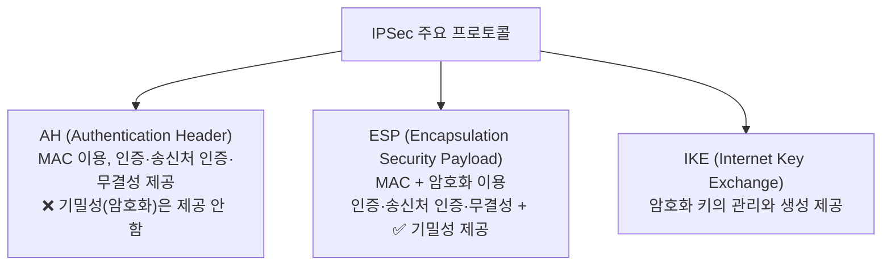

> ![star] AH는 암호화(기밀성) 없음, ESP는 암호화 있음 — 이 차이가 핵심이다.

**③ SSL/TLS**
- **전송계층(4계층)과 응용계층(7계층) 사이**에서 클라이언트-서버 간 웹 데이터 암호화(기밀성), 상호 인증, 전송 시 데이터 무결성을 보장하는 보안 프로토콜
- 인증 모드: 익명 모드, 서버 인증 모드, 클라이언트-서버 인증 모드
- IPSec과 달리 Client-Server 간 상호 인증·암호 방식에 대해 **협상**을 거침
- 대칭 키 암호화, 공개키 암호화, 일방향 해시 함수, 메시지 인증코드 등 특정 암호 기술에 의존하지 않고 다양한 암호 기술 적용
- `https://~` 표시 형식과 **443 포트** 이용

---

## 마무리 요약

```mermaid
mindmap
  root((핵심 요약))
    알고리즘
      설계 기법 4가지
      시간 복잡도 5단계
    검색과 정렬
      이진 검색 M 공식
      정렬별 시간 복잡도
    코드 품질
      정적/동적 분석 도구
      V(G) = E - N + 2
      클린 코드 원칙 5가지
    인터페이스
      EAI 4유형 / ESB
      JSON XML YAML
      REST AJAX
      검증 도구 6종
    보안
      시큐어 코딩 7영역
      DB 암호화 3방식
      S-HTTP IPSec SSL/TLS
```

시험에 자주 나오는 포인트만 다시 짚으면 이렇다.

1. **시간 복잡도**: 퀵 정렬 최악만 O(n²), 삽입 정렬 최적만 O(n)
2. **이진 검색**: M = (F+L)/2, 소수점 버림
3. **맥케이브**: V(G) = E − N + 2 = P + 1
4. **동적 분석 도구**: Avalanche, Valgrind 딱 2개
5. **EAI**: 허브 앤 스포크는 허브 장애 시 전체 장애
6. **NTAF** = FitNesse + STAF, **watir** = Ruby
7. **IPSec**: AH는 기밀성 없음, ESP는 기밀성 있음, SSL/TLS는 443 포트

👉 **[오답노트 — 2과목 소프트웨어 개발](/정처기/wrong-note-part5/)**

[star]: /assets/images/star.png#blog-star-emoji "star"
