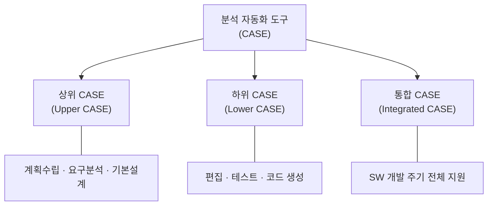
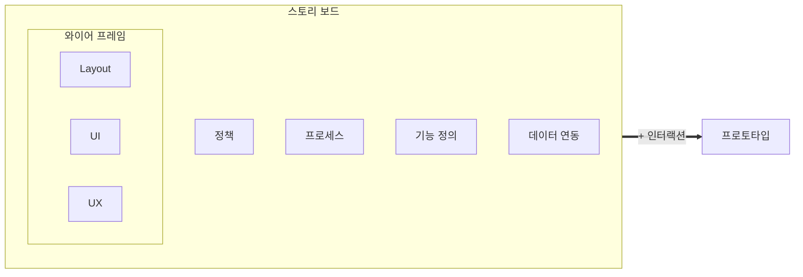

> **기출 빈도 요약** — CASE 도구 주요 기능과 UI 설계 원칙(직·유·학·유)은 반복 출제되는 최상위 빈출이다. UI 유형(CLI/GUI/NUI/OUI)과 화면 설계 도구 4종 구분도 단골이다.

## 1. 분석 모델 확인

### 모델 (Model) <small>(22년 1·3회, 24년 3회, 25년 3회)</small>

모델은 객체, 시스템, 또는 개념에 대한 **구조나 작업을 보여주기 위한 패턴**이다. 개발 대상을 **추상화**하고 기호나 그림 등으로 **시각적으로 표현**한다.

**모델의 특징**

- 모델을 통해 소프트웨어에 대한 **이해도를 향상**할 수 있고, 이해 당사자 간의 **의사소통이 향상**된다.
- 문제가 발생하는 상황에 대한 이해를 높이고 **해결책을 설명**한다.
- 모델을 통해 **향후 개발될 시스템에 대한 유추**가 가능하다.
- 개념 모델은 문제 도메인의 **엔터티(Entity)들과 관계 및 종속성**을 반영한다.

### 모델링 (Modeling)

모델링은 실세계의 물리현상을 특정한 목적에 대응하여 **이용하기 쉬운 형식으로 표현**하는 기법이다.

**모델링의 특징** <small>(21년 3회)</small>

- 개발될 시스템에 대하여 여러 분야의 엔지니어들이 **공통된 개념을 공유**하는 데 도움을 준다.
- 개발팀이 **응용문제를 이해**하는 데 도움을 줄 수 있다.
- 모델링 작업의 결과물은 **다른 모델링 작업에 영향**을 줄 수 있다.

**방법론별 모델링 표기법**

- 절차적인 프로그램을 위한 자료 흐름도는 **프로세스 위주**의 모델링 방법이다.
- **구조적 방법론**: DFD(Data Flow Diagram), DD(Data Dictionary) 등을 사용하여 요구사항의 결과를 표현한다.
- **객체 지향 방법론**: UML 표기법을 사용한다.
- 실세계 문제에 대한 모델링이 소프트웨어 요구사항 분석의 핵심이다.

> 💡 **암기 포인트**: 구조적 = DFD·DD / 객체 지향 = UML. 방법론과 표기법 짝짓기가 출제된다.

## 2. 분석 자동화 도구 (CASE) ★★

### 개념

분석 자동화 도구는 요구사항을 **자동으로 분석**하고, **요구사항 분석 명세서를 기술**하도록 개발된 요구사항 분석을 위한 자동화 도구(**CASE**; Computer Aided Software Engineering)이다.

### 등장 배경

| 관점 | 등장 배경 |
|:---:|---|
| 산업 측면 | 소프트웨어 위기의 극복 대응 방안으로 대두 |
| 관리 측면 | 사용자의 요구사항과 실제 시스템 간의 차이 발생 극복 필요. 시스템의 재사용성, 생산성 및 유지보수의 어려움 극복 필요 |

### 특징 <small>(21년 1·2회, 24년 1회)</small>

| 특징 | 설명 |
|:---:|---|
| 품질 향상 | 표준화 적용과 문서화를 통한 보고를 통해 품질 개선이 가능. 자동화된 기법을 통해 소프트웨어 품질이 향상 |
| 변경 관리 | 변경 사항과 변경으로 인한 영향에 대한 추적이 쉬움 |
| 유지보수 | 소프트웨어 모듈의 재사용성이 향상되고, 유지보수가 용이. 명세에 대한 유지보수 비용의 축소가 가능 |
| 기술적 기반 | 원천 기술로 구조적 기법, 프로토타이핑 기술, 자동프로그래밍 기술, 정보 저장소 기술, 분산 처리 기술을 사용 |

### 분류 <small>(21년 2회)</small>

| 분류 | 설명 |
|:---:|---|
| 상위 CASE (Upper CASE) | 계획수립, 요구분석, 기본설계 단계를 다이어그램으로 표현. 모델들 사이의 모순 검사 및 모델의 오류 검증, 일관성 검증 지원. 자료 흐름도 프로토타이핑 작성 지원 및 UI 설계 지원 |
| 하위 CASE (Lower CASE) | 구문 중심 편집 및 정적, 동적 테스트 지원. 시스템 명세서 생성 및 소스 코드 생성 지원 |

- SW 개발 주기 전체를 지원하는 **통합 CASE**(Integrated CASE)도 있다.

### 주요 기능 <small>(20년 1·4회, 22년 3회, 23년 3회, 24년 2회, 25년 2회)</small>

- **그래픽**을 지원한다.
- 소프트웨어 **생명주기의 전 단계를 연결**한다.
- **다양한 소프트웨어 개발 모형**을 지원한다.
- **표준화된 개발 환경 구축** 및 **문서 자동화** 기능을 제공한다.
- 작업 과정 및 데이터 공유를 통해 작업자 간의 **커뮤니케이션을 증대**한다.

> 💡 CASE 주요 기능 5가지는 기출 횟수가 가장 많은 항목 중 하나다. "그래픽·전 단계 연결·다양한 모형·표준화/문서 자동화·커뮤니케이션"으로 통째로 외운다.

## 3. 요구사항 관리 도구 ★★

### 개념

요구사항 관리 도구는 요구사항을 기반으로 **프로젝트 관리, 설계, 개발, 테스트** 등을 수행할 수 있는 역할을 지원하는 도구이다.

### 필요성 <small>(21년 2회)</small>

| 필요성 | 설명 |
|:---:|---|
| 비용 편익 | 요구사항 변경으로 인한 비용 편익 분석 |
| 변경 추적 | 요구사항 변경의 추적 |
| 영향 평가 | 요구사항 변경에 따른 영향 평가 |

### 기능

요구사항 관리 도구는 **기본 기능, 핵심 기능, 부가 기능**을 제공한다.

| 구분 | 기능 | 설명 |
|:---:|:---:|---|
| 기본 기능 | 프로젝트 생성 | 프로젝트 타입 및 기본 모듈 템플릿. 프로젝트 생성 및 재사용 가능 |
| 기본 기능 | 요구사항 작성 | 요구사항별 고유 ID, 식별자 사용 구분 |
| 기본 기능 | 요구사항 불러오기/내보내기 | .doc, .xls, .html 등 다양한 확장자 제공 |
| 핵심 기능 | 요구사항 이력 관리 | 요구사항별 변경 이력 관리 기능 제공 |
| 핵심 기능 | 요구사항 베이스라인 | 요구사항 확정을 위한 베이스라인 제공 |
| 부가 기능 | 협업 환경 | 요구사항 산출물의 동시 편집 기능 제공 |
| 부가 기능 | 외부 인터페이스 | 형상 관리 도구(SVN, Git)와의 연동 지원 |
| 부가 기능 | 확장성 | API 등을 통한 타 시스템 연동 제공 |

## 4. UI 개요 ★★

### UI(User Interface) 개념

- UI(사용자 인터페이스)는 넓은 의미에서 사용자와 시스템 사이에서 **의사소통할 수 있도록 고안된 물리적, 가상의 매개체**이다.
- 좁은 의미로는 정보 기기나 소프트웨어의 **화면** 등에서 사람이 접하게 되는 화면이다.

### UI 유형 <small>(21년 3회, 22년 2회, 23년 1회, 24년 2회)</small>

| 유형 | 특징 | 설명 |
|:---:|:---:|---|
| CLI (Command Line Interface) | 정적인 텍스트 기반 인터페이스 | 명령어를 텍스트로 입력하여 조작하는 사용자 인터페이스 |
| GUI (Graphical User Interface) | 그래픽 반응 기반 인터페이스 | 그래픽 환경을 기반으로 한 마우스나 전자펜을 이용하는 사용자 인터페이스 |
| NUI (Natural User Interface) | 직관적 사용자 반응 기반 인터페이스 | 사용자가 가진 경험을 기반으로 키보드나 마우스 없이 신체 부위를 이용하는 사용자 인터페이스(터치, 음성 포함) |
| OUI (Organic User Interface) | 유기적 상호 작용 기반 인터페이스 | 입력장치가 곧 출력장치가 되고, 현실에 존재하는 모든 사물이 입출력장치로 변화할 수 있는 사용자 인터페이스 |

> 💡 **구분법**: CLI(텍스트) → GUI(그래픽) → NUI(신체·음성) → OUI(사물 자체). 발전 순서대로 외우면 각 유형의 키워드가 자연스럽게 이어진다.

### UI 특징 <small>(21년 2회, 22년 2회)</small>

| 특징 | 설명 |
|:---:|---|
| 오류 최소화 | 구현하고자 하는 결과의 오류를 최소화 |
| 작업 기능 구체화 | 막연한 작업 기능에 대해 구체적인 방법을 제시 |
| 상호 작용 | 사용자 중심의 상호 작용이 되도록 함 |
| 작업시간 감소 | 사용자의 편의성을 높여 작업시간을 감소시킴 |
| 피드백 제공 | 시스템의 상태와 사용자의 지시에 대한 효과를 보여주어 사용자가 명령에 대한 진행 상황과 표시된 내용을 해석할 수 있도록 도와줌 |

### UI 설계 원칙 <small>(20년 1·2회, 21년 3회, 22년 3회, 25년 2·3회)</small>

| 설계 원칙 | 설명 | 부특성 |
|:---:|---|---|
| 직관성 (Intuitiveness) | 누구나 쉽게 이해하고, 쉽게 사용할 수 있어야 함 | 쉬운 검색, 쉬운 사용성, 일관성 |
| 유효성 (Effectiveness) | 정확하고 완벽하게 사용자의 목표가 달성될 수 있도록 제작 | 쉬운 오류 처리 및 복구 |
| 학습성 (Learnability) | 초보와 숙련자 모두가 쉽게 배우고 사용할 수 있게 제작 | 쉽게 학습, 쉬운 접근, 쉽게 기억 |
| 유연성 (Flexibility) | 사용자의 **인터랙션**을 최대한 포용하고, 실수를 방지할 수 있도록 제작 | 오류 예방, 실수 포용, 오류 감지 |

> 💡 **암기 포인트**: "**직·유·학·유**" 4대 원칙은 최상위 빈출. 특히 각 원칙과 설명을 매칭하는 문제가 자주 나오니 키워드(직관성=쉽게 이해, 유효성=목표 달성, 학습성=배우고, 유연성=실수 방지)를 정확히 구분한다.

### UI 설계 지침 <small>(22년 1·2회, 23년 3회, 24년 1회, 25년 3회)</small>

UI 설계 지침은 사용자 중심, 효율성, 일관성, 단순성, 결과 예측 가능, 가시성, 표준화, 접근성, 명확성, 오류 발생 해결이 있다.

| 설계 지침 | 설명 |
|:---:|---|
| 사용자 중심 | 사용자가 이해하기 쉽고 편하게 사용할 수 있는 환경을 제공할 수 있도록 실사용자에 대한 이해가 바탕이 되어야 함. **심미성보다 사용성을 우선**하여 설계해야 함 |
| 효율성 | 버튼이나 조작 방법을 사용자가 기억하기 쉽고 빠르게 습득할 수 있도록 설계해야 함 |
| 단순성 | 조작 방법은 가장 간단하게 작동되도록 하여 **인지적 부담 최소화** |
| 결과 예측 가능 | 작동시킬 기능만 보고도 결과 예측이 가능해야 함 |
| 가시성 | 주요 기능을 메인 화면에 노출하여 쉬운 조작이 가능해야 함 |
| 표준화 | 디자인을 표준화하여 기능 구조의 선행 학습 이후 쉽게 사용할 수 있어야 함 |
| 접근성 | 사용자의 직무, 나이, 성별 등이 고려된 다양한 계층을 수용해야 함 |
| 명확성 | 사용자가 개념적으로 쉽게 인지해야 함 |
| 오류 발생 해결 | 사용자가 오류에 대한 상황을 정확하게 인지할 수 있어야 함. 오류 메시지는 이해하기 쉬워야 하고, 오류로부터 회복을 위한 자세한 설명이 제공되어야 함. 오류로 인해 발생할 수 있는 부정적인 내용은 적극적으로 사용자들에게 알려야 함. 오류 메시지는 소리나 색 등을 이용하여 사용자가 듣거나, 보도록 하여 의미 전달을 할 수 있어야 함. 발생하는 오류를 쉽게 수정할 수 있어야 하고, 사용자에게 피드백을 제공할 수 있도록 설계해야 함 |

### UI 시스템의 필요 기능 <small>(20년 4회)</small>

- 사용자의 **입력을 검증**한다.
- **에러 처리와 에러 메시지 처리**를 한다.
- **도움(Help)과 프롬프트(Prompt)**를 제공한다.

## 5. UI 화면 설계 ★★

### UI 화면 구성요소 <small>(21년 1회)</small>

UI 화면 구성요소에는 그리드, 버튼/컨트롤 타입, Page 요소, 팝업 요소, Alert 요소가 있다.

| 구성요소 | 설명 |
|:---:|---|
| 그리드 | UI를 구성하는 방법 중 테이블 형태의 UI 요소 |
| 버튼/컨트롤 타입 | 사용자로부터 입력을 받을 수 있도록 콤보 박스, 토글 버튼, 텍스트 박스, 라디오 버튼, 체크 박스로 구성 |
| Page 요소 | 폰트 규정, 아이콘 요소, 체크 박스/라디오 버튼, 말풍선, 이미지 표시, 탭 표시, 스텝 표시, 페이지 이동, 상하 스크롤, 정보입력 등으로 구성 |
| 팝업 요소 | 윈도 팝업, 레이어 팝업 |
| Alert 요소 | 정보 누락/정보 오류 Alert, 업무 처리 완료 Alert, 삭제/수정 Alert, 업무 안내성 Alert |

**버튼/컨트롤 타입 상세**

| 타입 | 설명 |
|:---:|---|
| 콤보 박스 (Combo Box) | 하나의 입력 박스가 있는 상태에서, 박스를 클릭하면 선택할 수 있는 목록이 길게 나타나는 요소 |
| 토글 버튼 (Toggle Button) | 두 가지 상태 중의 하나로 토글 되도록 만든 요소 |
| 텍스트 박스 (Text Field) | 사용자들이 텍스트를 입력할 수 있는 UI 요소로 텍스트 한 줄 또는 여러 줄을 쓸 수 있도록 구성 |
| 라디오 버튼 (Radio Button) | 여러 개 옵션 중 **1개의 옵션**을 선택할 때 사용하는 요소 |
| 체크 박스 (Checkbox) | 여러 개 옵션 중 **1개 이상의 옵션**을 선택할 때 사용하는 요소 |

> 💡 라디오 버튼(1개만) vs 체크 박스(1개 이상) 구분이 함정으로 나온다.

### UI 제스처 <small>(23년 2회, 24년 3회, 25년 1회)</small>

UI 제스처는 탭, 더블 탭, 프레스, 플릭, 스와이프, 팬, 드래그, 핀치, 로테이트 등이 있다.

| 종류 | 설명 |
|:---:|---|
| 탭 (Tap) | 화면을 짧고 가볍게 터치하는 제스처 |
| 더블 탭 (Double Tap) | 화면을 빠르게 두 번 터치하는 제스처 |
| 프레스 (Press) | 화면을 길게 꾹 누르는 제스처 |
| 플릭 (Flick) | 수평 또는 수직 방향으로 빠르게 미는 제스처 |
| 스와이프 (Swipe) | 화면을 터치한 상태로 드래그하는 제스처 |
| 팬 (Pan) | 화면에서 손을 떼지 않고 드래그하는 제스처 |
| 드래그 (Drag) | 화면에서 이미지 등을 끌다가 손을 떼는 제스처 |
| 핀치 (Pinch) | 두 손가락을 터치한 상태에서 손가락 사이를 벌리거나 좁히는 제스처 |
| 로테이트 (Rotate) | 두 손가락을 터치한 상태에서 손가락을 회전하는 제스처 |

### UI 화면 설계 도구 <small>(22년 1회, 23년 2회, 24년 1회, 25년 2회)</small>

UI 화면 설계를 위해서는 **스토리보드, 와이어 프레임, 프로토타입, 목업**이 활용된다.

**스토리보드 · 와이어 프레임 · 프로토타입 관계도** — 와이어 프레임은 스토리보드 안에 포함되며, 스토리보드에 인터랙션이 더해지면 프로토타입이 된다.

| 구분 | 설명 |
|:---:|---|
| 와이어 프레임 (Wireframe) | 이해관계자들과의 화면구성을 협의하거나 서비스의 간략한 흐름을 공유하기 위해 **화면 단위의 레이아웃을 설계**하는 작업 |
| 스토리보드 (Storyboard) | 정책, 프로세스, 콘텐츠 구성, 와이어 프레임(UI, UX), 기능 정의, 데이터베이스 연동 등 **서비스 구축을 위한 모든 정보**가 담겨 있는 설계 산출물 |
| 프로토타입 (Prototype) | 정적인 화면으로 설계된 와이어 프레임 또는 스토리보드에 **동적 효과를 적용**함으로써 실제 구현된 것처럼 **시뮬레이션할 수 있는 모형** |
| 목업 (Mockup) | 디자인, 사용 방법 설명, 평가 등을 위해 실제 화면과 유사하게 만든 **정적인 형태의 모형**. 시각적으로만 구성요소를 배치하는 것으로 일반적으로 **실제로 구현되지는 않음** |

> 💡 **구분 함정**: 프로토타입 = **동적**(시뮬레이션 가능) / 목업 = **정적**(구현 안 됨). "동적 효과"와 "실제로 구현되지 않음"이 각각의 결정적 키워드다.

---

## 📝 오답노트

이 단원의 오답은 별도 포스트에서 관리한다.

👉 **[오답노트 — 1과목 소프트웨어 설계](/정처기/wrong-note-part1/)**
