> **기출 빈도 요약** — UML 구성요소·다이어그램은 거의 매년 출제된다. 애자일 선언문, XP 가치·원리, 스크럼 용어도 단골이다. 괄호 안 연도는 실제 기출 회차다.

## 1. 요구사항 분석이 어려운 이유 <small>(21년 2회)</small>

요구사항 분석은 아래 네 가지 이유로 어렵다.

- 개발자와 사용자 간 **지식·표현의 차이**가 커서 상호 이해가 쉽지 않다.
- 사용자의 요구사항이 **모호하고 불명확**하다.
- 개발 과정 중에 요구사항이 **계속 변할 수 있다**.
- 사용자의 요구는 **예외가 많아** 열거와 구조화가 어렵다.

## 2. UML

### UML의 개념 <small>(22년 1회)</small>

UML(Unified Modeling Language)은 객체 지향 소프트웨어 개발 과정에서 산출물을 **명세화, 시각화, 문서화**할 때 사용되는 모델링 기술과 방법론을 통합해 만든 **표준화된 범용 모델링 언어**다.

> ![star] **암기 포인트**: "명세화·시각화·문서화" 세 단어는 서술형으로 그대로 물어본다.

### UML의 특징

UML은 방법론을 통합한 것으로, 표준화된 모델링 기법을 제공한다.

| 특징 | 설명 |
|---|---|
| **가**시화 언어 | 개념 모델 작성 시 오류가 적고 의사소통이 용이하다 |
| **구**축 언어 | 다양한 프로그래밍 언어로 실행 시스템 예측이 가능하다. UML을 소스 코드로 변환해 구축할 수 있고, 역 변환하여 역공학도 가능하다 |
| **명**세화 언어 | 정확한 모델을 제시하고 완전한 모델을 작성할 수 있다 |
| **문**서화 언어 | 시스템에 대한 평가 및 의사소통의 문서 역할을 한다 |

### UML 구성요소 <small>(20년 4회, 22년 3회, 23년 1회, 24년 2·3회, 25년 2·3회)</small>

UML은 **사물, 관계, 다이어그램**으로 구성된다.

| 구성요소 | 설명 |
|---|---|
| **사**물 (Things) | 추상적인 개념으로, 주제를 나타내는 요소. 단어 관점에서 '명사' 또는 '동사'를 의미한다 |
| **관**계 (Relationships) | 사물의 의미를 확장하고 명확히 하는 요소. 사물과 사물을 연결하여 관계를 표현한다. 단어 관점에서 '형용사' 또는 '부사'를 의미한다 |
| **다**이어그램 (Diagrams) | 사물과 관계를 모아 그림으로 표현한 형태. 형식과 목적에 따라 9가지로 정의된다 |

> ![star] **암기 포인트**: "사·관·다" — 명사/동사(사물), 형용사/부사(관계) 대응까지 세트로 외운다.

### UML 사물 <small>(23년 1회, 25년 3회)</small>

| 종류 | 설명 | 예시 |
|---|---|---|
| **구**조 사물 (Structural) | UML 모델의 **정적인** 부분을 정의. 시스템의 물리적·개념적 요소를 표현 | 클래스, 유스케이스, 컴포넌트, 노드 |
| **행**동 사물 (Behavioral) | UML 모델의 **동적인** 부분을 표현. 시간과 공간에 따른 요소들의 행위를 표현 | 상호 작용, 상태 머신 |
| **그**룹 사물 (Grouping) | UML 모델의 요소들을 그룹으로 묶어서 표현 | 패키지 |
| **주**해 사물 (Annotational) | UML 모델을 설명(주석). 부가 설명이나 제약조건을 표현 | 노트 |

### UML 다이어그램 <small>(20년 4회, 21년 1·2·3회, 22년 1·2회, 24년 1·2회, 25년 3회)</small>

UML 다이어그램은 사물과 관계를 모아 그림으로 표현한 형태다. 구분에 따라 **구조적(정적) 다이어그램**과 **행위적(동적) 다이어그램**으로 나뉜다.

- 컴포넌트, 배치 다이어그램은 **구현 단계**에서 사용된다.

## 3. 주요 다이어그램

### 유스케이스 다이어그램 <small>(21년 2회, 22년 2회, 24년 1회)</small>

시스템이 제공하는 기능 및 그와 관련된 외부 요소를 **사용자의 관점**에서 표현하는 다이어그램이다.

#### 구성요소

| 구성요소 | 설명 | 표기 |
|---|---|:---:|
| 유스케이스 (Usecase) | 시스템이 제공해야 하는 서비스. 액터가 시스템을 통해 수행하는 일련의 행위 | 타원형 안에 텍스트 |
| 액터 (Actor) | 시스템과 상호 작용하는 사람 또는 사물. 물리적인 사람·조직명보다 **역할 중심으로 추상화**하여 정의한다. 필수 항목 중심으로 최소화한다. 하나의 액터는 여러 유스케이스와 상호 작용 가능 | |
| 시스템 (System) | 전체 시스템의 영역을 표현 | 큰 사각형 상자 |

**전체 구조 예시** — 액터(학생)가 System 안의 유스케이스들과 연결된다. 

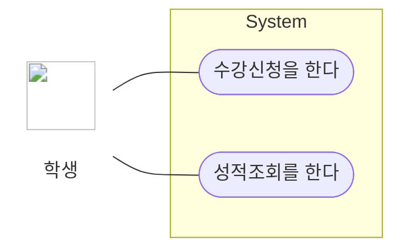

#### 구성요소 간의 관계

| 관계 | 설명 | 표기 |
|---|---|:---:|
| 연관 (Association) | 유스케이스와 액터 간 상호 작용이 있음을 표현 | 실선 |
| 포함 (Include) | 하나의 유스케이스가 다른 유스케이스의 실행을 **전제**로 할 때 형성 | 점선 화살표 + `<<include>>` |
| 확장 (Extend) | **특정 조건에 따라** 확장 기능 유스케이스를 수행 | 점선 화살표 + `<<extend>>` |
| 일반화 (Generalization) | 유사한 유스케이스·액터를 모아 추상화한 것과 연결해 그룹을 만들어 이해도를 높임 | 속이 빈 삼각형 화살표 |

**포함(Include)** — 주문은 반드시 사용자확인을 실행한다. 화살표는 **필수 실행되는 쪽으로** 향한다.

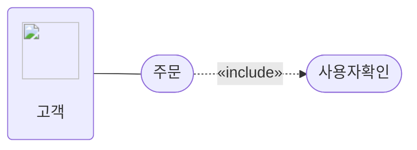

**확장(Extend)** — 파일첨부는 조건에 따라 실행될 수도, 안 될 수도 있다. 화살표는 **기본 유스케이스 쪽으로** 향한다(포함과 반대 방향).

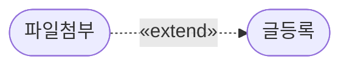

**일반화(Generalization)** — 회원·비회원 액터를 '고객'으로 추상화.

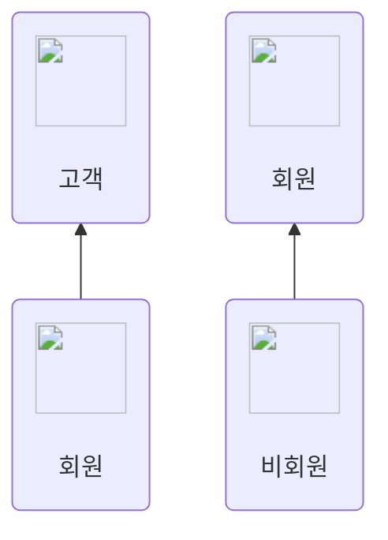

> ![star] **포함 vs 확장 구분법**: 포함은 "반드시 실행"(필수), 확장은 "실행할 수도 있음"(선택). **화살표 방향이 서로 반대**인 것도 자주 출제된다.

### 시퀀스 다이어그램

객체 간 상호 작용을 **메시지 흐름**으로 표현한 다이어그램이다. 순차 다이어그램이라고도 하며, **동적 다이어그램**으로 구분된다.

| 구성요소 | 설명 | 표기 |
|---|---|:---:|
| 객체 (Object) | 위쪽에 표시되며 아래로 생명선을 가짐. 사각형 안에 **밑줄 친 이름**으로 명시 | 사각형 + 밑줄 이름 |
| 생명선 (Lifeline) | 객체로부터 뻗어 나가는 점선. 객체의 생명주기 동안 발생하는 이벤트를 명시 | 세로 점선 |
| 실행 (Activation) | 오퍼레이션(함수)이 실행되는 시간. 길어질수록 수행 시간이 김 | 세로로 긴 직사각형 |
| 메시지 (Message) | 한 객체에서 다른 객체로 메시지를 전달하여 오퍼레이션을 수행 | 실선 화살표 |
| 회귀 메시지 (Self-Message) | 같은 객체의 함수(메서드)를 호출. 본인의 Lifeline으로 회귀 | 스스로에게 꺾여 돌아오는 화살표 |

**예시** — 세로 점선이 생명선, 좁은 직사각형이 실행(Activation), 서버가 자기 자신에게 보내는 것이 회귀 메시지다.

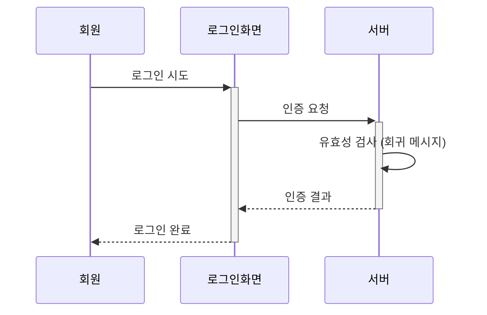

### 상태 다이어그램 <small>(23년 2회, 25년 1회)</small>

하나의 객체가 자신이 속한 클래스의 상태 변화 혹은 다른 객체와의 상호 작용에 따라 **상태가 어떻게 변화하는지** 표현하는 다이어그램이다.

| 구성요소 | 설명 | 표기 |
|---|---|:---:|
| 상태 (State) | 객체가 존재할 수 있는 조건 | 둥근 사각형 |
| 시작 상태 (Initial State) | 객체의 시작 상태 | 속이 채워진 원 ● |
| 종료 상태 (Final State) | 객체의 종료 상태 | 원 안에 채워진 원 ◉ |
| 전이 (Transition) | 객체의 상태가 다른 상태로 변경 | 화살표 |
| 이벤트 (Event) | 상태의 변화를 주는 현상. 전이 위에 이벤트 이름 표시. 예: 시간의 흐름, 조건, 외부 신호 | 전이 위 텍스트 |
| 전이 조건 (Transition Condition) | 특정 조건 만족 시 전이가 발생하도록 하는 속성값의 불린 식 | 전이 위 [대괄호] |

**예시** — ●가 시작 상태, ◉가 종료 상태. 화살표 위 텍스트가 이벤트, `[대괄호]`가 전이 조건이다.

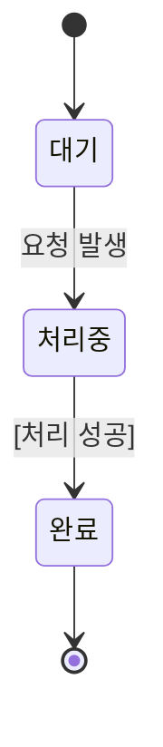

## 4. UML의 관계 <small>(20년 3회, 21년 2·3회, 24년 3회)</small>

사물과 사물 사이의 연관성을 표현한다. 연관, 의존, 일반화, 실체화, 포함, 집합 관계가 있다.

| 구분 | 설명 |
|---|---|
| 연관 (Association) | 2개 이상의 사물이 서로 관련된 상태. 실선으로 연결하고 방향성은 화살표로 표현. **양방향이면 화살표 생략**, 실선만 연결 |
| 의존 (Dependency) | 필요에 따라 **짧은 시간 동안만** 연관을 유지. 한 클래스가 다른 클래스를 오퍼레이션의 매개변수로 사용할 때 나타남. 영향을 주는 쪽에서 받는 쪽으로 **점선 화살표** |
| 일반화 (Generalization) | 하나의 사물이 다른 사물보다 더 일반적인지 구체적인지 표현. 일반적 개념이 부모(상위), 구체적 개념이 자식(하위). **하위 → 상위** 방향으로 속이 빈 화살표 |
| 실체화 (Realization) | 한 객체가 다른 객체에 오퍼레이션을 수행하도록 지정. 사물에서 기능 쪽으로 속이 빈 **점선** 화살표 |
| 포함 (Composition) | 집합 관계의 특수한 형태. 포함하는 사물의 변화가 포함되는 사물에 **영향을 미침**. 부분 → 전체 방향으로 **속이 채워진 마름모** ◆ |
| 집합 (Aggregation) | 하나의 사물이 다른 사물에 포함된 관계. 부분 → 전체 방향으로 **속이 빈 마름모** ◇ |

**연관 · 의존 · 일반화**

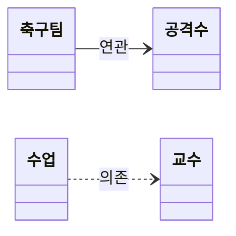

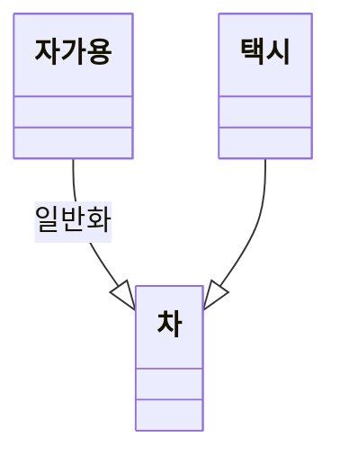

**실체화 · 포함 · 집합**

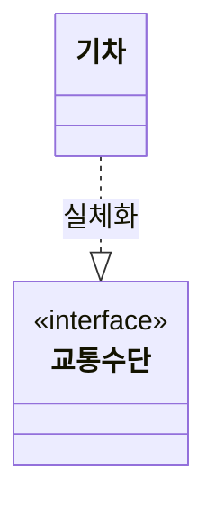

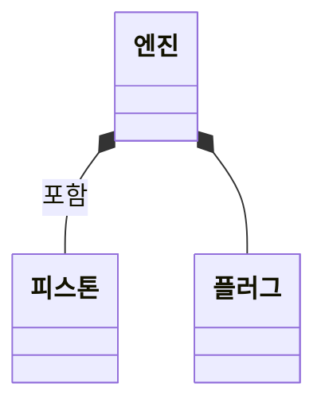

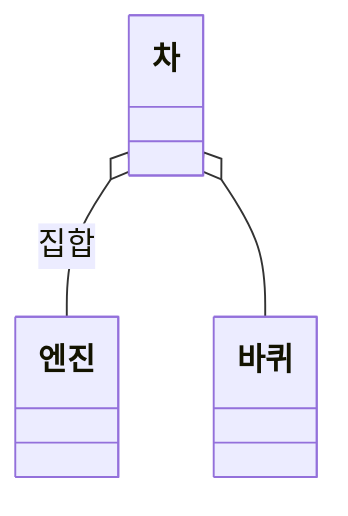

> ![star] **포함 vs 집합**: 엔진-피스톤(포함, 생명주기 공유)과 차-엔진(집합, 독립적 존재 가능)의 예시로 구분한다. 마름모가 **채워졌으면 포함(◆), 비었으면 집합(◇)**.

## 5. UML 확장 모델의 스테레오 타입 <small>(20년 1회, 21년 1회, 25년 1회)</small>

스테레오 타입은 UML의 기본 요소 이외의 **새로운 요소를 만들어 내기 위한 확장 메커니즘**이다. 형태는 기존 UML 요소를 그대로 사용하지만, 내부 의미는 다른 목적으로 확장한다. `<< >>` **길러멧(Guillemet)** 기호를 사용한다.

| 타입 | 설명 |
|:---:|---|
| `<<include>>` | 하나의 유스케이스가 어떤 시점에 **반드시** 다른 유스케이스를 실행하는 포함 관계 |
| `<<extend>>` | 하나의 유스케이스가 다른 유스케이스를 실행**할 수도, 안 할 수도** 있는 확장 관계. 기본 유스케이스 수행 시 특별한 조건을 만족할 때 수행 |
| `<<interface>>` | 모든 메서드가 추상 메서드이며 바로 인스턴스를 만들 수 없는 클래스. 추상 메서드와 상수만으로 구성 |

> ![star] "길러멧"이라는 기호 명칭 자체가 단답형으로 출제된 적 있다.

## 6. 애자일(Agile) 방법론 ★★★

### 개념

애자일 방법론은 개발과 함께 **즉시 피드백**을 받아 **유동적으로 개발**하는 소프트웨어 개발방법론이다.

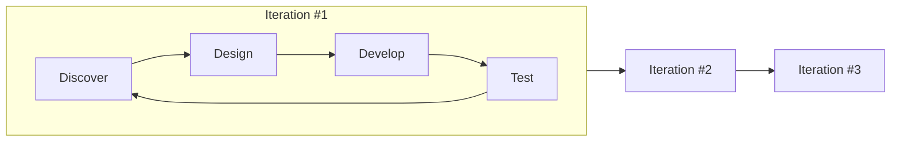

### 등장 배경

| 등장 배경 | 설명 |
|:---:|---|
| 소프트웨어 개발 환경의 변화 | 개발 트렌드가 모바일 환경으로 변화. 시장 적시성과 잦은 배포의 중요성 부각 |
| 기존 개발방법론의 한계 | 전통적 방법론은 문서·절차 위주로 변화에 신속한 대응이 어려움. 빠르고 효율적인 방법론의 필요성 증가 |

### 특징 <small>(20년 3·4회, 22년 2회)</small>

- 프로젝트의 요구사항은 **기능 중심**으로 정의한다.
- 절차와 도구보다 **개인과 소통**을 중요하게 생각한다.
- 작업 계획을 짧게 세워 **요구 변화에 유연하고 신속하게** 대응한다.
- 소프트웨어가 **잘 실행되는 데** 가치를 둔다.
- **고객과의 피드백**을 중요하게 생각한다.

### 애자일 선언문 <small>(21년 1·3회, 22년 1회, 24년 2회, 25년 3회)</small>

애자일 방법론을 실천하기 위한 주요 원칙이다. **"~보다 ~"의 대응 쌍**을 정확히 외워야 한다.

| ~보다 | ~를 |
|---|---|
| 공정과 도구보다 | **개인과 상호 작용** |
| 포괄적인 문서보다 | **동작하는 소프트웨어** |
| 계약 협상보다 | **고객과의 협력** |
| 계획을 따르기보다 | **변화에 대응하기** |

## 7. 애자일 방법론 유형 <small>(20년 2·4회, 21년 3회, 22년 2회, 24년 1·2·3회)</small>

대표적으로 **XP, 스크럼(SCRUM), 린(Lean), 크리스탈(Crystal), ASD, FDD** 등이 있다.

### XP (eXtreme Programming)

- **의사소통 개선과 즉각적 피드백**으로 소프트웨어 품질을 높이기 위한 방법론이다.
- 기존 방법론에 비해 **실용성**을 강조한다.
- **1~3주의 반복(Iteration) 개발 주기**를 가지며, **5가지 가치와 12개의 실천 항목**이 존재한다.

#### XP의 5가지 가치

| 가치 | 설명 |
|---|---|
| 용기 (Courage) | 용기를 가지고 자신감 있게 개발한다. 코드 작성 전 테스트, 빠른 피드백, 테스트에 부합하지 못하는 코드를 리팩토링할 수 있는 용기 |
| 단순성 (Simplicity) | 필요한 것만 하고 그 이상의 것들은 하지 않는다 |
| 의사소통 (Communication) | 개발자, 관리자, 고객 간의 원활한 소통 |
| 피드백 (Feedback) | 의사소통에 대한 빠른 피드백 |
| 존중 (Respect) | 팀원 간의 상호 존중 |

> ![star] 5가지 세트는 "**용·단·의·피·존**"으로 암기.

#### XP의 12가지 기본원리

| 기본원리 | 설명 |
|---|---|
| 짝 프로그래밍 (Pair Programming) | 개발자 둘이서 짝으로 코딩하는 원리 |
| 공동 코드 소유 (Collective Ownership) | 시스템에 있는 코드는 누구든지 언제라도 수정 가능하다는 원리 |
| 지속적인 통합 (CI; Continuous Integration) | 매일 여러 번씩 소프트웨어를 통합하고 빌드해야 한다는 원리 |
| 계획 세우기 (Planning Process) | 고객이 요구하는 비즈니스 가치를 정의하고, 개발자가 필요한 것은 무엇이며 어떤 부분에서 지연될 수 있는지를 알려주어야 한다는 원리 |
| 작은 릴리즈 (Small Release) | 작은 시스템을 먼저 만들고, 짧은 단위로 업데이트한다는 원리 |
| 메타포어 (Metaphor) | 공통적인 이름 체계와 시스템 서술서를 통해 고객과 개발자 간의 의사소통을 원활하게 한다는 원리 |
| 간단한 디자인 (Simple Design) | 현재의 요구사항에 적합한 가장 단순한 시스템을 설계한다는 원리 |
| 테스트 기반 개발 (TDD; Test Driven Development) | 작성해야 하는 프로그램에 대한 테스트를 먼저 수행하고, 이 테스트를 통과할 수 있도록 실제 프로그램의 코드를 작성한다는 원리 |
| 리팩토링 (Refactoring) | 프로그램의 기능을 바꾸지 않으면서 중복 제거, 단순화 등을 통해 코드의 내부 구조를 개선하고 재구성하는 원리 |
| 40시간 작업 (40-Hour Work) | 개발자가 피곤으로 인해 실수하지 않도록 일주일에 40시간 이상을 일하지 말아야 한다는 원리 |
| 고객 상주 (On Site Customer) | 개발자들의 질문에 즉각 대답해 줄 수 있는 고객을 프로젝트에 풀 타임으로 상주시켜야 한다는 원리 |
| 코드 표준 (Coding Standard) | 효과적인 공동 작업을 위해서는 모든 코드에 대한 코딩 표준을 정의해야 한다는 원리 |

### 스크럼 (SCRUM) <small>(22년 1회, 23년 1회, 24년 3회, 25년 2회)</small>

스크럼은 **매일 정해진 시간, 장소에서 짧은 시간의 개발을 하는 팀**을 위한 **프로젝트 관리 중심** 방법론이다.

#### 스크럼 주요 용어

| 주요 용어 | 설명 |
|---|---|
| 제품 책임자 (Product Owner) | 이해관계자의 의견을 종합하여 제품에 대한 **요구사항을 작성하는 주체**. 주로 개발 의뢰자나 사용자가 담당. 이해관계자 중 개발될 제품에 대한 이해도가 높고, 요구사항을 책임지고 의사 결정할 사람으로 선정 |
| 제품 백로그 (Product Backlog) | 제품과 프로젝트에 대한 **모든 요구사항**. 스크럼 팀이 해결해야 하는 목록으로 소프트웨어 요구사항, 아키텍처 정의 등이 포함될 수 있음 |
| 스프린트 (Sprint) | **실제 개발 작업 기간**. 2~4주의 짧은 개발 기간으로 되어 있고, 반복적 수행으로 개발 품질 향상 |
| 스크럼 미팅 (Scrum Meeting) | **매일 15분 정도** 미팅으로 To-Do List 계획수립. 데일리 미팅(Daily Meeting)이라고도 함 |
| 스크럼 마스터 (Scrum Master) | **프로젝트 리더**. 스크럼 수행 시 문제를 인지 및 해결하는 사람. 스크럼 프로세스를 따르고, 팀이 스크럼을 효과적으로 활용할 수 있도록 보장하는 역할 |
| 스프린트 회고 (Sprint Retrospective) | 스프린트 주기를 되돌아보며 정해놓은 **규칙 준수 여부, 개선점** 등을 확인 및 기록. 해당 스프린트가 끝난 시점이나 일정 주기로 시행 |
| 번 다운 차트 (Burn Down Chart) | **남아있는 백로그 대비 시간**을 그래픽적으로 표현한 차트. 백로그는 보통 수직축, 시간은 수평축 |
| 속도 (Velocity) | 한 번의 스프린트에서 한 팀이 어느 정도의 제품 백로그를 감당할 수 있는지에 대한 **추정치** |

> ![star] 스크럼 용어는 "역할(책임자·마스터) / 산출물(백로그·차트) / 활동(스프린트·미팅·회고)"으로 묶어서 외우면 안 헷갈린다.

### 린 (Lean)

- **도요타의 린 시스템 품질 기법**을 소프트웨어 개발 프로세스에 적용해서 **낭비 요소를 제거**하여 품질을 향상시킨 방법론이다.
- 린은 **JIT(Just In Time), 칸반 보드**를 사용한다.

### 크리스탈 (Crystal)

- 일반적으로 프로세스나 도구보다 **사람에게 더 많은 중점**을 두는 방법론이다.
- 생명이 중요하지 않은 시스템에서 작업하는 **최대 6명 또는 8명**의 공동 배치 소프트웨어 개발자 팀에 적용한다.

### ASD (Adaptive Software Development)

- 개발을 **혼란 자체로 규정**하고, 혼란을 대전제로 그에 적응할 수 있는 소프트웨어 방법을 제시하는 방법론이다.
- **합동 애플리케이션 개발**(Joint Application Development)을 사용한다.

### FDD (Feature Driven Development; 기능 중심 개발)

- 프로젝트를 **작은 기능 단위**로 나누어 개발하고, 빠른 피드백과 지속적인 개선을 추구하는 방법론이다.

---

## 📝 오답노트

이 단원의 오답은 별도 포스트에서 관리한다.

👉 **[오답노트 — 1과목 소프트웨어 설계](/정보처리기사/wrong-note-part1/)**

[star]: /assets/images/star.png#blog-star-emoji "star"
