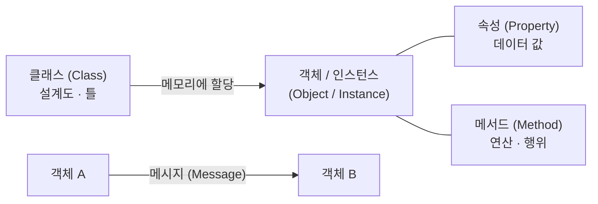
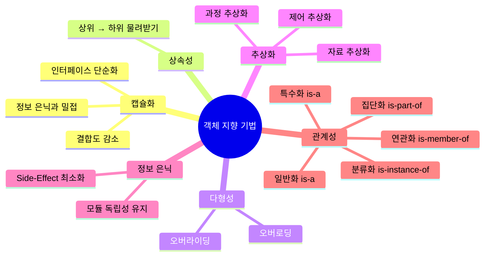
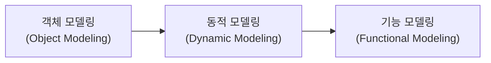
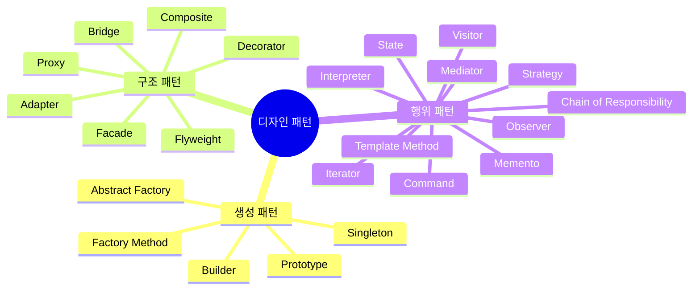
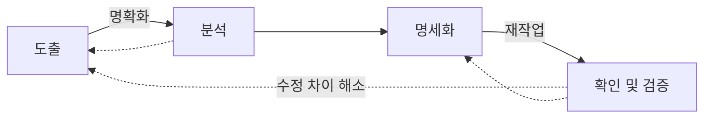
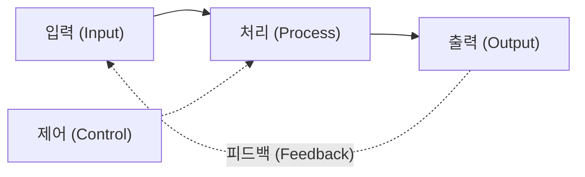
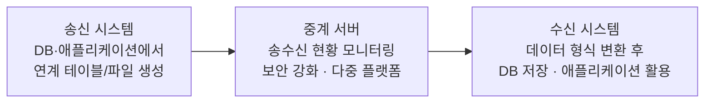
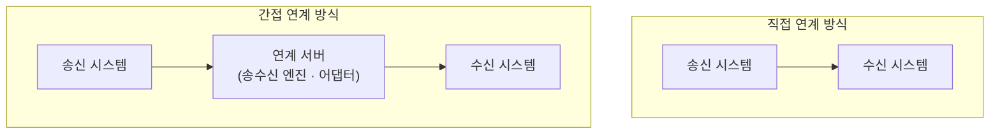
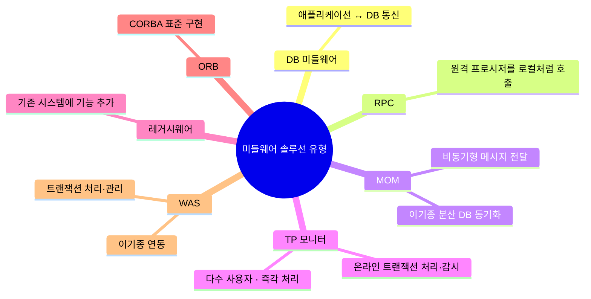

# 정보처리기사 정리 — 객체 지향 설계 · 디자인 패턴 · 인터페이스 설계

정보처리기사 필기 시험에서 출제 빈도가 높은 객체 지향 설계, 디자인 패턴, 인터페이스 설계 파트를 한 번에 정리한다. 특히 객체 지향 기법과 디자인 패턴 종류는 거의 매 회차 출제되는 핵심 중의 핵심이니 반복해서 봐두는 것이 좋다.

---

## 1. 객체 지향 설계

### 1-1. 객체 지향(Object Oriented) 개념

객체 지향은 실세계의 개체를 **속성과 메서드가 결합한 형태의 객체**로 표현하는 기법이다.

### 1-2. 객체 지향 구성요소 ![star] 자주 출제

| 구성요소 | 설명 |
|---|---|
| **클래스 (Class)** | 특정 객체 내에 있는 변수와 메서드를 정의하는 일종의 틀. 객체 지향 프로그래밍에서 데이터를 추상화하는 단위이며, 하나 이상의 유사한 객체들을 묶어 하나의 공통된 특성을 표현한다. 속성은 변수 형태로, 행위는 메서드 형태로 선언한다. |
| **객체 (Object)** | 물리적·추상적으로 자신과 다른 것을 식별 가능한 대상. 클래스에서 정의한 것을 토대로 메모리에 할당되며, 객체마다 각각의 상태와 식별성을 가진다. |
| **메서드 (Method)** | 클래스로부터 생성된 객체를 사용하는 방법. 객체가 메시지를 받아 실행해야 할 객체의 구체적인 연산으로, 전통적 시스템의 함수(Function) 또는 프로시저(Procedure)에 해당하는 연산 기능이다. |
| **메시지 (Message)** | 객체 간 상호 작용을 하기 위한 수단이며, 객체에게 어떤 행위를 하도록 지시하는 방법이다. 객체 간의 상호 작용은 메시지를 통해 이루어지고, 메시지는 객체에서 객체로 전달된다. |
| **인스턴스 (Instance)** | 객체 지향 기법에서 클래스를 통해 만든 실제의 실형 객체. 클래스에 속한 각각의 객체이며, 실제로 메모리상에 할당된다. |
| **속성 (Property)** | 한 클래스 내에 속한 객체들이 가지고 있는 데이터 값들을 단위별로 정의한 것. 성질, 분류, 식별, 수량, 현재 상태 등에 대한 표현 값이다. |



### 1-3. 객체 지향 기법 ![star]![star]![star] 최다 출제

객체 지향의 핵심 기법으로 캡슐화, 상속성, 다형성, 추상화, 정보 은닉, 관계성이 있다.

#### 캡슐화 (Encapsulation)

- 서로 연관된 데이터와 함수를 함께 묶어 외부와 경계를 만들고, 필요한 인터페이스만을 밖으로 드러내는 기법이다.
- 결합도가 낮아지고 재사용이 용이하다.
- 인터페이스가 단순화된다.
- 정보 은닉과 관계가 깊다.
- 변경 발생 시 오류의 파급 효과가 적다.

#### 상속성 (Inheritance)

- 상위 클래스의 속성과 메서드를 하위 클래스에서 재정의 없이 물려받아 사용하는 기법이다.

#### 다형성 (Polymorphism)

- 하나의 메시지에 대해 각 객체가 가지고 있는 고유한 방법으로 응답할 수 있는 능력이다.
- 상속받은 여러 개의 하위 객체들이 다른 형태의 특성을 갖는 객체로 이용될 수 있는 성질이다.
- 대표적으로 **오버로딩**과 **오버라이딩**이 있다.

| 오버로딩 (Overloading) | 오버라이딩 (Overriding) |
|---|---|
| 매개변수의 유형과 개수를 다르게 하여 같은 이름의 메서드를 여러 개 가지는 기법 | 상위 클래스에서 정의한 일반 메서드의 구현을 하위 클래스에서 무시하고 재정의하는 기법 |

```java
// 오버로딩 — 같은 이름, 다른 매개변수
void fn(int a);
void fn(char a);
void fn(int a, int b);

// 오버라이딩 — 상속 후 재정의
class A {
    void fn(int a);
}
class B extends A {
    void fn(int a);   // 부모의 메서드를 재정의
}
```

#### 추상화 (Abstraction)

- 공통 성질을 추출하여 추상 클래스를 설정하는 기법이다.
- 종류로는 과정 추상화, 자료 추상화, 제어 추상화가 있다.

#### 정보 은닉 (Information Hiding)

- 코드 내부 데이터와 메서드를 숨기고 공개 인터페이스를 통해서만 접근이 가능하도록 하는 코드 보안 기술이다.
- 필요하지 않은 정보는 접근할 수 없도록 하여 한 모듈 또는 하부 시스템이 다른 모듈의 구현에 영향을 받지 않게 설계된다. (고려되지 않은 영향인 Side-Effect를 최소화)
- 모듈 내부의 자료 구조와 접근 동작들에만 수정을 국한하지 않기 때문에 요구사항 등 변화에 따른 수정이 가능하다.
- 모듈 사이의 독립성을 유지하는 데 도움을 준다.
- 설계에서 은닉되어야 할 기본 정보로는 IP 주소와 같은 물리적 코드, 상세 데이터 구조 등이 있다.

#### 관계성 (Relationship)

두 개 이상의 엔터티 형에서 데이터를 참조하는 관계를 나타내는 기법이다. 종류로는 연관화, 분류화, 집단화, 일반화, 특수화가 있다.

| 관계성 종류 | 관계 | 설명 |
|---|---|---|
| **연관화** | is-member-of | 클래스와 객체의 참조 및 이용 관계. 같은 계층에 속하는 클래스들 사이의 상호 의존성을 보여주는 비 계층적 관계성 |
| **집단화** | is-part-of, part-whole | 서로 관련 있는 여러 개의 객체를 묶어 한 개의 상위 객체를 만드는 특징. 일반화와 달리 상위 클래스의 성질들이 하위 클래스로 상속되지는 않음 |
| **분류화** | is-instance-of | 공통된 속성에 의해 정의된 객체 구성원들의 인스턴스 |
| **일반화** | is-a | 클래스들 간의 개념적인 포함 관계. 상위 클래스의 특성을 하위 클래스가 상속받음 |
| **특수화** | is-a | 상위 클래스의 특성들을 상속받으면서 하위 클래스에서 나름대로 수정을 가하고 자기 자신의 고유한 특성을 갖는 관계 |



### 1-4. 객체 지향 설계 원칙 (SOLID) ![star] 자주 출제

| 원칙 | 설명 |
|---|---|
| **단일 책임의 원칙 (SRP; Single Responsibility Principle)** | 하나의 클래스는 하나의 목적을 위해서 생성되며, 클래스가 제공하는 모든 서비스는 하나의 책임을 수행하는 데 집중되어야 한다는 원칙. 객체 지향 프로그래밍 5원칙 중 나머지 4원칙의 기초 원칙이다. |
| **개방 폐쇄 원칙 (OCP; Open Close Principle)** | 소프트웨어의 구성요소(컴포넌트, 클래스, 모듈, 함수)는 확장에는 열려 있고, 변경에는 닫혀 있어야 한다는 원칙 |
| **리스코프 치환의 원칙 (LSP; Liskov Substitution Principle)** | 서브 타입(상속받은 하위 클래스)은 어디서나 자신의 기반 타입(상위 클래스)으로 교체할 수 있어야 한다는 원칙 |
| **인터페이스 분리의 원칙 (ISP; Interface Segregation Principle)** | 한 클래스는 자신이 사용하지 않는 인터페이스는 구현하지 말아야 하며, 클라이언트가 사용하지 않는 인터페이스 때문에 영향을 받아서는 안 된다는 원칙 |
| **의존성 역전의 원칙 (DIP; Dependency Inversion Principle)** | 실제 사용 관계는 바뀌지 않으며, 추상을 매개로 메시지를 주고받음으로써 관계를 최대한 느슨하게 만드는 원칙 |

> **💡 의존성 역전의 원칙(DIP)이 구체적으로 뭘까?**
>
> 쉽게 말하면 의존성 관계를 맺을 때 변화하기 쉬운 것보다는 **변화가 없는 것에 의존 관계를 맺으라**는 이야기다. 자주 바뀌는 클래스를 의존할 경우, 변경 요소가 발생하면 다른 의존 코드 부분까지 모두 수정이 필요해진다. 변화가 없는 것, 즉 추상 클래스(Abstract Class) 또는 인터페이스(Interface)를 참조하게 되면 변경에 따른 추가 수정이 없게 된다. 이것을 의존성 역전의 원칙이라고 한다.

### 1-5. 객체 지향 분석(OOA; Object Oriented Analysis)의 개념

- 객체 지향 분석은 사용자의 요구사항을 분석하여 요구된 문제와 관련된 모든 클래스(객체), 속성과 연산, 관계 등으로 나누어서 분석하는 기법이다.
- 데이터와 행위를 하나로 묶어 객체를 정의하고 추상화시킨다.
- 코드 재사용에 의한 프로그램 생산성 향상 및 요구에 따른 시스템의 쉬운 변경이 가능하다.

### 1-6. 객체 지향 방법론 종류 ![star] 자주 출제

| 종류 | 만든이 | 설명 |
|---|---|---|
| **OOSE (Object Oriented Software Engineering)** | 야콥슨 (Jacobson) | 유스케이스에 의한 접근 방법으로 유스케이스를 모든 모델의 근간으로 활용하는 방법론. 분석, 설계, 구현 단계로 구성되며 기능적 요구사항 중심의 시스템이다. |
| **OMT (Object Modeling Technology)** | 럼바우 (Rumbaugh) | 그래픽 표기법을 이용하여 소프트웨어 구성요소를 모델링하는 방법론. 분석 절차는 **객체 모델링 → 동적 모델링 → 기능 모델링** 순서로 진행한다. |
| **OOD (Object Oriented Design)** | 부치 (Booch) | 설계 문서화를 강조하여 다이어그램 중심으로 개발하는 방법론. 분석과 설계의 분리가 불가능하며, 분석하는 데 이용된 객체 모델의 설계 시 적용한다. |

#### 럼바우 OMT의 3가지 모델링



| 모델링 | 설명 |
|---|---|
| **객체 모델링 (Object Modeling)** | 정보 모델링이라고도 하며, 시스템에서 요구하는 객체를 찾고 객체 간의 관계를 정의하는 모델링. 가장 중요하며 선행되어 진행되고, **객체 다이어그램**을 활용하여 표현한다. |
| **동적 모델링 (Dynamic Modeling)** | 시간의 흐름에 따라 객체들 사이의 제어 흐름, 동작 순서 등의 동적인 행위를 표현하는 모델링. **상태 다이어그램**을 활용하여 표현한다. |
| **기능 모델링 (Functional Modeling)** | 프로세스들의 자료 흐름을 중심으로 처리 과정을 표현하는 모델링. **자료 흐름도(DFD)** 를 활용하여 표현한다. |

이 외에 알아둘 방법론은 다음과 같다.

- **코드-요든(Coad-Yourdon) 방법론**: E-R 다이어그램을 사용하여 객체의 행위를 모델링하며, 객체 식별, 구조 식별, 주체 정의, 속성 및 관계 정의, 서비스 정의 등의 과정으로 구성되는 객체 지향 분석 방법이다.
- **워프-브록(Wirfs-Brock) 방법론**: 분석과 설계 간의 구분이 없고 고객 명세서를 평가해서 설계 작업까지 연속적으로 수행하는 분석 방법이다.

---

## 2. 디자인 패턴

### 2-1. 디자인 패턴(Design Pattern) 개념

- 디자인 패턴은 소프트웨어 공학의 소프트웨어 설계에서 공통으로 발생하는 문제에 대해 자주 쓰이는 설계 방법을 정리한 패턴이다.
- 디자인 패턴을 참고하여 개발할 경우, 개발의 효율성과 유지보수성, 운용성 등의 품질이 높아지며 프로그램의 최적화에 도움이 된다.

### 2-2. 디자인 패턴 구성요소

| 구성요소 | 설명 |
|---|---|
| 패턴의 이름 | 디자인 패턴을 부를 때 사용하는 이름과 디자인 패턴의 유형 |
| 문제 및 배경 | 디자인 패턴이 사용되는 분야 또는 배경, 해결하는 문제를 의미 |
| 솔루션 | 디자인 패턴을 이루는 요소들, 관계, 협동 과정 |
| 사례 | 디자인 패턴의 간단한 적용 사례 |
| 결과 | 디자인 패턴을 사용하면 얻게 되는 이점이나 영향 |
| 샘플 코드 | 디자인 패턴이 적용된 원시 코드 |

### 2-3. 디자인 패턴 유형

디자인 패턴의 유형으로는 생성 패턴, 구조 패턴, 행위 패턴이 있다.

| 유형 | 설명 |
|---|---|
| **생성(Creational) 패턴** | 객체 인스턴스 생성에 관여, 클래스 정의와 객체 생성 방식을 구조화·캡슐화를 수행하는 패턴 |
| **구조(Structural) 패턴** | 더 큰 구조 형성 목적으로 클래스나 객체의 조합을 다루는 패턴 |
| **행위(Behavioral) 패턴** | 클래스나 객체들이 상호 작용하는 방법과 역할 분담을 다루는 패턴 |



### 2-4. 디자인 패턴 종류 ![star]![star]![star] 최다 출제

#### ① 생성 패턴

| 패턴 | 설명 |
|---|---|
| **Builder** | 복잡한 인스턴스를 조립하여 만드는 구조. 복합 객체를 생성할 때 객체를 생성하는 방법(과정)과 객체를 구현(표현)하는 방법을 분리함으로써 동일한 생성 절차에서 서로 다른 표현 결과를 만들 수 있는 패턴. **생성과 표기를 분리**해서 복잡한 객체를 생성한다. |
| **Prototype** | 처음부터 일반적인 원형을 만들어 놓고, 그것을 복사한 후 필요한 부분만 수정하여 사용하는 패턴. 생성할 객체의 원형을 제공하는 인스턴스에서 생성할 객체들의 타입이 결정되도록 설정하며, **기존 객체를 복제**함으로써 객체를 생성한다. |
| **Factory Method** | 상위 클래스에서 객체를 생성하는 인터페이스를 정의하고, **하위 클래스에서 인스턴스를 생성**하도록 하는 패턴. 상위 클래스에서는 인스턴스를 만드는 방법만 결정하고, 하위 클래스에서 그 데이터의 생성을 책임지고 조작하는 함수들을 오버라이딩하여 인터페이스와 실제 객체를 생성하는 클래스를 분리할 수 있다. |
| **Abstract Factory** | 구체적인 클래스에 의존하지 않고 **서로 연관되거나 의존적인 객체들의 조합**을 만드는 인터페이스를 제공하는 패턴. 사용자에게 인터페이스(API)를 제공하고 구체적인 구현은 Concrete Product 클래스에서 이루어진다. 동일한 주제의 다른 팩토리를 묶는다. |
| **Singleton** | 전역 변수를 사용하지 않고 **객체를 하나만 생성**하도록 하며, 생성된 객체를 어디에서든지 참조할 수 있도록 하는 패턴. 한 클래스에 한 객체만 존재하도록 제한한다. |

#### ② 구조 패턴

| 패턴 | 설명 |
|---|---|
| **Bridge** | 기능의 클래스 계층과 구현의 클래스 계층을 연결하고, 구현부에서 추상 계층을 분리하여 **추상화된 부분과 실제 구현 부분을 독립적으로 확장**할 수 있는 패턴. 구현뿐만 아니라 추상화된 부분까지 변경해야 하는 경우 활용한다. |
| **Decorator** | 기존에 구현되어 있는 클래스에 필요한 **기능을 추가**해 나가는 설계 패턴. 기능 확장이 필요할 때 객체 간의 결합을 통해 기능을 동적으로 유연하게 확장할 수 있게 해주어 **상속의 대안**으로 사용된다. |
| **Facade** | 복잡한 시스템에 대하여 **단순한 인터페이스를 제공**함으로써 사용자와 시스템 간 또는 여타 시스템과의 결합도를 낮추어 시스템 구조에 대한 파악을 쉽게 하는 패턴. 오류에 대해서 단위별로 확인할 수 있게 하며, 통합된 인터페이스를 제공한다. |
| **Flyweight** | 다수의 객체로 생성될 경우 모두가 갖는 본질적인 요소를 클래스화하여 **공유함으로써 메모리를 절약**하고, '클래스의 경량화'를 목적으로 하는 패턴. 여러 개의 '가상 인스턴스'를 제공하여 메모리를 절감한다. |
| **Proxy** | 실체 객체에 대한 접근 이전에 필요한 행동을 취할 수 있게 만들며, 미리 할당하지 않아도 상관없는 것들을 실제 이용할 때 할당하게 하여 메모리 용량을 아낄 수 있는 패턴. 실체 객체를 드러나지 않게 하여 정보 은닉의 역할도 수행하며, **특정 객체로의 접근을 제어**하기 위한 용도로 사용한다. |
| **Composite** | 객체들의 관계를 **트리 구조**로 구성하여 부분-전체 계층을 표현하는 패턴. 사용자가 **단일 객체와 복합 객체 모두 동일하게** 다루도록 한다. |
| **Adapter** | 기존에 생성된 클래스를 재사용할 수 있도록 **중간에서 맞춰주는 역할**을 하는 인터페이스를 만드는 패턴. 상속을 이용하는 클래스 패턴과 위임을 이용하는 인스턴스 패턴의 두 가지 형태로 사용되며, 인터페이스가 호환되지 않는 클래스들을 함께 이용할 수 있도록 타 클래스의 인터페이스를 기존 인터페이스에 덧씌운다. |

#### ③ 행위 패턴

| 패턴 | 설명 |
|---|---|
| **Mediator** | 객체 수가 너무 많아지면 통신이 복잡해져 느슨한 결합의 특성을 해칠 수 있으므로, 중간에 이를 통제하고 지시할 수 있는 **중재자**를 두고 중재자에게 모든 것을 요구하여 통신의 빈도수를 줄이는 패턴. 상호 작용의 유연한 변경을 지원한다. |
| **Interpreter** | 언어의 다양한 해석, 구체적으로 구문을 나누고 그 분리된 구문의 해석을 맡는 클래스를 각각 작성하여 여러 형태의 **언어 구문을 해석**할 수 있게 만드는 패턴. 문법 자체를 캡슐화하여 사용한다. |
| **Iterator** | 컬렉션 구현 방법을 노출시키지 않으면서도 그 집합체 안에 들어있는 모든 항목에 **반복자를 사용하여 접근**할 수 있는 패턴. 내부 구조를 노출하지 않고 복잡한 객체의 원소를 순차적으로 접근 가능하게 해준다. |
| **Template Method** | 어떤 작업을 처리하는 일부분을 서브 클래스로 캡슐화해 **전체 구조는 바꾸지 않으면서 특정 단계에서 수행하는 내역을 바꾸는** 패턴. 상위 클래스(추상 클래스)에는 추상 메서드를 통해 기능의 골격을 제공하고, 하위 클래스(구체 클래스)의 메서드에는 세부 처리를 구체화한다. 코드 양을 줄이고 유지보수를 용이하게 만든다. |
| **Observer** | 한 객체의 **상태가 바뀌면** 그 객체에 의존하는 **다른 객체들에 연락이 가고 자동으로 내용이 갱신**되는 방법으로, 일대다의 의존성을 가지며 상호 작용하는 객체 사이에서는 가능하면 느슨하게 결합하는 패턴 |
| **State** | 객체 상태를 캡슐화하여 클래스화함으로써 그것을 참조하게 하는 패턴. **상태에 따라 다르게 처리**할 수 있도록 행위 내용을 변경하여, 변경 시 원시 코드의 수정을 최소화하고 유지보수의 편의성도 갖는다. |
| **Visitor** | 각 클래스 데이터 구조로부터 **처리 기능을 분리**하여 별도의 클래스를 만들어 놓고, 해당 클래스의 메서드가 각 클래스를 돌아다니며 특정 작업을 수행하도록 만드는 패턴. 객체의 구조는 변경하지 않으면서 기능만 따로 추가하거나 확장할 때 사용한다. |
| **Command** | 실행될 기능을 캡슐화함으로써 주어진 여러 기능을 실행할 수 있는 재사용성이 높은 클래스를 설계하는 패턴. 하나의 추상 클래스에 메서드를 만들어 각 명령이 들어오면 그에 맞는 서브 클래스가 선택되어 실행된다. **요구사항을 객체로 캡슐화**한다. |
| **Strategy** | **알고리즘 군을 정의**하고(추상 클래스) 같은 알고리즘을 각각 하나의 클래스로 캡슐화한 다음, 필요할 때 서로 교환해서 사용할 수 있게 하는 패턴. 행위를 클래스로 캡슐화해 **동적으로 행위를 자유롭게 바꿀 수 있게** 해준다. |
| **Memento** | 클래스 설계 관점에서 객체의 정보를 저장할 필요가 있을 때 적용하는 패턴으로 **Undo 기능**을 개발할 때 사용한다. 객체를 이전 상태로 복구시켜야 하는 경우 '작업취소(Undo)' 요청이 가능하다. |
| **Chain of Responsibility** | 정적으로 어떤 기능에 대한 처리의 연결이 하드코딩 되어 있을 때 기능 처리의 연결 변경이 불가능한데, 이를 **동적으로 연결**되어 있는 경우에 따라 다르게 처리될 수 있도록 연결한 패턴. **한 요청을 2개 이상의 객체에서 처리**한다. |

### 2-5. 디자인 패턴의 장단점

| 구분 | 내용 |
|---|---|
| **장점** | 요구사항 변경에 따른 소스 코드 변경 최소화 · 소프트웨어 코드 품질 향상 · 설계 변경 요청에 대한 유연한 대처 · 범용적인 코딩 스타일 적용 가능 · 개발자 간의 원활한 의사소통 · 재사용을 통한 개발 시간 단축 · 소프트웨어 구조 파악 용이 · 객체 지향 설계 및 구현의 생산성을 높이는 데 적합 |
| **단점** | 객체 지향 설계/구현 위주로 사용됨 · 초기 투자 비용의 부담 |

---

## 3. 인터페이스 설계

### 3-1. 내·외부 인터페이스 요구사항

#### 개념

내·외부 인터페이스 요구사항은 조직 내·외부에 존재하는 시스템들이 상호 접속을 통하여 특정 기능을 수행하기 위한 접속 방법이나 규칙에 대한 필수적 요구사항이다.

#### 구성

- 내·외부 인터페이스 요구사항을 위해서는 대상 시스템 및 기관과 사전에 연동 방안에 대한 협의가 필요하다.
- 인터페이스 이름, 연계 대상 시스템, 연계 범위 및 내용, 연계 방식, 송신 데이터, 인터페이스 주기, 기타 고려 사항으로 구성된다.

#### 분류

| 분류 | 설명 |
|---|---|
| 기능적 요구사항 | 내·외부 인터페이스 연계를 통해 수행될 기능과 관련되어 소프트웨어가 가져야 하는 기능적 속성에 대한 요구사항 |
| 비기능적 요구사항 | 내·외부 인터페이스 연계 시의 성능, 사용의 용이성, 신뢰도, 보안성, 운용상의 제약, 안전성 등 시스템 전반과 관련된 요구사항 |

### 3-2. 요구공학 ![star]![star]![star]

#### 요구공학(Requirements Engineering)의 개념

요구공학은 사용자의 요구가 반영된 시스템을 개발하기 위하여 사용자 요구사항에 대한 도출, 분석, 명세, 확인 및 검증하는 구조화된 활동이다.

#### 요구공학의 목적

- 이해관계자 사이에 효과적인 의사소통 수단을 제공하고 시스템 개발의 요구사항에 대한 공통된 이해를 설정한다.
- 요구사항 누락 방지 및 이해 오류로 인한 불필요한 비용을 절감하고 요구사항 변경 추적을 가능하게 한다.
- 초기 요구사항 관리로 개발 비용과 시간을 절약하고 효과적인 의사소통 수단을 제공한다.

#### 요구사항의 분류 — 기능적 vs 비기능적

| 구분 | 기능적 요구사항 | 비기능적 요구사항 |
|---|---|---|
| **개념** | 시스템이 제공하는 기능, 서비스에 대한 요구사항 | 시스템이 수행하는 기능 이외의 사항, 시스템 구축에 대한 제약사항에 관한 요구사항 |
| **도출 방법** | 특정 입력·특정 상황에 대해 시스템이 어떻게 반응·동작해야 하는지에 대한 기술 | 품질 속성에 관련하여 시스템이 갖춰야 할 사항에 관한 기술, 시스템이 준수해야 할 제한 조건에 관한 기술 |
| **특성** | 기능성, 완전성, 일관성 | 신뢰성, 사용성, 효율성, 유지보수성, 이식성, 보안성 및 품질 관련 요구사항, 제약사항 |
| **사례** | 온라인 홈페이지에서는 쇼핑카트에 주문하고자 하는 품목을 저장할 수 있는 장바구니 기능을 제공해야 함 · 상품의 결제 수단은 신용카드, 무통장 입금, 포인트 결제가 가능해야 함 | 특정 함수의 호출시간은 3초를 넘지 않아야 함 · 시스템은 하루 24시간 가동되어야 하며 가동률 99.5%를 만족해야 함 · 시스템은 운영되는 중에 패치 및 업그레이드를 할 수 있어야 함 |

### 3-3. 요구사항 개발 프로세스 ![star] 자주 출제

요구사항 개발은 **요구사항 도출 → 분석 → 명세 → 확인 및 검증** 단계로 구성되어 있다.



#### ① 요구사항 도출 단계

소프트웨어가 해결해야 할 문제를 이해하고, 고객으로부터 제시되는 추상적 요구에 대해 관련 정보를 식별하고 수집 방법을 결정하며, 수집된 요구사항을 구체적으로 표현하는 단계다. 이 단계에서 이해관계자(Stakeholder)가 식별되고 개발팀과 고객 사이의 관계가 형성되며, 다양한 이해관계자와의 효율적인 의사소통이 중요하다.

**주요 기법**

| 기법 | 설명 |
|---|---|
| 인터뷰 (Interview) | 이해관계자와 직접 대화를 통해 정보를 구하는 공식적·비공식적 정보 수집 방법 |
| 브레인스토밍 (Brainstorming) | 말을 꺼내기 쉬운 분위기로 만들어, 회의 참석자들이 내놓은 아이디어들을 비판 없이 수용할 수 있도록 하는 회의 |
| 델파이 기법 (Delphi Method) | 전문가의 경험적 지식을 통한 문제 해결 및 미래 예측을 위한 기법 |
| 롤 플레잉 (Role Playing) | 현실에 일어나는 장면을 설정하고 여러 사람이 각자가 맡은 역을 연기하여 요구사항을 분석·수집하는 방법 |
| 워크숍 (Workshop) | 단기간의 집중적인 노력을 통해 다양하고 전문적인 정보를 획득하고 공유하는 방법. 프로젝트에 참여하는 모든 핵심 인물의 참여가 필요하며, 참석자들은 전문 영역별로 팀 협력과 사전 준비가 요구된다. |
| 설문 조사 (Survey) | 설문지 또는 여론조사 등을 이용해 간접적으로 정보를 수집. 개발될 시스템의 사용자가 다수일 때 의견 수렴에 용이하다. |

#### ② 요구사항 분석 단계

추출된 요구사항에 대해 충돌, 중복, 누락 등의 분석을 통해 **완전성과 일관성을 확보**하는 단계다.

- 요구사항 간 상충되는 것을 해결하고, 소프트웨어의 범위를 파악하며, 소프트웨어가 환경과 어떻게 상호 작용하는지 이해하는 단계다.
- 주요 활동으로는 시스템 요구사항 정제를 통한 소프트웨어 요구사항 정의, 후보 요구사항 모델링, 요구사항의 우선순위 부여, 해당 릴리즈에 수행할 요구사항 선정, 요구사항 협의가 있다.
- 요구사항 분석 활동으로 비용과 일정에 대한 제약설정, 타당성 조사, 요구사항 정의 문서화를 수행한다.

**주요 기법**

| 기법 | 설명 |
|---|---|
| 자료 흐름 지향 분석 | 데이터 흐름도(DFD; Data Flow Diagram) 및 자료 사전(Data Dictionary)으로부터 소프트웨어 구조를 유도하는 방법 |
| 객체 지향 분석 | 시스템의 기능과 데이터를 함께 분석, UML(Unified Modeling Language)로 표준화 |

#### ③ 요구사항 명세 단계

체계적으로 검토, 평가, 승인될 수 있는 문서를 작성하는 단계다. 산출물로 **요구사항 명세서**가 있다.

**주요 기법 — 비정형 명세 기법 vs 정형 명세 기법**

| 주요 기법 | 설명 | 종류 |
|---|---|---|
| **비정형 명세 기법** | 사용자의 요구를 표현할 때 자연어를 기반으로 서술하는 기법. 사용자와 개발자의 이해가 용이하지만, 명확성 및 검증에 문제가 발생할 수 있다. | FSM, Decision Table, ER 모델링, State Chart(SADT) |
| **정형 명세 기법** | 사용자의 요구를 표현할 때 수학적인 원리와 표기법을 이용하는 기법. 표현이 간결하고 명확성 및 검증이 용이하지만, 기법의 이해가 어렵다. | VDM, Z-스키마, Petri-Nets, CSP 등 |

#### ④ 요구사항 확인 및 검증 단계

요구사항 명세서에 사용자의 요구가 올바르게 기술되었는지에 대한 검토, 베이스라인을 설정하는 활동이다.

- 요구사항 명세서의 오류가 개발 단계나 운영 중에 발견된다면 오류 수정 및 재작업 비용이 많이 소요되므로 요구사항 확인 및 검증은 반드시 필요하다.
- 개발 완료 이후에 문제점이 발견될 경우 막대한 재작업 비용이 들 수 있어 요구사항 검증이 중요하다.
- 요구사항이 실제 요구를 반영하는지, 문서상의 요구사항은 서로 상충되지 않는지 등을 점검한다.
- 이 단계에서는 **정형 기술 검토**를 수행한다.

### 3-4. 정형 기술 검토(FTR; Formal Technical Review) ![star] 자주 출제

정형 기술 검토는 소프트웨어 개발 산출물 대상 요구사항 일치 여부 및 결함 발생 여부를 검토하는 **정적 분석기법**이다. 기법으로는 동료 검토, 워크 스루, 인스펙션이 있다.

| 기법 | 설명 |
|---|---|
| **동료 검토 (Peer Review)** | 2~3명이 진행하는 리뷰의 형태. 요구사항 명세서 작성자가 명세서를 설명하고 이해관계자들이 설명을 들으면서 결함을 발견하는 형태로 진행하는 검토 방법 |
| **워크 스루 (Walk Through)** | 오류를 조기에 검출하는 데 목적이 있는 검토 방법. 검토 자료를 회의 전에 배포해서 사전 검토한 후 짧은 시간 동안 회의를 진행하는 형태로, 리뷰를 통해 오류를 검출하고 문서화하는 **비공식적인** 검토 방법 |
| **인스펙션 (Inspection)** | 소프트웨어 요구, 설계, 원시 코드 등의 **저작자 외의 다른 전문가 또는 팀**이 검사하여 오류를 찾아내는 **공식적** 검토 방법 |


**FTR의 지침 사항**

- 제품의 검토에만 집중하라.
- 의제를 제한하여 진행한다.
- 논쟁과 반박을 제한한다.
- 문제 영역을 명확히 표현하라.
- 해결책이나 개선책에 대해서는 논하지 말라.
- 참가자의 수를 제한하고 사전 준비를 강요하라.
- 자원과 시간 일정을 할당하라.
- 모든 검토자들을 위해 의미있는 훈련을 행하라.
- 검토자들은 사전에 작성한 메모들을 공유하라.
- 검토의 과정과 결과를 재검토하라.

---

## 4. 인터페이스 대상 식별

### 4-1. 시스템 아키텍처

#### 시스템(System) 개념

시스템은 하나의 공통적인 목적을 수행하기 위해 조직화된 요소들의 집합체이다.

#### 시스템 구성요소

| 구성요소 | 설명 |
|---|---|
| 입력 (Input) | 처리 방법, 처리할 데이터, 조건을 시스템에 투입하는 행위 |
| 출력 (Output) | 처리된 결과를 시스템에서 산출하는 행위 |
| 처리 (Process) | 입력된 데이터를 처리 방법과 조건에 따라 처리하는 행위 |
| 제어 (Control) | 자료를 입력하고 출력될 때까지의 처리 과정이 올바르게 진행되는지를 감독하는 행위 |
| 피드백 (Feedback) | 출력 결과가 목표를 만족시키지 못하는 경우 달성을 위해 반복 개선하는 행위 |



### 4-2. 인터페이스 시스템

#### 개념

인터페이스 시스템은 서로 다른 두 시스템·장치·소프트웨어를 서로 이어주는 접속 및 중계 시스템이다.

#### 구성

인터페이스 시스템은 송신 시스템과 수신 시스템으로 구성할 수 있으며, 연계 방식에 따라 중계 서버를 둘 수 있다.

| 구성 | 설명 |
|---|---|
| **송신 시스템** | 연계할 데이터를 데이터베이스와 애플리케이션으로부터 연계 테이블 또는 파일 형태로 생성하여 송신하는 시스템 |
| **수신 시스템** | 수신한 연계 테이블 또는 파일의 데이터를 수신 시스템에서 관리하는 데이터 형식에 맞게 변환하여 데이터베이스에 저장하거나 애플리케이션에서 활용할 수 있도록 제공하는 시스템 |
| **중계 서버** | 송신 시스템과 수신 시스템 사이에서 데이터를 송수신하고 연계 데이터의 송수신 현황을 모니터링하는 시스템. 연계 데이터의 보안 강화 및 다중 플랫폼 지원 등이 가능하다. |



---

## 5. 인터페이스 상세 설계

### 5-1. 내·외부 송·수신 연계 방식

내·외부 송·수신을 위해서 연계 방식과 연계 기술, 통신 유형의 선택은 성능을 위한 가장 중요한 요소이다. 연계 방식은 **직접 연계 방식**과 **간접 연계 방식**으로 분류할 수 있다.

| 연계 방식 | 설명 |
|---|---|
| 직접 연계 방식 | 중계 서버나 솔루션을 사용하지 않고 송신 시스템과 수신 시스템이 직접 인터페이스 하는 방식 |
| 간접 연계 방식 | 연계 솔루션에서 제공하는 송수신 엔진과 어댑터를 활용하여 인터페이스 하는 방식. 송·수신 처리 및 현황을 모니터링하고 통제하는 연계 서버를 활용한다. |



#### 직접 vs 간접 연계 방식 장단점

| 연계 방식 | 장점 | 단점 |
|---|---|---|
| **직접 연계 방식** | 중간 매개체가 없어 연계 처리 속도가 빠르고 구현이 단순 · 개발 비용과 기간이 짧음 | 송신·수신 시스템 간의 결합도가 높아서 시스템 변경 시 민감 · 보안을 위한 암/복호화 처리와 비즈니스 로직 구현을 인터페이스별로 작성 · 전사 시스템 인터페이스에 대한 통합환경 구축이 어려움 |
| **간접 연계 방식** | 송·수신 처리 및 현황을 모니터링하고 통제하는 연계 서버 활용 · 서로 다른 네트워크와 프로토콜 등 다양한 환경을 갖는 시스템들을 연계하고 통합 관리 가능 · 인터페이스 변경 시에도 유연하게 대처 가능 | 인터페이스 아키텍처와 연계 절차가 복잡하고 연계 서버로 인한 성능 저하 · 개발 및 테스트 기간이 직접 연계 방식보다 오래 걸림 |

### 5-2. 내·외부 송·수신 연계 기술 ![star] 자주 출제

내·외부 송·수신 연계 기술은 데이터베이스에서 제공하는 링크를 이용하거나 JDBC, 소켓, 웹 서버 등이 있다. 시스템 인터페이스 설계 시 연계 아키텍처에서 제시한 표준 기술을 이용한다.

| 연계 기술 | 설명 |
|---|---|
| **DB 링크 (DB Link)** | 데이터베이스에서 제공하는 DB 링크 객체를 이용하는 기술. 송신 시스템에서 DB 링크를 생성하고, 해당 DB 링크를 통해 수신 시스템의 데이터를 직접 참조하는 방식. 예: `SELECT * FROM 테이블명@DBLink명` |
| **DB 연결 (DB Connection)** | 수신 시스템의 WAS에서 송신 시스템 DB로 연결하는 DB 커넥션 풀(DB Connection Pool)을 생성하고 연계 프로그램에서 해당 DB 커넥션 풀명을 이용하는 기술 |
| **API / Open API** | 송신 시스템의 DB에서 데이터를 읽어서 제공하는 애플리케이션 프로그래밍 인터페이스 프로그램. API 명, 입출력 파라미터 정보가 필요하다. |
| **JDBC (Java Database Connectivity)** | 수신 시스템의 프로그램에서 JDBC 드라이버를 이용하여 송신 시스템 DB와 연결하는 기술. DBMS 유형, DBMS 서버 IP와 Port, DB 인스턴스(Instance) 정보가 필요하다. |
| **하이퍼 링크 (Hyper Link)** | 웹 애플리케이션에서 하이퍼링크를 이용하는 기술. 예: `<a href="url">Link 대상</a>` |
| **소켓 (Socket)** | 서버는 통신을 위한 소켓을 생성하여 포트를 할당하고, 클라이언트의 통신 요청 시 클라이언트와 연결하고 통신하는 기술 |

---

## 6. 미들웨어 솔루션 ![star]![star]![star]

### 6-1. 미들웨어(Middleware) 개념

- 미들웨어는 컴퓨터와 컴퓨터 간의 연결을 쉽고 안전하게 할 수 있도록 해주고 이에 대한 관리를 도와주는 소프트웨어이다.
- 서로 다른 프로토콜이나 시스템 운영체제, 데이터베이스와 애플리케이션 간에 통신을 지원해 주는 소프트웨어를 의미하며, 애플리케이션이 어떤 정보 시스템 환경에서도 작동할 수 있도록 지원해 주는 역할을 한다.
- 분산 시스템 관점에서의 미들웨어는 **위치 투명성**을 제공하고, 여러 컴포넌트가 요구하는 재사용 가능한 서비스의 구현을 제공한다.

### 6-2. 미들웨어 솔루션 유형 ![star] 자주 출제

미들웨어 솔루션의 유형은 DB 미들웨어, 원격 프로시저 호출, 메시지 지향 미들웨어, 트랜잭션 처리 모니터, 레거시웨어, 객체기반 미들웨어, WAS가 있다.

| 유형 | 설명 |
|---|---|
| **DB 미들웨어 (DB Middleware)** | DB 솔루션 업체에서 제공하는 애플리케이션과 DB 간에 통신을 원활하게 하는 것을 목적으로 하는 미들웨어 |
| **원격 프로시저 호출 (RPC; Remote Procedure Call)** | 응용 프로그램의 프로시저를 사용하여 원격 프로시저를 로컬 프로시저처럼 호출하는 방식의 미들웨어 |
| **메시지 지향 미들웨어 (MOM; Message-Oriented Middleware)** | 메시지 기반의 **비동기형** 메시지 전달 방식 미들웨어. 서로 다른 이기종 분산 DB 시스템의 데이터 동기를 위하여 주로 사용한다. |
| **트랜잭션 처리 모니터 (TP; Transaction Processing Monitor)** | 온라인 업무에서 트랜잭션을 처리·감시하는 미들웨어. 분산 환경의 핵심 기술인 분산 트랜잭션을 처리하기 위한 미들웨어로, 주로 사용자가 많고 안정적이면서도 즉각적인 처리가 필요한 업무 프로그램의 개발에 많이 사용한다. |
| **레거시웨어 (Legacyware)** | 기존의 애플리케이션이나 DB 기반에 새로운 업데이트된 기능을 덧붙이고자 할 때 사용되는 미들웨어 |
| **객체 기반 미들웨어 (ORB; Object Request Brokers)** | 코바(CORBA) 표준 스펙을 구현한 객체 지향 미들웨어. 각기 다양한 기반으로 구축된 컴퓨터 간의 프로그램과 데이터의 교환 및 변환이 편리하게 이루어질 수 있도록 지원한다. |
| **WAS (Web Application Server)** | 서버 계층에서 애플리케이션이 동작할 수 있는 환경을 제공하고 안정적인 트랜잭션 처리와 관리, 다른 이기종 시스템과의 애플리케이션 연동을 지원하는 미들웨어. HTTP 세션 처리를 위한 웹 서버 기능뿐만 아니라 민감한 기업 업무까지 자바, 컴포넌트 기반으로 구현 가능하다. |



---

## 마무리 — 암기 포인트 요약

- **객체 지향 구성요소**: 클래스, 객체, 메서드, 메시지, 인스턴스, 속성
- **객체 지향 기법**: 캡슐화, 상속성, 다형성(오버로딩/오버라이딩), 추상화, 정보 은닉, 관계성
- **SOLID**: SRP → OCP → LSP → ISP → DIP
- **방법론과 만든이**: OOSE-야콥슨(유스케이스), OMT-럼바우(객체→동적→기능), OOD-부치(다이어그램)
- **디자인 패턴 3유형**: 생성 / 구조 / 행위 — 각 패턴의 키워드 하나씩만 잡아도 절반은 먹고 들어간다 (Singleton=하나만, Adapter=맞춰주기, Observer=상태 변경 알림, Strategy=알고리즘 교환, Memento=Undo…)
- **요구사항 개발 프로세스**: 도출 → 분석 → 명세 → 확인 및 검증
- **FTR 3기법**: 동료 검토(2~3명) / 워크 스루(비공식·사전 배포) / 인스펙션(공식·타 전문가)
- **연계 방식**: 직접(빠름·결합도 높음) vs 간접(유연·성능 저하)
- **미들웨어**: DB, RPC, MOM(비동기), TP 모니터(트랜잭션), 레거시웨어, ORB(CORBA), WAS

👉 **[오답노트 — 1과목 소프트웨어 설계](/정처기/wrong-note-part2/)**

[star]: /assets/images/star.png#blog-star-emoji "star"

