## 2. 제품 소프트웨어 패키징

### 2-1. 애플리케이션 패키징 ★

#### 개념

애플리케이션 패키징은 소프트웨어 애플리케이션을 배포 및 설치할 수 있도록 **모듈별로 생성한 실행 파일들을 묶어 배포용 설치 파일을 만드는 과정**이다. 개발이 완료된 제품 소프트웨어를 배포하고 설치할 수 있도록 고객에게 전달하기 위한 형태로 제작한다.

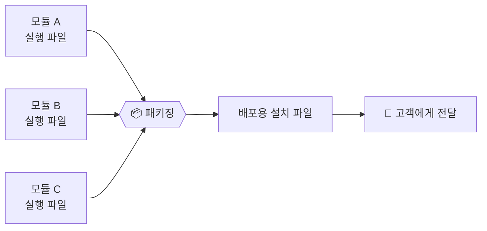

#### 특징 (21년 2회, 22년 1회, 23년 3회, 25년 2회·3회 출제)

- **사용자 중심**으로 진행되고, 신규 및 변경 개발 소스를 식별하며, 이를 **모듈화**하여 상용 제품으로 패키징한다.
- 고객의 편의성을 위해, 신규/변경 이력을 확인하고, 이를 **버전 관리 및 릴리즈 노트**를 통해 지속해서 관리한다.
- 사용자의 실행 환경을 이해하고, **범용 환경**에서 사용할 수 있도록 일반적인 배포 형태로 분류하여 패키징이 진행된다.

#### 릴리즈 노트

릴리즈 노트는 애플리케이션 최종 사용자인 고객과 **잘 정리된 배포 정보를 공유하는 문서**다. 상세 서비스를 포함하여 수정·변경 또는 개선되는 정보에 대한 사항이 제공된다.

**릴리즈 노트 작성 항목**

| 작성 항목 | 설명 |
|---|---|
| **헤더(Header)** | 문서 이름(릴리스 노트 이름), 제품 이름, 버전 번호, 릴리즈 날짜, 참고 날짜, 노트 버전 등 |
| **개요** | 제품 및 변경에 대한 간략한 전반적 개요 |
| **목적** | 릴리스 버전의 새로운 기능 목록과 릴리스 노트의 목적에 대한 개요, 버그 수정 및 새로운 기능 기술 |
| **이슈 요약** | 버그의 간단한 설명 또는 릴리즈 추가 항목 요약 |
| **재현 항목** | 버그 발견에 따른 재현 단계 기술 |
| **수정/개선 내용** | 수정/개선의 간단한 설명 기술 |
| **사용자 영향도** | 버전 변경에 따른 최종 사용자 기준의 기능 및 응용 프로그램상의 영향도 기술 |
| **소프트웨어 지원 영향도** | 버전 변경에 따른 소프트웨어의 지원 프로세스 및 영향도 기술 |
| **노트** | 소프트웨어 및 하드웨어 설치 항목, 제품, 문서를 포함한 업그레이드 항목 메모 |
| **면책 조항** | 회사 및 표준 제품과 관련된 메시지, 프리웨어 및 불법 복제 방지, 중복 등 참조에 대한 고지사항 |
| **연락 정보** | 사용자 지원 및 문의 관련한 연락처 정보 |

---

### 2-2. 애플리케이션 배포 도구 ★★

#### 개념

애플리케이션 배포 도구는 배포를 위한 패키징 시에 **디지털 콘텐츠의 지적 재산권을 보호하고 관리**하는 기능을 제공하며, **안전한 유통과 배포를 보장**하는 도구이자 솔루션이다.

#### 기술 요소 (20년 4회, 24년 1회·2회 출제)

애플리케이션 배포 도구의 기술 요소에는 **암호화, 키 관리, 식별 기술, 저작권 표현, 암호화 파일 생성, 정책 관리, 크랙 방지, 인증** 등이 있다. **DRM 기술 요소와 같다**는 점이 핵심이다.

| 기술 요소 | 설명 | 예시 |
|---|---|---|
| **암호화** | 콘텐츠 및 라이선스를 암호화하고, 전자서명을 할 수 있는 기술 | 공개 키 기반 구조(PKI), 대칭 및 비대칭 암호화, 전자서명 |
| **키 관리** | 콘텐츠를 암호화한 키에 대한 저장 및 배포 기술 | 중앙 집중형, 분산형 |
| **식별 기술** | 콘텐츠에 대한 식별 체계 표현 기술 | DOI, URI |
| **저작권 표현** | 라이선스의 내용 표현 기술 | XrML/MPEG-21 |
| **암호화 파일 생성** | 콘텐츠를 암호화된 콘텐츠로 생성하기 위한 기술 | - |
| **정책 관리** | 라이선스 발급 및 사용에 대한 정책표현 및 관리 기술 | XML, 콘텐츠 관리 시스템(CMS) |
| **크랙 방지** | 크랙에 의한 콘텐츠 사용 방지 기술 | 난독화, Secure DB |
| **인증** | 라이선스 발급 및 사용의 기준이 되는 사용자 인증 기술 | 사용자/장비 인증, SSO |

#### 세부 기술

| 세부 기술 | 설명 |
|---|---|
| **공개키 기반 구조(PKI)** | 공개키 암호 방식 기반으로 디지털 인증서를 활용하는 소프트웨어, 하드웨어, 사용자, 정책 및 제도 등을 총칭하는 암호 기술 |
| **대칭 및 비대칭 암호화** | 대칭암호화는 암호화와 해독을 위해 동일한 키를 사용하는 방식, 비대칭 암호화는 암호화할 때와 해독할 때 서로 다른 키를 사용하는 방식 |
| **전자서명** | 서명자를 확인하고 서명자가 당해 전자문서에 서명했다는 사실을 나타내기 위해 특정 전자문서에 첨부되거나 논리적으로 결합된 전자적 형태의 정보 |
| **DOI(Digital Object Identifier)** | 디지털 저작물에 특정한 번호를 부여하는 일종의 바코드 시스템. 디지털 저작물의 저작권 보호 및 정확한 위치 추적이 가능한 시스템 |
| **URI(Uniform Resource Identifier)** | 인터넷에 있는 자원을 나타내는 유일한 주소 |
| **XrML(eXtensible Right Markup Language)** | 디지털 콘텐츠/웹 서비스 권리 조건을 표현한, XML 기반의 마크업 언어 |
| **MPEG-21** | 멀티미디어 관련 요소 기술들이 통일된 형태로 상호 운용성을 보장하는 멀티미디어 표준 규격 |
| **XML(eXtensible Markup Language)** | W3C에서 개발된, 다른 특수한 목적을 갖는 마크업 언어를 만드는 데 사용하도록 권장하는 다목적 마크업 언어 |
| **CMS(Contents Management System)** | 다양한 미디어 포맷에 따라 각종 콘텐츠를 작성, 수집, 관리, 배급하는 콘텐츠 생산에서 활용, 폐기까지 전 공급 과정을 관리하는 기술 |
| **코드 난독화** | **역공학**을 통한 공격을 막기 위해서 프로그램의 소스 코드를 알아보기 힘든 형태로 바꾸는 기술 |
| **Secure DB** | 커널 암호화 방식으로 데이터베이스 파일을 직접 암호화하고, 접근 제어와 감사 기록 기능이 추가된 데이터베이스 보안 강화 기술 |
| **SSO(Single Sign On)** | 한 번의 시스템 인증을 통하여 여러 정보시스템에 재인증 절차 없이 접근할 수 있는 통합 로그인 기술 |

#### 배포 도구 활용 시 고려 사항 (20년 1회·3회·4회, 24년 3회 출제)

| 고려 사항 | 설명 |
|---|---|
| **암호화/보안** | 패키징 시 사용자에게 배포되는 소프트웨어임을 감안하여 반드시 내부 콘텐츠에 대한 암호화 및 보안 고려 |
| **이기종 연동** | 패키징 도구를 활용하여 여러 가지 이기종 콘텐츠 및 단말기 간 DRM 연동 고려 |
| **복잡성 및 비효율성 문제** | 사용자 관점에서 불편해질 수 있는 문제를 고려하여, 최대한 효율적으로 적용될 수 있도록 함 |
| **최적합 암호화 알고리즘 적용** | 암호화 알고리즘이 여러 가지 종류가 있는데, 제품 소프트웨어의 종류에 맞는 알고리즘을 선택하여 배포 시 범용성에 지장이 없도록 고려 |

---

### 2-3. DRM ★★★ (중요)

#### DRM의 개념 (22년 2회, 24년 3회, 25년 1회 출제)

DRM(Digital Rights Management)은 **디지털 콘텐츠에 대한 권리정보를 지정하고 암호화 기술을 이용하여 허가된 사용자의 허가된 권한 범위 내에서 콘텐츠의 이용이 가능하도록 통제하는 기술**이다.

#### DRM의 특징

| 특징 | 설명 |
|---|---|
| **거래 투명성** | 저작권자와 콘텐츠 유통업자 사이의 거래구조 투명성 제공 |
| **사용 규칙 제공** | 사용 가능 횟수, 유효기간, 사용 환경 등을 정의 가능. 다양한 비즈니스 모델 구성 및 콘텐츠 소비 형태 통제 제공 |
| **자유로운 상거래 제공** | 이메일, 디지털 미디어, 네트워크 등을 통한 자유로운 상거래 제공. 허가받은 사용자는 별도의 비밀키를 이용하여 대상 콘텐츠를 복호화하고 허가된 권한으로 사용 가능 |

#### DRM 구성 및 동작 방식 (20년 4회, 21년 2회, 23년 1회, 25년 2회 출제)

DRM은 **콘텐츠 제공자, 콘텐츠 소비자, 클리어링 하우스**로 구성된다. 콘텐츠 분배자는 제공자로부터 콘텐츠를 받아서 소비자에게 유통시킨다.

  <h3 style="margin-top: 0; margin-bottom: 20px; font-size: 1.25em; color: #333; font-weight: bold; display: flex; align-items: center; gap: 8px;">DRM 구성</h3>
  <svg xmlns="http://www.w3.org/2000/svg" viewBox="0 0 760 480" width="100%" style="display: block; margin: 0 auto;">
    <defs>
      <marker id="arrow-main" viewBox="0 -5 10 10" refX="22" refY="0" markerWidth="6" markerHeight="6" orient="auto"><path d="M0,-4 L8,0 L0,4 z" fill="#6c757d" /></marker>
      <marker id="arrow-inner" viewBox="0 -5 10 10" refX="12" refY="0" markerWidth="5" markerHeight="5" orient="auto"><path d="M0,-3.5 L7,0 L0,3.5 z" fill="#868e96" /></marker>
    </defs>
    <rect x="10" y="10" width="740" height="460" fill="none" stroke="#cfd4da" stroke-width="1.2" />
    <g fill="#ffffff" stroke="#495057" stroke-width="1.5"><rect x="210" y="40" width="380" height="110" /></g>
    <g font-family="sans-serif" text-anchor="middle" fill="#212529">
      <text x="400" y="80" font-size="17" font-weight="bold">클리어링 하우스</text>
      <text x="330" y="125" font-size="14">권한 정책</text>
      <text x="470" y="125" font-size="14">라이선스</text>
    </g>
    <g fill="#ffffff" stroke="#495057" stroke-width="1.2"><rect x="40" y="220" width="150" height="210" /></g>
    <g font-family="sans-serif" text-anchor="middle" fill="#212529">
      <text x="115" y="255" font-size="15" font-weight="bold">콘텐츠 제공</text>
      <text x="115" y="295" font-size="14">패키저</text>
      <text x="75" y="380" font-size="12" fill="#495057">콘텐츠</text>
      <text x="155" y="380" font-size="12" fill="#495057">메타데이터</text>
    </g>
    <g stroke="#868e96" stroke-width="1.2" marker-end="url(#arrow-inner)">
      <line x1="75" y1="360" x2="105" y2="310" />
      <line x1="155" y1="360" x2="125" y2="310" />
    </g>
    <g fill="#ffffff" stroke="#495057" stroke-width="1.2"><rect x="280" y="210" width="140" height="170" /></g>
    <g font-family="sans-serif" text-anchor="middle" fill="#212529">
      <text x="350" y="245" font-size="15" font-weight="bold">콘텐츠 분배</text>
      <text x="350" y="285" font-size="14">유통 시스템</text>
      <text x="350" y="340" font-size="12" fill="#495057">Store</text>
      <text x="350" y="358" font-size="12" fill="#495057">Front</text>
    </g>
    <line x1="350" y1="298" x2="350" y2="322" stroke="#868e96" stroke-width="1.2" marker-end="url(#arrow-inner)" />
    <g fill="#ffffff" stroke="#495057" stroke-width="1.2"><rect x="510" y="195" width="150" height="215" /></g>
    <g font-family="sans-serif" text-anchor="middle" fill="#212529">
      <text x="585" y="230" font-size="15" font-weight="bold">콘텐츠 소비</text>
      <text x="585" y="265" font-size="14">응용프로그램</text>
      <text x="585" y="315" font-size="13" fill="#495057">DRM</text>
      <text x="585" y="333" font-size="13" fill="#495057">컨트롤러</text>
      <text x="585" y="380" font-size="14">보안 컨테이너</text>
    </g>
    <g stroke="#6c757d" stroke-width="1.5" marker-end="url(#arrow-main)">
      <line x1="160" y1="220" x2="280" y2="150" />
      <line x1="190" y1="300" x2="280" y2="300" />
      <line x1="510" y1="270" x2="420" y2="270" />
      <line x1="390" y1="210" x2="390" y2="150" />
      <line x1="530" y1="195" x2="455" y2="150" />
      <line x1="575" y1="150" x2="575" y2="195" />
      <line x1="420" y1="345" x2="510" y2="345" />
    </g>
    <g font-family="sans-serif" font-size="13" fill="#343a40">
      <text x="220" y="195" text-anchor="middle">① 라이선스</text>
      <text x="225" y="213" text-anchor="middle">등록</text>
      <text x="235" y="322" text-anchor="middle">① 등록</text>
      <text x="465" y="292" text-anchor="middle">② 라이선스</text>
      <text x="465" y="310" text-anchor="middle">요청</text>
      <text x="435" y="185" text-anchor="middle">③ 라이선스</text>
      <text x="420" y="203" text-anchor="middle">요청</text>
      <text x="508" y="170" text-anchor="start">④ 요금</text>
      <text x="520" y="188" text-anchor="start">지불</text>
      <text x="590" y="170" text-anchor="start">⑤ 라이선스</text>
      <text x="590" y="188" text-anchor="start">발급</text>
      <text x="465" y="367" text-anchor="middle">⑥ 콘텐츠</text>
      <text x="465" y="385" text-anchor="middle">다운로드</text>
    </g>
  </svg>

동작 순서를 시퀀스로 보면 더 직관적이다.

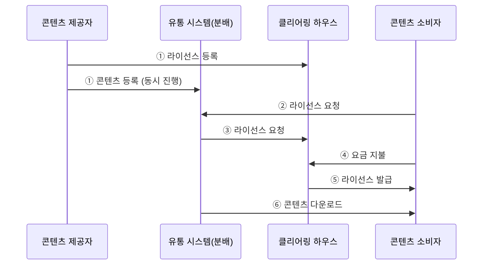

| 번호 | 단계 | 동작 방식 |
|---|---|---|
| ① | 라이선스 등록 | 클리어링 하우스에 라이선스 등록을 하면서 동시에 유통시스템에 콘텐츠를 등록 |
| ② | 라이선스 요청 | 콘텐츠 소비자가 유통시스템으로 라이선스 요청 |
| ③ | 라이선스 요청 | 유통시스템에서 클리어링 하우스를 통해서 라이선스를 요청 |
| ④ | 요금 지불 | 콘텐츠 소비자가 요금 지불 |
| ⑤ | 라이선스 발급 | 클리어링 하우스를 통해서 라이선스 발급 |
| ⑥ | 콘텐츠 다운로드 | 그 이후에 콘텐츠 소비자가 콘텐츠를 다운로드받을 수 있음 |

#### DRM 구성요소

DRM 구성요소는 **저작권 관리 구성요소**라고도 한다.

| 구성요소 | 설명 |
|---|---|
| **콘텐츠 제공자(Contents Provider)** | 콘텐츠를 제공하는 저작권자 |
| **콘텐츠 소비자(Contents Customer)** | 콘텐츠를 구매해서 사용하는 주체 |
| **콘텐츠 분배자(Contents Distributor)** | 암호화된 콘텐츠를 유통하는 곳이나 사람 |
| **클리어링 하우스(Clearing House)** | 저작권에 대한 사용 권한, 라이선스 발급, 사용량에 따른 관리 등을 수행하는 곳. **키 관리 및 라이선스 발급 관리**. 콘텐츠 권한 정책(라이선스 발급 여부를 결정하는 정책 부합 여부 확인, 적절한 사용 권한 부여)과 콘텐츠 라이선스(사용자에게 전달되는 콘텐츠의 권리 인증, 사용 조건 및 허가 정보 포함) 관리 수행 |
| **DRM 콘텐츠(DRM Contents)** | 서비스하고자 하는 암호화된 콘텐츠, 콘텐츠와 관련된 **메타 데이터**, 콘텐츠 사용 정보를 패키징하여 구성된 콘텐츠 |
| **패키저(Packager)** | 콘텐츠를 메타 데이터와 함께 배포 가능한 단위로 묶는 도구 |
| **DRM 컨트롤러(DRM Controller)** | 배포된 디지털 콘텐츠의 이용 권한을 통제 |
| **보안 컨테이너(Security Container)** | 원본 콘텐츠를 안전하게 유통하기 위한 전자적 보안장치 |

#### DRM의 기술 요소 (20년 1회·3회, 21년 1회, 22년 3회, 23년 2회·3회 출제)

DRM 기술 요소는 **암호화, 키 관리, 식별 기술, 저작권 표현, 암호화 파일 생성, 정책 관리, 크랙 방지, 인증** 기술이 있다. 앞서 본 **애플리케이션 배포 도구의 기술 요소와 완전히 동일**하다.

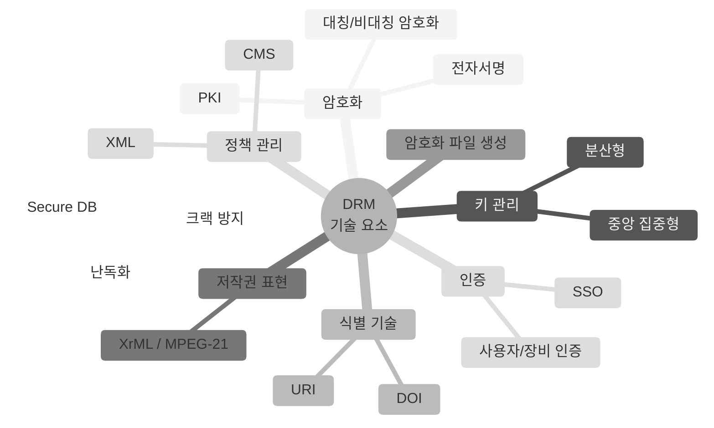

---

## 1. 제품 소프트웨어 매뉴얼 작성 ★★

### 1-1. 매뉴얼이란?

제품 소프트웨어 매뉴얼은 **개발 단계부터 적용한 기준이나 패키징 이후 설치·사용자 측면의 주요 내용을 문서로 기록한 것**이다. 사용자 중심의 기능과 방법을 나타낸 설명서이자 안내서를 의미한다.

매뉴얼은 크게 두 가지로 나뉜다.

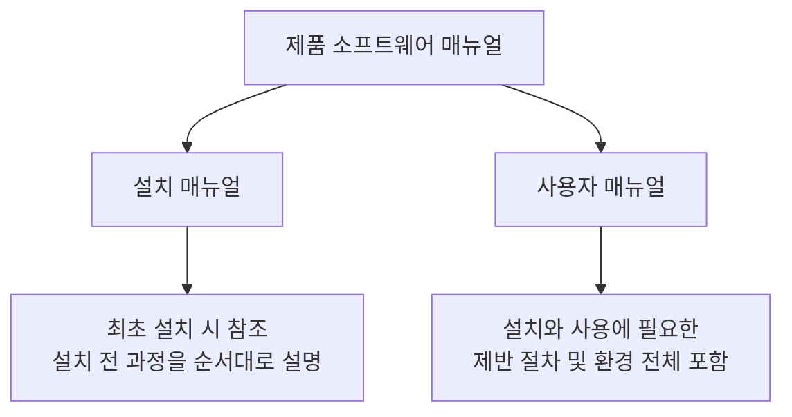

### 1-2. 설치 매뉴얼

설치 매뉴얼의 핵심 포인트는 세 가지다.

- 사용자가 제품을 구매한 후 **최초 설치 시 참조**하는 매뉴얼이다.
- 설치 과정에서 표시될 수 있는 **예외상황은 별도로 구분**하여 설명한다.
- 설치 시작부터 완료까지 **전 과정을 빠짐없이 순서대로** 설명한다.

#### 기본 작성 항목

| 작성 항목 | 설명 |
|---|---|
| 목차 및 개요 | 매뉴얼 전체 내용 요약, 주요 특징·구성·설치 방법·순서 기술 |
| 문서 이력 정보 | 매뉴얼 변경 이력을 버전별로 표시 |
| 설치 매뉴얼 주석 | 주의 사항(반드시 숙지할 정보) + 참고 사항(특별한 환경·상황) |
| 설치 도구의 구성 | exe/dll/ini/chm 등 설치 관련 파일, 폴더 및 실행 파일 설명 |
| 설치 위치 지정 | 설치 폴더와 설치 프로그램 실행 파일 설명 |

#### 설치 환경 체크 항목

| 체크 항목 | 설명 |
|---|---|
| 사용자 환경 | CPU, 메모리, 운영체제(OS) 등 적합 환경 확인 |
| 응용 프로그램 | 설치 전 다른 응용 프로그램의 종료 확인 |
| 업그레이드 버전 | 업그레이드 이전 버전 존재 유무 확인 |
| 백업 폴더 확인 | 데이터 저장 폴더 확인 후 설치 시 폴더 동기화 |

#### 설치 매뉴얼 구성요소 (21년 1회 기출)

설치 화면을 **캡처**하여 사용자가 이해하기 쉽도록 구성하고, 설치 실행 시 표시되는 안내 창 메시지를 설명한다.

- 제품 소프트웨어 개요 (주요 기능·UI 도식화)
- 설치 관련 파일 (exe, ini, log 등)
- 설치 절차 / 설치 아이콘 / 삭제 방법
- 설치 버전 및 작성자
- 고객 지원 방법 및 FAQ
- 준수 정보 & 제한 보증 (시리얼 보존, 불법 사용 금지, 저작권)

#### 설치 매뉴얼 작성 프로세스

| 순서 | 프로세스 | 핵심 내용 |
|---|---|---|
| 1 | 개요 및 기능 식별 | 개발 목적 및 제품의 전체적인 기능 식별 |
| 2 | UI 분류 | UI 정의서 기초, 매뉴얼에 작성될 순서대로 분류 |
| 3 | 설치 파일/백업 파일 확인 | 파일명·폴더 위치 확인, 실행·환경·로그·백업 파일 숙지 |
| 4 | 삭제 절차 확인 | 삭제 후 설치 전 상태로의 원복 확인 |
| 5 | 이상 유형 확인 | 이상 현상 테스트, 유형별 메시지 정상 여부 확인 |
| 6 | 최종 매뉴얼 적용 | 정상 설치 완료 결과 캡처 후 매뉴얼에 적용 |

### 1-3. 사용자 매뉴얼

사용자 매뉴얼은 **개발 완료된 제품을 고객에게 전달하기 위한 형태로 패키징하고, 설치와 사용에 필요한 제반 절차 및 환경 등 전체 내용을 포함하는 문서**다. 패키지의 기능·인터페이스, 포함된 메서드나 오퍼레이션, **메서드의 파라미터** 설명까지 담는다.

#### 작성 항목

설치 매뉴얼과 겹치는 항목이 많은데, 사용자 매뉴얼에만 있는 항목을 구분해서 기억하자.

- 목차 및 개요 / 문서 이력 정보 / 사용자 매뉴얼 주석 — 공통
- **기록 항목**: 제품 명칭, 모델명, 문서 번호, 제품 번호 등
- **기본사항**: 개요, 사용·관리 방법, 모델·버전별 특징, 기능·인터페이스 특징, 구동 환경
- 고객 지원 방법 및 FAQ / 준수 정보 & 제한 보증 — 공통

화면을 캡처하여 구성하고, 함께 동작하는 애플리케이션이나 **충돌될 수 있는 응용 프로그램**에 관해서도 설명한다.

#### 사용자 매뉴얼 작성 프로세스 (21년 3회, 23년 2회 기출)

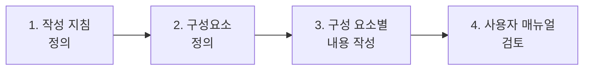

| 순서 | 프로세스 | 핵심 내용 |
|---|---|---|
| 1 | 작성 지침 정의 | 실제 사용자 환경에 필요한 정보를 제공할 수 있는 형태로 작성 |
| 2 | 구성요소 정의 | 기능, 객체 목록, 메서드·파라미터, 사용 예제, 환경 세팅 방법 정의 |
| 3 | 구성 요소별 내용 작성 | 구성 요소별로 내용 작성 |
| 4 | 사용자 매뉴얼 검토 | 기능 설명 적정성·부족 정보 검사, 개발자와 함께 검토 후 수정·보완 |

---

## 2. 국제 표준 제품 품질 특성 ★★★

품질 관련 국제 표준화는 **ISO/IEC, ITU-T, IEEE**를 중심으로 진행되며, **제품 품질 표준**과 **프로세스 품질 표준**으로 나뉜다.

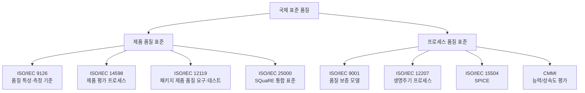

### 2-1. 국제 제품 품질 표준 (20년 3회, 22년 3회 기출)

| 품질 표준 | 설명 |
|---|---|
| **ISO/IEC 9126** | 품질 요소와 특성을 정의한 표준. 기능성·신뢰성·사용성·효율성·유지보수성·이식성으로 구분 |
| **ISO/IEC 14598** | 소프트웨어 제품 **평가 프로세스 및 평가 모듈** 제공 |
| **ISO/IEC 12119** | **패키지 제품**에 대한 품질 요구사항 및 테스트 표준. 제품 설명서·사용자 문서·실행 프로그램 대상 |
| **ISO/IEC 25000 (SQuaRE)** | 9126 + 14598 + 12119 통합, 15288 참고한 **통합 국제 표준** |

> ISO/IEC 9126은 1991년 제정 후 1994년부터 품질 특성과 내부/외부 품질을 조정하고, 품질 측정 절차를 별도의 ISO/IEC 14598 표준으로 분리했다.

### 2-2. ISO/IEC 9126 소프트웨어 품질 특성 (최다 기출!)

> 20년 1·3회, 21년 1회, 23년 3회, 24년 2·3회, 25년 3회 — 사실상 매년 나온다.

암기 팁: **"기신사효유이

| 품질 특성 | 설명 | 부특성 |
|---|---|---|
| 기능성 (Functionality) | 명시된 요구와 내재된 요구를 만족하는 기능 제공 능력 | 적합성, 정확성, 상호운용성, 보안성, 준수성 |
| 신뢰성 (Reliability) | 명시된 조건에서 **성능 수준을 유지**할 수 있는 능력. 주어진 시간 동안 기능을 오류 없이 수행하는 정도 | 성숙성, 결함 허용성, 회복성, 준수성 |
| 사용성 (Usability) | 사용자에 의해 **이해·학습·사용·선호**될 수 있는 능력 | 이해성, 학습성, 운용성, 친밀성, 준수성 |
| 효율성 (Efficiency) | 사용되는 **자원의 양**에 따라 요구된 성능을 제공하는 능력 | 시간 반응성, 자원 효율성, 준수성 |
| 유지보수성 (Maintainability) | 제품이 **변경되는 능력**. 수정·개선·개작 포함 | 분석성, 변경성, 안정성, 시험성, 준수성 |
| 이식성 (Portability) | 하나 이상의 **하드웨어 환경**에서 운용되기 위해 쉽게 수정될 수 있는 능력 | 적응성, 설치성, 공존성, 대체성, 준수성 |

### 2-3. ISO/IEC 14598 품질 특성 (20년 1·3회, 21년 1회, 23년 3회 기출)

개발자에 대한 품질 향상과 구매자의 제품 품질 선정 기준을 제공하는 표준이다.

암기 팁: **"반재공객"**

| 특성 | 설명 |
|---|---|
| 반복성 (Repeatability) | **동일 평가자**가 동일 사양으로 평가하면 **동일한** 결과 |
| 재현성 (Reproducibility) | **다른 평가자**가 동일 사양으로 평가하면 **유사한** 결과 |
| 공정성 (Impartiality) | 평가가 특정 결과에 **편향되지 않아야** 함 |
| 객관성 (Objectivity) | 평가 결과는 **객관적 자료**에 의해서만 평가 |

> 개발자 관점의 품질 측정 고려 항목: 정확성, 신뢰성, 효율성, 무결성, 유연성, 이식성, 사용성, 상호운용성

### 2-4. 국제 프로세스 품질 표준 (25년 3회 기출)

| 품질 표준 | 설명 | 세부 사항 |
|---|---|---|
| ISO/IEC 9001 | 설계/개발·생산·설치·서비스 과정의 **품질 보증 모델** | ISO 9000-3 (SW 산업 맞춤 변형) |
| ISO/IEC 12207 | SW **생명주기 단계별** 필요 프로세스를 규정 | 기본/지원/조직 프로세스 |
| ISO/IEC 15504 (SPICE) | 프로세스를 **평가·개선**하여 품질·생산성 향상 | 불완전(0)→수행(1)→관리(2)→확립(3)→예측(4)→최적화(5) |
| CMMI | CMM 통합 + SPICE 준수. 개발 **능력/성숙도 평가** 모델 | 단계별 표현(조직 성숙도) / 연속적 표현(프로세스별 능력도) |

### 2-5. ISO/IEC 25000 (SQuaRE) 통합 모델 (22년 1회, 23년 1회, 25년 1회 기출)

**SQuaRE** = System and Software Quality Requirements and Evaluation

기존 표준이 25000 시리즈로 어떻게 흡수됐는지 보면 구조가 한눈에 들어온다.

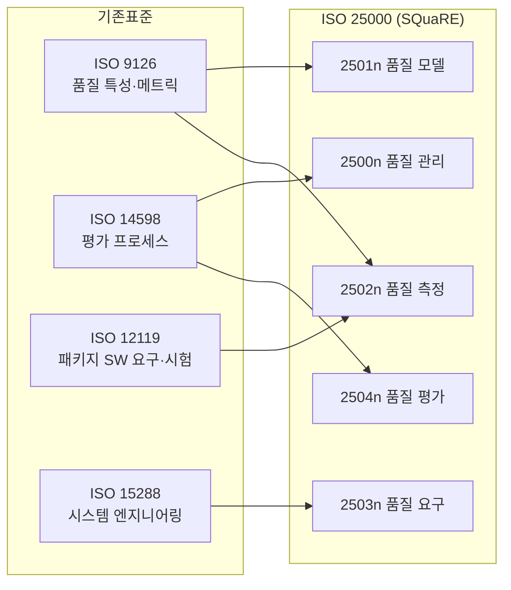

| 구분 | 구성요소 | 기반 표준 | 핵심 |
|---|---|---|---|
| 2500n | 품질 관리 | ISO 14598-2 | SQuaRE 가이드라인, 품질 평가 관리 |
| 2501n | 품질 모델 | ISO 9126-1 | 일반 모델 제시, **데이터 품질 모델 신규 제정** |
| 2502n | 품질 측정 | ISO 9126-2,3,4 | 메트릭 정의, 내부/외부/사용품질 측정 |
| 2503n | 품질 요구 | ISO 15288 | 품질 요구사항 설정 프로세스 |
| 2504n | 품질 평가 | ISO 14598 | 품질 평가 절차 정의 |

---

## 3. 소프트웨어 공학 기본원칙

### 3-1. 소프트웨어 위기 (Software Crisis)

소프트웨어 개발 속도가 하드웨어 개발 속도를 따라가지 못해 사용자 요구사항을 충족시키지 못하는 현상이다.

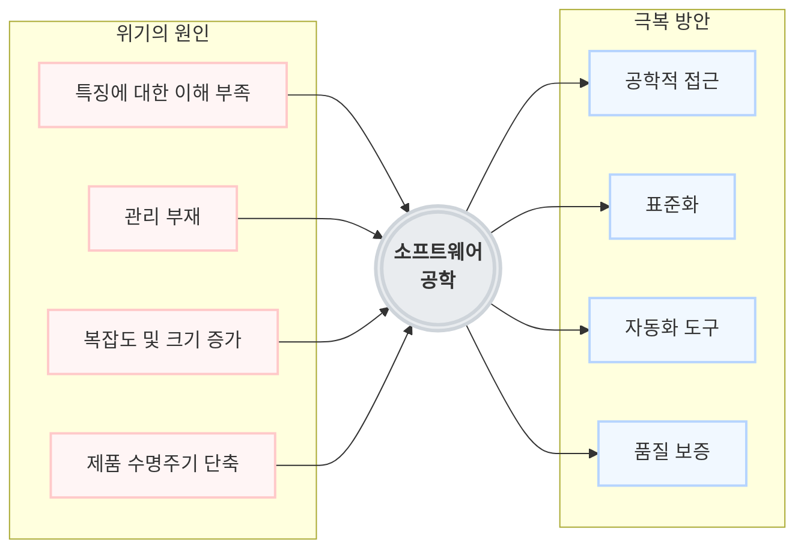

### 3-2. 소프트웨어 공학 (21년 1회, 22년 3회 기출)

- 소프트웨어의 개발, 운용, 유지보수 및 파기에 대한 **체계적인 접근 방법**이다.
- **신뢰성 있는 소프트웨어를 경제적인 비용으로** 획득하기 위해 공학적 원리를 정립하고 이용하는 방법이다.
- 소프트웨어 위기를 극복하기 위한 방안으로 연구된 학문이다.

#### 소프트웨어 공학의 원칙 (20년 3회 기출)

1. 현대적인 프로그래밍 기술을 계속적으로 적용한다.
2. 개발된 소프트웨어 품질이 유지되도록 지속적 검증을 수행한다.
3. 개발 관련 사항 및 결과에 대한 명확한 기록을 유지한다.

#### 공학적으로 잘된 소프트웨어의 특성 (21년 2회, 23년 2회 기출)

- 유지보수가 용이해야 한다.
- 신뢰성이 높아야 한다.
- 충분한 테스팅을 거쳐야 한다.

### 3-3. 소프트웨어 공학 관련 법칙 (20년 1회, 23년 1회, 24년 3회 기출)

| 법칙 | 설명 |
|---|---|
| **브룩스의 법칙** (Brooks' Law) | "지체되는 프로젝트에 인력을 추가하는 것은 개발을 늦출 뿐이다" — 인력 추가가 오히려 방해가 된다 |
| **파레토 법칙** (80:20) | 전체 결과의 80%가 원인의 20%에서 발생. 테스트에서 20%의 모듈에서 80%의 결함 발견 = **결함 집중** |
| **롱테일 법칙** | 사소해 보이는 80%의 다수가 20%의 핵심보다 뛰어난 가치를 창출. **파레토 법칙의 반대** |

---

## 4. 소프트웨어 버전 관리 ★★★

### 4-1. 버전 관리 도구란?

**형상 관리 지침을 활용**하여 제품 소프트웨어의 신규 개발, 변경, 개선과 관련된 수정 사항을 관리하는 도구다. 코드와 라이브러리, 관련 문서 등 **시간의 변화에 따른 변경을 관리**하는 전체 활동을 의미한다.

### 4-2. 버전 관리 도구 유형 (21년 2회, 22년 2회, 24년 1회 기출)

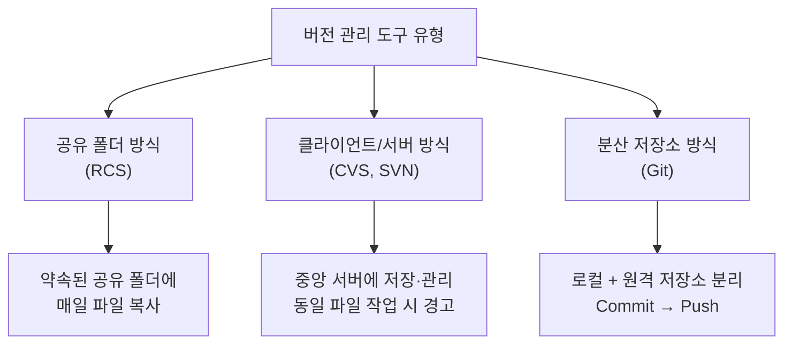

| 유형 | 설명 | 도구 |
|---|---|---|
| 공유 폴더 방식 | 매일 완료 파일을 공유 폴더에 복사. 담당자 1명이 PC로 복사·컴파일해 에러 확인 | RCS |
| 클라이언트/서버 방식 | 버전 관리 자료가 **중앙 서버**에 저장·관리. 같은 파일 작업 시 경고 메시지 출력 | CVS, SVN |
| 분산 저장소 방식 | **로컬 저장소와 원격 저장소 분리**. Clone → 수정 → 로컬에 Commit → 원격에 Push | Git |

### 4-3. 도구별 특징 (25년 2회 기출)

국내 개별 프로젝트에서는 SVN을 가장 많이 쓰지만, 전 세계적으로는 오픈 소스 기반의 **Git**을 가장 많이 사용한다.

| 도구 | 특징 |
|---|---|
| **RCS** | CVS와 달리 소스 파일 수정을 **한 사람만으로 제한** — 파일 잠금 방식 |
| **CVS** | 가장 오래된 형상 관리 도구 중 하나. 중앙 집중형 서버 저장소 |
| **SVN** | CVS와 같은 중앙 집중형이지만 CVS의 단점을 보완해 널리 사용 |
| **Git** | **분산형** 방식. 각 PC에 완전한 저장소 구성. Commit은 로컬에서, Push로 원격 반영 |

#### Git의 동작 흐름

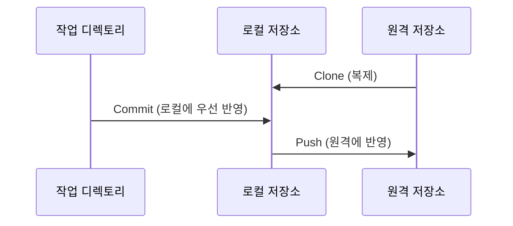

### 4-4. 버전 관리 도구 사용 시 유의사항 (20년 1·3회 기출)

| 유의 사항 | 설명 |
|---|---|
| 버전에 대한 쉬운 정보 접근성 | 언제든지 버전 정보에 접근 가능해야 함. 원하는 시점의 모습을 재구성 가능 |
| 불필요한 사용자에 대한 접근 제어 | 개발자·배포자 외에는 소스 수정 불가. 중요 파일은 권한자만 접근 |
| 동일 프로젝트에 대한 동시 사용성 | 여러 개발자가 동시 개발 가능, 동시 수정 시에도 수정 내역 통합 가능 |
| 빠른 오류 복구 | 에러 발생 시 최대한 빠른 복구, 과거 버전 소스로 신속하게 원복 |

---

## 5. 빌드 자동화 도구 ★★

### 5-1. 개념

- **빌드**: 소프트웨어를 생성하고 테스트하고 검사하여 배포하기 위해 수행하는 행위의 집합이다.
- **빌드 자동화 도구**: 저장소의 소스를 자동으로 읽어서 빌드한 후 테스트·검사하여 실행파일을 만드는 도구다. **지속적 통합(CI)**과도 연관된다.

### 5-2. 빌드 자동화 프로세스

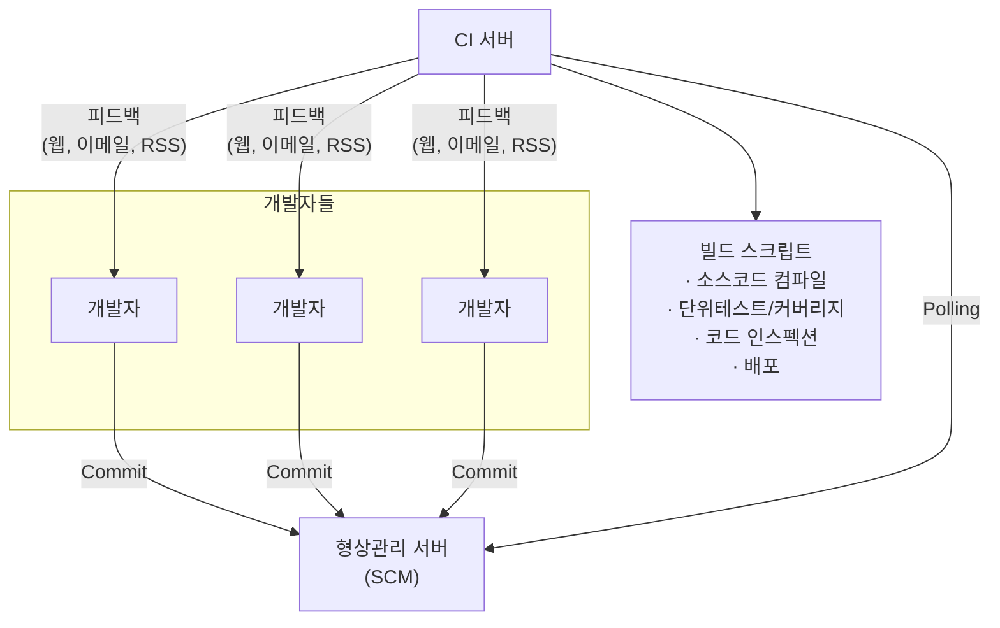

CI 서버가 형상 관리 서버의 소스 코드를 **주기적으로 가져와서(Polling)** 컴파일·단위테스트·코드 검사를 수행하고, 검증 결과를 이메일 등 피드백으로 개발자에게 전달하여 **조기에 결함을 발견하고 해결**한다.

#### 프로세스 순서

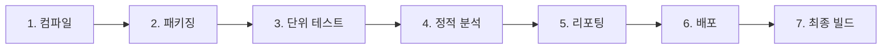

| 순서 | 프로세스 | 설명 |
|---|---|---|
| 1 | 컴파일 | 소스 코드를 바이너리 파일로 컴파일 |
| 2 | 패키징 | 바이너리 파일을 배포 형태로 패키징 |
| 3 | 단위 테스트 | 단위 테스트(커버리지 포함) 수행 |
| 4 | 정적 분석 | 정적 분석 수행 |
| 5 | 리포팅 | 분석 결과 리포팅 |
| 6 | 배포 | 패키징한 파일을 테스트 서버에 배포 |
| 7 | 최종 빌드 | 최종 빌드 |

### 5-3. 빌드 자동화 구성요소 (24년 1·2회, 25년 2회 기출)

구성요소별 대표 도구 매칭이 자주 출제된다. 반드시 짝지어서 암기하자.

| 구성요소 | 설명 | 도구 |
|---|---|---|
| **CI 서버** | 빌드 프로세스를 관리하는 서버 | **Jenkins, Hudson** |
| **SCM** (Source Code Management) | 소스 코드 형상 관리 시스템. 개정·백업 절차 자동화, 수정 부분 자동 동기화 | **SVN, Git** |
| **빌드 도구** (Build Tool) | 컴파일·테스트·정적 분석 등을 통해 동작 가능한 소프트웨어 생성 | **Ant, Maven** |
| **테스트 도구** (Test Tool) | 테스트 코드에 따라 자동으로 테스트 수행. 빌드 도구 스크립트에서 실행 | **JUnit, Selenium** |
| **테스트 커버리지 도구** | 테스트 코드가 소스 코드를 어느 정도 커버하는지 분석 | **Emma** |
| **인스펙션 도구** | 프로그램 실행 없이 소스 코드 자체로 품질 판단하는 **정적 분석** 도구 | **CheckStyle, Cppcheck** |

### 5-4. 빌드 자동화 도구의 기능

코드 컴파일, 컴포넌트 패키징(jar/exe 묶기), 파일 조작, 개발 테스트 실행, 버전 관리 도구 통합, 문서 생성(API 문서), 배포 기능, 코드 품질분석

### 5-5. 대표 도구 사례 (20년 4회, 23년 3회 기출)

#### 젠킨스 (Jenkins)

- **자바(JAVA) 기반의 오픈소스**로 가장 많이 활용되는 빌드 자동화 도구이며, **지속적 통합관리(CI; Continuous Integration)**를 가능하게 한다.
- **서블릿 컨테이너** 서버 기반으로 구동되며, CVS·SVN·Git 등 다양한 버전 관리 도구를 지원한다.

| 특징 | 설명 |
|---|---|
| 쉬운 설치 | `java -jar jenkins.war` 명령어로 설치 가능. 추가 설치나 DB 불필요 |
| 친숙한 웹 GUI | 웹 기반 GUI로 쉽게 설정 변경 가능 |
| 저장소 부하 감소 | 빌드에 사용될 목록만 따로 추출하여 변경 생성 |
| 최근 빌드 제공 | 최근 빌드·성공한 빌드 내역 링크 제공 |
| 실시간 피드백 | RSS·이메일로 빌드 실패 내역 실시간 통지 |
| 3rd Party 플러그인 확장 | Jenkins가 지원하길 바라는 툴·프로세스를 본인이 직접 만들 수 있음 |

#### 그래들 (Gradle)

- **그루비(Groovy)와 유사한 도메인 언어**를 채용했으며, 현재 안드로이드 앱을 만드는 데 필요한 **안드로이드 스튜디오의 공식 빌드 자동화 시스템**이다.
- 실행할 처리 명령들을 모아 **태스크(Task)**로 만든 후 **태스크 단위로 실행**한다.
- 자바(Java), C/C++, 파이썬(Python) 등 여러 언어를 지원한다.

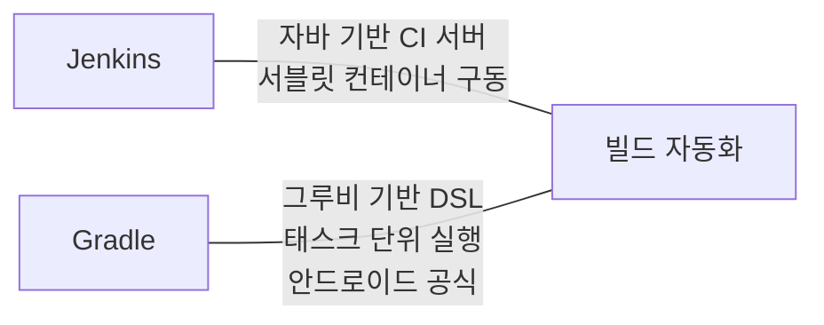

---

## 마무리 요약

시험 직전에 이것만 다시 보자.

1. **DRM 구성**: 콘텐츠 제공자 + 소비자 + **클리어링 하우스**(키 관리·라이선스 발급 담당)
2. **DRM 기술 요소 = 애플리케이션 배포 도구 기술 요소** (암호화, 키 관리, 식별, 저작권 표현, 암호화 파일 생성, 정책 관리, 크랙 방지, 인증)
3. 식별 기술 예시는 **DOI, URI** / 저작권 표현은 **XrML, MPEG-21** / 크랙 방지는 **난독화, Secure DB** / 인증은 **SSO**
4. **매뉴얼** = 설치 매뉴얼 + 사용자 매뉴얼. 각 작성 프로세스 순서 암기
5. **ISO/IEC 9126** 품질 특성 6가지: **기신사효유이** (기능성·신뢰성·사용성·효율성·유지보수성·이식성) + 부특성 매칭
6. **ISO/IEC 14598** 특성 4가지: **반재공객** (반복성·재현성·공정성·객관성)
7. **ISO/IEC 25000 = SQuaRE** = 9126 + 14598 + 12119 통합
8. **버전 관리** 3방식: 공유 폴더(RCS) / 클라이언트-서버(CVS, SVN) / 분산(Git)
9. **빌드 자동화 도구 매칭**: CI서버=Jenkins·Hudson / SCM=SVN·Git / 빌드=Ant·Maven / 테스트=JUnit·Selenium / 커버리지=Emma / 인스펙션=CheckStyle·Cppcheck
10. **Jenkins**=자바 기반·서블릿 컨테이너 / **Gradle**=그루비 유사 DSL·태스크 단위·안드로이드 공식

👉 **[오답노트 — 1과목 소프트웨어 설계](/정처기/wrong-note-part1/)**

[star]: /assets/images/star.png#blog-star-emoji "star"

