#  정보처리기사 정리 — 자료 구조 · 트리 · 그래프 · 단위 모듈

---

## 1. 자료 구조(Data Structure) ★★★

자료 구조는 **컴퓨터상 자료를 효율적으로 저장하기 위해 만들어진 논리적인 구조**다.
자료 구조를 현명하게 선택하면 효율적인 알고리즘을 쓸 수 있어서 성능이 향상된다.

### 자료 구조의 분류

자료 구조는 **선형 구조**와 **비선형 구조**로 나뉜다.

| 구조 | 설명 | 종류 |
|------|------|------|
| 선형 구조 | 데이터를 **연속적**으로 연결한 자료 구조 | 리스트, 스택, 큐, 데크 |
| 비선형 구조 | 데이터를 **비연속적**으로 연결한 자료 구조 | 트리, 그래프 |

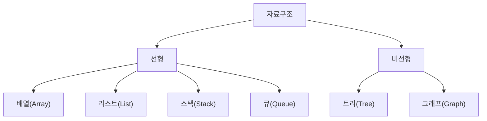

---

## 2. 선형 구조

### 2-1. 리스트(List)

리스트는 **선형 리스트**와 **연결 리스트**로 나뉜다.

| 종류 | 특징 |
|------|------|
| **선형 리스트**<br>(Linear List) | · 배열처럼 **연속되는 기억장소**에 저장<br>· 대표 구조는 배열(Array)<br>· 가장 간편하고 **접근이 빠름**<br>· 삽입·삭제 시 기존 자료의 **이동이 필요** |
| **연결 리스트**<br>(Linked List) | · **노드의 포인터**로 서로 연결시킨 리스트<br>· 단순 연결, 원형 연결, 이중 연결, 이중 원형 연결로 구분<br>· 노드 삽입·삭제가 **편리**<br>· 포인터용 **저장 공간이 추가로 필요**<br>· 포인터를 따라가야 해서 선형 리스트보다 **느림** |

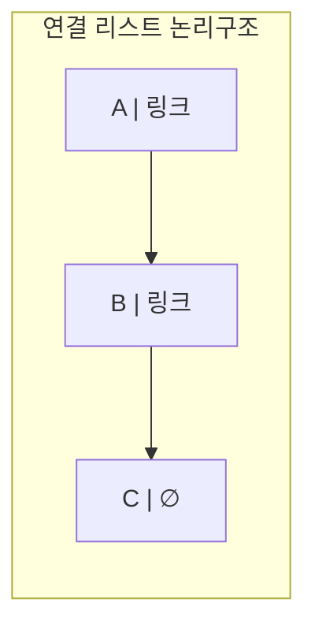

> ![star] 핵심 비교: 선형 리스트는 **접근 빠름 / 삽입·삭제 불편**, 연결 리스트는 **삽입·삭제 편함 / 접근 느림**.

---

### 2-2. 스택(Stack) ![star] 기출 최다

스택은 **한 방향으로만 자료를 넣고 꺼낼 수 있는 LIFO(Last-In First-Out)** 형식의 자료 구조다.
한 방향으로만 **PUSH**와 **POP**을 이용하여 자료를 넣고 꺼낸다.

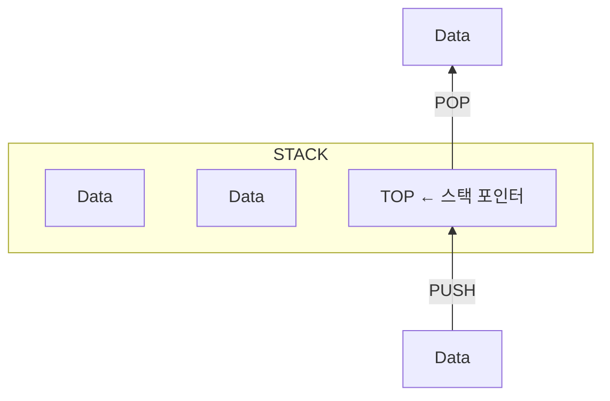

- **TOP**은 스택에서 가장 위에 있는 데이터로, **스택 포인터(Stack Pointer)**라고도 불린다.

#### 스택 연산

| 연산 | 설명 |
|------|------|
| PUSH | 데이터를 차례대로 스택에 넣는 연산 |
| POP | 스택에서 **가장 위에 있는** 데이터를 하나씩 꺼내는 연산 |

#### 스택의 삽입/삭제 알고리즘

```text
[삽입]                          [삭제]
If Top = n Then                 If Top = 0 Then
    Overflow    ← 꽉 참!            Underflow  ← 텅 빔!
Else {                          Else {
    Top = Top + 1                   remove S(Top)
    insert S(Top)                   Top = Top - 1
}                               }
```

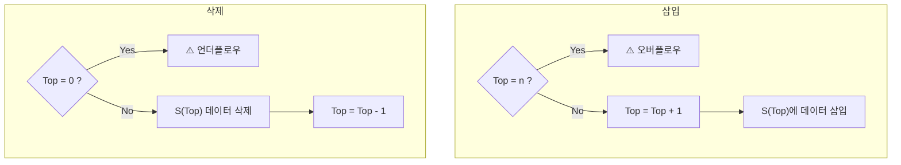

> 암기 포인트
> - 데이터가 **n개(가득)** 인데 삽입 → **오버플로우**
> - 데이터가 **0개(빈 상태)** 인데 삭제 → **언더플로우**

#### 스택 응용 분야

| 분야 | 설명 |
|------|------|
| 인터럽트 처리 | 현재 명령어 위치를 PUSH → 인터럽트 처리 후 POP으로 복귀 |
| 함수 호출(재귀 포함) | 함수 호출 시 현재 진행 중인 명령어 주소를 스택에 저장 |
| 후위 표현 연산 | Postfix 계산 시 사용 |
| 깊이 우선 탐색(DFS) | 깊이 내려갈 때마다 PUSH, 막히면 POP 후 인접 노드 탐색 |

---

### 2-3. 큐(Queue)

큐는 **한쪽 끝에서 삽입, 반대쪽 끝에서 삭제**가 이루어지는 **FIFO(First-In First-Out)** 형식의 자료 구조다.

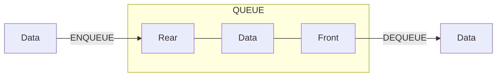

- 꺼내는 쪽에서 가장 가까운 데이터가 **Head(Front)**, 넣는 쪽에서 가장 가까운 데이터가 **Tail(Rear)**다.

| 연산 | 설명 |
|------|------|
| ENQUEUE | 데이터를 차례대로 넣는 연산 |
| DEQUEUE | **처음 저장된 데이터부터** 하나씩 꺼내는 연산 |

---

### 2-4. 데크(Deque; Double Ended Queue)

데크는 **큐의 양쪽 끝에서 삽입과 삭제를 모두 할 수 있는** 자료 구조다.

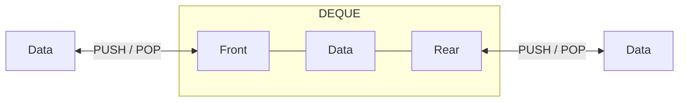

- **두 개의 포인터**를 사용하여 양쪽에서 삭제/삽입이 가능하다.
- 데크로 **스택과 큐를 모두 구현**할 수 있다.

| 연산 | 설명 |
|------|------|
| PUSH | 데이터를 차례대로 데크에 넣는 연산 |
| POP | Front와 Rear에 있는 데이터를 하나씩 꺼내는 연산 |

>  한 줄 정리
> - 스택 = **LIFO** (한쪽만)
> - 큐 = **FIFO** (넣는 쪽 ≠ 빼는 쪽)
> - 데크 = 양쪽 다 되는 만능형

---

## 3. 비선형 구조

### 3-1. 트리(Tree)의 개념

- 트리는 **데이터들을 계층화**시킨 자료 구조다.
- 그래프의 특수한 형태로 **노드(Node)와 선분(Branch)**으로 되어 있고, 정점 사이에 **사이클(Cycle)이 없으며**, 관계성이 계층 형식으로 나타나는 비선형 구조다.
- 인덱스를 조작하는 방법으로 가장 많이 사용하는 구조다.
- 배열과 달리 노드들이 포인터로 연결되어 **노드의 상한선이 없다**.

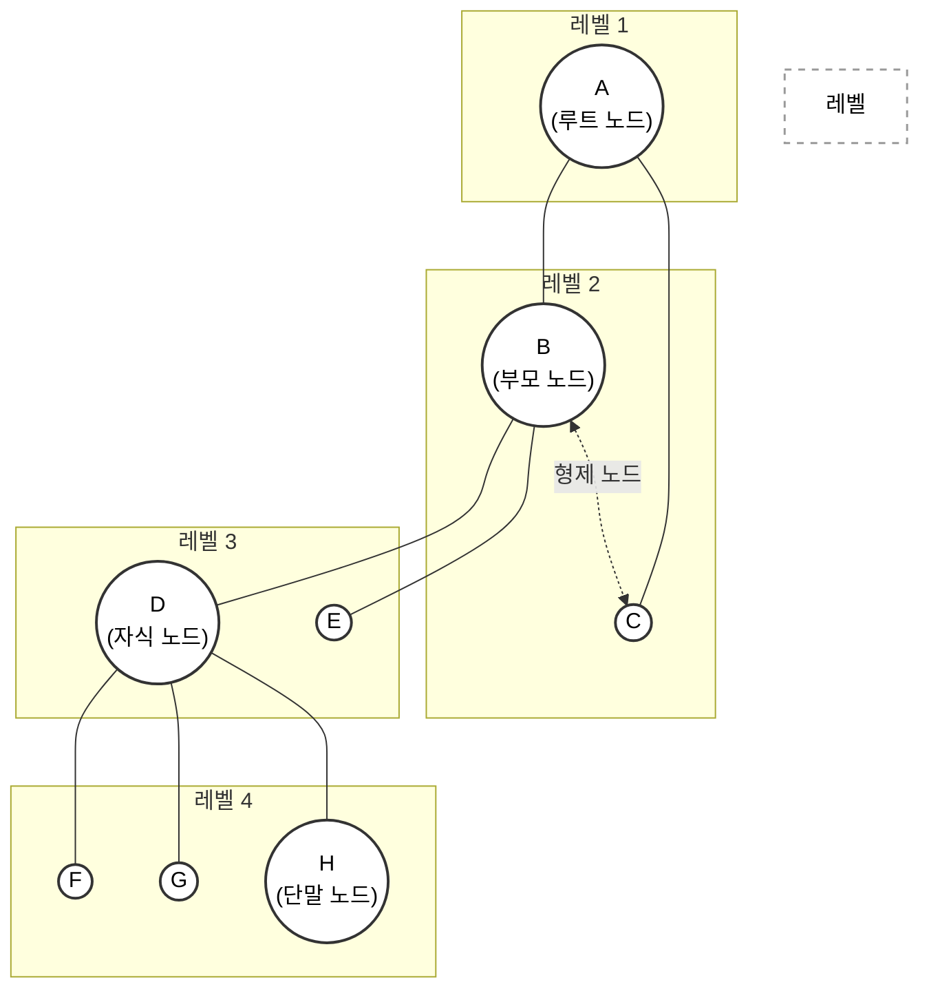

### 3-2. 트리 용어 ![star] 기출 최다

위 트리를 기준으로 정리한다.

| 용어 | 설명 | 예시 |
|------|------|------|
| 루트 노드 (Root) | 부모가 없는 최상위 노드, 트리의 시작점 | {A} |
| 단말 노드 (Leaf) | 자식이 없는 노드, 가장 말단 | {F, G, H, E, C} |
| 레벨 (Level) | 루트 기준 특정 노드까지의 경로 길이 | E의 레벨 = 3 |
| 조상 노드 (Ancestor) | 특정 노드에서 루트에 이르는 경로상 모든 노드 | D의 조상 = {B, A} |
| 자식 노드 (Child) | 특정 노드에 연결된 다음 레벨 노드 | B의 자식 = {D, E} |
| 부모 노드 (Parent) | 특정 노드에 연결된 이전 레벨 노드 | F의 부모 = {D} |
| 형제 노드 (Sibling) | 같은 부모를 가진 노드 | F의 형제 = {G, H} |
| 깊이 (Depth) | 루트에서 특정 노드까지의 간선 수 | 트리의 깊이 = 3 |
| 노드의 차수 (Degree of Node) | 특정 노드에 연결된 **자식 노드의 수** | A의 차수 = 2 |
| 트리의 차수 (Degree of Tree) | 노드 차수 중 **가장 큰 차수** | D의 차수 3이 최대 → 트리의 차수 = 3 |

> ❓ 자주 나오는 질문: "특정 노드 언급 없이 트리의 차수를 고르라면?"
> → 전체 트리에서 **가장 큰 차수 값**을 찾으면 된다. 간단하다.

---

### 3-3. 트리 순회 방법 ![star]![star] (전위·중위·후위)

트리 순회는 크게 **전위, 중위, 후위**로 구분된다. Root(C)의 위치만 기억하면 끝이다.

| 방법 | 방문 순서 | 암기 |
|------|-----------|------|
| 전위 순회 (Pre-Order) | **Root → Left → Right** | C L R (루트 먼저) |
| 중위 순회 (In-Order) | **Left → Root → Right** | L C R (루트 가운데) |
| 후위 순회 (Post-Order) | **Left → Right → Root** | L R C (루트 마지막) |

```mermaid
flowchart LR
    subgraph Pre ["전위 순회 (Pre-Order)"]
        direction TB
        C1(("C (Root)")):::root1
        L1(("L (Left)")):::child1
        R1(("R (Right)")):::child1
        
        C1 -. "트리 구조" .-> L1
        C1 -. "트리 구조" .-> R1
        
        C1 == "①" ==> L1 == "②" ==> R1
    end

    subgraph In ["중위 순회 (In-Order)"]
        direction TB
        C2(("C (Root)")):::root2
        L2(("L (Left)")):::child2
        R2(("R (Right)")):::child2
        
        C2 -. "트리 구조" .-> L2
        C2 -. "트리 구조" .-> R2
        
        L2 == "①" ==> C2 == "②" ==> R2
    end

    subgraph Post ["후위 순회 (Post-Order)"]
        direction TB
        C3(("C (Root)")):::root3
        L3(("L (Left)")):::child3
        R3(("R (Right)")):::child3
        
        C3 -. "트리 구조" .-> L3
        C3 -. "트리 구조" .-> R3
        
        L3 == "①" ==> R3 == "②" ==> C3
    end

    %% 기본 트리 구조(회색 점선) 스타일링
    linkStyle 0,1,4,5,8,9 stroke:#cbd5e1,stroke-width:2px,stroke-dasharray: 5 5;
    
    %% 순회 경로(컬러 실선) 스타일링
    linkStyle 2,3 stroke:#ef4444,stroke-width:4px,color:#ef4444;
    linkStyle 6,7 stroke:#22c55e,stroke-width:4px,color:#22c55e;
    linkStyle 10,11 stroke:#3b82f6,stroke-width:4px,color:#3b82f6;

    %% 각 순회별 컬러 디자인
    classDef root1 fill:#fee2e2,stroke:#ef4444,stroke-width:3px,color:#7f1d1d;
    classDef child1 fill:#ffffff,stroke:#fca5a5,stroke-width:2px,color:#991b1b;
    
    classDef root2 fill:#dcfce7,stroke:#22c55e,stroke-width:3px,color:#14532d;
    classDef child2 fill:#ffffff,stroke:#86efac,stroke-width:2px,color:#166534;
    
    classDef root3 fill:#dbeafe,stroke:#3b82f6,stroke-width:3px,color:#1e3a8a;
    classDef child3 fill:#ffffff,stroke:#93c5fd,stroke-width:2px,color:#1e40af;
```

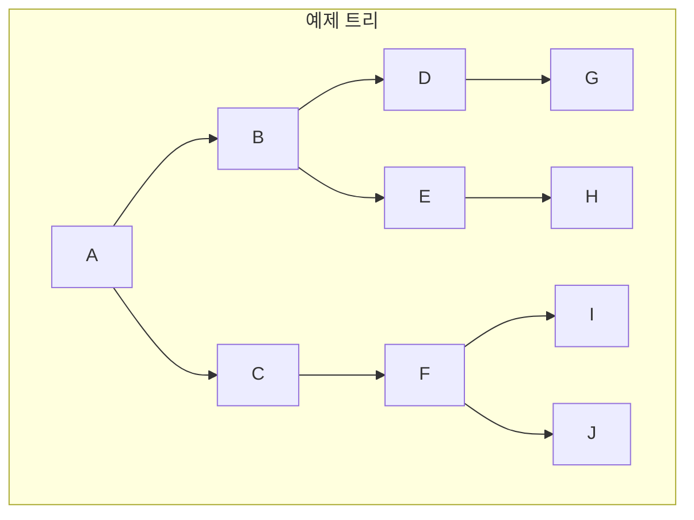

이 트리를 각 방식으로 순회한 결과:

| 순회 | 결과 |
|------|------|
| 전위 (Root→L→R) | A → B → D → G → E → H → C → F → I → J |
| 중위 (L→Root→R) | G → D → B → H → E → A → C → I → F → J |
| 후위 (L→R→Root) | G → D → H → E → B → I → J → F → C → A |

#### 전위 순회 푸는 법 — 서브 트리로 쪼개기

전위 순회 예제(A-B-C-D-E-F-G-H 트리)를 서브 트리로 묶어 푸는 과정이다.

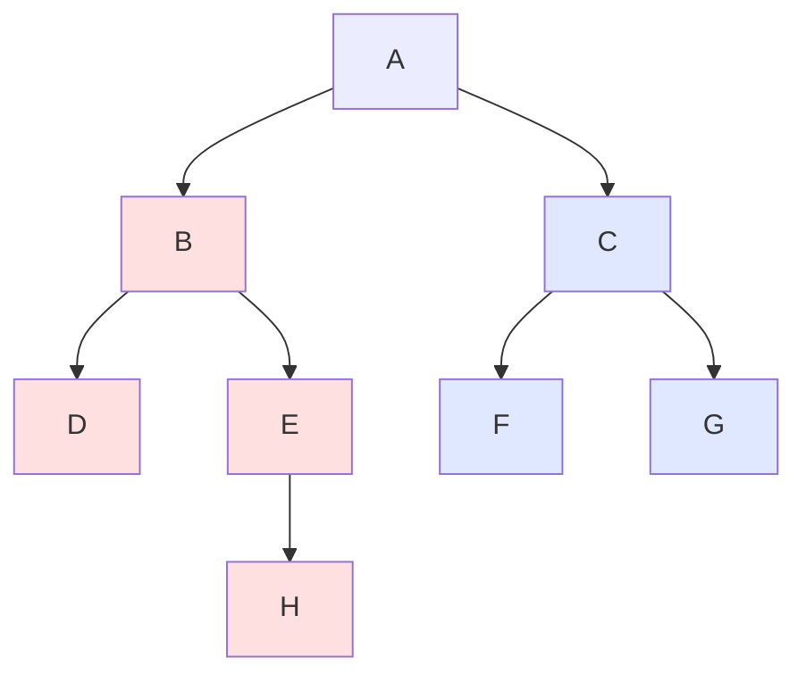

1. B, D, E, H가 있는 왼쪽 서브 트리를 **B'**, C, F, G가 있는 오른쪽 서브 트리를 **C'** 로 두면
   → A는 Root, B'는 Left, C'는 Right이므로 **A → B' → C'**
2. B' 내부: B는 Root, D는 Left, (E, H)를 E'로 두면 → **B → D → E'**
3. E' 내부: E는 Root, H는 Left, Right는 없음 → **E → H**
4. C' 내부: C는 Root, F는 Left, G는 Right → **C → F → G**
5. 전부 합치면: **A → B → D → E → H → C → F → G** ✅

> 큰 트리를 만나면 겁먹지 말고 **서브 트리 단위로 쪼개서** 재귀적으로 풀면 된다.

---

### 3-4. 수식 표기법 변환 (Infix → Prefix / Postfix)

기호가 가운데 있는 일반 수식이 **Infix**다. 변환 3단계만 기억하면 된다.

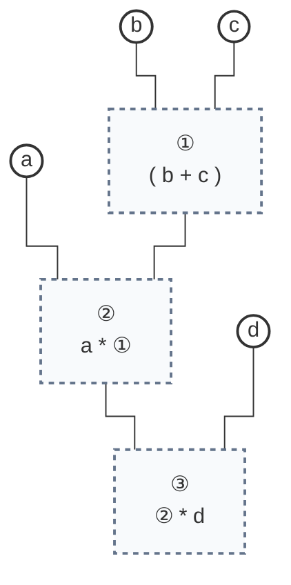


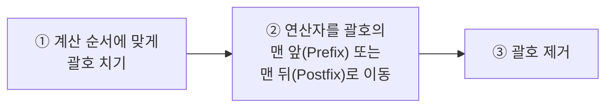

#### 예제: `a * (b + c) * d`

**Infix → Prefix** (연산자를 괄호 **앞**으로)

```text
① 괄호 치기      : ((a * (b + c)) * d)
② 앞으로 이동    : (* (* a (+ b c)) d)
③ 괄호 제거      : * * a + b c d
```

**Infix → Postfix** (연산자를 괄호 **뒤**로)

```text
① 괄호 치기      : ((a * (b + c)) * d)
② 뒤로 이동      : ((a (b c +) *) d *)
③ 괄호 제거      : a b c + * d *
```

#### 예제: Prefix `- / * A + B C D E` → Postfix

전위식은 Root → Left → Right 순이고 Root가 연산자이므로, **(연산자, 피연산자, 피연산자)** 형태를 안쪽부터 찾아 묶는다. (묶인 덩어리도 피연산자로 취급)

```text
- / * A + B C D E
- / * A (+ B C) D E
- / (* A (+ B C)) D E
- (/ (* A (+ B C)) D) E
(- (/ (* A (+ B C)) D) E)

→ Postfix로 이동: (((A (B C +) *) D /) E -)
→ 괄호 제거:      A B C + * D / E -
```

---

### 3-5. 트리 종류

| 종류 | 핵심 |
|------|------|
| **이진 탐색 트리** (Binary Search Tree) | · 차수가 **2 이하**인 노드로 구성 (자식 둘 이하)<br>· 부모보다 **작은 값은 왼쪽**, **큰 값은 오른쪽**에 생성 |
| **AVL 트리** (Adelson-Velsky and Landis) | 두 자식 서브 트리의 **높이 차가 항상 최대 1**이 되도록 스스로 균형을 잡는 이진 탐색 트리 |
| **2-3 트리** | 차수가 **2 또는 3**인 내부 노드를 갖는 탐색 트리. AVL의 단점(삽입·삭제 시 전체 재구성)을 줄임 |
| **레드-블랙 트리** (Red-Black Tree) | 각 노드가 **빨강/검정** 색상을 가지며, 색깔 규칙으로 스스로 균형을 잡는 이진 탐색 트리 |

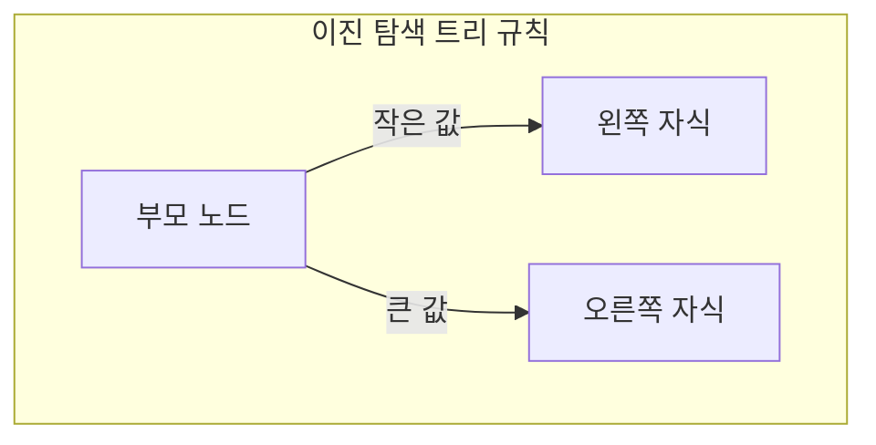

---

### 3-6. 그래프(Graph)

- 그래프는 **노드(N; Node)와 간선(E; Edge)**을 하나로 모아놓은 자료 구조다.
- **트리는 사이클이 없는 그래프**다. ← 자주 나온다.

#### 그래프의 유형 — 최대 간선 수 공식 ![star]

| 유형 | 설명 | 최대 간선 수 (정점 n개) |
|------|------|------------------------|
| 방향 그래프 | 정점을 연결하는 선에 **방향이 있음** | **n(n-1)** |
| 무방향 그래프 | 정점을 연결하는 선에 **방향이 없음** | **n(n-1)/2** |

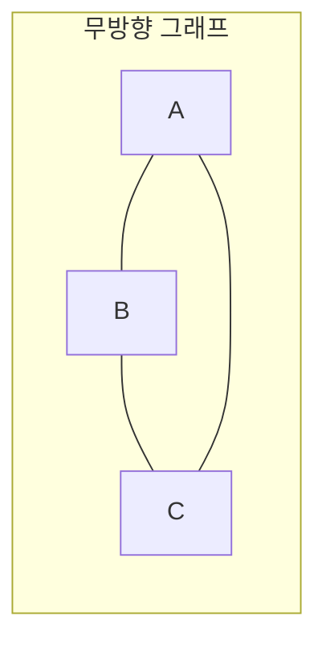

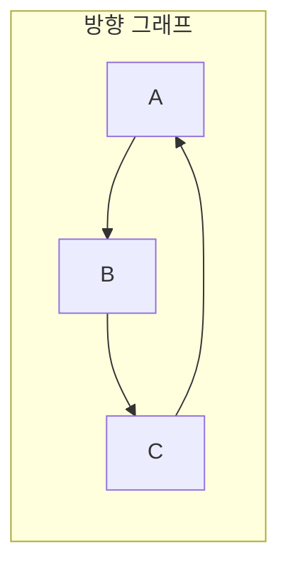

#### 그래프 용어

| 용어 | 설명 |
|------|------|
| 경로 (Path) | 임의 정점에서 다른 정점으로 이르는 길 |
| 경로 길이 (Path Length) | 경로상에 있는 **간선의 수** |
| 단순 경로 (Simple Path) | 한 경로의 모든 간선이 다를 때의 경로 |
| 사이클 (Cycle) | 동일 정점에서 시작과 끝이 이어지는 경로 |

#### 그래프 탐색 — DFS vs BFS

| 탐색 방법 | 설명 |
|-----------|------|
| **깊이 우선 탐색** (DFS) | 최대한 **깊이** 내려간 뒤, 더 갈 곳 없으면 옆으로 이동 |
| **너비 우선 탐색** (BFS) | 최대한 **넓게** 이동한 다음, 더 갈 수 없을 때 아래로 이동 |

예제 그래프:

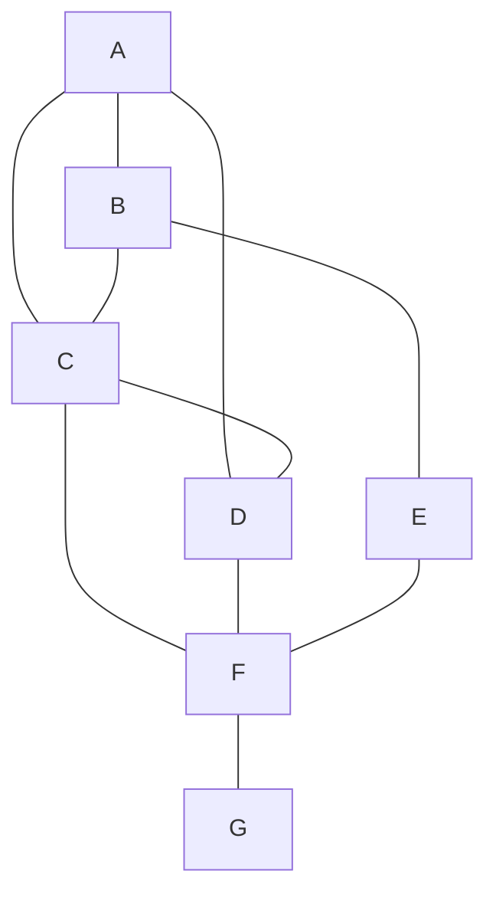

**DFS 진행 과정** (동순위는 알파벳 빠른 순 선택)

1. A 출발
2. A 아래 B, C, D 중 → **B** 선택
3. B 아래 → **E** 선택
4. E 아래 없음 → 옆으로 → **F** 선택
5. F 아래 → **G** 선택
6. G 아래·옆 없음 → 막힘
7. ②에서 선택 안 된 C, D 중 → **C** 선택
8. C 아래 F는 이미 방문 → 옆으로 → **D** 선택
9. 모든 노드 방문 → 종료

> ✅ DFS 결과: **A → B → E → F → G → C → D**

**BFS 진행 과정**

1. A 출발
2. A에 인접한 **B, C, D**를 순서대로 선택
3. B의 이웃 탐색 → **E** 선택
4. C의 이웃 탐색 → **F** 선택
5. D의 이웃 → F는 이미 선택됨
6. E의 이웃 → F는 이미 선택됨
7. F의 이웃 탐색 → **G** 선택
8. 모든 노드 방문 → 종료

> ✅ BFS 결과: **A → B → C → D → E → F → G**

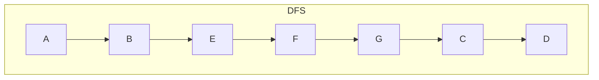

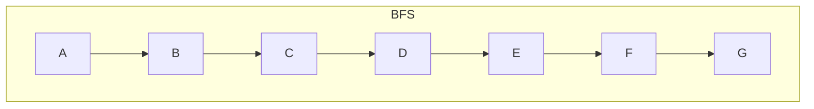

---

# 5. 통합 구현 — 단위 모듈 구현 ★★

## 개념

- 단위 모듈 구현은 기능을 **단위 모듈별로 분할하고 추상화**하여 성능을 향상시키고, **유지보수를 효과적으로** 하기 위한 구현 기법이다.
- 모듈은 소프트웨어 구조를 이루며, 다른 것들과 구별되는 **독립적인 기능**을 갖는 단위다.
- 인터페이스 모듈, 데이터베이스 접근 모듈 등 통합 구현에 필요한 단위 **컴포넌트**를 구현한다.

## 단위 모듈 구현의 4가지 원리 ![star]

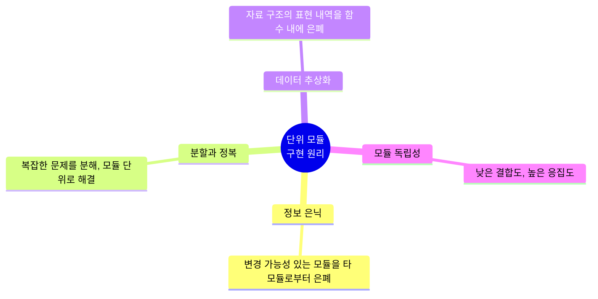

| 원리 | 설명 |
|------|------|
| 정보 은닉 (Information Hiding) | 어렵거나 변경 가능성이 있는 모듈을 타 모듈로부터 은폐 |
| 분할과 정복 (Divide & Conquer) | 복잡한 문제를 분해, 모듈 단위로 문제 해결 |
| 데이터 추상화 (Data Abstraction) | 각 모듈 자료 구조를 액세스·수정하는 함수 내에 자료 구조의 표현 내역을 은폐 |
| 모듈 독립성 (Module Independency) | **낮은 결합도와 높은 응집도**를 가짐 |

## 컴포넌트 vs 모듈 차이

- **컴포넌트**: 런타임에 **독립적으로 배포·실행되는 단위**
- **모듈**: **정적인 구조**

예: 서버 1대가 클라이언트 5대에 정보를 제공하는 경우
→ 모듈은 **2개**(서버, 클라이언트), 컴포넌트는 **6개**(서버 1 + 클라이언트 5)

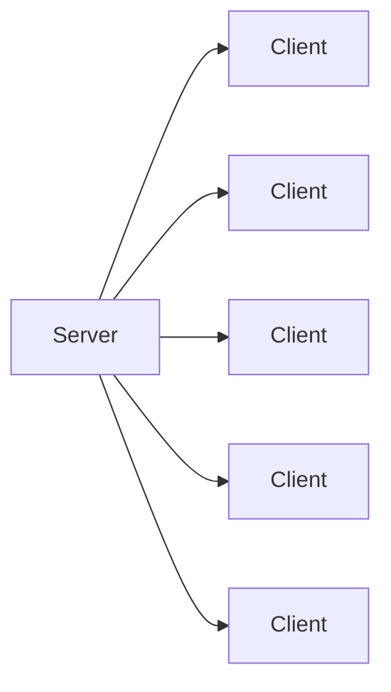

## 구현 단계에서 작업 절차

```mermaid
flowchart LR
    A[1. 코딩 계획] --> B[2. 코딩] --> C[3. 컴파일] --> D[4. 테스트]
```

| 순서 | 절차 | 설명 |
|------|------|------|
| 1 | 코딩 계획 | 기능을 실제 수행할 수 있도록 수행 방법을 논리적으로 결정 |
| 2 | 코딩 | 특정 프로그래밍 언어로 구현. 언어 선택 시 시스템 특성, 사용자 요구사항, 컴파일러 가용성 고려 |
| 3 | 컴파일 | 작성한 코드를 다른 언어의 코드(주로 기계어)로 변환 |
| 4 | 테스트 | 요구사항 만족 여부, 예상과 실제 결과의 차이를 검사·평가 |

---

## 재사용(Reuse) 기법

재사용은 **이미 개발되어 기능·성능·품질을 인정받았던 소프트웨어**의 전체 또는 일부분을 다시 사용하는 기법이다.

### 재사용 종류 — 재공학 vs 재개발 ![star]

```mermaid
graph TD
    R[재사용 기법] --> RE["재공학<br>(Re-Engineering)"]
    R --> RD["재개발<br>(Re-Development)"]
    RE --> A1["분석 (Analysis)"]
    RE --> A2["재구조 (Restructuring)"]
    RE --> A3["역공학 (Reverse Engineering)"]
    RE --> A4["이식 (Migration)"]
```

| 구분 | 설명 |
|------|------|
| **재공학** (Re-Engineering) | · 기존 소프트웨어를 **버리지 않고** 기능을 개선하거나 새 소프트웨어로 재활용<br>· 장점: 위험부담 감소, 비용 절감, 개발 기간 단축, 시스템 명세 오류억제 |
| **재개발** (Re-Development) | 기존 시스템 내용을 **참조**하여 완전히 새로운 시스템을 개발, 기능 추가·변경 |

#### 재공학의 주요 활동 4가지

| 활동 | 설명 |
|------|------|
| 분석 (Analysis) | 기존 명세서를 확인해 동작을 이해하고 **재공학 대상을 선정** |
| 재구조 (Restructuring) | 상대적으로 **같은 추상적 수준**에서 하나의 표현을 다른 형태로 변환 |
| 역공학 (Reverse Engineering) | 기존 소프트웨어를 분석하여 **설계도를 추출**하거나 다시 만들어냄 |
| 이식 (Migration) | 기존 시스템을 **새로운 기술·하드웨어 환경**에서 사용할 수 있도록 변환 |

### 재사용 규모에 따른 분류

| 구분 | 설명 |
|------|------|
| 함수와 객체 | 클래스나 메서드 단위의 **소스 코드**를 재사용 |
| 컴포넌트 | 컴포넌트 자체 수정 없이 **인터페이스를 통해 통신**하는 방식으로 재사용 |
| 애플리케이션 | 공통 기능을 제공하는 **애플리케이션을 공유**하는 방식으로 재사용 |

```mermaid
graph LR
    A["함수/객체<br>(소스 코드 단위)"] --> B["컴포넌트<br>(인터페이스 통신)"] --> C["애플리케이션<br>(앱 공유)"]
```

---

## 4. 단위 모듈 테스트 ★★

### 개념

- 단위 모듈 테스트는 **모듈의 개별적인 코드 단위가 예상대로 작동하는지 확인**하는 기법이다.
- 단위 모듈 테스트를 위해 **IDE 도구**를 활용하여 개별 단위 모듈에 대한 디버깅을 수행한다.

### 테스트 vs 디버그 차이 ![star]

| 항목 | 테스트(Test) | 디버그(Debug) |
|------|--------------|----------------|
| 개념 | 시스템이 정해진 요구를 만족하는지, 예상과 실제 결과의 차이를 검사·평가하는 단계 | 개발 중 발생하는 논리적 오류나 버그를 찾아서 수정하는 과정 |
| 목적 | **오류를 찾는** 작업 | **오류를 수정하는** 작업 |

```mermaid
flowchart LR
    T["🔍 테스트<br>오류를 <b>찾는다</b>"] --> D["🔧 디버그<br>오류를 <b>고친다</b>"]
```

### 단위 모듈 테스트의 종류

| 종류 | 설명 |
|------|------|
| **블랙박스 테스트**<br>(명세 기반 테스트) | · 외부 사용자의 **요구사항 명세**를 보면서 수행하는 테스트(기능 테스트)<br>· 소프트웨어의 특징, 요구사항, 설계 명세서에 초점 |
| **화이트박스 테스트**<br>(구조 기반 테스트) | · **모듈 내부의 소스를 보면서** 수행하는 가장 기본적 방법<br>· 소스 코드를 보며 테스트 케이스를 다양하게 만들어 수행 |

> 블랙박스 = 명세(기능) 기반, 화이트박스 = 구조(소스) 기반. 이 매칭이 시험 단골이다.

---

## 🎯 마무리 요약

- 자료 구조: **선형**(리스트·스택·큐·데크) vs **비선형**(트리·그래프)
- 스택 = LIFO(PUSH/POP, 오버플로우·언더플로우), 큐 = FIFO(ENQUEUE/DEQUEUE), 데크 = 양쪽 다
- 트리 순회: 전위 **CLR** / 중위 **LCR** / 후위 **LRC** — Root 위치만 기억
- 수식 변환: 괄호 치기 → 연산자 이동(앞=Prefix, 뒤=Postfix) → 괄호 제거
- 그래프 최대 간선: 방향 **n(n-1)**, 무방향 **n(n-1)/2**
- 테스트는 오류를 **찾고**, 디버그는 오류를 **고친다**
- 모듈 구현 4원리: 정보 은닉·분할과 정복·데이터 추상화·모듈 독립성(**낮은 결합도, 높은 응집도**)
- 재공학 활동 4가지: **분석·재구조·역공학·이식**


👉 **[오답노트 — 2과목 소프트웨어 개발](/정처기/wrong-note-part3/)**


[star]: /assets/images/star.png#blog-star-emoji "star"
