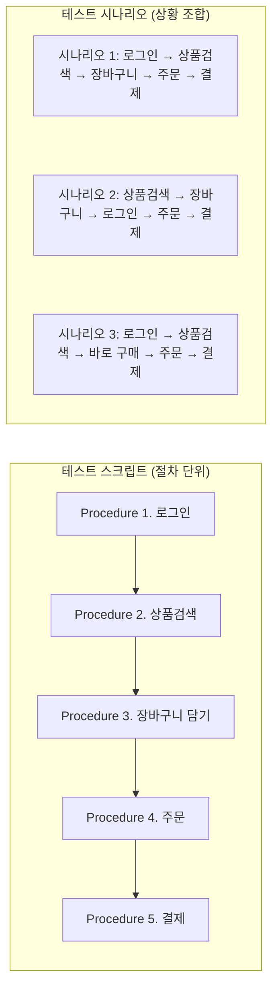
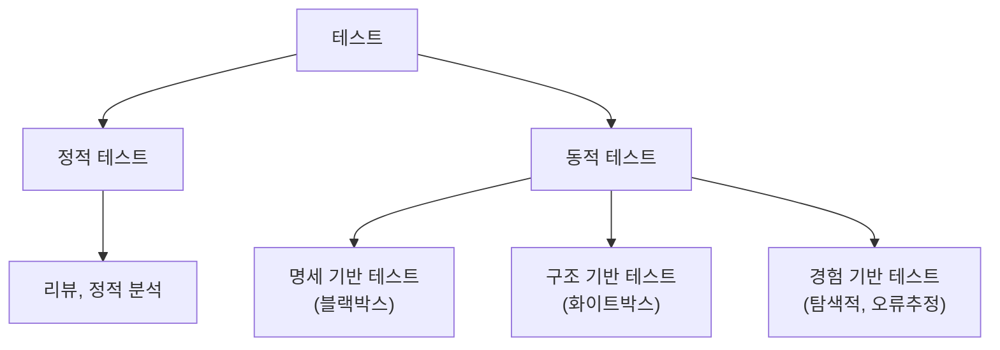
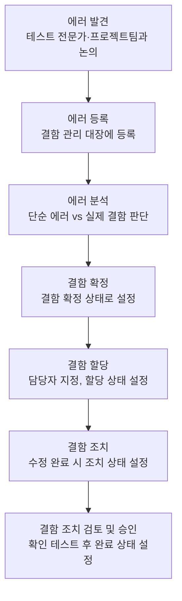
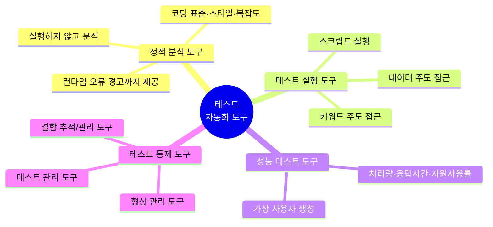
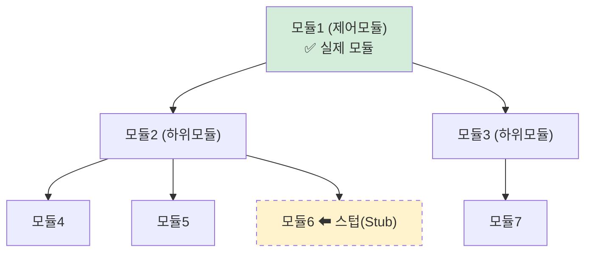
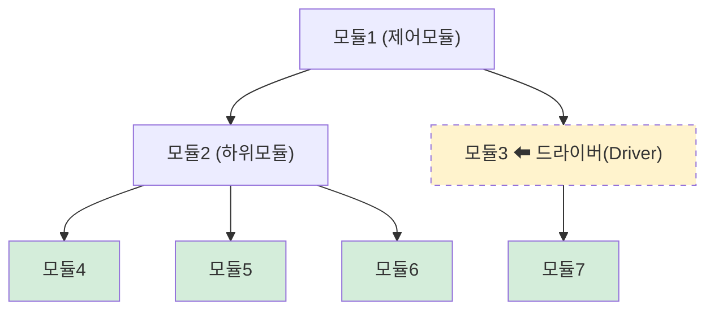
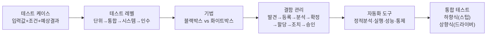

## 1. 테스트 케이스 설계

### 1-1. 테스트 케이스(Test Case)란 ★★★

테스트 케이스는 **특정 요구사항에 준수하는지를 확인하기 위해 개발된 입력값, 실행 조건, 예상된 결과의 집합**이다.

한 줄로 외우자. **"입력값 + 실행 조건 + 예상 결과"**. 이 세 단어 조합이 시험에 그대로 나온다.

### 1-2. 테스트 케이스 작성 절차

정확성, 재사용성, 간결성 보장을 위해 아래 순서대로 작성한다.

| 순서 | 절차 | 핵심 내용 |
|---|---|---|
| 1 | 테스트 계획 검토 및 자료 확보 | 프로젝트 범위·접근 방법 이해, 시스템 요구사항과 기능 명세서 검토 |
| 2 | 위험 평가 및 우선순위 결정 | 결함 해결의 상대적 중요성을 따져 테스트의 초점 결정 |
| 3 | 테스트 요구사항 정의 | 테스트할 특성, 조건, 기능을 식별·분석 |
| 4 | 테스트 구조 설계 및 방법 결정 | 케이스의 일반적 형식·분류 방법, 절차·장비·도구·문서화 방법 결정 |
| 5 | 테스트 케이스 정의 및 작성 | 요구사항별로 입력값(테스트 데이터), 조건, 예상 결과 기술 |
| 6 | 타당성 확인 및 유지보수 | 기능·환경 변화에 따라 케이스 갱신, 유용성 검토 |

### 1-3. 테스트 케이스 구성요소

구성요소는 **식별자, 테스트 항목, 입력 명세, 출력 명세, 환경설정, 특수절차요구, 의존성 기술**이다.

| 구성요소 | 내용 |
|---|---|
| 식별자 (Identifier) | 테스트 케이스를 고유하게 식별하기 위한 항목 식별자 |
| 테스트 항목 (Test Item) | 테스트할 모듈 또는 기능에 대한 간략한 내용 |
| 입력 명세 (Input Specification) | 테스트 실행 시 입력할 데이터(입력값, 선택 버튼, 체크리스트 값 등) 및 조건 |
| 출력 명세 (Output Specification) | 실행 시 기대되는 결과 데이터(출력값, 결과 화면, 기대 동작 등) |
| 환경설정 (Environmental Needs) | 테스트에 필요한 하드웨어·소프트웨어 환경, 물리적·논리적 테스트 환경 |
| 특수절차요구 (Special Procedure Requirement) | 케이스 수행 시 특별히 요구되는 절차 |
| 의존성 기술 (Inter-case Dependencies) | 테스트 케이스 간의 의존성 및 종속성 |

이외에도 테스트를 거친 기능의 **성공/실패를 판단하는 조건을 명확하게** 작성해야 한다.

---

## 2. 테스트 오라클(Test Oracle)

테스트 오라클은 **테스트 결과가 참인지 거짓인지 판단하기 위해, 사전에 정의된 참값을 입력하여 비교하는 기법**이다.

| 종류 | 내용 |
|---|---|
| 참(True) 오라클 | 모든 입력값에 대하여 기대하는 결과를 생성함으로써 발생된 오류를 모두 검출 |
| 샘플링(Sampling) 오라클 | 특정한 몇 개의 입력값에 대해서만 기대하는 결과를 제공 |
| 휴리스틱(Heuristic) 오라클 | 샘플링 오라클 개선판. 특정 입력값은 올바른 결과 제공, 나머지 값들은 휴리스틱(추정)으로 처리 |
| 일관성 검사(Consistent) 오라클 | 애플리케이션 변경이 있을 때, 수행 전과 후의 결괏값이 동일한지 확인 |

> ![star] 암기 팁: **참·샘·휴·일** — "참 샘물 휴일에 마신다"

---

## 3. 테스트 레벨 ★★★

### 3-1. 개념

- 테스트 레벨은 **함께 편성되고 관리되는 테스트 활동의 그룹**이다.
- 테스트 레벨은 프로젝트에서 **책임과 연관**되어 있다.
- 각각의 테스트 레벨은 **서로 독립적**이다.

### 3-2. V-모델

소프트웨어 개발 단계와 테스트 레벨을 연결하여 표현한 것을 **V-모델**이라고 한다.

  <svg xmlns="http://www.w3.org/2000/svg" viewBox="0 0 800 540" width="100%" style="display: block; margin: 0 auto; min-width: 750px;">
    
    <defs>
      <!-- V자 화살표 머리 (마커) -->
      <marker id="v-arrow" viewBox="0 0 10 10" refX="7" refY="5" markerWidth="5" markerHeight="5" orient="auto">
        <path d="M0,0 L10,5 L0,10 z" fill="#606468" />
      </marker>
      
      <!-- 상자 그림자 효과 -->
      <filter id="shadow" x="-10%" y="-10%" width="120%" height="120%">
        <feDropShadow dx="1.5" dy="2.5" stdDeviation="2" flood-color="#000000" flood-opacity="0.12" />
      </filter>

      <!-- 상자 배경 그라데이션 (교재 느낌의 미세한 입체감) -->
      <linearGradient id="boxBg" x1="0%" y1="0%" x2="0%" y2="100%">
        <stop offset="0%" stop-color="#ffffff" />
        <stop offset="100%" stop-color="#f1f3f5" />
      </linearGradient>
    </defs>

    <!-- 좌상단 타이틀 (테두리 밖) -->
    <g transform="translate(45, 30)">
      <circle cx="0" cy="0" r="10" fill="#995555" />
      <path d="M-5,-2 L0,4 L5,-2" fill="none" stroke="#ffffff" stroke-width="2.5" stroke-linecap="round" stroke-linejoin="round" />
      <text x="20" y="6" font-size="20" font-weight="bold" font-family="'Malgun Gothic', sans-serif" fill="#444">소프트웨어 생명주기의 V 모델</text>
    </g>

    <!-- 외곽 연한 회색 테두리 -->
    <rect x="30" y="55" width="740" height="465" rx="0" fill="none" stroke="#d1d4d7" stroke-width="1.5" />

    <!-- 중앙 이중 점선 -->
    <line x1="396" y1="70" x2="396" y2="500" stroke="#888" stroke-width="1.5" stroke-dasharray="6,4" />
    <line x1="404" y1="70" x2="404" y2="500" stroke="#888" stroke-width="1.5" stroke-dasharray="6,4" />

    <!-- 굵은 V자 배경 화살표 (상자들 뒤에 위치) -->
    <line x1="260" y1="110" x2="385" y2="295" stroke="#606468" stroke-width="10" marker-end="url(#v-arrow)" />
    <line x1="415" y1="295" x2="540" y2="110" stroke="#606468" stroke-width="10" marker-end="url(#v-arrow)" />

    <!-- ==========================================
         상자 생성 공통 속성 세팅
         ========================================== -->
    <g font-family="'Malgun Gothic', 'Apple SD Gothic Neo', sans-serif" text-anchor="middle" fill="#333">
      
      <!-- 1. 요구사항 (좌측 상단) -->
      <g transform="translate(110, 80)">
        <rect width="120" height="60" rx="6" fill="url(#boxBg)" stroke="#8e9297" stroke-width="1.2" filter="url(#shadow)" />
        <text x="60" y="26" font-size="14" font-weight="bold">요구사항</text>
        <text x="60" y="44" font-size="11.5" fill="#555">(Requirements)</text>
      </g>

      <!-- 2. 분석 -->
      <g transform="translate(180, 160)">
        <rect width="120" height="60" rx="6" fill="url(#boxBg)" stroke="#8e9297" stroke-width="1.2" filter="url(#shadow)" />
        <text x="60" y="26" font-size="14" font-weight="bold">분석</text>
        <text x="60" y="44" font-size="11.5" fill="#555">(Specification)</text>
      </g>

      <!-- 3. 설계 -->
      <g transform="translate(250, 240)">
        <rect width="120" height="60" rx="6" fill="url(#boxBg)" stroke="#8e9297" stroke-width="1.2" filter="url(#shadow)" />
        <text x="60" y="26" font-size="14" font-weight="bold">설계</text>
        <text x="60" y="44" font-size="11.5" fill="#555">(Design)</text>
      </g>

      <!-- 3-side. 검증 (설계 좌측, 요구사항과 수직 정렬) -->
      <g transform="translate(110, 240)">
        <rect width="120" height="60" rx="6" fill="url(#boxBg)" stroke="#8e9297" stroke-width="1.2" filter="url(#shadow)" />
        <text x="60" y="26" font-size="14" font-weight="bold">검증</text>
        <text x="60" y="44" font-size="11.5" fill="#555">(Verification)</text>
      </g>

      <!-- 4. 구현 (좌측 하단) -->
      <g transform="translate(250, 330)">
        <rect width="120" height="60" rx="6" fill="url(#boxBg)" stroke="#8e9297" stroke-width="1.2" filter="url(#shadow)" />
        <text x="60" y="26" font-size="14" font-weight="bold">구현</text>
        <text x="60" y="44" font-size="11.5" fill="#555">(Code)</text>
      </g>

      <!-- ========================================== -->

      <!-- 4. 단위 테스트 (우측 하단) -->
      <g transform="translate(430, 330)">
        <rect width="120" height="60" rx="6" fill="url(#boxBg)" stroke="#8e9297" stroke-width="1.2" filter="url(#shadow)" />
        <text x="60" y="26" font-size="14" font-weight="bold">단위 테스트</text>
        <text x="60" y="44" font-size="11.5" fill="#555">(Unit Testing)</text>
      </g>

      <!-- 3. 통합 테스트 -->
      <g transform="translate(430, 240)">
        <rect width="120" height="60" rx="6" fill="url(#boxBg)" stroke="#8e9297" stroke-width="1.2" filter="url(#shadow)" />
        <text x="60" y="20" font-size="14" font-weight="bold">통합 테스트</text>
        <text x="60" y="37" font-size="11.5" fill="#555">(Integration</text>
        <text x="60" y="51" font-size="11.5" fill="#555">Testing)</text>
      </g>

      <!-- 3-side. 확인 (통합 테스트 우측, 인수 테스트와 수직 정렬) -->
      <g transform="translate(570, 240)">
        <rect width="120" height="60" rx="6" fill="url(#boxBg)" stroke="#8e9297" stroke-width="1.2" filter="url(#shadow)" />
        <text x="60" y="26" font-size="14" font-weight="bold">확인</text>
        <text x="60" y="44" font-size="11.5" fill="#555">(Validation)</text>
      </g>

      <!-- 2. 시스템 테스트 -->
      <g transform="translate(500, 150)">
        <rect width="120" height="60" rx="6" fill="url(#boxBg)" stroke="#8e9297" stroke-width="1.2" filter="url(#shadow)" />
        <text x="60" y="20" font-size="14" font-weight="bold">시스템 테스트</text>
        <text x="60" y="37" font-size="11.5" fill="#555">(System</text>
        <text x="60" y="51" font-size="11.5" fill="#555">Testing)</text>
      </g>

      <!-- 1. 인수 테스트 (우측 상단) -->
      <g transform="translate(570, 80)">
        <rect width="120" height="60" rx="6" fill="url(#boxBg)" stroke="#8e9297" stroke-width="1.2" filter="url(#shadow)" />
        <text x="60" y="20" font-size="14" font-weight="bold">인수 테스트</text>
        <text x="60" y="37" font-size="11.5" fill="#555">(Acceptance</text>
        <text x="60" y="51" font-size="11.5" fill="#555">Testing)</text>
      </g>

    </g>

    <!-- ==========================================
         하단 텍스트 및 버튼 (테두리 안쪽에 완벽히 위치)
         ========================================== -->
    <g font-family="'Malgun Gothic', sans-serif" text-anchor="middle">
      
      <!-- 왼쪽 (소프트웨어 아키텍트) -->
      <text x="240" y="440" font-size="14" font-weight="bold" fill="#333">소프트웨어 아키텍트</text>
      <!-- 버튼 영역 -->
      <rect x="150" y="455" width="180" height="32" rx="16" fill="#5a6066" />
      <text x="240" y="476" font-size="13.5" font-weight="bold" fill="#ffffff">테스트 계획 및 설계</text>

      <!-- 오른쪽 (테스트 매니저) -->
      <text x="560" y="440" font-size="14" font-weight="bold" fill="#333">테스트 매니저</text>
      <!-- 버튼 영역 -->
      <rect x="490" y="455" width="140" height="32" rx="16" fill="#5a6066" />
      <text x="560" y="476" font-size="13.5" font-weight="bold" fill="#ffffff">테스트 수행</text>

    </g>

  </svg>

왼쪽(빨강)은 **테스트 계획 및 설계** 단계, 오른쪽(파랑)은 **테스트 수행** 단계다. 개발 단계마다 대응되는 테스트 레벨이 있다는 게 핵심.

### 3-3. 테스트 레벨 종류

| 종류 | 설명 | 기법 |
|---|---|---|
| 단위 테스트 | 사용자 요구사항에 대한 단위 모듈, 서브루틴 등을 테스트하는 단계 | 인터페이스 테스트, 자료 구조 테스트, 실행 경로 테스트, 오류 처리 테스트 |
| 통합 테스트 | 단위 테스트를 통과한 컴포넌트 간의 인터페이스를 테스트하는 단계 | 빅뱅 테스트, 상향식/하향식 테스트 |
| 시스템 테스트 | 개발 프로젝트 차원에서 정의된 전체 시스템 또는 제품의 동작에 대해 테스트하는 단계 | 기능/비기능 요구사항 테스트 |
| 인수 테스트 | 계약상의 요구사항이 만족되었는지 확인하기 위한 테스트 단계 | 알파/베타 테스트 |

#### ① 단위 테스트(Unit Test)

- 소프트웨어 설계의 **최소 단위인 모듈이나 컴포넌트**에 초점을 맞춘 테스트다.
- 자료 구조, 인터페이스, 외부적 I/O, 독립적 기초 경로, 오류 처리 경로, 경계 조건 등을 검사한다.
- 명세 기반(블랙박스)과 구조 기반(화이트박스)으로 나뉘지만 **주로 구조 기반 테스트 위주**로 수행한다.

#### ② 통합 테스트(Integration Test)

- 소프트웨어 각 **모듈 간의 인터페이스 관련 오류 및 결함**을 찾아내기 위한 체계적인 테스트 기법이다.
- 단위 테스트가 끝난 모듈/컴포넌트가 설계 단계에서 제시한 애플리케이션과 동일한 구조·기능으로 구현됐는지 확인한다.

#### ③ 시스템 테스트(System Test)

- 통합된 단위 시스템의 기능이 **시스템에서 정상적으로 수행되는지 검증**하는 테스트다.
- 컴퓨터 시스템을 완벽하게 검사하기 위한 목적 또는 성능 목표를 가지고 테스트한다.

| 유형 | 설명 |
|---|---|
| 기능적 요구사항 테스트 | 요구사항 명세서, 비즈니스 절차, 유스케이스 등 명세서 기반의 **블랙박스** 테스트 |
| 비기능적 요구사항 테스트 | 성능·회복·보안 테스트, 메뉴 구조, 웹 페이지 내비게이션 등 구조적 요소에 대한 **화이트박스** 테스트 |

#### ④ 인수 테스트(Acceptance Test)

- **최종 사용자와 업무 이해관계자 등이 테스트를 수행**함으로써 개발된 제품에 대해 **운영 여부를 결정**하는 테스트다.
- 시스템의 일부 또는 특정 비기능적 특성에 대해 확인한다.

| 종류 | 설명 |
|---|---|
| 알파 테스트 (Alpha Test) | 선택된 사용자가 **개발자 환경에서 통제된 상태로 개발자와 함께** 수행하는 인수 테스트 |
| 베타 테스트 (Beta Test) | **실제 환경**에서 일정 수의 사용자에게 사용하게 하고 피드백을 받는 인수 테스트. **필드 테스팅(Field Testing)**이라고도 하며, 개발자 없이 고객의 사용 환경에서 수행 |

> ![star] 알파 = 개발자 옆에서, 베타 = 개발자 없이 현장에서. 이 대비만 기억하면 된다.

---

## 4. 테스트 시나리오 ★

- 테스트 시나리오는 **테스트되어야 할 기능 및 특징, 테스트가 필요한 상황을 작성한 문서**다.
- 테스트 수행 절차를 미리 정함으로써 설계 단계에서 중요시되던 요구사항이나 대안 흐름 같은 테스트 항목을 **빠짐없이 테스트**하기 위함이다.

**작성 시 유의점**

- 테스트 항목을 하나의 시나리오에 모두 몰아넣지 말고 **시스템별, 모듈별, 항목별로 분리 작성**한다.
- 고객의 요구사항과 설계 문서 등을 토대로 작성한다.
- 각 테스트 항목은 **식별자 번호, 순서 번호, 테스트 데이터, 테스트 케이스, 예상 결과, 확인** 등의 항목을 포함한다.

### 테스트 스크립트 vs 테스트 시나리오 (헷갈림 주의)

- **테스트 스크립트** = 특정 기능에 대한 상세 절차. 테스트 케이스의 실행 순서를 작성한 문서 (테스트 스텝, 테스트 절차서라고도 함)
- **테스트 시나리오** = 사용자가 시스템을 사용하면서 만나게 되는 상황을 개략적으로 구성한 것

온라인 쇼핑몰 예시로 보면 바로 이해된다.

스크립트가 중복되지 않게 절차를 쪼개두고, 시나리오는 그 절차들을 사용자 상황에 맞게 조합한 것이다. 하나의 시나리오는 하나 또는 여러 개의 테스트 케이스를 포함할 수 있고, **시나리오와 케이스는 일 대 다 관계**를 가진다.

---

## 5. 테스트 지식 체계 ★★★

소프트웨어 테스트는 **프로그램 실행 여부, 테스트 기법, 테스트 시각, 테스트 목적** 등에 따라 분류할 수 있다.

### 5-1. 프로그램 실행 여부에 따른 분류

| 분류 | 설명 | 유형 |
|---|---|---|
| 정적 테스트 | 테스트 대상을 **실행하지 않고** 구조를 분석하여 논리성을 검증 | 리뷰(동료 검토, 워크스루, 인스펙션), 정적분석 |
| 동적 테스트 | 소프트웨어를 **실행하는 방식**으로 테스트를 수행하여 결함 검출 | 화이트박스, 블랙박스, 경험 기반 테스트 |

> 경험 기반 테스트도 블랙박스 테스트에 포함되기도 한다.

### 5-2. 블랙박스 테스트(Black-box Test)

- 프로그램 **외부 사용자의 요구사항 명세를 보면서 수행하는 테스트(기능 테스트)**다.
- 소프트웨어의 특징, 요구사항, 설계 명세서 등에 초점을 맞춰 테스트한다.
- 기능·동작 위주라서 **내부 구조나 작동 원리를 몰라도 가능**하다.
- **명세 테스트**라고도 부른다.

#### 블랙박스 테스트 유형 총정리

  <h3 style="margin-top: 0; color: #333; display: flex; align-items: center; gap: 8px; font-size: 1.2em;">
    🔘 블랙박스 테스트 유형
  </h3>
  
  <table style="width: 100%; border-collapse: collapse; min-width: 850px; font-family: 'Helvetica Neue', Arial, sans-serif; font-size: 14px; text-align: left; color: #333;">
    <thead>
      <tr style="background-color: #e9ecef; border-top: 2px solid #868e96; border-bottom: 2px solid #868e96; text-align: center;">
        <th style="padding: 12px; border-right: 1px solid #dee2e6; width: 18%;">유형</th>
        <th style="padding: 12px; border-right: 1px solid #dee2e6; width: 42%;">사례</th>
        <th style="padding: 12px; width: 40%;">설명</th>
      </tr>
    </thead>
    <tbody>
      
      <!-- 1. 동등 분할 테스트 -->
      <tr style="border-bottom: 1px solid #dee2e6;">
        <td style="padding: 15px; border-right: 1px solid #dee2e6; text-align: center;">
          <strong>동등 분할 테스트</strong> 
          (Equivalence Partitioning Testing)
        </td>
        <td style="padding: 15px; border-right: 1px solid #dee2e6;">
          

            시험 대상: 0 ≤ X ≤ 100
          

          <svg viewBox="0 0 300 50" width="100%" style="max-width: 300px; display: block; margin: 0 auto;">
            <line x1="20" y1="20" x2="280" y2="20" stroke="#444" stroke-width="1.5"/>
            <line x1="100" y1="15" x2="100" y2="25" stroke="#444" stroke-width="1.5"/>
            <line x1="200" y1="15" x2="200" y2="25" stroke="#444" stroke-width="1.5"/>
            <text x="100" y="40" text-anchor="middle" font-size="12">0</text>
            <text x="200" y="40" text-anchor="middle" font-size="12">100</text>
            <text x="60" y="15" text-anchor="middle" font-size="14">①</text>
            <text x="150" y="15" text-anchor="middle" font-size="14">②</text>
            <text x="240" y="15" text-anchor="middle" font-size="14">③</text>
          </svg>
          

            <strong>각 그룹별 대푯값 선정</strong> 
            ① X = -10 ② X = 50 ③ X = 1000
          

        </td>
        <td style="padding: 15px; line-height: 1.5;">
          • 입력 데이터의 영역을 유사한 도메인별로 유횻값/무횻값으로 그룹핑하고 대푯값으로 테스트 케이스를 도출하여 테스트하는 기법
        </td>
      </tr>

      <!-- 2. 경곗값 분석 테스트 -->
      <tr style="border-bottom: 1px solid #dee2e6;">
        <td style="padding: 15px; border-right: 1px solid #dee2e6; text-align: center;">
          <strong>경곗값 분석 테스트</strong> 
          (Boundary Value Analysis Testing)
        </td>
        <td style="padding: 15px; border-right: 1px solid #dee2e6;">
          

            시험 대상: 0 ≤ X ≤ 100
          

          <table style="width: 100%; text-align: center; border-collapse: collapse; margin-bottom: 10px;">
            <tr>
              <td style="border-right: 1px solid #888; padding: 5px;">···, -1, 0</td>
              <td style="border-right: 1px solid #888; padding: 5px;">1, 2, ···, 99, 100</td>
              <td style="padding: 5px;">101, 102, ···</td>
            </tr>
            <tr style="font-size: 0.9em; color: #555;">
              <td style="padding-top: 5px;">0</td>
              <td></td>
              <td style="padding-top: 5px;">100</td>
            </tr>
          </table>
          

            <strong>X = 0, 1, 100, 101</strong>
          

        </td>
        <td style="padding: 15px; line-height: 1.5;">
          • 등가분할 후 경곗값 부분에서 오류 발생 확률이 높기에 경곗값을 포함하여 테스트 케이스를 설계하여 테스트하는 기법 
          • "최솟값 바로 위, 최대치 바로 아래" 등 입력값의 극한 한계를 테스트하는 기법
        </td>
      </tr>

      <!-- 3. 결정 테이블 테스트 -->
      <tr style="border-bottom: 1px solid #dee2e6;">
        <td style="padding: 15px; border-right: 1px solid #dee2e6; text-align: center;">
          <strong>결정 테이블 테스트</strong> 
          (Decision Table Testing)
        </td>
        <td style="padding: 15px; border-right: 1px solid #dee2e6;">
          <table style="width: 100%; border-collapse: collapse; text-align: center; font-size: 0.85em; border: 1px solid #bbb; margin-bottom: 10px;">
            <tr style="background-color: #e9ecef;">
              <td colspan="2" style="border: 1px solid #bbb; padding: 4px;">테스트 케이스 번호</td>
              <td style="border: 1px solid #bbb;">1</td><td style="border: 1px solid #bbb;">2</td><td style="border: 1px solid #bbb;">3</td><td style="border: 1px solid #bbb;">4</td><td style="border: 1px solid #bbb;">5</td>
            </tr>
            <tr>
              <td rowspan="3" style="border: 1px solid #bbb; padding: 4px; background-color: #f8f9fa;">의사 결정</td>
              <td style="border: 1px solid #bbb; padding: 4px;">현금 주문</td>
              <td style="border: 1px solid #bbb;">Y</td><td style="border: 1px solid #bbb;">Y</td><td style="border: 1px solid #bbb;">N</td><td style="border: 1px solid #bbb;">N</td><td style="border: 1px solid #bbb;">N</td>
            </tr>
            <tr>
              <td style="border: 1px solid #bbb; padding: 4px;">신용 카드</td>
              <td style="border: 1px solid #bbb;">-</td><td style="border: 1px solid #bbb;">-</td><td style="border: 1px solid #bbb;">Y</td><td style="border: 1px solid #bbb;">Y</td><td style="border: 1px solid #bbb;">N</td>
            </tr>
            <tr>
              <td style="border: 1px solid #bbb; padding: 4px;">우수 고객</td>
              <td style="border: 1px solid #bbb;">Y</td><td style="border: 1px solid #bbb;">N</td><td style="border: 1px solid #bbb;">Y</td><td style="border: 1px solid #bbb;">N</td><td style="border: 1px solid #bbb;">-</td>
            </tr>
            <tr>
              <td rowspan="4" style="border: 1px solid #bbb; padding: 4px; background-color: #f8f9fa;">액션</td>
              <td style="border: 1px solid #bbb; padding: 4px;">주문 처리</td>
              <td style="border: 1px solid #bbb;">V</td><td style="border: 1px solid #bbb;">V</td><td style="border: 1px solid #bbb;">V</td><td style="border: 1px solid #bbb;">V</td><td style="border: 1px solid #bbb;"></td>
            </tr>
            <tr>
              <td style="border: 1px solid #bbb; padding: 4px;">주문 거부</td>
              <td style="border: 1px solid #bbb;"></td><td style="border: 1px solid #bbb;"></td><td style="border: 1px solid #bbb;"></td><td style="border: 1px solid #bbb;"></td><td style="border: 1px solid #bbb;">V</td>
            </tr>
            <tr>
              <td style="border: 1px solid #bbb; padding: 4px;">10% 할인</td>
              <td style="border: 1px solid #bbb;">V</td><td style="border: 1px solid #bbb;"></td><td style="border: 1px solid #bbb;">V</td><td style="border: 1px solid #bbb;"></td><td style="border: 1px solid #bbb;"></td>
            </tr>
            <tr>
              <td style="border: 1px solid #bbb; padding: 4px;">정상 가격</td>
              <td style="border: 1px solid #bbb;"></td><td style="border: 1px solid #bbb;">V</td><td style="border: 1px solid #bbb;"></td><td style="border: 1px solid #bbb;">V</td><td style="border: 1px solid #bbb;"></td>
            </tr>
          </table>
          

            <strong>테스트 케이스:</strong> 
            1) 명령은 현금지급 또는 신용 인증일 때만 수행 
            2) 우수 고객 10% 할인이 가능하고 다른 모든 고객은 전액 모두 지급함
          

        </td>
        <td style="padding: 15px; line-height: 1.5;">
          • 요구사항의 논리와 발생 조건을 테이블 형태로 나열하여, 조건과 행위를 모두 조합하여 테스트하는 기법
        </td>
      </tr>

      <!-- 4. 상태전이 테스트 -->
      <tr style="border-bottom: 1px solid #dee2e6;">
        <td style="padding: 15px; border-right: 1px solid #dee2e6; text-align: center;">
          <strong>상태전이 테스트</strong> 
          (State Transition Testing)
        </td>
        <td style="padding: 15px; border-right: 1px solid #dee2e6;">
          <svg viewBox="0 0 280 140" width="100%" style="max-width: 280px; display: block; margin: 0 auto;">
            <defs>
              <marker id="arrow" viewBox="0 0 10 10" refX="8" refY="5" markerWidth="6" markerHeight="6" orient="auto">
                <path d="M0,0 L10,5 L0,10 z" fill="#555"/>
              </marker>
            </defs>
            <rect x="20" y="50" width="70" height="34" rx="6" fill="#e9ecef" stroke="#888" stroke-width="1.5"/>
            <text x="55" y="72" text-anchor="middle" font-size="12">Idle</text>
            
            <rect x="180" y="10" width="70" height="34" rx="6" fill="#e9ecef" stroke="#888" stroke-width="1.5"/>
            <text x="215" y="32" text-anchor="middle" font-size="12">Running</text>
            
            <rect x="180" y="90" width="70" height="34" rx="6" fill="#e9ecef" stroke="#888" stroke-width="1.5"/>
            <text x="215" y="112" text-anchor="middle" font-size="12">Paused</text>

            <path d="M 90 55 L 175 25" fill="none" stroke="#555" stroke-width="1.5" marker-end="url(#arrow)"/>
            <text x="140" y="30" text-anchor="middle" font-size="10" fill="#444">Start</text>

            <path d="M 210 44 L 210 85" fill="none" stroke="#555" stroke-width="1.5" marker-end="url(#arrow)"/>
            <text x="230" y="70" text-anchor="middle" font-size="10" fill="#444">Stop</text>

            <path d="M 220 90 L 220 49" fill="none" stroke="#555" stroke-width="1.5" marker-end="url(#arrow)"/>
            <text x="195" y="70" text-anchor="middle" font-size="10" fill="#444">Start</text>

            <path d="M 180 105 L 85 75" fill="none" stroke="#555" stroke-width="1.5" marker-end="url(#arrow)"/>
            <text x="135" y="105" text-anchor="middle" font-size="10" fill="#444">Reset</text>

            <path d="M 180 30 L 90 65" fill="none" stroke="#555" stroke-width="1.5" marker-end="url(#arrow)"/>
            <text x="120" y="65" text-anchor="middle" font-size="10" fill="#444">Reset</text>
          </svg>
        </td>
        <td style="padding: 15px; line-height: 1.5;">
          • 테스트 대상/시스템이나 객체의 상태를 구분하고, 이벤트에 의해 어느 한 상태에서 다른 상태로 전이되는 경우의 수를 테스트하는 기법
        </td>
      </tr>

      <!-- 5. 유스케이스 테스트 -->
      <tr style="border-bottom: 1px solid #dee2e6;">
        <td style="padding: 15px; border-right: 1px solid #dee2e6; text-align: center;">
          <strong>유스케이스 테스트</strong> 
          (Use Case Testing)
        </td>
        <td style="padding: 15px; border-right: 1px solid #dee2e6;">
          <svg viewBox="0 0 280 130" width="100%" style="max-width: 280px; display: block; margin: 0 auto;">
            <circle cx="50" cy="50" r="10" fill="none" stroke="#333" stroke-width="1.5"/>
            <line x1="50" y1="60" x2="50" y2="90" stroke="#333" stroke-width="1.5"/>
            <line x1="50" y1="70" x2="30" y2="60" stroke="#333" stroke-width="1.5"/>
            <line x1="50" y1="70" x2="70" y2="60" stroke="#333" stroke-width="1.5"/>
            <line x1="50" y1="90" x2="35" y2="115" stroke="#333" stroke-width="1.5"/>
            <line x1="50" y1="90" x2="65" y2="115" stroke="#333" stroke-width="1.5"/>
            
            <line x1="80" y1="70" x2="115" y2="70" stroke="#333" stroke-width="1.5" marker-end="url(#arrow)"/>
            
            <ellipse cx="150" cy="70" rx="30" ry="15" fill="#f8f9fa" stroke="#555" stroke-width="1.5"/>
            <text x="150" y="74" text-anchor="middle" font-size="11">인출</text>

            <ellipse cx="240" cy="35" rx="35" ry="15" fill="#f8f9fa" stroke="#555" stroke-width="1.5"/>
            <text x="240" y="39" text-anchor="middle" font-size="11">암호</text>

            <ellipse cx="240" cy="105" rx="35" ry="15" fill="#f8f9fa" stroke="#555" stroke-width="1.5"/>
            <text x="240" y="109" text-anchor="middle" font-size="11">잔액 체크</text>

            <line x1="175" y1="60" x2="210" y2="45" stroke="#555" stroke-width="1" stroke-dasharray="4,2" marker-end="url(#arrow)"/>
            <text x="200" y="47" text-anchor="middle" font-size="9" fill="#666" transform="rotate(-20 200,47)">&lt;&lt;include&gt;&gt;</text>
            
            <line x1="175" y1="80" x2="210" y2="95" stroke="#555" stroke-width="1" stroke-dasharray="4,2" marker-end="url(#arrow)"/>
            <text x="195" y="105" text-anchor="middle" font-size="9" fill="#666" transform="rotate(20 195,105)">&lt;&lt;include&gt;&gt;</text>
          </svg>
        </td>
        <td style="padding: 15px; line-height: 1.5;">
          • 시스템이 실제 사용되는 유스케이스로 모델링 되어 있을 때 프로세스 흐름을 기반으로 테스트 케이스를 명세화하여 수행하는 테스트 기법
        </td>
      </tr>

      <!-- 6. 분류 트리 테스트 -->
      <tr style="border-bottom: 1px solid #dee2e6;">
        <td style="padding: 15px; border-right: 1px solid #dee2e6; text-align: center;">
          <strong>분류 트리 테스트</strong> 
          (Classification Tree Method Testing)
        </td>
        <td style="padding: 15px; border-right: 1px solid #dee2e6;">
          <svg viewBox="0 0 280 100" width="100%" style="max-width: 280px; display: block; margin: 0 auto;">
            <rect x="90" y="10" width="100" height="25" fill="#f8f9fa" stroke="#888" stroke-width="1"/>
            <text x="140" y="27" text-anchor="middle" font-size="12">표 만들기</text>
            
            <line x1="140" y1="35" x2="140" y2="55" stroke="#555" stroke-width="1.5"/>
            <line x1="70" y1="55" x2="210" y2="55" stroke="#555" stroke-width="1.5"/>
            <line x1="70" y1="55" x2="70" y2="65" stroke="#555" stroke-width="1.5"/>
            <line x1="210" y1="55" x2="210" y2="65" stroke="#555" stroke-width="1.5"/>

            <rect x="25" y="65" width="90" height="25" fill="#f8f9fa" stroke="#888" stroke-width="1"/>
            <text x="70" y="82" text-anchor="middle" font-size="12">줄 개수 변경</text>
            
            <rect x="165" y="65" width="90" height="25" fill="#f8f9fa" stroke="#888" stroke-width="1"/>
            <text x="210" y="82" text-anchor="middle" font-size="12">칸 개수 변경</text>
          </svg>
        </td>
        <td style="padding: 15px; line-height: 1.5;">
          • SW의 일부 또는 전체를 트리 구조로 분석 및 표현하여 테스트 케이스를 설계하여 테스트하는 기법
        </td>
      </tr>

      <!-- 7. 페어와이즈 테스트 -->
      <tr style="border-bottom: 1px solid #dee2e6;">
        <td style="padding: 15px; border-right: 1px solid #dee2e6; text-align: center;">
          <strong>페어와이즈 테스트</strong> 
          (Pairwise Testing)
        </td>
        <td style="padding: 15px; border-right: 1px solid #dee2e6;">
          <table style="width: 100%; border-collapse: collapse; text-align: center; font-size: 0.85em; border: 1px solid #bbb; margin-bottom: 8px;">
            <tr style="background-color: #e9ecef;">
              <td style="border: 1px solid #bbb; padding: 4px;">재생</td>
              <td style="border: 1px solid #bbb; padding: 4px;">볼륨</td>
              <td style="border: 1px solid #bbb; padding: 4px;">이퀄라이저</td>
            </tr>
            <tr><td style="border: 1px solid #bbb;">play</td><td style="border: 1px solid #bbb;">크게</td><td style="border: 1px solid #bbb;">off</td></tr>
            <tr><td style="border: 1px solid #bbb;">play</td><td style="border: 1px solid #bbb;">작게</td><td style="border: 1px solid #bbb;">on</td></tr>
            <tr><td style="border: 1px solid #bbb;">stop</td><td style="border: 1px solid #bbb;">크게</td><td style="border: 1px solid #bbb;">on</td></tr>
            <tr><td style="border: 1px solid #bbb;">stop</td><td style="border: 1px solid #bbb;">작게</td><td style="border: 1px solid #bbb;">off</td></tr>
          </table>
          
(모든 조합을 최소화하여 구성)

        </td>
        <td style="padding: 15px; line-height: 1.5;">
          • 테스트 데이터 간에 최소한 한 번씩을 조합하는 방식이며, 이는 커버해야 할 기능적 범위를 모든 조합에 비해 상대적으로 적은 양의 테스트 세트를 구성하기 위한 테스트 기법
        </td>
      </tr>

      <!-- 8. 원인-결과 그래프 테스트 -->
      <tr style="border-bottom: 1px solid #dee2e6;">
        <td style="padding: 15px; border-right: 1px solid #dee2e6; text-align: center;">
          <strong>원인-결과 그래프 테스트</strong> 
          (Cause-Effect Graph Testing)
        </td>
        <td style="padding: 15px; border-right: 1px solid #dee2e6; text-align: center; color: #888; font-size: 0.9em;">
          (다이어그램 생략)
        </td>
        <td style="padding: 15px; line-height: 1.5;">
          • 그래프를 활용하여 입력 데이터 간의 관계 및 출력에 미치는 영향을 분석하여 효용성이 높은 테스트 케이스를 선정하여 테스트하는 기법
        </td>
      </tr>

      <!-- 9. 비교 테스트 (새로 추가됨) -->
      <tr style="border-bottom: 1px solid #dee2e6;">
        <td style="padding: 15px; border-right: 1px solid #dee2e6; text-align: center;">
          <strong>비교 테스트</strong> 
          (Comparison Testing)
        </td>
        <!-- 설명 칸을 2칸으로 병합하여 길게 표시 -->
        <td colspan="2" style="padding: 15px; line-height: 1.5;">
          • 여러 버전의 프로그램에 같은 입력값을 넣어서 동일한 결과 데이터가 나오는지 비교해 보는 테스트 기법
        </td>
      </tr>

      <!-- 10. 오류 추정 테스트 (새로 추가됨) -->
      <tr>
        <td style="padding: 15px; border-right: 1px solid #dee2e6; text-align: center;">
          <strong>오류 추정 테스트</strong> 
          (Error Guessing Testing)
        </td>
        <!-- 설명 칸을 2칸으로 병합하여 길게 표시 -->
        <td colspan="2" style="padding: 15px; line-height: 1.5;">
          • 개발자가 범할 수 있는 실수를 추정하고 이에 따른 결함이 검출되도록 테스트 케이스를 설계하여 테스트하는 기법 
          • 특정 테스트 대상이 주어지면 테스터의 경험과 직관을 바탕으로 개발자가 범할 수 있는 실수들을 나열하고, 해당 실수에 따른 결함을 노출하는 테스트로 다른 블랙박스 테스트 기법을 보완할 때 사용하는 기법
        </td>
      </tr>

    </tbody>
  </table>

### 5-3. 화이트박스 테스트(White-box Test)

- 각 응용 프로그램의 **내부 구조와 동작을 검사**하는 소프트웨어 테스트다.
- 코드 분석과 프로그램 구조 지식을 바탕으로 모듈 내부를 직접 관찰하며 테스트한다.
- **소스 코드의 모든 문장을 한 번 이상 수행**함으로써 진행된다.
- 제어 구조에 따라 선택, 반복 등의 부분을 수행하며 논리적 경로를 점검한다.
- **구조 기반 테스트, 코드 기반 테스트, 로직 기반 테스트, 글래스(Glass)박스 테스트**라고도 부른다.

  
  <h3 style="margin-top: 0; margin-bottom: 25px; color: #333; display: flex; align-items: center; gap: 8px; font-size: 1.2em;">
    🔘 화이트박스 테스트 예시
  </h3>

  <svg xmlns="http://www.w3.org/2000/svg" viewBox="0 0 680 620" width="100%" style="display: block; margin: 0 auto; min-width: 600px;">
    <defs>
      <!-- 화살표 머리 정의 -->
      <marker id="arrow-head" viewBox="0 0 10 10" refX="8" refY="5" markerWidth="6" markerHeight="6" orient="auto">
        <path d="M0,0 L10,5 L0,10 z" fill="#343a40" />
      </marker>
    </defs>

    <!-- 배경 연한 테두리 박스 -->
    <rect x="20" y="10" width="640" height="590" fill="none" stroke="#dee2e6" stroke-width="1.5" />

    <g font-family="'Helvetica Neue', Arial, sans-serif" text-anchor="middle" fill="#212529">
      
      <!-- ==================== 노드 (박스 및 마름모) ==================== -->
      
      <!-- ① Node 1 -->
      <rect x="180" y="50" width="160" height="46" rx="6" fill="#f8f9fa" stroke="#495057" stroke-width="1.5" />
      <text x="260" y="78" font-size="14">POINTER = FALSE</text>
      <circle cx="360" cy="73" r="8" fill="#fff" stroke="#adb5bd" stroke-width="1.2"/>
      <text x="360" y="77" font-size="11" fill="#495057">1</text>

      <!-- ② Node 2 (조건문) -->
      <polygon points="260,130 340,165 260,200 180,165" fill="#f8f9fa" stroke="#495057" stroke-width="1.5" />
      <text x="260" y="170" font-size="14">X &gt; K ?</text>
      <circle cx="355" cy="140" r="8" fill="#fff" stroke="#adb5bd" stroke-width="1.2"/>
      <text x="355" y="144" font-size="11" fill="#495057">2</text>

      <!-- ③ Node 3 -->
      <rect x="420" y="142" width="160" height="46" rx="6" fill="#f8f9fa" stroke="#495057" stroke-width="1.5" />
      <text x="500" y="170" font-size="14">POINTER = TRUE</text>
      <circle cx="600" cy="165" r="8" fill="#fff" stroke="#adb5bd" stroke-width="1.2"/>
      <text x="600" y="169" font-size="11" fill="#495057">3</text>

      <!-- ④ Node 4 -->
      <rect x="160" y="240" width="200" height="46" rx="6" fill="#f8f9fa" stroke="#495057" stroke-width="1.5" />
      <text x="260" y="268" font-size="14">X = X + 2</text>
      <circle cx="380" cy="263" r="8" fill="#fff" stroke="#adb5bd" stroke-width="1.2"/>
      <text x="380" y="267" font-size="11" fill="#495057">4</text>

      <!-- ⑤ Node 5 -->
      <rect x="140" y="320" width="240" height="56" rx="6" fill="#f8f9fa" stroke="#495057" stroke-width="1.5" />
      <text x="260" y="344" font-size="13">CALL SUB(X, POINTER,</text>
      <text x="260" y="364" font-size="13">RESULT)</text>
      <circle cx="400" cy="348" r="8" fill="#fff" stroke="#adb5bd" stroke-width="1.2"/>
      <text x="400" y="352" font-size="11" fill="#495057">5</text>

      <!-- ⑥ Node 6 (조건문) -->
      <polygon points="260,410 340,445 260,480 180,445" fill="#f8f9fa" stroke="#495057" stroke-width="1.5" />
      <text x="260" y="450" font-size="14">RESULT &gt; 1 ?</text>
      <circle cx="355" cy="420" r="8" fill="#fff" stroke="#adb5bd" stroke-width="1.2"/>
      <text x="355" y="424" font-size="11" fill="#495057">6</text>

      <!-- ⑦ Node 7 -->
      <rect x="420" y="422" width="160" height="46" rx="6" fill="#f8f9fa" stroke="#495057" stroke-width="1.5" />
      <text x="500" y="450" font-size="14">PRINT RESULT</text>
      <circle cx="600" cy="445" r="8" fill="#fff" stroke="#adb5bd" stroke-width="1.2"/>
      <text x="600" y="449" font-size="11" fill="#495057">7</text>

      <!-- 종료 텍스트 -->
      <text x="260" y="555" font-size="15" font-weight="bold">종료</text>

      <!-- ==================== 화살표 및 흐름선 ==================== -->
      
      <g stroke="#343a40" stroke-width="1.5" fill="none">
        
        <!-- 시작 -> 1 -->
        <line x1="260" y1="20" x2="260" y2="50" marker-end="url(#arrow-head)" />
        
        <!-- 1 -> 2 -->
        <line x1="260" y1="96" x2="260" y2="130" marker-end="url(#arrow-head)" />
        
        <!-- 2 -> 3 (YES) -->
        <line x1="340" y1="165" x2="420" y2="165" marker-end="url(#arrow-head)" />
        
        <!-- 2 -> 4 (NO) -->
        <line x1="260" y1="200" x2="260" y2="240" marker-end="url(#arrow-head)" />
        
        <!-- 3 -> 4 (합류선, 화살표 없음) -->
        <path d="M 500 188 L 500 220 L 260 220" />
        
        <!-- 4 -> 5 -->
        <line x1="260" y1="286" x2="260" y2="320" marker-end="url(#arrow-head)" />
        
        <!-- 5 -> 6 -->
        <line x1="260" y1="376" x2="260" y2="410" marker-end="url(#arrow-head)" />
        
        <!-- 6 -> 종료 (YES) -->
        <line x1="260" y1="480" x2="260" y2="535" marker-end="url(#arrow-head)" />
        
        <!-- 6 -> 7 (NO) -->
        <line x1="340" y1="445" x2="420" y2="445" marker-end="url(#arrow-head)" />
        
        <!-- 7 -> 1 (왼쪽으로 크게 도는 반복문 Loop) -->
        <path d="M 500 468 L 500 580 L 80 580 L 80 73 L 180 73" marker-end="url(#arrow-head)" />
      </g>

      <!-- ==================== YES / NO 레이블 ==================== -->
      <g font-size="12" fill="#495057" stroke="none">
        <text x="380" y="158">YES</text>
        <text x="240" y="228">NO</text>
        
        <text x="240" y="515">YES</text>
        <text x="380" y="438">NO</text>
      </g>
      
    </g>
  </svg>

#### 화이트박스 테스트 유형 (커버리지)

| 유형 | 내용 |
|---|---|
| 구문 커버리지 (Statement Coverage) | 프로그램 내 **모든 명령문을 적어도 한 번** 수행. 조건문 결과와 관계없이 구문 실행 개수로 계산 |
| 결정 커버리지 (Decision/Branch Coverage) | 각 분기의 결정 포인트 내 **전체 조건식**이 적어도 한 번은 참(T)과 거짓(F) 결과를 수행 |
| 조건 커버리지 (Condition Coverage) | 결정 포인트 내 **각 개별 조건식**이 적어도 한 번은 참과 거짓이 되도록 수행 |
| 조건-결정 커버리지 (Condition/Decision) | 전체 조건식뿐만 아니라 개별 조건식도 참 한 번, 거짓 한 번 결과가 되도록 수행 |
| 변경 조건-결정 커버리지 (MC/DC) | 개별 조건식이 다른 개별 조건식에 영향을 받지 않고 전체 조건식에 **독립적으로 영향**을 주도록 향상시킨 커버리지 |
| 다중 조건 커버리지 (Multiple Condition) | 결정 조건 내 모든 개별 조건식의 **모든 가능한 조합을 100% 보장** |
| 기본 경로 커버리지 (Base Path Coverage) | 수행 가능한 모든 경로를 테스트. 기본 경로는 사이클 허용 |
| 제어 흐름 테스트 (Control Flow) | 프로그램 제어 구조를 그래프 형태로 나타내어 내부 로직 테스트 |
| 데이터 흐름 테스트 (Data Flow) | 제어 흐름 그래프에 **데이터 사용 현황을 추가**한 그래프로 테스트 |
| 루프 테스트 (Loop Testing) | 프로그램의 반복(Loop) 구조에 초점을 맞춰 실시 |

> ![star] 커버리지 강도 순서 감각: 구문 < 결정 < 조건 < 조건/결정 < MC/DC < 다중 조건

### 5-4. 테스트 시각에 따른 분류 — 검증 vs 확인

| 분류 | 설명 |
|---|---|
| 검증 (Verification) | 소프트웨어 **개발 과정**을 테스트. **올바른 제품을 생산하고 있는지** 검증. 이전 단계의 개발 규격·요구 충족 여부 판단. **개발자/시험자 시각** |
| 확인 (Validation) | 소프트웨어 **결과**를 테스트. 만들어진 **제품이 제대로 동작하는지** 확인. 최종 사용자 요구에 적합한지 판단. **사용자 시각** |

> Verification = "Are we building the product right?" / Validation = "Are we building the right product?"

### 5-5. 테스트 목적에 따른 분류

| 분류 | 설명 |
|---|---|
| 회복 테스트 (Recovery) | 시스템에 **고의로 실패를 유도**하고, 정상적 복귀 여부를 테스트 |
| 안전 테스트 (Security) | 불법적인 소프트웨어가 시스템을 파괴하지 못하도록 **소스 코드 내 보안 결함을 미리 점검** |
| 성능 테스트 (Performance) | 응답 시간, 특정 시간 내 처리 업무량, 반응 속도 등을 측정 |
| 강도 테스트 (Stress) | **처리 능력 이상의 부하**를 가하여 비정상 상황에서의 처리를 테스트 |
| 구조 테스트 (Structure) | 시스템의 내부 논리 경로, 소스 코드의 복잡도 평가 |
| 회귀 테스트 (Regression) | 오류를 제거·수정한 시스템에서 **수정에 의해 새로 유입된 오류가 없는지** 확인하는 반복 테스트 |
| 병행 테스트 (Parallel) | **변경된 시스템과 기존 시스템에 동일한 데이터를 입력 후 결과 비교** |

### 5-6. 소프트웨어 테스트의 원리 (7원칙)

| 원리 | 설명 |
|---|---|
| 결함 존재 증명 | 테스트는 결함이 **존재함을 밝히는** 활동. 결함이 **없다는 것은 증명할 수 없다** |
| 완벽 테스팅은 불가능 | 무한 경로, 무한 입력값 때문에 완벽한 테스트는 어렵다 |
| 초기 집중 | 개발 초기에 체계적인 분석·설계가 수행되면 테스팅 기간 단축, 결함 예방 가능. 초기에 못 잡으면 후반에 비용이 커진다는 **요르돈 법칙(Snowball Effect, 눈덩이 법칙)** |
| 결함 집중 | 적은 수의 모듈(20%)에서 대다수 결함(80%)이 발견된다. **파레토 법칙(80:20)** |
| 살충제 패러독스 | **동일한 테스트 케이스의 반복**으로는 새로운 버그를 찾지 못한다 |
| 정황 의존성 | 소프트웨어의 **성격에 맞게** 테스트를 수행해야 한다 |
| 오류-부재의 궤변 | 요구사항을 충족시키지 못하면, **결함이 없어도 품질이 높다고 볼 수 없다** |

---

## 6. 결함 관리 ★★

### 6-1. 결함 관리(Defect Management) 개념

결함 관리는 개발 과정에서 발견된 결함을 효과적으로 **추적, 기록, 분석, 수정, 검증**하는 일련의 프로세스다.

### 6-2. 결함 관리 프로세스

### 6-3. 결함(Defect)의 개념과 관련 용어

결함은 개발자 오류로 만들어지는 문서 또는 코딩 상의 결점으로, 소프트웨어가 **설계와 다르게 동작하거나 다른 결과가 발생하는 현상**이다. 제거하지 않으면 제품이 실패하거나 문제가 발생한다.

| 용어 | 설명 |
|---|---|
| 오류 (Error) | **결함의 원인**. 일반적으로 사람(개발자, 분석가 등)에 의해 생성된 실수(Human Mistake) |
| 결점 (Fault) | 시스템이 고장(Failure)을 일으키게 하며, 오류가 있는 경우 발생하는 현상 |
| 버그 (Bug) | 프로그램 오류로 인해 **예상치 못한 결과**가 나는 현상 |
| 고장(Failure)/문제(Problem) | 제품에 포함된 결함이 **실행될 때** 발생하는 현상 |

> 흐름으로 기억: **사람의 실수(Error) → 코드의 결점(Fault/Bug) → 실행 시 고장(Failure)**

### 6-4. 결함 심각도별 분류

| 분류 | 설명 | 예시 |
|---|---|---|
| 치명적 (Critical) | 기능이나 제품의 테스트를 **완전히 방해**하는 결함 | 데이터 손실, 시스템 충돌 |
| 주요 (Major) | 기능이 기대와 많이 다르게 동작하거나 해야 할 것을 못하는 결함 | 기능 장애 |
| 보통 (Normal) | 특정 기준을 충족하지 못하거나 전체에 영향을 주지 않는 일부 기능이 부자연스러운 결함 | 사소한 기능 오작동 |
| 경미한 (Minor) | 사용상의 불편함을 유발하는 결함 | 표준 위반, UI 잘림 |
| 단순 (Simple) | 기능에는 영향이 없지만 수정되어야 하는 결함 | 미관상 좋지 않음 |

### 6-5. 결함 우선순위

발생한 결함이 **얼마나 빠르게 처리되어야 하는지** 결정하는 척도다. **심각도가 높아도 우선순위가 반드시 높은 것은 아니며**, 애플리케이션 특성에 따라 결정될 수 있다.

| 우선순위 | 설명 |
|---|---|
| 결정적 (Critical) | **24시간 안에 즉시 수정**. 전체 기능이 동작하지 않아 어떤 테스트도 진행 불가. 중요한 메모리 누수(Leak)도 여기 분류 |
| 높음 (High) | 종료 기준 테스트 활동을 위해 수정되어야 하는 다음 후보. 결함으로 다른 기능을 사용할 수 없을 때 |
| 보통 (Medium) | 실패 시 올바른 에러 메시지가 출력되지 않는 것 같은 에러 |
| 낮음 (Low) | 디자인 강화, 사용자 경험 향상을 위한 작은 기능 구현 요청 제안 수준 |

---

## 7. 테스트 자동화 도구 ★★

### 7-1. 개념

테스트 도구를 활용해 **반복적인 테스트 작업을 스크립트 형태로 구현**함으로써 테스트 시간 단축과 인력 투입 비용을 최소화하고, 쉽고 효율적인 테스트를 수행하는 방법이다.

### 7-2. 장단점

| 장점 | 단점 |
|---|---|
| 반복되는 테스트 데이터 재입력 작업의 자동화 | 도구 도입 후 사용 방법에 대한 교육·학습 필요 |
| 사용자 요구 기능의 일관성 검증에 유리 | 프로세스 단계별 적용을 위한 시간·비용·노력 필요 |
| 테스트 결괏값에 대한 객관적인 평가 기준 제공 | 상용 도구는 고가, 유지 관리 비용이 높아 추가 투자 필요 |
| 통계 작업·그래프 등 다양한 표시 형태 제공 | |
| UI가 없는 서비스도 정밀한 테스트 가능 | |

### 7-3. 테스트 자동화 도구 유형

#### ① 정적 분석 도구 (Static Analysis Tools)

- 애플리케이션을 **실행하지 않고 분석**하는 방법이다.
- 대부분 소스 코드의 코딩 표준, 코딩 스타일, 코드 복잡도 및 남은 결함 발견을 위해 사용한다.
- 자료 흐름이나 논리 흐름을 분석하여 비정상적인 패턴을 찾을 수 있다.

> ![star] 자주 나오는 포인트: 정적 분석은 **컴파일 타임 오류(문법 오류, 타입 검사 오류, 무한 루프)**뿐 아니라 **런타임 오류(0 나누기, 널 참조)에 대한 "경고"도 제공**할 수 있다. 런타임 오류 확인을 위해 런타임 환경이 필요한 건 아니다. 반면 **동적 분석**은 실행 중 환경에서 실제 입·출력 데이터 변화를 점검하는 기법이다.

#### ② 테스트 실행 도구 (Test Execution Tools)

테스트를 위해 작성된 스크립트를 실행하는 도구다. 스크립트에는 특정 데이터와 수행 방법이 포함된다.

| 유형 | 설명 |
|---|---|
| 데이터 주도 접근 | 테스트 데이터를 **스프레드시트에 저장**하고 읽어 실행. 다양한 데이터로 동일 케이스 반복 가능. 스크립트에 익숙지 않은 테스터도 데이터만 추가해 쉽게 테스트 |
| 키워드 주도 접근 | 수행 동작을 나타내는 **키워드와 데이터를 스프레드시트에 저장**. 키워드로 수행 동작 정의, 애플리케이션 특성에 맞춰 키워드 **테일러링** 가능 |

#### ③ 성능 테스트 도구 (Performance Test Tools)

처리량, 응답 시간, 경과 시간, 자원 사용률에 대해 **가상의 사용자를 생성**하고 테스트를 수행함으로써 성능 목표 달성 여부를 확인하는 도구다.

#### ④ 테스트 통제 도구 (Test Control Tools)

- 테스트 계획·관리를 위한 **테스트 관리 도구**, 데이터·도구를 관리하는 **형상 관리 도구**, 결함 관리·협업 지원을 위한 **결함 추적/관리 도구** 등이 있다.
- 조직 요구사항에 최적화된 정보를 생성·관리하기 위해 스프레드시트 등 다른 도구들과 연계하여 사용할 수도 있다.

### 7-4. 테스트 단계별 자동화 도구

| 테스트 단계 | 자동화 도구 | 설명 |
|---|---|---|
| 테스트 계획 | 요구사항 관리 | 고객 요구사항 정의·관리 지원 |
| 테스트 분석/설계 | 테스트 케이스 생성 | 기법에 따른 케이스 작성과 테스트 데이터 생성 지원 |
| 테스트 수행 | 테스트 자동화 | 기능·UI 테스트 등 단위·통합 테스트 지원 |
| | 정적 분석 | 코딩 표준, 런타임 오류 등 검증 |
| | 동적 분석 | 대상 시스템 시뮬레이션을 통한 오류 검출 |
| | 성능 테스트 | 부하 생성기로 가상 사용자 생성, 처리 능력 측정 |
| | 모니터링 | 시스템 자원(CPU, 메모리 등) 상태 확인·분석 지원 |
| 테스트 관리 | 커버리지 측정 | 테스트 완료 후 충분성 여부 검증 지원 |
| | 형상 관리 | 테스트에 필요한 도구·데이터·문서 관리 |
| | 결함 추적/관리 | 결함 추적 및 관리 활동 지원 |

---

## 8. 테스트 장치(Test Harness) ![star] 최다 빈출

테스트 장치는 애플리케이션 컴포넌트 및 모듈을 테스트하는 환경의 일부분으로, **테스트를 지원하기 위한 코드와 데이터**를 말하며, 단위 또는 모듈 테스트에 사용하기 위해 코드 개발자가 작성한다.

### 테스트 장치 구성요소 (21년 3회 / 23년 3회 / 24년 1·2·3회 / 25년 1·2·3회 출제)

| 구성요소 | 설명 |
|---|---|
| 테스트 드라이버 (Test Driver) | **상향식** 통합시험용. 테스트가 필요한 모듈에 인자를 넘겨주고 완료 후 결괏값을 받는 가상의 모듈. **하위 모듈을 호출하는 상위 모듈의 역할** |
| 테스트 스텁 (Test Stub) | **하향식** 통합시험용. 일시적으로 필요한 조건만 가지고 임시 제공되는 시험용 모듈. **상위 모듈에 의해 호출되는 하위 모듈의 역할** |
| 테스트 슈트 (Test Suite) | 테스트 케이스를 실행 환경에 따라 구분해 놓은 **케이스의 집합**. 시나리오가 포함되지 않은 단순한 케이스들의 모음 |
| 테스트 케이스 (Test Case) | 입력값, 실행 조건, 기대 결과 등의 집합 |
| 테스트 시나리오 (Test Scenario) | 테스트되어야 할 기능·특징, 필요 상황을 작성한 문서. 케이스와 **1:N 관계** |
| 테스트 스크립트 (Test Script) | 케이스의 **실행 순서(절차)**를 작성한 문서. 테스트 스텝, 테스트 절차서라고도 함 |
| 목 오브젝트 (Mock Object) | 사용자 행위를 **조건부로 사전에 입력**해 두면, 그 상황에 **예정된 행위를 수행**하는 객체 |

> ![star] 드라이버 = 상향식 = 상위 역할 대행 / 스텁 = 하향식 = 하위 역할 대행. "**상드하스**"로 외우자.

---

## 9. 통합 테스트 ★★★

통합 테스트는 각 모듈 간의 **인터페이스 관련 오류 및 결함**을 찾아내기 위한 테스트다.

### 9-1. 하향식 통합 테스트 (Top Down Integration Test)

**메인 제어 모듈로부터 아래 방향으로** 제어의 경로를 따라 이동하면서 통합하는 테스트다. 하위 모듈들은 **'깊이-우선' 또는 '너비-우선'** 방식으로 통합된다.

**수행 단계**

| 단계 | 설명 |
|---|---|
| 1단계 | 메인 제어 모듈은 작성된 프로그램을 사용하고, 아직 작성되지 않은 하위 모듈을 제어 |
| 2단계 | 위에서 아래로 내려오기 때문에 검사 초기에 **시스템의 구조가 파악**되어야 함 |
| 3단계 | 모듈 및 모든 하위 컴포넌트를 대신하여 더미 모듈인 **스텁(Stub) 개발** |
| 4단계 | 깊이-우선 또는 너비-우선 방식에 따라, 스텁이 **한 번에 하나씩 실제 모듈로 대체** |
| 5단계 | 각 모듈/컴포넌트를 통합하면서 테스트 수행 |
| 6단계 | 테스트 완료되면 스텁이 실제 모듈 또는 컴포넌트로 작성 |

### 9-2. 상향식 통합 테스트 (Bottom Up Integration Test)

애플리케이션 구조에서 **최하위 레벨의 모듈/컴포넌트로부터 점진적으로 상위 모듈과 함께** 테스트하는 기법이다.

**수행 단계**

| 단계 | 설명 |
|---|---|
| 1단계 | 하위 레벨 모듈/컴포넌트들을 기능을 수행하는 **클러스터(Cluster)로 결합** |
| 2단계 | 상위 모듈에서 데이터의 입력·출력을 확인하기 위한 더미 모듈인 **드라이버(Driver) 작성** |
| 3단계 | 각 통합된 클러스터 단위 테스트 |
| 4단계 | 테스트 완료되면 클러스터들은 프로그램 위쪽으로 결합되며, 드라이버는 실제 모듈/컴포넌트로 대체 |

### 9-3. 통합 테스트 수행 방법 비교

| 항목 | 빅뱅 | 상향식 | 하향식 |
|---|---|---|---|
| 테스트 수행 방법 | 모든 모듈을 **동시에 통합** 후 테스트 | **최하위 모듈부터** 점진적으로 상위와 함께 테스트 | **최상위 모듈부터** 하위 모듈들을 통합하며 테스트 |
| 드라이버/스텁 | 없이 실제 모듈로 테스트 | **테스트 드라이버 필요** | **테스트 스텁 필요** |
| 장점 | 단시간 테스트 가능, 작은 시스템에 유리 | 장애 위치 파악 쉬움, 모든 모듈 개발 시간 낭비 없음 | 장애 위치 파악 쉬움, 이른 프로토타입 가능, **중요 모듈의 선 테스트 가능** |
| 단점 | 장애 위치 파악 어려움, 모든 모듈이 개발돼야 가능 | 중요 모듈들이 마지막 테스트 가능성 높음, 이른 프로토타입 어려움 | 많은 스텁 필요, 하위 모듈들의 불충분한 테스트 수행 |

추가로, 상향식 + 하향식을 결합한 **샌드위치 통합 테스트** 방식도 있다. 하위 프로젝트가 있는 **큰 규모의 통합 테스트**에서 사용하며, **병렬 테스트와 시간 절약**이 가능하다.

### 9-4. 테스트 케이스 자동 생성 도구의 데이터 도출 방법

| 도출 방법 | 설명 |
|---|---|
| 자료 흐름도 | 소스 코드를 파싱하여 자료 흐름도 작성 후 테스트에 필요한 입력값을 찾아내는 방법 |
| 기능 테스트 | 주어진 기능을 구동시키는 상태를 파악하여 입력값을 생성 |
| 입력 도메인 분석 | 입력 변수가 가질 수 있는 값의 도메인을 분석 |
| 랜덤 테스트 | 입력값을 무작위로 추출 |

---

## 📌 마무리 요약

시험 직전 체크리스트:

- [ ] 테스트 오라클 4종 (참·샘플링·휴리스틱·일관성)
- [ ] V-모델 각 단계 대응 관계
- [ ] 알파 테스트 vs 베타 테스트 차이
- [ ] 블랙박스 기법 10종, 특히 동등분할 vs 경곗값
- [ ] 커버리지 6종 구분 (구문/결정/조건/조건-결정/MC/DC/다중조건)
- [ ] 검증(Verification) vs 확인(Validation)
- [ ] 테스트 7원칙 (특히 살충제 패러독스, 파레토, 오류-부재의 궤변)
- [ ] Error → Fault/Bug → Failure 흐름
- [ ] 드라이버 = 상향식 / 스텁 = 하향식 ![star]
- [ ] 빅뱅 vs 상향식 vs 하향식 장단점 비교

👉 **[오답노트 — 2과목 소프트웨어 개발](/정처기/wrong-note-part4/)**

[star]: /assets/images/star.png#blog-star-emoji "star"
