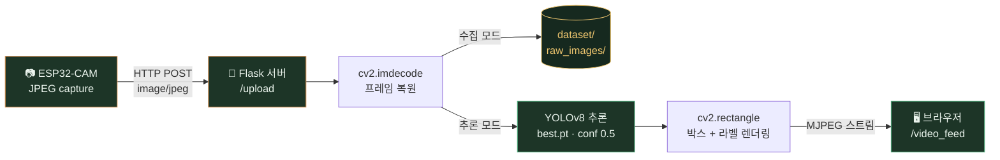
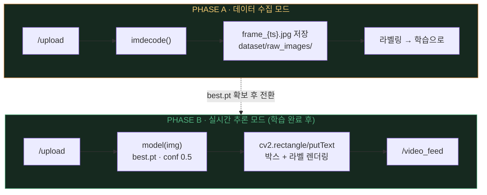
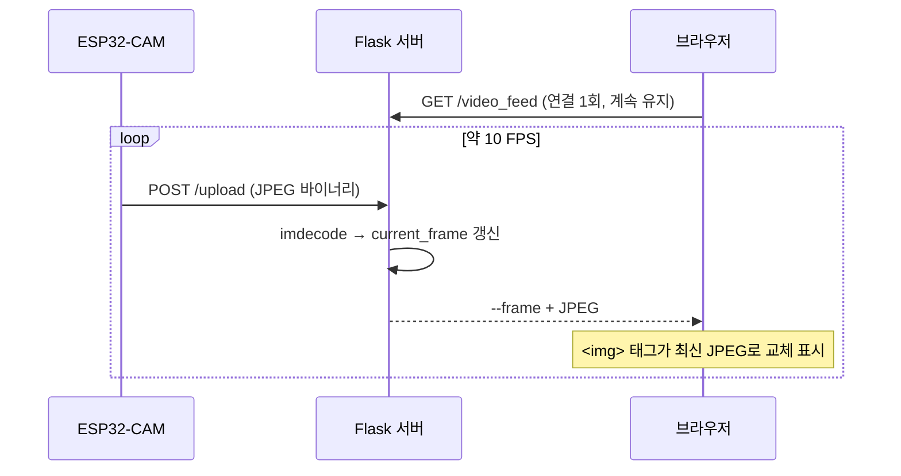
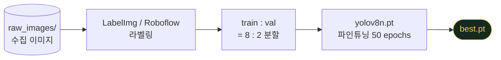

저가형 카메라 모듈 하나로 **데이터 수집 → 커스텀 모델 학습 → 실시간 Bounding Box 스트리밍**까지. 전체 흐름을 5단계로 압축해서 정리했다.


| 항목 | 스택 |
|---|---|
| HW | AI-Thinker ESP32-CAM |
| Server | Flask + OpenCV |
| Model | YOLOv8n (Ultralytics) |
| Stream | MJPEG (multipart/x-mixed-replace) |

---

## 왜 이 구조인가

ESP32-CAM은 추론을 돌리기엔 너무 작다. 그래서 역할을 명확히 나눈다 — **보드는 눈(카메라), 서버는 뇌(YOLO)**. 보드는 JPEG 프레임을 Wi-Fi로 쏘기만 하고, 무거운 연산(디코딩·추론·렌더링)은 전부 Flask 서버가 맡는다.



핵심은 **같은 `/upload` 엔드포인트가 프로젝트 단계에 따라 두 가지 모드로 동작**한다는 것.



> 동일한 서버 코드 골격에서 **저장 로직**만 **추론 로직**으로 교체된다.

---

## STEP 1 — ESP32-CAM: 프레임을 쏘는 클라이언트

AI-Thinker 보드 기준으로 카메라를 초기화하고, `loop()`에서 프레임 버퍼를 잡아 서버로 **HTTP POST** 한다. 헤더에 `Content-Type: image/jpeg`를 명시하고 JPEG 바이너리를 그대로 바디에 싣는 게 전부다.

- **해상도는 PSRAM 유무로 결정** — PSRAM 있으면 VGA(640×480) + 더블 버퍼, 없으면 CIF(400×296)로 다운
- **jpeg_quality 12** — 화질과 전송량의 절충점 (낮을수록 고화질)
- **delay(100)** — 약 10 FPS 목표. 네트워크·서버 부하에 맞춰 조절
- 전송 후 `esp_camera_fb_return(fb)`로 프레임 버퍼를 꼭 반환해야 메모리가 안 샌다

```cpp
// loop() 핵심부
camera_fb_t *fb = esp_camera_fb_get();

HTTPClient http;
http.begin("http://192.168.x.x:5000/upload");
http.addHeader("Content-Type", "image/jpeg");
http.POST(fb->buf, fb->len);   // JPEG 바이너리 그대로 전송
http.end();

esp_camera_fb_return(fb);      // 버퍼 반환 필수
delay(100);                    // ≈ 10 FPS
```

---

## STEP 2 — Flask 수집 서버: 받고, 보여주고, 저장한다

서버는 세 가지 일을 한다. 수신한 바이트를 `np.frombuffer → cv2.imdecode`로 BGR 이미지로 복원하고, 전역 변수 `current_frame`에 최신 프레임을 유지하며, `COLLECT_DATA_MODE`가 켜져 있으면 타임스탬프 파일명으로 저장까지 한다.

```python
# app.py — /upload 핵심부
nparr = np.frombuffer(request.data, np.uint8)
img = cv2.imdecode(nparr, cv2.IMREAD_COLOR)   # JPEG → BGR

current_frame = img
if COLLECT_DATA_MODE:                          # 수집 모드 스위치
    cv2.imwrite(f"dataset/raw_images/frame_{ts}.jpg", img)
```

### MJPEG 스트리밍의 원리

브라우저 확인용 `/video_feed`는 **MJPEG(multipart/x-mixed-replace)** 방식이다. 응답을 끝내지 않고 JPEG 조각을 `--frame` 경계로 무한히 이어 붙이면, 브라우저의 `` 태그가 이를 동영상처럼 계속 갈아 끼운다.



> **POINT** — ESP32에서 접속할 수 있도록 반드시 `app.run(host='0.0.0.0', port=5000)`으로 열고, 보드 코드의 서버 IP를 PC의 실제 내부 IP와 맞춘다.

---

## STEP 3 — 라벨링: 모델에게 정답지를 만들어 준다

수집 모드를 켜고 카메라를 다양한 각도·조명·거리에서 움직여 이미지를 모은 뒤, **LabelImg**(로컬) 또는 **Roboflow**(웹)로 Bounding Box를 그린다. 포맷을 **YOLO**로 지정하면 이미지마다 같은 이름의 `.txt` 라벨 파일이 생성된다.

라벨링이 끝나면 학습용(train)과 검증용(val)을 **대략 8:2**로 나눠 다음 구조로 배치한다.

```text
dataset/
├── data.yaml          # 클래스·경로 설정
├── train/
│   ├── images/        # 학습용 .jpg (80%)
│   └── labels/        # 학습용 .txt
└── val/
    ├── images/        # 검증용 .jpg (20%)
    └── labels/        # 검증용 .txt
```

```yaml
# data.yaml
path: ../dataset
train: train/images
val: val/images

nc: 2                          # 클래스 개수
names: ['person', 'danger_zone']
```

---

## STEP 4 — YOLOv8 학습: best.pt를 뽑는다

Ultralytics 패키지(`pip install ultralytics torch torchvision`)로 사전학습된 **yolov8n(nano)** 모델을 불러와 커스텀 데이터로 파인튜닝한다. nano는 가장 가벼워 임베디드 실시간 스트림에 최적. GPU가 있는 PC나 Google Colab 사용을 권장한다.

| 파라미터 | 값 | 의미 |
|---|---|---|
| `data` | dataset/data.yaml | 데이터셋 정의 파일 |
| `epochs` | 50 | 데이터가 적으면 50~100 권장 |
| `imgsz` | 640 | VGA급 입력과 매칭되는 크기 |
| `batch` | 16 | VRAM 상황에 맞춰 조절 |
| `device` | 0 / 'cpu' | GPU 번호 또는 CPU |

```python
# train_yolo.py 핵심부
from ultralytics import YOLO

model = YOLO('yolov8n.pt')                # 사전학습 nano 모델
model.train(data='dataset/data.yaml', epochs=50,
            imgsz=640, batch=16, device=0)
```

학습이 끝나면 최상의 가중치가 `custom_drone/v8_model/weights/best.pt`에 저장된다. **이 파일 하나가 다음 단계의 주인공이다.**



---

## STEP 5 — 실시간 추론 서버: 프레임마다 박스를 그린다

수집 서버의 골격은 그대로 두고, `/upload` 내부의 저장 로직을 **추론 + 렌더링**으로 교체한다. 프레임이 도착할 때마다 `best.pt`로 추론하고, 결과 박스와 라벨을 OpenCV로 이미지 위에 직접 그린 뒤 스트리밍 프레임으로 넘긴다.

```python
# app_yolo_inference.py — 추론·렌더링 핵심부
model = YOLO("custom_drone/v8_model/weights/best.pt")

results = model(img, stream=True, conf=0.5)   # 신뢰도 50%↑만, stream으로 메모리 절약

for r in results:
    for box in r.boxes:
        x1, y1, x2, y2 = map(int, box.xyxy[0])
        name = model.names[int(box.cls[0])]
        conf = float(box.conf[0])

        cv2.rectangle(img, (x1, y1), (x2, y2), (161, 71, 13), 3)
        cv2.putText(img, f"{name} {conf:.2f}", (x1, max(y1-10, 15)),
                    cv2.FONT_HERSHEY_SIMPLEX, 0.6, (161, 71, 13), 2)

processed_frame = img   # /video_feed가 이걸 송출
```

- **stream=True** — 연속 영상 추론 시 결과를 제너레이터로 받아 메모리 누수를 방지
- **conf=0.5** — 오탐이 많으면 올리고, 놓치는 게 많으면 내린다
- OpenCV 색상은 **BGR 순서** — `(161, 71, 13)`은 RGB의 로열 블루에 해당
- 송출 주기는 `time.sleep(0.04)` ≈ 25fps. 실제 체감 FPS는 ESP32 전송 속도가 상한

---

## 전체 흐름 요약 & 체크리스트

| 단계 | 산출물 | 핵심 한 줄 |
|---|---|---|
| 1. ESP32-CAM | JPEG 프레임 스트림 | 찍어서 POST로 쏘기만 한다 |
| 2. Flask 수집 | raw_images/*.jpg | 디코딩 + 저장 + MJPEG 모니터링 |
| 3. 라벨링 | images + labels(.txt) | YOLO 포맷, train:val = 8:2 |
| 4. 학습 | best.pt | yolov8n 파인튜닝 50 epochs |
| 5. 추론 서버 | 실시간 박스 스트림 | 프레임마다 추론 → 렌더링 → 송출 |

> **🔧 Troubleshooting 먼저 볼 것**
>
> 1. 보드 코드의 서버 IP가 PC 내부 IP와 일치하는지
> 2. Flask가 `0.0.0.0`으로 열려 있고 방화벽 5000 포트가 허용됐는지
> 3. PSRAM 미탑재 보드에서 VGA를 강제하지 않았는지
> 4. 추론 서버가 로드하는 `best.pt` 경로가 실제 학습 결과 경로와 맞는지

---

*ESP32-CAM × YOLOv8 · 전체 소스 코드는 원문 가이드 참고 · 카메라는 눈, 서버는 뇌.*
