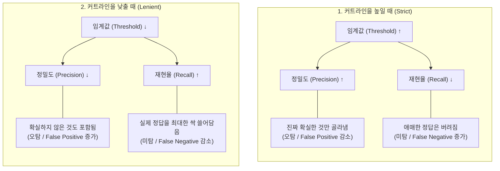

<br><br>
## 1. **Confidence Score**(신뢰도 점수)란?

학습된 모델은 이미지를 볼 때마다 **"이거 90% 확률로 사람이네"**, "이건 30% 확률로 고양이 같아"라고 스스로 판단한다.  

이를 모델의 `Confidence Score`라고 한다. 그리고 그 신뢰도 점수를 바탕으로 해당 객체에 박스를 친다.
<br>
그리고 객체 탐지 인공지능이 "내가 그린 박스가 정답 박스랑 얼마나 잘 포개어지는가?"를 채점할 때 가장 최우선 시 되는 기준이 바로 `IoU`이다. 

모델에게 IoU는 "이 위치가 맞아?"를 묻는 도구이고, 

Confidence는 "여기 확실히 물체가 있어?"를 묻는 도구라고 보면 된다. 

<br>
순서대로 다시 정리해보면, 

"AI는 학습된 모델을 통해 '특정 객체가 어디에 있는지 그 확률(Confidence)'을 예측하고 박스 테두리를 친다. 그 후, 정답(Ground Truth)과 비교해 실제 위치와 얼마나 포개졌는지(IoU)를 계산하여, 그 오차만큼 스스로의 뇌(Weight)를 정교하게 재정비(학습)한다."
<br>

---
<br><br>
## 2. IoU(Intersection over Union)란 무엇인가?

IoU는 직역하면 합집합에 대한 교집합의 비율이다.

어떤 물체를 찾을 때, 사람이 직접 "진짜 물체 위치"라고 라벨링한 정답 박스(A)가 있고, AI가 예측해서 그린 박스(B)가 있다고 가정해보자. 

`IoU`는 이 두 박스가 겹치는 면적을 두 박스의 전체 면적으로 나눈 값이다. 쉽게 말해서 더 많이 포개질 수록 모델이 정교하다는 거다. 


<div style="text-align: center; font-size: 1.1em; margin: 20px 0;">
  <em>IoU</em> = 
  <span style="display: inline-block; vertical-align: middle; text-align: center; margin: 0 5px;">
    <span style="border-bottom: 1px solid #333; display: block; padding-bottom: 3px;">교집합 면적 (Area of Overlap)</span>
    <span style="display: block; padding-top: 3px;">합집합 면적 (Area of Union)</span>
  </span>
  = 
  <span style="display: inline-block; vertical-align: middle; text-align: center; margin: 0 5px;">
    <span style="border-bottom: 1px solid #333; display: block; padding-bottom: 3px;">|A ∩ B|</span>
    <span style="display: block; padding-top: 3px;">|A ∪ B|</span>
  </span>
</div>


<br><br>

### 1) YOLO에서 IoU가 미치도록 중요한 2가지 이유

앞서 Confidence Score를 계산할 때도 쓰이지만, IoU는 시스템 전체를 굴러가게 하는 두 가지 핵심 역할을 한다. 

**① 학습(Training)할 때의 채점 기준표 역할**

AI를 처음 학습시킬 때, AI는 허공에 무작위로 박스를 마구 던져본다. 이때 AI에게 "너 지금 정답이랑 30%밖에 안 겹치잖아(IoU=0.3)! 궤도를 더 오른쪽으로 옮겨!"라고 혼내고 피드백을 주는 기준이 바로 IoU이다. IoU 값이 1.0에 가까워지도록 스스로 수십만 번 수정하며 똑똑해지는 것이다.


1. **아예 위치가 틀렸을 때 (잘못된 위치):** IoU가 낮으면 모델은 `Box Loss`라는 페널티를 받고, 정답 박스 위치로 좌표를 이동시킨다. 
    
2. **아예 없는 곳에 쳤을 때 (잘못된 탐지):** 이건 `Confidence Loss`에서 페널티를 받는다. 사람이 아무도 없는데 자신감있게 점수를 매겼으니 패널티를 부가한다.


**② 겹친 박스 지우기 (**NMS**, Non-Maximum Suppression) ★핵심★**

실제로 YOLO를 돌려보면, 화면 안의 사람 1명을 보고 AI가 "어? 사람이다!" 하고 0.1초 만에 박스를 5~6개씩 다다닥 겹쳐서 그리는 경우가 발생한다. 이때 **'진짜 쓸만한 박스 1개'만 남기고 나머지를 지우는 정리 작업**이 필요한데, 여기서 IoU가 쓰인다.
<br>

1. 가장 Confidence 점수가 높은 1등 박스를 찾는다.
<br>   
2.  그 1등 박스와 **나머지 박스들의 IoU(겹치는 정도)를 계산**한다.
<br>    
3. 만약 다른 박스가 1등 박스와 50% 이상 겹쳐있다면(IoU ≥ 0.5), "같은 사람(물체)을 보고 친 중복 박스구나!"라고 판단하고 얄짤없이 삭제해 버린다.
<br>  
4. AI는 Confidence(확신도)로 물체가 있는지 판단하고, IoU(겹침 정도)로 중복 박스를 정리한다
<br>    
- **1등의 기준:** 오로지 **Confidence Score(확신도)**.
    
- **지우는 기준:** 1등과의 IoU(위치 일치도)가 50% 이상인가?
    
- **박스를 못 치는 모델의 최후:** 지우긴 지우는데, 정답이 아닌 엉뚱한 위치의 박스만 남겨놓고 나머지를 싹 다 지우는 '자신감 있는 바보'가 된다.

<br><br>
### 2) Loss 그래프 (모델이 '공부'하는 과정)

이렇듯 모델은 학습할 때 '**손실 함수(Loss Function)**'라는 걸 계산하고 반영하게 된다. 

- **Confidence Loss:** 존재 유무 파악 미스 (확률 판단 틀림)
- **`box_loss` (박스 손실):** 예측한 박스가 실제 정답 박스와 얼마나 차이 나는지 측정. (IoU 관련)
- **`cls_loss` (클래스 손실):** 객체 즉 사물의 분류(Classification)를 얼마나 정확히 하는지 측정. 
- **`dfl_loss` (DFL 손실):** Distribution Focal Loss의 약자로, 객체의 경계(박스 끝부분)를 더 정밀하게 다듬는 역할. 

위 3개(`box`, `cls`, `dfl`)는 모델이 학습 과정에서 **얼마나 실수를 많이 하고 있는지**를 나타내니 낮을수록 좋다. 지표가 낮아질 수록 학습을 잘하고 있다고 판단하면 된다. 

수식으로 나타내면 다음과 같다. 


<div style="text-align: center; font-size: 1.1em; margin: 20px 0; font-family: 'Times New Roman', serif; letter-spacing: 0.5px;">
  <strong>Total_Loss</strong> = (w<sub>1</sub> &times; <em>box_loss</em>) + (w<sub>2</sub> &times; <em>cls_loss</em>) + (w<sub>3</sub> &times; <em>dfl_loss</em>)
</div>

여기서 w1, w2, w3은 각각의 가중치(weight)를 말한다. 

<br><br>

### 3) 하이퍼파라미터(Hyperparameters)란 

하이퍼파라미터는 모델이 학습을 시작하기 전에 사람이 직접 설정해 주어야 하는 '**설정값**' 혹은 '**튜닝 파라미터**'를 의미한다.

`ultralytics/cfg/default.yaml`

이 파일 안에 `box`, `cls`, `dfl`에 대한 가중치(gain) 값이 정의되어 있다. 

- **Box Loss (7.5):** 객체의 **위치**를 정확히 맞추는 것이 중요할 때 높인다. 작은 객체가 많거나 위치 정밀도가 핵심일 때 조정.
    
- **Cls Loss (0.5):** 객체의 종류를 분류하는 것이 중요할 때 높인다. **클래스 간 구분**이 모호할 때 이 값을 높여 분류 정확도를 강조.
    
- **DFL (Distribution Focal Loss, 1.5):** 경계 상자의 **경계가 모호할 때**(흐릿할 때) 이를 정교하게 보정하는 역할.

<br><br>
### 3. 경사하강법 (Gradient Descent) : 오차의 골짜기를 향해 걷기

인공지능의 목표는 자신이 내놓은 정답과 실제 정답 사이의 '오차(Loss)'를 최소화하는 것이다.
오차를 그래프로 그리면 보통 밥그릇 모양의 U자형 곡선이 되는데, 여기서 가장 낮은 바닥(오차가 0에 가까운 곳)을 찾아가는 수학적 기법이 바로 '경사하강법'이다.


**[ 경사하강법 그래프: 손실(Loss)의 골짜기를 찾는 과정 ]**


왼쪽(빨간색 궤적): 보폭이 너무 커서 바닥을 지나치고 반대편으로 튕겨 올라가는 모습 (**Over-shooting**)

오른쪽(별 궤적): 보폭이 적절해서 바닥을 향해 안정적으로 스르륵 미끄러져 내려가는 모습


`학습률 (Learning Rate)` 은 그 내리막길을 걷는 '보폭'이라고 비유적으로 이해하면 쉽다. 통 0.001이나 0.01 같은 아주 작은 숫자로 설정한다. 그 이유는 학습률이 너무 크면 공이 골짜기를 이리저리 튕겨 넘어가며(오버슈팅) 폭주하고, 너무 작으면 제자리걸음이기 때문이다. 한마디로 과유불급(過猶不及)이다. 

비행기가 착륙할 때도 서서히 부드럽게 내려와야지 막 급하게 빠른 속도로 무리하게 착륙하게 되면 오버슈팅 현상처럼 기체(機體)가 요동친다던지 바닥에 부딪혀 팅겨오르는 등의 일이 발생할 것이며 너무 느리게 착륙하면 연료가 바닥나게 될지도 모른다. YOLO학습모델을 다룰 때에는 대부분 지표들을 균형있게 잘 튜닝해야한다. 

---
<br><br>   
## 3. Confidence Threshold(임계값)는 '합격선'

하지만 우리는 모델에게 "적당히 확신하는 건 다 가져와"라고 할 수도 있고, "완벽하게 확신하는 것만 가져와"라고 할 수도 있다. 

이때 **합격선(커트라인)을 긋는 것**이 바로 **Confidence Threshold**이다. 


- **Threshold를 0.9로 설정하면:** 모델이 90% 이상 확신하는 것만 보여줌. (아주 깐깐함)
    
- **Threshold를 0.2로 설정하면:** 모델이 20%만 확신해도 일단 다 보여줌. (매우 관대함)

<br>

### 1) 정확도(Precision)와 재현율(Recall)


**정확도(Precision)**: "모델이 쳐놓은 박스(예: 5개) 중에 **진짜 정답은 몇 개**인지 비율

**재현율(Recall)**: 전체 정답지(10개)를 놓고 봤을 때, 모델이 그중에서 몇 개나 성공적으로 찾아냈는가?"를 나타내는 비율


만약에 모델이 탐지한 5개가 모두 정답이면 정확도는 100%가 되지만 전체 정답 10개 중에 총 5개를 맞힌 것이므로 재현율은 50%밖에 되지 않는다. 

<br><br>

- **커트라인(Confidence Threshold)을 높이면 (까다롭게)**:
    
    - **정밀도(Precision)는 상승.** (진짜 확실한 것만 골랐으니 틀릴 확률이 적음)
        
    - **재현율(Recall)은 하락.** (애매한 것들을 다 버렸으니, 실제 정답임에도 놓치는 게 많음)
    
- **커트라인을 낮추면 (관대하게):**
    
    - **정밀도(Precision)는 떨어집니다.** (확실하지 않은 것도 다 가져왔으니 오답이 섞임)
        
    - **재현율(Recall)은 올라갑니다.** (정답을 하나라도 더 찾으려 하니, 실제로 정답인 것들을 많이 잡아냄)


  


---
<br><br> 
## 4. 최적의 균형점 찾기 

Precision과 Recall은 서로 **상충(Trade-off) 관계**에 있는데, 이 둘의 **조화평균**인 F1-Score가 가장 높은 지점(봉우리)을 찾으면, 그 지점의 Confidence 값이 해당 모델에서 가장 효율적인 검출 임계값을 도출할 수 있다. 

수학적으로 미분계수(f'(x))가 0이 되면서 증가세(+)에서 감소세(-)로 전환되는 지점이다. 

**조화평균**을 쓰는 이유는 어느 한쪽이 극단적으로 낮을 때 페널티를 강하게 주기 위해서 이다. 둘다 중요한 지표기 때문. 

- 정밀도가 1.0 (100%), 재현율이 0.01 (1%)인 모델이 있다고 가정해 보자. 
    

1. **산술평균:** (1.0 + 0.01) / 2 = 0.505 (약 50% 성능이라고 착각하게 만듦)
    
2. **조화평균 (F1):** 2 × (1.0 × 0.01) / (1.0 + 0.01) ≈ 0.019 (성능이 엉망이라는 것을 정확히 짚어냄)

사실 재현율이 0.01면 전체 정답 100개 있다고 치면 고작 1개 맞히는 수준이다. 그럼에도 단순 산술평균으로는 0.5 이상이 나오게 되니 조화평균으로 해야하는 이유가 여기에 있다. (이 가정 하에 모델이 100개 중 1개를 탐지하고 이를 정확하게 맞혀 정확도는 100% -> 1.0의 값이라고 역추산 가능하다)  

<br><br>
**Confidence Threshold와 Precision과 Recall과의 관계**

<br><br>

**모델이 현재 정확도(100%)만 좋고 재현율(0%)이 꽝인 상태라고 가정해보자.**

이 때 Confidence Threshold값을 0.1로만 상향 조정해도 재현율이 크게 증가하면서 F1 score값도 가파르게 증가한다. 0.2로 올리면 0.1때보다는 덜하지만 그래도 크게 오를 것이다. 이렇게 쭉 올리다가 0.6에 도달했는데 딱 증감량이 0인 순간이 왔다고 가정해보자. 여기서 0.61로 상향하면 이젠 정확도가 너무 낮아져서 F1 score값이 하락하는 `임계점`에 도달했다고 보면 된다. 그래서 봉우리가 가장 높은 이 부분이 최적점이 된다. 
   
F1 점수가 높다는 것은 **정밀도와 재현율 어느 한쪽에 치우치지 않고 둘 다 잘하고 있다**는 강력한 증거이다. "정밀도와 재현율의 두 마리 토끼를 얼마나 잘 붙잡고 있는가?"를 보여주는 **균형 지수**인 셈. 보통 경제학에서는 수요와 공급곡선처럼 그래프가 서로 만나는 지점이 균형(equilibrium)인 경우가 다수 있다. 그러나 여기서는 그래프들의 접점이 곧 최적점이 아니다. 우연히 겹칠 수는 있으나 전적으로 F1을 미분한 값이 0이 되는 즉 꼭대기에서 결정된다. 반면 한계수입이나 한계효용 체감의 법칙 관점에서 F1 score를 이해하는 것은 큰 도움이 된다. 

> **F1 점수와 '한계효용 체감의 법칙'**
> 
> 경제학에서 피자를 한 조각씩 더 먹을수록 처음 느꼈던 엄청난 만족감이 점점 줄어들게 되는 것을 **'한계효용 체감의 법칙'**이라고 한다. 
> 
> 처음 한입 베어 물었을 때는 엄청난 만족감에 급격하게 효용이 증가하지만 계속 먹다보면 점점 물리게 된다. 그러다 임계점에 도달하면 오히려 먹는 것이 고통스러워질 것이다. 
> 
> 이런 개념을 머릿속에 저장하면 굉장히 많은 개념들을 익히는데 큰 도움이 될 것이다. 

<div align="center" style="margin: 30px 0;">
  <svg xmlns="http://www.w3.org/2000/svg" viewBox="0 0 800 500" style="background-color: #ffffff; border-radius: 8px; box-shadow: 0 4px 6px rgba(0,0,0,0.1); max-width: 100%; height: auto;">
    
    
<br><br>
### 1) 모델의 성능 기준이 되는 mAP

**mAP**는 각 클래스별로 구한 **AP 값들을 모두 더한 뒤, 클래스 개수로 나눈 값**이다. 


즉 오탐지 없이 쭉 가는 동안 곡선이 얼마나 높게 버티느냐가 핵심

하지만 평균 최적점이지 모든 클래스의 최적점이 아니다. 

<br><br> 
### 2) 평가 지표에서의 mAP와 IoU Threshold

우리가 AI 모델 성능이 "mAP 90%다"라고 말할 때, 여기에도 IoU 기준이 숨어있다. 보통 `IoU Threshold = 0.5`를 가장 많이 쓴다. 즉, "정답 박스랑 최소 절반(50%) 이상 겹치게 박스를 그렸으면, 그 예측은 '정답(True Positive)'으로 인정해 줄게!"라는 커트라인이다.

만약 자율주행 자동차처럼 미세한 물체 위치가 목숨을 좌우하는 아주 정밀한 시스템을 만든다면, 이 커트라인을 IoU = 0.75 정도로 아주 깐깐하게 올려서 평가하기도 한다

---
<br><br> 
## 5. 학습데이터와 모의고사

학습을 할 때는 반드시 train과 val로 구분해서 데이터셋을 구비해야한다. train에는 실제로 학습할 라벨링 이미지들을 넣어 놓고 val에는 train에는 없는 모의고사 개념으로 사진을 넣어 놓으면 된다. 통상적으로 8:2의 비율 혹은 7:3 정도로 꾸리는 것이 일반적이다. 

| 구분 | Train 데이터셋 | Val (Validation) 데이터셋 |
| :---: | :---: | :---: |
| **목적** | 모델의 가중치 학습 (**공부**) | 모델 성능 평가 및 튜닝 (**모의고사**) |
| **정답지 공개** | 예 (학습에 사용) | 아니오 (평가용으로만 사용) |
| **학습 영향** | 학습 데이터로 직접 반영됨 | 학습 종료 시점 결정에 기여 |
| **이상적인 상태** | 충분히 다양하고 양이 많아야 함 | 모델이 배운 패턴을 검증하기 적절해야 함 |


- **다양한 컨텍스트 학습:** 모델이 평소보다 훨씬 좁은 영역 내에서 객체를 찾아야 하므로, 더 작은 객체에 대해 강인해진다.
    
- **데이터 다양성 극대화:** 서로 다른 배경과 위치에 있는 객체들을 섞어줌으로써, 모델이 특정 배경에 의존하지 않도록(**Overfitting** 과적합 방지) 도와준다.
    
- **객체 크기의 축소:** 여러 이미지를 합치면, 개별 이미지는 당연히 물리적으로 축소된다. 결과적으로 '작은 객체(Small Object)'가 모델 관점에서는 훨씬 더 작게 보이게 됨. 

**객체의 파편화:** 원래 작은 객체가 모자이크 4분할 속에 들어가면, 원래 크기의 1/4(면적 기준 1/16) 수준으로 줄어듭니다. 1280 해상도에서도 이 정도 배율로 줄어든 객체는 픽셀 정보가 너무 적어 모델이 특징(Feature)을 추출하기 어렵다. 

참고로 처음 학습을 했을 때에 깜빡하고 train과 validation을 구분 안 하고 학습을 돌린 적이 있다. train 폴더의 이미지로 학습도 하고 모의고사도 치는 그런 웃픈 상황이었는데, 당연하게도 학습 데이터가 굉장히 좋게 나왔다. 이렇게 모의고사를 치지 않고 학습한 데이터로 시험까지 치르게 되면, 머신러닝 모델이 암기해서 정답을 맞힌 건지 진짜 학습된 능력으로 탐지를 해낸 것인지 구분할 방도가 없다. 이런 현상을 `과적합(Overfitting) 현상`이라고 하며, 개발자는 모델의 학습 능력이 과적합되어 과대평가되는 것을 늘 경계하여야 한다. 

---
<br><br> 
## 6. Catastrophic Forgetting (치명적 망각)의 위협

 `치명적 망각`이란 **사전학습된 모델에 새로운 클래스를 추가로 학습시키면, 기존에 잘 인식하던 클래스의 성능이 떨어지거나 아예 인식을 못 하게 되는 현상**을 말한다. 

 이 논점은 이미 잘 학습시킨 모델에 추가적으로 또다른 객체 탐지를 학습시키는 경우에 발생한다. 

 인간의 경우에 운전면허가 있는 상태에서 자전거를 배운다고 운전하는 법을 까먹진 않는다. 하지만 머신러닝의 뇌구조는 인간과는 사뭇 다르다. 그렇기 때문에 인간의 관점에서 학습을 시키다간 큰 사고로 이어질 수 있다. 
 
<br><br>

### 왜 이런 일이 생길까?

신경망은 학습할 때 **가중치(weight)를 계속 업데이트**하면서 패턴을 학습한다. 그런데 이 가중치는 **모든 클래스가 공유하는 하나의 파라미터 공간**에 저장되는게 문제다.

```
기존 학습: [사람, 자동차, 개] 인식하도록 가중치 조정됨   ↓새 클래스 추가 학습: [고양이] 데이터만 넣고 계속 학습   ↓가중치가 "고양이 인식"에 맞게 계속 업데이트됨   ↓"사람, 자동차, 개"를 인식하던 가중치 패턴이 점점 덮어써짐(overwrite)
```

**핵심 원인**: 새 클래스만 학습시키면, 그 손실함수(loss)는 오직 "고양이를 잘 맞추는가"만 신경 쓴다. 

기존 클래스(사람, 자동차, 개)에 대한 성능은 손실함수에 전혀 반영이 안 되기 때문에, 모델 입장에서는 그 가중치를 유지할 이유가 없어져 자연스럽게 흐트러진다. 

<br><br>
### 이게 특히 YOLO 같은 Object Detection에서 두드러지는 이유

먼저 이를 설명하기 위해서 알고 넘어가야할 개념이 클래스(Class)이다. 

**클래스(Class)** 란 모델이 이미지 속에서 탐지할 **객체의 종류(목록)** 를 말한다. 

데이터셋을 라벨링할 때 각 물체를 클래스별로 구분하여 지정하게 되며, 이 설정 정보는 학습에 사용되는 `data.yaml` 파일에서 관리 및 확인할 수 있다.
data.yaml은 일종의 나침반 역할이다. AI에게 어디를 봐야 할지, 찾아야 할 게 무엇인지 알려주는 '설명서'라고 보면 된다. 

```yaml
nc: 3
names: ['person', 'dog', 'cat']
```

**nc (Number of Classes)**: 탐지할 전체 클래스의 총 개수.

**names**: 클래스 이름 리스트로, 라벨링 번호(0, 1, 2...)와 순서대로 매핑된다.

예 : (0: person, 1: dog, 2: cat)

이제 본론으로 넘어와서,

YOLO의 경우 마지막 레이어가 **클래스 개수(N)에 딱 맞춰서** 출력 노드가 정해져 있다.

```
YOLO 출력층: [클래스1 확률, 클래스2 확률, ..., 클래스N 확률, bbox좌표...]
```

**만약 기존 10개 클래스 모델에 새 클래스 1개를 추가**하려면, 출력층 구조 자체를 11개로 바꿔야 하는데, 이때 접근법에 따라 문제가 생긴다. 
<br><br> 

1. **Fine-tuning으로 새 클래스 데이터만 넣고 재학습** → 위에서 설명한 Catastrophic Forgetting. 즉 치명적 망각 발생 위험 높음
   
2. **기존 데이터 + 새 데이터를 섞어서 처음부터/함께 재학습** → 이 문제를 피할 수 있지만, 기존 데이터셋을 다시 다 가지고 있어야 함

이처럼 치명적 망각을 막는 가장 확실하고 방법은 과거 데이터(10개 클래스)와 새로운 데이터(1개 클래스)를 전부 섞어서 11개 클래스용 데이터셋을 새로 만든 뒤 처음부터 다시 학습하는건데 이에 소모되는 시간과 비용이 클 수밖에 없다. 그리고 기존의 데이터셋을 전부 가지고 있어야 가능하다. 

물론 최신 AI 논문들에서는 **'연속 학습(Continual Learning)'**이나 **'지식 증류(Knowledge Distillation)'**라는 기법을 연구하고 있다. 사전에 학습된 모델이 새로운 모델에게 기존 지식을 잊지 않게 힌트를 주면서, 동시에 새로운 데이터를 배우게 만드는 고급 기법들이다. 하지만 모든 개발자가 이런 고급 기법들을 완벽하게 활용할 수는 없다. 

---
<br><br> 
## 7. YOLO 학습을 하면서 느낀점

경험상으로 초기에 더 꼼꼼하게 방향성을 잡고, 고민되는 클래스라면 하나 정도는 더 작업해서 진행하는게 더 바람직하다고 본다. 학습을 진행하다가 불필요한 경우에 클래스를 없애는 건 크게 어렵지 않기 때문이다.  
<br><br>
물론 인공지능 프로젝트에서 가장 시간과 돈이 많이 드는 병목 구간은 '데이터 라벨링'이다. 1차 프로젝트 때 혼자서 모든 YOLO학습을 진행하는 도맡아서 진행했는데, 라벨링 작업만큼은 가장 귀찮고 하기 싫은 작업이었다. 자동 라벨링을 지원하긴 하지만 완벽하지는 않기 때문에 다시 검증해서 보완하는 작업이 필수적이다. 
<br><br>
라벨링도 라벨링이지만 어떤 보조 프로그램이나 UI 테두리도 없는 가장 '순수한(Raw)' 이미지를 수백에서 수천 장 캡처하여 모으는 것도 쉬운 일은 아니다. 
<br><br>
그리고 클래스를 빼는 작업은 쉽다고는 하지만, 그 불필요한 클래스를 위해 수천 장의 사진에 라벨링을 했던 시간이 아까울 수 있다. 하지만 학습결과가 어떻게 나올지 완벽하게 예상하기는 힘들기 때문에 본인 또한 무리하게 조난자 객체 탐지 프로젝트를 진행하면서 구명장비를 추가했다가 뺐다. 
<br><br>
그리고 또 경계해야할 부분은 데이터의 분산이다. 총 1,000장의 사진이 있는데 클래스가 100개라면, 클래스당 평균 10장의 사진밖에 학습하지 못한다. 데이터의 양이 고정된 상태에서 클래스만 늘리면, 클래스당 학습량이 줄어들어 정확도가 급락하기 때문에 클래스를 늘리기 위해서는 충분한 데이터가 필수적이다. 
<br><br>


다음은 내 처참했던 구명 장비들 학습 데이터이다. 빨간선이 바로 그 문제의 구명장비인데, 처음에는 팀원들끼리 구명 장비를 구분하는 것이 좋다는 판단을 내렸었다. 조난자가 얼마나 위급한지 여부를 파악하기도 좋고 어떤 상황인지 해경에 보고하기도 좋은 정보라고 가정했다. 하지만 생각보다 구명장비를 학습시키는게 쉽지는 않았다. 

위에서 설명했듯이 

---
<br><br> 
## 8. 시도해보고 싶었던 ignored


그럼 ignored를 설정하는것이 마치 null -> "" 과 같다. 

인공지능 객체 탐지 모델 학습에서 'ignored'라는 개념은 보통 **데이터셋 내에서 "이 물체는 학습에 반영하지 마"라고 명시적으로 지정하는 영역**을 의미한다. (학습 데이터의 클래스 라벨링 시 `ignore` 태그를 붙이거나, 특정 영역을 무시하도록 마스킹)

**- 장점**

- **오탐(False Positive) 방지:** 모델이 "물체인데 라벨이 없는" 데이터를 보면 혼란을 겪습니다. 확실하지 않은 물체나, 학습시키고 싶지 않은 잡음(Noise) 영역을 `ignored`로 설정하면 모델이 해당 영역을 정답이라고 오해하는 것을 방지할 수 있다.
    
- **학습 효율 최적화:** 너무 작거나 흐릿해서 특징을 잡아내기 힘든 '쓰레기 데이터'를 무시함으로써, 모델이 고품질 데이터에 더 집중하게 만든다.
    
- **데이터 클렌징 비용 절감:** 데이터를 완전히 삭제하거나 라벨을 꼼꼼히 수정하는 대신, `ignored` 처리만으로도 빠르게 데이터셋의 불순물을 걸러낼 수 있다.
- 
**- 단점**

- **학습 편향(Bias) 발생:** `ignored`를 너무 많이 설정하면, 모델은 특정 조건의 물체를 "전혀 없는 것"으로 학습하게 됩니다. 나중에 실제 환경에서 그 물체가 나타나도 모델은 이를 완전히 무시(Ignore)해버릴 위험이 있다.
    
- **미탐(False Negative) 증가:** 모델이 무시하도록 배운 대상과 비슷한 물체가 실제 서비스 환경에서 나타날 때, 모델이 탐지를 포기해 버리는 결과가 나올 수 있다.
    
- **설정의 어려움:** 어디까지가 `ignored`이고 어디까지가 유효한 데이터인지에 대한 기준을 사람이 직접 일관되게 정하기가 매우 어렵다.
  
<br><br>
### 3. 비교 요약

|   **구분**   | **Ignored 사용 (장점)** | **Ignored 남용 (단점)** |
| :--------: | :-----------------: | :-----------------: |
| **모델의 태도** |    명확한 물체에만 집중함     | 모호한 물체를 무시하는 습관이 생김 |
| **성능 영향**  |   오탐지 감소로 정확도 향상    | 실제 물체를 놓치는 미탐지율 상승  |
| **운영 효율**  |     빠른 학습 준비 가능     |   잘못 설정 시 모델이 편향됨   |


- **'목표 객체 형태'와 유사한 자연물 조심:** 서로 너무 비슷하게 생긴 것은 `ignored` 처리를 하더라도 모델이 혼란을 겪을 수 있다. 오히려 이런 케이스를 부정 데이터(Negative Data)로 학습시키는 것이 낫다.
    
- **가려짐(Occlusion) 처리:** 목표 객체의 일부라도 보이는 대상은 절대 `ignored` 하면 안 된다.

<br><br> 
## 9. 정리하며

마지막으로 서론에서 다뤘던 `last.py`를 통해 재개하는 방법에 대해서 소개하겠다. 
<br><br> 
**1. train.py 코드 수정 방법**

기존에 학습을 시작하던 코드에서 model = YOLO("yolov8n.pt") 부분을 last.pt의 경로로 바꿔주고, train() 함수 안에 resume=True 옵션을 추가

```python
from ultralytics import YOLO

# 1. 새 모델(yolov8n.pt)이 아닌, 멈춘 시점의 마지막 가중치(last.pt)를 불러옵니다.
# (본인의 last.pt 파일이 있는 정확한 경로로 수정해주세요)
model = YOLO('runs/detect/train/weights/last.pt') 

# 2. 학습 설정에 resume=True 옵션을 줍니다.
# (epochs나 batch 같은 설정은 기존에 돌리던 args.yaml 파일에서 알아서 불러오기 때문에 생략해도 무방합니다)
model.train(resume=True)
```
<br><br> 
**2. 터미널(CLI) 명령어 방식**
파이썬 스크립트(train.py)를 열어서 수정하기 귀찮다면, 터미널(명령 프롬프트) 창에서 아래 명령어를 한 줄 치는 것만으로도 똑같이 이어서 학습이 시작.

```bash
# 경로(runs/detect/train/weights/last.pt)는 본인 상황에 맞게 변경.
yolo train resume model=runs/detect/train/weights/last.pt
```

다음글에서는 실제 YOLO학습 데이터를 기반으로 어떻게 학습효과를 증진시켜왔는지 그 과정을 살펴보겠다. 
