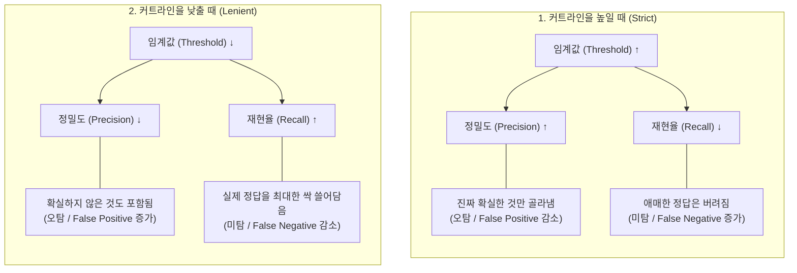

---
title: "YOLO 학습데이터 분석"
excerpt: ""
categories: [Flask]
tags:
  - Python
  - Flask
  - YOLO
toc: true
toc_sticky: true
published: false
--- 

YOLO로 학습을 진행하면 result폴더에 다음과 같은 결과물들이 나온다. 

!results.png


## 1. **Confidence Score**(신뢰도 점수)란?

학습된 모델은 이미지를 볼 때마다 **"이거 90% 확률로 사람이네"**, "이건 30% 확률로 고양이 같아"라고 스스로 판단한다.  

이를 모델의 `Confidence Score`라고 한다. 그리고 그 신뢰도 점수를 바탕으로 해당 객체에 박스를 친다.
<br>
그리고 객체 탐지 인공지능이 "내가 그린 박스가 정답 박스랑 얼마나 잘 포개어지는가?"를 채점할 때 가장 최우선 시 되는 기준이 바로 `IoU`이다. 

모델에게 IoU는 "이 위치가 맞아?"를 묻는 도구이고, 

Confidence는 "여기 확실히 물체가 있어?"를 묻는 도구라고 보면 된다. 

<br>
순서대로 다시 정리해보면, 

"AI는 학습된 모델을 통해 '특정 객체가 어디에 있는지 그 확률(Confidence)'을 예측하고 박스 테두리를 친다. 그 후, 정답(Ground Truth)과 비교해 실제 위치와 얼마나 포개졌는지(IoU)를 계산하여, 그 오차만큼 스스로의 뇌(Weight)를 정교하게 재정비(학습)한다."
<br>

## 2. IoU(Intersection over Union)란 무엇인가?

IoU는 직역하면 합집합에 대한 교집합의 비율이다.

어떤 물체를 찾을 때, 사람이 직접 "진짜 물체 위치"라고 라벨링한 정답 박스($A$)가 있고, AI가 예측해서 그린 박스($B$)가 있다고 가정해보자. 

`IoU`는 이 두 박스가 겹치는 면적을 두 박스의 전체 면적으로 나눈 값이다. 쉽게 말해서 더 많이 포개질 수록 모델이 정교하다는 거다. 

$$IoU = \frac{\text{교집합 면적 (Area of Overlap)}}{\text{합집합 면적 (Area of Union)}} = \frac{\vert{}A \cap B\vert{}}{\vert{}A \cup B\vert{}}$$


### 1) YOLO에서 IoU가 미치도록 중요한 2가지 이유

앞서 Confidence Score를 계산할 때도 쓰이지만, IoU는 시스템 전체를 굴러가게 하는 두 가지 핵심 역할을 한다. 

**① 학습(Training)할 때의 채점 기준표 역할**

AI를 처음 학습시킬 때, AI는 허공에 무작위로 박스를 마구 던져본다. 이때 AI에게 "너 지금 정답이랑 30%밖에 안 겹치잖아(IoU=0.3)! 궤도를 더 오른쪽으로 옮겨!"라고 혼내고 피드백을 주는 기준이 바로 IoU이다. IoU 값이 1.0에 가까워지도록 스스로 수십만 번 수정하며 똑똑해지는 것이다.


1. **아예 위치가 틀렸을 때 (잘못된 위치):** IoU가 낮으면 모델은 `Box Loss`라는 페널티를 받고, 정답 박스 위치로 좌표를 이동시킨다. 
    
2. **아예 없는 곳에 쳤을 때 (잘못된 탐지):** 이건 `Confidence Loss`에서 페널티를 받는다. 사람이 아무도 없는데 자신감있게 점수를 매겼으니 패널티를 부가한다.


**② 겹친 박스 지우기 (**NMS**, Non-Maximum Suppression) ★핵심★**

실제로 YOLO를 돌려보면, 화면 안의 사람 1명을 보고 AI가 "어? 사람이다!" 하고 0.1초 만에 박스를 5~6개씩 다다닥 겹쳐서 그리는 경우가 발생한다. 이때 **'진짜 쓸만한 박스 1개'만 남기고 나머지를 지우는 정리 작업**이 필요한데, 여기서 IoU가 쓰인다.
<br>

1. 가장 Confidence(자신감) 점수가 높은 1등 박스를 찾는다.
<br>   
2.  그 1등 박스와 **나머지 박스들의 IoU(겹치는 정도)를 계산**합니다.
<br>    
3. 만약 다른 박스가 1등 박스와 50% 이상 겹쳐있다면($IoU \ge 0.5$), "같은 사람(물체)을 보고 친 중복 박스구나!"라고 판단하고 얄짤없이 삭제해 버린다.
<br>  
4. AI는 Confidence(확신도)로 물체가 있는지 판단하고, IoU(겹침 정도)로 중복 박스를 정리한다
<br>    
- **1등의 기준:** 오로지 **Confidence Score(확신도)**.
    
- **지우는 기준:** 1등과의 IoU(위치 일치도)가 50% 이상인가?
    
- **박스를 못 치는 모델의 최후:** 지우긴 지우는데, 정답이 아닌 엉뚱한 위치의 박스만 남겨놓고 나머지를 싹 다 지우는 '자신감 있는 바보'가 된다.


**③평가 지표에서의 mAP와 IoU Threshold**

우리가 AI 모델 성능이 "mAP 90%다"라고 말할 때, 여기에도 IoU 기준이 숨어있다. 보통 `IoU Threshold = 0.5`를 가장 많이 쓴다. 즉, "정답 박스랑 최소 절반(50%) 이상 겹치게 박스를 그렸으면, 그 예측은 '정답(True Positive)'으로 인정해 줄게!"라는 커트라인이다.

만약 자율주행 자동차처럼 미세한 물체 위치가 목숨을 좌우하는 아주 정밀한 시스템을 만든다면, 이 커트라인을 $IoU = 0.75$ 정도로 아주 깐깐하게 올려서 평가하기도 한다

### 2) Loss 그래프 (모델이 '공부'하는 과정)

이렇듯 모델은 학습할 때 '**손실 함수(Loss Function)**'라는 걸 계산하고 반영하게 된다. 

- **Confidence Loss:** 존재 유무 파악 미스 (확률 판단 틀림)
- **`box_loss` (박스 손실):** 예측한 박스가 실제 정답 박스와 얼마나 차이 나는지 측정. (IoU 관련)
- **`cls_loss` (클래스 손실):** 객체 즉 사물의 분류(Classification)를 얼마나 정확히 하는지 측정. 
- **`dfl_loss` (DFL 손실):** Distribution Focal Loss의 약자로, 객체의 경계(박스 끝부분)를 더 정밀하게 다듬는 역할. 

위 3개(`box`, `cls`, `dfl`)는 모델이 학습 과정에서 **얼마나 실수를 많이 하고 있는지**를 나타내니 낮을수록 좋다. 지표가 낮아질 수록 학습을 잘하고 있다고 판단하면 된다. 

수식으로 나타내면 다음과 같다. 

Total\_Loss = (w_1 \times box\_loss) + (w_2 \times cls\_loss) + (w_3 \times dfl\_loss)

    
## 3. **Confidence Threshold(임계값)는 '합격선'

하지만 우리는 모델에게 "적당히 확신하는 건 다 가져와"라고 할 수도 있고, "완벽하게 확신하는 것만 가져와"라고 할 수도 있다. 

이때 **합격선(커트라인)을 긋는 것**이 바로 ==**Confidence Threshold**==이다. 

- **Threshold를 0.9로 설정하면:** 모델이 90% 이상 확신하는 것만 보여줌. (아주 깐깐함)
    
- **Threshold를 0.2로 설정하면:** 모델이 20%만 확신해도 일단 다 보여줌. (매우 관대함)


### 1) 정확도(Precision)와 재현율(Recall)


**정확도(Precision)**: "모델이 쳐놓은 박스(예: 5개) 중에 **진짜 정답은 몇 개**인지 비율

**재현율(Recall)**: 전체 정답지(10개)를 놓고 봤을 때, 모델이 그중에서 몇 개나 성공적으로 찾아냈는가?"를 나타내는 비율


만약에 모델이 탐지한 5개가 모두 정답이면 정확도는 100%가 되지만 전체 정답 10개 중에 총 5개를 맞힌 것이므로 재현율은 50%밖에 되지 않는다. 


**커트라인(Confidence Threshold)을 높이면 (까다롭게):**
    
    - **정밀도(Precision)는 상승.** (진짜 확실한 것만 골랐으니 틀릴 확률이 적음)
        
    - **재현율(Recall)은 하락.** (애매한 것들을 다 버렸으니, 실제 정답임에도 놓치는 게 많음)
    
- **커트라인을 낮추면 (관대하게):**
    
    - **정밀도(Precision)는 떨어집니다.** (확실하지 않은 것도 다 가져왔으니 오답이 섞임)
        
    - **재현율(Recall)은 올라갑니다.** (정답을 하나라도 더 찾으려 하니, 실제로 정답인 것들을 많이 잡아냄)
      


## 4. 최적의 균형점 찾기 

Precision과 Recall은 서로 **상충(Trade-off) 관계**에 있는데, 이 둘의 **조화평균**인 F1-Score가 가장 높은 지점(봉우리)을 찾으면, 그 지점의 Confidence 값이 해당 모델에서 가장 효율적인 검출 임계값을 도출할 수 있다. 

수학적으로 미분계수($f'(x)$)가 $0$이 되면서 증가세(+)에서 감소세(-)로 전환되는 지점이다. 

**조화평균**을 쓰는 이유는 어느 한쪽이 극단적으로 낮을 때 페널티를 강하게 주기 위해서 이다. 둘다 중요한 지표기 때문. 


- 정밀도가 1.0 (100%), 재현율이 0.01 (1%)인 모델이 있다고 가정해 보자. 
    

1. **산술평균:** $(1.0 + 0.01) / 2 = 0.505$ (약 50% 성능이라고 착각하게 만듦)
    
2. **조화평균 (F1):** $2 \times (1.0 \times 0.01) / (1.0 + 0.01) \approx 0.019$ (성능이 엉망이라는 것을 정확히 짚어냄)

사실 재현율이 0.01면 전체 정답 100개 있다고 치면 고작 1개 맞히는 수준이다. 그럼에도 단순 산술평균으로는 0.5 이상이 나오게 되니 조화평균으로 해야하는 이유가 여기에 있다. 

![[Pasted image 20260707135200.png]]
   
F1 점수가 높다는 것은 **정밀도와 재현율 어느 한쪽에 치우치지 않고 둘 다 잘하고 있다**는 강력한 증거이다. "정밀도와 재현율의 두 마리 토끼를 얼마나 잘 붙잡고 있는가?"를 보여주는 **균형 지수**인 셈. 


![[precision_recall_curve.png]]

그렇게 균형적으로 탐지를 해야 오탐지 없이 안정적인 성능을 구현할 수 있다. 

### 1) 모델의 성능 기준이 되는 mAP

**mAP**는 각 클래스별로 구한 **AP 값들을 모두 더한 뒤, 클래스 개수로 나눈 값**이다. 

즉 오탐지 없이 쭉 가는 동안 곡선이 얼마나 높게 버티느냐가 핵심

하지만 평균 최적점이지 모든 클래스의 최적점이 아니다. 

F1 곡선을 보면 boat는 0.65~0.7 부근에서 정점인 반면, life_saving_appliances는 0.3~0.4 부근에서 이미 정점을 찍고 내려옵니다. 클래스별로 최적 threshold가 다르기 때문에, 필요하면 클래스별로 다른 threshold를 적용하는 것도 방법.


![[BoxP_curve 1.png]]
구명 장비에 대한 인식률이 낮음. 
데이터 품질이나 모델 학습 과정에 문제가 있을 가능성이 매우 높음

![[BoxPR_curve 1.png]]
Precision ➔ 정답률 (실수하지 않는 능력) 탐지를 했을 때 정확도
![[BoxR_curve 1.png]]
   **Recall** ➔ ==탐지율==  (미탐지 없이 잘 탐지했는지를 평가) 
 구명장비의 탐지율이 낮음.  결국 구명장비는 미탐지되는 경향이 짙음. 
 
![[confusion_matrix 1.png|697]]
구명장비의 경우 background로 취급하는 사례가 많았다. 부표도 측정에 어려움이 있었음 

![[confusion_matrix_normalized 1.png]]
즉 구명장비의 경우 약 절반가량은 백그라운드 배경으로 취급해버림. 
![[labels 1.jpg]]

![[results 1.png]]

mAP50 : 0.65
mAP50-95 : 0.35


$$  
\text{Total Loss} = (7.5 \times \text{box\_loss}) + (0.5 \times \text{cls\_loss}) + (1.5 \times \text{dfl\_loss})  
$$

==하이퍼파라미터(Hyperparameters)==란, 모델이 학습을 시작하기 전에 사람이 직접 설정해 주어야 하는 '**설정값**' 혹은 '**튜닝 파라미터**'를 의미

ultralytics/cfg/default.yaml

이 파일 안에 `box`, `cls`, `dfl`에 대한 가중치(gain) 값이 정의

- **Box Loss (7.5):** 객체의 **위치**를 정확히 맞추는 것이 중요할 때 높입니다. 작은 객체가 많거나 위치 정밀도가 핵심일 때 조정합니다.
    
- **Cls Loss (0.5):** 객체의 종류를 분류하는 것이 중요할 때 높입니다. **클래스 간 구분**이 모호할 때 이 값을 높여 분류 정확도를 강조합니다.
    
- **DFL (Distribution Focal Loss, 1.5):** 경계 상자의 **경계가 모호할 때**(흐릿할 때) 이를 정교하게 보정하는 역할을 합니다.


degrees=10, # -10도에서 +10도 사이로 무작위 회전 
perspective=0.001) # 원근 변환(Perspective Transform) 강도 설정

|   **구분**    |   **Train 데이터셋**    | **Val (Validation) 데이터셋** |
| :---------: | :-----------------: | :-----------------------: |
|   **목적**    | 모델의 가중치 학습 (**공부**) | 모델 성능 평가 및 튜닝 (**모의고사**)  |
| **정답지 공개**  |     예 (학습에 사용)      |      아니오 (평가용으로만 사용)      |
|  **학습 영향**  |   학습 데이터로 직접 반영됨    |      학습 종료 시점 결정에 기여      |
| **이상적인 상태** |  충분히 다양하고 양이 많아야 함  |  모델이 배운 패턴을 검증하기 적절해야 함   |
|             |                     |                           |
|             |                     |                           |

- **다양한 컨텍스트 학습:** 모델이 평소보다 훨씬 좁은 영역 내에서 객체를 찾아야 하므로, 더 작은 객체에 대해 강인해집니다.
    
- **데이터 다양성 극대화:** 서로 다른 배경과 위치에 있는 객체들을 섞어줌으로써, 모델이 특정 배경에 의존하지 않도록(**Overfitting** 과적합 방지) 도와줍니다.
    
- **객체 크기의 축소:** 여러 이미지를 합치면, 개별 이미지는 당연히 물리적으로 축소됩니다. 결과적으로 '작은 객체(Small Object)'가 모델 관점에서는 훨씬 더 작게 보이게 됨. 

**객체의 파편화:** 원래 작은 객체가 모자이크 4분할 속에 들어가면, 원래 크기의 1/4(면적 기준 1/16) 수준으로 줄어듭니다. 1280 해상도에서도 이 정도 배율로 줄어든 객체는 픽셀 정보가 너무 적어 모델이 특징(Feature)을 추출하기 어렵다. 


```
  Epoch    GPU_mem   box_loss   cls_loss   dfl_loss  Instances       Size
  1/100      7.48G      2.082      7.247      1.236         48       1280: 0% ──────────── 0/48
  1/100      7.48G      2.054      7.517      1.235         47       1280: 0% ──────────── 1/48
  1/100       7.5G      2.049      8.215      1.328         55       1280: 4% ╸─────────── 23/480 3.2s/it 1:13<24:08
```

속도가 너무 느려 batch를 4로 하향 조정 (해상도를 640->1280)

```
  Epoch    GPU_mem   box_loss   cls_loss   dfl_loss  Instances       Size
  7/100      2.48G      1.594      0.928      1.213         12       1280: 100% ━━━━━━━━━━━━ 1919/1919 7.3it/s 4:24
             Class     Images  Instances      Box(P          R      mAP50  mAP50-95): 100% ━━━━━━━━━━━━ 186/186 10.4it/s 17.9s
               all       1484       3169       0.42      0.411      0.418      0.204
```

지금 모자이크 증강(`mosaic=0.5`)이 1280 해상도와 만나면서 **물체들을 너무 잘게 쪼개버리고 있음**

### 1. `mosaic` 값의 의미

- **값의 범위:** `0.0`에서 `1.0` 사이의 값을 가집니다.
    
- **0.5의 의미:** 모델이 학습 데이터를 한 번 순회(Epoch)할 때, 전체 데이터의 **50%는 모자이크가 적용된 이미지**로 학습하고, 나머지 **50%는 원본(혹은 다른 증강이 적용된) 이미지**로 학습한다는 뜻입니다.
    
- **1.0으로 설정하면:** 모든 학습 데이터가 모자이크 처리가 되어 들어갑니다.
    
- **0.0으로 설정하면:** 모자이크 증강을 완전히 끕니다.

### "Catastrophic Forgetting (치명적 망각)"


> **사전학습된 모델에 새로운 클래스를 추가로 학습시키면, 기존에 잘 인식하던 클래스의 성능이 떨어지거나 아예 인식을 못 하게 되는 현상**

### 왜 이런 일이 생길까?

신경망은 학습할 때 **가중치(weight)를 계속 업데이트**하면서 패턴을 학습해요. 그런데 이 가중치는 **모든 클래스가 공유하는 하나의 파라미터 공간**에 저장돼요.

```
기존 학습: [사람, 자동차, 개] 인식하도록 가중치 조정됨   ↓새 클래스 추가 학습: [고양이] 데이터만 넣고 계속 학습   ↓가중치가 "고양이 인식"에 맞게 계속 업데이트됨   ↓"사람, 자동차, 개"를 인식하던 가중치 패턴이 점점 덮어써짐(overwrite)
```

**핵심 원인**: 새 클래스만 학습시키면, 그 손실함수(loss)는 오직 "고양이를 잘 맞추는가"만 신경 써요. 기존 클래스(사람, 자동차, 개)에 대한 성능은 손실함수에 전혀 반영이 안 되니까, 모델 입장에서는 "그 가중치를 유지할 이유가 없어져서" 자연스럽게 흐트러지는 거예요.

### 이게 특히 YOLO 같은 Object Detection에서 두드러지는 이유

YOLO는 마지막 레이어가 **클래스 개수(N)에 딱 맞춰서** 출력 노드가 정해져 있어요.

```
YOLO 출력층: [클래스1 확률, 클래스2 확률, ..., 클래스N 확률, bbox좌표...]
```

**만약 기존 20개 클래스 모델에 새 클래스 1개를 추가**하려면, 출력층 구조 자체를 21개로 바꿔야 하는데, 이때 접근법에 따라 문제가 갈려요:

1. **Fine-tuning으로 새 클래스 데이터만 넣고 재학습** → 위에서 설명한 Catastrophic(kætəˈstrɑːfɪk) Forgetting 발생 위험 높음
2. **기존 데이터 + 새 데이터를 섞어서 처음부터/함께 재학습** → 이 문제를 피할 수 있지만, 기존 데이터셋을 다시 다 가지고 있어야 함 (실무에서 항상 가능한 건 아님)


그럼 ignored를 설정하는것이 마치 null -> "" 

인공지능 객체 탐지 모델 학습에서 'ignored'라는 개념은 보통 **데이터셋 내에서 "이 물체는 학습에 반영하지 마"라고 명시적으로 지정하는 영역**을 의미합니다. (학습 데이터의 클래스 라벨링 시 `ignore` 태그를 붙이거나, 특정 영역을 무시하도록 마스킹

**-** **장점******

- **오탐(False Positive) 방지:** 모델이 "물체인데 라벨이 없는" 데이터를 보면 혼란을 겪습니다. 확실하지 않은 물체나, 학습시키고 싶지 않은 잡음(Noise) 영역을 `ignored`로 설정하면 모델이 해당 영역을 정답이라고 오해하는 것을 방지할 수 있습니다.
    
- **학습 효율 최적화:** 너무 작거나 흐릿해서 특징을 잡아내기 힘든 '쓰레기 데이터'를 무시함으로써, 모델이 고품질 데이터에 더 집중하게 만듭니다.
    
- **데이터 클렌징 비용 절감:** 데이터를 완전히 삭제하거나 라벨을 꼼꼼히 수정하는 대신, `ignored` 처리만으로도 빠르게 데이터셋의 불순물을 걸러낼 수 있습니다.
- 
**- 단점**

- **학습 편향(Bias) 발생:** `ignored`를 너무 많이 설정하면, 모델은 특정 조건의 물체를 "전혀 없는 것"으로 학습하게 됩니다. 나중에 실제 환경에서 그 물체가 나타나도 모델은 이를 완전히 무시(Ignore)해버릴 위험이 있습니다.
    
- **미탐(False Negative) 증가:** 모델이 무시하도록 배운 대상과 비슷한 물체가 실제 서비스 환경에서 나타날 때, 모델이 탐지를 포기해 버리는 결과가 나올 수 있습니다.
    
- **설정의 어려움:** 어디까지가 `ignored`이고 어디까지가 유효한 데이터인지에 대한 기준을 사람이 직접 일관되게 정하기가 매우 어렵습니다.
- 

### 3. 비교 요약

|   **구분**   | **Ignored 사용 (장점)** | **Ignored 남용 (단점)** |
| :--------: | :-----------------: | :-----------------: |
| **모델의 태도** |    명확한 물체에만 집중함     | 모호한 물체를 무시하는 습관이 생김 |
| **성능 영향**  |   오탐지 감소로 정확도 향상    | 실제 물체를 놓치는 미탐지율 상승  |
| **운영 효율**  |     빠른 학습 준비 가능     |   잘못 설정 시 모델이 편향됨   |

- **'조난자의 형태'와 유사한 자연물 조심:** 암석 중에서도 멀리서 봤을 때 사람 머리나 구명장비와 너무 비슷하게 생긴 것은 `ignored` 처리를 하더라도 모델이 혼란을 겪을 수 있습니다. 오히려 이런 케이스를 부정 데이터(Negative Data)로 학습시키는 것이 나을 때도 있습니다.
    
- **가려짐(Occlusion) 처리:** 파도 때문에 구명장비가 절반쯤 가려졌을 때, 이를 `ignored`로 처리하면 나중에 진짜 조난자가 파도에 살짝 가려졌을 때 모델이 탐지를 못 할 수도 있습니다. **일부라도 보이는 조난 대상은 절대 `ignored` 하지 마세요.
