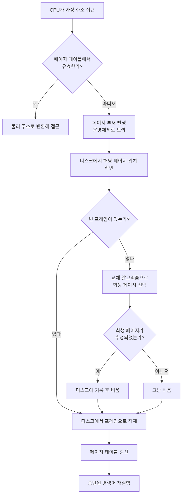

# 약속은 크게, 준비는 작게

은행 창구에 서 있으면 가끔 이상한 생각이 든다. 내 통장에 찍힌 숫자만큼의 현금이 지금 이 건물 어딘가에 정말 쌓여 있을까? 답은 아니다. 은행은 예금자들이 한꺼번에 돈을 찾으러 오지 않는다는 사실에 기대어 예금의 일부만 지급준비금으로 쥐고, 나머지는 세상으로 내보낸다.

운영체제의 가상 메모리도 똑같이 산다. 프로세스마다 "너는 넓은 메모리를 혼자 쓴다"고 약속해 두고, 실제 물리 메모리는 정말 필요한 순간에만 내어준다. 정보처리기사 실기를 공부하다 보면 페이지 교체, 페이지 크기, 지역성, 워킹셋, 스래싱이 줄줄이 나오는데, 이걸 따로따로 외우면 지루하고 한꺼번에 이해하면 의외로 재밌다. 전부 **"약속은 많이 하고 준비는 적게 하는 구조가 어떻게 안 무너지는가"** 에 대한 답이기 때문이다.

> 지급준비제도 자체를 파고들 생각은 없다. 이 글에서 은행은 가상 메모리를 이해하기 위한 발판일 뿐이다.

## 0. 큰 그림: 서랍 규격을 정한 다음의 이야기

페이징은 메모리를 같은 크기로 자른다(논리 공간의 조각은 페이지, 물리 공간의 조각은 프레임). 세그멘테이션은 코드, 데이터, 스택처럼 의미 단위로 자른다. 이 글은 그다음 이야기다. **잘라 놓은 조각 중 무엇을 금고(물리 메모리)에 올려 두고, 무엇을 창고(디스크)로 내보낼 것인가.**

| 은행 | 가상 메모리 |
|---|---|
| 통장 잔액(약속) | 가상 주소 공간 |
| 지급준비금(금고) | 물리 메모리(프레임) |
| 본점 창고 | 디스크(스왑 영역) |
| 규격이 같은 금고 서랍 | 페이지 / 프레임 |
| 서랍이 비었는데 고객이 찾는 상황 | 페이지 부재(page fault) |
| 예금자들의 동시 인출 | 스래싱 |

## 1. 지역성(Locality): 은행이 안 망하는 진짜 이유

은행이 평소에 멀쩡한 건 사람들의 인출이 분산되기 때문이다. 프로그램도 마찬가지다. 프로그램은 메모리를 골고루 쓰지 않고, **한 번 쓴 곳 근처를 계속 쓰는 경향**이 있다. 이게 지역성이다.

- **시간 지역성**: 방금 쓴 데이터를 곧 다시 쓴다. 반복문의 변수, 루프 안의 명령어가 대표적이다.
- **공간 지역성**: 방금 쓴 주소 근처를 곧 쓴다. 배열을 순서대로 훑는 코드가 대표적이다.

단골 고객이 늘 비슷한 시간에 비슷한 업무를 보러 오는 것과 같다. 지금 쓰는 페이지만 물리 메모리에 있어도 프로그램이 돌아가는 건 이 덕분이다. 지역성이 없다면 요구 페이징은 성립하지 않는다. **지역성은 가상 메모리의 존재 이유이자 전제 조건**이다.

## 2. 워킹셋(Working Set): 요즘 자주 오는 고객 명단

지역성이 "성향"이라면 워킹셋은 그걸 숫자로 잡은 개념이다. 데닝(Denning)이 제안한 모델로, **최근 Δ(델타) 시간 동안 프로세스가 참조한 페이지들의 집합**이다.

은행으로 치면 "최근 일주일 안에 거래한 고객 명단"이다. 이 명단만큼의 서랍은 금고에 열어 둬야 창구가 안 막힌다.

- 워킹셋만큼 프레임을 주면 페이지 부재가 거의 안 난다.
- 워킹셋보다 적게 주면 페이지 부재가 폭증한다.
- Δ가 너무 작으면 필요한 페이지를 놓치고, 너무 크면 안 쓰는 페이지까지 붙들고 있게 된다.

시험 포인트는 이 정도다. **워킹셋 모델은 프로세스별로 필요한 프레임 수를 추정해서, 그만큼을 보장할 수 없으면 아예 그 프로세스를 메모리에 올리지 않는다.** 이게 다음 절의 스래싱 방지로 이어진다.

## 3. 페이지 크기: 서랍을 크게 만들까, 작게 만들까

서랍의 크기를 정하는 일은 은행 설계에서 꽤 골치 아픈 결정이다. 페이지 크기는 정답이 없고 트레이드오프만 있다.

| 구분 | 페이지가 작을 때 | 페이지가 클 때 |
|---|---|---|
| 내부 단편화 | 적다 | 많다 |
| 페이지 테이블 크기 | 커진다 (항목이 많아진다) | 작아진다 |
| 필요한 것만 올리는 정밀도 | 높다 | 낮다 (안 쓰는 부분도 딸려 온다) |
| 디스크 I/O | 횟수가 늘어난다 | 한 번에 많이 읽어 효율적이다 |
| 지역성 활용 | 약하다 | 공간 지역성을 잘 살린다 |

작은 서랍은 낭비는 줄지만 장부가 두꺼워지고, 큰 서랍은 장부는 얇지만 서랍 안이 헐렁해진다. 그래서 실제 시스템은 보통 4KB 안팎을 기본으로 쓰고, 대용량 작업에는 큰 페이지(huge page)를 따로 허용하는 식으로 절충한다.

## 4. 페이지 교체 알고리즘: 서랍이 가득 찼을 때 누구를 내보낼까

금고가 꽉 찼는데 새 고객이 왔다. 누군가의 서랍을 비워 창고로 보내야 한다. 그 **희생양을 고르는 규칙**이 페이지 교체 알고리즘이다. 필요한 페이지가 금고에 없을 때 벌어지는 일부터 보자.

### 대표 알고리즘

| 알고리즘 | 누구를 내보내나 | 한 줄 평 |
|---|---|---|
| **OPT** (최적) | 앞으로 가장 오랫동안 쓰이지 않을 페이지 | 미래를 알아야 해서 구현 불가. 다른 알고리즘의 비교 기준 |
| **FIFO** | 가장 먼저 들어온 페이지 | 구현이 쉽지만 자주 쓰는 페이지도 내보낼 수 있다. 은행으로 치면 "오래 다닌 단골부터 쫓아내기" |
| **LRU** | 가장 오랫동안 안 쓴 페이지 | 지역성에 기대는 현실적 근사. 참조 시각을 추적해야 해서 비용이 든다 |
| **LFU** | 참조 횟수가 가장 적은 페이지 | 과거에 많이 쓰고 이제 안 쓰는 페이지가 오래 남는 단점 |
| **NUR** | 참조 비트·수정 비트 조합이 가장 낮은 페이지 | 비트 두 개로 LRU를 싸게 흉내 낸다 |
| **클럭(2차 기회)** | FIFO 순서로 돌되 참조 비트가 1이면 한 번 봐준다 | 실제 OS에서 많이 쓰는 절충안 |

LRU가 잘 먹히는 이유는 앞서 본 시간 지역성 때문이다. **"최근에 안 쓴 것은 앞으로도 안 쓸 가능성이 높다"는 믿음이 곧 LRU**다.

### 시험 단골 계산

참조 열이 `7 0 1 2 0 3 0 4 2 3 0 3 2 1 2 0 1 7 0 1`, 프레임이 3개일 때 페이지 부재 횟수는 다음과 같다.

| 알고리즘 | 페이지 부재 |
|---|---|
| OPT | 9회 |
| LRU | 12회 |
| FIFO | 15회 |

OPT가 가장 적고, 미래를 모르는 알고리즘 중에서는 지역성을 쓰는 LRU가 FIFO보다 낫다. 이 순서가 대체로 성립한다.

### FIFO의 이상한 약점: Belady의 모순

프레임을 늘리면 당연히 부재가 줄어야 하는데, FIFO는 오히려 늘어나는 경우가 있다. 참조 열 `1 2 3 4 1 2 5 1 2 3 4 5`에서 프레임 3개일 때 9회, 4개일 때 10회가 난다. 서랍을 늘렸더니 오히려 창구가 더 바빠진 셈이다. LRU와 OPT는 스택 알고리즘이라서 이런 일이 생기지 않는다.

## 5. 스래싱: 그날이 오면 효율은 재앙이 된다

모든 프로세스가 한꺼번에 많은 메모리를 달라고 하면 어떻게 될까. 프레임이 워킹셋에도 못 미치니 페이지 부재가 연달아 터지고, 방금 내보낸 페이지를 곧바로 다시 불러오는 일이 반복된다. CPU는 계산은 못 하고 디스크만 오간다. 이게 **스래싱**, 은행으로 치면 뱅크런이다.

무서운 건 마지막 두 줄이다. CPU 이용률이 떨어지니 운영체제는 "일이 모자라나 보다" 하고 프로세스를 더 올리는데, 그게 상황을 더 악화시킨다. 악순환이다.

다중 프로그래밍 정도에 따른 CPU 이용률 곡선

<svg viewBox="0 0 640 380" xmlns="http://www.w3.org/2000/svg" font-family="'Noto Sans KR', 'Apple SD Gothic Neo', sans-serif">
  <rect width="640" height="380" fill="#ffffff"/>
  <!-- axes -->
  <line x1="70" y1="40" x2="70" y2="310" stroke="#333" stroke-width="2"/>
  <line x1="70" y1="310" x2="600" y2="310" stroke="#333" stroke-width="2"/>
  <polygon points="70,32 64,46 76,46" fill="#333"/>
  <polygon points="608,310 594,304 594,316" fill="#333"/>
  <text x="30" y="30" font-size="14" fill="#333">CPU 이용률</text>
  <text x="440" y="345" font-size="14" fill="#333">다중 프로그래밍 정도 (동시에 올린 프로세스 수)</text>

  <!-- thrashing zone -->
  <rect x="400" y="50" width="190" height="260" fill="#fdecea" opacity="0.7"/>
  <text x="430" y="75" font-size="14" fill="#c0392b" font-weight="bold">스래싱 구간</text>

  <!-- curve -->
  <path d="M70,300 C140,200 200,90 330,80 C380,78 400,110 440,220 C470,285 520,300 590,305"
        fill="none" stroke="#2c6fbb" stroke-width="4"/>

  <!-- peak marker -->
  <circle cx="340" cy="80" r="6" fill="#2c6fbb"/>
  <line x1="340" y1="86" x2="340" y2="310" stroke="#2c6fbb" stroke-dasharray="5,5"/>
  <text x="250" y="62" font-size="13" fill="#2c6fbb">워킹셋이 간신히 다 들어가는 지점</text>
  <text x="318" y="330" font-size="13" fill="#2c6fbb">적정</text>

  <!-- annotations -->
  <text x="90" y="260" font-size="13" fill="#555">프레임이 남는다</text>
  <text x="90" y="278" font-size="13" fill="#555">(자원 낭비)</text>
  <text x="405" y="250" font-size="13" fill="#c0392b">교체만 반복</text>
  <text x="405" y="268" font-size="13" fill="#c0392b">= 뱅크런</text>
</svg>

그래프로 보면 알기 쉽다. 프로세스를 늘릴수록 이용률이 오르다가, 워킹셋이 더는 다 들어가지 못하는 지점을 넘으면 급전직하한다.

### 스래싱을 막는 방법

- **워킹셋 모델**: 프로세스의 워킹셋만큼 프레임을 보장할 수 있을 때만 메모리에 올린다. 합계가 물리 메모리를 넘으면 일부 프로세스를 통째로 스왑 아웃한다.
- **페이지 부재 빈도(PFF) 조절**: 부재율이 상한을 넘으면 프레임을 더 주고, 하한 아래면 회수한다. 은행으로 치면 인출 요청이 몰리는 창구에는 서랍을 더 열어 주고 한가한 곳은 줄이는 식이다.
- **다중 프로그래밍 정도 낮추기**: 동시에 돌리는 프로세스 수를 줄인다.
- **페이지 크기 조정, 메모리 증설**: 근본 처방이지만 비용이 든다.

## 6. 비유가 끝나는 곳

여기까지 읽으면 은행과 메모리가 쌍둥이 같지만, 둘은 결정적으로 다르다.

- 은행은 대출로 화폐를 **실제로 늘린다**. 가상 메모리는 물리 메모리를 **한 바이트도 늘리지 못한다**. 가상 주소 공간은 약속이고, 자원은 여전히 물리 메모리 크기에 묶여 있다. 더 정확히는 "필요한 순간까지 할당을 미루는 지연 할당"에 가깝다.
- 은행은 지급불능이 오면 **파산**한다. 메모리는 스왑을 쓰면서 **느려진다**.

가상 메모리가 치르는 대가는 신뢰의 붕괴가 아니라 속도다. 약속을 어기는 게 아니라 약속을 지키느라 시간이 걸릴 뿐이다. 기계는 무너지는 대신 느려지는 쪽을 택하는 꽤 정직한 시스템인 셈이다.

## 7. 정리: 시험용 한 장 요약

| 개념 | 핵심 | 은행 비유 |
|---|---|---|
| 지역성 | 쓴 곳 근처를 계속 쓴다 (시간·공간) | 단골의 일정한 방문 패턴 |
| 워킹셋 | 최근 Δ 동안 참조한 페이지 집합 | 최근 거래 고객 명단 |
| 페이지 크기 | 작으면 테이블 커짐, 크면 내부 단편화 증가 | 서랍 크기 설계 |
| 교체 알고리즘 | OPT < LRU < FIFO (부재 횟수, 대체로) | 누구를 창고로 보낼까 |
| 스래싱 | 워킹셋 미달 → 부재 폭증 → CPU 이용률 급락 | 뱅크런 |
| 방지책 | 워킹셋 보장, PFF 조절, 프로세스 수 제한 | 인출 분산 관리 |

페이징과 세그멘테이션을 외울 때만 해도 단편화는 그냥 시험 문장이었다. 그런데 이렇게 지역성에서 워킹셋, 교체, 스래싱까지 이어 놓고 보니, 이 모든 게 결국 **한정된 자원으로 무한한 필요를 어떻게 나눠 줄 것인가**라는 오래된 질문의 흔적이었다. 암기도 그렇게 보면 조금은 덜 막막하다.

---

