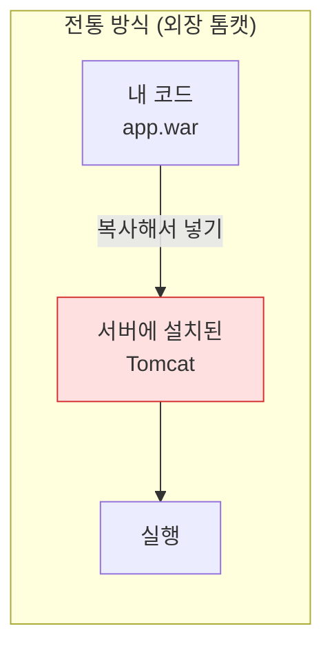
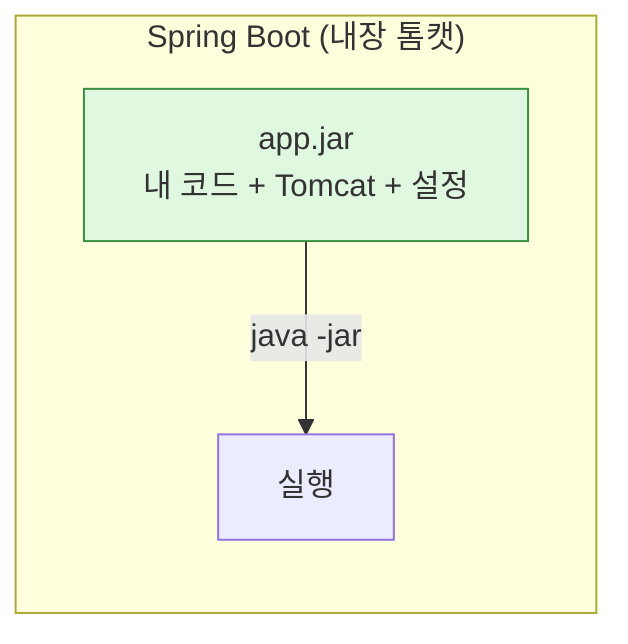
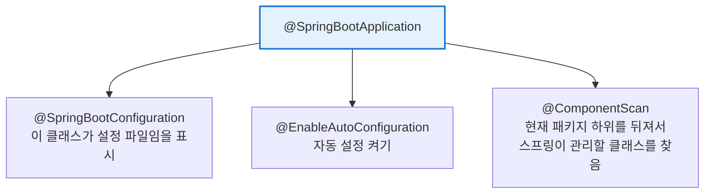
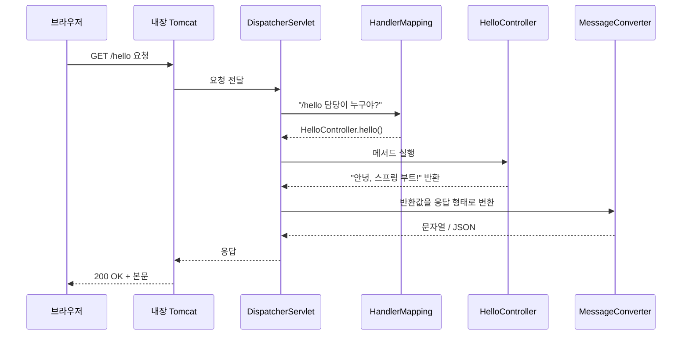

## 오늘 배울 것

| 순서 | 내용 |
|---|---|
| 1 | 스프링 vs 스프링 부트, 뭐가 다른가 |
| 2 | 스프링 부트가 해결해준 세 가지 |
| 3 | 프로젝트 생성하고 구조 파악하기 |
| 4 | `@SpringBootApplication` 뜯어보기 |
| 5 | 첫 REST API 만들기 |
| 6 | 요청이 처리되는 흐름 이해하기 |

---

## 1. 스프링과 스프링 부트는 다른 건가?

결론부터 말하면 **다르지 않다.** 스프링 부트는 스프링을 감싼 포장지에 가깝다.

스프링(Spring Framework)은 자바로 웹 애플리케이션을 만들 때 쓰는 거대한 도구 상자다. 기능은 훌륭하나 문제가 하나 있는데, 그건 **설정이 너무 많다는 거다.**

예전에 순수 스프링으로 웹 프로젝트를 시작하려면 이런 걸 다 해야 했다.

- `web.xml`에 DispatcherServlet 등록
- XML 파일에 빈(Bean) 수십 개 등록
- 라이브러리 버전 궁합 직접 맞추기
- 톰캣 서버 따로 설치하고 WAR 파일 말아서 배포

코드 한 줄 쓰기 전에 설정 파일부터 수백 줄을 써야하는 구조였다. 

그래서 스프링 부트는 위 설정들을 조건에 따라(if) 알아서 판단해서 적용해준다.  

> 따로 명시적으로 나타내지 않으면 그냥 관습대로 하겠다는 원칙. `CoC(Convention over Configuration, 설정보다 관습)`


참고로 스프링 부트의 자동 설정 클래스들을 예시로 보면 다음과 같다. 

```java

@AutoConfiguration
@ConditionalOnClass(DataSource.class)        // 이 클래스가 클래스패스에 있을 때만
@ConditionalOnMissingBean(DataSource.class)  // 내가 직접 만든 게 없을 때만
public class DataSourceAutoConfiguration {
    @Bean
    public DataSource dataSource() { ... }
}
```

핵심은 두 번째 줄 `@ConditionalOnMissingBean`이다. 즉 '사용자가 직접 등록한 빈이 없다면'이라는 조건을 만족해야 작동하고, 개발자가 같은 타입의 빈을 만들어두면 스프링 부트는 조용히 물러난다. 이걸 공식 문서에선 `back off(물러난다)` 라고 표현한다. 

즉 기본값을 주는 게 아니라 사용자가 안 하면 대신 해주고, 직접 하겠다고 하면 손 뗀다. 요즘말로 츤데레(?)같은 느낌이다. 


---

## 2. 스프링 부트가 해결해준 세 가지

### 2-1. 자동 설정 (Auto Configuration)

클래스패스에 어떤 라이브러리가 올라와 있는지 보고, 필요한 설정을 **알아서** 등록해준다.

예를 들어 DB 관련 라이브러리가 있으면 "아 DB 쓰려나 보다" 하고 커넥션 풀을 자동으로 만들어준다. 웹 라이브러리가 있으면 웹 서버 설정을 자동으로 잡아준다.

### 2-2. 스타터 (Starter) 의존성

라이브러리 버전 궁합 맞추기가 예전엔 큰 일이었다. A는 1.2를 써야 하고 B는 A의 1.1을 요구하고... 스프링 부트는 이걸 **세트 메뉴**로 묶어놨다.

| 스타터 이름 | 언제 쓰나 | 안에 들어있는 것 |
|---|---|---|
| `spring-boot-starter-web` | 웹/REST API 만들 때 | Spring MVC, 내장 Tomcat, Jackson |
| `spring-boot-starter-data-jpa` | DB에 데이터 저장할 때 | JPA, Hibernate, HikariCP |
| `spring-boot-starter-validation` | 입력값 검증할 때 | Hibernate Validator |
| `spring-boot-starter-test` | 테스트 코드 짤 때 | JUnit5, Mockito, AssertJ |
| `spring-boot-starter-security` | 로그인/권한 처리할 때 | Spring Security |

세트 메뉴 하나만 시키면 안에 든 반찬 버전은 신경 쓸 필요가 없다.


### 2-3. 내장 웹 서버 — 톰캣이 뭐고, 왜 "내장"이 대단한가

**먼저, 웹 서버(WAS)가 왜 필요한가?**

자바 프로그램은 혼자서 HTTP 요청을 받지 못한다. 브라우저가 보낸 요청은 그냥 **텍스트 덩어리**다.

```
GET /hello HTTP/1.1
Host: localhost:8080
```

이걸 받아서 파싱하고, 자바 객체로 바꾸고, 응답을 다시 HTTP 형식으로 만들어 돌려주는 일을 누군가는 해야 한다. 그 역할을 하는 게 **톰캣(Tomcat)** 같은 웹 애플리케이션 서버다. 우리 코드는 "정리된 요청"을 받아서 "값"만 돌려주면 되고, 지저분한 네트워크 처리는 톰캣이 다 한다.

>참고
**직렬화(stringify)** 는 데이터를 밖으로 보내기 위해 **포장 및 가공하는 과정**이고,
**파싱(parse)** 은 넘어온 데이터를 풀어서 **분류하고 정리하는 과정**이다.


**예전 방식: 톰캣이 밖에 있었다**



톰캣은 서버에 **따로 설치하는 프로그램**이었다. 그리고 내 코드는 **WAR 파일**로 압축해서 톰캣의 지정된 폴더(`webapps/`)에 집어넣어야 했다.

> **WAR(Web Application aRchive)**: 웹 애플리케이션을 압축한 파일. 클래스 파일, 라이브러리, 설정, 정적 리소스를 한 덩어리로 묶은 것이다. 혼자서는 실행되지 않고, **톰캣 같은 서버 안에 들어가야만** 동작한다.

배포 과정은 이랬다.

1. 서버에 자바 설치
2. 서버에 톰캣 설치, 버전 맞추기
3. 톰캣 설정 파일(`server.xml`)에서 포트, 인코딩 등 조정
4. WAR 파일을 빌드해서 서버로 전송
5. `webapps/`에 넣고 톰캣 재시작

문제가 여기서 나온다. **내 코드가 톰캣이라는 남의 집에 세들어 사는 구조**라서,

- 내 PC 톰캣은 9.0인데 서버는 8.5 → 로컬에선 되는데 서버에선 터져버림.
- 톰캣 하나에 여러 앱이 얹혀 있으면, 하나 재시작할 때 다른 앱까지 영향을 줌.
- 새 팀원이 오면 톰캣 설치부터 같이 앉아서 해줘야 함. 

**스프링 부트 방식: 톰캣을 내 코드 안으로**



주객전도라고나 할까. 예전엔 **톰캣이 내 코드를 실행**했다면, 이제는 **내 코드가 톰캣을 실행**한다. `main` 메서드 안의 이 한 줄이 그 일을 한다.

```java
SpringApplication.run(DemoApplication.class, args);
// 내부에서 톰캣 객체를 생성하고 start() 한다
```

톰캣이 그냥 `spring-boot-starter-web`에 들어있는 **라이브러리 중 하나**가 된 것이다. 그래서 빌드 결과물도 WAR가 아니라 **실행 가능한 JAR**다. 톰캣까지 통째로 들어있으니 자바만 깔려 있으면 어디서든 돈다.

```bash
./gradlew build                      # build/libs/demo-0.0.1-SNAPSHOT.jar 생성
java -jar demo-0.0.1-SNAPSHOT.jar    # 끝. 서버가 뜬다
```

**정리하면**

| 항목 | 외장 톰캣 (WAR) | 내장 톰캣 (JAR) |
|---|---|---|
| 톰캣 위치 | 서버에 별도 설치 | 애플리케이션 안 |
| 결과물 | `app.war` | `app.jar` |
| 실행 방법 | 톰캣이 WAR를 읽어서 실행 | `java -jar app.jar` |
| 서버 버전 관리 | 서버 관리자가 담당 | `build.gradle`에 명시 → 코드로 관리 |
| 실행 주체 | 톰캣이 내 코드를 실행 | 내 코드가 톰캣을 실행 |
| 환경 차이 | 로컬/운영 톰캣 버전이 다를 수 있음 | 어디서 돌려도 동일 |


버전 관리가 코드 안으로 들어왔다는 게 특히 크다. 톰캣 버전이 `build.gradle`에 박혀 있으니 **git으로 추적되고, 팀원 전체가 같은 버전을 쓰게 된다** 

그리고 이러한 구조적 특징은 최근 배포 방식과도 잘 맞는다. Docker 컨테이너에 JAR 하나만 넣으면 끝이고, 클라우드에 올릴 때도 "이 JAR 실행해줘"로 끝난다. **서버 설치가 필요 없는 앱**이라는 점이 컨테이너 시대와 궁합이 좋다.

> 톰캣이 마음에 안 들면 바꿀 수도 있다. `spring-boot-starter-web`에서 톰캣을 빼고 **Undertow**나 **Jetty**를 넣으면 된다. 비동기 처리가 필요하면 아예 서블릿 기반이 아닌 **WebFlux + Netty** 조합으로 가기도 한다. 어느 쪽이든 우리가 짜는 컨트롤러 코드는 거의 그대로다.

---

## 3. 프로젝트 만들기

### 3-1. Spring Initializr 사용

브라우저에서 [start.spring.io](https://start.spring.io) 로 들어간다. 아래처럼 고르면 된다.

| 항목 | 선택값 | 이유 |
|---|---|---|
| Project | **Gradle - Groovy** | 요즘 표준. Maven도 상관없다 |
| Language | **Java** | |
| Spring Boot | **3.x 최신 안정 버전** | |
| Java | **17** 이상 | 부트 3.x는 17이 최소다 |
| Dependencies | **Spring Web**, **Lombok** | 오늘은 이 둘이면 충분 |


`GENERATE` 누르면 zip 파일이 떨어진다. 압축 풀고 IntelliJ에서 열면 된다.

> IntelliJ를 쓴다면 `File > New > Project > Spring Initializr` 로 IDE 안에서 바로 만들 수도 있다.

### 3-2. 프로젝트 구조

```
demo/
├── src/
│   ├── main/
│   │   ├── java/
│   │   │   └── com/example/demo/
│   │   │       └── DemoApplication.java   ← 시작점
│   │   └── resources/
│   │       ├── static/                     ← 이미지, CSS 같은 정적 파일
│   │       ├── templates/                  ← 화면 템플릿 (Thymeleaf 등)
│   │       └── application.properties      ← 설정 파일
│   └── test/
│       └── java/...                        ← 테스트 코드
├── build.gradle                            ← 의존성 목록
└── gradlew                                 ← 그레이들 실행 스크립트
```

당장 중요한 건 세 개다. **`DemoApplication.java`**, **`application.properties`**, **`build.gradle`**.

---

## 4. `@SpringBootApplication` 뜯어보기

프로젝트를 만들면 이런 파일이 하나 생긴다.

```java
package com.example.demo;

import org.springframework.boot.SpringApplication;
import org.springframework.boot.autoconfigure.SpringBootApplication;

@SpringBootApplication
public class DemoApplication {

    public static void main(String[] args) {
        SpringApplication.run(DemoApplication.class, args);
    }
}
```

딱 10줄인데 이게 애플리케이션 전체의 시작점이다. `@SpringBootApplication` 이 어노테이션 하나가 사실 **세 개를 합쳐놓은 것**이다.




여기서 **`@ComponentScan`이 현재 패키지 하위를 뒤진다**는 점이 중요하다. `DemoApplication.java`가 `com.example.demo`에 있으면, 스프링은 `com.example.demo` 아래에 있는 클래스만 찾는다.

> 초보자가 자주 겪는 일: 컨트롤러를 `com.myapp.controller` 같은 엉뚱한 패키지에 만들어놓고 "왜 404가 뜨지?" 하고 헤맨다. **메인 클래스 패키지 아래에 만들어야 한다.**

이제 `main` 메서드를 실행해본다. 콘솔에 스프링 로고가 뜨고 이런 로그가 나오면 성공이다.

```
Tomcat started on port 8080 (http)
Started DemoApplication in 1.234 seconds
```

---

## 5. 첫 REST API 만들기

`com.example.demo` 아래에 `controller` 패키지를 만들고 파일을 하나 추가한다.

```java
package com.example.demo.controller;

import org.springframework.web.bind.annotation.*;

@RestController
public class HelloController {

    @GetMapping("/hello")
    public String hello() {
        return "안녕, 스프링 부트!";
    }
}
```

서버를 다시 실행하고 브라우저에서 `http://localhost:8080/hello` 로 들어가면 글자가 보인다. 끝이다. 진짜 이게 다다.

### 어노테이션 하나씩 뜯어보기

| 어노테이션 | 하는 일 |
|---|---|
| `@RestController` | "이 클래스는 웹 요청을 받는 담당이고, 리턴값을 그대로 응답 본문에 담아라" |
| `@GetMapping("/hello")` | GET 방식으로 `/hello` 주소가 들어오면 이 메서드를 실행해라 |

`@RestController`는 사실 `@Controller` + `@ResponseBody`다. `@Controller`만 쓰면 리턴값을 "화면 파일 이름"으로 해석하지만, `@ResponseBody`가 붙으면 "리턴값 자체가 응답 데이터"가 된다. API 서버를 만들 땐 `@RestController`를 쓴다.

### 파라미터 받아보기

주소로 값을 넘겨받는 방법은 두 가지다.

```java
@RestController
public class HelloController {

    // 1) 쿼리 파라미터 → /greet?name=성진
    @GetMapping("/greet")
    public String greet(@RequestParam String name) {
        return name + "안녕!";
    }

    // 2) 경로 변수 → /users/42
    @GetMapping("/users/{id}")
    public String findUser(@PathVariable Long id) {
        return id + "번 유저를 찾는 중";
    }
}
```

### JSON으로 응답하기

문자열 말고 객체를 리턴하면 스프링 부트가 **알아서 JSON으로 바꿔준다.**

```java
// record는 Java 16부터 쓸 수 있는 간단한 데이터 클래스다
public record UserResponse(Long id, String name, int age) {}
```

```java
@GetMapping("/users/{id}")
public UserResponse findUser(@PathVariable Long id) {
    return new UserResponse(id, "철수", 20);
}
```

`/users/42`로 요청하면 이런 응답이 온다.

```json
{
  "id": 42,
  "name": "철수",
  "age": 20
}
```

객체를 JSON으로 바꿔주는 건 Jackson이라는 라이브러리가 하는 일인데, `spring-boot-starter-web` 안에 이미 들어있다. 우리가 설정한 게 하나도 없는데 동작한다. 이게 아까 말한 **자동 설정**의 실체다.

---

## 6. 요청은 어떻게 처리되나

브라우저에서 `/hello`를 쳤을 때 내부에서 벌어지는 일을 순서대로 보면 이렇다.



핵심은 **DispatcherServlet**이다. 모든 요청은 일단 여기로 들어오고, 얘가 교통정리를 해서 알맞은 컨트롤러로 보낸다. 그래서 프론트 컨트롤러(Front Controller) 패턴이라고 부른다.

우리는 이 중에 **컨트롤러 하나만** 만들었다. 나머지는 스프링 부트가 자동으로 준비해둔 것이다.

---

## 7. 자주 만나는 문제

| 증상 | 원인 | 해결 |
|---|---|---|
| 404 Not Found | 컨트롤러가 컴포넌트 스캔 범위 밖 | 메인 클래스 패키지 하위로 옮긴다 |
| `Port 8080 was already in use` | 8080 포트를 다른 프로그램이 쓰는 중 | 기존 프로세스를 끄거나 `application.properties`에 `server.port=8081` |
| 롬복 어노테이션이 동작 안 함 | IDE에 애노테이션 처리 설정이 꺼져 있음 | IntelliJ 설정에서 `Enable annotation processing` 체크 |
| 한글이 `???`로 깨짐 | 인코딩 문제 | 파일 인코딩을 UTF-8로 통일 |

---

## 요약 정리

- 스프링 부트는 스프링을 **설정 없이 바로 쓰게 해주는** 도구다.
- 핵심 무기 세 개: **자동 설정**, **스타터 의존성**, **내장 서버**.
- `@SpringBootApplication`은 설정 + 자동설정 + 컴포넌트스캔을 합친 어노테이션이다.
- `@RestController` + `@GetMapping` 조합이면 API 하나가 완성된다.
- 객체를 리턴하면 JSON으로 자동 변환된다.

---


[star]: /assets/images/star.png#blog-star-emoji "star"
