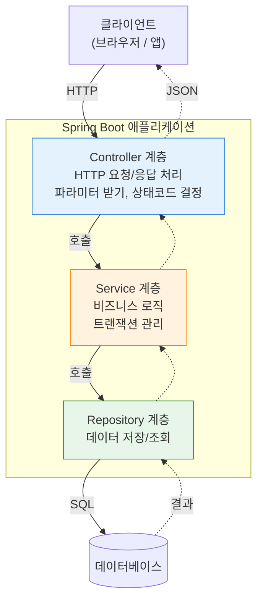
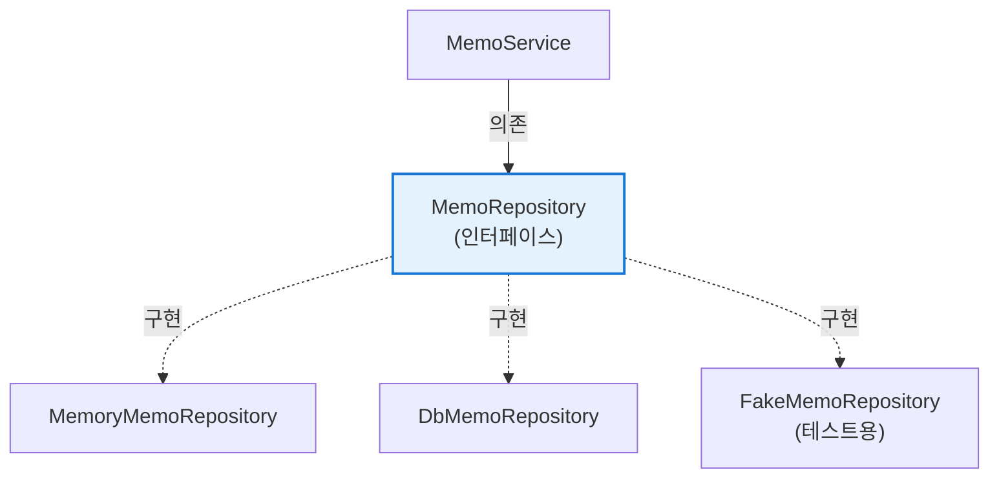
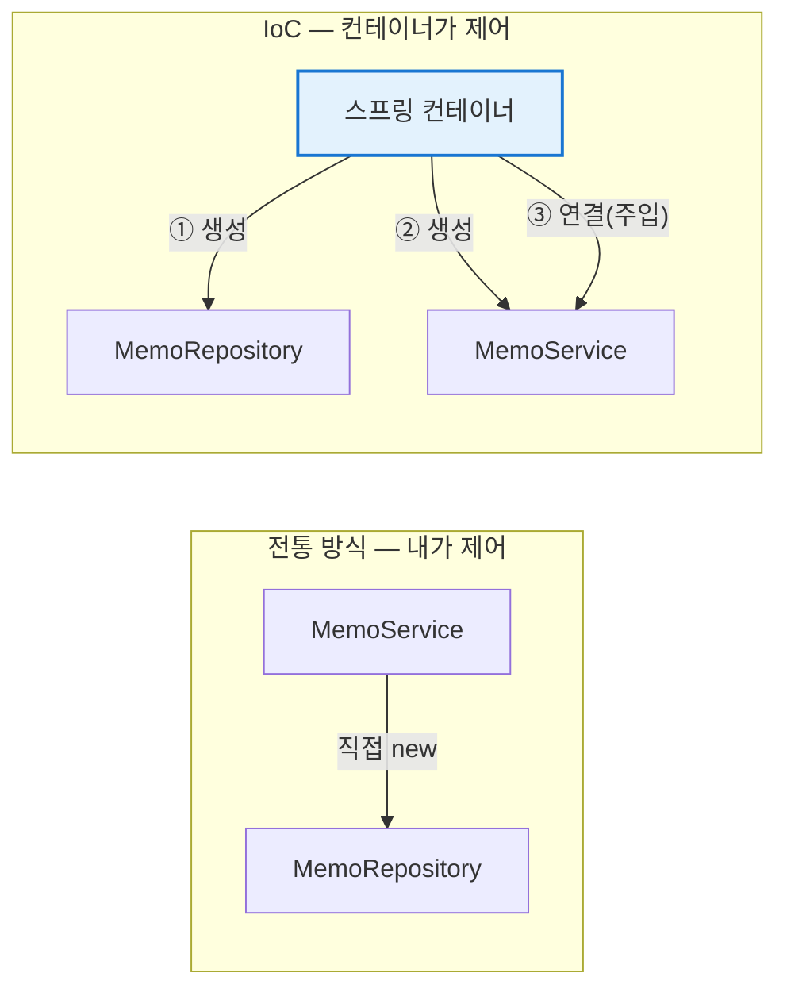
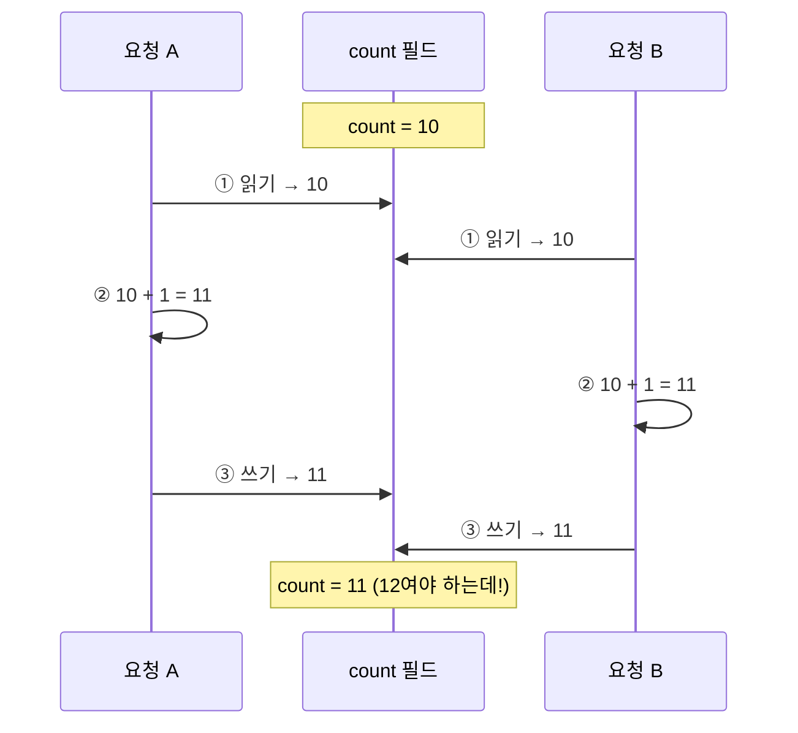
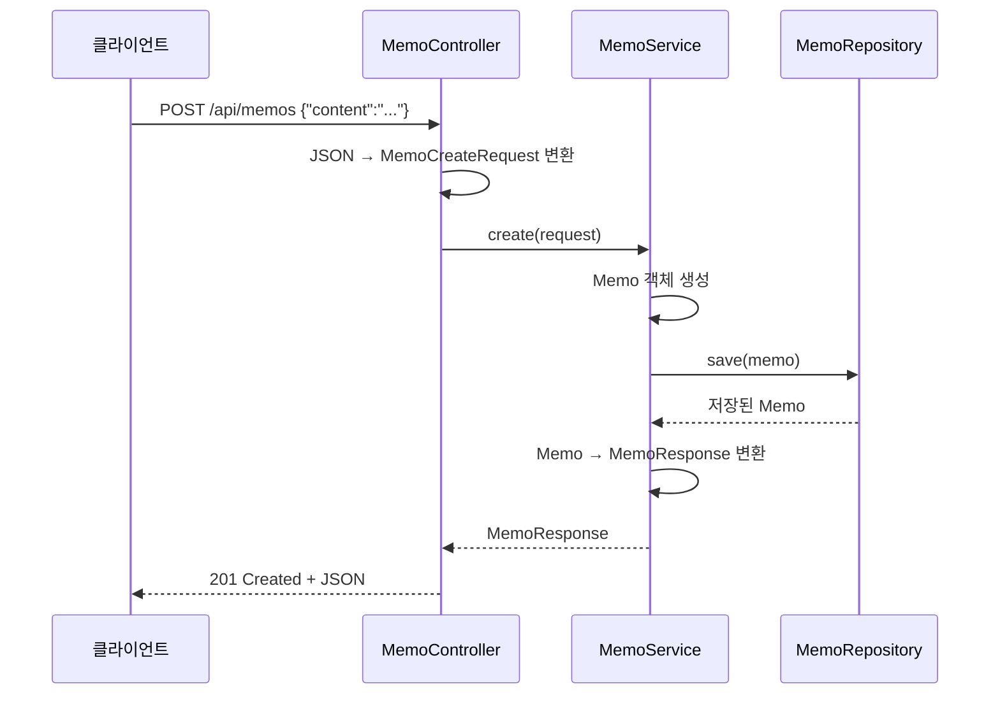
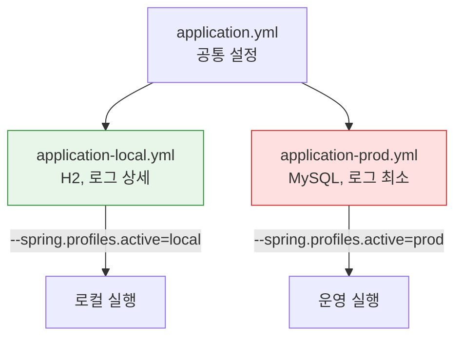

## 오늘 배울 것

| 순서 | 내용 |
|---|---|
| 1 | 컨트롤러에 다 때려박으면 생기는 일 |
| 2 | 3계층 아키텍처 |
| 3 | IoC와 DI가 뭔지 |
| 4 | 빈(Bean)과 스프링 컨테이너 |
| 5 | 생성자 주입을 써야 하는 이유 |
| 6 | 실습: 메모 API를 계층으로 나누기 |
| 7 | DTO를 왜 따로 만드나 |
| 8 | 설정 파일과 프로파일 |

---


## 1. 다 때려박으면 생기는 일

이런 코드를 상상해보자.

```java
@RestController
public class MemoController {

    private final List<Memo> store = new ArrayList<>();

    @PostMapping("/memos")
    public Memo create(@RequestBody Memo memo) {
        // 검증
        if (memo.getContent() == null || memo.getContent().isBlank()) {
            throw new IllegalArgumentException("내용이 비었다");
        }
        // 비즈니스 로직
        memo.setId(System.currentTimeMillis());
        memo.setCreatedAt(LocalDateTime.now());
        // 저장
        store.add(memo);
        // 알림 발송
        // ... 이메일 보내는 코드 30줄 ...
        return memo;
    }
}
```

당장은 돌아간다. 문제는 나중에 생긴다.

- 저장소를 리스트에서 DB로 바꾸려면 **컨트롤러를 뜯어고쳐야 한다.**
- 이 비즈니스 로직을 배치 작업에서도 쓰고 싶은데, 웹 요청 없이는 호출할 수 없다.
- 테스트를 하려면 웹 서버를 띄워야 한다.
- 검증, 로직, 저장, 알림이 한 메서드에 섞여 있어서 읽기가 힘들다.

**하나의 클래스는 하나의 이유로만 바뀌어야 한다.** 그래서 계층을 나눈다.

---

## 2. 3계층 아키텍처




각 계층의 역할을 표로 정리하면 이렇다.

| 계층 | 어노테이션 | 하는 일 | 하면 안 되는 일 |
|---|---|---|---|
| Controller | `@RestController` | 요청 받기, 응답 만들기 | 비즈니스 로직, SQL |
| Service | `@Service` | 비즈니스 로직, 트랜잭션 | HTTP 관련 처리 (Request 객체 다루기 등) |
| Repository | `@Repository` | DB 접근 | 비즈니스 판단 |

**화살표는 항상 아래로만 간다.** Repository가 Service를 호출하는 일은 없다. 이 방향이 지켜져야 계층이 의미가 있다.

---

## 3. IoC와 DI

스프링을 배울 때 제일 먼저 만나고, 제일 오래 헷갈리는 개념이다. 용어부터 외우면 안 잡히니까 **문제 상황부터 단계별로 따라가 본다.**

### 3-1. 1단계 — 직접 `new` 하던 시절

객체가 필요하면 그냥 만들었다.

```java
public class MemoService {
    // 내가 직접 new 한다
    private final MemoRepository repository = new MemoRepository();

    public void save(String content) {
        repository.save(new Memo(content));
    }
}
```

당장은 잘 돌아간다. 문제는 요구사항이 바뀔 때 드러난다.

**"메모리 말고 DB에 저장해주세요."**

`MemoRepository` 대신 `DbMemoRepository`를 쓰려면 `MemoService` 코드를 열어서 고쳐야 한다.

```java
// 저장 방식이 바뀌었을 뿐인데 Service를 수정한다
private final MemoRepository repository = new DbMemoRepository();
```

**비즈니스 로직은 하나도 안 바뀌었는데 Service 파일이 수정된다.** 게다가 이런 Service가 10개면 10개를 다 고쳐야 한다.

이걸 **강한 결합(tight coupling)** 이라고 부른다. `MemoService`가 `MemoRepository`라는 **특정 클래스 이름을 코드 안에 박아두고 있어서** 생기는 문제다.

**테스트도 막힌다.** `MemoService`를 테스트하려는데, `new MemoRepository()`가 코드 안에 박혀 있으니 가짜 저장소로 바꿔치기할 방법이 없다. DB에 진짜로 붙는 테스트만 가능해진다.


### 3-2. 2단계 — 인터페이스로 추상화

먼저 "무엇을 할 수 있는지"만 인터페이스로 뽑는다.

```java
public interface MemoRepository {
    Memo save(Memo memo);
    Optional<Memo> findById(Long id);
}
```

구현체는 여러 개 만들 수 있다.

```java
public class MemoryMemoRepository implements MemoRepository { ... }  // 메모리에 저장
public class DbMemoRepository implements MemoRepository { ... }       // DB에 저장
```

이제 `MemoService`는 인터페이스만 알면 된다.

```java
public class MemoService {
    private final MemoRepository repository;   // 인터페이스 타입

    public MemoService(MemoRepository repository) {   // 밖에서 받는다
        this.repository = repository;
    }
}
```

**핵심은 `new`가 사라진 것이다.** `MemoService`는 이제 "누가 어떻게 저장하는지" 모른다. `save()`를 호출할 수 있다는 것만 안다. 저장 방식이 바뀌어도 이 파일은 열 일이 없다.



이걸 **느슨한 결합(loose coupling)** 이라고 한다. 구현이 바뀌어도 쓰는 쪽이 안 흔들리는 구조다.

### 3-3. 3단계 — 그런데 누가 넣어주지?

문제를 옮겨놓기만 한 것 같다. `MemoService`는 `new`를 안 하게 됐지만, **누군가는 여전히 `new`를 해야 한다.**

```java
public static void main(String[] args) {
    MemoRepository repository = new DbMemoRepository();
    MemoService service = new MemoService(repository);
    MemoController controller = new MemoController(service);
    // ... 클래스가 50개면 이 조립 코드가 50줄
}
```

객체를 만들고 순서 맞춰 끼워 넣는 **조립 담당**이 필요해졌다. 규모가 커지면 이 조립 코드 자체가 관리 대상이 된다.

**이 조립을 대신 해주는 게 스프링이다.**

### 3-4. IoC — 제어의 역전

**Inversion of Control**, 제어의 역전. "제어"란 **객체를 언제 만들고, 무엇과 연결하고, 언제 없앨지 결정하는 권한**을 말한다. 원래 이 권한은 내 코드에 있었는데, 그걸 프레임워크에 넘긴 것이다.



> 흔히 "**할리우드 원칙**"에 비유한다. 오디션에서 배우가 감독한테 전화하는 게 아니라 — *"Don't call us, we'll call you."* — 감독이 배우를 부른다. 내 코드가 프레임워크를 호출하는 게 아니라, 프레임워크가 내 코드를 불러 쓰는 구조다.

참고로 IoC는 스프링만의 개념이 아니다. 우리가 `main`에서 컨트롤러를 호출하는 게 아니라 톰캣이 컨트롤러를 호출하는 것도, 버튼 클릭 이벤트 핸들러가 호출되는 것도 다 IoC다.

### 3-5. DI — 의존성 주입

**Dependency Injection**. IoC를 실현하는 여러 방법 중 하나다. 필요한 객체를 **밖에서 넣어주는 것**을 말한다.

용어를 정확히 하면, `MemoService`가 동작하려면 `MemoRepository`가 있어야 하니까 → `MemoRepository`는 `MemoService`의 **의존성(dependency)** 이다. 그 의존성을 생성자로 **넣어주는(injection)** 것이다.

```java
@Service                                        // "나를 빈으로 등록해줘"
public class MemoService {
    private final MemoRepository repository;

    public MemoService(MemoRepository repository) {   // 스프링이 알아서 넣어준다
        this.repository = repository;
    }
}
```

`@Service`를 붙이면 스프링이 시작할 때 이 클래스를 찾아서, 생성자가 요구하는 타입(`MemoRepository`)의 빈을 컨테이너에서 꺼내 넣어준다. 앞서 손으로 짜던 조립 코드가 통째로 사라진다.

| | IoC | DI |
|---|---|---|
| 무엇 | **원칙** — 제어권을 프레임워크에 넘긴다 | **기법** — 의존 객체를 외부에서 주입한다 |
| 관계 | 넓은 개념 | IoC를 구현하는 방법 중 하나 |
| 한마디로 | "누가 주도하는가" | "어떻게 연결하는가" |

> 비유하자면, 예전엔 요리하려고 밭에 나가서 직접 채소를 길렀다면, 이제는 주방에 들어가면 손질된 재료가 이미 놓여 있는 것이다. 재료가 유기농인지 수입산인지(구현체가 뭔지) 요리사는 알 필요가 없다.

### 3-6. 구현체가 둘 이상이면?

`MemoRepository` 구현체가 두 개인데 스프링이 뭘 넣어야 할지 모르면 이런 에러가 난다.

```
NoUniqueBeanDefinitionException: expected single matching bean but found 2
```

해결 방법은 두 가지다.

```java
// 방법 1: @Primary — 기본으로 쓸 놈을 지정
@Primary
@Repository
public class DbMemoRepository implements MemoRepository { ... }

// 방법 2: @Qualifier — 받는 쪽에서 이름을 지정
public MemoService(@Qualifier("dbMemoRepository") MemoRepository repository) { ... }
```


---

## 4. 빈(Bean)과 스프링 컨테이너

스프링이 만들어서 관리하는 객체를 **빈(Bean)** 이라고 한다. 빈을 담아두는 창고가 **스프링 컨테이너**(ApplicationContext)다.

### 빈으로 등록하는 방법 1: 어노테이션

클래스 위에 어노테이션을 붙이면 컴포넌트 스캔이 찾아서 등록한다.

| 어노테이션 | 용도 | 실체 |
|---|---|---|
| `@Component` | 일반적인 빈 | 기본 |
| `@Controller` / `@RestController` | 웹 요청 처리 | `@Component` + 알파 |
| `@Service` | 비즈니스 로직 | `@Component`와 기능은 동일 |
| `@Repository` | 데이터 접근 | `@Component` + 예외 변환 기능 |

기능상 `@Service`와 `@Component`는 거의 같지만, **읽는 사람에게 역할을 알려주기 위해** 구분해서 쓴다.

### 빈으로 등록하는 방법 2: `@Bean`

내가 만든 클래스가 아니라 **외부 라이브러리 객체**를 빈으로 등록할 땐 이 방법을 쓴다.

```java
@Configuration
public class AppConfig {

    @Bean
    public ObjectMapper objectMapper() {
        return new ObjectMapper();
    }
}
```

### 빈의 생명주기


### 싱글톤 — 그리고 "빈에 상태를 두지 마라"는 말

빈은 기본적으로 **싱글톤**이다. 애플리케이션 전체에서 딱 하나만 만들어지고 모두가 공유한다.

왜 하나만 만드나? 요청이 초당 1000번 들어온다고 `MemoService`를 1000개 만들 필요가 없기 때문이다. `MemoService`는 저장할 데이터를 들고 있는 게 아니라 **로직만 실행하는 부품**이라서, 하나를 모두가 돌려써도 문제가 없다.

**단, 조건이 있다. 필드에 변하는 값을 두지 않아야 한다.**

이런 코드를 보자. 딱 봐선 멀쩡해 보인다.

```java
@Service
public class MemoService {
    private int count = 0;          // ⚠️ 공유되는 상태

    public void create(String content) {
        count++;                     // 여러 요청이 동시에 실행한다
        // ...
    }
}
```

싱글톤이라 이 `count` 필드는 **모든 요청이 같은 하나를 만진다.** `count++`는 자바 코드로는 한 줄이지만 실제로는 ①값 읽기 → ②1 더하기 → ③값 쓰기 세 단계다. 두 스레드가 겹치면 이렇게 된다.



두 번 호출됐는데 1만 올라갔다. 이런 버그는 **테스트할 땐 절대 안 나오고 트래픽이 몰릴 때만 가끔 터져서** 잡기가 아주 고약하다.

그래서 규칙은 이렇다.

| 필드에 둬도 되는 것 | 필드에 두면 안 되는 것 |
|---|---|
| 다른 빈 (`final MemoRepository`) | 요청마다 달라지는 값 (사용자 ID, 카운터, 임시 데이터) |
| 설정값 (`final int maxLength`) | 중간 계산 결과 |
| 상수 | 컬렉션에 요청 데이터를 쌓는 것 |

요청별 데이터는 **필드가 아니라 메서드의 파라미터와 지역 변수로** 다룬다. 지역 변수는 스레드마다 따로 만들어져서 섞이지 않는다.

> 2일차 실습의 `MemoRepository`가 `HashMap`을 필드로 들고 있는 게 눈에 걸릴 수 있다. 맞다, 엄밀히는 동시성 문제가 있다. 학습용이라 넘어가는 것이고, 3일차에서 이 저장소는 진짜 DB로 교체된다. 정석대로 하려면 `ConcurrentHashMap`을 쓴다.

### 빈 스코프

| 스코프 | 설명 | 쓰이는 곳 |
|---|---|---|
| `singleton` (기본) | 컨테이너당 1개 | 대부분의 경우 |
| `prototype` | 요청할 때마다 새로 생성 | 상태를 가지는 객체 |
| `request` | HTTP 요청당 1개 | 웹 전용 |
| `session` | 사용자 세션당 1개 | 웹 전용 |

99%는 기본값인 싱글톤을 쓴다. 나머지는 "이런 게 있다" 정도만 알아두면 된다.

---

## 5. 주입 방식 세 가지 — 그리고 왜 생성자인가

```java
// 1) 필드 주입 — 쓰지 말자
@Autowired
private MemoRepository repository;

// 2) setter 주입 — 잘 안 쓴다
@Autowired
public void setRepository(MemoRepository repository) { ... }

// 3) 생성자 주입 — 이걸 쓰자
public MemoService(MemoRepository repository) {
    this.repository = repository;
}
```

| 방식 | `final` 가능 | 테스트 편의 | 순환참조 발견 | 권장 |
|---|---|---|---|---|
| 필드 주입 | X | X (리플렉션 필요) | 런타임에 터짐 | X |
| setter 주입 | X | 보통 | 런타임에 터짐 | △ |
| 생성자 주입 | ✔ | ✔ (그냥 new 하면 됨) | **시작할 때 바로 발견** | ✔ |

생성자 주입을 쓰는 이유를 하나씩 코드로 보면 이렇다.

**① 테스트가 쉽다**

필드 주입은 필드가 `private`이라 밖에서 값을 넣을 방법이 없다. 스프링을 띄우거나 리플렉션을 써야 한다.

```java
// 필드 주입일 때 — 가짜 저장소를 넣을 방법이 없다
MemoService service = new MemoService();   // repository가 null인 채로 만들어진다
service.create(...);                        // NullPointerException

// 생성자 주입일 때 — 그냥 넣으면 된다
MemoService service = new MemoService(new FakeMemoRepository());
```

**② 의존성 누락을 시작할 때 잡는다**

필드 주입은 의존성이 없어도 **객체가 만들어진다.** 그러다 실제 그 메서드를 호출하는 순간 `NullPointerException`이 터진다. 배포한 다음 새벽에 터질 수도 있다는 뜻이다. 생성자 주입은 **애플리케이션이 아예 안 뜬다.** 문제를 가장 이른 시점에 발견하는 게 낫다.

**③ `final`을 붙일 수 있다**

`final`이면 생성 이후 바뀌지 않는다는 게 컴파일러 수준에서 보장된다. 필드 주입은 스프링이 나중에 값을 채워 넣는 방식이라 `final`을 못 쓴다.

**④ 순환 참조를 시작할 때 잡는다**

순환 참조란 A가 B를 필요로 하는데 B도 A를 필요로 하는 상황이다.

```java
@Service
public class MemoService {
    private final UserService userService;      // MemoService → UserService
}

@Service
public class UserService {
    private final MemoService memoService;      // UserService → MemoService
}
```

생성자 주입에서는 이게 **물리적으로 불가능하다.** `MemoService`를 만들려면 `UserService`가 먼저 있어야 하는데, `UserService`를 만들려면 `MemoService`가 먼저 있어야 한다. 닭이 먼저냐 달걀이 먼저냐다. 그래서 스프링은 시작하자마자 이 에러를 뱉는다.

```
The dependencies of some of the beans form a cycle
```

에러처럼 보이지만 사실 **설계가 잘못됐다는 신호**다. 두 서비스가 서로를 부른다는 건 책임 분리가 안 됐다는 뜻이니, 공통 로직을 제3의 클래스로 빼거나 계층을 다시 나눠야 한다. 필드 주입을 쓰면 이 신호를 못 받고 넘어가서 나중에 무한 재귀로 터진다.

### 생성자가 하나면 `@Autowired`도 생략 가능

스프링 4.3부터는 생성자가 하나뿐이면 `@Autowired`를 안 붙여도 된다. 어차피 그 생성자를 쓸 수밖에 없으니까.

여기에 롬복을 쓰면 더 짧아진다.

```java
@Service
@RequiredArgsConstructor  // final 필드를 받는 생성자를 자동 생성
public class MemoService {
    private final MemoRepository repository;
    // 생성자 코드가 사라졌다
}
```

`@RequiredArgsConstructor`가 마법처럼 보이는데, 실제로는 컴파일 시점에 아래 코드를 **자동으로 만들어 넣는 것**뿐이다.

```java
public MemoService(MemoRepository repository) {
    this.repository = repository;
}
```

이름의 "Required"는 **필수 필드**, 즉 `final`이거나 `@NonNull`이 붙은 필드를 뜻한다. `final`이 없는 필드는 생성자에 포함되지 않으니 주의해야 한다. IntelliJ에서 `Ctrl+F12`(구조 보기)를 누르면 생성된 생성자가 실제로 보인다.

> 롬복이 동작하려면 IDE에서 **애노테이션 처리(annotation processing)** 가 켜져 있어야 한다. 안 켜져 있으면 "생성자가 없다"는 컴파일 에러가 난다.

---

## 6. 실습: 메모 API를 계층으로 나누기

패키지 구조부터 잡는다.

```
com.example.demo
├── DemoApplication.java
└── memo
    ├── MemoController.java
    ├── MemoService.java
    ├── MemoRepository.java
    ├── Memo.java
    └── dto
        ├── MemoCreateRequest.java
        └── MemoResponse.java
```

### 6-1. 도메인 객체

```java
package com.example.demo.memo;

import lombok.Getter;
import java.time.LocalDateTime;

@Getter
public class Memo {
    private Long id;
    private String content;
    private final LocalDateTime createdAt;

    public Memo(String content) {
        this.content = content;
        this.createdAt = LocalDateTime.now();
    }

    public void assignId(Long id) {
        this.id = id;
    }

    public void updateContent(String content) {
        this.content = content;
    }
}
```

> `@Setter`를 습관적으로 붙이는 사람이 많은데, 아무 데서나 값을 바꿀 수 있으면 객체가 언제 어떻게 변했는지 추적이 안 된다. **의미 있는 이름의 메서드**로 바꾸는 게 낫다.

### 6-2. DTO

여기서 `record`라는 낯선 문법이 나온다. **자바 16부터 추가된, 데이터만 담는 클래스를 위한 문법**이다.

```java
// 기존 방식 — 이 모든 걸 직접 쓰거나 롬복으로 생성해야 했다
public class MemoCreateRequest {
    private final String content;

    public MemoCreateRequest(String content) { this.content = content; }
    public String getContent() { return content; }
    @Override public boolean equals(Object o) { ... }
    @Override public int hashCode() { ... }
    @Override public String toString() { ... }
}
```

```java
// record — 위와 거의 같은 일을 한다
public record MemoCreateRequest(String content) {}
```

`record`를 쓰면 아래가 **자동으로 만들어진다.**

| 자동 생성되는 것 | 비고 |
|---|---|
| 생성자 | `new MemoCreateRequest("내용")` |
| 접근자 메서드 | `getContent()`가 아니라 **`content()`** — `get` 접두사가 없다 |
| `equals()` / `hashCode()` | 값이 같으면 같은 객체로 취급 |
| `toString()` | 로그 찍을 때 편하다 |
| 모든 필드가 `final` | **값을 바꿀 수 없다** |

마지막 줄이 DTO에 특히 잘 맞는다. 요청으로 들어온 데이터가 중간에 바뀌면 곤란하니까, 애초에 못 바꾸게 막혀 있는 편이 안전하다.

> `record`가 부담스러우면 일반 클래스 + 롬복(`@Getter`, `@AllArgsConstructor`)으로 써도 전혀 문제없다. 자바 11 이하를 쓴다면 그렇게 해야 한다.

```java
package com.example.demo.memo.dto;

public record MemoCreateRequest(String content) {}
```

```java
package com.example.demo.memo.dto;

import com.example.demo.memo.Memo;
import java.time.LocalDateTime;

public record MemoResponse(Long id, String content, LocalDateTime createdAt) {

    // 정적 팩터리 메서드: Memo 엔티티를 응답 DTO로 변환한다
    public static MemoResponse from(Memo memo) {
        return new MemoResponse(memo.getId(), memo.getContent(), memo.getCreatedAt());
    }
}
```

`from()` 같은 변환 메서드를 DTO 안에 두면, **"Memo를 어떻게 응답으로 바꾸는가"라는 지식이 한 곳에 모인다.** Service마다 변환 코드를 늘어놓지 않아도 된다.

### 6-3. Repository

```java
package com.example.demo.memo;

import org.springframework.stereotype.Repository;
import java.util.*;
import java.util.concurrent.atomic.AtomicLong;

@Repository
public class MemoRepository {

    private final Map<Long, Memo> store = new HashMap<>();
    private final AtomicLong sequence = new AtomicLong(0);

    public Memo save(Memo memo) {
        memo.assignId(sequence.incrementAndGet());
        store.put(memo.getId(), memo);
        return memo;
    }

    public Optional<Memo> findById(Long id) {
        return Optional.ofNullable(store.get(id));
    }

    public List<Memo> findAll() {
        return new ArrayList<>(store.values());
    }

    public void deleteById(Long id) {
        store.remove(id);
    }
}
```

> 지금은 메모리에 저장한다. **3일차에 이 클래스만 DB 버전으로 바꿀 건데, Service와 Controller는 손대지 않아도 된다.** 계층을 나눈 보상을 그때 받는다.

**여기서 처음 나온 문법 두 가지**

`AtomicLong`은 여러 스레드가 동시에 증가시켜도 안전한 숫자다. 앞의 싱글톤 섹션에서 본 `count++` 문제를 기억할 텐데, `incrementAndGet()`은 그 세 단계를 **쪼개질 수 없는 하나의 동작**으로 처리해준다. ID를 발급하는 용도라 여기서는 이게 맞다.

`Optional<Memo>`는 **"값이 있을 수도, 없을 수도 있다"를 타입으로 드러내는 상자**다.

```java
// Optional 없이 — 리턴 타입만 봐선 null이 올 수 있는지 알 수 없다
public Memo findById(Long id) {
    return store.get(id);        // 없으면 null
}
Memo memo = repository.findById(1L);
memo.getContent();               // 💥 NullPointerException 가능

// Optional로 — "없을 수 있다"가 시그니처에 드러난다
public Optional<Memo> findById(Long id) {
    return Optional.ofNullable(store.get(id));
}
```

받는 쪽은 **없는 경우를 반드시 처리하게 강제된다.**

| 메서드 | 값이 없을 때 |
|---|---|
| `orElseThrow(() -> new XxxException())` | 지정한 예외를 던진다 (가장 많이 쓴다) |
| `orElse(기본값)` | 기본값을 반환 |
| `isPresent()` / `isEmpty()` | 있는지 검사만 |
| `map(...)` | 있을 때만 변환 |

`get()`이라는 메서드도 있지만 값이 없으면 예외가 터져서 결국 `null`과 다를 게 없다. **쓰지 않는 게 좋다.**

### 6-4. Service

```java
package com.example.demo.memo;

import com.example.demo.memo.dto.*;
import lombok.RequiredArgsConstructor;
import org.springframework.stereotype.Service;
import java.util.List;

@Service
@RequiredArgsConstructor
public class MemoService {

    private final MemoRepository memoRepository;

    public MemoResponse create(MemoCreateRequest request) {
        Memo memo = new Memo(request.content());
        Memo saved = memoRepository.save(memo);
        return MemoResponse.from(saved);
    }

    public List<MemoResponse> findAll() {
        return memoRepository.findAll().stream()
                .map(MemoResponse::from)
                .toList();
    }

    public MemoResponse findById(Long id) {
        Memo memo = memoRepository.findById(id)
                .orElseThrow(() -> new IllegalArgumentException("메모를 찾을 수 없다. id=" + id));
        return MemoResponse.from(memo);
    }

    public void delete(Long id) {
        memoRepository.deleteById(id);
    }
}
```

**`stream().map(...).toList()` 이 부분은 이렇게 읽으면 된다.**

```java
memoRepository.findAll()      // List<Memo>  — 엔티티 목록
        .stream()             // 하나씩 흘려보낼 준비
        .map(MemoResponse::from)  // 각 Memo를 MemoResponse로 변환
        .toList();            // 다시 List<MemoResponse>로 모으기
```

for문으로 쓰면 이것과 완전히 같다.

```java
List<MemoResponse> result = new ArrayList<>();
for (Memo memo : memoRepository.findAll()) {
    result.add(MemoResponse.from(memo));
}
return result;
```

`MemoResponse::from`은 **메서드 참조**라는 문법인데, `memo -> MemoResponse.from(memo)`를 줄여 쓴 것이다. 어느 쪽으로 써도 동작은 같으니 편한 걸 쓰면 된다.

### 6-5. Controller

```java
package com.example.demo.memo;

import com.example.demo.memo.dto.*;
import lombok.RequiredArgsConstructor;
import org.springframework.http.ResponseEntity;
import org.springframework.web.bind.annotation.*;
import java.util.List;

@RestController
@RequestMapping("/api/memos")
@RequiredArgsConstructor
public class MemoController {

    private final MemoService memoService;

    @PostMapping
    public ResponseEntity<MemoResponse> create(@RequestBody MemoCreateRequest request) {
        return ResponseEntity.status(201).body(memoService.create(request));
    }

    @GetMapping
    public List<MemoResponse> findAll() {
        return memoService.findAll();
    }

    @GetMapping("/{id}")
    public MemoResponse findOne(@PathVariable Long id) {
        return memoService.findById(id);
    }

    @DeleteMapping("/{id}")
    public ResponseEntity<Void> delete(@PathVariable Long id) {
        memoService.delete(id);
        return ResponseEntity.noContent().build();
    }
}
```

### 6-6. 테스트

```bash
# 생성
curl -X POST http://localhost:8080/api/memos \
  -H "Content-Type: application/json" \
  -d '{"content": "스프링 부트 공부하기"}'

# 전체 조회
curl http://localhost:8080/api/memos

# 단건 조회
curl http://localhost:8080/api/memos/1

# 삭제
curl -X DELETE http://localhost:8080/api/memos/1
```

### 요청 흐름 다시 보기



---

## 7. DTO를 왜 따로 만드나

"그냥 `Memo`를 바로 주고받으면 안 되나?" 싶을 수 있다. 안 되는 건 아닌데, 문제가 생긴다.

| 문제 | 설명 |
|---|---|
| 정보 노출 | 비밀번호, 내부 플래그 같은 필드가 API 응답에 딸려 나간다 |
| 변경 전파 | 도메인 필드 이름을 바꾸면 API 스펙이 같이 바뀐다 |
| 요청/응답 형태 차이 | 생성할 땐 `id`가 없고, 조회할 땐 `id`가 있다. 한 클래스로는 어색하다 |
| 검증 위치 | 검증 어노테이션을 도메인에 붙이면 도메인이 지저분해진다 |

**도메인은 안쪽 사정, DTO는 바깥과의 계약**이라고 생각하면 쉽다. 둘을 분리해야 각각 자유롭게 바꿀 수 있다.

---

## 8. 설정 파일과 프로파일

### 8-1. properties vs yml

`application.properties` 대신 `application.yml`을 쓰면 계층 구조가 보인다. 둘 중 아무거나 써도 되지만 yml이 읽기 좋다.

```yaml
# src/main/resources/application.yml
server:
  port: 8080

spring:
  application:
    name: memo-app

myapp:
  memo:
    max-length: 500
    default-page-size: 20
```

### 8-2. 설정값 가져오기

방법 1, `@Value`. 값 한두 개면 이걸로 충분하다.

```java
@Service
public class MemoService {
    @Value("${myapp.memo.max-length}")
    private int maxLength;
}
```

방법 2, `@ConfigurationProperties`. 값이 여러 개면 이게 훨씬 낫다.

```java
@Component
@ConfigurationProperties(prefix = "myapp.memo")
@Getter @Setter
public class MemoProperties {
    private int maxLength;
    private int defaultPageSize;
}
```

```java
@Service
@RequiredArgsConstructor
public class MemoService {
    private final MemoProperties memoProperties;
    // memoProperties.getMaxLength() 로 사용
}
```

타입 검증이 되고, 오타가 나면 바로 알 수 있고, 관련 설정이 한 클래스에 모인다.

### 8-3. 프로파일 — 환경별로 설정 나누기

로컬에선 H2를 쓰고 운영에선 MySQL을 쓰고 싶을 때 프로파일을 쓴다.

```
resources/
├── application.yml        ← 공통 설정
├── application-local.yml  ← 로컬 전용
└── application-prod.yml   ← 운영 전용
```

```yaml
# application.yml
spring:
  profiles:
    active: local   # 기본으로 local 사용
```

실행할 때 바꿀 수도 있다.

```bash
java -jar app.jar --spring.profiles.active=prod
```



---

## 요약 정리

- 컨트롤러에 다 넣지 말고 **Controller / Service / Repository** 로 나눈다.
- **IoC**는 객체 관리를 프레임워크에 맡기는 것, **DI**는 그걸 구현하는 방법이다.
- 스프링이 관리하는 객체를 **빈**이라 하고, 기본 스코프는 **싱글톤**이다.
- 주입은 **생성자 주입**을 쓴다. `@RequiredArgsConstructor` + `final` 조합이 표준이다.
- 도메인과 **DTO**는 분리한다.
- 환경별 설정은 **프로파일**로 나눈다.
