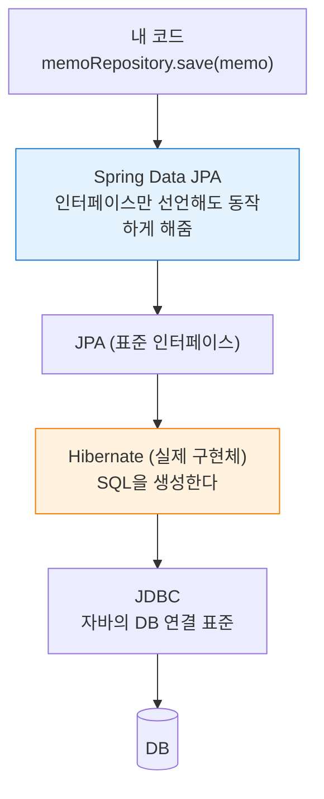
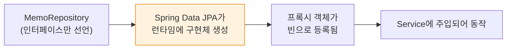
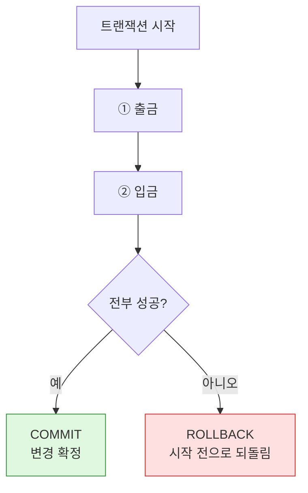
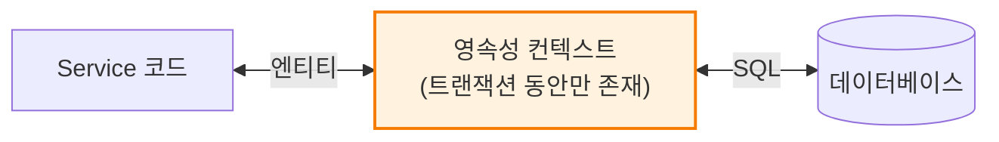
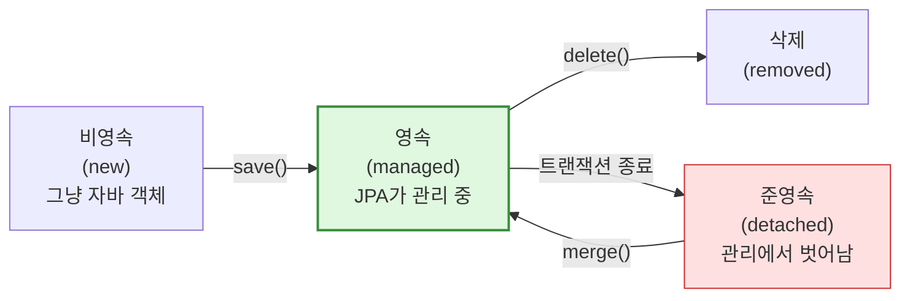
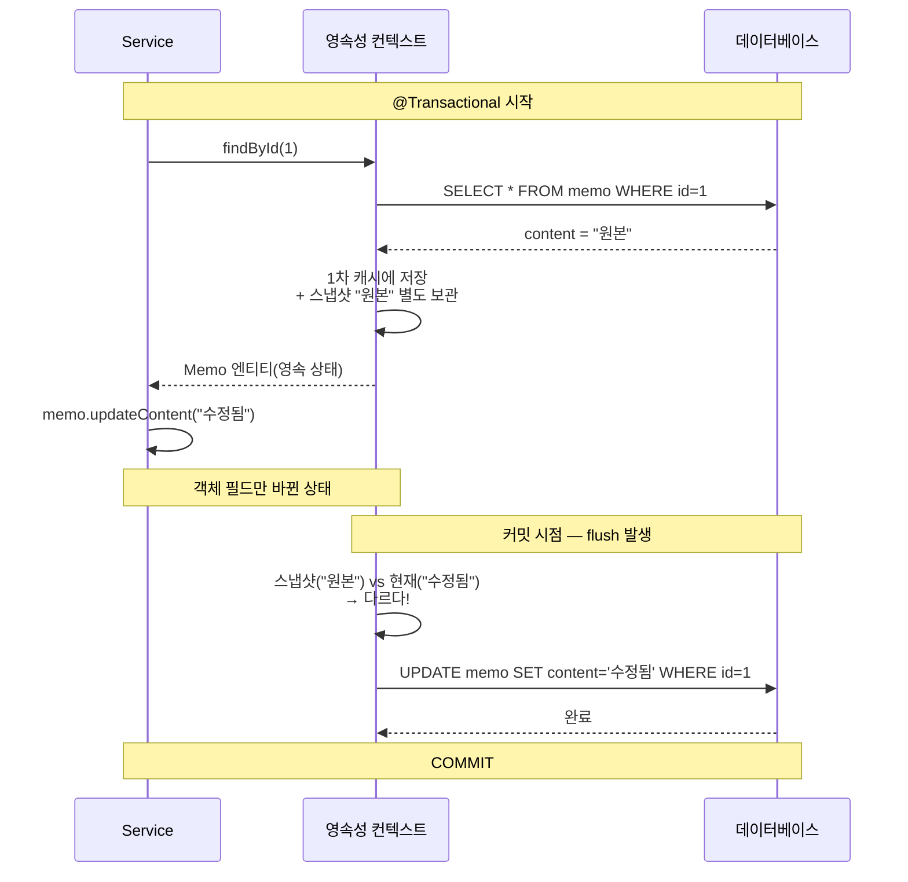
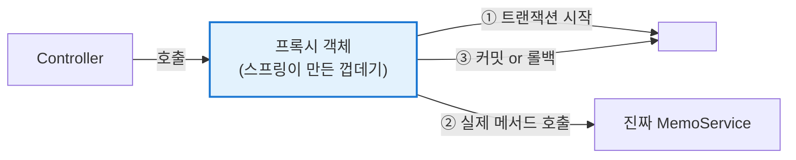
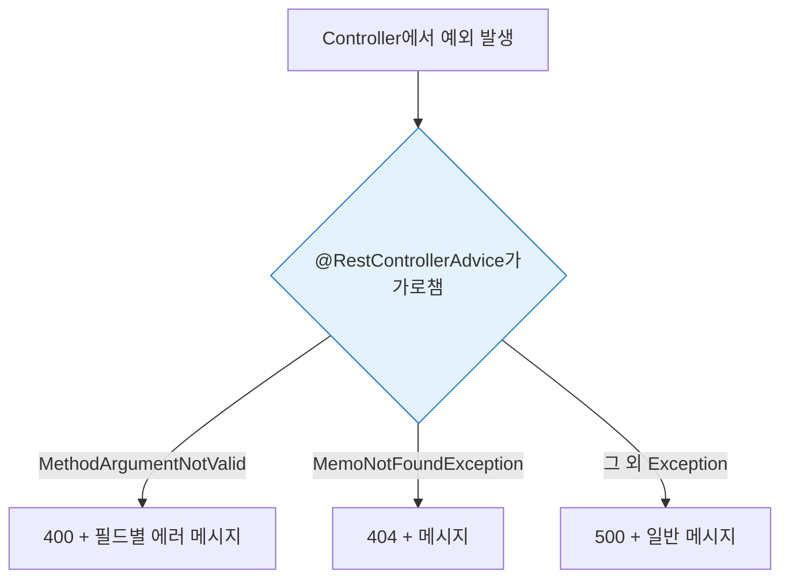
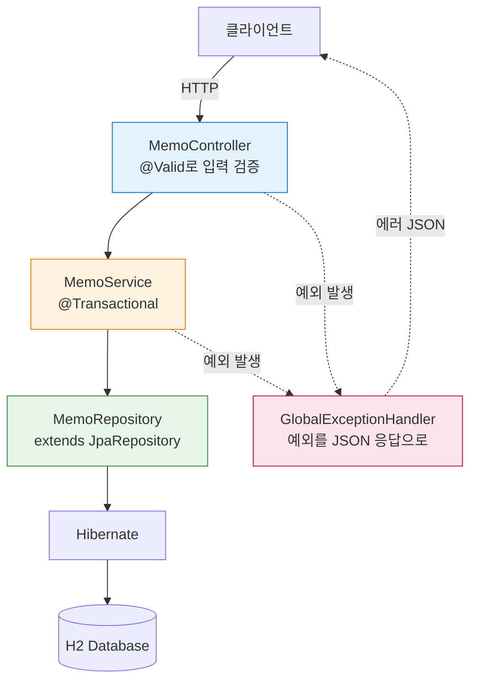
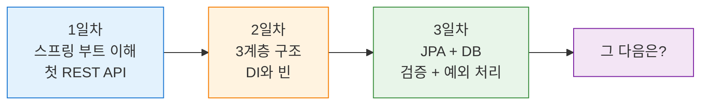

## 오늘 배울 것

| 순서 | 내용 |
|---|---|
| 1 | ORM과 JPA가 뭔지 |
| 2 | H2 데이터베이스 붙이기 |
| 3 | 엔티티 만들기 |
| 4 | JpaRepository — 코드 없이 CRUD |
| 5 | 쿼리 메서드로 조회 조건 만들기 |
| 6 | 트랜잭션, 영속성 컨텍스트, 변경 감지 |
| 7 | 입력값 검증 |
| 8 | 전역 예외 처리 |
| 9 | 완성된 코드 전체 |

---

## 1. JPA가 뭔데?

### 1-1. 먼저 ORM이란?

자바 세계와 DB 세계는 **데이터를 표현하는 방식이 다르다.**

- 자바는 **객체**로 생각한다. 참조를 타고 다른 객체로 이동하고, 상속이 있고, 값을 품고 있다.
- DB는 **테이블**로 생각한다. 행과 열이 있고, 외래 키로 연결하고, 상속 같은 건 없다.

그래서 자바 객체를 DB에 넣으려면 매번 **번역**을 해야 한다. 객체의 필드를 하나씩 꺼내서 컬럼에 넣고, 다시 꺼낼 때는 컬럼을 하나씩 읽어서 객체를 조립한다. 이 지루한 번역 작업이 개발 시간의 상당 부분을 잡아먹는다. 이 차이를 어려운 말로 **패러다임 불일치**라고 부른다.

**ORM(Object-Relational Mapping)** 은 이 번역을 자동화하는 기술이다. "이 클래스는 이 테이블이고, 이 필드는 이 컬럼이다"라고 한 번만 알려주면, 그다음부터는 알아서 변환해준다.

### 1-2. JPA, Hibernate, Spring Data JPA — 이름이 왜 이렇게 많나

셋이 자꾸 같이 나와서 헷갈리는데, **층이 다르다.**

| 이름 | 정체 | 비유 |
|---|---|---|
| **JPA** | 자바의 ORM **표준 규격**(인터페이스 모음). 실행 코드는 없다 | 콘센트 규격 |
| **Hibernate** | JPA를 실제로 **구현한 라이브러리**. 진짜 일하는 놈 | 규격에 맞게 만든 실제 콘센트 |
| **Spring Data JPA** | JPA를 더 편하게 쓰게 해주는 스프링의 **추가 포장** | 멀티탭 |



우리가 앞으로 만질 건 대부분 맨 위 두 층이다. 아래는 알아서 돌아간다.

> 표준을 따로 둔 이유는 **구현체를 갈아끼울 수 있게** 하기 위해서다. 실무에서는 사실상 Hibernate만 쓰지만, 우리 코드는 JPA 표준에만 의존하므로 이론상 다른 구현체로 바꿔도 된다. 2일차에 배운 "인터페이스에 의존하라"가 프레임워크 규모로 적용된 사례다.

### 1-3. 안 쓰면 어떻게 되나

JDBC로 직접 짜면 이렇다.

```java
String sql = "INSERT INTO memo (content, created_at) VALUES (?, ?)";
try (Connection conn = dataSource.getConnection();
     PreparedStatement ps = conn.prepareStatement(sql)) {
    ps.setString(1, memo.getContent());
    ps.setTimestamp(2, Timestamp.valueOf(memo.getCreatedAt()));
    ps.executeUpdate();
} catch (SQLException e) {
    throw new RuntimeException(e);
}
```

JPA를 쓰면 이렇다.

```java
memoRepository.save(memo);
```

여기서 `title` 컬럼을 하나 추가한다고 해보자. JDBC 방식은 INSERT, UPDATE, SELECT 문을 전부 찾아서 고치고, 결과를 객체로 매핑하는 코드도 고쳐야 한다. JPA는 **엔티티 클래스에 필드 하나 추가하면 끝이다.**

| 구분 | JDBC / MyBatis | JPA |
|---|---|---|
| SQL 작성 | 직접 쓴다 | 대부분 자동 생성 |
| 컬럼 추가 시 | 관련 SQL 전부 수정 | 필드만 추가 |
| SQL 통제력 | 완전히 통제 가능 | 생성된 SQL을 직접 봐야 함 |
| 복잡한 통계 쿼리 | 유리하다 | 불리할 수 있다 (QueryDSL 등으로 보완) |
| 학습 난이도 | 낮다 | 높다 |

> JPA가 만능은 아니다. **편한 대신 무슨 SQL이 나가는지 눈에 안 보인다는 게 가장 큰 대가다.** 그래서 `show-sql` 설정을 켜두고 실제로 어떤 쿼리가 나가는지 확인하는 습관이 중요하다. 복잡한 조회는 여전히 SQL이 편할 때가 있고, 실무에서는 JPA와 MyBatis를 섞어 쓰는 경우도 많다.

---

## 2. H2 데이터베이스 붙이기

### 2-1. 의존성 추가

`build.gradle`에 두 줄을 넣는다.

```groovy
dependencies {
    implementation 'org.springframework.boot:spring-boot-starter-web'
    implementation 'org.springframework.boot:spring-boot-starter-data-jpa'   // 추가
    implementation 'org.springframework.boot:spring-boot-starter-validation' // 추가

    runtimeOnly 'com.h2database:h2'   // 추가

    compileOnly 'org.projectlombok:lombok'
    annotationProcessor 'org.projectlombok:lombok'
    testImplementation 'org.springframework.boot:spring-boot-starter-test'
}
```

**H2**는 자바로 만들어진 가벼운 DB다. 설치가 필요 없고 메모리에서 돌아서 학습용으로 딱 좋다.

### 2-2. 설정

```yaml
# application.yml
spring:
  datasource:
    url: jdbc:h2:mem:memodb          # 메모리 모드
    driver-class-name: org.h2.Driver
    username: sa
    password:

  h2:
    console:
      enabled: true                   # 웹으로 DB 들여다보기
      path: /h2-console

  jpa:
    hibernate:
      ddl-auto: create-drop           # 시작할 때 테이블 생성, 끌 때 삭제
    properties:
      hibernate:
        format_sql: true
    show-sql: true                    # 실행되는 SQL을 콘솔에 출력
```

### `ddl-auto` 옵션 정리

| 값 | 동작 | 언제 쓰나 |
|---|---|---|
| `create` | 시작 시 테이블 삭제 후 재생성 | 로컬 개발 |
| `create-drop` | `create` + 종료 시 삭제 | 테스트 |
| `update` | 변경된 부분만 반영 | 로컬 개발 (주의해서) |
| `validate` | 엔티티와 테이블이 맞는지 검사만 | 운영 |
| `none` | 아무것도 안 함 | 운영 |

> ⚠️ **운영 환경에서 `create`나 `update`는 절대 쓰면 안 된다.** `create`는 데이터를 통째로 날려버린다. 운영은 `validate` 또는 `none`이다.

### 2-3. H2 콘솔 접속

서버를 켜고 `http://localhost:8080/h2-console` 로 들어간다. JDBC URL에 `jdbc:h2:mem:memodb`를 정확히 넣고 Connect를 누르면 테이블을 눈으로 볼 수 있다.

---

## 3. 엔티티 만들기

2일차의 `Memo` 클래스에 JPA 어노테이션을 붙인다.

```java
package com.example.demo.memo;

import jakarta.persistence.*;
import lombok.*;
import java.time.LocalDateTime;

@Entity
@Table(name = "memo")
@Getter
@NoArgsConstructor(access = AccessLevel.PROTECTED)
public class Memo {

    @Id
    @GeneratedValue(strategy = GenerationType.IDENTITY)
    private Long id;

    @Column(nullable = false, length = 500)
    private String content;

    @Column(nullable = false)
    private LocalDateTime createdAt;

    private LocalDateTime updatedAt;

    public Memo(String content) {
        this.content = content;
        this.createdAt = LocalDateTime.now();
    }

    public void updateContent(String content) {
        this.content = content;
        this.updatedAt = LocalDateTime.now();
    }
}
```

### 어노테이션 정리

| 어노테이션 | 의미 |
|---|---|
| `@Entity` | 이 클래스는 DB 테이블과 매핑된다 |
| `@Table(name=)` | 테이블 이름 지정 (생략하면 클래스명) |
| `@Id` | 기본 키(PK) |
| `@GeneratedValue` | PK 자동 생성 방식 |
| `@Column` | 컬럼 제약 조건 지정 |

### `@NoArgsConstructor(PROTECTED)`는 왜 붙이나

JPA는 DB에서 데이터를 꺼내 객체로 만들 때 **먼저 빈 객체를 만들고 나서 필드에 값을 채워 넣는 방식**으로 동작한다. 그래서 파라미터 없는 **기본 생성자가 반드시 있어야 한다.** 없으면 이런 에러가 난다.

```
No default constructor for entity : com.example.demo.memo.Memo
```

그렇다고 `public`으로 열어두면 곤란하다.

```java
Memo memo = new Memo();   // content도 createdAt도 없는 껍데기가 만들어진다
```

내용 없는 메모가 코드 아무 데서나 만들어질 수 있게 되는 것이다. 그래서 **JPA가 쓸 수 있는 최소 수준인 `protected`까지만** 열어둔다. JPA는 리플렉션으로 접근하니 `protected`로도 충분하고, 우리 코드에서는 `new Memo()`가 컴파일 에러로 막힌다. 결과적으로 **"내용 있는 메모만 만들 수 있다"** 는 규칙이 지켜진다.

> `import jakarta.persistence.*` 부분도 짚고 넘어가자. 예전 자료에는 `javax.persistence`로 되어 있는데, 오라클이 Jakarta EE로 이관되면서 패키지 이름이 통째로 바뀌었다. **스프링 부트 3.x부터는 `jakarta`가 맞다.** 옛날 블로그를 보고 따라 하다 `javax`를 import하면 어노테이션이 아예 인식되지 않으니 주의해야 한다.

### `@GeneratedValue` 전략

| 전략 | 설명 | DB |
|---|---|---|
| `IDENTITY` | DB의 auto increment에 위임 | MySQL, H2 |
| `SEQUENCE` | DB 시퀀스 사용 | Oracle, PostgreSQL |
| `AUTO` | DB에 맞게 자동 선택 | 기본값 |

`IDENTITY`는 **ID를 DB가 정해주기 때문에, `save()` 시점에 INSERT가 즉시 실행된다.** 뒤에 나올 "쓰기 지연"이 이 경우엔 적용되지 않는다. ID를 알아야 영속성 컨텍스트에 보관할 수 있는데, DB에 넣어보기 전엔 ID를 알 수 없기 때문이다.

---

## 4. JpaRepository — 코드 없이 CRUD

2일차에 손으로 짰던 `MemoRepository`를 통째로 지우고, 인터페이스 하나로 바꾼다.

```java
package com.example.demo.memo;

import org.springframework.data.jpa.repository.JpaRepository;

public interface MemoRepository extends JpaRepository<Memo, Long> {
}
```

**이게 끝이다.** 구현 클래스를 만들 필요가 없다. 스프링이 실행 시점에 구현체를 자동으로 만들어서 빈으로 등록해준다.

`JpaRepository<엔티티타입, PK타입>` 을 상속하면 이런 메서드를 공짜로 받는다.

| 메서드 | 하는 일 |
|---|---|
| `save(entity)` | 저장 또는 수정 |
| `findById(id)` | PK로 단건 조회 (`Optional` 반환) |
| `findAll()` | 전체 조회 |
| `findAll(Pageable)` | 페이징 조회 |
| `count()` | 전체 개수 |
| `delete(entity)` / `deleteById(id)` | 삭제 |
| `existsById(id)` | 존재 여부 |



### 구현 클래스가 없는데 어떻게 동작하나

처음 보면 납득이 잘 안 되는 부분이다. 인터페이스는 "무엇을 할 수 있다"는 선언일 뿐이고 실행할 코드가 없는데, 어떻게 `save()`가 동작할까?

답은 **스프링이 애플리케이션 시작 시점에 구현체를 직접 만들어낸다**는 것이다.

1. 시작할 때 `JpaRepository`를 상속한 인터페이스를 전부 찾는다
2. 자바의 **동적 프록시** 기능으로 그 인터페이스를 구현한 객체를 메모리에 생성한다
3. 기본 메서드(`save`, `findById` 등)는 이미 준비된 `SimpleJpaRepository`라는 클래스가 처리하도록 연결한다
4. 이름 규칙에 맞는 메서드(`findByContentContaining` 등)는 이름을 분석해서 쿼리를 만들어 연결한다
5. 완성된 객체를 빈으로 등록한다

우리가 못 볼 뿐 **실제 구현 객체는 메모리에 존재한다.** 확인해보고 싶으면 이렇게 찍어보면 된다.

```java
System.out.println(memoRepository.getClass());
// class jdk.proxy2.$Proxy123  ← 스프링이 만들어낸 프록시
```

### `save()`는 INSERT일까 UPDATE일까

`save()` 하나가 저장과 수정을 다 한다고 했는데, 판단 기준은 **엔티티의 ID가 있는지 없는지**다.

```java
Memo memo = new Memo("내용");   // id == null
memoRepository.save(memo);      // → INSERT

Memo found = memoRepository.findById(1L).get();   // id == 1
found.updateContent("수정");
memoRepository.save(found);     // → UPDATE (사실 save 없어도 된다. 6장에서 설명)
```

ID가 `null`이면 새 데이터로 보고 INSERT, 값이 있으면 기존 데이터로 보고 병합한다. 그래서 엔티티에 `@GeneratedValue`를 붙여 ID를 DB가 채우게 하는 게 중요하다.

---

## 5. 쿼리 메서드

기본 메서드로 부족하면 **메서드 이름만 규칙에 맞게 지으면** 스프링이 쿼리를 만들어준다.

```java
public interface MemoRepository extends JpaRepository<Memo, Long> {

    // SELECT * FROM memo WHERE content LIKE '%키워드%'
    List<Memo> findByContentContaining(String keyword);

    // SELECT * FROM memo WHERE created_at > ? ORDER BY created_at DESC
    List<Memo> findByCreatedAtAfterOrderByCreatedAtDesc(LocalDateTime dateTime);

    // SELECT COUNT(*) FROM memo WHERE content LIKE '%키워드%'
    long countByContentContaining(String keyword);
}
```

### 키워드 규칙

| 키워드 | 예시 | 생성되는 조건 |
|---|---|---|
| `findBy` | `findByContent` | `WHERE content = ?` |
| `Containing` | `findByContentContaining` | `WHERE content LIKE %?%` |
| `StartingWith` | `findByContentStartingWith` | `WHERE content LIKE ?%` |
| `And` / `Or` | `findByContentAndId` | `WHERE content = ? AND id = ?` |
| `GreaterThan` / `After` | `findByCreatedAtAfter` | `WHERE created_at > ?` |
| `OrderBy...Desc` | `findAllByOrderByIdDesc` | `ORDER BY id DESC` |
| `Top` / `First` | `findTop5ByOrderByIdDesc` | `LIMIT 5` |

이름이 너무 길어지면 직접 쿼리를 써도 된다.

```java
@Query("SELECT m FROM Memo m WHERE m.content LIKE %:keyword% ORDER BY m.createdAt DESC")
List<Memo> searchByKeyword(@Param("keyword") String keyword);
```

---

## 6. 트랜잭션과 영속성 컨텍스트

여기가 3일차에서 제일 어려운 부분이다. 대신 여길 이해하면 JPA에서 벌어지는 "이상한 일"의 90%가 설명된다.

### 6-1. 트랜잭션이 뭔데?

**여러 개의 DB 작업을 하나의 덩어리로 묶는 것**이다. 덩어리 안의 작업은 **전부 성공하거나, 전부 실패해야** 한다.

교과서에 늘 나오는 계좌이체 예시가 제일 명확하다.

```java
public void transfer(Long fromId, Long toId, int amount) {
    accountRepository.withdraw(fromId, amount);   // ① A에서 1만원 출금
    // 💥 여기서 서버가 죽으면?
    accountRepository.deposit(toId, amount);      // ② B에 1만원 입금
}
```

①만 실행되고 ②가 실패하면 **돈이 공중으로 증발한다.** 이건 어떤 버그보다도 치명적이다.

트랜잭션으로 묶으면 ②가 실패했을 때 ①까지 **없던 일로 되돌린다.** 이걸 **롤백(rollback)** 이라고 하고, 반대로 전부 성공해서 확정하는 걸 **커밋(commit)** 이라고 한다.



`@Transactional`을 메서드에 붙이면 스프링이 **메서드 시작 시 트랜잭션을 열고, 정상 종료되면 커밋, 예외가 터지면 롤백**을 자동으로 해준다. 우리가 `commit()`, `rollback()`을 직접 쓸 일이 없다.

```java
@Service
@RequiredArgsConstructor
@Transactional(readOnly = true)   // 클래스 전체의 기본값: 읽기 전용
public class MemoService {

    private final MemoRepository memoRepository;

    @Transactional               // 쓰기 작업엔 따로 붙여서 덮어쓴다
    public MemoResponse create(MemoCreateRequest request) { ... }

    public List<MemoResponse> findAll() { ... }   // 클래스 기본값(readOnly) 적용
}
```

**왜 조회는 `readOnly = true`인가?** 뒤에 나올 변경 감지 때문이다. JPA는 수정을 감지하려고 조회한 엔티티의 복사본을 따로 보관하는데, 조회만 할 거라면 이 복사본이 낭비다. `readOnly`를 켜면 이걸 건너뛰어서 메모리와 CPU를 아낀다. 덤으로 "이 메서드는 데이터를 안 바꾼다"는 의도가 코드에 드러난다.

> ⚠️ **롤백 규칙 주의**: 스프링은 기본적으로 `RuntimeException`(과 `Error`)에서만 롤백한다. `IOException` 같은 체크 예외는 **롤백하지 않고 그냥 커밋한다.** 체크 예외에서도 롤백하려면 `@Transactional(rollbackFor = Exception.class)`를 붙여야 한다. 모르고 지나가면 데이터가 반쯤 저장되는 사고가 난다.

### 6-2. 영속성 컨텍스트 — JPA의 작업 공간

JPA를 쓰면 우리 코드와 DB 사이에 **중간 보관소**가 하나 생긴다. 이걸 **영속성 컨텍스트(Persistence Context)** 라고 한다. `EntityManager`가 관리하는 공간이고, 대략 **트랜잭션 하나당 하나씩** 만들어졌다 사라진다.



"왜 굳이 중간에 뭘 끼우지?" 싶은데, 이게 있어서 얻는 게 세 가지다.

**① 1차 캐시 — 같은 걸 두 번 조회해도 SQL은 한 번**

```java
@Transactional
public void example() {
    Memo a = memoRepository.findById(1L).get();   // SELECT 실행
    Memo b = memoRepository.findById(1L).get();   // SQL 안 나간다. 캐시에서 꺼냄
    System.out.println(a == b);                   // true — 완전히 같은 객체다
}
```

`a == b`가 `true`라는 게 중요하다. 같은 트랜잭션 안에서 같은 ID로 조회하면 **항상 동일한 객체**가 나온다. 덕분에 한쪽에서 값을 바꾸면 다른 쪽에도 반영되어 있다.

**② 쓰기 지연 — SQL을 모아뒀다 한 번에**

`save()`를 호출해도 SQL이 그 자리에서 나가지 않는다. 일단 쌓아두고 커밋 시점에 몰아서 보낸다. DB 왕복 횟수를 줄이기 위해서다.

**③ 변경 감지** — 아래에서 자세히 본다.

### 6-3. 엔티티의 네 가지 상태

영속성 컨텍스트가 이 엔티티를 관리하고 있는지 아닌지에 따라 상태가 나뉜다. **JPA가 "왜 저장이 안 되지?" 할 때 대부분 이 상태 문제다.**



| 상태 | 설명 | 값을 바꾸면 |
|---|---|---|
| **비영속** | `new Memo("내용")` 한 직후. JPA가 존재를 모름 | 아무 일 없음 |
| **영속** | `save()` 했거나 `findById()`로 꺼낸 상태 | **자동으로 UPDATE 됨** |
| **준영속** | 트랜잭션이 끝나서 관리 대상에서 빠진 상태 | 아무 일 없음 |
| **삭제** | `delete()` 호출됨. 커밋 시 DELETE | — |

핵심은 **"영속 상태일 때만 JPA가 신경 쓴다"** 는 것이다.

### 6-4. 변경 감지 (Dirty Checking)

이제 JPA에서 제일 신기해 보이는 기능을 볼 수 있다. **트랜잭션 안에서 조회한 엔티티의 값을 바꾸면, `save()`를 호출하지 않아도 UPDATE가 나간다.**

```java
@Transactional
public MemoResponse update(Long id, MemoUpdateRequest request) {
    Memo memo = memoRepository.findById(id)          // 영속 상태가 됨
            .orElseThrow(() -> new MemoNotFoundException(id));

    memo.updateContent(request.content());           // 값만 바꿈

    // save() 호출이 없다. 그런데도 UPDATE 된다.
    return MemoResponse.from(memo);
}
```

마법이 아니라 **복사본 비교**다. 영속성 컨텍스트는 엔티티를 조회할 때 그 시점의 값을 **스냅샷**으로 따로 저장해둔다. 그리고 커밋 직전에 스냅샷과 현재 값을 하나씩 비교해서, 달라진 게 있으면 UPDATE 쿼리를 만든다.



**동작 조건을 정리하면**

| 조건 | 이유 |
|---|---|
| 트랜잭션 안이어야 한다 | 커밋 시점이 있어야 비교가 일어난다 |
| 영속 상태 엔티티여야 한다 | `new`로 만든 객체는 스냅샷이 없다 |
| 엔티티 자체를 바꿔야 한다 | DTO를 바꿔봐야 아무 일도 안 생긴다 |

컨트롤러에서 받은 엔티티를 그냥 수정해도 저장이 안 되는 이유가 여기 있다. 그건 **준영속 상태**라서 JPA가 관심을 두지 않는다.

### 6-5. `@Transactional`이 동작하는 원리와 함정

`@Transactional`은 **프록시**로 동작한다. 스프링이 우리 서비스 클래스를 감싼 가짜 객체를 만들어서, 메서드 호출 전후에 트랜잭션 시작·커밋 코드를 끼워 넣는 방식이다.



여기서 초보자가 반드시 한 번은 당하는 함정이 있다. **같은 클래스 안에서 자기 메서드를 호출하면 `@Transactional`이 안 먹는다.**

```java
@Service
public class MemoService {

    public void outer() {
        inner();          // ⚠️ 프록시를 안 거치고 직접 호출된다 → 트랜잭션 없음
    }

    @Transactional
    public void inner() { ... }
}
```

`outer()`가 `inner()`를 부를 때는 프록시를 거치지 않고 자기 자신을 바로 호출하기 때문에, 트랜잭션을 걸어주는 코드가 실행될 기회가 없다. **해결책은 `inner()`를 별도 빈으로 분리하는 것**이다.

같은 이유로 `@Transactional`은 **`public` 메서드에만 적용된다.** `private` 메서드에 붙여도 조용히 무시되니 주의해야 한다.

---

## 7. 입력값 검증

내용이 비어있는 메모가 저장되면 안 된다. 이걸 매번 `if`로 검사하는 대신 어노테이션으로 처리한다.

### 7-1. DTO에 검증 규칙 달기

```java
package com.example.demo.memo.dto;

import jakarta.validation.constraints.*;

public record MemoCreateRequest(

        @NotBlank(message = "내용은 비어있을 수 없다")
        @Size(max = 500, message = "내용은 500자를 넘을 수 없다")
        String content
) {}
```

### 7-2. 컨트롤러에 `@Valid` 붙이기

```java
@PostMapping
public ResponseEntity<MemoResponse> create(@Valid @RequestBody MemoCreateRequest request) {
    return ResponseEntity.status(HttpStatus.CREATED).body(memoService.create(request));
}
```

`@Valid`가 없으면 검증 어노테이션은 그냥 무시된다. **둘은 세트다.**

### 자주 쓰는 검증 어노테이션

| 어노테이션 | 검사 내용 |
|---|---|
| `@NotNull` | null이 아님 |
| `@NotEmpty` | null 아니고 길이 > 0 |
| `@NotBlank` | null 아니고 공백만 있으면 안 됨 (문자열 전용) |
| `@Size(min=, max=)` | 길이 범위 |
| `@Min` / `@Max` | 숫자 범위 |
| `@Email` | 이메일 형식 |
| `@Pattern(regexp=)` | 정규식 |
| `@Positive` | 양수 |

> 문자열엔 `@NotBlank`를 쓴다. `@NotEmpty`는 `" "`(공백 한 칸)를 통과시켜버린다.

---

## 8. 전역 예외 처리

검증에 실패하면 지금은 이런 응답이 나간다.

```json
{ "timestamp": "...", "status": 400, "error": "Bad Request", "path": "/api/memos" }
```

뭐가 잘못됐는지 클라이언트가 알 수 없다. 응답 형태를 우리가 정한다.

### 8-1. 커스텀 예외

```java
package com.example.demo.common;

public class MemoNotFoundException extends RuntimeException {
    public MemoNotFoundException(Long id) {
        super("메모를 찾을 수 없다. id=" + id);
    }
}
```

### 8-2. 응답 형식

```java
package com.example.demo.common;

import java.time.LocalDateTime;
import java.util.Map;

public record ErrorResponse(
        LocalDateTime timestamp,
        int status,
        String message,
        Map<String, String> fieldErrors
) {
    public static ErrorResponse of(int status, String message) {
        return new ErrorResponse(LocalDateTime.now(), status, message, null);
    }

    public static ErrorResponse of(int status, String message, Map<String, String> fieldErrors) {
        return new ErrorResponse(LocalDateTime.now(), status, message, fieldErrors);
    }
}
```

### 8-3. `@RestControllerAdvice`

```java
package com.example.demo.common;

import org.springframework.http.*;
import org.springframework.web.bind.MethodArgumentNotValidException;
import org.springframework.web.bind.annotation.*;
import java.util.*;

@RestControllerAdvice
public class GlobalExceptionHandler {

    // 검증 실패
    @ExceptionHandler(MethodArgumentNotValidException.class)
    public ResponseEntity<ErrorResponse> handleValidation(MethodArgumentNotValidException e) {
        Map<String, String> errors = new HashMap<>();
        e.getBindingResult().getFieldErrors()
                .forEach(error -> errors.put(error.getField(), error.getDefaultMessage()));

        return ResponseEntity.badRequest()
                .body(ErrorResponse.of(400, "입력값이 올바르지 않다", errors));
    }

    // 메모 없음
    @ExceptionHandler(MemoNotFoundException.class)
    public ResponseEntity<ErrorResponse> handleNotFound(MemoNotFoundException e) {
        return ResponseEntity.status(HttpStatus.NOT_FOUND)
                .body(ErrorResponse.of(404, e.getMessage()));
    }

    // 나머지 전부
    @ExceptionHandler(Exception.class)
    public ResponseEntity<ErrorResponse> handleAll(Exception e) {
        return ResponseEntity.internalServerError()
                .body(ErrorResponse.of(500, "서버 내부 오류가 발생했다"));
    }
}
```



이제 빈 내용으로 요청하면 이런 응답이 온다.

```json
{
  "timestamp": "2026-08-05T14:30:00",
  "status": 400,
  "message": "입력값이 올바르지 않다",
  "fieldErrors": {
    "content": "내용은 비어있을 수 없다"
  }
}
```

> 마지막 `Exception` 핸들러에서 예외 내용을 그대로 응답에 넣으면 내부 구조가 노출된다. **로그에는 자세히 남기고, 응답에는 일반적인 메시지만** 내보내는 게 안전하다.

---

## 9. 완성된 코드

### Service

```java
package com.example.demo.memo;

import com.example.demo.common.MemoNotFoundException;
import com.example.demo.memo.dto.*;
import lombok.RequiredArgsConstructor;
import org.springframework.stereotype.Service;
import org.springframework.transaction.annotation.Transactional;
import java.util.List;

@Service
@RequiredArgsConstructor
@Transactional(readOnly = true)
public class MemoService {

    private final MemoRepository memoRepository;

    @Transactional
    public MemoResponse create(MemoCreateRequest request) {
        Memo saved = memoRepository.save(new Memo(request.content()));
        return MemoResponse.from(saved);
    }

    public List<MemoResponse> findAll() {
        return memoRepository.findAll().stream()
                .map(MemoResponse::from)
                .toList();
    }

    public MemoResponse findById(Long id) {
        return MemoResponse.from(getMemoOrThrow(id));
    }

    public List<MemoResponse> search(String keyword) {
        return memoRepository.findByContentContaining(keyword).stream()
                .map(MemoResponse::from)
                .toList();
    }

    @Transactional
    public MemoResponse update(Long id, MemoUpdateRequest request) {
        Memo memo = getMemoOrThrow(id);
        memo.updateContent(request.content());   // 변경 감지로 UPDATE
        return MemoResponse.from(memo);
    }

    @Transactional
    public void delete(Long id) {
        Memo memo = getMemoOrThrow(id);
        memoRepository.delete(memo);
    }

    private Memo getMemoOrThrow(Long id) {
        return memoRepository.findById(id)
                .orElseThrow(() -> new MemoNotFoundException(id));
    }
}
```

### Controller

```java
package com.example.demo.memo;

import com.example.demo.memo.dto.*;
import jakarta.validation.Valid;
import lombok.RequiredArgsConstructor;
import org.springframework.http.*;
import org.springframework.web.bind.annotation.*;
import java.util.List;

@RestController
@RequestMapping("/api/memos")
@RequiredArgsConstructor
public class MemoController {

    private final MemoService memoService;

    @PostMapping
    public ResponseEntity<MemoResponse> create(@Valid @RequestBody MemoCreateRequest request) {
        return ResponseEntity.status(HttpStatus.CREATED).body(memoService.create(request));
    }

    @GetMapping
    public List<MemoResponse> findAll(@RequestParam(required = false) String keyword) {
        return (keyword == null) ? memoService.findAll() : memoService.search(keyword);
    }

    @GetMapping("/{id}")
    public MemoResponse findOne(@PathVariable Long id) {
        return memoService.findById(id);
    }

    @PutMapping("/{id}")
    public MemoResponse update(@PathVariable Long id,
                               @Valid @RequestBody MemoUpdateRequest request) {
        return memoService.update(id, request);
    }

    @DeleteMapping("/{id}")
    public ResponseEntity<Void> delete(@PathVariable Long id) {
        memoService.delete(id);
        return ResponseEntity.noContent().build();
    }
}
```

### API 명세

| 메서드 | 경로 | 설명 | 성공 상태 |
|---|---|---|---|
| POST | `/api/memos` | 메모 생성 | 201 |
| GET | `/api/memos` | 전체 조회 | 200 |
| GET | `/api/memos?keyword=값` | 검색 | 200 |
| GET | `/api/memos/{id}` | 단건 조회 | 200 |
| PUT | `/api/memos/{id}` | 수정 | 200 |
| DELETE | `/api/memos/{id}` | 삭제 | 204 |

### 최종 구조



### 동작 확인

```bash
# 생성
curl -X POST http://localhost:8080/api/memos \
  -H "Content-Type: application/json" \
  -d '{"content":"JPA 공부 끝"}'

# 검증 실패 확인
curl -X POST http://localhost:8080/api/memos \
  -H "Content-Type: application/json" \
  -d '{"content":"  "}'

# 없는 메모 조회 → 404
curl http://localhost:8080/api/memos/999

# 검색
curl "http://localhost:8080/api/memos?keyword=JPA"
```

---

## 10. 3일 총정리



| 일차 | 핵심 키워드 |
|---|---|
| 1일차 | 자동 설정, 스타터, 내장 톰캣, `@RestController`, DispatcherServlet |
| 2일차 | 3계층, IoC/DI, 빈, 싱글톤, 생성자 주입, DTO, 프로파일 |
| 3일차 | JPA, 엔티티, `JpaRepository`, 쿼리 메서드, 트랜잭션, 변경 감지, `@Valid`, `@RestControllerAdvice` |

---

## 오늘의 과제

1. `Memo`에 `title` 필드를 추가하고, 제목으로도 검색되게 만들어본다.
2. 조회 API에 **페이징**을 붙여본다. 힌트: `findAll(Pageable pageable)` 과 `?page=0&size=10`
3. `@SpringBootTest`로 메모 생성 → 조회 통합 테스트를 하나 짜본다.
4. H2 대신 MySQL로 바꿔보고, 프로파일로 로컬/운영 설정을 분리해본다.

## 여기서 더 나아가려면

| 주제 | 왜 필요한가 |
|---|---|
| 연관관계 매핑 (`@OneToMany`, `@ManyToOne`) | 테이블이 하나뿐인 서비스는 없다 |
| N+1 문제와 페치 조인 | JPA를 쓰면 반드시 만나는 성능 함정이다 |
| Spring Security + JWT | 로그인과 권한 처리 |
| 테스트 코드 (`@WebMvcTest`, `@DataJpaTest`) | 계층별로 빠르게 검증하기 |
| Swagger (springdoc-openapi) | API 문서 자동 생성 |
| QueryDSL | 복잡한 동적 쿼리를 타입 안전하게 |

