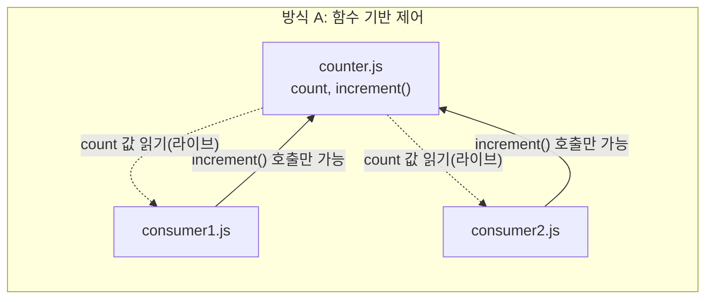
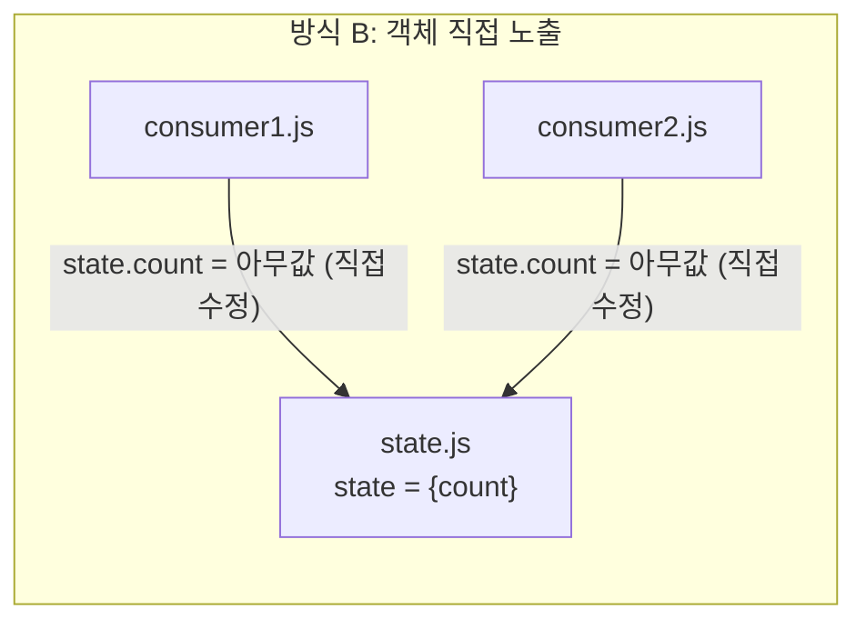

자바스크립트 ES 모듈(ESM)은 `export`한 변수에 대해 **라이브 바인딩(Live Binding)** 을 지원한다. 모듈 내부에서 값이 바뀌면, 그 값을 가져다 쓰는(import) 쪽에서도 자동으로 최신 값이 반영된다는 뜻이다.

이 특성을 이용하면 상태를 관리하는 방식이 두 갈래로 나뉜다.

- **방식 A**: 기초 타입(primitive) + 값을 바꾸는 함수를 함께 export
- **방식 B**: 참조 타입(객체)을 통째로 export

두 방식은 겉보기엔 사소한 차이 같지만, 실무에서의 안정성은 꽤 크게 갈린다. 코드로 직접 확인하면서 비교해본다.

## 1. 코드 구조 비교

### 방식 A: 기초 타입 + 변경 함수

```javascript
// counter.js
export let count = 0;

export function increment() {
  count++; // 모듈 내부에서 변경 → 라이브 바인딩으로 외부에도 즉시 반영
}
```

### 방식 B: 참조 타입(객체)

```javascript
// counter.js
export const state = {
  count: 0
};
```

## 2. 실제로 어떻게 동작하는지 검증

말로만 설명하면 와닿지 않으니, Node.js에서 직접 실행해본 결과를 보여준다.

### 방식 A - 외부에서 직접 값을 바꾸려고 하면?

```javascript
// main.js
import { count, increment } from './counter.js';

console.log(count); // 0
increment();
increment();
console.log(count); // 2 (라이브 바인딩으로 자동 반영됨)

count = 100; // ⚠ 여기서 에러 발생
```

실행 결과:

```
TypeError: Assignment to constant variable.
```

import한 바인딩은 마치 `const`처럼 취급되어, **재할당 자체가 언어 차원에서 막힌다.** 원문에서 "에러(Read-only)가 발생한다"고 한 부분은 정확한 설명이다. 다만 정확한 에러 타입까지 짚자면 `TypeError`이고, 메시지는 V8 엔진 기준 `Assignment to constant variable.`이다.

### 방식 B - 객체는 어떻게 되나?

```javascript
// main.js
import { state } from './state.js';

state.count = 9999; // 에러 없이 그대로 통과됨
console.log(state.count); // 9999
```

`const state = {...}`는 `state`라는 **바인딩 자체**는 재할당할 수 없지만(`state = 다른객체`는 에러), 객체의 **속성**을 바꾸는 건 막지 않는다. 
그래서 `state.count = 9999`처럼 내부 값을 마음대로 조작하는 게 가능하다. 이게 방식 B의 가장 큰 약점이다.


## 3. 원문에서 짚고 넘어갈 부분: "구조 분해 할당" 표현 정정

원문에는 이런 내용이 있었다.

> "`import { count }`로 가져온 뒤 `let myCount = count`처럼 다른 변수에 할당해 버리면 라이브 바인딩 연결이 끊어진다"

이 현상 자체는 맞는 설명이지만, **"구조 분해 할당(Destructuring) 때문에 끊기는 것"이라는 뉘앙스는 정확하지 않다.**

- `import { count } from './counter.js'`의 `{ count }` 문법은 객체 구조 분해처럼 *생겼지만*, 실제로는 구조 분해가 아니라 ESM 고유의 **named import 문법**이다. 이 상태에서 `count`는 여전히 라이브 바인딩을 유지한다.
- 연결이 끊어지는 진짜 원인은 그 다음 줄, `let myCount = count`다. 이 시점에 `count`의 **현재 값(숫자)**이 `myCount`라는 새 변수에 복사된다.
- 숫자는 원시 타입(primitive)이라 값 자체가 복사되고, 두 변수는 이후 완전히 독립적으로 움직인다.

즉, 원인은 "구조 분해"가 아니라 **"원시 값은 복사되지, 참조가 공유되지 않는다"**는 자바스크립트의 기본 값 전달 방식(pass-by-value) 때문이다. 검증 결과도 이를 뒷받침한다.

```
increment() 추가 호출 후 count: 3 / myCount(복사된 값): 2
```

`count`는 계속 갱신되지만 `myCount`는 복사되던 순간의 값에 멈춰 있다. 이 부분은 구조 분해 할당의 문제가 아니라 **원시 타입을 다른 변수에 옮겨 담는 순간 발생하는 자연스러운 현상**으로 이해하는 게 정확하다.

## 4. 장단점 비교

### 방식 A: 기초 타입 + 함수 (`increment()`)

**장점**
- **캡슐화**: 외부에서 `count = 100`처럼 직접 수정하면 `TypeError`가 발생한다. 오직 `increment()`를 통해서만 값이 바뀌므로 통제권이 모듈 내부에 남는다.
- **추적 용이성**: 값이 언제 바뀌는지 알고 싶다면 `increment()` 함수 안에 로그 한 줄만 추가하면 된다.

**단점**
- 라이브 바인딩 개념을 모르면 "기초 타입인데 왜 다른 파일 값이 바뀌지?" 하고 헷갈릴 수 있다.
- 앞서 확인했듯, 값을 다른 변수에 복사해서 저장하면(`let myCount = count`) 그 순간부터 연동이 끊긴다.

### 방식 B: 참조 타입(객체)

**장점**
- 자바스크립트의 기본 객체 참조 원리 그대로라, 라이브 바인딩 개념을 몰라도 직관적으로 이해된다.
- `{ count: 0, name: 'counter', isLoading: false }`처럼 여러 상태를 하나로 묶어 전달하기 편하다.

**단점**
- **상태 오염 위험**: import한 곳 어디서든 `state.count = 9999`처럼 값을 마음대로 조작할 수 있다 (위 실행 결과로 확인됨).
- **추적 어려움**: 어느 파일의 몇 번째 줄에서 값을 바꿨는지 추적하기 힘들어진다. 사이드 이펙트 관리가 사실상 불가능해진다.

## 5. 한눈에 보는 비교표

| 비교 항목 | 방식 A: 기초 타입 + 함수 | 방식 B: 참조 타입 객체 |
|---|---|---|
| 외부에서 직접 수정 | ❌︎ 불가능 (`TypeError` 발생) | 🞇 가능 (통제 불가) |
| 데이터 수정 통제권 | 모듈 내부가 소유 | 외부 어디서든 가능 |
| 디버깅 / 추적 | 🟢 쉬움 (함수 내부만 확인) | 🔴 어려움 (전체 파일 검색 필요) |
| 값 복사 시 연동 | 끊김 (원시 타입 복사) | 유지됨 (객체 참조 공유) |
| 동작 원리 | ESM Live Binding | JS Object Reference |

## 6. 데이터 흐름으로 보면 더 명확하다

두 방식의 근본적인 차이는 "누가 상태를 바꿀 권한을 갖는가"이다. 아래 그림으로 비교해본다.





방식 A는 상태 변경이 `increment()`라는 **단일 관문**을 반드시 거치지만, 방식 B는 상태를 가진 쪽이 "문지기" 역할을 포기한 상태라 아무 소비자나 값을 바꿀 수 있다.

## 7. 그래도 객체를 쓰고 싶다면: 절충안

객체가 주는 편의성(여러 상태를 묶어서 다루기)은 포기하고 싶지 않지만 캡슐화도 지키고 싶다면, **읽기 전용 접근자(getter)와 변경 함수(setter/action)만 export**하는 절충안이 실무에서 널리 쓰인다.

```javascript
// state.js
const state = { count: 0, isLoading: false };

// 외부에는 값 자체가 아니라 "읽는 방법"만 공개
export const getCount = () => state.count;
export const getIsLoading = () => state.isLoading;

// 변경도 정해진 함수를 통해서만
export const increment = () => { state.count++; };
export const setLoading = (v) => { state.isLoading = v; };
```

이렇게 하면 `state` 객체 자체는 모듈 밖으로 노출되지 않으므로, 외부에서는 `getCount()`와 `increment()` 같은 공개된 인터페이스로만 상태에 접근할 수 있다. 객체의 장점(여러 상태 묶기)과 함수 방식의 장점(캡슐화)을 동시에 챙기는 셈이다.

Redux, Zustand, Vuex, Pinia 같은 상태 관리 라이브러리들이 "상태 변경은 반드시 지정된 함수(액션/디스패치)를 통해서만 일어난다"는 원칙을 강제하는 것도 결국 같은 이유다.

## 8. 결론

세 가지 패턴을 정리하면 이렇다.

1. **기초 타입 + 모듈 함수**: `let count = 0` + `export function increment()` — 가장 단순하고, ESM 라이브 바인딩만 이해하면 충분히 안전하다.
2. **객체 + Getter/Setter 메서드**: 여러 상태를 묶어야 할 때 객체의 편의성과 캡슐화를 동시에 챙기는 절충안.
3. **상태 관리 라이브러리(Redux, Zustand 등)**: 프로젝트 규모가 커지면 "상태 변경은 지정된 함수를 통해서만"이라는 원칙을 프레임워크 차원에서 강제해주는 선택지.

가장 안 좋은 패턴은 `export const state = { count: 0 }`처럼 객체를 그대로 내보내고, 외부에서 `state.count++`로 직접 건드리게 두는 것이다. 실행 결과에서 확인했듯 이 경우 아무런 제약 없이 상태가 오염될 수 있다. 
"단방향 데이터 흐름"과 "캡슐화"라는 소프트웨어 공학의 기본 원칙을 지키려면, 상태 변경은 항상 지정된 통로(함수)를 거치도록 설계하는 게 맞다.
