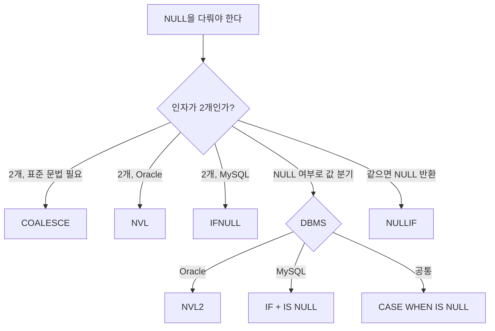
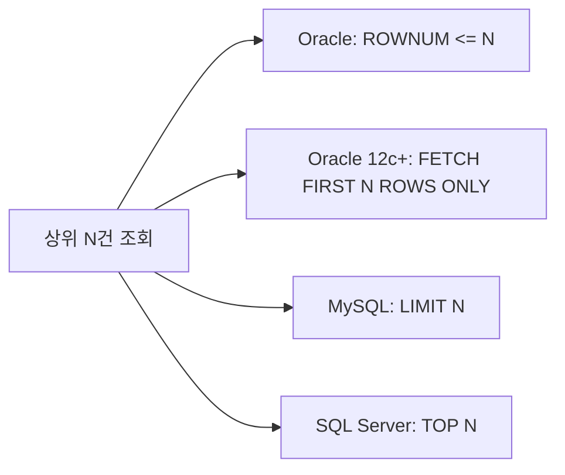
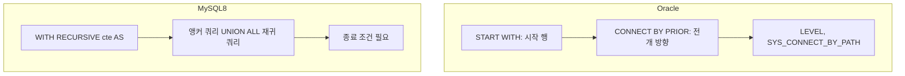

## 목차

1. [한눈에 보는 요약표](#1-한눈에-보는-요약표)
2. [NULL — 가장 많이 나오는 파트](#2-null--가장-많이-나오는-파트)
3. [연산자 비교](#3-연산자-비교)
4. [단일행 함수 대응표](#4-단일행-함수-대응표)
5. [행 제한과 페이징](#5-행-제한과-페이징)
6. [조인](#6-조인)
7. [집합 연산자](#7-집합-연산자)
8. [그룹 함수와 GROUP BY](#8-그룹-함수와-group-by)
9. [윈도우 함수](#9-윈도우-함수)
10. [계층형 질의](#10-계층형-질의)
11. [DDL · DML · TCL](#11-ddl--dml--tcl)
12. [데이터 타입](#12-데이터-타입)
13. [시험 함정 체크리스트](#13-시험-함정-체크리스트)

---

## 1. 한눈에 보는 요약표

| 구분 | Oracle | MySQL | SQL Server |
|---|---|---|---|
| 더미 테이블 | `DUAL` 필수 | `FROM` 생략 가능 (DUAL도 허용) | `FROM` 생략 가능 |
| 문자열 결합 | `\|\|`, `CONCAT`(2개) | `CONCAT`(N개), `\|\|`는 OR | `+`, `CONCAT` |
| NULL 치환 | `NVL`, `NVL2` | `IFNULL`, `IF` | `ISNULL` |
| 표준 NULL 치환 | `COALESCE`, `NULLIF` | `COALESCE`, `NULLIF` | `COALESCE`, `NULLIF` |
| 조건 분기 | `DECODE`, `CASE` | `IF`, `CASE` | `CASE` |
| 행 제한 | `ROWNUM`, `FETCH FIRST` | `LIMIT` | `TOP` |
| 현재 시각 | `SYSDATE` | `NOW()`, `SYSDATE()` | `GETDATE()` |
| 자동 증가 | `SEQUENCE` | `AUTO_INCREMENT` | `IDENTITY` |
| 외부조인 전용 연산자 | `(+)` 지원 | 미지원 | `*=` (구문법, 폐기) |
| FULL OUTER JOIN | 지원 | **미지원** | 지원 |
| 차집합 | `MINUS` | `EXCEPT` (8.0.31+) | `EXCEPT` |
| 계층 질의 | `CONNECT BY` | `WITH RECURSIVE` (8.0+) | `WITH` 재귀 CTE |
| 기본 커밋 | 수동 `COMMIT` | `autocommit=1` | 자동 커밋 |

---

## 2. NULL — 가장 많이 나오는 파트

NULL은 SQLD에서 배점이 가장 두꺼운 개념이다. 정의부터 다시 잡고 간다.

- NULL은 **값이 없음**이 아니라 **아직 정해지지 않은 값**이다.
- NULL과의 모든 비교 연산 결과는 TRUE도 FALSE도 아닌 **UNKNOWN**이다.
- 그래서 `= NULL`이 아니라 `IS NULL`을 써야 한다. 이건 세 DBMS 공통이다.

### 2-1. 빈 문자열('')의 취급 — Oracle만 다르다

```sql
-- Oracle
INSERT INTO T VALUES ('');   -- NULL로 저장된다
SELECT * FROM T WHERE C IS NULL;   -- 조회된다

-- MySQL
INSERT INTO T VALUES ('');   -- 길이 0인 문자열로 저장된다
SELECT * FROM T WHERE C IS NULL;   -- 조회되지 않는다
SELECT LENGTH('');           -- 0
```

| 표현식 | Oracle | MySQL |
|---|---|---|
| `'' IS NULL` | TRUE | FALSE |
| `LENGTH('')` | NULL | 0 |
| `'' = ''` | UNKNOWN | TRUE |

> Oracle에서 빈 문자열은 곧 NULL이다. MySQL에서는 엄연히 다른 값이다. 이 한 줄이 문제 하나를 가른다.

### 2-2. 문자열 결합에서의 NULL — 결과가 정반대다

```sql
-- Oracle
SELECT 'A' || NULL FROM DUAL;        -- 'A'  (NULL을 빈문자로 무시)
SELECT CONCAT('A', NULL) FROM DUAL;  -- 'A'

-- MySQL
SELECT CONCAT('A', NULL);            -- NULL  (하나라도 NULL이면 전체 NULL)
SELECT CONCAT_WS(',', 'A', NULL);    -- 'A'   (CONCAT_WS는 NULL을 건너뜀)
```

### 2-3. NULL 관련 함수 대응

| 목적 | Oracle | MySQL | SQL Server | 표준(공통) |
|---|---|---|---|---|
| NULL이면 대체값 | `NVL(A, B)` | `IFNULL(A, B)` | `ISNULL(A, B)` | `COALESCE(A, B)` |
| NULL 여부 따라 분기 | `NVL2(A, B, C)` | `IF(A IS NULL, C, B)` | — | `CASE` |
| 두 값이 같으면 NULL | `NULLIF(A, B)` | `NULLIF(A, B)` | `NULLIF(A, B)` | `NULLIF(A, B)` |
| 첫 번째 non-NULL | `COALESCE` | `COALESCE` | `COALESCE` | `COALESCE` |

- `NVL2(A, B, C)` — A가 NULL이 **아니면** B, NULL이면 C를 반환한다. 순서가 헷갈리니 주의한다.
- `NULLIF(A, B)` — A와 B가 같으면 NULL, 다르면 A를 반환한다.
- `COALESCE`는 ANSI 표준이라 어느 DBMS든 통한다. 시험에서 "표준 함수를 고르시오"가 나오면 `COALESCE`, `NULLIF`, `CASE`다.

### 2-4. NULL 처리 함수 선택 흐름



### 2-5. 집계 함수와 NULL

| 함수 | NULL 처리 |
|---|---|
| `COUNT(*)` | NULL 포함, 전체 행 수 |
| `COUNT(컬럼)` | 해당 컬럼이 NULL인 행은 **제외** |
| `SUM`, `AVG`, `MAX`, `MIN` | NULL **무시** |
| 모든 값이 NULL일 때 | `COUNT`는 0, 나머지는 **NULL** 반환 |

이건 Oracle · MySQL · SQL Server 모두 동일하다. 시험 단골은 `AVG`다.

```sql
-- 값이 (10, 20, NULL)일 때
SELECT AVG(C) FROM T;             -- 15  (분모가 2)
SELECT AVG(NVL(C, 0)) FROM T;     -- 10  (분모가 3)
```

### 2-6. ORDER BY와 NULL 정렬 — DBMS마다 기본값이 다르다

<svg xmlns="http://www.w3.org/2000/svg" viewBox="0 0 680 250" width="100%" role="img" aria-label="Oracle과 MySQL의 NULL 정렬 순서 비교">
  <rect x="0" y="0" width="680" height="250" fill="#f8fafc" rx="8"/>
  <style>
    .t   { font-family: system-ui, -apple-system, "Malgun Gothic", sans-serif; }
    .ttl { font-size: 15px; font-weight: 700; fill: #0f172a; }
    .lbl { font-size: 12px; fill: #475569; }
    .val { font-size: 13px; fill: #0f172a; text-anchor: middle; }
    .nul { font-size: 13px; fill: #b91c1c; font-weight: 700; text-anchor: middle; }
  </style>

  <rect x="14" y="14" width="316" height="222" fill="#ffffff" stroke="#cbd5e1" rx="8"/>
  <rect x="350" y="14" width="316" height="222" fill="#ffffff" stroke="#cbd5e1" rx="8"/>
  <text class="t ttl" x="30" y="42">Oracle — NULL을 가장 큰 값으로 취급</text>
  <text class="t ttl" x="366" y="42">MySQL — NULL을 가장 작은 값으로 취급</text>

  <text class="t lbl" x="30" y="78">ORDER BY C ASC</text>
  <g>
    <rect x="30" y="88" width="52" height="30" fill="#e0f2fe" stroke="#7dd3fc" rx="5"/><text class="t val" x="56" y="108">1</text>
    <rect x="88" y="88" width="52" height="30" fill="#e0f2fe" stroke="#7dd3fc" rx="5"/><text class="t val" x="114" y="108">2</text>
    <rect x="146" y="88" width="52" height="30" fill="#e0f2fe" stroke="#7dd3fc" rx="5"/><text class="t val" x="172" y="108">3</text>
    <rect x="204" y="88" width="52" height="30" fill="#fee2e2" stroke="#fca5a5" rx="5"/><text class="t nul" x="230" y="108">NULL</text>
    <rect x="262" y="88" width="52" height="30" fill="#fee2e2" stroke="#fca5a5" rx="5"/><text class="t nul" x="288" y="108">NULL</text>
  </g>
  <text class="t lbl" x="30" y="152">ORDER BY C DESC</text>
  <g>
    <rect x="30" y="162" width="52" height="30" fill="#fee2e2" stroke="#fca5a5" rx="5"/><text class="t nul" x="56" y="182">NULL</text>
    <rect x="88" y="162" width="52" height="30" fill="#fee2e2" stroke="#fca5a5" rx="5"/><text class="t nul" x="114" y="182">NULL</text>
    <rect x="146" y="162" width="52" height="30" fill="#e0f2fe" stroke="#7dd3fc" rx="5"/><text class="t val" x="172" y="182">3</text>
    <rect x="204" y="162" width="52" height="30" fill="#e0f2fe" stroke="#7dd3fc" rx="5"/><text class="t val" x="230" y="182">2</text>
    <rect x="262" y="162" width="52" height="30" fill="#e0f2fe" stroke="#7dd3fc" rx="5"/><text class="t val" x="288" y="182">1</text>
  </g>

  <text class="t lbl" x="366" y="78">ORDER BY C ASC</text>
  <g>
    <rect x="366" y="88" width="52" height="30" fill="#fee2e2" stroke="#fca5a5" rx="5"/><text class="t nul" x="392" y="108">NULL</text>
    <rect x="424" y="88" width="52" height="30" fill="#fee2e2" stroke="#fca5a5" rx="5"/><text class="t nul" x="450" y="108">NULL</text>
    <rect x="482" y="88" width="52" height="30" fill="#e0f2fe" stroke="#7dd3fc" rx="5"/><text class="t val" x="508" y="108">1</text>
    <rect x="540" y="88" width="52" height="30" fill="#e0f2fe" stroke="#7dd3fc" rx="5"/><text class="t val" x="566" y="108">2</text>
    <rect x="598" y="88" width="52" height="30" fill="#e0f2fe" stroke="#7dd3fc" rx="5"/><text class="t val" x="624" y="108">3</text>
  </g>
  <text class="t lbl" x="366" y="152">ORDER BY C DESC</text>
  <g>
    <rect x="366" y="162" width="52" height="30" fill="#e0f2fe" stroke="#7dd3fc" rx="5"/><text class="t val" x="392" y="182">3</text>
    <rect x="424" y="162" width="52" height="30" fill="#e0f2fe" stroke="#7dd3fc" rx="5"/><text class="t val" x="450" y="182">2</text>
    <rect x="482" y="162" width="52" height="30" fill="#e0f2fe" stroke="#7dd3fc" rx="5"/><text class="t val" x="508" y="182">1</text>
    <rect x="540" y="162" width="52" height="30" fill="#fee2e2" stroke="#fca5a5" rx="5"/><text class="t nul" x="566" y="182">NULL</text>
    <rect x="598" y="162" width="52" height="30" fill="#fee2e2" stroke="#fca5a5" rx="5"/><text class="t nul" x="624" y="182">NULL</text>
  </g>

  <text class="t lbl" x="30" y="222">기본값: ASC → NULLS LAST</text>
  <text class="t lbl" x="366" y="222">기본값: ASC → NULL이 먼저</text>
</svg>

| DBMS | ASC 기본 | DESC 기본 | 명시 제어 |
|---|---|---|---|
| Oracle | NULL 마지막 | NULL 처음 | `NULLS FIRST` / `NULLS LAST` 지원 |
| MySQL | NULL 처음 | NULL 마지막 | **미지원** (아래 트릭 사용) |
| SQL Server | NULL 처음 | NULL 마지막 | 미지원 |

```sql
-- Oracle
ORDER BY SAL DESC NULLS LAST;

-- MySQL: NULL을 뒤로 보내는 트릭
ORDER BY (SAL IS NULL), SAL DESC;   -- IS NULL은 0/1을 반환하므로 0(값 있음)이 먼저 온다
```

### 2-7. DECODE와 NULL — Oracle만의 특이점

`DECODE`는 내부적으로 `=` 비교가 아니라 **NULL도 같다고 판정하는 비교**를 쓴다.

```sql
-- Oracle
SELECT DECODE(NULL, NULL, '같다', '다르다') FROM DUAL;   -- '같다'

-- 같은 걸 CASE로 쓰면 다르다
SELECT CASE WHEN NULL = NULL THEN '같다' ELSE '다르다' END FROM DUAL;  -- '다르다'
SELECT CASE WHEN NULL IS NULL THEN '같다' ELSE '다르다' END FROM DUAL; -- '같다'
```

MySQL에는 이에 대응하는 **NULL-safe 등호 `<=>`** 가 있다. Oracle에는 없다.

```sql
-- MySQL
SELECT NULL <=> NULL;   -- 1 (TRUE)
SELECT NULL = NULL;     -- NULL
```

### 2-8. NULL 연산 규칙 (공통)

```sql
NULL + 1        -- NULL
NULL * 0        -- NULL
NULL > 1        -- UNKNOWN → WHERE에서 걸러짐
NOT (NULL)      -- NULL
NULL AND FALSE  -- FALSE   ← 예외, 외워야 한다
NULL OR TRUE    -- TRUE    ← 예외, 외워야 한다
NULL AND TRUE   -- NULL
NULL OR FALSE   -- NULL
```

`IN`과 `NOT IN`에서의 NULL은 특히 자주 나온다.

```sql
-- 리스트에 NULL이 섞이면 NOT IN은 절대 TRUE가 되지 않는다 → 결과가 항상 공집합
SELECT * FROM EMP WHERE DEPTNO NOT IN (10, 20, NULL);   -- 0건
```

---

## 3. 연산자 비교

### 3-1. 문자열 결합

| DBMS | 연산자 / 함수 | 비고 |
|---|---|---|
| Oracle | `\|\|`, `CONCAT(a, b)` | CONCAT은 인자 **2개만** |
| MySQL | `CONCAT(a, b, c, ...)` | `\|\|`는 기본 설정에서 **OR 연산자** |
| SQL Server | `+`, `CONCAT(a, b, ...)` | `\|\|` 미지원 |

```sql
-- MySQL에서 || 를 쓰면
SELECT 1 || 0;   -- 1 (논리 OR의 결과)
-- 결합으로 쓰려면 sql_mode에 PIPES_AS_CONCAT을 켜야 한다
```

### 3-2. 산술 · 비교 연산자

| 항목 | Oracle | MySQL |
|---|---|---|
| 나머지 | `MOD(10, 3)` | `MOD(10, 3)` 또는 `10 % 3` |
| 정수 나눗셈 | `TRUNC(10/4)` | `10 DIV 4` |
| 0으로 나누기 | **에러**(ORA-01476) | **NULL** 반환 |
| NULL-safe 등호 | 없음 | `<=>` |
| 부등호 | `<>`, `!=`, `^=` | `<>`, `!=` |
| 대소문자 구분 비교 | 기본 **구분함** | 기본 **구분 안 함**(`_ci` collation) |

```sql
-- 대소문자
-- Oracle
SELECT * FROM EMP WHERE ENAME = 'scott';   -- 0건 (데이터가 'SCOTT'이면)
-- MySQL (utf8mb4_general_ci 기준)
SELECT * FROM EMP WHERE ENAME = 'scott';   -- 조회됨
```

### 3-3. LIKE와 와일드카드

`%`(0자 이상), `_`(1자)는 공통이다. ESCAPE 절도 공통이다.

```sql
SELECT * FROM T WHERE C LIKE 'A\_%' ESCAPE '\';
```

- MySQL은 `\`가 기본 이스케이프 문자로 동작하지만, 표준 방식대로 `ESCAPE`를 명시하는 편이 안전하다.
- 정규식은 Oracle `REGEXP_LIKE`, MySQL `REGEXP` / `RLIKE`로 다르다.

### 3-4. 연산자 우선순위 (공통, 시험 출제)

```
1. 산술 연산자   ( * / + - )
2. 연결 연산자   ( || )
3. 비교 연산자   ( = <> < > <= >= )
4. IS NULL, LIKE, IN, BETWEEN
5. NOT
6. AND
7. OR
```

> `AND`가 `OR`보다 먼저다. 괄호 없는 조건식 문제는 여기서 갈린다.

---

## 4. 단일행 함수 대응표

### 4-1. 문자 함수

| 기능 | Oracle | MySQL | SQL Server |
|---|---|---|---|
| 길이 | `LENGTH` | `LENGTH`(바이트), `CHAR_LENGTH`(문자) | `LEN` |
| 부분 문자열 | `SUBSTR` | `SUBSTR` / `SUBSTRING` | `SUBSTRING` |
| 위치 찾기 | `INSTR(str, sub, pos, n)` | `INSTR(str, sub)` / `LOCATE(sub, str, pos)` | `CHARINDEX(sub, str)` |
| 채우기 | `LPAD` / `RPAD` | `LPAD` / `RPAD` | 미지원 |
| 공백 제거 | `TRIM`, `LTRIM`, `RTRIM` | 동일 | `TRIM`, `LTRIM`, `RTRIM` |
| 대소문자 | `UPPER`, `LOWER`, `INITCAP` | `UPPER`, `LOWER` (INITCAP 없음) | `UPPER`, `LOWER` |
| 치환 | `REPLACE` | `REPLACE` | `REPLACE` |
| 반복 | 없음 | `REPEAT` | `REPLICATE` |

주의할 지점이 몇 개 있다.

- 문자열 시작 인덱스는 **1번부터**다. 세 DBMS 공통이다.
- `INSTR`과 `LOCATE`는 **인자 순서가 반대**다. `INSTR(문자열, 찾을것)`, `LOCATE(찾을것, 문자열)`.
- Oracle `LTRIM/RTRIM`은 제거할 문자 집합을 지정할 수 있지만, SQL Server는 공백만 제거한다.
- `SUBSTR`의 시작 위치에 음수를 주면 뒤에서부터 센다. Oracle과 MySQL 모두 동작한다.

```sql
SUBSTR('SQLD_EXAM', 1, 4)    -- 'SQLD'
SUBSTR('SQLD_EXAM', -4)      -- 'EXAM'
INSTR('SQLD_EXAM', 'E')      -- 6
```

### 4-2. 숫자 함수

| 기능 | Oracle | MySQL |
|---|---|---|
| 반올림 | `ROUND(N, i)` | `ROUND(N, i)` |
| 버림 | `TRUNC(N, i)` | `TRUNCATE(N, i)` — **자리수 필수** |
| 올림/내림 | `CEIL` / `FLOOR` | `CEIL`(=`CEILING`) / `FLOOR` |
| 나머지 | `MOD` | `MOD`, `%` |
| 절대값 | `ABS` | `ABS` |
| 부호 | `SIGN` | `SIGN` |

> Oracle의 `TRUNC`는 **날짜에도 쓸 수 있다**(`TRUNC(SYSDATE)` → 시분초 절삭). MySQL의 `TRUNCATE`는 숫자 전용이다. 이 비대칭이 시험에 나온다.

### 4-3. 날짜 함수

| 기능 | Oracle | MySQL | SQL Server |
|---|---|---|---|
| 현재 시각 | `SYSDATE` (괄호 없음) | `NOW()`, `SYSDATE()` | `GETDATE()` |
| 날짜 + N일 | `SYSDATE + 1` | `DATE_ADD(NOW(), INTERVAL 1 DAY)` | `DATEADD(DAY, 1, GETDATE())` |
| 월 더하기 | `ADD_MONTHS(D, 3)` | `DATE_ADD(D, INTERVAL 3 MONTH)` | `DATEADD(MONTH, 3, D)` |
| 날짜 차이 | `D1 - D2` (일수, 소수 포함) | `DATEDIFF(D1, D2)` (정수 일수) | `DATEDIFF(DAY, D2, D1)` |
| 개월 차이 | `MONTHS_BETWEEN(D1, D2)` | `TIMESTAMPDIFF(MONTH, D2, D1)` | `DATEDIFF(MONTH, D2, D1)` |
| 월말 | `LAST_DAY(D)` | `LAST_DAY(D)` | `EOMONTH(D)` |
| 요일 계산 | `NEXT_DAY(D, '월요일')` | `DAYOFWEEK`, `WEEKDAY` | `DATEPART` |

```sql
-- Oracle: 날짜에 숫자를 더하면 '일' 단위
SELECT SYSDATE + 1/24 FROM DUAL;   -- 1시간 뒤

-- MySQL: 날짜에 숫자를 그냥 더하면 안 된다
SELECT NOW() + 1;                  -- 숫자로 변환되어 엉뚱한 결과
SELECT DATE_ADD(NOW(), INTERVAL 1 HOUR);   -- 올바른 방법
```

> **`NOW()`와 `SYSDATE()`의 차이**: MySQL에서 `NOW()`는 문장이 시작된 시각으로 고정되고, `SYSDATE()`는 함수가 실행되는 순간의 시각을 반환한다.

### 4-4. 형변환 함수

| 기능 | Oracle | MySQL | 표준 |
|---|---|---|---|
| 문자 → 숫자 | `TO_NUMBER` | `CAST(x AS DECIMAL)` | `CAST` |
| 숫자/날짜 → 문자 | `TO_CHAR(D, 'YYYY-MM-DD')` | `DATE_FORMAT(D, '%Y-%m-%d')` | `CAST` |
| 문자 → 날짜 | `TO_DATE('20260807', 'YYYYMMDD')` | `STR_TO_DATE('20260807', '%Y%m%d')` | `CAST` |

포맷 문자열이 완전히 다르다. Oracle은 `YYYY-MM-DD HH24:MI:SS`, MySQL은 `%Y-%m-%d %H:%i:%s`를 쓴다.

- **명시적 형변환**: 개발자가 `CAST`, `TO_CHAR` 등으로 직접 지정한다.
- **암시적 형변환**: DBMS가 알아서 변환한다. 인덱스를 못 타게 만드는 주범이라 시험에도 성능 파트에서 나온다.

### 4-5. 조건 함수

| 기능 | Oracle | MySQL | 표준 |
|---|---|---|---|
| 등가 비교 분기 | `DECODE(A, 1, 'X', 2, 'Y', 'Z')` | `CASE` 또는 `IF` | `CASE` |
| 범위 비교 분기 | `CASE` | `CASE` | `CASE` |

- `DECODE`는 **Oracle 전용**이고 **등가(=) 비교만** 가능하다. `>`, `<` 같은 범위 조건은 못 쓴다.
- `CASE`는 표준이라 어디서든 되고, 범위 조건도 가능하다.
- `CASE`의 `ELSE`를 생략하면 조건에 안 걸린 행은 **NULL**이 된다. 자주 나오는 함정이다.

```sql
-- 두 문장은 Oracle에서 동일하다
SELECT DECODE(DEPTNO, 10, 'A', 20, 'B', 'C') FROM EMP;
SELECT CASE DEPTNO WHEN 10 THEN 'A' WHEN 20 THEN 'B' ELSE 'C' END FROM EMP;
```

---

## 5. 행 제한과 페이징



```sql
-- Oracle (전통 방식)
SELECT * FROM (SELECT * FROM EMP ORDER BY SAL DESC)
WHERE ROWNUM <= 5;

-- Oracle 12c 이상
SELECT * FROM EMP ORDER BY SAL DESC
OFFSET 10 ROWS FETCH NEXT 5 ROWS ONLY;

-- MySQL
SELECT * FROM EMP ORDER BY SAL DESC LIMIT 5;
SELECT * FROM EMP ORDER BY SAL DESC LIMIT 10, 5;    -- 11번째부터 5건
SELECT * FROM EMP ORDER BY SAL DESC LIMIT 5 OFFSET 10;  -- 위와 동일

-- SQL Server
SELECT TOP 5 * FROM EMP ORDER BY SAL DESC;
```

### ROWNUM의 함정 (시험 단골)

`ROWNUM`은 **결과 집합이 만들어지는 순간 순서대로 부여**되는 의사 컬럼(Pseudo Column)이다. 그래서 이런 일이 생긴다.

```sql
SELECT * FROM EMP WHERE ROWNUM = 1;    -- 정상, 1건
SELECT * FROM EMP WHERE ROWNUM = 2;    -- 0건 !!
SELECT * FROM EMP WHERE ROWNUM > 1;    -- 0건 !!
```

첫 행이 ROWNUM 1을 받고 조건에서 탈락하면, 다음 행이 다시 ROWNUM 1을 시도하기 때문에 영원히 조건을 만족하지 못한다. 그래서 **인라인 뷰로 감싸서** 써야 한다.

```sql
SELECT * FROM (SELECT ROWNUM RN, E.* FROM EMP E) WHERE RN BETWEEN 11 AND 20;
```

또 하나. `ROWNUM`은 `ORDER BY`보다 **먼저** 부여된다. 정렬된 상위 N건을 뽑으려면 반드시 정렬을 서브쿼리 안에 넣어야 한다. MySQL의 `LIMIT`는 `ORDER BY` 이후에 적용되므로 이런 문제가 없다.

---

## 6. 조인

### 6-1. 표준 조인 문법 (공통)

`INNER JOIN`, `LEFT/RIGHT OUTER JOIN`, `CROSS JOIN`, `NATURAL JOIN`, `USING`, `ON`은 Oracle · MySQL 모두 지원한다.

### 6-2. 차이 나는 부분

| 항목 | Oracle | MySQL |
|---|---|---|
| `(+)` 외부조인 | 지원 (Oracle 고유) | 미지원 |
| `FULL OUTER JOIN` | 지원 | **미지원** |
| `NATURAL JOIN` | 지원 | 지원 |
| `USING` 절 | 지원 | 지원 |

```sql
-- Oracle 전용 (+) 문법. 왼쪽 테이블을 보존하려면 오른쪽에 (+)
SELECT * FROM EMP E, DEPT D WHERE E.DEPTNO = D.DEPTNO(+);
-- 표준 문법으로는
SELECT * FROM EMP E LEFT OUTER JOIN DEPT D ON E.DEPTNO = D.DEPTNO;
```

```sql
-- MySQL에서 FULL OUTER JOIN 흉내내기
SELECT * FROM A LEFT JOIN B ON A.ID = B.ID
UNION
SELECT * FROM A RIGHT JOIN B ON A.ID = B.ID;
```

### 6-3. NATURAL JOIN과 USING의 규칙 (공통, 출제 포인트)

- 조인 컬럼에 **별칭(alias)이나 테이블명을 붙이면 에러**가 난다.
- `NATURAL JOIN`은 같은 이름의 컬럼 전부를 자동으로 조인하며, `ON`을 함께 쓸 수 없다.
- `USING`에는 괄호가 필요하다: `USING (DEPTNO)`.

```sql
SELECT DEPTNO, ENAME FROM EMP JOIN DEPT USING (DEPTNO);        -- 정상
SELECT E.DEPTNO FROM EMP E JOIN DEPT D USING (DEPTNO);         -- 에러
```

---

## 7. 집합 연산자

| 연산자 | 의미 | Oracle | MySQL | SQL Server |
|---|---|---|---|---|
| `UNION` | 합집합, 중복 제거 | O | O | O |
| `UNION ALL` | 합집합, 중복 유지 | O | O | O |
| `INTERSECT` | 교집합 | O | 8.0.31+ | O |
| `MINUS` | 차집합 | O | X (`EXCEPT` 사용) | X |
| `EXCEPT` | 차집합 | X | 8.0.31+ | O |

공통 규칙은 이렇다.

- 각 SELECT의 **컬럼 개수와 데이터 타입이 일치**해야 한다.
- 컬럼 이름은 달라도 되고, 결과의 컬럼명은 **첫 번째 SELECT**를 따른다.
- `ORDER BY`는 **맨 마지막에 한 번만** 쓸 수 있다.
- `UNION`, `INTERSECT`, `MINUS`는 중복 제거를 위한 **정렬 작업이 발생**한다. `UNION ALL`은 정렬이 없어서 성능이 좋다.

---

## 8. 그룹 함수와 GROUP BY

### 8-1. 별칭(alias) 사용 가능 여부 — 자주 틀리는 부분

| 절 | Oracle | MySQL |
|---|---|---|
| `WHERE` | 불가 | 불가 |
| `GROUP BY` | **불가** | **가능** |
| `HAVING` | **불가** | **가능** |
| `ORDER BY` | 가능 | 가능 |

이건 SQL의 **논리적 실행 순서** 때문이다.


`SELECT`가 뒤쪽에 있으니 그 앞 단계에서는 별칭을 모른다. `ORDER BY`만 `SELECT` 뒤라서 별칭이 통한다. MySQL은 표준을 완화해 `GROUP BY`/`HAVING`에서도 별칭을 허용한다.

### 8-2. SELECT 절에 GROUP BY 없는 컬럼

```sql
SELECT DEPTNO, ENAME, SUM(SAL) FROM EMP GROUP BY DEPTNO;
```

- Oracle: **에러**(ORA-00979).
- MySQL: `ONLY_FULL_GROUP_BY` 모드가 켜져 있으면 에러, 꺼져 있으면 임의의 값이 나온다. 5.7부터 기본 켜짐이다.
- 시험에서는 **에러**가 정답이다.

### 8-3. 소계 함수

| 기능 | Oracle | MySQL |
|---|---|---|
| ROLLUP | `GROUP BY ROLLUP(A, B)` | `GROUP BY A, B WITH ROLLUP` |
| CUBE | 지원 | **미지원** |
| GROUPING SETS | 지원 | **미지원** |
| `GROUPING()` 함수 | 지원 | 지원 |

- `ROLLUP(A, B)` → `(A,B)`, `(A)`, `()` 총 **N+1**개 그룹을 만든다.
- `CUBE(A, B)` → 가능한 모든 조합, 총 **2^N**개 그룹을 만든다.
- `GROUPING SETS(A, B)` → 지정한 그룹만, 소계 순서가 무의미하다.

### 8-4. 문자열 집계

| Oracle | MySQL | SQL Server |
|---|---|---|
| `LISTAGG(C, ',') WITHIN GROUP (ORDER BY C)` | `GROUP_CONCAT(C ORDER BY C SEPARATOR ',')` | `STRING_AGG(C, ',')` |

---

## 9. 윈도우 함수

MySQL은 **8.0부터** 윈도우 함수를 지원한다. 5.7 이하에서는 아예 못 쓴다. Oracle은 오래전부터 지원했다.

| 분류 | 함수 | Oracle | MySQL 8.0+ |
|---|---|---|---|
| 순위 | `RANK`, `DENSE_RANK`, `ROW_NUMBER` | O | O |
| 순위 | `NTILE`, `PERCENT_RANK`, `CUME_DIST` | O | O |
| 행 순서 | `LAG`, `LEAD`, `FIRST_VALUE`, `LAST_VALUE` | O | O |
| 비율 | `RATIO_TO_REPORT` | O | **X** (`SUM() OVER()`로 계산) |
| 집계 | `SUM/AVG/COUNT OVER()` | O | O |

순위 함수 세 개의 차이는 반드시 외운다.

| 값 | `RANK` | `DENSE_RANK` | `ROW_NUMBER` |
|---|---|---|---|
| 100 | 1 | 1 | 1 |
| 100 | 1 | 1 | 2 |
| 90 | **3** | **2** | 3 |

`ROWS`와 `RANGE`의 차이도 공통 출제 포인트다.

- `ROWS` — **물리적인 행** 개수 기준
- `RANGE` — **논리적인 값**의 범위 기준 (같은 값은 한 덩어리로 취급)

```sql
SUM(SAL) OVER (ORDER BY SAL ROWS BETWEEN UNBOUNDED PRECEDING AND CURRENT ROW)
```

---

## 10. 계층형 질의

Oracle과 MySQL의 접근 방식이 완전히 다르다.



```sql
-- Oracle
SELECT LEVEL, LPAD(' ', 4*(LEVEL-1)) || ENAME AS 조직도,
       SYS_CONNECT_BY_PATH(ENAME, '/') AS 경로,
       CONNECT_BY_ISLEAF AS 말단여부
FROM EMP
START WITH MGR IS NULL
CONNECT BY PRIOR EMPNO = MGR
ORDER SIBLINGS BY ENAME;

-- MySQL 8.0
WITH RECURSIVE ORG AS (
    SELECT EMPNO, ENAME, MGR, 1 AS LVL FROM EMP WHERE MGR IS NULL
    UNION ALL
    SELECT E.EMPNO, E.ENAME, E.MGR, O.LVL + 1
    FROM EMP E JOIN ORG O ON E.MGR = O.EMPNO
)
SELECT * FROM ORG;
```

Oracle 계층 질의 키워드를 정리하면 이렇다.

| 키워드 | 의미 |
|---|---|
| `START WITH` | 전개의 시작이 되는 루트 행 |
| `CONNECT BY PRIOR 자식 = 부모` | **순방향** 전개 (위 → 아래) |
| `CONNECT BY PRIOR 부모 = 자식` | **역방향** 전개 (아래 → 위) |
| `LEVEL` | 계층 깊이, 루트가 1 |
| `CONNECT_BY_ROOT` | 루트 노드의 값 |
| `SYS_CONNECT_BY_PATH` | 루트부터의 경로 문자열 |
| `CONNECT_BY_ISLEAF` | 말단 노드면 1 |
| `NOCYCLE` | 순환 발생 시 무한 루프 방지 |
| `ORDER SIBLINGS BY` | 같은 부모를 가진 형제 노드끼리 정렬 |

---

## 11. DDL · DML · TCL

### 11-1. 트랜잭션

| 항목 | Oracle | MySQL | SQL Server |
|---|---|---|---|
| 기본 커밋 모드 | **수동** (`COMMIT` 필요) | `autocommit=1` (자동) | 자동 |
| DDL 실행 시 | **자동 커밋** | **자동 커밋** | 트랜잭션 처리 가능 |
| `SAVEPOINT` | 지원 | 지원 | 지원 (`SAVE TRANSACTION`) |
| 트랜잭션 시작 | 첫 DML부터 암묵적 시작 | `START TRANSACTION` | `BEGIN TRANSACTION` |

```sql
-- MySQL에서 명시적 트랜잭션
START TRANSACTION;
UPDATE EMP SET SAL = SAL * 1.1;
ROLLBACK;
```

### 11-2. DELETE · TRUNCATE · DROP 비교 (공통 출제)

| 구분 | DELETE | TRUNCATE | DROP |
|---|---|---|---|
| 분류 | DML | **DDL** | DDL |
| ROLLBACK | 가능 | **불가** | 불가 |
| WHERE 절 | 가능 | 불가 | — |
| 구조(테이블) | 유지 | 유지 | **삭제** |
| 저장 공간 | 유지 | 반환 | 반환 |
| 속도 | 느림 | 빠름 | 빠름 |

### 11-3. 자동 증가 컬럼

```sql
-- Oracle
CREATE SEQUENCE SEQ_EMP START WITH 1 INCREMENT BY 1 NOCACHE;
INSERT INTO EMP VALUES (SEQ_EMP.NEXTVAL, 'SCOTT');

-- MySQL
CREATE TABLE EMP (ID INT AUTO_INCREMENT PRIMARY KEY, NAME VARCHAR(20));
INSERT INTO EMP (NAME) VALUES ('SCOTT');

-- SQL Server
CREATE TABLE EMP (ID INT IDENTITY(1,1) PRIMARY KEY, NAME VARCHAR(20));
```

Oracle 시퀀스에서 `CURRVAL`은 같은 세션에서 `NEXTVAL`을 최소 한 번 호출한 뒤에만 쓸 수 있다.

### 11-4. 기타 DDL

| 기능 | Oracle | MySQL |
|---|---|---|
| 컬럼 추가 | `ALTER TABLE T ADD (C NUMBER)` | `ALTER TABLE T ADD C INT` |
| 컬럼 타입 변경 | `ALTER TABLE T MODIFY (C VARCHAR2(30))` | `ALTER TABLE T MODIFY C VARCHAR(30)` |
| 컬럼 삭제 | `ALTER TABLE T DROP COLUMN C` | 동일 |
| 컬럼명 변경 | `ALTER TABLE T RENAME COLUMN A TO B` | `ALTER TABLE T CHANGE A B INT` |
| 테이블명 변경 | `RENAME A TO B` | `RENAME TABLE A TO B` |
| 객체명 대소문자 | 큰따옴표 없으면 **대문자로 저장** | 저장 그대로, 테이블명은 OS 영향 |

---

## 12. 데이터 타입

| 용도 | Oracle | MySQL | SQL Server |
|---|---|---|---|
| 가변 문자 | `VARCHAR2(n)` | `VARCHAR(n)` | `VARCHAR(n)` |
| 고정 문자 | `CHAR(n)` | `CHAR(n)` | `CHAR(n)` |
| 숫자 | `NUMBER(p, s)` | `INT`, `DECIMAL(p,s)` | `INT`, `NUMERIC` |
| 날짜 | `DATE` (**시분초 포함**) | `DATE`(날짜만), `DATETIME`(시분초) | `DATE`, `DATETIME` |
| 대용량 문자 | `CLOB` | `TEXT`, `LONGTEXT` | `VARCHAR(MAX)` |
| 이진 | `BLOB` | `BLOB` | `VARBINARY(MAX)` |

가장 헷갈리는 두 가지다.

1. **Oracle의 `DATE`는 연월일시분초를 모두 담는다.** MySQL의 `DATE`는 날짜만이고, 시각까지 담으려면 `DATETIME`을 써야 한다.
2. **`CHAR`는 고정 길이라 뒤를 공백으로 채운다.** `CHAR(10)`에 `'AB'`를 넣으면 실제로는 8칸의 공백이 붙는다. 그래서 `VARCHAR2`와 비교하면 같지 않을 수 있다.

```sql
-- Oracle
SELECT CASE WHEN CAST('AB' AS CHAR(10)) = 'AB' THEN 'Y' ELSE 'N' END FROM DUAL;
-- CHAR끼리 비교면 공백을 무시하지만, CHAR와 VARCHAR2 비교면 공백까지 따진다
```

---

## 13. 시험 함정 체크리스트

마지막으로 자주 틀리는 것만 모았다.

- [ ] `NULL`은 `=`가 아니라 `IS NULL`로 비교한다.
- [ ] Oracle에서 `''`는 NULL이다. MySQL에서는 길이 0인 문자열이다.
- [ ] Oracle `||`는 NULL을 무시하고, MySQL `CONCAT`은 NULL 하나면 전체가 NULL이다.
- [ ] `COUNT(*)`는 NULL을 세고, `COUNT(컬럼)`은 세지 않는다.
- [ ] `AVG`는 NULL을 분모에서 제외한다.
- [ ] 정렬 시 NULL 위치: Oracle은 ASC에서 마지막, MySQL/SQL Server는 ASC에서 처음이다.
- [ ] `NOT IN` 리스트에 NULL이 있으면 결과가 공집합이다.
- [ ] `DECODE`는 NULL끼리도 같다고 판정한다. `CASE`의 `=`는 그렇지 않다.
- [ ] `CASE`에서 `ELSE`를 생략하면 NULL이 반환된다.
- [ ] `WHERE`에서는 SELECT 별칭을 못 쓴다 (모든 DBMS 공통).
- [ ] Oracle은 `GROUP BY`/`HAVING`에서도 별칭을 못 쓰지만 MySQL은 쓸 수 있다.
- [ ] `ROWNUM = 2`는 결과가 없다. `ROWNUM`은 인라인 뷰로 감싸야 한다.
- [ ] `ROWNUM`은 `ORDER BY`보다 먼저 부여된다. `LIMIT`는 나중에 적용된다.
- [ ] `NATURAL JOIN`과 `USING` 절의 조인 컬럼에는 별칭을 붙이면 에러다.
- [ ] `UNION`은 정렬이 일어나고 `UNION ALL`은 일어나지 않는다.
- [ ] `ORDER BY`는 집합 연산 쿼리 전체에서 맨 마지막에 한 번만 쓴다.
- [ ] `TRUNCATE`는 DDL이라 ROLLBACK이 안 된다.
- [ ] DDL은 자동 커밋된다.
- [ ] `ROLLUP(A,B)`는 N+1개, `CUBE(A,B)`는 2^N개 그룹을 만든다.
- [ ] `RANK`는 순위를 건너뛰고 `DENSE_RANK`는 건너뛰지 않는다.
- [ ] Oracle `DATE`는 시분초를 포함한다. MySQL `DATE`는 포함하지 않는다.
- [ ] 0으로 나누면 Oracle은 에러, MySQL은 NULL이다.

---

## 마무리

Oracle과 MySQL 차이 중 SQLD에서 실제로 점수와 직결되는 건 결국 세 덩어리다.

1. **NULL의 취급** — 빈 문자열, 문자열 결합, 정렬 순서, 집계 함수
2. **행 제한 문법** — `ROWNUM` vs `LIMIT`, 그리고 `ROWNUM`의 동작 시점
3. **함수 이름의 대응** — `NVL`/`IFNULL`, `DECODE`/`CASE`, `TO_CHAR`/`DATE_FORMAT`

시험 자체는 Oracle 기준으로 나오니, MySQL로 실습해 왔다면 위 표에서 **Oracle 열만 다시 한번 훑고 들어가는 것**이 안전하다.
