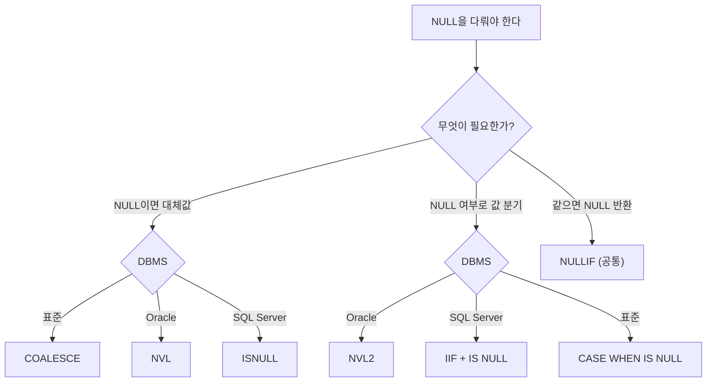
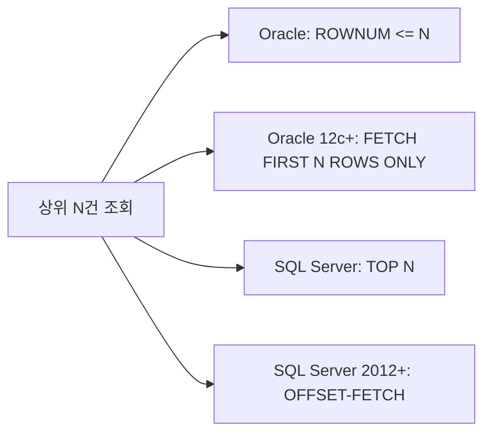
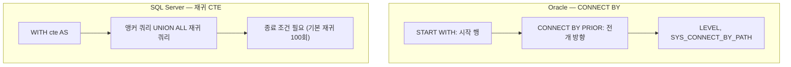

## 목차

1. [한눈에 보는 요약표](#1-한눈에-보는-요약표)
2. [NULL — 가장 많이 나오는 파트](#2-null--가장-많이-나오는-파트)
3. [연산자 비교](#3-연산자-비교)
4. [단일행 함수 대응표](#4-단일행-함수-대응표)
5. [행 제한과 페이징](#5-행-제한과-페이징)
6. [조인](#6-조인)
7. [집합 연산자](#7-집합-연산자)
8. [그룹 함수와 GROUP BY](#8-그룹-함수와-group-by)
9. [윈도우 함수](#9-윈도우-함수)
10. [계층형 질의](#10-계층형-질의)
11. [DDL · DML · TCL](#11-ddl--dml--tcl)
12. [데이터 타입](#12-데이터-타입)
13. [시험 함정 체크리스트](#13-시험-함정-체크리스트)

---

## 1. 한눈에 보는 요약표

| 구분 | Oracle | SQL Server | 표준 |
|---|---|---|---|
| 더미 테이블 | `DUAL` **필수** | `FROM` 생략 가능 | — |
| 문자열 결합 | `\|\|`, `CONCAT`(2개) | `+`, `CONCAT`(N개) | `\|\|` |
| NULL 치환 | `NVL(A,B)` | `ISNULL(A,B)` | `COALESCE` |
| NULL 분기 | `NVL2(A,B,C)` | `IIF`, `CASE` | `CASE` |
| 조건 분기 | `DECODE`, `CASE` | `CASE`, `IIF` | `CASE` |
| 행 제한 | `ROWNUM`, `FETCH FIRST` | `TOP` | `OFFSET-FETCH` |
| 현재 시각 | `SYSDATE` (괄호 없음) | `GETDATE()` | `CURRENT_TIMESTAMP` |
| 자동 증가 | `SEQUENCE` | `IDENTITY`, `SEQUENCE` | `SEQUENCE` |
| 외부조인 전용 연산자 | `(+)` | `*=`, `=*` (폐기됨) | `OUTER JOIN` |
| FULL OUTER JOIN | 지원 | 지원 | 지원 |
| 차집합 | `MINUS` | `EXCEPT` | `EXCEPT` |
| 계층 질의 | `CONNECT BY` | 재귀 `WITH` (CTE) | 재귀 CTE |
| 기본 커밋 | **수동** (`COMMIT` 필요) | **자동 커밋** | — |
| DDL 롤백 | 불가 (자동 커밋) | **가능** (트랜잭션 포함) | — |

> 시험에서 "표준 SQL 문법을 고르시오" 유형이 나오면 답은 대체로 `COALESCE`, `NULLIF`, `CASE`, `OUTER JOIN`, `OFFSET-FETCH` 쪽이다. `NVL`, `DECODE`, `(+)`, `ROWNUM`은 Oracle 전용이고 `ISNULL`, `TOP`, `IIF`는 SQL Server 전용이다.

---

## 2. NULL — 가장 많이 나오는 파트

NULL은 SQLD에서 배점이 가장 두꺼운 개념이다. 정의부터 다시 잡고 간다.

- NULL은 **값이 없음**이 아니라 **아직 정해지지 않은 값**이다.
- NULL과의 모든 비교 연산 결과는 TRUE도 FALSE도 아닌 **UNKNOWN**이다.
- 그래서 `= NULL`이 아니라 `IS NULL`을 써야 한다. 두 DBMS 공통이다.

### 2-1. 빈 문자열('')의 취급 — Oracle만 다르다

```sql
-- Oracle
INSERT INTO T VALUES ('');          -- NULL로 저장된다
SELECT * FROM T WHERE C IS NULL;    -- 조회된다
SELECT LENGTH('') FROM DUAL;        -- NULL

-- SQL Server
INSERT INTO T VALUES ('');          -- 길이 0인 문자열로 저장된다
SELECT * FROM T WHERE C IS NULL;    -- 조회되지 않는다
SELECT LEN('');                     -- 0
```

| 표현식 | Oracle | SQL Server |
|---|---|---|
| `'' IS NULL` | TRUE | FALSE |
| 길이 함수 결과 | `LENGTH('')` → NULL | `LEN('')` → 0 |
| `'' = ''` | UNKNOWN | TRUE |

> **Oracle에서 빈 문자열은 곧 NULL이다.** SQL Server에서는 엄연히 다른 값이다. 이 한 줄이 문제 하나를 가른다. 표준 SQL 기준으로는 SQL Server 쪽이 맞고, Oracle이 예외적인 구현이다.

### 2-2. 문자열 결합에서의 NULL — 결과가 정반대다

```sql
-- Oracle : NULL을 빈 문자열처럼 무시한다
SELECT 'A' || NULL FROM DUAL;          -- 'A'
SELECT CONCAT('A', NULL) FROM DUAL;    -- 'A'

-- SQL Server : + 연산자는 NULL을 전파한다
SELECT 'A' + NULL;                     -- NULL
SELECT CONCAT('A', NULL);              -- 'A'  (CONCAT은 NULL을 빈 문자열 취급)
```

| 표현식 | 결과 |
|---|---|
| Oracle `'A' \|\| NULL` | `'A'` |
| SQL Server `'A' + NULL` | **`NULL`** |
| SQL Server `CONCAT('A', NULL)` | `'A'` |

같은 "결합"인데 SQL Server만 연산자(`+`)와 함수(`CONCAT`)의 NULL 처리가 다르다는 점이 함정이다.

### 2-3. NULL 관련 함수 대응

| 목적 | Oracle | SQL Server | 표준(공통) |
|---|---|---|---|
| NULL이면 대체값 | `NVL(A, B)` | `ISNULL(A, B)` | `COALESCE(A, B)` |
| NULL 여부 따라 분기 | `NVL2(A, B, C)` | `IIF(A IS NULL, C, B)` | `CASE` |
| 두 값이 같으면 NULL | `NULLIF(A, B)` | `NULLIF(A, B)` | `NULLIF(A, B)` |
| 첫 번째 non-NULL | `COALESCE(...)` | `COALESCE(...)` | `COALESCE(...)` |

- `NVL2(A, B, C)` — A가 NULL이 **아니면** B, NULL이면 C를 반환한다. 순서가 헷갈리니 주의한다.
- `NULLIF(A, B)` — A와 B가 같으면 NULL, 다르면 A를 반환한다.
- `ISNULL`은 **인자 2개만** 받는다. `COALESCE`는 인자를 여러 개 받는다.
- `COALESCE`, `NULLIF`, `CASE`는 ANSI 표준이라 양쪽 다 통한다. "표준 함수를 고르시오"의 정답 후보다.

### 2-4. NULL 처리 함수 선택 흐름



### 2-5. 집계 함수와 NULL

| 함수 | NULL 처리 |
|---|---|
| `COUNT(*)` | NULL 포함, 전체 행 수 |
| `COUNT(컬럼)` | 해당 컬럼이 NULL인 행은 **제외** |
| `SUM`, `AVG`, `MAX`, `MIN` | NULL **무시** |
| 모든 값이 NULL일 때 | `COUNT`는 0, 나머지는 **NULL** 반환 |

Oracle · SQL Server 모두 동일하다. 시험 단골은 `AVG`다.

```sql
-- 값이 (10, 20, NULL)일 때
SELECT AVG(C) FROM T;                  -- 15  (분모가 2)

-- Oracle
SELECT AVG(NVL(C, 0)) FROM T;          -- 10  (분모가 3)
-- SQL Server
SELECT AVG(ISNULL(C, 0)) FROM T;       -- 10  (분모가 3)
```

### 2-6. ORDER BY와 NULL 정렬 — 기본값이 정반대다

<svg xmlns="http://www.w3.org/2000/svg" viewBox="0 0 680 250" width="100%" role="img" aria-label="Oracle과 SQL Server의 NULL 정렬 순서 비교">
  <rect x="0" y="0" width="680" height="250" fill="#f8fafc" rx="8"/>
  <style>
    .t   { font-family: system-ui, -apple-system, "Malgun Gothic", sans-serif; }
    .ttl { font-size: 14px; font-weight: 700; fill: #0f172a; }
    .lbl { font-size: 12px; fill: #475569; }
    .val { font-size: 13px; fill: #0f172a; text-anchor: middle; }
    .nul { font-size: 13px; fill: #b91c1c; font-weight: 700; text-anchor: middle; }
  </style>

  <rect x="14" y="14" width="316" height="222" fill="#ffffff" stroke="#cbd5e1" rx="8"/>
  <rect x="350" y="14" width="316" height="222" fill="#ffffff" stroke="#cbd5e1" rx="8"/>
  <text class="t ttl" x="30" y="42">Oracle — NULL을 가장 큰 값으로 취급</text>
  <text class="t ttl" x="366" y="42">SQL Server — NULL을 가장 작은 값으로 취급</text>

  <text class="t lbl" x="30" y="78">ORDER BY C ASC</text>
  <g>
    <rect x="30" y="88" width="52" height="30" fill="#e0f2fe" stroke="#7dd3fc" rx="5"/><text class="t val" x="56" y="108">1</text>
    <rect x="88" y="88" width="52" height="30" fill="#e0f2fe" stroke="#7dd3fc" rx="5"/><text class="t val" x="114" y="108">2</text>
    <rect x="146" y="88" width="52" height="30" fill="#e0f2fe" stroke="#7dd3fc" rx="5"/><text class="t val" x="172" y="108">3</text>
    <rect x="204" y="88" width="52" height="30" fill="#fee2e2" stroke="#fca5a5" rx="5"/><text class="t nul" x="230" y="108">NULL</text>
    <rect x="262" y="88" width="52" height="30" fill="#fee2e2" stroke="#fca5a5" rx="5"/><text class="t nul" x="288" y="108">NULL</text>
  </g>
  <text class="t lbl" x="30" y="152">ORDER BY C DESC</text>
  <g>
    <rect x="30" y="162" width="52" height="30" fill="#fee2e2" stroke="#fca5a5" rx="5"/><text class="t nul" x="56" y="182">NULL</text>
    <rect x="88" y="162" width="52" height="30" fill="#fee2e2" stroke="#fca5a5" rx="5"/><text class="t nul" x="114" y="182">NULL</text>
    <rect x="146" y="162" width="52" height="30" fill="#e0f2fe" stroke="#7dd3fc" rx="5"/><text class="t val" x="172" y="182">3</text>
    <rect x="204" y="162" width="52" height="30" fill="#e0f2fe" stroke="#7dd3fc" rx="5"/><text class="t val" x="230" y="182">2</text>
    <rect x="262" y="162" width="52" height="30" fill="#e0f2fe" stroke="#7dd3fc" rx="5"/><text class="t val" x="288" y="182">1</text>
  </g>

  <text class="t lbl" x="366" y="78">ORDER BY C ASC</text>
  <g>
    <rect x="366" y="88" width="52" height="30" fill="#fee2e2" stroke="#fca5a5" rx="5"/><text class="t nul" x="392" y="108">NULL</text>
    <rect x="424" y="88" width="52" height="30" fill="#fee2e2" stroke="#fca5a5" rx="5"/><text class="t nul" x="450" y="108">NULL</text>
    <rect x="482" y="88" width="52" height="30" fill="#e0f2fe" stroke="#7dd3fc" rx="5"/><text class="t val" x="508" y="108">1</text>
    <rect x="540" y="88" width="52" height="30" fill="#e0f2fe" stroke="#7dd3fc" rx="5"/><text class="t val" x="566" y="108">2</text>
    <rect x="598" y="88" width="52" height="30" fill="#e0f2fe" stroke="#7dd3fc" rx="5"/><text class="t val" x="624" y="108">3</text>
  </g>
  <text class="t lbl" x="366" y="152">ORDER BY C DESC</text>
  <g>
    <rect x="366" y="162" width="52" height="30" fill="#e0f2fe" stroke="#7dd3fc" rx="5"/><text class="t val" x="392" y="182">3</text>
    <rect x="424" y="162" width="52" height="30" fill="#e0f2fe" stroke="#7dd3fc" rx="5"/><text class="t val" x="450" y="182">2</text>
    <rect x="482" y="162" width="52" height="30" fill="#e0f2fe" stroke="#7dd3fc" rx="5"/><text class="t val" x="508" y="182">1</text>
    <rect x="540" y="162" width="52" height="30" fill="#fee2e2" stroke="#fca5a5" rx="5"/><text class="t nul" x="566" y="182">NULL</text>
    <rect x="598" y="162" width="52" height="30" fill="#fee2e2" stroke="#fca5a5" rx="5"/><text class="t nul" x="624" y="182">NULL</text>
  </g>

  <text class="t lbl" x="30" y="222">기본값: ASC → NULL이 마지막</text>
  <text class="t lbl" x="366" y="222">기본값: ASC → NULL이 처음</text>
</svg>

| DBMS | ASC 기본 | DESC 기본 | 명시 제어 |
|---|---|---|---|
| Oracle | NULL 마지막 | NULL 처음 | `NULLS FIRST` / `NULLS LAST` **지원** |
| SQL Server | NULL 처음 | NULL 마지막 | **미지원** (아래 트릭 사용) |

```sql
-- Oracle
SELECT * FROM EMP ORDER BY SAL DESC NULLS LAST;

-- SQL Server : CASE로 정렬 키를 하나 더 만든다
SELECT * FROM EMP
ORDER BY CASE WHEN SAL IS NULL THEN 1 ELSE 0 END, SAL DESC;
```

> 외우는 법: **Oracle은 NULL이 제일 크다**, **SQL Server는 NULL이 제일 작다**. 이 한 문장만 잡으면 ASC/DESC 네 경우가 자동으로 따라온다.

### 2-7. DECODE와 NULL — Oracle만의 특이점

`DECODE`는 내부적으로 `=` 비교가 아니라 **NULL도 같다고 판정하는 비교**를 쓴다.

```sql
-- Oracle
SELECT DECODE(NULL, NULL, '같다', '다르다') FROM DUAL;   -- '같다'

-- 같은 걸 CASE로 쓰면 다르다 (양쪽 DBMS 공통)
SELECT CASE WHEN NULL = NULL THEN '같다' ELSE '다르다' END FROM DUAL;   -- '다르다'
SELECT CASE WHEN NULL IS NULL THEN '같다' ELSE '다르다' END FROM DUAL;  -- '같다'
```

SQL Server에는 `DECODE`가 없다. 대응하려면 `CASE`를 쓰되, NULL 비교는 반드시 `IS NULL`로 해야 한다.

```sql
-- SQL Server
SELECT CASE WHEN C IS NULL THEN '같다' ELSE '다르다' END FROM T;
```

### 2-8. NULL 연산 규칙 (공통)

```sql
NULL + 1        -- NULL
NULL * 0        -- NULL
NULL > 1        -- UNKNOWN → WHERE에서 걸러짐
NOT (NULL)      -- NULL
NULL AND FALSE  -- FALSE   ← 예외, 외워야 한다
NULL OR TRUE    -- TRUE    ← 예외, 외워야 한다
NULL AND TRUE   -- NULL
NULL OR FALSE   -- NULL
```

`IN`과 `NOT IN`에서의 NULL은 특히 자주 나온다.

```sql
-- 리스트에 NULL이 섞이면 NOT IN은 절대 TRUE가 되지 않는다 → 결과가 항상 공집합
SELECT * FROM EMP WHERE DEPTNO NOT IN (10, 20, NULL);   -- 0건
```

서브쿼리 형태(`NOT IN (SELECT ...)`)에서 서브쿼리 결과에 NULL이 하나라도 들어 있으면 똑같이 공집합이 된다. 이럴 땐 `NOT EXISTS`를 쓰라는 게 정답으로 나온다.

---

## 3. 연산자 비교

### 3-1. 문자열 결합

| DBMS | 연산자 / 함수 | 비고 |
|---|---|---|
| Oracle | `\|\|`, `CONCAT(a, b)` | `CONCAT`은 인자 **2개만**, `\|\|`가 표준 |
| SQL Server | `+`, `CONCAT(a, b, ...)` | `\|\|` **미지원**, `+`는 NULL 전파 |

```sql
-- Oracle
SELECT ENAME || '(' || JOB || ')' FROM EMP;

-- SQL Server
SELECT ENAME + '(' + JOB + ')' FROM EMP;
SELECT CONCAT(ENAME, '(', JOB, ')') FROM EMP;
```

> SQL Server에서 `+`는 문자열이면 결합, 숫자면 덧셈이다. `'1' + '2'` → `'12'`, `1 + 2` → `3`. 숫자 문자열이 섞이면 암시적 형변환이 일어나 `'1' + 2` → `3`이 된다.

### 3-2. 산술 · 비교 연산자

| 항목 | Oracle | SQL Server |
|---|---|---|
| 나머지 | `MOD(10, 3)` | `10 % 3` |
| 정수끼리 나눗셈 | `10 / 4` → **2.5** | `10 / 4` → **2** (정수 나눗셈) |
| 버림 | `TRUNC(N, i)` | `ROUND(N, i, 1)` |
| 0으로 나누기 | **에러** (ORA-01476) | **에러** (Msg 8134) |
| 부등호 | `<>`, `!=`, `^=` | `<>`, `!=`, `!<`, `!>` |
| 문자열 대소문자 구분 | 기본 **구분함** | 기본 **구분 안 함** (CI collation) |

```sql
-- Oracle
SELECT 10 / 4 FROM DUAL;    -- 2.5
SELECT MOD(10, 3) FROM DUAL; -- 1

-- SQL Server
SELECT 10 / 4;               -- 2   (정수끼리는 정수 나눗셈)
SELECT 10.0 / 4;             -- 2.5 (한쪽이 실수면 실수 나눗셈)
SELECT 10 % 3;               -- 1
```

정수 나눗셈은 SQL Server 계산 문제에서 자주 틀리는 지점이다.

### 3-3. LIKE와 와일드카드

`%`(0자 이상), `_`(1자)는 공통이고 `ESCAPE` 절도 공통이다.

```sql
SELECT * FROM T WHERE C LIKE 'A\_%' ESCAPE '\';
```

- SQL Server는 여기에 더해 `[]`(문자 집합)과 `[^]`(제외)를 추가로 지원한다. 예: `LIKE '[A-C]%'`.
- Oracle에는 `[]`가 없다. 대신 `REGEXP_LIKE`를 쓴다.

### 3-4. 연산자 우선순위 (공통, 시험 출제)

```
1. 산술 연산자   ( * / + - )
2. 연결 연산자   ( || )
3. 비교 연산자   ( = <> < > <= >= )
4. IS NULL, LIKE, IN, BETWEEN
5. NOT
6. AND
7. OR
```

> `AND`가 `OR`보다 먼저다. 괄호 없는 조건식 문제는 여기서 갈린다.

---

## 4. 단일행 함수 대응표

### 4-1. 문자 함수

| 기능 | Oracle | SQL Server |
|---|---|---|
| 길이 | `LENGTH(str)` | `LEN(str)` — **후행 공백 무시** |
| 부분 문자열 | `SUBSTR(str, pos, len)` | `SUBSTRING(str, pos, len)` — 길이 **필수** |
| 위치 찾기 | `INSTR(str, sub)` | `CHARINDEX(sub, str)` — **인자 순서 반대** |
| 채우기 | `LPAD` / `RPAD` | **미지원** (`REPLICATE` + `+`로 흉내) |
| 공백 제거 | `TRIM`, `LTRIM`, `RTRIM` | `TRIM`, `LTRIM`, `RTRIM` — 공백만 제거 |
| 대소문자 | `UPPER`, `LOWER`, `INITCAP` | `UPPER`, `LOWER` (`INITCAP` **없음**) |
| 치환 | `REPLACE` | `REPLACE` |
| 반복 | 없음 | `REPLICATE(str, n)` |
| 앞/뒤 잘라내기 | `SUBSTR(str, -4)` | `RIGHT(str, 4)`, `LEFT(str, 4)` |

주의할 지점이 몇 개 있다.

- 문자열 시작 인덱스는 **1번부터**다. 양쪽 공통이다.
- `INSTR`과 `CHARINDEX`는 **인자 순서가 반대**다. `INSTR(문자열, 찾을것)` ↔ `CHARINDEX(찾을것, 문자열)`.
- Oracle `SUBSTR`은 시작 위치에 **음수**를 주면 뒤에서부터 센다. SQL Server `SUBSTRING`은 그렇게 동작하지 않으므로 `RIGHT`를 써야 한다.
- Oracle `LTRIM/RTRIM`은 **제거할 문자 집합**을 지정할 수 있지만, SQL Server는 공백만 제거한다.
- SQL Server `LEN`은 **후행 공백을 세지 않는다**. 바이트/실제 길이가 필요하면 `DATALENGTH`를 쓴다.

```sql
-- Oracle
SUBSTR('SQLD_EXAM', 1, 4)     -- 'SQLD'
SUBSTR('SQLD_EXAM', -4)       -- 'EXAM'
INSTR('SQLD_EXAM', 'E')       -- 6
LENGTH('AB   ')               -- 5

-- SQL Server
SUBSTRING('SQLD_EXAM', 1, 4)  -- 'SQLD'
RIGHT('SQLD_EXAM', 4)         -- 'EXAM'
CHARINDEX('E', 'SQLD_EXAM')   -- 6
LEN('AB   ')                  -- 2   ← 후행 공백 제외
DATALENGTH('AB   ')           -- 5
```

### 4-2. 숫자 함수

| 기능 | Oracle | SQL Server |
|---|---|---|
| 반올림 | `ROUND(N, i)` | `ROUND(N, i)` |
| 버림 | `TRUNC(N, i)` | `ROUND(N, i, 1)` — 세 번째 인자가 0이 아니면 버림 |
| 올림 / 내림 | `CEIL` / `FLOOR` | `CEILING` / `FLOOR` |
| 나머지 | `MOD(a, b)` | `a % b` |
| 절대값 | `ABS` | `ABS` |
| 부호 | `SIGN` | `SIGN` |
| 거듭제곱 | `POWER` | `POWER` |

```sql
-- Oracle
SELECT TRUNC(123.456, 2) FROM DUAL;   -- 123.45
SELECT ROUND(123.456, 2) FROM DUAL;   -- 123.46
SELECT CEIL(1.1) FROM DUAL;           -- 2

-- SQL Server
SELECT ROUND(123.456, 2, 1);          -- 123.45  (버림)
SELECT ROUND(123.456, 2);             -- 123.46  (반올림)
SELECT CEILING(1.1);                  -- 2
```

> Oracle의 `TRUNC`는 **날짜에도 쓸 수 있다**(`TRUNC(SYSDATE)` → 시분초 절삭). SQL Server에는 날짜 절삭용 `TRUNC`가 없고 `CAST(GETDATE() AS DATE)` 같은 방식을 쓴다. 이 비대칭이 시험에 나온다.

### 4-3. 날짜 함수

| 기능 | Oracle | SQL Server |
|---|---|---|
| 현재 시각 | `SYSDATE` (괄호 없음) | `GETDATE()`, `SYSDATETIME()` |
| 표준 현재 시각 | `CURRENT_DATE` | `CURRENT_TIMESTAMP` |
| 날짜 + N일 | `SYSDATE + 1` | `DATEADD(DAY, 1, GETDATE())` |
| 월 더하기 | `ADD_MONTHS(D, 3)` | `DATEADD(MONTH, 3, D)` |
| 날짜 차이 | `D1 - D2` (일수, **소수 포함**) | `DATEDIFF(DAY, D2, D1)` (정수) |
| 개월 차이 | `MONTHS_BETWEEN(D1, D2)` | `DATEDIFF(MONTH, D2, D1)` |
| 월말 | `LAST_DAY(D)` | `EOMONTH(D)` |
| 날짜 일부 추출 | `EXTRACT(YEAR FROM D)`, `TO_CHAR` | `DATEPART(YEAR, D)`, `YEAR(D)` |
| 시분초 절삭 | `TRUNC(SYSDATE)` | `CAST(GETDATE() AS DATE)` |
| 특정 요일 | `NEXT_DAY(D, '월요일')` | 없음 (`DATEADD`+`DATEPART` 조합) |

```sql
-- Oracle : 날짜에 숫자를 더하면 '일' 단위
SELECT SYSDATE + 1 FROM DUAL;         -- 내일
SELECT SYSDATE + 1/24 FROM DUAL;      -- 1시간 뒤
SELECT TRUNC(SYSDATE) FROM DUAL;      -- 오늘 00:00:00

-- SQL Server : DATEADD를 쓴다
SELECT DATEADD(DAY, 1, GETDATE());
SELECT DATEADD(HOUR, 1, GETDATE());
```

> **`DATEDIFF`의 함정**: SQL Server의 `DATEDIFF`는 실제 경과 시간이 아니라 **경계를 몇 번 넘었는지**를 센다. `DATEDIFF(YEAR, '2025-12-31', '2026-01-01')`은 하루 차이인데도 결과가 1이다. Oracle의 `D1 - D2`는 실제 일수를 소수까지 반환하므로 성격이 다르다.

### 4-4. 형변환 함수

| 기능 | Oracle | SQL Server | 표준 |
|---|---|---|---|
| 문자 → 숫자 | `TO_NUMBER('123')` | `CAST('123' AS INT)` | `CAST` |
| 숫자/날짜 → 문자 | `TO_CHAR(D, 'YYYY-MM-DD')` | `CONVERT(VARCHAR, D, 23)` | `CAST` |
| 문자 → 날짜 | `TO_DATE('20260808', 'YYYYMMDD')` | `CONVERT(DATETIME, '20260808')` | `CAST` |

- Oracle은 **포맷 문자열**(`YYYY-MM-DD HH24:MI:SS`)로 지정하고, SQL Server는 **스타일 번호**(`CONVERT(VARCHAR, D, 112)`)로 지정한다. 방식 자체가 다르다.
- `CAST(표현식 AS 데이터타입)`은 **양쪽 다 되는 표준 문법**이다. 시험에서 표준을 묻는다면 `CAST`다.
- **명시적 형변환**: 개발자가 `CAST`, `TO_CHAR` 등으로 직접 지정한다.
- **암시적 형변환**: DBMS가 알아서 변환한다. 인덱스를 못 타게 만드는 주범이라 성능 파트에서도 나온다.

### 4-5. 조건 함수

| 기능 | Oracle | SQL Server | 표준 |
|---|---|---|---|
| 등가 비교 분기 | `DECODE(A, 1, 'X', 2, 'Y', 'Z')` | `CASE`, `IIF` | `CASE` |
| 범위 비교 분기 | `CASE` | `CASE` | `CASE` |

- `DECODE`는 **Oracle 전용**이고 **등가(=) 비교만** 가능하다. `>`, `<` 같은 범위 조건은 못 쓴다.
- `IIF(조건, 참값, 거짓값)`는 **SQL Server 전용**이며 내부적으로 `CASE`로 변환된다.
- `CASE`는 표준이라 양쪽 다 되고, 범위 조건도 가능하다.
- `CASE`의 `ELSE`를 생략하면 조건에 안 걸린 행은 **NULL**이 된다. 자주 나오는 함정이다.

```sql
-- Oracle : 두 문장은 동일하다
SELECT DECODE(DEPTNO, 10, 'A', 20, 'B', 'C') FROM EMP;
SELECT CASE DEPTNO WHEN 10 THEN 'A' WHEN 20 THEN 'B' ELSE 'C' END FROM EMP;

-- SQL Server
SELECT CASE DEPTNO WHEN 10 THEN 'A' WHEN 20 THEN 'B' ELSE 'C' END FROM EMP;
SELECT IIF(SAL > 3000, '고액', '일반') FROM EMP;
```

`CASE`의 두 형태도 구분해두면 좋다.

```sql
-- 단순 CASE (등가 비교만)
CASE DEPTNO WHEN 10 THEN 'A' ELSE 'B' END

-- 검색 CASE (범위 조건 가능)
CASE WHEN SAL >= 3000 THEN '상' WHEN SAL >= 2000 THEN '중' ELSE '하' END
```

---

## 5. 행 제한과 페이징



```sql
-- Oracle (전통 방식) : 정렬을 반드시 인라인 뷰 안에 넣는다
SELECT * FROM (SELECT * FROM EMP ORDER BY SAL DESC)
WHERE ROWNUM <= 5;

-- Oracle 12c 이상 (표준 OFFSET-FETCH)
SELECT * FROM EMP ORDER BY SAL DESC
OFFSET 10 ROWS FETCH NEXT 5 ROWS ONLY;

-- SQL Server
SELECT TOP 5 * FROM EMP ORDER BY SAL DESC;
SELECT TOP 10 PERCENT * FROM EMP ORDER BY SAL DESC;
SELECT TOP 5 WITH TIES * FROM EMP ORDER BY SAL DESC;   -- 동점자 포함

-- SQL Server 2012 이상 (표준 OFFSET-FETCH, ORDER BY 필수)
SELECT * FROM EMP ORDER BY SAL DESC
OFFSET 10 ROWS FETCH NEXT 5 ROWS ONLY;
```

### 5-1. ROWNUM의 함정 (시험 단골)

`ROWNUM`은 **결과 집합이 만들어지는 순간 순서대로 부여**되는 의사 컬럼(Pseudo Column)이다. 그래서 이런 일이 생긴다.

```sql
SELECT * FROM EMP WHERE ROWNUM = 1;    -- 정상, 1건
SELECT * FROM EMP WHERE ROWNUM = 2;    -- 0건 !!
SELECT * FROM EMP WHERE ROWNUM > 1;    -- 0건 !!
```

첫 행이 ROWNUM 1을 받고 조건에서 탈락하면, 다음 행이 다시 ROWNUM 1을 시도하기 때문에 영원히 조건을 만족하지 못한다. 그래서 **인라인 뷰로 감싸서** 써야 한다.

```sql
SELECT * FROM (SELECT ROWNUM RN, E.* FROM EMP E) WHERE RN BETWEEN 11 AND 20;
```

또 하나. `ROWNUM`은 `ORDER BY`보다 **먼저** 부여된다. 정렬된 상위 N건을 뽑으려면 반드시 정렬을 서브쿼리 안에 넣어야 한다.

### 5-2. TOP의 특징

`TOP`은 `ROWNUM`과 달리 `ORDER BY`가 **적용된 뒤에** 잘라내므로 인라인 뷰가 필요 없다. 다만 `ORDER BY`가 없으면 어떤 5건이 나올지 보장되지 않는다.

```sql
-- SQL Server : 이건 그냥 동작한다
SELECT TOP 5 * FROM EMP ORDER BY SAL DESC;
```

| 항목 | Oracle `ROWNUM` | SQL Server `TOP` |
|---|---|---|
| ORDER BY와의 순서 | **정렬 전에** 부여 | **정렬 후에** 적용 |
| 인라인 뷰 필요 | 필요 | 불필요 |
| 중간 구간 조회 | 인라인 뷰 2번 중첩 | `OFFSET-FETCH` |
| 동점자 처리 | 별도 처리 | `WITH TIES` |

### 5-3. 표준 방식 — 양쪽 다 동일

`OFFSET n ROWS FETCH NEXT m ROWS ONLY`는 Oracle 12c 이상, SQL Server 2012 이상에서 **똑같이** 동작하는 표준 문법이다. 페이징 문제에서 "표준"이라는 단어가 보이면 이게 정답이다. 단, **`ORDER BY`가 반드시 있어야 한다.**

---

## 6. 조인

### 6-1. 표준 조인 문법 (공통)

`INNER JOIN`, `LEFT/RIGHT/FULL OUTER JOIN`, `CROSS JOIN`, `ON`은 Oracle · SQL Server 모두 지원한다. 여기가 SQLD 조인 파트의 본체다.

### 6-2. 차이 나는 부분

| 항목 | Oracle | SQL Server |
|---|---|---|
| 외부조인 전용 연산자 | `(+)` **지원** | `*=`, `=*` (폐기, 사실상 사용 불가) |
| `FULL OUTER JOIN` | 지원 | 지원 |
| `NATURAL JOIN` | 지원 | **미지원** |
| `USING` 절 | 지원 | **미지원** (`ON`만) |
| `CROSS JOIN` | 지원 | 지원 |

```sql
-- Oracle 전용 (+) 문법. 데이터가 부족한 쪽에 (+)를 붙인다
SELECT * FROM EMP E, DEPT D WHERE E.DEPTNO = D.DEPTNO(+);
-- 표준 문법으로는 (양쪽 공통)
SELECT * FROM EMP E LEFT OUTER JOIN DEPT D ON E.DEPTNO = D.DEPTNO;
```

> **`(+)` 위치 규칙**: 보존하고 싶은 쪽의 **반대편**에 붙인다. `E.DEPTNO = D.DEPTNO(+)`는 EMP를 전부 보존하므로 `EMP LEFT OUTER JOIN DEPT`와 같다. 헷갈리면 "`(+)`가 붙은 쪽이 NULL로 채워지는 쪽"으로 기억한다.

`(+)`의 제약도 출제된다.

- 한 쿼리 안에서 **양쪽에 동시에** `(+)`를 붙일 수 없다 → 그래서 `(+)`로는 FULL OUTER JOIN을 못 만든다.
- `OR`나 `IN` 조건과 함께 쓸 수 없다.
- 표준 `OUTER JOIN` 문법과 섞어 쓸 수 없다.

### 6-3. NATURAL JOIN과 USING (Oracle 전용, 출제 포인트)

SQL Server는 `NATURAL JOIN`과 `USING`을 지원하지 않는다. 하지만 SQLD는 표준 SQL 문법으로 이 둘을 출제하므로 규칙은 알아야 한다.

- 조인 컬럼에 **별칭(alias)이나 테이블명을 붙이면 에러**가 난다.
- `NATURAL JOIN`은 같은 이름의 컬럼 **전부**를 자동으로 조인하며, `ON`이나 `USING`을 함께 쓸 수 없다.
- `USING`에는 괄호가 필요하다: `USING (DEPTNO)`.

```sql
SELECT DEPTNO, ENAME FROM EMP JOIN DEPT USING (DEPTNO);        -- 정상
SELECT E.DEPTNO FROM EMP E JOIN DEPT D USING (DEPTNO);         -- 에러
```

---

## 7. 집합 연산자

| 연산자 | 의미 | Oracle | SQL Server | 표준 |
|---|---|---|---|---|
| `UNION` | 합집합, 중복 제거 | O | O | O |
| `UNION ALL` | 합집합, 중복 유지 | O | O | O |
| `INTERSECT` | 교집합 | O | O | O |
| `MINUS` | 차집합 | **O** | X | X |
| `EXCEPT` | 차집합 | X | **O** | **O** |

> 차집합만 이름이 다르다. **Oracle은 `MINUS`, SQL Server와 표준은 `EXCEPT`**. 이 대응은 거의 매 회차 나온다고 봐도 된다.

공통 규칙은 이렇다.

- 각 SELECT의 **컬럼 개수와 데이터 타입이 일치**해야 한다. 컬럼 이름은 달라도 된다.
- 결과의 컬럼명은 **첫 번째 SELECT**를 따른다.
- `ORDER BY`는 **맨 마지막에 한 번만** 쓸 수 있다.
- `UNION`, `INTERSECT`, `MINUS`/`EXCEPT`는 중복 제거를 위한 **정렬 작업이 발생**한다. `UNION ALL`은 정렬이 없어서 성능이 좋다.
- SQL Server에서는 `INTERSECT`가 `UNION`/`EXCEPT`보다 **우선순위가 높다**. 괄호 없는 혼합 연산 문제에서 갈린다.

---

## 8. 그룹 함수와 GROUP BY

### 8-1. 별칭(alias) 사용 가능 여부

| 절 | Oracle | SQL Server |
|---|---|---|
| `WHERE` | 불가 | 불가 |
| `GROUP BY` | 불가 | 불가 |
| `HAVING` | 불가 | 불가 |
| `ORDER BY` | **가능** | **가능** |

양쪽 모두 동일하다. 이유는 SQL의 **논리적 실행 순서** 때문이다.


`SELECT`가 뒤쪽에 있으니 그 앞 단계에서는 별칭을 모른다. `ORDER BY`만 `SELECT` 뒤라서 별칭이 통한다. 이 실행 순서 자체가 단독 문제로도 나온다.

### 8-2. SELECT 절에 GROUP BY 없는 컬럼

```sql
SELECT DEPTNO, ENAME, SUM(SAL) FROM EMP GROUP BY DEPTNO;
```

- Oracle: **에러** (ORA-00979).
- SQL Server: **에러** (Msg 8120).
- 양쪽 다 에러이고, 시험 정답도 **에러**다.

### 8-3. WHERE vs HAVING

| 항목 | WHERE | HAVING |
|---|---|---|
| 대상 | 그룹화 **전** 개별 행 | 그룹화 **후** 그룹 |
| 집계 함수 사용 | **불가** | 가능 |
| 실행 순서 | GROUP BY 앞 | GROUP BY 뒤 |

```sql
-- 부서별 평균 급여가 2000 이상인 부서
SELECT DEPTNO, AVG(SAL) FROM EMP
WHERE JOB <> 'CLERK'        -- 행 단위 필터 (먼저)
GROUP BY DEPTNO
HAVING AVG(SAL) >= 2000;    -- 그룹 단위 필터 (나중)
```

### 8-4. 소계 함수

| 기능 | Oracle | SQL Server |
|---|---|---|
| `ROLLUP` | `GROUP BY ROLLUP(A, B)` | `GROUP BY ROLLUP(A, B)` |
| `CUBE` | `GROUP BY CUBE(A, B)` | `GROUP BY CUBE(A, B)` |
| `GROUPING SETS` | 지원 | 지원 |
| `GROUPING()` 함수 | 지원 | 지원 |
| `GROUPING_ID()` | 지원 | 지원 |

**둘 다 전부 지원하고 문법도 같다.** 이 파트는 DBMS 차이를 걱정할 필요 없이 개념만 정확히 잡으면 된다.

- `ROLLUP(A, B)` → `(A,B)`, `(A)`, `()` 총 **N+1**개 그룹. **순서가 의미 있다.**
- `CUBE(A, B)` → 가능한 모든 조합, 총 **2^N**개 그룹. 순서 무관.
- `GROUPING SETS(A, B)` → 지정한 그룹만 만든다. 소계 없이 개별 그룹만 나온다.
- `GROUPING(컬럼)` → 그 컬럼이 소계 때문에 NULL이면 1, 실제 값이면 0.

```sql
-- 두 DBMS 공통
SELECT DEPTNO, JOB, SUM(SAL), GROUPING(JOB)
FROM EMP
GROUP BY ROLLUP(DEPTNO, JOB);
```

### 8-5. 문자열 집계

| Oracle | SQL Server |
|---|---|
| `LISTAGG(C, ',') WITHIN GROUP (ORDER BY C)` | `STRING_AGG(C, ',') WITHIN GROUP (ORDER BY C)` |

---

## 9. 윈도우 함수

Oracle과 SQL Server 모두 완전히 지원한다. 기본 구조도 동일하다.

```sql
함수명(인자) OVER (
    PARTITION BY 컬럼
    ORDER BY 컬럼
    ROWS|RANGE BETWEEN ... AND ...
)
```

| 분류 | 함수 | Oracle | SQL Server |
|---|---|---|---|
| 순위 | `RANK`, `DENSE_RANK`, `ROW_NUMBER` | O | O |
| 순위 | `NTILE`, `PERCENT_RANK`, `CUME_DIST` | O | O |
| 행 순서 | `LAG`, `LEAD`, `FIRST_VALUE`, `LAST_VALUE` | O | O |
| 비율 | `RATIO_TO_REPORT` | **O** | X (`SUM() OVER()`로 계산) |
| 집계 | `SUM/AVG/COUNT/MAX/MIN OVER()` | O | O |

순위 함수 세 개의 차이는 반드시 외운다.

| 값 | `RANK` | `DENSE_RANK` | `ROW_NUMBER` |
|---|---|---|---|
| 100 | 1 | 1 | 1 |
| 100 | 1 | 1 | 2 |
| 90 | **3** | **2** | 3 |

- `RANK` — 동순위 다음 순위를 **건너뛴다**.
- `DENSE_RANK` — 건너뛰지 않는다.
- `ROW_NUMBER` — 동순위 없이 무조건 유일한 번호를 매긴다.

`ROWS`와 `RANGE`의 차이도 공통 출제 포인트다.

- `ROWS` — **물리적인 행** 개수 기준
- `RANGE` — **논리적인 값**의 범위 기준 (같은 값은 한 덩어리로 취급)

```sql
-- 누적 합계 (양쪽 공통)
SELECT ENAME, SAL,
       SUM(SAL) OVER (ORDER BY SAL ROWS BETWEEN UNBOUNDED PRECEDING AND CURRENT ROW) AS 누적
FROM EMP;
```

윈도우 프레임 키워드도 정리해둔다.

| 키워드 | 의미 |
|---|---|
| `UNBOUNDED PRECEDING` | 파티션의 첫 행 |
| `n PRECEDING` | 현재 행 기준 n행 앞 |
| `CURRENT ROW` | 현재 행 |
| `n FOLLOWING` | 현재 행 기준 n행 뒤 |
| `UNBOUNDED FOLLOWING` | 파티션의 마지막 행 |

---

## 10. 계층형 질의

여기가 두 DBMS 차이가 가장 큰 파트다. **Oracle은 `CONNECT BY`, SQL Server는 재귀 CTE**를 쓴다.



```sql
-- Oracle
SELECT LEVEL,
       LPAD(' ', 4*(LEVEL-1)) || ENAME AS 조직도,
       SYS_CONNECT_BY_PATH(ENAME, '/') AS 경로,
       CONNECT_BY_ISLEAF AS 말단여부
FROM EMP
START WITH MGR IS NULL
CONNECT BY PRIOR EMPNO = MGR
ORDER SIBLINGS BY ENAME;

-- SQL Server (표준 재귀 CTE)
WITH ORG AS (
    SELECT EMPNO, ENAME, MGR, 1 AS LVL
    FROM EMP WHERE MGR IS NULL            -- 앵커(시작) 쿼리
    UNION ALL
    SELECT E.EMPNO, E.ENAME, E.MGR, O.LVL + 1
    FROM EMP E JOIN ORG O ON E.MGR = O.EMPNO   -- 재귀 쿼리
)
SELECT * FROM ORG
OPTION (MAXRECURSION 100);
```

Oracle 계층 질의 키워드를 정리하면 이렇다. **Oracle 전용이지만 SQLD 출제 빈도가 높다.**

| 키워드 | 의미 |
|---|---|
| `START WITH` | 전개의 시작이 되는 루트 행 |
| `CONNECT BY PRIOR 자식 = 부모` | **순방향** 전개 (위 → 아래) |
| `CONNECT BY PRIOR 부모 = 자식` | **역방향** 전개 (아래 → 위) |
| `LEVEL` | 계층 깊이, 루트가 1 |
| `CONNECT_BY_ROOT` | 루트 노드의 값 |
| `SYS_CONNECT_BY_PATH` | 루트부터의 경로 문자열 |
| `CONNECT_BY_ISLEAF` | 말단 노드면 1, 아니면 0 |
| `NOCYCLE` | 순환 발생 시 무한 루프 방지 |
| `ORDER SIBLINGS BY` | 같은 부모를 가진 형제 노드끼리 정렬 |

SQL Server 재귀 CTE의 규칙도 함께 정리한다.

- **앵커 쿼리**(재귀 없는 시작점)와 **재귀 쿼리**를 `UNION ALL`로 연결한다.
- 재귀 쿼리는 CTE 자기 자신을 참조한다.
- 기본 재귀 횟수 제한은 **100회**이고, `OPTION (MAXRECURSION n)`으로 바꾼다. `0`이면 무제한.
- 재귀 쿼리에는 `ORDER BY`, `GROUP BY`, `DISTINCT`, 집계 함수를 쓸 수 없다.

---

## 11. DDL · DML · TCL

### 11-1. 트랜잭션 — 가장 큰 차이

| 항목 | Oracle | SQL Server |
|---|---|---|
| 기본 커밋 모드 | **수동** (`COMMIT` 필요) | **자동 커밋** |
| 트랜잭션 시작 | 첫 DML부터 **암묵적** 시작 | `BEGIN TRANSACTION` 명시 |
| DDL 실행 시 | **자동 커밋** (롤백 불가) | **트랜잭션에 포함 가능** (롤백 가능) |
| `SAVEPOINT` | `SAVEPOINT 이름` | `SAVE TRANSACTION 이름` |
| 롤백 | `ROLLBACK TO 이름` | `ROLLBACK TRANSACTION 이름` |

```sql
-- Oracle : 별도 선언 없이 DML을 하면 트랜잭션이 시작된다
UPDATE EMP SET SAL = SAL * 1.1;
SAVEPOINT SP1;
DELETE FROM EMP WHERE DEPTNO = 10;
ROLLBACK TO SP1;
COMMIT;

-- SQL Server : 명시적으로 시작해야 한다
BEGIN TRANSACTION;
UPDATE EMP SET SAL = SAL * 1.1;
SAVE TRANSACTION SP1;
DELETE FROM EMP WHERE DEPTNO = 10;
ROLLBACK TRANSACTION SP1;
COMMIT;
```

> **DDL 자동 커밋**은 Oracle 기준으로 출제된다. Oracle에서 `CREATE`, `ALTER`, `DROP`, `TRUNCATE`는 실행 즉시 커밋되어 이전 DML까지 함께 확정된다. SQL Server는 DDL도 트랜잭션 안에서 롤백할 수 있다는 점이 다르다.

### 11-2. DELETE · TRUNCATE · DROP 비교 (공통 출제)

| 구분 | DELETE | TRUNCATE | DROP |
|---|---|---|---|
| 분류 | DML | **DDL** | DDL |
| ROLLBACK | 가능 | **불가** (Oracle 기준) | 불가 |
| WHERE 절 | 가능 | 불가 | — |
| 구조(테이블) | 유지 | 유지 | **삭제** |
| 저장 공간 | 유지 | 반환 | 반환 |
| 속도 | 느림 | 빠름 | 빠름 |
| 로그 기록 | 행 단위 전체 | 최소한만 | 최소한만 |

> 표는 **Oracle 기준**이다. SQL Server에서는 `TRUNCATE TABLE`도 명시적 트랜잭션 안에서 롤백할 수 있다. 다만 SQLD에서 이 표를 물으면 정답은 위 표(TRUNCATE는 롤백 불가)로 나온다.

### 11-3. 자동 증가 컬럼

```sql
-- Oracle : 시퀀스 객체
CREATE SEQUENCE SEQ_EMP START WITH 1 INCREMENT BY 1 NOCACHE;
INSERT INTO EMP VALUES (SEQ_EMP.NEXTVAL, 'SCOTT');

-- SQL Server : IDENTITY 속성
CREATE TABLE EMP (ID INT IDENTITY(1,1) PRIMARY KEY, NAME VARCHAR(20));
INSERT INTO EMP (NAME) VALUES ('SCOTT');

-- SQL Server 2012 이상 : 시퀀스도 지원
CREATE SEQUENCE SEQ_EMP START WITH 1 INCREMENT BY 1;
INSERT INTO EMP VALUES (NEXT VALUE FOR SEQ_EMP, 'SCOTT');
```

- Oracle 시퀀스에서 `CURRVAL`은 같은 세션에서 `NEXTVAL`을 **최소 한 번 호출한 뒤에만** 쓸 수 있다.
- 시퀀스 값은 롤백해도 되돌아가지 않는다. 즉 **번호에 구멍이 생길 수 있다.**
- Oracle 12c 이상은 `GENERATED AS IDENTITY`로 SQL Server처럼 쓸 수도 있다.

### 11-4. 기타 DDL

| 기능 | Oracle | SQL Server |
|---|---|---|
| 컬럼 추가 | `ALTER TABLE T ADD (C NUMBER)` | `ALTER TABLE T ADD C INT` |
| 컬럼 타입 변경 | `ALTER TABLE T MODIFY (C VARCHAR2(30))` | `ALTER TABLE T ALTER COLUMN C VARCHAR(30)` |
| 컬럼 삭제 | `ALTER TABLE T DROP COLUMN C` | `ALTER TABLE T DROP COLUMN C` |
| 컬럼명 변경 | `ALTER TABLE T RENAME COLUMN A TO B` | `EXEC sp_rename 'T.A', 'B', 'COLUMN'` |
| 테이블명 변경 | `RENAME A TO B` | `EXEC sp_rename 'A', 'B'` |
| 객체명 대소문자 | 큰따옴표 없으면 **대문자로 저장** | 입력 그대로 저장 |

> 컬럼 타입 변경에서 Oracle은 `MODIFY`, SQL Server는 `ALTER COLUMN`이다. 키워드 자체를 고르는 문제가 나온다.

---

## 12. 데이터 타입

| 용도 | Oracle | SQL Server |
|---|---|---|
| 가변 문자 | `VARCHAR2(n)` | `VARCHAR(n)` |
| 고정 문자 | `CHAR(n)` | `CHAR(n)` |
| 유니코드 문자 | `NVARCHAR2(n)` | `NVARCHAR(n)` |
| 숫자 | `NUMBER(p, s)` | `INT`, `NUMERIC(p,s)`, `DECIMAL(p,s)` |
| 날짜 | `DATE` (**시분초 포함**) | `DATE`(날짜만), `DATETIME`, `DATETIME2` |
| 타임스탬프 | `TIMESTAMP` | `DATETIME2` |
| 대용량 문자 | `CLOB` | `VARCHAR(MAX)` |
| 이진 | `BLOB` | `VARBINARY(MAX)` |

가장 헷갈리는 두 가지다.

1. **Oracle의 `DATE`는 연월일시분초를 모두 담는다.** SQL Server의 `DATE`는 날짜만이고, 시각까지 담으려면 `DATETIME` 또는 `DATETIME2`를 써야 한다. 이름이 같은데 의미가 다른 대표 사례다.
2. **`CHAR`는 고정 길이라 뒤를 공백으로 채운다.** `CHAR(10)`에 `'AB'`를 넣으면 실제로는 8칸의 공백이 붙는다.

`CHAR` 비교 규칙은 두 DBMS가 다르다.

```sql
-- Oracle : CHAR끼리 비교하면 공백을 무시(blank-padded)하지만,
--          CHAR와 VARCHAR2를 비교하면 공백까지 따진다(non-padded)
DECLARE
  c CHAR(10) := 'AB';
  v VARCHAR2(10) := 'AB';
BEGIN
  -- c = v 는 FALSE (c는 'AB' + 공백 8칸)
END;

-- SQL Server : 기본적으로 비교 시 후행 공백을 무시한다
SELECT CASE WHEN 'AB' = 'AB   ' THEN 'Y' ELSE 'N' END;   -- 'Y'
```

> 정리하면 **SQL Server는 후행 공백에 관대하고, Oracle은 타입이 섞이면 엄격하다.** `LEN`이 후행 공백을 안 세는 것도 같은 맥락이다.

---

## 13. 시험 함정 체크리스트

마지막으로 자주 틀리는 것만 모았다.

**NULL**
- [ ] `NULL`은 `=`가 아니라 `IS NULL`로 비교한다.
- [ ] Oracle에서 `''`는 NULL이다. SQL Server에서는 길이 0인 문자열이다.
- [ ] Oracle `||`는 NULL을 무시하고, SQL Server `+`는 NULL 하나면 전체가 NULL이다.
- [ ] SQL Server `CONCAT`은 NULL을 빈 문자열로 취급한다 (`+`와 반대).
- [ ] `COUNT(*)`는 NULL을 세고, `COUNT(컬럼)`은 세지 않는다.
- [ ] `AVG`는 NULL을 분모에서 제외한다.
- [ ] `NOT IN` 리스트에 NULL이 있으면 결과가 공집합이다. → `NOT EXISTS`로 대체.
- [ ] `NULL AND FALSE`는 FALSE, `NULL OR TRUE`는 TRUE. 나머지는 NULL.
- [ ] 정렬 시 NULL 위치: **Oracle은 ASC에서 마지막, SQL Server는 ASC에서 처음**이다.
- [ ] `NULLS FIRST/LAST`는 Oracle만 지원한다.

**함수**
- [ ] `NVL`은 Oracle, `ISNULL`은 SQL Server, `COALESCE`가 표준이다.
- [ ] `DECODE`는 Oracle 전용이고 **등가 비교만** 된다. NULL끼리도 같다고 판정한다.
- [ ] `CASE`에서 `ELSE`를 생략하면 NULL이 반환된다.
- [ ] `INSTR(문자열, 찾을것)`과 `CHARINDEX(찾을것, 문자열)`은 **인자 순서가 반대**다.
- [ ] SQL Server `LEN`은 후행 공백을 세지 않는다. Oracle `LENGTH`는 센다.
- [ ] SQL Server에는 `LPAD`/`RPAD`/`INITCAP`이 없다.
- [ ] Oracle `TRUNC`는 날짜에도 쓸 수 있다. SQL Server의 버림은 `ROUND(N, i, 1)`이다.
- [ ] SQL Server에서 정수끼리 나누면 정수가 나온다 (`10/4` = 2).
- [ ] Oracle `SYSDATE`는 괄호가 없고, SQL Server `GETDATE()`는 괄호가 있다.
- [ ] Oracle `DATE`는 시분초를 포함한다. SQL Server `DATE`는 포함하지 않는다.

**절과 구문**
- [ ] `WHERE`, `GROUP BY`, `HAVING`에서는 SELECT 별칭을 못 쓴다. `ORDER BY`만 가능하다. (양쪽 공통)
- [ ] 논리적 실행 순서는 FROM → WHERE → GROUP BY → HAVING → SELECT → ORDER BY다.
- [ ] `WHERE`에는 집계 함수를 못 쓴다. 집계 조건은 `HAVING`이다.
- [ ] `ROWNUM = 2`는 결과가 없다. `ROWNUM`은 인라인 뷰로 감싸야 한다.
- [ ] `ROWNUM`은 `ORDER BY`보다 **먼저** 부여되고, `TOP`은 `ORDER BY` **이후**에 적용된다.
- [ ] `NATURAL JOIN`과 `USING` 절의 조인 컬럼에는 별칭을 붙이면 에러다.
- [ ] `(+)`는 양쪽에 동시에 못 붙인다. 그래서 FULL OUTER JOIN을 만들 수 없다.
- [ ] `(+)`는 보존할 테이블의 **반대편**에 붙인다.

**집합 연산 · 그룹 · DDL**
- [ ] 차집합은 **Oracle이 `MINUS`, SQL Server와 표준이 `EXCEPT`**다.
- [ ] `UNION`은 정렬(중복 제거)이 일어나고 `UNION ALL`은 일어나지 않는다.
- [ ] `ORDER BY`는 집합 연산 쿼리 전체에서 맨 마지막에 한 번만 쓴다.
- [ ] `ROLLUP(A,B)`는 N+1개, `CUBE(A,B)`는 2^N개 그룹을 만든다.
- [ ] `ROLLUP`은 인자 순서가 결과에 영향을 주고, `CUBE`는 주지 않는다.
- [ ] `RANK`는 순위를 건너뛰고 `DENSE_RANK`는 건너뛰지 않는다.
- [ ] `TRUNCATE`는 DDL이라 (Oracle 기준) ROLLBACK이 안 된다.
- [ ] Oracle에서 DDL은 자동 커밋된다. SQL Server는 트랜잭션에 포함할 수 있다.
- [ ] Oracle은 기본이 수동 커밋, SQL Server는 기본이 자동 커밋이다.

---

## 마무리

Oracle과 SQL Server 차이 중 SQLD에서 실제로 점수와 직결되는 건 결국 네 덩어리다.

1. **NULL의 취급** — 빈 문자열, 문자열 결합, 정렬 순서, 집계 함수
2. **행 제한 문법** — `ROWNUM` vs `TOP`, 그리고 `ORDER BY`와의 적용 순서
3. **함수 이름의 대응** — `NVL`/`ISNULL`/`COALESCE`, `DECODE`/`CASE`, `MINUS`/`EXCEPT`
4. **트랜잭션** — 기본 커밋 모드와 DDL 자동 커밋

그리고 하나 더. 문제 지문에 "**표준 SQL 기준으로**"가 붙어 있으면 벤더 전용 문법(`NVL`, `DECODE`, `ROWNUM`, `(+)`, `MINUS`, `ISNULL`, `TOP`, `IIF`)은 전부 오답 후보다. 이 구분만 확실히 해도 몇 문제가 그냥 풀린다.

