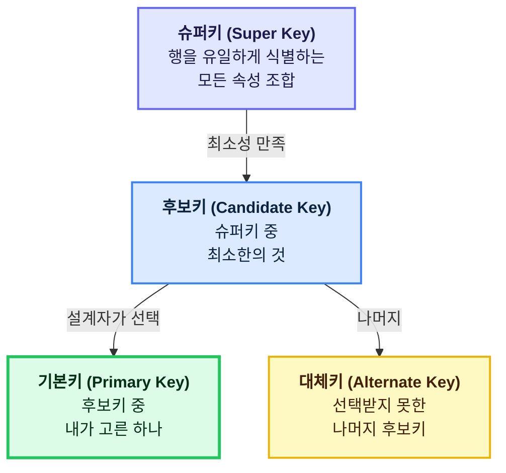
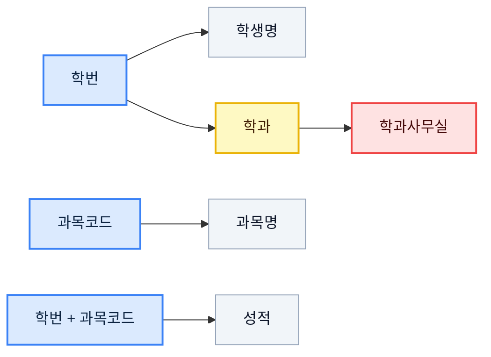
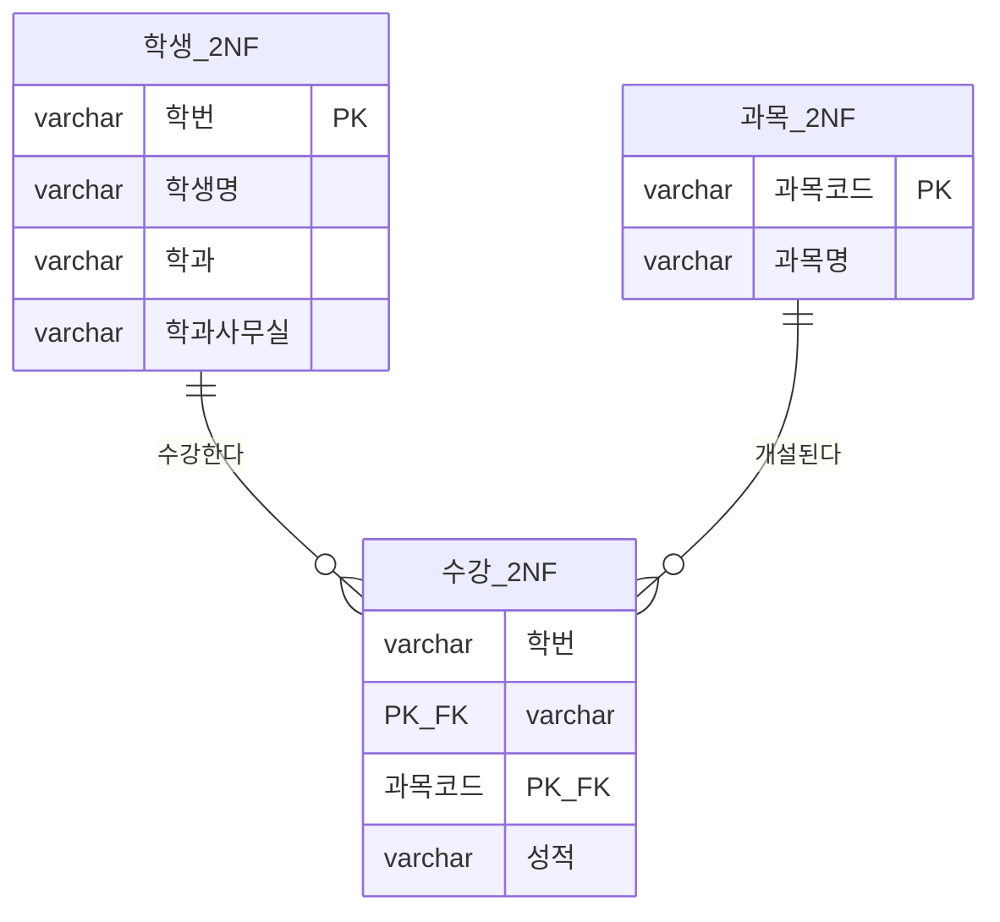
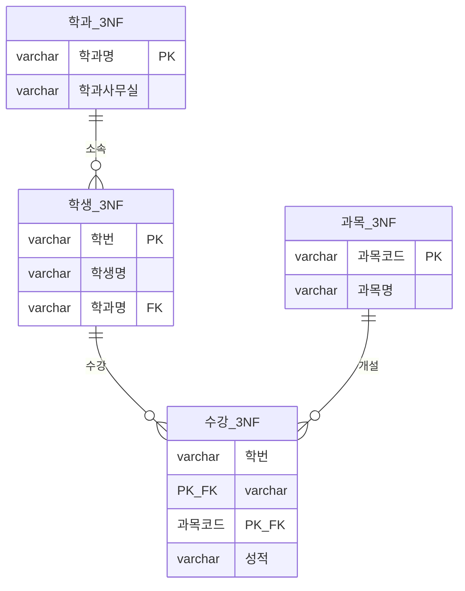

> 정규화는 "테이블을 쪼개는 기술"이 아니다. **한 가지 사실은 한 곳에만 저장한다**는 원칙을 지키는 방법론이다.

정규화는 데이터베이스를 처음 배울 때 가장 먼저 만나면서도, 실무에 나가서까지 계속 헷갈리는 주제다. 1NF, 2NF, 3NF, BCNF... 정의는 외웠는데 막상 테이블 설계를 하면 손이 안 움직인다.

이 글은 그 간극을 메우는 것이 목표다. **하나의 예제 테이블**을 끝까지 끌고 가면서, 각 단계마다 무엇이 문제였고 왜 쪼갰는지를 한번 자세히 파헤쳐보자.

---

## 목차

1. [정규화가 없으면 생기는 일 — 이상 현상](#1-정규화가-없으면-생기는-일--이상-현상)
2. [정규화의 문법 — 함수 종속성](#2-정규화의-문법--함수-종속성)
3. [키(Key) 정리 — 후보키, 결정자, 그리고 주요 속성](#3-키key-정리--후보키-결정자-그리고-주요-속성)
4. [정규화 사다리 한눈에 보기](#4-정규화-사다리-한눈에-보기)
5. [실습 테이블 — 온라인 강의 수강 신청](#5-실습-테이블--온라인-강의-수강-신청)
6. [제1정규형 (1NF)](#6-제1정규형-1nf)
7. [제2정규형 (2NF)](#7-제2정규형-2nf)
8. [제3정규형 (3NF)](#8-제3정규형-3nf)
9. [BCNF](#9-bcnf--보이스코드-정규형)
10. [제4정규형 (4NF)](#10-제4정규형-4nf)
11. [제5정규형 (5NF)](#11-제5정규형-5nf)
12. [전체 요약표 & 판단 흐름도](#12-전체-요약표--판단-흐름도)
13. [역정규화 — 일부러 되돌리기](#13-역정규화--일부러-되돌리기)
14. [실전 체크리스트 & FAQ](#14-실전-체크리스트--faq)

---

## 1. 정규화가 없으면 생기는 일 — 이상 현상

정규화를 배우기 전에 **정규화를 안 하면 뭐가 아픈지**부터 느껴야 한다. 그 아픔의 이름이 이상 현상(Anomaly)이다.

다음처럼 모든 정보를 한 테이블에 때려 넣었다고 하자.

| 학번 | 학생명 | 학과 | 학과사무실 | 과목코드 | 과목명 | 성적 |
|---|---|---|---|---|---|---|
| S001 | 김철수 | 컴퓨터공학 | 공학관 301 | CS101 | 자료구조 | A |
| S001 | 김철수 | 컴퓨터공학 | 공학관 301 | CS102 | 알고리즘 | B |
| S002 | 이영희 | 컴퓨터공학 | 공학관 301 | CS101 | 자료구조 | A |
| S003 | 박성진 | 전자공학 | 공학관 505 | EE201 | 회로이론 | C |

한눈에 봐도 `컴퓨터공학 / 공학관 301`이 계속 반복된다. 여기서 세 가지 사고가 터진다.

<svg viewBox="0 0 780 300" xmlns="http://www.w3.org/2000/svg" role="img" aria-label="이상 현상 3종 다이어그램">
  <style>
    .an-card { fill:#f8fafc; stroke:#cbd5e1; stroke-width:1.5; }
    .an-ttl  { font:bold 16px sans-serif; fill:#0f172a; }
    .an-txt  { font:13px sans-serif; fill:#475569; }
    .an-tag  { font:bold 11px sans-serif; fill:#ffffff; }
    .an-i    { fill:#ef4444; } .an-u { fill:#f59e0b; } .an-d { fill:#8b5cf6; }
    .an-head { font:bold 18px sans-serif; fill:#0f172a; }
    @media (prefers-color-scheme: dark) {
      .an-card { fill:#1e293b; stroke:#475569; }
      .an-ttl, .an-head { fill:#f1f5f9; }
      .an-txt { fill:#cbd5e1; }
    }
  </style>
  <text x="390" y="28" text-anchor="middle" class="an-head">한 테이블에 다 넣으면 생기는 3가지 사고</text>

  <g>
    <rect x="20" y="55" width="230" height="215" rx="12" class="an-card"/>
    <rect x="40" y="75" width="86" height="22" rx="11" class="an-i"/>
    <text x="83" y="90" text-anchor="middle" class="an-tag">삽입 이상</text>
    <text x="40" y="126" class="an-ttl">INSERT Anomaly</text>
    <text x="40" y="152" class="an-txt">새 학과 &quot;기계공학&quot;이 생겼다.</text>
    <text x="40" y="172" class="an-txt">아직 학생이 없다.</text>
    <text x="40" y="200" class="an-txt">→ 학과만 등록할 방법이 없다.</text>
    <text x="40" y="220" class="an-txt">→ 학번을 NULL로 넣거나</text>
    <text x="40" y="240" class="an-txt">   가짜 행을 만들어야 한다.</text>
  </g>

  <g>
    <rect x="275" y="55" width="230" height="215" rx="12" class="an-card"/>
    <rect x="295" y="75" width="86" height="22" rx="11" class="an-u"/>
    <text x="338" y="90" text-anchor="middle" class="an-tag">갱신 이상</text>
    <text x="295" y="126" class="an-ttl">UPDATE Anomaly</text>
    <text x="295" y="152" class="an-txt">컴공 사무실이 이전했다.</text>
    <text x="295" y="172" class="an-txt">301 → 402</text>
    <text x="295" y="200" class="an-txt">→ 관련된 모든 행을</text>
    <text x="295" y="220" class="an-txt">   빠짐없이 고쳐야 한다.</text>
    <text x="295" y="240" class="an-txt">→ 하나라도 놓치면 불일치.</text>
  </g>

  <g>
    <rect x="530" y="55" width="230" height="215" rx="12" class="an-card"/>
    <rect x="550" y="75" width="86" height="22" rx="11" class="an-d"/>
    <text x="593" y="90" text-anchor="middle" class="an-tag">삭제 이상</text>
    <text x="550" y="126" class="an-ttl">DELETE Anomaly</text>
    <text x="550" y="152" class="an-txt">박성진이 자퇴했다.</text>
    <text x="550" y="172" class="an-txt">행을 지운다.</text>
    <text x="550" y="200" class="an-txt">→ &quot;전자공학 = 공학관 505&quot;</text>
    <text x="550" y="220" class="an-txt">   정보까지 같이 증발한다.</text>
    <text x="550" y="240" class="an-txt">→ 지울 의도가 없던 사실 손실.</text>
  </g>
</svg>

세 가지 이상 현상의 원인은 전부 같다. **논리적으로 독립된 사실들이 한 테이블에 섞여 있기 때문**이다.

- "학생 S001의 이름은 김철수다" → 학생에 관한 사실
- "컴퓨터공학과 사무실은 공학관 301이다" → 학과에 관한 사실
- "S001은 CS101에서 A를 받았다" → 수강에 관한 사실

이 세 가지를 각자의 집으로 돌려보내는 작업, 그게 정규화다.

---

## 2. 정규화의 문법 — 함수 종속성

정규화를 논리적으로 다루려면 **함수 종속성(Functional Dependency, FD)** 이라는 도구가 필요하다. 이것 하나만 확실히 잡으면 나머지는 자동으로 풀린다.

### 정의

> 속성 X의 값이 정해지면 속성 Y의 값이 **단 하나로** 정해질 때, "Y는 X에 함수적으로 종속된다"고 하고 `X → Y` 로 쓴다.

읽는 법: **"X를 알면 Y를 알 수 있다"**

예시로 감을 잡아 보자.

| FD | 읽는 법 | 성립? |
|---|---|---|
| `학번 → 학생명` | 학번을 알면 이름을 안다 | ✔ |
| `학생명 → 학번` | 이름을 알면 학번을 안다 | X (동명이인) |
| `학과 → 학과사무실` | 학과를 알면 사무실을 안다 | ✔ |
| `(학번, 과목코드) → 성적` | 누가/무슨 과목인지 알면 성적을 안다 | ✔ |
| `학번 → 성적` | 학번만 알면 성적을 안다 | X (과목마다 다름) |

여기서 화살표 왼쪽(X)을 **결정자(Determinant)**, 오른쪽(Y)을 **종속자(Dependent)** 라고 부른다.

### 세 가지 종속 유형 — 이게 정규화의 전부다

<svg viewBox="0 0 800 400" xmlns="http://www.w3.org/2000/svg" role="img" aria-label="함수 종속성 3가지 유형">
  <style>
    .fd-box { fill:#ffffff; stroke:#94a3b8; stroke-width:1.5; }
    .fd-key { fill:#dbeafe; stroke:#3b82f6; stroke-width:2; }
    .fd-bad { fill:#fee2e2; stroke:#ef4444; stroke-width:2; }
    .fd-t   { font:13px sans-serif; fill:#1e293b; }
    .fd-tb  { font:bold 14px sans-serif; fill:#0f172a; }
    .fd-lbl { font:bold 13px sans-serif; fill:#0f172a; }
    .fd-note{ font:12px sans-serif; fill:#64748b; }
    .fd-red { font:bold 12px sans-serif; fill:#dc2626; }
    .fd-grn { font:bold 12px sans-serif; fill:#16a34a; }
    .fd-ln  { stroke:#475569; stroke-width:2; fill:none; marker-end:url(#fdarrow); }
    .fd-lnr { stroke:#dc2626; stroke-width:2; fill:none; stroke-dasharray:5 3; marker-end:url(#fdarrowR); }
    @media (prefers-color-scheme: dark) {
      .fd-box { fill:#334155; stroke:#94a3b8; }
      .fd-key { fill:#1e3a5f; stroke:#60a5fa; }
      .fd-bad { fill:#4c1d1d; stroke:#f87171; }
      .fd-t, .fd-tb, .fd-lbl { fill:#f1f5f9; }
      .fd-note { fill:#cbd5e1; }
      .fd-ln { stroke:#cbd5e1; }
    }
  </style>
  <defs>
    <marker id="fdarrow" markerWidth="9" markerHeight="9" refX="8" refY="3" orient="auto">
      <path d="M0,0 L0,6 L8,3 z" fill="#475569"/>
    </marker>
    <marker id="fdarrowR" markerWidth="9" markerHeight="9" refX="8" refY="3" orient="auto">
      <path d="M0,0 L0,6 L8,3 z" fill="#dc2626"/>
    </marker>
  </defs>

  <!-- 1. 완전 함수 종속 -->
  <text x="20" y="30" class="fd-lbl">① 완전 함수 종속 (Full FD) — 정상</text>
  <rect x="30" y="45" width="150" height="34" rx="6" class="fd-key"/>
  <text x="105" y="67" text-anchor="middle" class="fd-tb">학번 + 과목코드</text>
  <path class="fd-ln" d="M185,62 L285,62"/>
  <rect x="292" y="45" width="90" height="34" rx="6" class="fd-box"/>
  <text x="337" y="67" text-anchor="middle" class="fd-t">성적</text>
  <text x="400" y="58" class="fd-grn">✔ 키 전체가 있어야 성적이 정해진다</text>
  <text x="400" y="76" class="fd-note">둘 중 하나만으로는 절대 결정 불가</text>

  <!-- 2. 부분 함수 종속 -->
  <text x="20" y="130" class="fd-lbl">② 부분 함수 종속 (Partial FD) — 2NF 위반</text>
  <rect x="30" y="145" width="150" height="34" rx="6" class="fd-key"/>
  <text x="105" y="167" text-anchor="middle" class="fd-tb">학번 + 과목코드</text>
  <path class="fd-lnr" d="M70,182 C70,215 200,215 288,196"/>
  <rect x="292" y="180" width="90" height="34" rx="6" class="fd-bad"/>
  <text x="337" y="202" text-anchor="middle" class="fd-t">학생명</text>
  <text x="400" y="193" class="fd-red">✘ 키의 일부(학번)만으로 결정된다</text>
  <text x="400" y="211" class="fd-note">→ 과목 수만큼 학생명이 중복 저장됨</text>

  <!-- 3. 이행 종속 -->
  <text x="20" y="265" class="fd-lbl">③ 이행적 종속 (Transitive FD) — 3NF 위반</text>
  <rect x="30" y="285" width="90" height="34" rx="6" class="fd-key"/>
  <text x="75" y="307" text-anchor="middle" class="fd-tb">학번</text>
  <path class="fd-ln" d="M125,302 L188,302"/>
  <rect x="195" y="285" width="90" height="34" rx="6" class="fd-box"/>
  <text x="240" y="307" text-anchor="middle" class="fd-t">학과</text>
  <path class="fd-ln" d="M290,302 L353,302"/>
  <rect x="360" y="285" width="110" height="34" rx="6" class="fd-bad"/>
  <text x="415" y="307" text-anchor="middle" class="fd-t">학과사무실</text>
  <path class="fd-lnr" d="M75,325 C75,360 300,368 415,325"/>
  <text x="200" y="380" class="fd-red">✘ 학번 → 학과사무실 이 간접적으로 성립</text>
  <text x="500" y="300" class="fd-note">키가 아닌 &quot;학과&quot;가</text>
  <text x="500" y="318" class="fd-note">중간에서 결정자 노릇을 한다</text>
</svg>

정리하면 이렇다.

| 종속 유형 | 무엇이 문제인가 | 해결하는 정규형 |
|---|---|---|
| 완전 함수 종속 | 문제 없음 (정상 상태) | — |
| **부분 함수 종속** | 복합키의 *일부*에만 딸려 있는 속성이 있다 | **2NF** |
| **이행적 종속** | 키가 아닌 속성이 다른 속성을 결정한다 | **3NF** |
| **비(非)후보키 결정자** | 결정자인데 후보키가 아니다 | **BCNF** |

이 표가 사실상 정규화의 90%다. 나머지는 이걸 SQL로 옮기는 작업일 뿐이다.

---

## 3. 키(Key) 정리 — 후보키, 결정자, 그리고 주요 속성

2NF부터는 "키"라는 말이 계속 나온다. 여기서 한 번 정리하고 가자.



`회원(회원ID, 이메일, 주민번호, 이름)` 테이블을 예로 들면 이렇다.

| 구분 | 해당 속성 | 이유 |
|---|---|---|
| 슈퍼키 | `{회원ID}`, `{회원ID, 이름}`, `{이메일, 이름}` … | 유일하게 식별만 되면 다 슈퍼키 |
| 후보키 | `{회원ID}`, `{이메일}`, `{주민번호}` | 하나라도 빼면 식별 불가 (최소성) |
| 기본키 | `{회원ID}` | 설계자가 선택 |
| 대체키 | `{이메일}`, `{주민번호}` | 후보키였지만 탈락 |

### 주요 속성 vs 비주요 속성

정규형 정의문에 자주 등장하는 용어다.

- **주요 속성(Prime Attribute)**: 어떤 후보키에든 **포함되는** 속성
- **비주요 속성(Non-prime Attribute)**: 어떤 후보키에도 **포함되지 않는** 속성

`수강(학번, 과목코드, 성적, 학생명)` 에서 후보키가 `{학번, 과목코드}`라면,

- 주요 속성 → `학번`, `과목코드`
- 비주요 속성 → `성적`, `학생명`

이 구분이 왜 중요하냐면, **2NF와 3NF는 비주요 속성에 대해서만 이야기하기 때문**이다. 이 점이 나중에 BCNF가 따로 필요해지는 이유가 된다.

---

## 4. 정규화 사다리 한눈에 보기

본격적으로 들어가기 전에 전체 지도를 보자.

<svg viewBox="0 0 820 430" xmlns="http://www.w3.org/2000/svg" role="img" aria-label="정규화 단계 사다리">
  <style>
    .st-txt  { font:bold 15px sans-serif; fill:#ffffff; }
    .st-sub  { font:12px sans-serif; fill:#ffffff; opacity:.92; }
    .st-side { font:13px sans-serif; fill:#475569; }
    .st-sb   { font:bold 13px sans-serif; fill:#0f172a; }
    .st-h    { font:bold 18px sans-serif; fill:#0f172a; }
    .st-ar   { stroke:#94a3b8; stroke-width:2; fill:none; marker-end:url(#stA); }
    @media (prefers-color-scheme: dark) {
      .st-side { fill:#cbd5e1; } .st-sb, .st-h { fill:#f1f5f9; }
    }
  </style>
  <defs>
    <marker id="stA" markerWidth="9" markerHeight="9" refX="8" refY="3" orient="auto">
      <path d="M0,0 L0,6 L8,3 z" fill="#94a3b8"/>
    </marker>
  </defs>
  <text x="410" y="26" text-anchor="middle" class="st-h">올라갈수록 중복은 줄고, JOIN은 늘어난다</text>

  <rect x="40" y="355" width="330" height="46" rx="8" fill="#94a3b8"/>
  <text x="60" y="374" class="st-txt">비정규 릴레이션</text>
  <text x="60" y="392" class="st-sub">한 칸에 값이 여러 개 들어 있음</text>

  <rect x="80" y="298" width="330" height="46" rx="8" fill="#f97316"/>
  <text x="100" y="317" class="st-txt">1NF</text>
  <text x="100" y="335" class="st-sub">모든 속성이 원자값(Atomic)</text>
  <text x="425" y="322" class="st-sb">제거 대상 →</text>
  <text x="520" y="322" class="st-side">다중값 속성 / 반복 그룹</text>

  <rect x="120" y="241" width="330" height="46" rx="8" fill="#eab308"/>
  <text x="140" y="260" class="st-txt">2NF</text>
  <text x="140" y="278" class="st-sub">키 전체에 완전 함수 종속</text>
  <text x="465" y="265" class="st-sb">제거 대상 →</text>
  <text x="560" y="265" class="st-side">부분 함수 종속</text>

  <rect x="160" y="184" width="330" height="46" rx="8" fill="#22c55e"/>
  <text x="180" y="203" class="st-txt">3NF</text>
  <text x="180" y="221" class="st-sub">비주요 속성 간 이행 종속 없음</text>
  <text x="505" y="208" class="st-sb">제거 대상 →</text>
  <text x="600" y="208" class="st-side">이행적 종속</text>

  <rect x="200" y="127" width="330" height="46" rx="8" fill="#0ea5e9"/>
  <text x="220" y="146" class="st-txt">BCNF</text>
  <text x="220" y="164" class="st-sub">모든 결정자가 후보키</text>
  <text x="545" y="151" class="st-sb">제거 대상 →</text>
  <text x="640" y="151" class="st-side">후보키 아닌 결정자</text>

  <rect x="240" y="70" width="330" height="46" rx="8" fill="#6366f1"/>
  <text x="260" y="89" class="st-txt">4NF</text>
  <text x="260" y="107" class="st-sub">다치 종속 제거</text>
  <text x="585" y="94" class="st-sb">제거 대상 →</text>
  <text x="680" y="94" class="st-side">다치 종속(MVD)</text>

  <rect x="280" y="13" width="330" height="46" rx="8" fill="#a855f7"/>
  <text x="300" y="32" class="st-txt">5NF</text>
  <text x="300" y="50" class="st-sub">조인 종속 제거</text>
  <text x="625" y="37" class="st-sb">제거 대상 →</text>
  <text x="720" y="37" class="st-side">조인 종속(JD)</text>
</svg>

핵심은 **누적적(cumulative)** 이라는 점이다. 3NF라고 말하려면 1NF, 2NF를 이미 만족하고 있어야 한다.

> 💡 **실무 기준선**
> 대부분의 OLTP 서비스는 **3NF 또는 BCNF**까지 맞추면 충분하다. 4NF와 5NF는 개념적으로 알아 두되, 실제로 위반 사례가 나오는 일은 드물다.

---

## 5. 실습 테이블 — 온라인 강의 수강 신청

이제 하나의 테이블을 끝까지 끌고 가 보자. 온라인 강의 플랫폼의 초기 설계라고 가정한다.

### 원본 테이블 (비정규)

```sql
CREATE TABLE 수강신청_원본 (
    학번        VARCHAR(10),
    학생명      VARCHAR(20),
    학과        VARCHAR(30),
    학과사무실  VARCHAR(30),
    과목코드    VARCHAR(20),   -- ⚠ 'CS101, CS102' 처럼 콤마로 여러 개
    과목명      VARCHAR(50),   -- ⚠ '자료구조, 알고리즘'
    성적        VARCHAR(2)     -- ⚠ 'A, B'
);
```

실제 데이터는 이렇게 들어 있다.

| 학번 | 학생명 | 학과 | 학과사무실 | 과목코드 | 과목명 | 성적 |
|---|---|---|---|---|---|---|
| S001 | 김철수 | 컴퓨터공학 | 공학관 301 | CS101, CS102 | 자료구조, 알고리즘 | A, B |
| S002 | 이영희 | 컴퓨터공학 | 공학관 301 | CS101 | 자료구조 | A |
| S003 | 박성진 | 전자공학 | 공학관 505 | EE201, CS101 | 회로이론, 자료구조 | C, B |

### 이 테이블에 성립하는 함수 종속성



이 FD 집합만 손에 쥐고 있으면, 나머지 정규화는 기계적으로 진행된다.

---

## 6. 제1정규형 (1NF)

### 조건

> **모든 속성의 도메인이 원자값(atomic value)으로만 구성되어야 한다.**
> 즉, 하나의 칸에 값이 딱 하나만 들어 있어야 한다.

세부적으로는 이렇게 본다.

- 한 칸에 콤마로 구분된 여러 값이 들어가면 X
- `과목1`, `과목2`, `과목3` 처럼 반복 컬럼을 만들면 X
- 행의 순서에 의미를 부여하면 X
- 중복 행이 존재하면 X (기본키가 없다는 뜻)

### 왜 문제인가

`과목코드 = 'CS101, CS102'` 상태에서 "CS101을 듣는 학생을 모두 찾아라"를 실행해 보자.

```sql
-- 😱 문자열 검색으로 때워야 한다
SELECT * FROM 수강신청_원본
WHERE 과목코드 LIKE '%CS101%';
```

문제가 한두 개가 아니다.

1. **인덱스를 못 쓴다.** 앞에 `%`가 붙으면 풀 스캔이다.
2. **오탐이 난다.** `CS1010` 이라는 과목이 생기면 같이 걸린다.
3. **집계가 불가능하다.** "과목별 수강 인원"을 세려면 문자열을 파싱해야 한다.
4. **무결성 제약을 못 건다.** 외래키를 걸 수 없다.

### 해결

값을 쪼개서 **행으로 펼친다.**

```sql
CREATE TABLE 수강신청_1NF (
    학번        VARCHAR(10),
    학생명      VARCHAR(20),
    학과        VARCHAR(30),
    학과사무실  VARCHAR(30),
    과목코드    VARCHAR(20),
    과목명      VARCHAR(50),
    성적        VARCHAR(2),
    PRIMARY KEY (학번, 과목코드)   -- 👈 복합 기본키
);
```

| 학번 | 학생명 | 학과 | 학과사무실 | 과목코드 | 과목명 | 성적 |
|---|---|---|---|---|---|---|
| S001 | 김철수 | 컴퓨터공학 | 공학관 301 | CS101 | 자료구조 | A |
| S001 | 김철수 | 컴퓨터공학 | 공학관 301 | CS102 | 알고리즘 | B |
| S002 | 이영희 | 컴퓨터공학 | 공학관 301 | CS101 | 자료구조 | A |
| S003 | 박성진 | 전자공학 | 공학관 505 | EE201 | 회로이론 | C |
| S003 | 박성진 | 전자공학 | 공학관 505 | CS101 | 자료구조 | B |

이제 인덱스도 타고, 집계도 된다.

```sql
-- 😊 인덱스를 탄다
SELECT 학번, 학생명 FROM 수강신청_1NF WHERE 과목코드 = 'CS101';

-- 😊 집계도 자연스럽다
SELECT 과목코드, COUNT(*) AS 수강인원
FROM 수강신청_1NF
GROUP BY 과목코드;
```

> ⚠ **1NF와 JSON 컬럼**
> 요즘 DB는 `JSON`, `ARRAY` 타입을 지원한다. 이건 1NF 위반일까?
> 엄밀히는 위반이다. 다만 **그 안을 검색·조인·집계할 일이 없다면** 실용적으로 허용한다. 예를 들어 로그의 `metadata`, 설정값 `preferences` 같은 것들이다.
> 반대로 **WHERE 절이나 JOIN에 등장할 값이라면 반드시 컬럼/테이블로 꺼내야 한다.** 판단 기준은 "이 값으로 검색할 것인가"다.

---

## 7. 제2정규형 (2NF)

### 조건

> **1NF를 만족하고, 모든 비주요 속성이 기본키 전체에 완전 함수 종속되어야 한다.**
> 쉽게 말해, **부분 함수 종속을 제거**한다.

> 📌 기본키가 단일 컬럼이면 부분 종속이 생길 수 없다. **2NF는 복합키일 때만 검사하면 된다.**

### 문제 진단

현재 기본키는 `{학번, 과목코드}`다. 각 비주요 속성이 무엇에 딸려 있는지 따져 보자.

<svg viewBox="0 0 780 320" xmlns="http://www.w3.org/2000/svg" role="img" aria-label="2NF 부분 함수 종속 분석">
  <style>
    .p-key { fill:#dbeafe; stroke:#3b82f6; stroke-width:2; }
    .p-ok  { fill:#dcfce7; stroke:#22c55e; stroke-width:2; }
    .p-bad { fill:#fee2e2; stroke:#ef4444; stroke-width:2; }
    .p-t   { font:13px sans-serif; fill:#0f172a; }
    .p-tb  { font:bold 13px sans-serif; fill:#0f172a; }
    .p-h   { font:bold 16px sans-serif; fill:#0f172a; }
    .p-n   { font:12px sans-serif; fill:#64748b; }
    .p-good{ stroke:#16a34a; stroke-width:2.2; fill:none; marker-end:url(#pG); }
    .p-warn{ stroke:#dc2626; stroke-width:2.2; fill:none; stroke-dasharray:5 3; marker-end:url(#pR); }
    @media (prefers-color-scheme: dark) {
      .p-key { fill:#1e3a5f; } .p-ok { fill:#14432a; } .p-bad { fill:#4c1d1d; }
      .p-t, .p-tb, .p-h { fill:#f1f5f9; } .p-n { fill:#cbd5e1; }
    }
  </style>
  <defs>
    <marker id="pG" markerWidth="9" markerHeight="9" refX="8" refY="3" orient="auto"><path d="M0,0 L0,6 L8,3 z" fill="#16a34a"/></marker>
    <marker id="pR" markerWidth="9" markerHeight="9" refX="8" refY="3" orient="auto"><path d="M0,0 L0,6 L8,3 z" fill="#dc2626"/></marker>
  </defs>

  <text x="20" y="24" class="p-h">기본키 { 학번, 과목코드 } 를 쪼개서 따져 보기</text>

  <rect x="30" y="50" width="110" height="38" rx="6" class="p-key"/>
  <text x="85" y="74" text-anchor="middle" class="p-tb">학번</text>

  <rect x="30" y="150" width="110" height="38" rx="6" class="p-key"/>
  <text x="85" y="174" text-anchor="middle" class="p-tb">과목코드</text>

  <rect x="30" y="250" width="180" height="38" rx="6" class="p-key"/>
  <text x="120" y="274" text-anchor="middle" class="p-tb">학번 + 과목코드</text>

  <rect x="420" y="42" width="130" height="30" rx="6" class="p-bad"/>
  <text x="485" y="62" text-anchor="middle" class="p-t">학생명</text>
  <rect x="420" y="80" width="130" height="30" rx="6" class="p-bad"/>
  <text x="485" y="100" text-anchor="middle" class="p-t">학과</text>
  <rect x="420" y="118" width="130" height="30" rx="6" class="p-bad"/>
  <text x="485" y="138" text-anchor="middle" class="p-t">학과사무실</text>

  <rect x="420" y="156" width="130" height="30" rx="6" class="p-bad"/>
  <text x="485" y="176" text-anchor="middle" class="p-t">과목명</text>

  <rect x="420" y="254" width="130" height="30" rx="6" class="p-ok"/>
  <text x="485" y="274" text-anchor="middle" class="p-t">성적</text>

  <path class="p-warn" d="M145,64 C280,64 320,57 415,57"/>
  <path class="p-warn" d="M145,69 C280,80 320,95 415,95"/>
  <path class="p-warn" d="M145,75 C280,110 320,133 415,133"/>
  <path class="p-warn" d="M145,171 L415,171"/>
  <path class="p-good" d="M215,269 L415,269"/>

  <text x="565" y="62" class="p-n">키의 일부(학번)만으로 결정</text>
  <text x="565" y="80" class="p-n">→ 부분 함수 종속 ✘</text>
  <text x="565" y="176" class="p-n">키의 일부(과목코드)만으로 결정 ✘</text>
  <text x="565" y="269" class="p-n">키 전체가 필요 ✔</text>

  <text x="30" y="312" class="p-n">※ 성적을 뺀 나머지 전부가 2NF를 위반하고 있다.</text>
</svg>

부분 종속이 만드는 실제 피해는 이거다. **김철수가 10과목을 들으면 "김철수 / 컴퓨터공학 / 공학관 301"이 10번 저장된다.** 개명하면 10행을 다 고쳐야 한다.

### 해결 — 결정자별로 테이블을 쪼갠다

```sql
-- 학번에 종속되는 것들
CREATE TABLE 학생_2NF (
    학번        VARCHAR(10) PRIMARY KEY,
    학생명      VARCHAR(20) NOT NULL,
    학과        VARCHAR(30),
    학과사무실  VARCHAR(30)
);

-- 과목코드에 종속되는 것들
CREATE TABLE 과목_2NF (
    과목코드  VARCHAR(20) PRIMARY KEY,
    과목명    VARCHAR(50) NOT NULL
);

-- 키 전체에 종속되는 것만 남긴다
CREATE TABLE 수강_2NF (
    학번      VARCHAR(10),
    과목코드  VARCHAR(20),
    성적      VARCHAR(2),
    PRIMARY KEY (학번, 과목코드),
    FOREIGN KEY (학번)     REFERENCES 학생_2NF(학번),
    FOREIGN KEY (과목코드) REFERENCES 과목_2NF(과목코드)
);
```



이제 김철수가 개명해도 `학생_2NF`의 **한 행만** 고치면 된다.

---

## 8. 제3정규형 (3NF)

### 조건

> **2NF를 만족하고, 어떤 비주요 속성도 기본키에 이행적으로 종속되지 않아야 한다.**
> 쉽게 말해, **비주요 속성이 다른 비주요 속성을 결정하면 안 된다.**

한 문장 암기법:

> ![star] **"모든 비주요 속성은 오직 키에만 의존해야 한다."**
> (The key, the whole key, and nothing but the key.)
> - the key → 1NF·키 존재
> - the whole key → 2NF
> - nothing but the key → 3NF

### 문제 진단

`학생_2NF` 테이블을 다시 보자.

| 학번 (PK) | 학생명 | 학과 | 학과사무실 |
|---|---|---|---|
| S001 | 김철수 | 컴퓨터공학 | 공학관 301 |
| S002 | 이영희 | 컴퓨터공학 | 공학관 301 |
| S003 | 박성진 | 전자공학 | 공학관 505 |

성립하는 종속성은 이렇다.

```
학번 → 학과        (학번은 키니까 정상)
학과 → 학과사무실  (⚠ 학과는 키가 아닌데 결정자다)
─────────────────────────────
∴ 학번 → 학과 → 학과사무실   (이행적 종속)
```

`학과사무실`은 `학번`에 **직접** 의존하는 게 아니라 `학과`를 **경유해서** 의존한다. 이게 이행 종속이다.

### 여전히 남아 있는 이상 현상

```sql
-- X 삽입 이상: 학생 없는 신설 학과를 등록할 방법이 없다
INSERT INTO 학생_2NF VALUES (NULL, NULL, '기계공학', '공학관 707');
-- → 기본키가 NULL이라 불가능

-- X 갱신 이상: 컴공 사무실 이전 시 컴공 학생 전원의 행을 고쳐야 한다
UPDATE 학생_2NF SET 학과사무실 = '공학관 402' WHERE 학과 = '컴퓨터공학';
-- → 한 건이라도 누락되면 같은 학과에 사무실이 두 개가 된다

-- X 삭제 이상: 전자공학과 학생이 박성진뿐일 때
DELETE FROM 학생_2NF WHERE 학번 = 'S003';
-- → '전자공학 = 공학관 505' 라는 사실까지 사라진다
```

### 해결 — 중간 결정자를 독립 테이블로

```sql
CREATE TABLE 학과_3NF (
    학과명      VARCHAR(30) PRIMARY KEY,
    학과사무실  VARCHAR(30)
);

CREATE TABLE 학생_3NF (
    학번    VARCHAR(10) PRIMARY KEY,
    학생명  VARCHAR(20) NOT NULL,
    학과명  VARCHAR(30),
    FOREIGN KEY (학과명) REFERENCES 학과_3NF(학과명)
);
```



이제 세 가지 이상 현상이 전부 해결된다.

```sql
-- ✔ 학생이 없어도 학과 등록 가능
INSERT INTO 학과_3NF VALUES ('기계공학', '공학관 707');

-- ✔ 사무실 이전은 딱 한 행
UPDATE 학과_3NF SET 학과사무실 = '공학관 402' WHERE 학과명 = '컴퓨터공학';

-- ✔ 학생을 지워도 학과 정보는 남는다
DELETE FROM 학생_3NF WHERE 학번 = 'S003';
```

### 3NF에서 자주 놓치는 케이스 — 계산 컬럼

이행 종속의 변형으로, **다른 컬럼에서 계산되는 컬럼**도 3NF 위반이다.

```sql
-- X 나쁜 예
CREATE TABLE 주문상세 (
    주문번호  INT,
    상품ID    INT,
    단가      DECIMAL(10,2),
    수량      INT,
    합계      DECIMAL(10,2),   -- ⚠ 단가 × 수량 = 파생 속성
    PRIMARY KEY (주문번호, 상품ID)
);
```

`수량`만 바꾸고 `합계`를 안 고치면 데이터가 즉시 깨진다. 해결은 두 가지다.

```sql
-- ✔ 방법 1: 조회 시 계산
SELECT 주문번호, 단가 * 수량 AS 합계 FROM 주문상세;

-- ✔ 방법 2: 생성 컬럼(Generated Column) — DB가 정합성을 보장
ALTER TABLE 주문상세
ADD COLUMN 합계 DECIMAL(10,2)
GENERATED ALWAYS AS (단가 * 수량) STORED;
```

> 💬 단, **주문 시점의 가격을 박제해야 하는 경우**는 예외다. 상품 마스터의 가격이 나중에 바뀌어도 과거 주문서의 금액은 그대로여야 하므로, `주문상세.단가`는 중복이 아니라 **스냅샷**이다. 이건 정규화 위반이 아니라 올바른 설계다.

---

## 9. BCNF — 보이스/코드 정규형

### 3NF로는 부족한 순간

3NF의 정의를 다시 읽어 보자. **"비주요 속성"** 에 대한 조건이다. 그렇다면 **주요 속성이 이행 종속을 일으키면?** 3NF는 그걸 잡지 못한다. 그래서 BCNF가 나왔다.

### 조건

> **모든 함수 종속 `X → Y`에 대해, X가 반드시 후보키(또는 슈퍼키)여야 한다.**
> 한 줄 요약: **결정자는 전부 후보키여야 한다.**

### 문제 상황 — 교수 배정 테이블

새로운 규칙이 있는 학교를 가정한다.

- 한 학생은 한 과목에서 한 명의 교수에게만 배운다.
- **한 교수는 오직 한 과목만 가르친다.** ← 이 규칙이 핵심

| 학번 | 과목코드 | 교수 |
|---|---|---|
| S001 | CS101 | 김교수 |
| S002 | CS101 | 김교수 |
| S003 | CS101 | 이교수 |
| S001 | CS102 | 박교수 |

성립하는 FD는 이렇다.

```
(학번, 과목코드) → 교수     -- 누가 무슨 과목을 듣는지 알면 담당 교수를 안다
교수 → 과목코드             -- 교수를 알면 그가 가르치는 과목을 안다
```

후보키를 찾아 보자.

- `{학번, 과목코드}` → 교수 결정 가능 ✔ 후보키
- `{학번, 교수}` → 교수로 과목코드를 알 수 있으므로 전체 식별 가능 ✔ 후보키

<svg viewBox="0 0 780 300" xmlns="http://www.w3.org/2000/svg" role="img" aria-label="BCNF 위반 구조">
  <style>
    .b-key { fill:#dbeafe; stroke:#3b82f6; stroke-width:2; }
    .b-bad { fill:#fee2e2; stroke:#ef4444; stroke-width:2.5; }
    .b-box { fill:#ffffff; stroke:#94a3b8; stroke-width:1.5; }
    .b-t   { font:bold 13px sans-serif; fill:#0f172a; }
    .b-n   { font:12px sans-serif; fill:#64748b; }
    .b-h   { font:bold 16px sans-serif; fill:#0f172a; }
    .b-r   { font:bold 12px sans-serif; fill:#dc2626; }
    .b-ln  { stroke:#475569; stroke-width:2; fill:none; marker-end:url(#bA); }
    .b-lnr { stroke:#dc2626; stroke-width:2.5; fill:none; marker-end:url(#bR); }
    @media (prefers-color-scheme: dark) {
      .b-key{fill:#1e3a5f;} .b-bad{fill:#4c1d1d;} .b-box{fill:#334155;}
      .b-t,.b-h{fill:#f1f5f9;} .b-n{fill:#cbd5e1;} .b-ln{stroke:#cbd5e1;}
    }
  </style>
  <defs>
    <marker id="bA" markerWidth="9" markerHeight="9" refX="8" refY="3" orient="auto"><path d="M0,0 L0,6 L8,3 z" fill="#475569"/></marker>
    <marker id="bR" markerWidth="9" markerHeight="9" refX="8" refY="3" orient="auto"><path d="M0,0 L0,6 L8,3 z" fill="#dc2626"/></marker>
  </defs>

  <text x="20" y="26" class="b-h">3NF는 통과하는데 BCNF는 통과하지 못하는 구조</text>

  <rect x="40" y="55" width="190" height="40" rx="7" class="b-key"/>
  <text x="135" y="80" text-anchor="middle" class="b-t">학번 + 과목코드 (후보키①)</text>

  <path class="b-ln" d="M235,75 L330,75"/>
  <rect x="338" y="55" width="110" height="40" rx="7" class="b-box"/>
  <text x="393" y="80" text-anchor="middle" class="b-t">교수</text>
  <text x="470" y="70" class="b-n">키 → 속성 : 정상적인 종속</text>

  <rect x="338" y="150" width="110" height="40" rx="7" class="b-bad"/>
  <text x="393" y="175" text-anchor="middle" class="b-t">교수</text>
  <path class="b-lnr" d="M453,170 L560,170"/>
  <rect x="568" y="150" width="110" height="40" rx="7" class="b-box"/>
  <text x="623" y="175" text-anchor="middle" class="b-t">과목코드</text>

  <text x="40" y="165" class="b-r">✘ 문제 지점</text>
  <text x="40" y="188" class="b-n">교수는 결정자인데</text>
  <text x="40" y="208" class="b-n">후보키가 아니다.</text>
  <text x="40" y="228" class="b-n">(교수 하나로는 행을</text>
  <text x="40" y="248" class="b-n">유일하게 식별 못 함)</text>

  <text x="340" y="222" class="b-n">과목코드는 후보키①에 포함된 &quot;주요 속성&quot;이라</text>
  <text x="340" y="242" class="b-n">3NF 정의(비주요 속성 조건)에 걸리지 않는다.</text>
  <text x="340" y="270" class="b-r">→ 그래서 3NF는 통과하지만 실제로는 중복이 발생한다.</text>
</svg>

### 실제 피해

`교수 → 과목코드`가 매 행마다 반복 저장되므로,

```sql
-- X 삽입 이상: 아직 수강생이 없는 신임 교수의 담당 과목을 등록할 수 없다
--    (학번이 없으면 행을 만들 수 없다)

-- X 삭제 이상: 김교수의 마지막 수강생이 철회하면
DELETE FROM 수강교수 WHERE 학번='S001' AND 과목코드='CS101';
-- → '김교수는 CS101 담당' 이라는 사실이 사라진다
```

### 해결 — 무손실 분해

```sql
-- 교수 → 과목코드 를 독립시킨다
CREATE TABLE 교수담당 (
    교수      VARCHAR(20) PRIMARY KEY,   --  결정자가 기본키가 되었다
    과목코드  VARCHAR(20) NOT NULL,
    FOREIGN KEY (과목코드) REFERENCES 과목_3NF(과목코드)
);

-- 나머지
CREATE TABLE 수강교수 (
    학번  VARCHAR(10),
    교수  VARCHAR(20),
    PRIMARY KEY (학번, 교수),
    FOREIGN KEY (학번) REFERENCES 학생_3NF(학번),
    FOREIGN KEY (교수) REFERENCES 교수담당(교수)
);
```

원래 정보는 조인으로 복원된다.

```sql
SELECT sg.학번, td.과목코드, sg.교수
FROM 수강교수 sg
JOIN 교수담당 td ON sg.교수 = td.교수;
```

### ⚠ BCNF의 대가 — 종속성 보존이 깨질 수 있다

여기서 중요한 트레이드오프가 나온다. 분해 후 `(학번, 과목코드) → 교수` 라는 종속성이 **한 테이블 안에서 검사 불가능**해졌다.

즉, "S001이 CS101을 김교수와 이교수 양쪽에게 배운다"는 잘못된 데이터를, DB 제약조건만으로는 막을 수 없다. 두 테이블을 조인해야만 알 수 있기 때문이다.

<svg viewBox="0 0 760 200" xmlns="http://www.w3.org/2000/svg" role="img" aria-label="정규형 성질 비교">
  <style>
    .c-hd { font:bold 14px sans-serif; fill:#0f172a; }
    .c-t  { font:13px sans-serif; fill:#334155; }
    .c-ok { font:bold 15px sans-serif; fill:#16a34a; }
    .c-no { font:bold 15px sans-serif; fill:#dc2626; }
    .c-ln { stroke:#cbd5e1; stroke-width:1; }
    .c-bg { fill:#f8fafc; stroke:#cbd5e1; }
    @media (prefers-color-scheme: dark) {
      .c-hd { fill:#f1f5f9; } .c-t { fill:#cbd5e1; }
      .c-bg { fill:#1e293b; stroke:#475569; } .c-ln { stroke:#475569; }
    }
  </style>
  <rect x="20" y="20" width="720" height="160" rx="10" class="c-bg"/>
  <line x1="20" y1="60" x2="740" y2="60" class="c-ln"/>
  <line x1="20" y1="105" x2="740" y2="105" class="c-ln"/>
  <line x1="280" y1="20" x2="280" y2="180" class="c-ln"/>
  <line x1="510" y1="20" x2="510" y2="180" class="c-ln"/>

  <text x="45" y="46" class="c-hd">분해 후 보장되는 성질</text>
  <text x="395" y="46" text-anchor="middle" class="c-hd">3NF 분해</text>
  <text x="625" y="46" text-anchor="middle" class="c-hd">BCNF 분해</text>

  <text x="45" y="90" class="c-t">무손실 조인 (Lossless Join)</text>
  <text x="395" y="90" text-anchor="middle" class="c-ok">항상 보장</text>
  <text x="625" y="90" text-anchor="middle" class="c-ok">항상 보장</text>

  <text x="45" y="135" class="c-t">종속성 보존 (Dependency Preserving)</text>
  <text x="395" y="135" text-anchor="middle" class="c-ok">항상 보장</text>
  <text x="625" y="135" text-anchor="middle" class="c-no">보장 못 할 수 있음</text>

  <text x="45" y="166" class="c-t">중복 제거 수준</text>
  <text x="395" y="166" text-anchor="middle" class="c-t">보통</text>
  <text x="625" y="166" text-anchor="middle" class="c-t">더 강함</text>
</svg>

그래서 실무에서는 이렇게 판단한다.

- **BCNF 분해로 종속성 보존이 깨진다면 → 3NF에서 멈추는 것도 정답이다.**
- 대신 애플리케이션 레벨 검증이나 트리거로 무결성을 보완한다.

정규형은 종교가 아니다. **무결성과 성능 사이의 선택**일 뿐이다.

---

## 10. 제4정규형 (4NF)

### 다치 종속(Multi-valued Dependency)이란

함수 종속은 "X를 알면 Y가 **하나**로 정해진다"였다. 다치 종속은 "X를 알면 Y가 **집합**으로 정해진다"이다. `X ↠ Y` 로 표기한다.

### 문제 상황

한 학생이 여러 과목을 듣고, 동시에 여러 취미를 가진다. 그런데 **과목과 취미는 서로 아무 관계가 없다.** 이 둘을 한 테이블에 넣으면 이렇게 된다.

| 학번 | 과목 | 취미 |
|---|---|---|
| S001 | 자료구조 | 등산 |
| S001 | 자료구조 | 독서 |
| S001 | 알고리즘 | 등산 |
| S001 | 알고리즘 | 독서 |

2과목 × 2취미 = **4행**. 여기에 과목 하나만 추가해도 6행으로 늘어난다. 무의미한 **곱집합(Cartesian product) 폭발**이다.

```
학번 ↠ 과목
학번 ↠ 취미
```

세 컬럼 전체가 기본키라서 부분 종속도 없고 이행 종속도 없다. **BCNF는 통과한다.** 그런데도 중복이 심각하다.

### 조건

> **BCNF를 만족하고, 자명하지 않은 다치 종속이 존재하지 않아야 한다.**
> 서로 독립적인 다중값 관계는 별도 테이블로 분리한다.

### 해결

```sql
CREATE TABLE 학생_과목 (
    학번  VARCHAR(10),
    과목  VARCHAR(50),
    PRIMARY KEY (학번, 과목)
);

CREATE TABLE 학생_취미 (
    학번  VARCHAR(10),
    취미  VARCHAR(50),
    PRIMARY KEY (학번, 취미)
);
```

4행 → **2행 + 2행**으로 줄었다. 과목이 10개, 취미가 10개면 100행이 20행이 된다.

> ![star] **4NF 냄새 맡는 법**
> 한 테이블에 `1:N` 관계가 **두 개 이상** 들어 있고, 그 둘이 서로 무관하다면 4NF 위반을 의심한다.

---

## 11. 제5정규형 (5NF)

### 조인 종속(Join Dependency)

5NF는 "더 이상 쪼갤 수 없을 때까지 쪼갠" 상태다. 정확히는 **후보키를 통하지 않고서는 무손실 분해가 불가능한 상태**를 말한다. PJ/NF(Project-Join Normal Form)라고도 부른다.

### 고전 예제 — 공급자 / 부품 / 프로젝트

| 공급자 | 부품 | 프로젝트 |
|---|---|---|
| A사 | 볼트 | P1 |
| A사 | 너트 | P2 |
| B사 | 볼트 | P2 |

여기에 이런 **업무 규칙**이 있다고 하자.

> "A사가 볼트를 공급할 수 있고, P2가 볼트를 쓰고, A사가 P2에 납품한다면 → **반드시** A사는 P2에 볼트를 공급한다."

이 순환 규칙이 성립할 때만, 3개 테이블로 쪼갠 뒤 다시 조인해도 원본이 정확히 복원된다.

```sql
CREATE TABLE 공급가능 (공급자 VARCHAR(20), 부품 VARCHAR(20), PRIMARY KEY(공급자, 부품));
CREATE TABLE 부품사용 (부품 VARCHAR(20), 프로젝트 VARCHAR(20), PRIMARY KEY(부품, 프로젝트));
CREATE TABLE 납품관계 (공급자 VARCHAR(20), 프로젝트 VARCHAR(20), PRIMARY KEY(공급자, 프로젝트));
```

```sql
-- 세 테이블을 모두 조인해야만 원본이 복원된다
SELECT sp.공급자, sp.부품, pj.프로젝트
FROM 공급가능 sp
JOIN 부품사용 pj ON sp.부품 = pj.부품
JOIN 납품관계 sj ON sp.공급자 = sj.공급자 AND pj.프로젝트 = sj.프로젝트;
```

> ⚠ **주의**: 위 업무 규칙이 성립하지 않는 일반적인 상황에서 이렇게 쪼개면, 조인 시 **원본에 없던 가짜 행(spurious tuple)** 이 생긴다. 그래서 5NF 분해는 **업무 규칙을 확인한 뒤에만** 해야 한다.

실무에서 5NF를 만날 일은 거의 없다. **"이런 게 있다"는 정도로 알아 두면 충분하다.**

---

## 12. 전체 요약표 & 판단 흐름도

### 요약표

| 정규형 | 한 줄 조건 | 제거하는 것 | 실무 빈도 |
|---|---|---|---|
| **1NF** | 모든 값이 원자값이다 | 다중값 속성, 반복 그룹 | ![star]![star]![star]![star]![star] |
| **2NF** | 비주요 속성이 키 **전체**에 종속된다 | 부분 함수 종속 | ![star]![star]![star]![star]![star] |
| **3NF** | 비주요 속성이 **키에만** 종속된다 | 이행적 종속 | ![star]![star]![star]![star]![star] |
| **BCNF** | 모든 결정자가 후보키다 | 후보키 아닌 결정자 | ![star]![star]![star] |
| **4NF** | 자명하지 않은 다치 종속이 없다 | 독립적 다중값 관계 | ![star]![star] |
| **5NF** | 후보키에 의한 조인 종속만 있다 | 조인 종속 | ![star] |

### 판단 흐름도

내 테이블이 몇 정규형인지 헷갈릴 때 이 순서대로 따라가면 된다.

```mermaid
flowchart TD
    START([테이블 하나를 고른다]) --> Q1{"한 칸에 값이<br/>여러 개 들어있나?<br/>반복 컬럼이 있나?"}
    Q1 -->|예| F1["🔧 값을 행으로 펼친다<br/><b>→ 1NF 달성</b>"]
    Q1 -->|아니오| Q2{"기본키가<br/>복합키인가?"}
    F1 --> Q2

    Q2 -->|아니오| Q3
    Q2 -->|예| Q2A{"키의 <b>일부</b>만으로<br/>결정되는 속성이 있나?"}
    Q2A -->|예| F2["결정자별로 테이블 분리<br/><b>→ 2NF 달성</b>"]
    Q2A -->|아니오| Q3
    F2 --> Q3

    Q3{"키가 아닌 속성이<br/>다른 속성을<br/>결정하나?"}
    Q3 -->|예| F3["🔧 중간 결정자를 독립 테이블로<br/><b>→ 3NF 달성</b>"]
    Q3 -->|아니오| Q4
    F3 --> Q4

    Q4{"결정자 중에<br/>후보키가 아닌 게<br/>있나?"}
    Q4 -->|예| F4["🔧 그 결정자를 PK로 하는<br/>테이블로 분리<br/><b>→ BCNF 달성</b><br/><i>단, 종속성 보존 확인</i>"]
    Q4 -->|아니오| Q5
    F4 --> Q5

    Q5{"서로 무관한 다중값<br/>관계가 2개 이상<br/>섞여 있나?"}
    Q5 -->|예| F5["🔧 관계별로 테이블 분리<br/><b>→ 4NF 달성</b>"]
    Q5 -->|아니오| DONE
    F5 --> DONE

    DONE([✔ 실무 기준 충분])

    style START fill:#e0e7ff,stroke:#6366f1,stroke-width:2px,color:#1e1b4b
    style DONE fill:#dcfce7,stroke:#22c55e,stroke-width:3px,color:#052e16
    style F1 fill:#ffedd5,stroke:#f97316,stroke-width:2px,color:#431407
    style F2 fill:#fef9c3,stroke:#eab308,stroke-width:2px,color:#422006
    style F3 fill:#dcfce7,stroke:#22c55e,stroke-width:2px,color:#052e16
    style F4 fill:#e0f2fe,stroke:#0ea5e9,stroke-width:2px,color:#082f49
    style F5 fill:#ede9fe,stroke:#8b5cf6,stroke-width:2px,color:#2e1065
    style Q1 fill:#f8fafc,stroke:#94a3b8,color:#0f172a
    style Q2 fill:#f8fafc,stroke:#94a3b8,color:#0f172a
    style Q2A fill:#f8fafc,stroke:#94a3b8,color:#0f172a
    style Q3 fill:#f8fafc,stroke:#94a3b8,color:#0f172a
    style Q4 fill:#f8fafc,stroke:#94a3b8,color:#0f172a
    style Q5 fill:#f8fafc,stroke:#94a3b8,color:#0f172a
```



### 최종 스키마

지금까지의 작업 결과다.

```mermaid
erDiagram
    학과 ||--o{ 학생 : "소속"
    학생 ||--o{ 수강 : "신청"
    과목 ||--o{ 수강 : "개설"
    과목 ||--o{ 교수담당 : "담당"
    학생 ||--o{ 학생취미 : "보유"

    학과 {
        varchar 학과명 PK
        varchar 학과사무실
    }
    학생 {
        varchar 학번 PK
        varchar 학생명
        varchar 학과명 FK
    }
    과목 {
        varchar 과목코드 PK
        varchar 과목명
    }
    수강 {
        varchar 학번 PK_FK
        varchar 과목코드 PK_FK
        varchar 성적
    }
    교수담당 {
        varchar 교수 PK
        varchar 과목코드 FK
    }
    학생취미 {
        varchar 학번 PK_FK
        varchar 취미 PK
    }
```

컬럼 7개짜리 테이블 하나가 6개 테이블이 되었다. 대신 **모든 사실이 정확히 한 곳에만 저장된다.**

---

## 13. 역정규화 — 일부러 되돌리기

정규화는 만능이 아니다. 테이블이 늘어난 만큼 **조인이 늘어난다.**

```sql
-- 정규화된 스키마에서 "학생별 수강 목록"을 뽑으려면
SELECT s.학생명, d.학과사무실, c.과목명, e.성적
FROM 수강 e
JOIN 학생 s ON e.학번 = s.학번
JOIN 학과 d ON s.학과명 = d.학과명
JOIN 과목 c ON e.과목코드 = c.과목코드;
-- → 4-way JOIN
```

데이터가 수천만 건이 되면 이 조인 비용이 문제가 된다. 이때 **의도적으로 중복을 허용**하는 것이 역정규화(Denormalization)다.

### 트레이드오프

<svg viewBox="0 0 780 260" xmlns="http://www.w3.org/2000/svg" role="img" aria-label="정규화와 역정규화 트레이드오프">
  <style>
    .d-h  { font:bold 16px sans-serif; fill:#0f172a; }
    .d-t  { font:13px sans-serif; fill:#475569; }
    .d-tb { font:bold 14px sans-serif; fill:#0f172a; }
    .d-w  { font:bold 13px sans-serif; fill:#ffffff; }
    .d-ax { stroke:#94a3b8; stroke-width:2; }
    @media (prefers-color-scheme: dark) {
      .d-h, .d-tb { fill:#f1f5f9; } .d-t { fill:#cbd5e1; }
    }
  </style>
  <text x="390" y="26" text-anchor="middle" class="d-h">중복을 줄일 것인가, 조인을 줄일 것인가</text>

  <defs>
    <linearGradient id="dGrad" x1="0" y1="0" x2="1" y2="0">
      <stop offset="0%" stop-color="#3b82f6"/>
      <stop offset="100%" stop-color="#ef4444"/>
    </linearGradient>
  </defs>
  <rect x="60" y="55" width="660" height="34" rx="17" fill="url(#dGrad)"/>
  <text x="130" y="78" class="d-w">← 정규화 (Normalize)</text>
  <text x="510" y="78" class="d-w">역정규화 (Denormalize) →</text>

  <text x="80" y="122" class="d-tb">얻는 것</text>
  <text x="80" y="146" class="d-t">• 데이터 무결성 · 이상 현상 제거</text>
  <text x="80" y="168" class="d-t">• 저장 공간 절약</text>
  <text x="80" y="190" class="d-t">• 쓰기(INSERT/UPDATE)가 가볍고 안전</text>
  <text x="80" y="212" class="d-t">• 스키마 변경이 국소적</text>

  <text x="430" y="122" class="d-tb">얻는 것</text>
  <text x="430" y="146" class="d-t">• 조인 감소 → 읽기 속도 향상</text>
  <text x="430" y="168" class="d-t">• 집계·리포트 쿼리가 단순해짐</text>
  <text x="430" y="190" class="d-t">• 대신 중복 발생 · 정합성 책임 증가</text>
  <text x="430" y="212" class="d-t">• 쓰기 비용과 버그 위험 상승</text>

  <line x1="410" y1="105" x2="410" y2="228" class="d-ax" stroke-dasharray="4 4"/>
  <text x="200" y="248" text-anchor="middle" class="d-t">쓰기가 잦은 OLTP에 유리</text>
  <text x="580" y="248" text-anchor="middle" class="d-t">읽기가 잦은 조회·리포트에 유리</text>
</svg>

### 대표적인 역정규화 패턴

**① 집계 컬럼 캐싱**

```sql
-- 매번 COUNT 하는 대신 컬럼으로 들고 있는다
ALTER TABLE 게시글 ADD COLUMN 댓글수 INT DEFAULT 0;

-- 트리거로 정합성 유지
CREATE TRIGGER trg_comment_count
AFTER INSERT ON 댓글
FOR EACH ROW
UPDATE 게시글 SET 댓글수 = 댓글수 + 1 WHERE 게시글ID = NEW.게시글ID;
```

**② 조인 결과 미리 붙여두기**

```sql
-- 주문 목록 화면에서 매번 회원 테이블을 조인하는 대신
ALTER TABLE 주문 ADD COLUMN 회원명 VARCHAR(20);
```

**③ 스냅샷 (사실은 역정규화가 아님)**

```sql
-- 주문 시점의 가격/주소를 박제한다
-- 이건 중복이 아니라 "그 시점의 사실"이므로 올바른 설계다
ALTER TABLE 주문상세 ADD COLUMN 주문시_단가 DECIMAL(10,2);
```

### 역정규화 원칙

>  **먼저 정규화하고, 측정한 뒤에, 필요한 곳만 역정규화한다.**

순서를 지키는 것이 중요하다.

1. **3NF/BCNF로 먼저 설계한다.** 정규화된 스키마가 기본값이다.
2. **실제 쿼리를 프로파일링한다.** 느린 게 정말 조인 때문인지 확인한다.
3. **인덱스, 쿼리 튜닝, 캐시를 먼저 시도한다.** 대부분 여기서 해결된다.
4. **그래도 안 되면** 그 지점만 역정규화하고, **정합성 유지 방법을 반드시 함께 설계한다.**

성급한 역정규화는 최적화도 아니고 그냥 버그다.

---

## 14. 실전 체크리스트 & FAQ

### 설계 리뷰 체크리스트

테이블을 만들고 나서 이 목록을 훑어보면 대부분의 문제가 잡힌다.

- [ ] 한 칸에 콤마로 구분된 값이 들어가는 컬럼이 있는가? → **1NF**
- [ ] `옵션1`, `옵션2`, `옵션3` 같은 번호 붙은 컬럼이 있는가? → **1NF**
- [ ] 기본키가 복합키인데, 키의 일부에만 딸린 컬럼이 있는가? → **2NF**
- [ ] 같은 값이 여러 행에 계속 반복해서 나타나는가? → **2NF/3NF**
- [ ] 키가 아닌 컬럼 A를 알면 컬럼 B를 알 수 있는가? → **3NF**
- [ ] 다른 컬럼에서 계산 가능한 컬럼이 있는가? → **3NF** (또는 생성 컬럼)
- [ ] 결정자 중에 후보키가 아닌 것이 있는가? → **BCNF**
- [ ] 서로 무관한 1:N 관계가 한 테이블에 섞여 있는가? → **4NF**
- [ ] 이 테이블에서 행 하나를 지우면, 지울 의도가 없던 정보까지 사라지는가? → **삭제 이상**
- [ ] 값 하나를 바꾸려면 여러 행을 고쳐야 하는가? → **갱신 이상**
- [ ] NULL을 넣어야만 등록 가능한 상황이 있는가? → **삽입 이상**

### FAQ

**Q1. 정규화하면 무조건 성능이 나빠지나?**

아니다. 오해가 많은 지점이다. 정규화하면 **테이블 크기가 작아져서** 같은 페이지에 더 많은 행이 들어가고, 인덱스도 작아진다. 쓰기 작업은 대체로 **더 빨라진다.** 조인 몇 개는 인덱스만 제대로 있으면 대부분 무시할 만한 비용이다. 성능 문제의 진짜 원인은 조인 개수보다 인덱스 부재나 잘못된 쿼리인 경우가 훨씬 많다.

**Q2. 어디까지 정규화해야 하나?**

**3NF를 기본값으로 삼는다.** BCNF는 위반 사례가 발견되면 적용하되, 종속성 보존이 깨진다면 3NF에서 멈춰도 된다. 4NF/5NF는 개념만 알고 있으면 충분하다.

**Q3. 정규화와 ERD 설계는 어떤 관계인가?**

실무에서는 보통 **개념 모델링(ERD) → 논리 모델링 → 정규화 검증** 순으로 간다. 엔티티를 잘 뽑았다면 자연스럽게 3NF에 가까운 결과가 나온다. 정규화는 **처음부터 새로 설계하는 방법론이라기보다, 이미 만든 설계를 검증하는 도구**에 가깝다.

**Q4. NoSQL을 쓰면 정규화를 안 해도 되나?**

정규화는 관계형 이론이지만, 그 밑에 깔린 **"한 사실은 한 곳에"** 라는 원칙은 어디서든 유효하다. MongoDB에서 문서를 임베딩하는 것은 사실상 역정규화다. 즉 NoSQL은 정규화를 안 하는 게 아니라, **처음부터 역정규화를 선택한 것**이다. 그래서 정합성 유지 책임이 애플리케이션으로 넘어온다.

**Q5. 정규화 순서를 꼭 1NF → 2NF → 3NF로 밟아야 하나?**

논리적으로는 누적적이지만, 실무에서 손으로 할 때는 **함수 종속성을 전부 나열한 뒤 결정자별로 테이블을 묶는** 방식이 훨씬 빠르다. 이렇게 하면 보통 한 번에 3NF나 BCNF가 나온다. 단계는 이해와 검증을 위한 틀이다.

---

## 마무리

정규화의 핵심은 딱 한 문장이다.

> **하나의 사실은 하나의 장소에만 저장한다.**

1NF부터 5NF까지의 모든 규칙은 이 원칙을 서로 다른 각도에서 표현한 것뿐이다. 정의를 외우기보다 **"이 테이블에서 중복되는 사실이 뭐지?"** 를 묻는 습관이 훨씬 강력하다.

그리고 잊지 말 것. 정규화는 목표가 아니라 **도구**다. 무결성과 성능 사이에서 어디에 설 것인지는 결국 서비스가 결정한다. 다만 그 선택은 **정규화를 이해한 뒤에 내린 선택**이어야 한다.

---

### 부록 A. GitHub Pages에서 Mermaid 켜기

Jekyll 블로그에서 mermaid 코드블록을 렌더링하려면 레이아웃에 다음을 추가한다.

```html
<!-- _layouts/post.html 또는 _includes/footer.html -->
<script type="module">
  import mermaid from 'https://cdn.jsdelivr.net/npm/mermaid@11/dist/mermaid.esm.min.mjs';
  mermaid.initialize({
    startOnLoad: false,
    theme: 'default',
    securityLevel: 'loose'
  });

  // Jekyll이 만든 <pre><code class="language-mermaid"> 를 <pre class="mermaid"> 로 변환
  document.querySelectorAll('code.language-mermaid').forEach((el) => {
    const pre = document.createElement('pre');
    pre.className = 'mermaid';
    pre.textContent = el.textContent;
    el.closest('pre').replaceWith(pre);
  });

  mermaid.run();
</script>
```

`_config.yml`에서 포스트별로 켜고 싶다면 front matter에 `mermaid: true`를 두고 조건부로 로드하면 된다.

인라인 SVG는 별도 설정 없이 그대로 렌더링된다. 다만 `kramdown`이 HTML을 그대로 통과시키도록, SVG 앞뒤에 **빈 줄**을 넣어 두는 것이 안전하다.

### 부록 B. 더 읽을거리

- Codd, E.F. (1970), *A Relational Model of Data for Large Shared Data Banks* — 관계형 모델의 원전
- Codd, E.F. (1971), *Further Normalization of the Data Base Relational Model* — 2NF·3NF 제안
- Fagin, R. (1977), *Multivalued Dependencies and a New Normal Form* — 4NF
- Date, C.J., *An Introduction to Database Systems* — 정규화 전반의 표준 교과서

[star]: /assets/images/star.png#blog-star-emoji "star"
