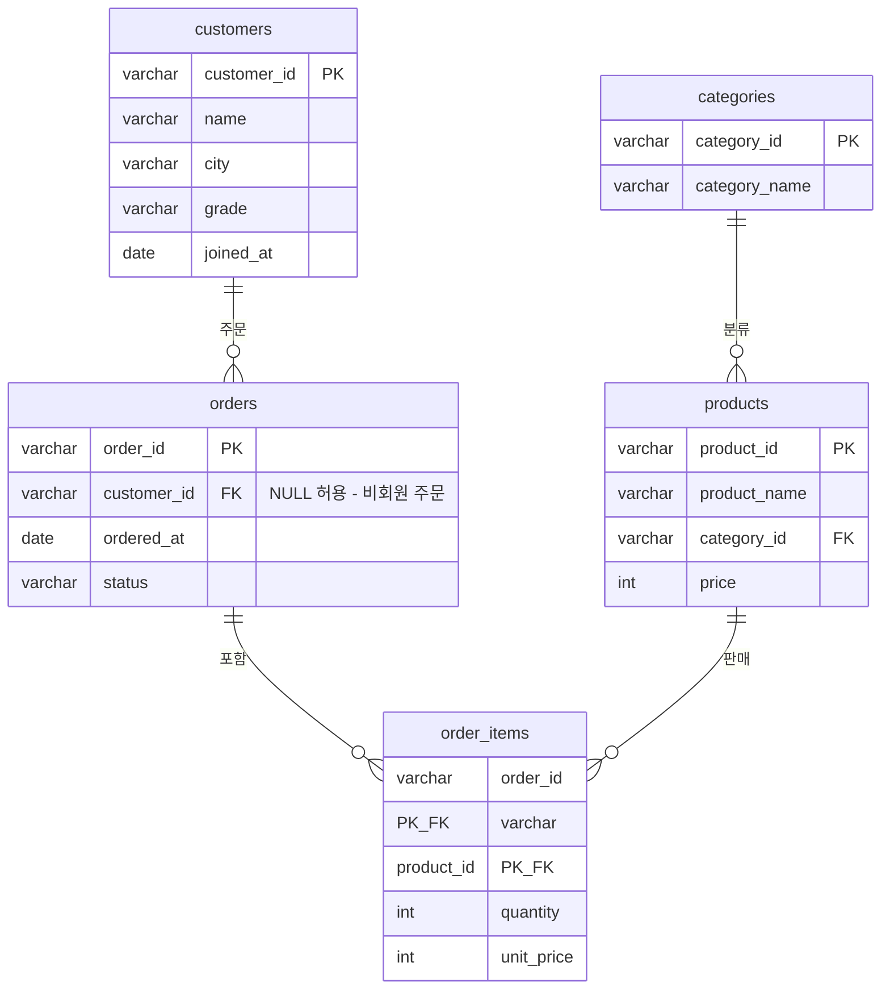
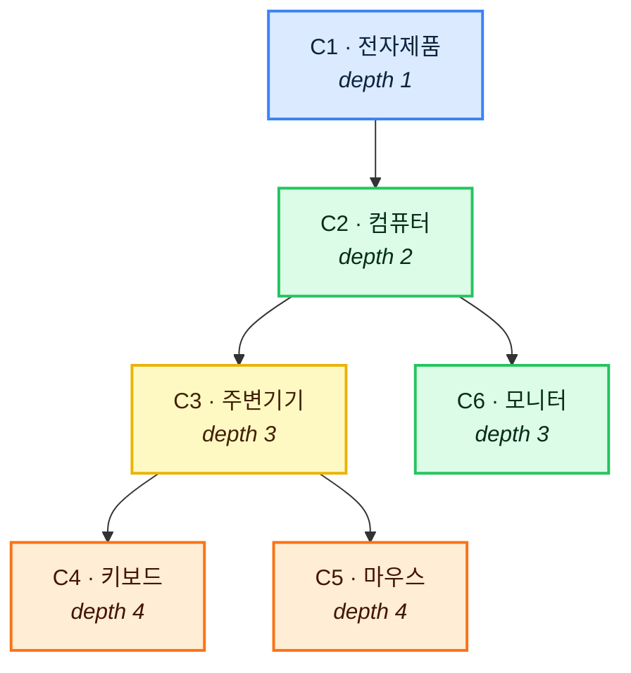
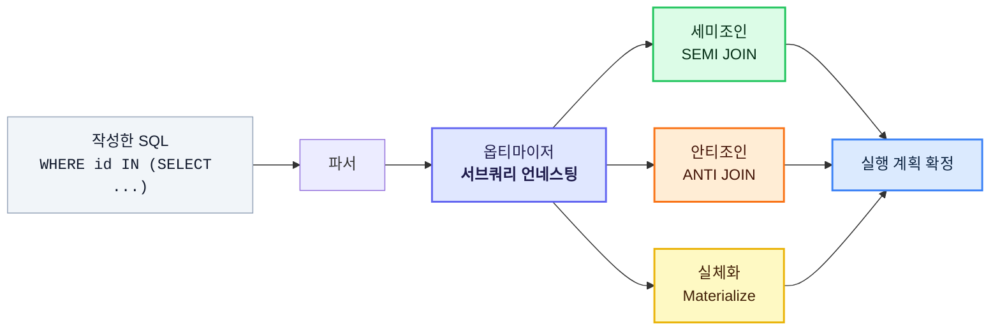

> 서브쿼리는 "쿼리 안의 쿼리"가 아니다. **아직 모르는 값을 질문으로 대신 채워 넣는 방법**이다.

서브쿼리는 SQL에서 가장 자주 쓰이면서, 동시에 가장 자주 잘못 쓰이는 문법이다. 문법 자체는 괄호 하나 치면 끝나는데, 막상 쓰다 보면 이런 벽에 부딪힌다.

- `NOT IN`을 썼는데 결과가 0건이 나온다
- `IN`을 `EXISTS`로 바꿨더니 갑자기 빨라졌다
- 어떤 서브쿼리는 조인으로 바꿔야 한다는데, 어떤 게 그런 건지 모르겠다

이 글은 그 벽을 하나씩 넘는 것이 목표다. **하나의 스키마**를 끝까지 쓰면서, 서브쿼리를 위치·동작·반환형 세 축으로 완전히 분해한다.

---

## 목차

1. [서브쿼리의 본질](#1-서브쿼리의-본질)
2. [실습 스키마 — 온라인 쇼핑몰](#2-실습-스키마--온라인-쇼핑몰)
3. [축 ① 위치 — 어디에 쓰이는가](#3-축--위치--어디에-쓰이는가)
4. [축 ② 동작 — 비상관 vs 상관](#4-축--동작--비상관-vs-상관)
5. [축 ③ 반환 형태 — 단일행·다중행·다중열](#5-축--반환-형태--단일행다중행다중열)
6. [연산자 총정리 — IN, ANY, ALL, EXISTS](#6-연산자-총정리--in-any-all-exists)
7. [⚠ NOT IN과 NULL — 가장 유명한 함정](#7-️-not-in과-null--가장-유명한-함정)
8. [스칼라 서브쿼리 깊게 보기](#8-스칼라-서브쿼리-깊게-보기)
9. [인라인 뷰 깊게 보기](#9-인라인-뷰-깊게-보기)
10. [CTE (WITH) — 이름 붙인 서브쿼리](#10-cte-with--이름-붙인-서브쿼리)
11. [DML에서의 서브쿼리](#11-dml에서의-서브쿼리)
12. [서브쿼리 vs JOIN — 무엇을 언제](#12-서브쿼리-vs-join--무엇을-언제)
13. [성능 — 세미조인, 안티조인, 언네스팅](#13-성능--세미조인-안티조인-언네스팅)
14. [실전 패턴 10선](#14-실전-패턴-10선)
15. [체크리스트 & FAQ](#15-체크리스트--faq)

---

## 1. 서브쿼리의 본질

### 왜 필요한가

"평균 주문 금액보다 비싼 주문을 찾아라"라는 요구를 생각해 보자.

```sql
-- X 이렇게 쓰고 싶지만 불가능하다
SELECT * FROM orders WHERE total_amount > AVG(total_amount);
```

집계 함수는 `WHERE`절에서 쓸 수 없다. `WHERE`가 평가되는 시점에는 아직 그룹이 만들어지지 않았기 때문이다. 그렇다고 사람이 직접 계산하면 이렇게 된다.

```sql
-- 1단계: 평균을 구한다
SELECT AVG(total_amount) FROM orders;  -- 결과: 87,500

-- 2단계: 그 값을 손으로 옮겨 적는다
SELECT * FROM orders WHERE total_amount > 87500;  --  내일이면 틀린 값이 된다
```

이 **두 단계를 하나로 합치는 것**이 서브쿼리다.

```sql
-- ✔ 값 자리에 질문을 대신 넣는다
SELECT * FROM orders
WHERE total_amount > (SELECT AVG(total_amount) FROM orders);
```

### 한 문장 정의

> **서브쿼리(Subquery)** 는 다른 SQL 문 안에 포함된 `SELECT` 문이다.
> 바깥쪽을 **주 쿼리(Outer Query / Main Query)**, 안쪽을 **서브쿼리(Inner Query)** 라고 부른다.

### 기본 규칙 4가지

| 규칙 | 설명 |
|---|---|
| 반드시 괄호로 감싼다 | `( SELECT ... )` |
| 주 쿼리보다 먼저 평가되는 게 원칙 | 비상관 서브쿼리의 경우 |
| 서브쿼리 안에서 `ORDER BY`는 보통 무의미 | `TOP-N`/`LIMIT`와 함께 쓸 때만 의미 있음 |
| 반환 형태와 연산자가 맞아야 한다 | 단일행 값에 `IN`, 다중행에 `=` 쓰면 에러 |

---

## 2. 실습 스키마 — 온라인 쇼핑몰

이 글 전체에서 쓸 스키마다.



```sql
CREATE TABLE categories (
    category_id    VARCHAR(10) PRIMARY KEY,
    category_name  VARCHAR(50) NOT NULL
);

CREATE TABLE products (
    product_id    VARCHAR(10) PRIMARY KEY,
    product_name  VARCHAR(100) NOT NULL,
    category_id   VARCHAR(10) REFERENCES categories(category_id),
    price         INT NOT NULL
);

CREATE TABLE customers (
    customer_id  VARCHAR(10) PRIMARY KEY,
    name         VARCHAR(50) NOT NULL,
    city         VARCHAR(50),
    grade        VARCHAR(10),           -- BASIC / SILVER / GOLD
    joined_at    DATE NOT NULL
);

CREATE TABLE orders (
    order_id     VARCHAR(10) PRIMARY KEY,
    customer_id  VARCHAR(10) NULL        --  비회원 주문은 NULL (7장의 복선)
                 REFERENCES customers(customer_id),
    ordered_at   DATE NOT NULL,
    status       VARCHAR(20) NOT NULL    -- PAID / CANCELLED / REFUNDED
);

CREATE TABLE order_items (
    order_id    VARCHAR(10) REFERENCES orders(order_id),
    product_id  VARCHAR(10) REFERENCES products(product_id),
    quantity    INT NOT NULL,
    unit_price  INT NOT NULL,
    PRIMARY KEY (order_id, product_id)
);
```

### 샘플 데이터

**customers**

| customer_id | name | city | grade | joined_at |
|---|---|---|---|---|
| C001 | 김민수 | 서울 | GOLD | 2024-03-11 |
| C002 | 이서연 | 부산 | SILVER | 2024-07-02 |
| C003 | 박지훈 | 서울 | GOLD | 2025-01-20 |
| C004 | 최유리 | 대전 | BASIC | 2025-05-08 |
| C005 | 정하늘 | 서울 | BASIC | 2026-02-14 |

**products**

| product_id | product_name | category_id | price |
|---|---|---|---|
| P01 | 기계식 키보드 | CAT01 | 129000 |
| P02 | 무선 마우스 | CAT01 | 45000 |
| P03 | 27인치 모니터 | CAT02 | 289000 |
| P04 | USB-C 허브 | CAT01 | 23000 |
| P05 | 노트북 거치대 | CAT02 | 38000 |

**orders**

| order_id | customer_id | ordered_at | status |
|---|---|---|---|
| O1001 | C001 | 2026-01-15 | PAID |
| O1002 | C002 | 2026-02-03 | PAID |
| O1003 | C001 | 2026-03-21 | CANCELLED |
| O1004 | C003 | 2026-04-02 | PAID |
| O1005 | **NULL** | 2026-05-11 | PAID |

**order_items**

| order_id | product_id | quantity | unit_price |
|---|---|---|---|
| O1001 | P01 | 1 | 129000 |
| O1001 | P02 | 2 | 45000 |
| O1002 | P03 | 1 | 289000 |
| O1003 | P04 | 3 | 23000 |
| O1004 | P01 | 1 | 129000 |
| O1005 | P05 | 1 | 38000 |

`C004(최유리)`, `C005(정하늘)`은 주문이 없고, `P05`를 산 주문은 **비회원 주문**이다. 이 두 가지가 뒤에서 계속 등장한다.

---

## 3. 축 ① 위치 — 어디에 쓰이는가

서브쿼리는 SQL 문의 거의 모든 자리에 들어갈 수 있다. **위치가 곧 이름**이다.

<svg viewBox="0 0 820 430" xmlns="http://www.w3.org/2000/svg" role="img" aria-label="서브쿼리가 쓰이는 위치 지도">
  <style>
    .sq1-code { font:14px ui-monospace, monospace; fill:#0f172a; }
    .sq1-kw   { font:bold 14px ui-monospace, monospace; fill:#7c3aed; }
    .sq1-h    { font:bold 17px sans-serif; fill:#0f172a; }
    .sq1-n    { font:12px sans-serif; fill:#475569; }
    .sq1-nb   { font:bold 12px sans-serif; fill:#0f172a; }
    .sq1-tag  { font:bold 11px sans-serif; fill:#ffffff; }
    .sq1-bg   { fill:#f8fafc; stroke:#cbd5e1; stroke-width:1.5; }
    .sq1-ln   { stroke:#94a3b8; stroke-width:1.5; stroke-dasharray:4 3; fill:none; }
    @media (prefers-color-scheme: dark) {
      .sq1-code { fill:#e2e8f0; } .sq1-kw { fill:#c4b5fd; }
      .sq1-h, .sq1-nb { fill:#f1f5f9; } .sq1-n { fill:#cbd5e1; }
      .sq1-bg { fill:#1e293b; stroke:#475569; }
    }
  </style>
  <text x="20" y="26" class="sq1-h">한 문장 안에서 서브쿼리가 앉을 수 있는 자리</text>
  <rect x="20" y="42" width="420" height="290" rx="10" class="sq1-bg"/>

  <text x="40" y="72" class="sq1-kw">SELECT</text>
  <text x="105" y="72" class="sq1-code">c.name,</text>
  <text x="105" y="96" class="sq1-code">(SELECT ...)  AS 주문수</text>
  <rect x="255" y="82" width="76" height="19" rx="9" fill="#f97316"/>
  <text x="293" y="96" text-anchor="middle" class="sq1-tag">스칼라</text>

  <text x="40" y="132" class="sq1-kw">FROM</text>
  <text x="105" y="132" class="sq1-code">(SELECT ...)  AS t</text>
  <rect x="255" y="118" width="90" height="19" rx="9" fill="#0ea5e9"/>
  <text x="300" y="132" text-anchor="middle" class="sq1-tag">인라인 뷰</text>

  <text x="40" y="168" class="sq1-kw">JOIN</text>
  <text x="105" y="168" class="sq1-code">(SELECT ...)  AS u ON ...</text>

  <text x="40" y="204" class="sq1-kw">WHERE</text>
  <text x="105" y="204" class="sq1-code">c.city IN (SELECT ...)</text>
  <rect x="330" y="190" width="82" height="19" rx="9" fill="#22c55e"/>
  <text x="371" y="204" text-anchor="middle" class="sq1-tag">중첩</text>

  <text x="40" y="240" class="sq1-kw">GROUP BY</text>
  <text x="145" y="240" class="sq1-code">c.grade</text>

  <text x="40" y="276" class="sq1-kw">HAVING</text>
  <text x="120" y="276" class="sq1-code">COUNT(*) &gt; (SELECT ...)</text>
  <rect x="330" y="262" width="82" height="19" rx="9" fill="#22c55e"/>
  <text x="371" y="276" text-anchor="middle" class="sq1-tag">중첩</text>

  <text x="40" y="312" class="sq1-kw">ORDER BY</text>
  <text x="145" y="312" class="sq1-code">c.name</text>

  <path class="sq1-ln" d="M340,92 C400,92 430,92 470,88"/>
  <path class="sq1-ln" d="M355,128 C410,128 440,140 470,150"/>
  <path class="sq1-ln" d="M420,200 C440,200 455,208 470,212"/>
  <path class="sq1-ln" d="M420,272 C440,272 455,278 470,280"/>

  <text x="478" y="74" class="sq1-nb">스칼라 서브쿼리</text>
  <text x="478" y="94" class="sq1-n">값 하나(1행 1열)를 반환.</text>
  <text x="478" y="112" class="sq1-n">컬럼처럼 붙는다.</text>

  <text x="478" y="150" class="sq1-nb">인라인 뷰 (Derived Table)</text>
  <text x="478" y="170" class="sq1-n">결과 집합이 임시 테이블이 된다.</text>
  <text x="478" y="188" class="sq1-n">별칭(alias)이 필수인 DB가 많다.</text>

  <text x="478" y="222" class="sq1-nb">중첩 서브쿼리 (Nested)</text>
  <text x="478" y="242" class="sq1-n">조건을 만드는 데 쓰인다.</text>
  <text x="478" y="260" class="sq1-n">IN / EXISTS / 비교연산자</text>

  <text x="478" y="294" class="sq1-nb">HAVING 절 서브쿼리</text>
  <text x="478" y="314" class="sq1-n">그룹 단위 조건에 쓰인다.</text>

  <rect x="20" y="345" width="780" height="70" rx="10" class="sq1-bg"/>
  <text x="40" y="370" class="sq1-nb">📌 SELECT / GROUP BY / ORDER BY 절에는 서브쿼리를 쓸 수 있지만,</text>
  <text x="40" y="394" class="sq1-n">GROUP BY 절 서브쿼리는 거의 쓰이지 않고, ORDER BY 절 서브쿼리는 정렬 기준을 외부에서 끌어올 때 가끔 쓴다.</text>
</svg>

### 3-1. SELECT 절 — 스칼라 서브쿼리

```sql
SELECT
    c.customer_id,
    c.name,
    (SELECT COUNT(*)
       FROM orders o
      WHERE o.customer_id = c.customer_id) AS 주문건수
FROM customers c;
```

| customer_id | name | 주문건수 |
|---|---|---|
| C001 | 김민수 | 2 |
| C002 | 이서연 | 1 |
| C003 | 박지훈 | 1 |
| C004 | 최유리 | 0 |
| C005 | 정하늘 | 0 |

주문이 없는 회원도 `0`으로 나오는 게 포인트다. `LEFT JOIN + COUNT`와 같은 결과다.

### 3-2. FROM 절 — 인라인 뷰

```sql
SELECT t.customer_id, t.총주문액
FROM (
    SELECT o.customer_id,
           SUM(oi.quantity * oi.unit_price) AS 총주문액
      FROM orders o
      JOIN order_items oi ON o.order_id = oi.order_id
     WHERE o.status = 'PAID'
     GROUP BY o.customer_id
) AS t                                  --  별칭 필수
WHERE t.총주문액 >= 200000;
```

집계 결과를 다시 필터링할 때 쓴다. `HAVING`으로도 되지만, 여러 단계 가공이 필요하면 인라인 뷰가 읽기 좋다.

### 3-3. WHERE 절 — 중첩 서브쿼리

```sql
-- 서울에 사는 회원의 주문만
SELECT * FROM orders
WHERE customer_id IN (
    SELECT customer_id FROM customers WHERE city = '서울'
);
```

### 3-4. HAVING 절

```sql
-- 평균보다 주문을 많이 한 회원
SELECT customer_id, COUNT(*) AS 주문수
FROM orders
GROUP BY customer_id
HAVING COUNT(*) > (
    SELECT AVG(cnt) FROM (
        SELECT COUNT(*) AS cnt FROM orders GROUP BY customer_id
    ) AS x
);
```

---

## 4. 축 ② 동작 — 비상관 vs 상관

**이 구분이 서브쿼리 이해의 핵심이자, 성능 문제의 진원지다.**

### 정의

| 구분 | 정의 | 판별법 |
|---|---|---|
| **비상관 (Non-correlated)** | 서브쿼리가 주 쿼리와 무관하게 혼자 실행된다 | 서브쿼리만 떼어내서 실행해도 **된다** |
| **상관 (Correlated)** | 서브쿼리가 주 쿼리의 컬럼을 참조한다 | 서브쿼리만 떼어내면 **에러가 난다** |

### 실행 흐름 비교

<svg viewBox="0 0 820 470" xmlns="http://www.w3.org/2000/svg" role="img" aria-label="비상관 서브쿼리와 상관 서브쿼리의 실행 흐름 비교">
  <style>
    .sq2-h   { font:bold 16px sans-serif; fill:#0f172a; }
    .sq2-t   { font:12px sans-serif; fill:#475569; }
    .sq2-tb  { font:bold 13px sans-serif; fill:#0f172a; }
    .sq2-code{ font:12px ui-monospace, monospace; fill:#1e293b; }
    .sq2-w   { font:bold 12px sans-serif; fill:#ffffff; }
    .sq2-bg  { fill:#f8fafc; stroke:#cbd5e1; stroke-width:1.5; }
    .sq2-row { fill:#ffffff; stroke:#cbd5e1; stroke-width:1; }
    .sq2-ar  { stroke:#64748b; stroke-width:2; fill:none; marker-end:url(#sq2A); }
    .sq2-arr { stroke:#dc2626; stroke-width:1.8; fill:none; marker-end:url(#sq2R); }
    @media (prefers-color-scheme: dark) {
      .sq2-h, .sq2-tb { fill:#f1f5f9; } .sq2-t { fill:#cbd5e1; }
      .sq2-bg { fill:#1e293b; stroke:#475569; }
      .sq2-row{ fill:#334155; stroke:#64748b; } .sq2-code { fill:#e2e8f0; }
      .sq2-ar { stroke:#cbd5e1; }
    }
  </style>
  <defs>
    <marker id="sq2A" markerWidth="9" markerHeight="9" refX="8" refY="3" orient="auto"><path d="M0,0 L0,6 L8,3 z" fill="#64748b"/></marker>
    <marker id="sq2R" markerWidth="9" markerHeight="9" refX="8" refY="3" orient="auto"><path d="M0,0 L0,6 L8,3 z" fill="#dc2626"/></marker>
  </defs>

  <!-- 왼쪽: 비상관 -->
  <rect x="15" y="15" width="385" height="440" rx="12" class="sq2-bg"/>
  <rect x="35" y="32" width="120" height="24" rx="12" fill="#22c55e"/>
  <text x="95" y="49" text-anchor="middle" class="sq2-w">비상관 서브쿼리</text>
  <text x="35" y="82" class="sq2-tb">서브쿼리가 딱 한 번만 실행된다</text>

  <rect x="35" y="96" width="345" height="52" rx="7" class="sq2-row"/>
  <text x="50" y="118" class="sq2-code">SELECT * FROM products</text>
  <text x="50" y="138" class="sq2-code">WHERE price &gt; (SELECT AVG(price) FROM products);</text>

  <rect x="120" y="168" width="180" height="38" rx="7" fill="#22c55e"/>
  <text x="210" y="192" text-anchor="middle" class="sq2-w">① 서브쿼리 1회 실행</text>
  <path class="sq2-ar" d="M210,208 L210,232"/>
  <rect x="140" y="234" width="140" height="32" rx="7" class="sq2-row"/>
  <text x="210" y="255" text-anchor="middle" class="sq2-code">결과: 104,800</text>
  <path class="sq2-ar" d="M210,268 L210,292"/>

  <rect x="100" y="294" width="220" height="34" rx="7" fill="#0ea5e9"/>
  <text x="210" y="316" text-anchor="middle" class="sq2-w">② 상수로 치환해서 1회 스캔</text>

  <text x="35" y="356" class="sq2-t">WHERE price &gt; 104800  ← 이 형태가 된다</text>
  <text x="35" y="384" class="sq2-tb">총 실행 횟수</text>
  <text x="35" y="410" class="sq2-t">서브쿼리 1회 + 주 쿼리 1회</text>
  <text x="35" y="436" class="sq2-t">→ 행 수가 늘어나도 서브쿼리 비용은 그대로</text>

  <!-- 오른쪽: 상관 -->
  <rect x="420" y="15" width="385" height="440" rx="12" class="sq2-bg"/>
  <rect x="440" y="32" width="120" height="24" rx="12" fill="#f97316"/>
  <text x="500" y="49" text-anchor="middle" class="sq2-w">상관 서브쿼리</text>
  <text x="440" y="82" class="sq2-tb">주 쿼리의 행마다 반복 실행된다</text>

  <rect x="440" y="96" width="345" height="52" rx="7" class="sq2-row"/>
  <text x="455" y="118" class="sq2-code">SELECT * FROM products p WHERE p.price &gt;</text>
  <text x="455" y="138" class="sq2-code">(SELECT AVG(price) FROM products WHERE category_id = p.category_id);</text>

  <rect x="440" y="168" width="345" height="30" rx="6" class="sq2-row"/>
  <text x="455" y="188" class="sq2-code">행 1: P01 → 서브쿼리 실행 (CAT01 평균)</text>
  <rect x="440" y="202" width="345" height="30" rx="6" class="sq2-row"/>
  <text x="455" y="222" class="sq2-code">행 2: P02 → 서브쿼리 실행 (CAT01 평균)</text>
  <rect x="440" y="236" width="345" height="30" rx="6" class="sq2-row"/>
  <text x="455" y="256" class="sq2-code">행 3: P03 → 서브쿼리 실행 (CAT02 평균)</text>
  <rect x="440" y="270" width="345" height="30" rx="6" class="sq2-row"/>
  <text x="455" y="290" class="sq2-code">행 4: P04 → 서브쿼리 실행 ...</text>
  <text x="455" y="318" class="sq2-code">⋮</text>

  <path class="sq2-arr" d="M425,183 C408,183 408,217 425,217"/>
  <path class="sq2-arr" d="M425,217 C408,217 408,251 425,251"/>
  <path class="sq2-arr" d="M425,251 C408,251 408,285 425,285"/>

  <text x="440" y="356" class="sq2-t">p.category_id 값이 매번 달라지므로 캐시가 어렵다</text>
  <text x="440" y="384" class="sq2-tb">총 실행 횟수</text>
  <text x="440" y="410" class="sq2-t">주 쿼리 행 수(N)만큼 서브쿼리 실행</text>
  <text x="440" y="436" class="sq2-t">→ N이 100만이면 100만 번. 인덱스가 생명줄이다.</text>
</svg>

### 코드로 확인

```sql
-- 🟢 비상관: 서브쿼리만 떼어내도 실행된다
SELECT AVG(price) FROM products;   -- ✔ 정상 동작

SELECT * FROM products
WHERE price > (SELECT AVG(price) FROM products);
```

```sql
-- 🟠 상관: 서브쿼리만 떼어내면 에러
SELECT AVG(price) FROM products WHERE category_id = p.category_id;
-- X ERROR: 'p' 별칭을 알 수 없음

-- 주 쿼리 안에서만 의미를 가진다
SELECT p.product_name, p.price
FROM products p
WHERE p.price > (
    SELECT AVG(price) FROM products
     WHERE category_id = p.category_id   --  바깥의 p를 참조
);
```

**"카테고리별 평균보다 비싼 상품"** — 이게 상관 서브쿼리의 전형적 용도다. 비교 기준이 행마다 달라진다.

결과:

| product_name | price | (소속 카테고리 평균) |
|---|---|---|
| 기계식 키보드 | 129,000 | CAT01 평균 65,667 |
| 27인치 모니터 | 289,000 | CAT02 평균 163,500 |

### 실행 순서 요약

<svg width="100%" viewBox="0 0 680 442" role="img" xmlns="http://www.w3.org/2000/svg"
     font-family="'Pretendard','Apple SD Gothic Neo','Malgun Gothic',sans-serif">
  <title>비상관 서브쿼리와 상관 서브쿼리 비교</title>
  <desc>비상관은 1회, 상관은 행마다 N회 실행된다는 차이</desc>
  <style>
    .t12{font-size:12px;fill:#334155}
    .hd {font-size:13.5px;font-weight:500;fill:#0f172a}
    .box{fill:#f8fafc;stroke:#cbd5e1;stroke-width:.8}
    .ok {fill:#ecfdf5;stroke:#10b981;stroke-width:.8}
    .oktx{fill:#065f46}
    .hot{fill:#fff1ec;stroke:#e07a5f;stroke-width:.8}
    .hottx{fill:#8c3a1f}
    .pane{fill:none;stroke:#cbd5e1;stroke-width:.8;stroke-dasharray:4 4}
    .arr{stroke:#94a3b8;stroke-width:1.4;fill:none}
    @media (prefers-color-scheme: dark){
      .t12{fill:#cbd5e1}.hd{fill:#f1f5f9}
      .box{fill:#1e293b;stroke:#475569}
      .ok{fill:#064e3b;stroke:#34d399}.oktx{fill:#d1fae5}
      .hot{fill:#5c2718;stroke:#f0997b}.hottx{fill:#fadbd0}
      .pane{stroke:#475569}.arr{stroke:#64748b}
    }
  </style>
  <defs>
    <marker id="ar" viewBox="0 0 10 10" refX="8" refY="5" markerWidth="6" markerHeight="6" orient="auto-start-reverse">
      <path d="M2 1L8 5L2 9" fill="none" stroke="context-stroke" stroke-width="1.5" stroke-linecap="round" stroke-linejoin="round"/>
    </marker>
  </defs>

  <rect class="pane" x="14" y="34" width="318" height="388" rx="12"/>
  <text class="hd" x="173" y="58" text-anchor="middle" dominant-baseline="central">비상관 서브쿼리</text>

  <rect class="ok" x="44" y="78" width="258" height="52" rx="8"/>
  <text class="t12 oktx" x="173" y="97" text-anchor="middle" dominant-baseline="central">서브쿼리를 먼저 실행</text>
  <text class="t12 oktx" x="173" y="115" text-anchor="middle" dominant-baseline="central">전체에서 딱 1회</text>
  <line class="arr" x1="173" y1="130" x2="173" y2="142" marker-end="url(#ar)"/>

  <rect class="box" x="44" y="146" width="258" height="52" rx="8"/>
  <text class="t12" x="173" y="172" text-anchor="middle" dominant-baseline="central">결과를 상수처럼 치환</text>
  <line class="arr" x1="173" y1="198" x2="173" y2="210" marker-end="url(#ar)"/>

  <rect class="ok" x="44" y="214" width="258" height="52" rx="8"/>
  <text class="t12 oktx" x="173" y="240" text-anchor="middle" dominant-baseline="central">주 쿼리를 한 번 실행</text>
  <line class="arr" x1="173" y1="266" x2="173" y2="296" marker-end="url(#ar)"/>

  <rect class="box" x="44" y="300" width="258" height="52" rx="8"/>
  <text class="t12" x="173" y="319" text-anchor="middle" dominant-baseline="central">행이 100만 개여도</text>
  <text class="t12" x="173" y="337" text-anchor="middle" dominant-baseline="central">서브쿼리 실행 횟수는 그대로</text>

  <rect class="ok" x="44" y="368" width="258" height="34" rx="8"/>
  <text class="hd oktx" x="173" y="385" text-anchor="middle" dominant-baseline="central">서브쿼리 실행 1회</text>

  <rect class="pane" x="348" y="34" width="318" height="388" rx="12"/>
  <text class="hd" x="507" y="58" text-anchor="middle" dominant-baseline="central">상관 서브쿼리</text>

  <rect class="hot" x="378" y="78" width="258" height="52" rx="8"/>
  <text class="t12 hottx" x="507" y="97" text-anchor="middle" dominant-baseline="central">주 쿼리 행 하나를 읽어</text>
  <text class="t12 hottx" x="507" y="115" text-anchor="middle" dominant-baseline="central">그 값을 서브쿼리에 전달</text>
  <line class="arr" x1="507" y1="130" x2="507" y2="142" marker-end="url(#ar)"/>

  <rect class="hot" x="378" y="146" width="258" height="52" rx="8"/>
  <text class="t12 hottx" x="507" y="165" text-anchor="middle" dominant-baseline="central">그 행 전용으로</text>
  <text class="t12 hottx" x="507" y="183" text-anchor="middle" dominant-baseline="central">서브쿼리 실행</text>
  <line class="arr" x1="507" y1="198" x2="507" y2="210" marker-end="url(#ar)"/>

  <rect class="box" x="378" y="214" width="258" height="52" rx="8"/>
  <text class="t12" x="507" y="233" text-anchor="middle" dominant-baseline="central">조건 만족하면 결과에 포함</text>
  <text class="t12" x="507" y="251" text-anchor="middle" dominant-baseline="central">아니면 버림</text>
  <line class="arr" x1="507" y1="266" x2="507" y2="296" marker-end="url(#ar)"/>
  <text class="t12" x="519" y="284" dominant-baseline="central">↻ 다음 행 반복</text>

  <rect class="box" x="378" y="300" width="258" height="52" rx="8"/>
  <text class="t12" x="507" y="326" text-anchor="middle" dominant-baseline="central">모든 행이 끝나면 종료</text>

  <rect class="hot" x="378" y="368" width="258" height="34" rx="8"/>
  <text class="hd hottx" x="507" y="385" text-anchor="middle" dominant-baseline="central">서브쿼리 실행 N회</text>
</svg>

> ⚠ 위 그림은 **개념적 실행 순서**다. 실제로는 옵티마이저가 상관 서브쿼리를 조인으로 바꿔버리는 경우가 많다. 13장에서 다룬다.

---

## 5. 축 ③ 반환 형태 — 단일행·다중행·다중열

**서브쿼리가 몇 행 몇 열을 반환하느냐**에 따라 쓸 수 있는 연산자가 달라진다. 여기서 에러가 제일 많이 난다.

<svg viewBox="0 0 800 400" xmlns="http://www.w3.org/2000/svg" role="img" aria-label="서브쿼리 반환 형태별 사용 가능 연산자">
  <style>
    .sq3-h  { font:bold 16px sans-serif; fill:#0f172a; }
    .sq3-tb { font:bold 14px sans-serif; fill:#0f172a; }
    .sq3-t  { font:12px sans-serif; fill:#475569; }
    .sq3-c  { font:12px ui-monospace, monospace; fill:#1e293b; }
    .sq3-w  { font:bold 12px sans-serif; fill:#ffffff; }
    .sq3-bg { fill:#f8fafc; stroke:#cbd5e1; stroke-width:1.5; }
    .sq3-cell{ fill:#ffffff; stroke:#94a3b8; stroke-width:1; }
    .sq3-fill{ fill:#dbeafe; stroke:#3b82f6; stroke-width:1.5; }
    @media (prefers-color-scheme: dark) {
      .sq3-h, .sq3-tb { fill:#f1f5f9; } .sq3-t { fill:#cbd5e1; } .sq3-c { fill:#e2e8f0; }
      .sq3-bg { fill:#1e293b; stroke:#475569; }
      .sq3-cell { fill:#334155; stroke:#94a3b8; } .sq3-fill { fill:#1e3a5f; stroke:#60a5fa; }
    }
  </style>
  <text x="20" y="26" class="sq3-h">반환 형태 → 쓸 수 있는 연산자</text>

  <!-- 단일행 -->
  <rect x="20" y="42" width="250" height="165" rx="10" class="sq3-bg"/>
  <rect x="40" y="58" width="112" height="22" rx="11" fill="#22c55e"/>
  <text x="96" y="74" text-anchor="middle" class="sq3-w">단일행 서브쿼리</text>
  <rect x="42" y="92" width="46" height="26" class="sq3-fill"/>
  <text x="65" y="110" text-anchor="middle" class="sq3-c">1</text>
  <text x="100" y="110" class="sq3-t">1행 × 1열 = 값 하나</text>
  <text x="42" y="140" class="sq3-tb">= &lt;&gt; &gt; &gt;= &lt; &lt;=</text>
  <text x="42" y="164" class="sq3-t">스칼라 서브쿼리라고도 한다.</text>
  <text x="42" y="184" class="sq3-t">2행 이상 나오면 즉시 런타임 에러.</text>

  <!-- 다중행 -->
  <rect x="285" y="42" width="250" height="165" rx="10" class="sq3-bg"/>
  <rect x="305" y="58" width="112" height="22" rx="11" fill="#0ea5e9"/>
  <text x="361" y="74" text-anchor="middle" class="sq3-w">다중행 서브쿼리</text>
  <rect x="307" y="92" width="46" height="26" class="sq3-fill"/>
  <rect x="307" y="118" width="46" height="26" class="sq3-fill"/>
  <rect x="307" y="144" width="46" height="26" class="sq3-fill"/>
  <text x="365" y="110" class="sq3-t">N행 × 1열 = 값 목록</text>
  <text x="365" y="134" class="sq3-tb">IN, NOT IN</text>
  <text x="365" y="154" class="sq3-tb">ANY / SOME, ALL</text>
  <text x="365" y="174" class="sq3-tb">EXISTS, NOT EXISTS</text>
  <text x="307" y="196" class="sq3-t">= 를 쓰면 에러가 난다.</text>

  <!-- 다중열 -->
  <rect x="550" y="42" width="230" height="165" rx="10" class="sq3-bg"/>
  <rect x="570" y="58" width="112" height="22" rx="11" fill="#8b5cf6"/>
  <text x="626" y="74" text-anchor="middle" class="sq3-w">다중열 서브쿼리</text>
  <rect x="572" y="92" width="40" height="26" class="sq3-fill"/>
  <rect x="612" y="92" width="40" height="26" class="sq3-fill"/>
  <rect x="572" y="118" width="40" height="26" class="sq3-fill"/>
  <rect x="612" y="118" width="40" height="26" class="sq3-fill"/>
  <text x="664" y="110" class="sq3-t">N행 × M열</text>
  <text x="572" y="166" class="sq3-tb">(a, b) IN (SELECT x, y ...)</text>
  <text x="572" y="190" class="sq3-t">튜플 비교. Oracle·MySQL·</text>
  <text x="572" y="206" class="sq3-t">PostgreSQL 지원.</text>

  <!-- 하단 에러 박스 -->
  <rect x="20" y="225" width="760" height="160" rx="10" class="sq3-bg"/>
  <text x="40" y="252" class="sq3-h">![star] 가장 흔한 에러 두 가지</text>

  <text x="40" y="282" class="sq3-tb">① 단일행 연산자에 다중행이 왔을 때</text>
  <text x="40" y="304" class="sq3-c">SELECT * FROM customers WHERE customer_id = (SELECT customer_id FROM orders);</text>
  <text x="40" y="324" class="sq3-t">→ ORA-01427 / &quot;Subquery returns more than 1 row&quot; ... 해결: = 를 IN 으로 바꾼다</text>

  <text x="40" y="352" class="sq3-tb">② SELECT 절 스칼라 서브쿼리가 2행을 반환할 때</text>
  <text x="40" y="374" class="sq3-t">→ 평소엔 잘 돌다가 데이터가 늘어난 어느 날 갑자기 터진다. 가장 위험한 유형이다.</text>
</svg>

### 예제로 확인

```sql
-- ① 단일행: 가장 비싼 상품
SELECT * FROM products
WHERE price = (SELECT MAX(price) FROM products);
```

```sql
-- ② 다중행: 서울 회원이 주문한 건들
SELECT * FROM orders
WHERE customer_id IN (SELECT customer_id FROM customers WHERE city = '서울');
```

```sql
-- ③ 다중열: (주문번호, 상품번호) 조합으로 매칭
SELECT * FROM order_items
WHERE (order_id, product_id) IN (
    SELECT order_id, product_id
      FROM order_items
     WHERE quantity >= 2
);
```

```sql
-- X 흔한 실수: 다중행에 = 를 썼다
SELECT * FROM customers
WHERE customer_id = (SELECT customer_id FROM orders);
-- ERROR: subquery returns more than one row

-- ✔ 수정
SELECT * FROM customers
WHERE customer_id IN (SELECT customer_id FROM orders);
```

> ![star] **안전 장치**
> 단일행이 확실하지 않다면 `LIMIT 1`(MySQL/PostgreSQL) 또는 `ROWNUM = 1`(Oracle), 혹은 `MAX()`/`MIN()`으로 감싸서 **반드시 1행이 되도록** 강제하는 습관을 들이면 좋다.

---

## 6. 연산자 총정리 — IN, ANY, ALL, EXISTS

### 6-1. IN / NOT IN

목록 안에 있는지 검사한다. 가장 직관적이다.

```sql
-- GOLD 등급 회원의 주문
SELECT * FROM orders
WHERE customer_id IN (SELECT customer_id FROM customers WHERE grade = 'GOLD');
```

### 6-2. ANY / SOME

`ANY`는 **하나라도 만족하면 참**이다. `SOME`은 완전한 동의어다.

```sql
-- CAT01 카테고리 상품 중 아무거나보다 비싼 상품
SELECT * FROM products
WHERE price > ANY (SELECT price FROM products WHERE category_id = 'CAT01');
-- → CAT01 최저가(23,000)보다 비싸면 통과
```

| 표현 | 의미 |
|---|---|
| `> ANY (목록)` | **최솟값**보다 크면 참 |
| `< ANY (목록)` | **최댓값**보다 작으면 참 |
| `= ANY (목록)` | `IN`과 완전히 동일 |

### 6-3. ALL

`ALL`은 **전부 만족해야 참**이다.

```sql
-- CAT01 상품 전부보다 비싼 상품
SELECT * FROM products
WHERE price > ALL (SELECT price FROM products WHERE category_id = 'CAT01');
-- → CAT01 최고가(129,000)보다 비싸야 통과 → 27인치 모니터만
```

| 표현 | 의미 |
|---|---|
| `> ALL (목록)` | **최댓값**보다 크면 참 |
| `< ALL (목록)` | **최솟값**보다 작으면 참 |
| `<> ALL (목록)` | `NOT IN`과 동일 |

> ![star] **외우는 법**
> `ANY`는 문턱이 낮다 → 극값 중 **쉬운 쪽**과 비교
> `ALL`은 문턱이 높다 → 극값 중 **어려운 쪽**과 비교

### 6-4. EXISTS / NOT EXISTS

`EXISTS`는 다르게 동작한다. **값을 비교하지 않고, 행이 하나라도 있는지만 본다.**

```sql
-- 주문한 적 있는 회원
SELECT * FROM customers c
WHERE EXISTS (
    SELECT 1 FROM orders o WHERE o.customer_id = c.customer_id
);
```

<svg viewBox="0 0 800 330" xmlns="http://www.w3.org/2000/svg" role="img" aria-label="IN과 EXISTS의 동작 차이">
  <style>
    .sq4-h  { font:bold 16px sans-serif; fill:#0f172a; }
    .sq4-tb { font:bold 13px sans-serif; fill:#0f172a; }
    .sq4-t  { font:12px sans-serif; fill:#475569; }
    .sq4-c  { font:12px ui-monospace, monospace; fill:#1e293b; }
    .sq4-w  { font:bold 12px sans-serif; fill:#ffffff; }
    .sq4-bg { fill:#f8fafc; stroke:#cbd5e1; stroke-width:1.5; }
    .sq4-box{ fill:#ffffff; stroke:#94a3b8; stroke-width:1.2; }
    @media (prefers-color-scheme: dark) {
      .sq4-h, .sq4-tb { fill:#f1f5f9; } .sq4-t { fill:#cbd5e1; } .sq4-c { fill:#e2e8f0; }
      .sq4-bg { fill:#1e293b; stroke:#475569; } .sq4-box { fill:#334155; stroke:#94a3b8; }
    }
  </style>
  <text x="20" y="26" class="sq4-h">IN 과 EXISTS 는 무엇을 &quot;확인&quot;하는가</text>

  <rect x="20" y="42" width="375" height="270" rx="10" class="sq4-bg"/>
  <rect x="40" y="58" width="60" height="22" rx="11" fill="#0ea5e9"/>
  <text x="70" y="74" text-anchor="middle" class="sq4-w">IN</text>
  <text x="40" y="102" class="sq4-tb">값의 목록을 만들어 놓고 대조한다</text>

  <rect x="40" y="116" width="150" height="118" rx="7" class="sq4-box"/>
  <text x="115" y="136" text-anchor="middle" class="sq4-t">서브쿼리 결과 목록</text>
  <text x="115" y="160" text-anchor="middle" class="sq4-c">C001</text>
  <text x="115" y="180" text-anchor="middle" class="sq4-c">C002</text>
  <text x="115" y="200" text-anchor="middle" class="sq4-c">C001</text>
  <text x="115" y="220" text-anchor="middle" class="sq4-c">C003</text>

  <text x="210" y="160" class="sq4-t">이 목록 전체가</text>
  <text x="210" y="180" class="sq4-t">먼저 만들어진다.</text>
  <text x="210" y="206" class="sq4-t">그 다음 바깥 값과</text>
  <text x="210" y="226" class="sq4-t">하나씩 대조한다.</text>

  <text x="40" y="262" class="sq4-t">• 서브쿼리 결과가 작을 때 유리</text>
  <text x="40" y="282" class="sq4-t">• 중복 제거 비용이 발생할 수 있음</text>
  <text x="40" y="302" class="sq4-t">• NULL이 섞이면 NOT IN에서 사고 발생 ⚠</text>

  <rect x="415" y="42" width="365" height="270" rx="10" class="sq4-bg"/>
  <rect x="435" y="58" width="80" height="22" rx="11" fill="#22c55e"/>
  <text x="475" y="74" text-anchor="middle" class="sq4-w">EXISTS</text>
  <text x="435" y="102" class="sq4-tb">한 건이라도 찾으면 즉시 멈춘다</text>

  <rect x="435" y="116" width="150" height="118" rx="7" class="sq4-box"/>
  <text x="510" y="136" text-anchor="middle" class="sq4-t">서브쿼리 스캔</text>
  <text x="510" y="162" text-anchor="middle" class="sq4-c">C001 ← 찾았다!</text>
  <text x="510" y="186" text-anchor="middle" class="sq4-t">🛑 여기서 중단</text>
  <text x="510" y="212" text-anchor="middle" class="sq4-t">(나머지는 안 봄)</text>

  <text x="605" y="160" class="sq4-t">TRUE / FALSE 만</text>
  <text x="605" y="180" class="sq4-t">돌려준다.</text>
  <text x="605" y="206" class="sq4-t">SELECT 절에 뭘 쓰든</text>
  <text x="605" y="226" class="sq4-t">결과가 같다.</text>

  <text x="435" y="262" class="sq4-t">• 서브쿼리 결과가 클 때 유리</text>
  <text x="435" y="282" class="sq4-t">• 조기 종료(short-circuit)로 빠름</text>
  <text x="435" y="302" class="sq4-t">• NULL에 안전하다 ✔</text>
</svg>

`EXISTS` 안의 `SELECT` 목록은 **아무 의미가 없다.** 다음 셋은 완전히 동일하다.

```sql
WHERE EXISTS (SELECT 1    FROM orders o WHERE o.customer_id = c.customer_id)
WHERE EXISTS (SELECT *    FROM orders o WHERE o.customer_id = c.customer_id)
WHERE EXISTS (SELECT NULL FROM orders o WHERE o.customer_id = c.customer_id)
```

관례적으로 `SELECT 1`을 많이 쓴다. "값을 안 본다"는 의도를 드러내기 때문이다.

### 연산자 선택 요약

| 하고 싶은 것 | 추천 |
|---|---|
| 목록에 포함되는가 | `IN` |
| 목록에 없는가 (NULL 가능성 있음) | **`NOT EXISTS`** |
| 관련 행이 존재하는가 | `EXISTS` |
| 관련 행이 하나도 없는가 | `NOT EXISTS` |
| 최댓값/최솟값과 비교 | `> ALL` / `> ANY` 또는 `MAX()`/`MIN()` |

---

## 7. ⚠ NOT IN과 NULL — 가장 유명한 함정

**이 장 하나만 알아도 이 글을 읽은 값어치는 한다.**

### 사건 발생

"한 번도 주문하지 않은 회원을 찾아라"

```sql
SELECT * FROM customers
WHERE customer_id NOT IN (SELECT customer_id FROM orders);
```

우리는 `C004(최유리)`, `C005(정하늘)`이 나오길 기대한다. 그런데 실제 결과는?

```
(0 rows)
```

**아무것도 안 나온다.** 문법 에러도 아니고, 경고도 없다. 조용히 틀린 답을 준다.

### 원인 — 3값 논리

원인은 `orders` 테이블의 `O1005`(비회원 주문)에 있는 `customer_id = NULL`이다.

SQL은 `TRUE`/`FALSE`만 있는 게 아니라 **`UNKNOWN`이 있는 3값 논리**를 쓴다. `NULL`과의 비교는 전부 `UNKNOWN`이다.

<svg viewBox="0 0 800 420" xmlns="http://www.w3.org/2000/svg" role="img" aria-label="NOT IN과 NULL의 3값 논리 전개">
  <style>
    .sq5-h  { font:bold 16px sans-serif; fill:#0f172a; }
    .sq5-tb { font:bold 13px sans-serif; fill:#0f172a; }
    .sq5-t  { font:12.5px sans-serif; fill:#475569; }
    .sq5-c  { font:13px ui-monospace, monospace; fill:#1e293b; }
    .sq5-cb { font:bold 13px ui-monospace, monospace; fill:#dc2626; }
    .sq5-ok { font:bold 13px ui-monospace, monospace; fill:#16a34a; }
    .sq5-bg { fill:#f8fafc; stroke:#cbd5e1; stroke-width:1.5; }
    .sq5-warn{ fill:#fef2f2; stroke:#ef4444; stroke-width:2; }
    .sq5-good{ fill:#f0fdf4; stroke:#22c55e; stroke-width:2; }
    @media (prefers-color-scheme: dark) {
      .sq5-h, .sq5-tb { fill:#f1f5f9; } .sq5-t { fill:#cbd5e1; } .sq5-c { fill:#e2e8f0; }
      .sq5-bg { fill:#1e293b; stroke:#475569; }
      .sq5-warn{ fill:#3f1d1d; stroke:#f87171; } .sq5-good{ fill:#14432a; stroke:#4ade80; }
    }
  </style>
  <text x="20" y="26" class="sq5-h">NOT IN 이 조용히 0건을 반환하는 이유</text>

  <rect x="20" y="40" width="760" height="182" rx="10" class="sq5-warn"/>
  <text x="40" y="66" class="sq5-tb">C004(최유리)를 검사해 보자. 서브쿼리 결과는 { C001, C002, C001, C003, NULL } 이다.</text>

  <text x="40" y="96" class="sq5-c">'C004' NOT IN ('C001', 'C002', 'C001', 'C003', NULL)</text>
  <text x="40" y="120" class="sq5-t">↓ SQL은 이걸 이렇게 풀어 쓴다</text>
  <text x="40" y="146" class="sq5-c">'C004' &lt;&gt; 'C001'  AND  'C004' &lt;&gt; 'C002'  AND  'C004' &lt;&gt; 'C003'  AND  'C004' &lt;&gt; NULL</text>
  <text x="40" y="172" class="sq5-c">      TRUE      AND        TRUE      AND        TRUE      AND    </text>
  <text x="440" y="172" class="sq5-cb">UNKNOWN</text>
  <text x="40" y="200" class="sq5-c">= </text>
  <text x="62" y="200" class="sq5-cb">UNKNOWN</text>
  <text x="150" y="200" class="sq5-t">→ WHERE 절은 TRUE가 아닌 행을 버린다 → 이 행은 탈락</text>

  <rect x="20" y="234" width="370" height="84" rx="10" class="sq5-bg"/>
  <text x="40" y="258" class="sq5-tb">AND 진리표 (3값 논리)</text>
  <text x="40" y="282" class="sq5-c">TRUE    AND UNKNOWN = UNKNOWN</text>
  <text x="40" y="304" class="sq5-c">FALSE   AND UNKNOWN = FALSE</text>

  <rect x="410" y="234" width="370" height="84" rx="10" class="sq5-bg"/>
  <text x="430" y="258" class="sq5-tb">OR 진리표 (3값 논리)</text>
  <text x="430" y="282" class="sq5-c">TRUE    OR  UNKNOWN = TRUE</text>
  <text x="430" y="304" class="sq5-c">FALSE   OR  UNKNOWN = UNKNOWN</text>

  <rect x="20" y="330" width="760" height="80" rx="10" class="sq5-good"/>
  <text x="40" y="356" class="sq5-tb">![star] 결론</text>
  <text x="40" y="380" class="sq5-t">NOT IN 목록에 NULL이 단 하나라도 있으면, 전체 결과는 항상 0건이 된다.</text>
  <text x="40" y="400" class="sq5-t">반면 IN 은 OR로 전개되므로 TRUE가 하나만 있으면 살아남는다 → 상대적으로 안전하다.</text>
</svg>

### `IN`은 왜 괜찮은가

```sql
'C001' IN ('C001', 'C002', NULL)
= ('C001'='C001') OR ('C001'='C002') OR ('C001'=NULL)
=      TRUE       OR      FALSE      OR    UNKNOWN
= TRUE   ✔ 정상 동작
```

`OR`은 `TRUE`가 하나만 있으면 되므로 `UNKNOWN`이 묻힌다. 그래서 `IN`은 문제가 잘 드러나지 않는다. **문제는 오직 `NOT IN`에서만 터진다.**

### 해결 방법 3가지

```sql
-- ✔ 방법 1 (권장): NOT EXISTS 로 바꾼다
SELECT * FROM customers c
WHERE NOT EXISTS (
    SELECT 1 FROM orders o WHERE o.customer_id = c.customer_id
);
-- EXISTS는 "행이 있냐"만 보므로 NULL과 무관하다
```

```sql
-- ✔ 방법 2: 서브쿼리에서 NULL을 걸러낸다
SELECT * FROM customers
WHERE customer_id NOT IN (
    SELECT customer_id FROM orders WHERE customer_id IS NOT NULL
);
```

```sql
-- ✔ 방법 3: LEFT JOIN + IS NULL (안티조인)
SELECT c.*
FROM customers c
LEFT JOIN orders o ON c.customer_id = o.customer_id
WHERE o.customer_id IS NULL;
```

세 방법 모두 정확히 `C004`, `C005`를 반환한다.

| 방법 | 안전성 | 가독성 | 비고 |
|---|---|---|---|
| `NOT EXISTS` | ✔ | ✔ | **기본값으로 삼자** |
| `IS NOT NULL` 추가 | ✔ | △ | 실수로 빼먹기 쉬움 |
| `LEFT JOIN + IS NULL` | ✔ | △ | 옵티마이저가 안티조인으로 잘 처리 |

> ![star] **실무 규칙**
> **"부정 조건에는 `NOT EXISTS`를 쓴다."**
> 서브쿼리 대상 컬럼에 `NOT NULL` 제약이 걸려 있다는 걸 **직접 확인한 경우에만** `NOT IN`을 쓴다. 나중에 누가 컬럼을 nullable로 바꾸면 그 순간 모든 쿼리가 조용히 망가진다.

### 비슷한 함정 — 집계 함수와 NULL

```sql
-- COUNT(*) 와 COUNT(컬럼) 은 다르다
SELECT COUNT(*)           FROM orders;  -- 5  (NULL 행 포함)
SELECT COUNT(customer_id) FROM orders;  -- 4  (NULL 제외)

-- AVG는 NULL을 아예 분모에서 뺀다
SELECT AVG(price) FROM products;  -- NULL 행은 계산에서 제외됨
```

---

## 8. 스칼라 서브쿼리 깊게 보기

### 정의와 위치

**1행 1열**을 반환하는 서브쿼리다. 값이 놓일 수 있는 자리라면 대부분 들어갈 수 있다.

```sql
SELECT
    p.product_name,
    p.price,
    -- ① SELECT 절
    (SELECT c.category_name
       FROM categories c
      WHERE c.category_id = p.category_id) AS 카테고리명,
    p.price - (SELECT AVG(price) FROM products) AS 평균과의차이
FROM products p
-- ② WHERE 절
WHERE p.price > (SELECT AVG(price) FROM products)
-- ③ ORDER BY 절
ORDER BY (SELECT COUNT(*) FROM order_items oi WHERE oi.product_id = p.product_id) DESC;
```

### 주의사항 3가지

**① 2행이 반환되면 런타임 에러**

```sql
-- X 한 카테고리에 상품이 여러 개면 터진다
SELECT c.category_name,
       (SELECT product_name FROM products p WHERE p.category_id = c.category_id) AS 상품
FROM categories c;
-- ERROR: more than one row returned by a subquery used as an expression
```

집계 함수나 `LIMIT 1`로 반드시 1행을 보장해야 한다.

```sql
-- ✔ 수정
SELECT c.category_name,
       (SELECT MAX(product_name) FROM products p WHERE p.category_id = c.category_id) AS 대표상품
FROM categories c;
```

**② 결과가 없으면 NULL이 된다**

```sql
SELECT c.name,
       (SELECT MAX(o.ordered_at) FROM orders o WHERE o.customer_id = c.customer_id) AS 최근주문일
FROM customers c;
```

| name | 최근주문일 |
|---|---|
| 김민수 | 2026-03-21 |
| 최유리 | **NULL** |

에러가 아니라 `NULL`이다. `COALESCE`로 기본값을 주는 게 안전하다.

```sql
COALESCE((SELECT COUNT(*) FROM orders o WHERE o.customer_id = c.customer_id), 0)
```

**③ 행마다 실행되므로 인덱스가 필수**

`SELECT` 절의 스칼라 서브쿼리는 결과 행 수만큼 실행된다. 위 예제라면 `orders(customer_id)`에 인덱스가 없으면 회원 수 × 주문 테이블 풀스캔이 된다.

### 스칼라 서브쿼리 vs LEFT JOIN

```sql
-- 스칼라 서브쿼리 버전
SELECT c.name,
       (SELECT COUNT(*) FROM orders o WHERE o.customer_id = c.customer_id) AS 주문수
FROM customers c;

-- LEFT JOIN + GROUP BY 버전
SELECT c.name, COUNT(o.order_id) AS 주문수
FROM customers c
LEFT JOIN orders o ON c.customer_id = o.customer_id
GROUP BY c.customer_id, c.name;
```

| 기준 | 스칼라 서브쿼리 | LEFT JOIN |
|---|---|---|
| 가독성 | 컬럼 추가가 직관적 | GROUP BY 관리 필요 |
| 집계 대상이 여러 개 | 서브쿼리를 여러 번 써야 함 (비효율) | 한 번의 조인으로 처리 |
| 결과 행 수 | 절대 늘어나지 않음 (안전) | 조인으로 행이 뻥튀기될 수 있음 |
| 성능 | 인덱스 있으면 대체로 준수 | 대량 집계에서 유리 |

> ![star] **판단 기준**
> 붙이려는 집계가 **1~2개**면 스칼라 서브쿼리가 읽기 좋다.
> **3개 이상**이거나 같은 테이블을 반복 참조한다면, 인라인 뷰로 한 번에 집계한 뒤 조인하는 편이 낫다.

---

## 9. 인라인 뷰 깊게 보기

### 정의

`FROM` 절에 오는 서브쿼리다. **결과 집합 자체가 하나의 테이블처럼 취급된다.** Derived Table이라고도 부른다.

```sql
SELECT ...
FROM ( SELECT ... ) AS 별칭     -- ![star]별칭이 사실상 필수
```

### 언제 쓰는가

**① 집계 결과를 다시 필터링·조인할 때**

```sql
SELECT c.name, c.grade, s.총구매액
FROM customers c
JOIN (
    SELECT o.customer_id,
           SUM(oi.quantity * oi.unit_price) AS 총구매액
      FROM orders o
      JOIN order_items oi ON o.order_id = oi.order_id
     WHERE o.status = 'PAID'
     GROUP BY o.customer_id
) AS s ON c.customer_id = s.customer_id
WHERE s.총구매액 >= 200000
ORDER BY s.총구매액 DESC;
```

**② 순위를 매기고 그중 일부만 뽑을 때**

윈도우 함수는 `WHERE`절에서 쓸 수 없으므로, 한 번 감싸야 한다.

```sql
-- X 불가능
SELECT * FROM products
WHERE ROW_NUMBER() OVER (PARTITION BY category_id ORDER BY price DESC) = 1;

-- ✔ 인라인 뷰로 감싼다
SELECT *
FROM (
    SELECT p.*,
           ROW_NUMBER() OVER (PARTITION BY category_id ORDER BY price DESC) AS rn
      FROM products p
) AS t
WHERE t.rn = 1;
```

**③ 단계적 가공이 필요할 때**

```sql
SELECT 등급, ROUND(AVG(주문건수), 2) AS 평균주문건수
FROM (
    SELECT c.grade AS 등급,
           c.customer_id,
           COUNT(o.order_id) AS 주문건수
      FROM customers c
      LEFT JOIN orders o ON c.customer_id = o.customer_id
     GROUP BY c.grade, c.customer_id
) AS per_customer
GROUP BY 등급;
```

"회원별 집계 → 등급별 재집계"처럼 **집계를 두 번** 해야 할 때 필수다.

### 인라인 뷰의 제약

| 제약 | 설명 |
|---|---|
| 별칭 필수 | MySQL·PostgreSQL은 별칭 없으면 에러. Oracle은 선택. |
| 바깥 컬럼 참조 불가 | 일반 인라인 뷰는 주 쿼리 컬럼을 볼 수 없다 → `LATERAL`이 필요 |
| 인덱스 없음 | 파생 테이블에는 인덱스가 없다. 크기가 크면 조인 비용이 급증한다. |
| 중첩이 깊어지면 가독성 붕괴 | 3단 이상이면 CTE로 바꾸자 |

### LATERAL / CROSS APPLY — 상관 인라인 뷰

인라인 뷰가 바깥 행을 참조해야 할 때 쓴다.

```sql
-- PostgreSQL / MySQL 8.0.14+ / Oracle 12c+
SELECT c.name, recent.order_id, recent.ordered_at
FROM customers c
LEFT JOIN LATERAL (
    SELECT o.order_id, o.ordered_at
      FROM orders o
     WHERE o.customer_id = c.customer_id   -- ![star] 바깥 c 참조 가능
     ORDER BY o.ordered_at DESC
     LIMIT 2                                -- 회원별 최근 2건
) AS recent ON TRUE;
```

```sql
-- SQL Server
SELECT c.name, recent.order_id
FROM customers c
OUTER APPLY (
    SELECT TOP 2 o.order_id, o.ordered_at
      FROM orders o
     WHERE o.customer_id = c.customer_id
     ORDER BY o.ordered_at DESC
) AS recent;
```

"그룹별 상위 N건"을 뽑을 때 윈도우 함수보다 빠른 경우가 많다. 각 그룹에서 N건만 읽고 멈추기 때문이다.

---

## 10. CTE (WITH) — 이름 붙인 서브쿼리

### 왜 쓰는가

인라인 뷰가 3단쯤 중첩되면 이렇게 된다.

```sql
-- 😵 읽기 힘들다
SELECT * FROM (
  SELECT * FROM (
    SELECT * FROM (
      SELECT ... FROM orders GROUP BY ...
    ) a WHERE ...
  ) b JOIN ...
) c WHERE ...;
```

CTE(Common Table Expression)를 쓰면 **위에서 아래로 읽히는 순서**가 된다.

```sql
WITH paid_orders AS (
    SELECT * FROM orders WHERE status = 'PAID'
),
order_amount AS (
    SELECT po.order_id,
           po.customer_id,
           SUM(oi.quantity * oi.unit_price) AS 주문금액
      FROM paid_orders po
      JOIN order_items oi ON po.order_id = oi.order_id
     GROUP BY po.order_id, po.customer_id
),
customer_total AS (
    SELECT customer_id, SUM(주문금액) AS 총구매액, COUNT(*) AS 주문건수
      FROM order_amount
     GROUP BY customer_id
)
SELECT c.name, c.grade, ct.총구매액, ct.주문건수
FROM customers c
JOIN customer_total ct ON c.customer_id = ct.customer_id
ORDER BY ct.총구매액 DESC;
```

각 단계에 **이름이 붙으니 의도가 드러난다.** 디버깅할 때 중간 CTE만 따로 실행해 볼 수도 있다.

### 인라인 뷰 vs CTE

| 기준 | 인라인 뷰 | CTE (WITH) |
|---|---|---|
| 가독성 | 중첩될수록 나쁨 | 선형적, 좋음 |
| 재사용 | 같은 서브쿼리를 반복 작성 | 한 번 정의하고 여러 번 참조 |
| 재귀 | 불가능 | **가능** (`WITH RECURSIVE`) |
| 성능 | 대체로 동일 | DB·버전에 따라 실체화(materialize) 여부 다름 |

> ⚠ **성능 주의**
> PostgreSQL 12 이전에는 CTE가 항상 실체화(materialize)되어 최적화 장벽으로 작동했다. 12부터는 기본적으로 인라인화된다. 강제하려면 `MATERIALIZED` / `NOT MATERIALIZED` 힌트를 쓴다.
> MySQL 8.0, SQL Server, Oracle은 대체로 옵티마이저가 알아서 판단한다.

### 재귀 CTE — 계층 구조 탐색

카테고리에 계층이 있다고 하자.

```sql
CREATE TABLE category_tree (
    category_id    VARCHAR(10) PRIMARY KEY,
    category_name  VARCHAR(50),
    parent_id      VARCHAR(10) NULL REFERENCES category_tree(category_id)
);

INSERT INTO category_tree VALUES
    ('C1', '전자제품',   NULL),
    ('C2', '컴퓨터',     'C1'),
    ('C3', '주변기기',   'C2'),
    ('C4', '키보드',     'C3'),
    ('C5', '마우스',     'C3'),
    ('C6', '모니터',     'C2');
```



```sql
WITH RECURSIVE tree AS (
    -- ① 앵커(Anchor): 시작점. 루트 노드
    SELECT category_id, category_name, parent_id,
           1 AS depth,
           CAST(category_name AS VARCHAR(500)) AS path
      FROM category_tree
     WHERE parent_id IS NULL

    UNION ALL

    -- ② 재귀(Recursive): 직전 결과를 참조해서 한 단계씩 내려간다
    SELECT ct.category_id, ct.category_name, ct.parent_id,
           t.depth + 1,
           CAST(t.path || ' > ' || ct.category_name AS VARCHAR(500))
      FROM category_tree ct
      JOIN tree t ON ct.parent_id = t.category_id   -- ![star] 자기 자신을 참조
)
SELECT depth, category_id, path
FROM tree
ORDER BY path;
```

| depth | category_id | path |
|---|---|---|
| 1 | C1 | 전자제품 |
| 2 | C2 | 전자제품 > 컴퓨터 |
| 3 | C6 | 전자제품 > 컴퓨터 > 모니터 |
| 3 | C3 | 전자제품 > 컴퓨터 > 주변기기 |
| 4 | C4 | 전자제품 > 컴퓨터 > 주변기기 > 키보드 |
| 4 | C5 | 전자제품 > 컴퓨터 > 주변기기 > 마우스 |

재귀 CTE의 동작 구조를 그림으로 보면 이렇다.

<svg viewBox="0 0 800 320" xmlns="http://www.w3.org/2000/svg" role="img" aria-label="재귀 CTE 실행 단계">
  <style>
    .sq6-h  { font:bold 16px sans-serif; fill:#0f172a; }
    .sq6-tb { font:bold 13px sans-serif; fill:#0f172a; }
    .sq6-t  { font:12px sans-serif; fill:#475569; }
    .sq6-w  { font:bold 12px sans-serif; fill:#ffffff; }
    .sq6-c  { font:12px ui-monospace, monospace; fill:#1e293b; }
    .sq6-bg { fill:#f8fafc; stroke:#cbd5e1; stroke-width:1.5; }
    .sq6-ar { stroke:#64748b; stroke-width:2; fill:none; marker-end:url(#sq6A); }
    @media (prefers-color-scheme: dark) {
      .sq6-h, .sq6-tb { fill:#f1f5f9; } .sq6-t { fill:#cbd5e1; } .sq6-c { fill:#e2e8f0; }
      .sq6-bg { fill:#1e293b; stroke:#475569; } .sq6-ar { stroke:#cbd5e1; }
    }
  </style>
  <defs>
    <marker id="sq6A" markerWidth="9" markerHeight="9" refX="8" refY="3" orient="auto"><path d="M0,0 L0,6 L8,3 z" fill="#64748b"/></marker>
  </defs>
  <text x="20" y="26" class="sq6-h">재귀 CTE는 &quot;결과가 안 나올 때까지&quot; 반복한다</text>

  <rect x="20" y="44" width="140" height="90" rx="9" class="sq6-bg"/>
  <rect x="36" y="58" width="72" height="21" rx="10" fill="#3b82f6"/>
  <text x="72" y="73" text-anchor="middle" class="sq6-w">앵커</text>
  <text x="36" y="98" class="sq6-c">parent IS NULL</text>
  <text x="36" y="120" class="sq6-t">→ C1 (1건)</text>

  <path class="sq6-ar" d="M165,89 L200,89"/>

  <rect x="205" y="44" width="140" height="90" rx="9" class="sq6-bg"/>
  <rect x="221" y="58" width="80" height="21" rx="10" fill="#22c55e"/>
  <text x="261" y="73" text-anchor="middle" class="sq6-w">반복 1회차</text>
  <text x="221" y="98" class="sq6-c">parent = C1</text>
  <text x="221" y="120" class="sq6-t">→ C2 (1건)</text>

  <path class="sq6-ar" d="M350,89 L385,89"/>

  <rect x="390" y="44" width="140" height="90" rx="9" class="sq6-bg"/>
  <rect x="406" y="58" width="80" height="21" rx="10" fill="#eab308"/>
  <text x="446" y="73" text-anchor="middle" class="sq6-w">반복 2회차</text>
  <text x="406" y="98" class="sq6-c">parent = C2</text>
  <text x="406" y="120" class="sq6-t">→ C3, C6 (2건)</text>

  <path class="sq6-ar" d="M535,89 L570,89"/>

  <rect x="575" y="44" width="140" height="90" rx="9" class="sq6-bg"/>
  <rect x="591" y="58" width="80" height="21" rx="10" fill="#f97316"/>
  <text x="631" y="73" text-anchor="middle" class="sq6-w">반복 3회차</text>
  <text x="591" y="98" class="sq6-c">parent = C3, C6</text>
  <text x="591" y="120" class="sq6-t">→ C4, C5 (2건)</text>

  <path class="sq6-ar" d="M645,140 L645,168"/>

  <rect x="500" y="172" width="290" height="60" rx="9" class="sq6-bg"/>
  <rect x="516" y="184" width="94" height="21" rx="10" fill="#8b5cf6"/>
  <text x="563" y="199" text-anchor="middle" class="sq6-w">반복 4회차</text>
  <text x="516" y="224" class="sq6-t">parent = C4, C5 → 0건 → 🛑 종료</text>

  <rect x="20" y="248" width="760" height="60" rx="9" class="sq6-bg"/>
  <text x="40" y="272" class="sq6-tb">⚠ 무한 루프 주의</text>
  <text x="40" y="294" class="sq6-t">데이터에 순환 참조가 있으면 영원히 돈다. depth &lt; 10 같은 안전장치나 UNION(중복 제거)을 쓰자.</text>
</svg>

무한 루프 방어는 이렇게 한다.

```sql
    ...
      FROM category_tree ct
      JOIN tree t ON ct.parent_id = t.category_id
     WHERE t.depth < 10          -- ![star] 깊이 제한
```

DB별 안전장치도 있다.

```sql
-- MySQL: 세션 변수
SET SESSION cte_max_recursion_depth = 100;

-- SQL Server: 쿼리 힌트
OPTION (MAXRECURSION 100);

-- PostgreSQL: 별도 설정 없음 → WHERE 조건으로 직접 제한
```

---

## 11. DML에서의 서브쿼리

서브쿼리는 `SELECT`뿐 아니라 `INSERT`/`UPDATE`/`DELETE`에서도 쓴다.

### INSERT ... SELECT

```sql
-- VIP 회원을 별도 테이블에 적재
INSERT INTO vip_customers (customer_id, name, 총구매액)
SELECT c.customer_id, c.name, t.총구매액
  FROM customers c
  JOIN (
      SELECT o.customer_id, SUM(oi.quantity * oi.unit_price) AS 총구매액
        FROM orders o
        JOIN order_items oi ON o.order_id = oi.order_id
       WHERE o.status = 'PAID'
       GROUP BY o.customer_id
  ) t ON c.customer_id = t.customer_id
 WHERE t.총구매액 >= 200000;
```

### UPDATE + 상관 서브쿼리

```sql
-- 총구매액 기준으로 등급을 재산정
UPDATE customers c
SET grade = (
    SELECT CASE
             WHEN COALESCE(SUM(oi.quantity * oi.unit_price), 0) >= 200000 THEN 'GOLD'
             WHEN COALESCE(SUM(oi.quantity * oi.unit_price), 0) >= 100000 THEN 'SILVER'
             ELSE 'BASIC'
           END
      FROM orders o
      LEFT JOIN order_items oi ON o.order_id = oi.order_id
     WHERE o.customer_id = c.customer_id
       AND o.status = 'PAID'
);
```

> ![star] **가장 위험한 UPDATE 실수**
> 위 쿼리에는 `WHERE`절이 없다. 즉 **모든 회원**이 대상이다. 주문이 없는 회원은 서브쿼리가 `NULL`을 반환해 `grade`가 `NULL`이 될 수 있다.
> 그래서 이런 패턴에는 반드시 대상 제한과 `COALESCE`를 함께 건다.

```sql
-- ✔ 안전한 버전: 주문이 있는 회원만 갱신
UPDATE customers c
SET grade = ( ... )
WHERE EXISTS (
    SELECT 1 FROM orders o WHERE o.customer_id = c.customer_id AND o.status = 'PAID'
);
```

DB별로 더 간결한 문법도 있다.

```sql
-- PostgreSQL: UPDATE ... FROM
UPDATE customers c
SET grade = t.new_grade
FROM (SELECT customer_id, ... AS new_grade FROM ... GROUP BY customer_id) t
WHERE c.customer_id = t.customer_id;

-- MySQL: UPDATE ... JOIN
UPDATE customers c
JOIN (SELECT customer_id, ... AS new_grade FROM ... GROUP BY customer_id) t
  ON c.customer_id = t.customer_id
SET c.grade = t.new_grade;
```

### DELETE + 서브쿼리

```sql
-- 취소된 주문의 상세 항목을 삭제
DELETE FROM order_items
WHERE order_id IN (SELECT order_id FROM orders WHERE status = 'CANCELLED');
```

> ⚠ **MySQL 제약**
> MySQL은 `DELETE`/`UPDATE` 대상 테이블을 서브쿼리에서 직접 참조할 수 없다.
> ```sql
> -- X MySQL: You can't specify target table 'orders' for update in FROM clause
> DELETE FROM orders WHERE order_id IN (SELECT order_id FROM orders WHERE ...);
>
> -- ✔ 우회: 한 번 더 감싸서 파생 테이블로 만든다
> DELETE FROM orders WHERE order_id IN (
>     SELECT * FROM (SELECT order_id FROM orders WHERE ...) AS tmp
> );
> ```

---

## 12. 서브쿼리 vs JOIN — 무엇을 언제

### 결과가 같아 보이는 두 쿼리

```sql
-- A: 서브쿼리
SELECT * FROM customers
WHERE customer_id IN (SELECT customer_id FROM orders);

-- B: 조인
SELECT c.* FROM customers c
JOIN orders o ON c.customer_id = o.customer_id;
```

**결과가 다르다.** `C001`은 주문이 2건이므로 B에서는 **2번 나온다.**

| 쿼리 | C001 등장 횟수 |
|---|---|
| A (`IN` 서브쿼리) | 1회 |
| B (`JOIN`) | 2회 ⚠ |

이게 서브쿼리와 조인의 근본적 차이다.

- **서브쿼리(`IN`/`EXISTS`)**: 존재 여부만 판단 → **행이 늘지 않는다** (세미조인)
- **조인**: 행을 결합 → **매칭 수만큼 행이 늘어난다**

B를 A와 같게 만들려면 `DISTINCT`가 필요하고, 이건 정렬/해시 비용을 추가로 낳는다.

### 선택 가이드

<svg viewBox="0 0 800 300" xmlns="http://www.w3.org/2000/svg" role="img" aria-label="서브쿼리와 조인 선택 가이드">
  <style>
    .sq7-h  { font:bold 16px sans-serif; fill:#0f172a; }
    .sq7-tb { font:bold 13px sans-serif; fill:#0f172a; }
    .sq7-t  { font:12.5px sans-serif; fill:#475569; }
    .sq7-w  { font:bold 13px sans-serif; fill:#ffffff; }
    .sq7-bg { fill:#f8fafc; stroke:#cbd5e1; stroke-width:1.5; }
    @media (prefers-color-scheme: dark) {
      .sq7-h, .sq7-tb { fill:#f1f5f9; } .sq7-t { fill:#cbd5e1; }
      .sq7-bg { fill:#1e293b; stroke:#475569; }
    }
  </style>
  <text x="20" y="26" class="sq7-h">무엇을 원하는가에 따라 갈린다</text>

  <rect x="20" y="42" width="375" height="245" rx="10" class="sq7-bg"/>
  <rect x="40" y="58" width="180" height="26" rx="13" fill="#22c55e"/>
  <text x="130" y="76" text-anchor="middle" class="sq7-w">서브쿼리를 쓴다</text>
  <text x="40" y="108" class="sq7-tb">&quot;조건&quot;만 필요할 때</text>
  <text x="40" y="132" class="sq7-t">✔ 상대 테이블의 컬럼이 결과에 필요 없다</text>
  <text x="40" y="154" class="sq7-t">✔ 존재 / 부재 여부만 판단하면 된다</text>
  <text x="40" y="176" class="sq7-t">✔ 행이 중복되면 안 된다</text>
  <text x="40" y="198" class="sq7-t">✔ 집계값과 비교해야 한다 (AVG, MAX)</text>
  <text x="40" y="220" class="sq7-t">✔ 부정 조건이다 (NOT EXISTS)</text>
  <text x="40" y="252" class="sq7-tb">대표 문형</text>
  <text x="40" y="274" class="sq7-t">&quot;~한 적 있는 / 없는&quot;, &quot;평균보다 ~한&quot;</text>

  <rect x="415" y="42" width="365" height="245" rx="10" class="sq7-bg"/>
  <rect x="435" y="58" width="180" height="26" rx="13" fill="#0ea5e9"/>
  <text x="525" y="76" text-anchor="middle" class="sq7-w">조인을 쓴다</text>
  <text x="435" y="108" class="sq7-tb">&quot;데이터&quot;가 필요할 때</text>
  <text x="435" y="132" class="sq7-t">✔ 양쪽 테이블의 컬럼을 함께 출력한다</text>
  <text x="435" y="154" class="sq7-t">✔ 1:N 관계를 펼쳐서 보여줘야 한다</text>
  <text x="435" y="176" class="sq7-t">✔ 여러 테이블을 집계 대상으로 묶는다</text>
  <text x="435" y="198" class="sq7-t">✔ 대량 데이터 전체를 훑는다</text>
  <text x="435" y="220" class="sq7-t">✔ 옵티마이저에 선택지를 넓게 주고 싶다</text>
  <text x="435" y="252" class="sq7-tb">대표 문형</text>
  <text x="435" y="274" class="sq7-t">&quot;회원명과 주문일을 함께&quot;, &quot;~별 합계&quot;</text>
</svg>

### 한 문장 판별법

> **상대 테이블의 컬럼을 화면에 보여줘야 하는가?**
> 예 → **조인** / 아니오 → **서브쿼리**

---

## 13. 성능 — 세미조인, 안티조인, 언네스팅

### 옵티마이저는 서브쿼리를 그대로 실행하지 않는다

가장 중요한 사실이다. 현대 옵티마이저는 서브쿼리를 **조인 형태로 재작성**한다. 이걸 **서브쿼리 언네스팅(Unnesting)** 이라고 한다.



| 변환 결과 | 언제 나오나 | 특징 |
|---|---|---|
| **세미조인 (Semi Join)** | `IN`, `EXISTS` | 매칭되면 **첫 건에서 멈춘다.** 행이 늘지 않음 |
| **안티조인 (Anti Join)** | `NOT IN`, `NOT EXISTS` | 매칭이 **없는** 행만 남긴다 |
| **실체화 (Materialize)** | 서브쿼리 결과가 작고 재사용될 때 | 임시 테이블에 담아 놓고 조인 |

실행 계획에서 이런 키워드를 찾으면 된다.

```
-- PostgreSQL
Hash Semi Join / Hash Anti Join / Nested Loop Semi Join

-- Oracle
HASH JOIN SEMI / HASH JOIN ANTI / NESTED LOOPS SEMI

-- MySQL
Start temporary ... End temporary (duplicate weedout)
FirstMatch(...)  /  LooseScan  /  Materialize
```

### IN이 빠를까 EXISTS가 빠를까

**정답: 요즘은 대부분 같다.** 옵티마이저가 둘 다 세미조인으로 바꾸기 때문이다.

다만 원리상 이런 경향은 남아 있다.

| 상황 | 유리한 쪽 | 이유 |
|---|---|---|
| 서브쿼리 결과가 **작고** 주 쿼리가 큼 | `IN` | 작은 목록을 만들어 놓고 대조 |
| 서브쿼리 결과가 **크고** 주 쿼리가 작음 | `EXISTS` | 조기 종료로 전체를 안 읽음 |
| 부정 조건 + NULL 가능성 | **`NOT EXISTS`** | 정확성 문제 (7장) |
| MySQL 5.6 이전 | `EXISTS` 또는 `JOIN` | 당시 `IN` 서브쿼리 최적화가 매우 취약했음 |

> 📌 **MySQL 역사 주의**
> MySQL 5.5까지는 `IN` 서브쿼리가 상관 서브쿼리로 변환되어 심각하게 느렸다. "MySQL에서는 서브쿼리 대신 조인을 써라"는 조언은 그 시절 이야기다. **5.6부터 세미조인 최적화가 들어갔고, 8.0에서는 대체로 문제없다.**
> 즉, 오래된 블로그 글의 성능 조언은 **본인 DB 버전에서 직접 측정해서 확인**해야 한다.

### 상관 서브쿼리 성능 체크리스트

상관 서브쿼리는 행 수만큼 반복되므로 다음을 반드시 확인한다.

- [ ] 서브쿼리의 **조인 컬럼에 인덱스**가 있는가? (`orders(customer_id)`)
- [ ] 서브쿼리 안에서 컬럼에 함수를 씌우지 않았는가? (인덱스 무력화)
- [ ] 주 쿼리의 행 수를 먼저 줄일 수 있는가? (`WHERE`를 앞당기기)
- [ ] 같은 서브쿼리를 여러 번 반복하지 않는가? (인라인 뷰/CTE로 한 번만)

```sql
-- X 인덱스를 못 탄다: 컬럼에 함수를 씌웠다
WHERE EXISTS (
    SELECT 1 FROM orders o
     WHERE YEAR(o.ordered_at) = 2026 AND o.customer_id = c.customer_id
);

-- ✔ 범위 조건으로 바꾼다
WHERE EXISTS (
    SELECT 1 FROM orders o
     WHERE o.ordered_at >= '2026-01-01' AND o.ordered_at < '2027-01-01'
       AND o.customer_id = c.customer_id
);
```

### 스칼라 서브쿼리 반복 호출 줄이기

```sql
-- X 같은 테이블을 3번 훑는다
SELECT c.name,
       (SELECT COUNT(*)      FROM orders o WHERE o.customer_id = c.customer_id) AS 주문수,
       (SELECT MAX(ordered_at) FROM orders o WHERE o.customer_id = c.customer_id) AS 최근주문,
       (SELECT MIN(ordered_at) FROM orders o WHERE o.customer_id = c.customer_id) AS 첫주문
FROM customers c;

-- ✔ 한 번에 집계해서 조인
SELECT c.name, s.주문수, s.최근주문, s.첫주문
FROM customers c
LEFT JOIN (
    SELECT customer_id,
           COUNT(*)          AS 주문수,
           MAX(ordered_at)   AS 최근주문,
           MIN(ordered_at)   AS 첫주문
      FROM orders
     GROUP BY customer_id
) s ON c.customer_id = s.customer_id;
```

---

## 14. 실전 패턴 10선

### ① 존재 여부 확인

```sql
SELECT c.* FROM customers c
WHERE EXISTS (SELECT 1 FROM orders o WHERE o.customer_id = c.customer_id);
```

### ② 부재 여부 확인 (안티조인)

```sql
SELECT c.* FROM customers c
WHERE NOT EXISTS (SELECT 1 FROM orders o WHERE o.customer_id = c.customer_id);
```

### ③ 그룹별 최댓값 행 뽑기 (Top-1 per group)

```sql
-- 방법 A: 상관 서브쿼리
SELECT p.* FROM products p
WHERE p.price = (
    SELECT MAX(price) FROM products WHERE category_id = p.category_id
);

-- 방법 B: 윈도우 함수 (동점 처리를 제어할 수 있어 권장)
SELECT * FROM (
    SELECT p.*, ROW_NUMBER() OVER (PARTITION BY category_id ORDER BY price DESC) rn
      FROM products p
) t WHERE rn = 1;
```

> A는 동점이 있으면 여러 행이 나오고, B의 `ROW_NUMBER`는 반드시 1행만 나온다. 동점을 모두 원하면 `RANK()`를 쓴다.

### ④ 그룹별 상위 N건

```sql
SELECT * FROM (
    SELECT p.*, ROW_NUMBER() OVER (PARTITION BY category_id ORDER BY price DESC) rn
      FROM products p
) t WHERE rn <= 3;
```

### ⑤ 전체 대비 비율 계산

```sql
SELECT category_id,
       COUNT(*) AS 상품수,
       ROUND(100.0 * COUNT(*) / (SELECT COUNT(*) FROM products), 1) AS 비율
FROM products
GROUP BY category_id;
```

비상관 서브쿼리라 한 번만 실행된다.

### ⑥ 직전 값과 비교 (자기 참조)

```sql
SELECT o.order_id, o.ordered_at,
       (SELECT MAX(o2.ordered_at)
          FROM orders o2
         WHERE o2.customer_id = o.customer_id
           AND o2.ordered_at < o.ordered_at) AS 직전주문일
FROM orders o
WHERE o.customer_id IS NOT NULL;

-- 윈도우 함수 대안 (보통 더 빠름)
SELECT order_id, ordered_at,
       LAG(ordered_at) OVER (PARTITION BY customer_id ORDER BY ordered_at) AS 직전주문일
FROM orders;
```

### ⑦ 두 집합의 차집합

```sql
-- 한 번도 팔리지 않은 상품
SELECT p.* FROM products p
WHERE NOT EXISTS (SELECT 1 FROM order_items oi WHERE oi.product_id = p.product_id);
```

### ⑧ 모두 만족하는 행 (관계 나눗셈)

"CAT01의 모든 상품을 구매한 회원"처럼 **전부** 조건은 이중 `NOT EXISTS`로 푼다.

```sql
SELECT c.* FROM customers c
WHERE NOT EXISTS (                         -- 그런 상품이 하나도 없다
    SELECT 1 FROM products p
     WHERE p.category_id = 'CAT01'
       AND NOT EXISTS (                    -- 이 회원이 사지 않은
           SELECT 1
             FROM orders o
             JOIN order_items oi ON o.order_id = oi.order_id
            WHERE o.customer_id = c.customer_id
              AND oi.product_id = p.product_id
       )
);
```

읽는 법: **"이 회원이 구매하지 않은 CAT01 상품이 존재하지 않는다"** = "전부 샀다"

### ⑨ 중복 데이터 정리

```sql
-- 이름+도시가 같은 중복 회원 중 가장 오래된 것만 남기고 삭제
DELETE FROM customers
WHERE customer_id NOT IN (
    SELECT * FROM (
        SELECT MIN(customer_id)
          FROM customers
         GROUP BY name, city
    ) AS keep_list         -- ![star] MySQL 우회용 래핑
);
```

### ⑩ 조건부 집계와 서브쿼리 조합

```sql
SELECT c.grade,
       COUNT(*) AS 회원수,
       SUM(CASE WHEN EXISTS (SELECT 1 FROM orders o
                              WHERE o.customer_id = c.customer_id
                                AND o.status = 'PAID')
                THEN 1 ELSE 0 END) AS 구매경험회원수
FROM customers c
GROUP BY c.grade;
```

---

## 15. 체크리스트 & FAQ

### 서브쿼리 작성 전 체크리스트

- [ ] 이 서브쿼리는 **비상관**인가 **상관**인가? (떼어내서 실행되나?)
- [ ] 반환 행 수가 **1행임을 보장**할 수 있는가? (스칼라라면)
- [ ] `NOT IN`을 쓰고 있다면, 대상 컬럼에 `NULL`이 절대 없는가?
- [ ] 상관 서브쿼리라면, 조인 컬럼에 **인덱스**가 있는가?
- [ ] 상대 테이블의 **컬럼을 출력해야 하는가**? (그렇다면 조인이 맞다)
- [ ] 같은 서브쿼리를 **두 번 이상** 반복 작성하고 있지 않은가? (CTE로)
- [ ] 인라인 뷰 중첩이 **3단 이상**인가? (CTE로)
- [ ] `EXISTS` 안에서 불필요하게 `SELECT *`나 정렬을 하고 있지 않은가?
- [ ] `UPDATE`/`DELETE`에 서브쿼리를 썼다면, **먼저 `SELECT`로 대상을 확인**했는가?

### FAQ

**Q1. `EXISTS` 안의 `SELECT 1`과 `SELECT *`는 성능 차이가 있나?**

없다. 옵티마이저가 `EXISTS` 문맥에서는 컬럼을 아예 읽지 않는다. `SELECT 1`은 순전히 **가독성을 위한 관례**다.

**Q2. 서브쿼리를 몇 단계까지 중첩할 수 있나?**

DB마다 제한이 있지만(대개 수십 단계) 실질적 한계는 **사람의 가독성**이다. **2단이 넘어가면 CTE로 바꾸는 것을 기본으로** 삼자.

**Q3. 서브쿼리 안에 `ORDER BY`를 써도 되나?**

`LIMIT`/`TOP`/`FETCH FIRST`와 함께 쓸 때만 의미가 있다. 그 외에는 무시되거나(표준상 정렬 보장 없음) 불필요한 정렬 비용만 발생한다.

```sql
-- ✔ 의미 있음
(SELECT price FROM products ORDER BY price DESC LIMIT 1)

-- X 무의미 + 비용만 발생
WHERE id IN (SELECT id FROM products ORDER BY price)
```

**Q4. CTE와 인라인 뷰 중 뭘 써야 하나?**

**가독성 기준으로 CTE를 기본값**으로 삼되, 성능이 문제되면 실행 계획을 확인한다. 특히 CTE가 여러 번 참조되는데 매번 재계산된다면, 임시 테이블로 실체화하는 게 나을 수 있다.

**Q5. 서브쿼리 결과를 여러 쿼리에서 쓰고 싶다면?**

CTE는 한 문장 안에서만 유효하다. 여러 문장에서 쓰려면 **뷰(View)** 나 **임시 테이블**을 만든다.

```sql
CREATE VIEW v_customer_total AS
SELECT o.customer_id, SUM(oi.quantity * oi.unit_price) AS 총구매액
  FROM orders o JOIN order_items oi ON o.order_id = oi.order_id
 WHERE o.status = 'PAID'
 GROUP BY o.customer_id;
```

**Q6. 상관 서브쿼리는 항상 느린가?**

아니다. **인덱스만 잘 타면 매우 빠르다.** 주 쿼리의 행 수가 적고 서브쿼리 조인 컬럼에 인덱스가 있으면, 오히려 전체 조인보다 빠른 경우가 많다. 느려지는 건 주 쿼리 행 수가 크고 인덱스가 없을 때다.

---

## 마무리

서브쿼리를 정리하면 결국 세 가지 질문으로 압축된다.

> 1. **어디에 있는가?** → SELECT(스칼라) / FROM(인라인 뷰) / WHERE·HAVING(중첩)
> 2. **바깥을 참조하는가?** → 비상관(1회 실행) / 상관(N회 실행)
> 3. **몇 행 몇 열인가?** → 단일행(`=`) / 다중행(`IN`, `EXISTS`) / 다중열(튜플 비교)

이 세 축만 매번 확인하면 문법 에러는 사라진다. 그리고 남는 건 딱 두 가지 주의사항이다.

- **`NOT IN` 대신 `NOT EXISTS`를 쓴다.** — 정확성 문제
- **상관 서브쿼리에는 인덱스를 확인한다.** — 성능 문제

마지막으로, 성능에 대한 오래된 조언들(예: "MySQL에서 서브쿼리는 무조건 느리다")은 지금 쓰는 DB 버전에서 **직접 `EXPLAIN`으로 확인**하는 습관이 가장 확실하다. 옵티마이저는 계속 좋아지고 있고, 어제의 정답이 오늘의 오답이 되는 영역이다.

---

### 부록 A. DB별 지원 현황 요약

| 기능 | PostgreSQL | MySQL | Oracle | SQL Server |
|---|---|---|---|---|
| CTE (`WITH`) | ✔ 8.4+ | ✔ 8.0+ | ✔ 9i+ | ✔ 2005+ |
| 재귀 CTE | ✔ `WITH RECURSIVE` | ✔ `WITH RECURSIVE` | ✔ (또는 `CONNECT BY`) | ✔ `WITH` |
| `LATERAL` | ✔ 9.3+ | ✔ 8.0.14+ | ✔ 12c+ | `CROSS/OUTER APPLY` |
| 다중열 `IN` | ✔ | ✔ | ✔ | X (`EXISTS`로 우회) |
| `UPDATE ... FROM` | ✔ | `UPDATE ... JOIN` | `MERGE` | ✔ |
| 대상 테이블 서브쿼리 참조 | ✔ | X (래핑 필요) | ✔ | ✔ |

### 부록 B. 실행 계획 보는 명령어

```sql
-- PostgreSQL
EXPLAIN (ANALYZE, BUFFERS) SELECT ...;

-- MySQL 8.0+
EXPLAIN ANALYZE SELECT ...;
EXPLAIN FORMAT=TREE SELECT ...;

-- Oracle
EXPLAIN PLAN FOR SELECT ...;
SELECT * FROM TABLE(DBMS_XPLAN.DISPLAY);

-- SQL Server
SET STATISTICS IO, TIME ON;
-- 또는 SSMS에서 "실제 실행 계획 포함" (Ctrl+M)
```

### 부록 C. GitHub Pages에서 Mermaid 켜기

```html
<script type="module">
  import mermaid from 'https://cdn.jsdelivr.net/npm/mermaid@11/dist/mermaid.esm.min.mjs';
  mermaid.initialize({ startOnLoad: false, theme: 'default', securityLevel: 'loose' });
  document.querySelectorAll('code.language-mermaid').forEach((el) => {
    const pre = document.createElement('pre');
    pre.className = 'mermaid';
    pre.textContent = el.textContent;
    el.closest('pre').replaceWith(pre);
  });
  mermaid.run();
</script>
```

인라인 SVG는 별도 설정 없이 렌더링된다. kramdown이 HTML을 그대로 통과시키도록 SVG 블록 앞뒤에 **빈 줄**을 유지하는 것만 지키면 된다.
