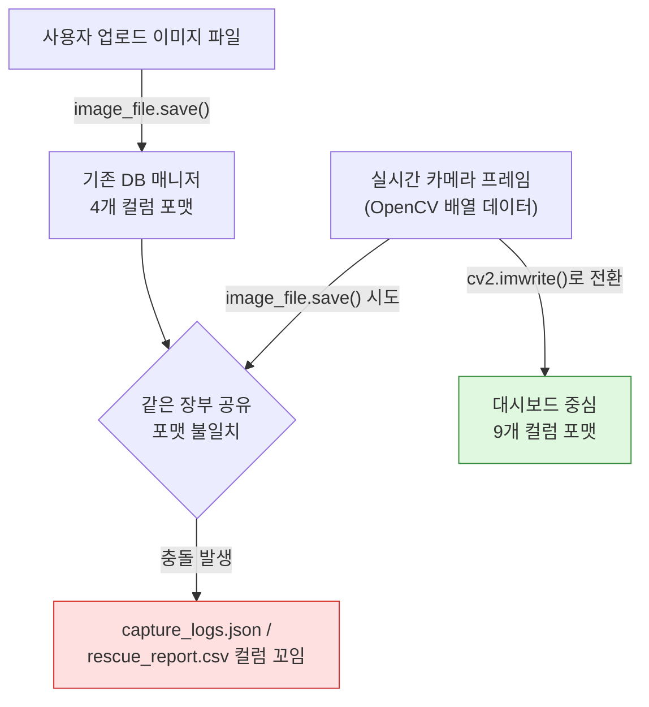

## 사건 요약

1차 팀 프로젝트를 진행하면서 2026년 6월 24일부터 7월 8일까지 약 2주간 이슈가 총 16건 발생했다. Git 브랜치 충돌부터 Flask 라우팅, 자바스크립트 연동, YOLO 데이터 경로, 마지막엔 실시간 CCTV 이미지 데이터 포맷 충돌까지 범위가 꽤 넓었다. 그때그때 트러블슈팅 장부에 기록해뒀던 걸 이번에 시간순으로 정리했다. 16건 전부 해결 완료.

발생 환경은 전부 Chrome, Windows 11로 동일해서 사건별로 따로 적진 않는다.

---

## 이슈 처리 현황

| 지표 | 건수 |
|---|---|
| 전체 발생 건수 | 16 |
| 해결 완료 | 16 |
| 진행 중 | 0 |
| 확인 필요 | 0 |

---

## 이슈 ID 코드 체계

로그에 붙인 접두사 코드는 이런 기준으로 나눴다.

| 코드 | 의미 |
|---|---|
| GIT | Git 충돌 및 형상관리 문제 |
| ERR | 일반 오류(Error) |
| BUG | 버그(Bug) |
| API | API 관련 문제 |
| DB | 데이터베이스 문제 |
| AUTH | 인증/인가 문제 |
| FE | 프론트엔드 문제 |
| BE | 백엔드 문제 |
| NET | 네트워크 문제 |
| PERF | 성능 문제 |
| SEC | 보안 문제 |
| DEP | 배포(Deployment) 문제 |

---

## 타임라인

| 발생 | 이슈 ID | 문제 현상 | 우선순위 | 담당자 |
|---|---|---|---|---|
| 06-25 09:00 | GIT-2026-001 | feature/dashboard 브랜치 삭제 실패 | 보통 | 현정 |
| 06-25 11:00 | BE-2026-001 | 관리자 uuid 키 번호 발급 | 보통 | 리윤 |
| 06-25 15:00 | API-2026-001 | 템플릿 엔진 렌더링 오류 | 낮음 | 성진 |
| 06-26 17:30 | GIT-2026-002 | dev 합병 오류 | 높음 | 성진 |
| 06-29 10:30 | FE-2026-001 | 정적 파일 경로 오류 | 낮음 | 성진 |
| 06-29 10:41 | FE-2026-002 | 자바스크립트 함수 실행 오류 | 낮음 | 성진 |
| 06-29 10:52 | FE-2026-003 | INPUT 태그 설정 문제 | 보통 | 성진 |
| 06-29 12:05 | BE-2026-002 | 변수 인식 에러 | 보통 | 성진 |
| 06-29 12:25 | BE-2026-003 | 키값 재설정 오류 | 높음 | 성진 |
| 06-30 12:25 | BE-2026-004 | YOLO data.yaml 경로 오류 | 보통 | 성진 |
| 06-30 15:25 | FE-2026-004 | Flask 경로 문제 | 보통 | 리윤 |
| 07-01 09:25 | GIT-2026-003 | json 폴더 push 오류 | 높음 | 권민 |
| 07-01 12:25 | FE-2026-005 | url_for 대소문자 오타 | 낮음 | 성진 |
| 07-01 17:05 | FE-2026-006 | 자바스크립트 연동 체크 미흡 | 낮음 | 성진 |
| 07-02 15:01 | FE-2026-007 | 데이터 규격 불일치 (JSON vs HTML) | 보통 | 성진 |
| 07-08 09:01 | DB-2026-001 | 실시간 CCTV 저장 방식 충돌 | 보통 | 권민 |

---

## 사건 1 — [Git] feature/dashboard 브랜치 삭제 실패

*담당자: 현정 · 우선순위: 보통 · 발생: 2026-06-25 09:00*

### 에러

```
error: cannot delete branch 'feature/dashboard' used by worktree at 'C:/khj/first_pjt'
```

### 원인

현재 작업 디렉토리에서 feature/dashboard 브랜치를 사용 중이어서 삭제가 안 됐다.

### 해결

```bash
git checkout dev
git branch -D feature/dashboard
```

dev로 옮긴 다음에 지우니까 바로 해결됐다.

---

## 사건 2 — 관리자 uuid 키 번호 발급

*담당자: 리윤 · 우선순위: 보통 · 발생: 2026-06-25 11:00*

별도 스택트레이스는 안 남아있고 로직 문제로만 기록돼 있다.

### 원인

uuid 생성 시점과 보안 취약성 문제였다.

### 해결

form route()에서 uuid를 생성하고 저장한 뒤, confirm route()에서 불러와 관리자 키가 보여지는 시점을 즉시가 아니라 유연하게 선택할 수 있도록 조정했다.

---

## 사건 3 — [HTML] 템플릿 엔진 렌더링 오류

*담당자: 성진 · 우선순위: 낮음 · 발생: 2026-06-25 15:00*

### 에러

```
jinja2.exceptions.TemplateNotFound
```

### 원인

include/background_video.html이 제대로 작동하지 않는다는 에러였다.

### 해결

index.html에서 불필요한 구문을 지웠다.

```liquid

```

이 줄을 삭제하니 해결됐다.

---

## 사건 4 — [Git] dev 합병 오류

*담당자: 성진 · 우선순위: 높음 · 발생: 2026-06-26 17:30*

### 에러

```
github merge issue (into dev from feature/departments)
```

### 원인

팀원들이 각자 feature/부서 브랜치에서 push하고 dev로 병합 요청하는 과정에서, 자기 작업 폴더를 제외한 나머지를 전부 삭제한 채 단계별로 진행해버렸다. 그래서 dev에 정상적으로 병합이 안 됐다.

### 해결

팀원 전원이 로컬·원격 브랜치를 전부 삭제하고 원격 저장소를 동기화한 다음, dev에서 pull을 받고 다른 팀원 폴더는 절대 건드리지 않는 순서로 다시 진행했다.

```bash
git checkout dev
git branch -D feature/부서명
git fetch --prune
git pull origin dev
git push origin --delete feature/부서명
```

이후 백업해둔 작업물을 자기 폴더 안에서만 덮어씌운 다음 다시 push해서 정상화했다.

### 교훈

혼자 쓰던 방식(작업 폴더만 남기고 정리)을 팀 저장소에 그대로 가져오면 이렇게 된다. 브랜치 정리는 각자 알아서가 아니라 순서를 정해두고 해야 한다.

---

## 사건 5 — [HTML] 정적 파일 경로 오류

*담당자: 성진 · 우선순위: 낮음 · 발생: 2026-06-29 10:30*

### 에러

```
GET http://127.0.0.1:5000/static/css/trouble_css/include/trouble.css net::ERR_ABORTED 404 (NOT FOUND)
```

### 원인

template 폴더 안 html 문서는 전부 수정한 줄 알았는데, include 폴더 안 nav.html의 css 연동 링크만 수정이 안 돼 있었다.

### 해결

nav.html의 링크도 url_for로 다시 고쳤다.

---

## 사건 6 — [JS] 자바스크립트 함수 실행 오류

*담당자: 성진 · 우선순위: 낮음 · 발생: 2026-06-29 10:41*

### 에러

```
trouble.js:8 Uncaught TypeError: Cannot read properties of undefined (reading 'error_code')
    at submitCriticalErrorForm (trouble.js:8:27)
    at HTMLInputElement.onclick (new_critical_error_form:69:121)
```

### 원인

자바스크립트에서 `document.form이름`을 잘못 입력해서 생긴 문제였다.

### 해결

html 문서에서 form 태그의 실제 name을 다시 확인하고 정확히 맞춰서 고쳤다.

---

## 사건 7 — [HTML] INPUT 태그 설정 문제

*담당자: 성진 · 우선순위: 보통 · 발생: 2026-06-29 10:52*

### 에러

```
werkzeug.exceptions.BadRequestKeyError
werkzeug.exceptions.BadRequestKeyError: 400 Bad Request: The browser (or proxy) sent a request that this server could not understand.
KeyError: 'eNum'
```

### 원인

form에서 uuid4 난수를 생성해 render_template으로 confirm 페이지의 input 태그에 `{{ eNum }}`으로 넘겨줬는데, 그걸 다시 request로 받아 DB에 저장하려는 과정에서 값이 안 넘어왔다.

### 해결

```html
<!-- 수정 전 -->
<input ... value="{{ eNum }}" disabled>

<!-- 수정 후 -->
<input ... value="{{ eNum }}" readonly>
```

disabled로 설정하면 그 값이 다시 인자로 넘어오지 않는다. readonly로 바꿔서 해결했다.

---

## 사건 8 — [PYTHON] 변수 인식 에러

*담당자: 성진 · 우선순위: 보통 · 발생: 2026-06-29 12:05*

### 에러

```
UnboundLocalError: cannot access local variable 'critical_errors' where it is not associated with a value
```

### 원인

`if mId not in critical_errors or not critical_errors[mId]:` 조건문이 `critical_errors = load_errors()`보다 위에 있어서, critical_errors를 인식하지 못했다.

### 해결

`critical_errors = load_errors()` 위치를 조건문보다 앞으로 옮겼다.

---

## 사건 9 — [PYTHON] 키값 재설정 오류

*담당자: 성진 · 우선순위: 높음 · 발생: 2026-06-29 12:25*

### 에러

```
TypeError: 'str' object does not support item assignment
```

### 원인

modify 요청을 처리할 때 새 난수를 생성해서 기존 DB 키값 자체를 바꾸고, 그걸로 기존 데이터를 수정하려다 에러가 났다.

### 해결

키값을 바꾸면 그 키로 완전히 새로운 데이터 구조가 생기는 거지 기존 값이 수정되는 게 아니다. 그래서 키값 자체를 변형시키는 방식은 아예 쓰지 않기로 했다.

---

## 사건 10 — [YOLO] data.yaml 파일경로 오류

*담당자: 성진 · 우선순위: 보통 · 발생: 2026-06-30 12:25*

### 에러

```
raise RuntimeError(emojis(f"Dataset '{clean_url(self.args.data)}' error ❌ {e}")) from e
RuntimeError: Dataset
```

### 원인

data.yaml의 경로 설정이 잘못돼 있었다.

### 해결

```yaml
path: C:\Alot1team\project\troubleshooting\yolo_trainning\dataset
```

data.yaml 자기 자신의 경로가 아니라, 분석할 데이터셋이 들어있는 상위 폴더를 지정해야 했다.

---

## 사건 11 — [Flask] 상대경로 문제

*담당자: 리윤 · 우선순위: 보통 · 발생: 2026-06-30 15:25*

### 원인

html에 flask 템플릿 링크를 넣었는데 app.py에 register를 안 해서 dashboard.html의 css가 적용이 안 됐다.

### 해결

`/`와 `../`의 차이를 다시 짚었다. `../`는 상위 폴더로 한 칸 이동한다는 뜻이다.

```html
<link href="../../static/css/dashboard/dashboard.css">
```

상위 폴더로 두 번 이동하도록 경로를 고쳐서 해결했다.

---

## 사건 12 — [Git] json 폴더 push 오류

*담당자: 권민 · 우선순위: 높음 · 발생: 2026-07-01 09:25*

### 에러

```
GIT_WARN_EMPTY_DIR_IGNORED
```

### 원인

json 폴더만 만들어두고 안에 파일이 하나도 없는 상태라 push가 안 됐다.

### 해결

Git은 빈 폴더를 아예 추적하지 않는다. 폴더 안에 `.gitkeep` 파일을 하나 만들어서 해결했다. `.gitignore`가 "이건 무시해라"라면 `.gitkeep`은 "폴더가 비어있어도 유지해라"에 가깝다.

---

## 사건 13 — [HTML] url_for 주소 대소문자 오타

*담당자: 성진 · 우선순위: 낮음 · 발생: 2026-07-01 12:25*

### 에러

```
werkzeug.routing.exceptions.BuildError: Could not build url for endpoint 'error_lnfo' with values ['eNum']. Did you mean 'trouble.error_infos' instead?
```

### 원인

url_for에 블루프린트 함수명을 적을 때 대소문자를 잘못 입력했다.

### 해결

`error_Infos`로 잘못 쓴 걸 실제 함수명인 `error_infos`로 고쳤다. 직접 타이핑하지 말고 함수명을 그대로 복사해서 붙여넣기로 했다.

---

## 사건 14 — [HTML] 자바스크립트 연동 체크 미흡

*담당자: 성진 · 우선순위: 낮음 · 발생: 2026-07-01 17:05*

### 에러

```
Uncaught ReferenceError: openModal is not defined
    at HTMLButtonElement.onclick (error_list:51:75)
```

### 원인

자바스크립트와 html이 계속 연동이 안 돼서 이리저리 살펴보다가, 애초에 스크립트 태그 자체가 안 들어가 있는 걸 발견했다.

### 해결

```html
<script src="{{ url_for('static', filename='js/trouble.js') }}"></script>
```

이 한 줄을 채워 넣으니 바로 해결됐다.

---

## 사건 15 — [HTML] 데이터 규격 불일치 (JSON vs HTML)

*담당자: 성진 · 우선순위: 보통 · 발생: 2026-07-02 15:01*

### 에러

```
trouble.js:63 ERROR: SyntaxError: Unexpected token '<', "<!doctype "... is not valid JSON
```

원인 분석은 따로 기록해두지 않았는데, 해결 방법으로 미루어보면 JSON을 기대하는 곳에 HTML 문서가 대신 돌아오고 있었던 것으로 보인다.

### 해결

modify_form 블루프린트 함수 로직을 한 번 더 거치게 하지 않고, confirm 함수 쪽으로 바로 넘겨서 데이터를 받아 DB에 저장하도록 구조를 바꿨다.

---

## 사건 16 — DASHBOARD·DB 파일, 실시간 CCTV 영상 저장 방식 충돌

*담당자: 권민 · 우선순위: 보통 · 발생: 2026-07-08 09:01*

16건 중 제일 오래 걸린 이슈다. 단순 오타가 아니라 애초에 두 모듈이 서로 다른 전제로 설계돼 있었다.

### 증상

기존 DB 코드는 사용자가 웹사이트에서 직접 올린 "완성된 이미지 파일"을 받는 구조였다. 그런데 대시보드의 실시간 카메라는 영상에서 캡처한 OpenCV 이미지 데이터(배열 형태)를 그대로 넘기고 있었다. 애초에 종류가 다른 데이터를 주고받으려 한 것이다.

### 원인

두 모듈이 같은 장부 파일(`capture_logs.json`, `rescue_report.csv`)을 같이 쓰려다 보니 컬럼 이름부터 어긋났다.

- 기존 DB 매니저 쪽: 사건 번호, 탐지 상태, 발생 시각, 이미지 확인 링크 — 4개 컬럼만 있으면 된다고 가정
- 카메라/대시보드 매니저 쪽: 로그 ID, 메시지, 감지 시각, 구역 ID, 위험구역, 감지 인원, 이미지 확인 링크, 담당자, 확인 시각 — 9개 컬럼이 필요

포맷 자체가 다른 두 설계가 같은 파일을 공유하려다 충돌한 셈이다.



### 해결

**① `cv2.imwrite()`로 전환.** 실시간 카메라 영상을 저장할 때 `image_file.save()` 대신, 메모리 상의 OpenCV 프레임을 이미지 파일로 변환해 바로 디스크에 저장하는 `cv2.imwrite()`를 쓰기로 했다.

**② 기존 업로드 방식 코드는 은퇴.** `db/utils/json_capture_manager.py`와 `image_handler.py`는 "사용자가 파일을 업로드한다"는 전제로 짜여 있었다. 실시간 드론·CCTV 기반 시스템에서는 대시보드가 직접 OpenCV 프레임을 제어하기 때문에, 이 코드들은 더 이상 쓰지 않거나 대시보드 중심의 9개 컬럼 포맷에 맞춰 전면 수정해야 한다는 결론을 냈다.

---

## 되새김질 해보기

### 반복된 패턴

**오타·오입력 계열이 절반 가까이 됐다.** 사건 6(form name 오입력), 사건 13(url_for 대소문자), 사건 10(YOLO 경로) 처럼 사소한 오타 하나가 에러 메시지는 거창하게 뜨는 경우가 많았다. 함수명이나 경로는 직접 타이핑하지 말고 복붙하는 습관이 필요하다.

**Git 브랜치·병합 이슈가 3건(사건 1, 4, 12).** 전부 "혼자 로컬에서 하던 습관을 팀 작업에 그대로 가져와서" 생긴 문제였다. 브랜치 삭제·병합 순서를 팀 차원에서 미리 정했다면 줄었을 이슈들이다.

**Flask 라우팅·템플릿 연동 이슈도 많았다(사건 3, 7, 11, 13, 14, 15).** url_for, register, disabled/readonly, 스크립트 태그 누락 등 프론트와 백엔드 경계에서 자잘하게 계속 터졌다. 대부분 "연동이 끊긴 지점을 못 찾아서" 시간이 걸렸다.

**진짜 오래 걸린 건 사건 16 하나였다.** 나머지 15건은 짧으면 3분, 길어도 반나절 안에 잡혔는데 이것만 유독 오래 걸렸다. 코드 버그가 아니라 애초에 두 모듈이 "무슨 데이터를 주고받을지" 합의가 없었던 게 원인이었다.

### 배운 것

자잘한 오타성 이슈는 결국 습관으로 줄여야 한다. 타이핑보다 복붙, 그리고 커밋 전에 함수명·경로 한 번 더 확인하기.

Git은 팀 단위 규칙(브랜치 삭제 시점, dev 병합 전 체크리스트)이 없으면 같은 유형의 사고가 반복된다.

시간을 제일 많이 잡아먹는 건 코드 오류가 아니라 **설계 단계에서 안 맞춰진 데이터 포맷**이다. 모듈을 나눠서 개발할 때는 코드부터 짜지 말고 주고받을 데이터 스키마를 먼저 문서로 맞추고 시작해야 한다.

### 다음 프로젝트에 적용할 것

1. 브랜치 전략(네이밍, 삭제 시점, 병합 순서)을 시작 전에 문서로 합의한다
2. 모듈 간 데이터를 주고받을 땐 코드보다 먼저 스키마(컬럼명, 타입)를 맞춘다
3. url_for, 경로, 함수명은 직접 타이핑하지 않고 복붙한다
4. 원인 분석이 비어있던 사건 2, 15처럼 급하게 넘어간 이슈도 최소한 재현 방법 한 줄은 남겨둔다
