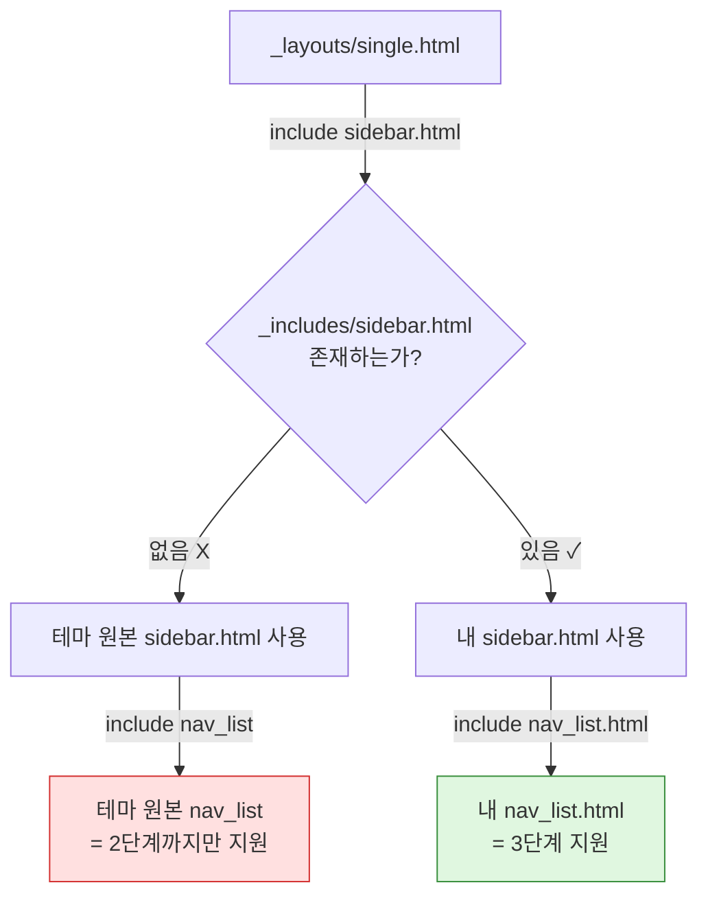

## 사건 요약

사이드바에 3단계 하위 메뉴(`SQL > 오답노트`)를 추가했는데 화면에 안 나왔다. 원인을 찾는 데 약 2시간이 걸렸는데, **정작 진짜 원인은 20분 만에 잡혔다.** 억울해서 기록으로 남겨본다. 

---

## 증상

`_data/navigation.yml`에 이렇게 넣었다.

```yaml
- title: "SQL"
  url: /sql/
  children:
    - title: "오답노트"
      url: /sql/wrong-note-part1/
```

기존에 `정보처리기사` 밑에는 오답노트 1~4권이 잘 나오고 있었다. 같은 형태로 SQL에도 넣었는데 **안 나온다.** 게다가 배포는 계속 빨간 X가 떴다.

---

## 타임라인

> ※ 시각은 대략적인 기록이다.

| 시각 | 상황 | 판단 |
|---|---|---|
| ~21:40 | 마지막 정상 배포 (#1834 초록불) | — |
| 21:40~22:10 | navigation.yml, main.scss, search_form.html 연속 수정·푸시 | 코드가 문제라고 생각 |
| 22:10 | 배포 #1835~#1839 전부 빨간 X | SCSS 문법 오류 의심 |
| 22:20 | `Error: Deployment cancelled.` 확인 | 취소일 뿐 실패가 아님을 인지 |
| 22:35 | build ✓ 32초 / deploy만 진행 중 | **코드는 무죄** 확정 |
| 22:40 | `deployment_queued` 무한 반복 로그 발견 | GitHub 큐 정체 |
| 22:50 | `Error: Timeout reached, aborting!` | 배포 자체가 불가능한 상태 |
| 23:00 | 로컬 환경 구축 시작 (Ruby 설치) | 전략 전환 |
| 23:20 | 로컬 서버 기동 성공 | 드디어 관찰 가능 |
| 23:25 | 3단계 메뉴 미출력 재현 | 진짜 디버깅 시작 |
| 23:30 | **진짜 원인 발견 및 수정 완료** | 소요 5분 |
| 23:33 | 커밋 & 푸시 | — |

---

## 사건 1 — 배포가 계속 취소된다

### 에러

```
Error: Deployment cancelled.
```

### 원인

GitHub Pages 배포는 **동시에 하나만** 실행된다. 배포가 진행 중일 때 새 푸시가 들어오면 **먼저 돌던 것이 취소된다.**

수정할 때마다 푸시했더니 빌드가 끝나기 전에 다음 푸시가 들어와서 계속 잘렸다.


| 실행 | 시작 | 소요 | 결과 |
|---|---|---|---|
| #1835 | 16분 전 | 2m 57s | 취소 |
| #1836 | 13분 전 | 4m 25s | 취소 |
| #1837 | 9분 전 | 1m 35s | 취소 |
| #1838 | 8분 전 | 4m 51s | 취소 |
| #1839 | 3분 전 | — | 진행 중 |

푸시 간격(3~5분)보다 빌드 시간(2~5분)이 길어서, 끝나기 전에 다음 푸시가 들어와 계속 잘렸다. 소요 시간이 들쭉날쭉한 것도 임의의 지점에서 잘렸다는 신호다.


### 교훈

빨간 X라고 전부 빌드 실패가 아니다. **취소도 실패로 표시된다.** 로그의 첫 줄을 봐야 구분된다.

---

## 사건 2 — 취소가 아니라 아예 응답이 없다

### 에러

```
Created deployment for 297eadbe...
Getting Pages deployment status...
Current status: deployment_queued
Current status: deployment_queued
... (약 250줄 반복)
Error: Timeout reached, aborting!
Canceling Pages deployment...
```

### 원인

배포 요청은 정상 접수됐는데 **큐에서 처리되지 않았다.** 액션은 상태를 계속 물어보다가 제한 시간에 도달해서 스스로 포기했다.

이때 확인한 것들:

- `build` 잡: ✓ **32초 만에 성공**
- `report-build-status`: ✓ 성공
- `deploy`: ⏳ 무한 대기
- githubstatus.com: All Systems Operational

**빌드가 성공했다는 건 SCSS도 YAML도 프론트매터도 전부 정상이라는 뜻이다.** 이 시점에 코드 의심을 접었어야 했다.

### 교훈

상태 페이지가 초록이어도 국소적 큐 정체는 있을 수 있다. 상태 페이지는 전 세계 규모 장애만 표시한다.

그리고 **배포 로그로 디버깅하면 안 된다.** 한 번 확인에 5분이 걸리는데 그마저 취소되면 아무것도 검증할 수 없다.

---

## 사건 3 — 로컬 환경이 없다

배포를 못 믿게 됐으니 로컬에서 확인하기로 했다. 그런데 여기서도 줄줄이 막혔다.

### 3-1. `bundle: command not found`

Ruby 자체가 없었다. 예전에 설치했다가 지웠던 게 문제.

**해결:** [RubyInstaller](https://rubyinstaller.org/downloads/)에서 **Ruby+Devkit** 버전 설치. Devkit 없는 버전은 네이티브 gem 컴파일이 안 된다.

### 3-2. `Could not locate Gemfile`

**원인:** 그동안 GitHub 웹에서만 작업해서 `Gemfile`을 만들 이유가 없었다. GitHub Pages가 서버에서 알아서 처리해줬기 때문이다.

**해결:** 직접 작성.

### 3-3. `undefined method 'tainted?' for nil`

```
Liquid Exception: undefined method 'tainted?' for nil in /_layouts/single.html
jekyll 3.9.0 | Error: undefined method 'tainted?' for nil
```

**원인:** `tainted?`는 Ruby가 오래전에 제거한 메서드인데 `liquid-4.0.3`이 아직 호출한다. **Ruby 4.0 + github-pages gem이 고정한 옛날 버전** 조합이 불가능했다.

`github-pages` gem은 GitHub 서버 환경에 버전을 못 박아두는데, 그 환경은 훨씬 낮은 Ruby를 쓴다.

**해결:** `github-pages`를 버리고 최신 Jekyll을 직접 지정.


### 3-4. `Dependency Error: jekyll-relative-links`

**원인:** GitHub Pages가 기본 제공하던 플러그인들을 로컬은 챙겨주지 않는다. `_config.yml`의 `plugins:` 목록을 전부 `Gemfile`에 명시해야 한다.

### 최종 Gemfile

```ruby
source "https://rubygems.org"

gem "jekyll"
gem "minimal-mistakes-jekyll"
gem "webrick"

# Ruby 3.4+ 에서 표준 라이브러리에서 빠진 것들
gem "csv"
gem "base64"
gem "bigdecimal"

group :jekyll_plugins do
  gem "jekyll-paginate"
  gem "jekyll-relative-links"
  gem "jekyll-optional-front-matter"
  gem "jekyll-readme-index"
  gem "jekyll-default-layout"
  gem "jekyll-titles-from-headings"
  gem "jekyll-include-cache"
  gem "jekyll-remote-theme"
end

# Windows 대응
gem "tzinfo-data", platforms: [:windows, :jruby]
gem "wdm", ">= 0.1.0", platforms: [:windows]
```

---

## 사건 4 — 진짜 원인

로컬 서버가 뜨자마자 증상이 재현됐다. **SQL뿐 아니라 정보처리기사 오답노트까지 사라져 있었다.** 배포된 사이트에서는 나오던 것이었다.

### 단서를 찾은 명령

```bash
grep -rn "nav_list" _layouts/ _includes/
```


**결과가 아무것도 없었다.**

내가 만든 `_includes/nav_list.html`을 **아무도 부르지 않고 있었다.**

### 원인



`_includes/`에 커스텀 파일들이 있었지만 **정작 `sidebar.html`이 없었다.** 그래서 테마 원본 `sidebar.html`이 쓰였고, 그건 테마 원본 `nav_list`를 부른다. 내가 3단계용으로 만들어둔 `nav_list.html`은 끼어들 자리가 없었다.


### 해결

**① 테마 원본 `sidebar.html`을 내 폴더로 복사**

```bash
curl -o _includes/sidebar.html \
  https://raw.githubusercontent.com/mmistakes/minimal-mistakes/master/_includes/sidebar.html
```

그럼 이런 형식으로 터미널에 보인다.


**② 호출부 파일명을 맞춤** (2군데)

```liquid
<!-- 변경 전 -->



<!-- 변경 후 -->


```


저장하자마자 3단계 메뉴가 전부 나왔다. **소요 시간 5분.**

---

## 사건 5 — 푸시 거부

```
! [rejected] main -> main (fetch first)
```

**원인:** 오늘 GitHub 웹에서 수정한 것들이 로컬에 없었다.

**해결:**

```bash
git pull --no-rebase
# Vim이 열리면 :wq 로 저장 후 종료
git push
```


---

## 부수적으로 정리한 것들


1. `.gitignore`에 `_site/`, `.jekyll-cache/` 추가 — 빌드 결과물은 커밋하지 않기! 


2. `Sass deprecation`에  200여 개 경고가 뜨지만 전부 무시 가능. 테마가 옛 문법을 쓰는 것뿐이다.


---


## 되새김질 해보기

### 잘못한 것

**증상을 보고 코드부터 의심했다.** `navigation.yml`, `main.scss`, 프론트매터, YAML 들여쓰기까지 전부 뒤졌는데 **하나도 범인이 아니었다.**

`Error: Deployment cancelled.` 한 줄이 처음부터 답을 말하고 있었고, `build ✓ 32초`가 무죄를 증명하고 있었다. 로그를 먼저 읽었다면 30분은 아꼈다.

### 배운 것

**관찰 수단부터 확보한다.** 배포 로그로 디버깅하면 한 번 확인에 5분이 걸리고, 정보는 빨간 X 하나뿐이다. 로컬은 3초에 어떤 파일 몇 번째 줄인지까지 알려준다. 같은 문제인데 정보의 밀도가 다르다.


**로컬과 배포는 역할이 다르다.**

| | 로컬 | 배포 |
|---|---|---|
| 목적 | 빠르게 만들고 고치기 | 실제 환경에서 최종 확인 |
| 강점 | 즉시 확인, 상세한 에러 | 사용자와 동일한 조건 |
| 한계 | 환경 차이 가능 | 느리고 정보가 적음 |

다만 **로컬이 항상 정답은 아니다.** 지금 로컬은 Jekyll 4.4.1, GitHub Pages는 3.9다. 실제로 "배포에선 나오는데 로컬에선 안 나오는" 차이를 오늘 겪었다. 

**로컬에서 만들고, 배포에서 확인한다.** 오늘은 로컬이 없어서 배포에 두 역할을 다 시키려다 고생했다.

### 다음에 같은 일이 생기면

1. 로그의 `Error:` 줄부터 읽는다 — 취소인지 실패인지 구분
2. `build` 잡이 성공했는지 확인 — 성공했으면 코드는 무죄
3. 로컬에서 재현 시도
4. 그다음에 코드를 의심한다

**Ruby는 다시는 지우지 않기로 했다.**
