> **기출 빈도 요약** — UML 구성요소·다이어그램은 거의 매년 출제된다. 애자일 선언문, XP 가치·원리, 스크럼 용어도 단골이다. 괄호 안 연도는 실제 기출 회차다.

# 요구사항 확인

## 1. 현행 시스템 분석

### (1) 플랫폼 기능 분석 ★★

#### 플랫폼(Platform)의 개념
- 플랫폼은 애플리케이션을 구동시키는 데 필요한 소프트웨어의 환경이다.
- 동일 플랫폼 내에서는 상호 호환이 가능하도록 만들어진 결합체를 의미한다.
- 공급자와 수요자 등 복수 그룹이 참여하여 각 그룹이 얻고자 하는 가치를 공정한 거래를 통해 교환할 수 있도록 구축된 환경이다.

> 예: 안드로이드 마켓, 페이스북, 인스타그램 등

#### 플랫폼 성능 특성 분석
- 플랫폼 성능 분석을 통해 사용자의 서비스 이용 시 속도의 적정성을 알 수 있다.
- 사용자 요구사항 중 성능에 대한 개선요청 항목은 현재 시스템 플랫폼 성능이 느린 것으로 제기될 가능성이 높다.

#### 플랫폼 성능 특성 측정 항목 `20년 1회` `24년 1회`
플랫폼 성능 특성을 측정하는 항목에는 **경과 시간, 사용률, 응답시간, 가용성**이 있다.

| 측정 항목 | 설명 |
|---|---|
| 경과 시간 (Turnaround Time) | 애플리케이션에 작업을 의뢰(요구)한 시간부터 처리가 완료될 때까지 걸린 시간 |
| 사용률 (Utilization) | 애플리케이션이 의뢰한 작업을 처리하는 동안 CPU, 메모리 등의 자원 사용률 |
| 응답시간 (Response Time) | 애플리케이션에 요청을 전달한 시간부터 응답이 도착할 때까지 걸린 시간 |
| 가용성 (Availability) | 서버와 네트워크, 프로그램 등의 정보 시스템이 정상적으로 사용 가능한 정도 |

---

### (2) 운영체제 분석 ★

#### 운영체제(OS; Operating System)의 개념
- 운영체제는 하드웨어 및 소프트웨어 자원을 효율적으로 관리하며 공통된 기능을 제공하는 소프트웨어이다.
- 사용자의 쉬운 컴퓨터 사용을 지원하는 소프트웨어이다.

> 예: 윈도우(Windows), 유닉스(UNIX), 리눅스(Linux)

#### 운영체제 현행 시스템 분석
운영체제 현행 시스템 분석 시 **품질 측면**과 **지원 측면** 등을 고려해야 한다.

| 관점 | 고려 사항 | 설명 |
|---|---|---|
| 품질 측면 | 신뢰도 | 장기간 시스템 운영 시 운영체제의 장애 발생 가능성, 운영체제의 버그로 인한 재기동 여부 |
| 품질 측면 | 성능 | 대규모 및 대량 파일 작업(배치 작업) 처리, 지원 가능한 메모리 크기(32bit, 64bit) |
| 지원 측면 | 기술 지원 | 공급사들의 안정적인 기술 지원, 오픈소스 여부 |
| 지원 측면 | 주변 기기 | 설치 가능한 하드웨어, 다수의 주변 기기 지원 여부 |
| 지원 측면 | 구축 비용 | 지원 가능한 하드웨어 비용, 설치할 응용 프로그램의 라이선스 정책 및 비용, 유지 및 관리 비용 |

---

### (3) 네트워크 분석 ★

#### 네트워크(Network)의 개념
- 네트워크는 컴퓨터 장치들이 노드 간 연결(데이터 링크)을 통해 서로 간에 데이터를 교환하는 기술이다.

#### 네트워크 현행 시스템 분석
- 현행 시스템에 구성된 네트워크 구조를 **네트워크 구성도**를 통해 분석한다.
- 네트워크 구성도를 작성하여 서버 위치, 서버 간 연결 방식을 파악할 수 있다.
- 네트워크 장애 발생 추적 및 대응 등의 다양한 용도로 활용할 수 있다.

---

### (4) DBMS 분석 ★★

#### DBMS(Database Management System)의 개념
- DBMS는 데이터베이스(DB; Database)라는 데이터의 집합을 만들고, 저장 및 관리할 수 있는 기능들을 제공하는 응용 프로그램이다.

#### DBMS 현행 시스템 분석 `20년 1회` `21년 1회`
DBMS의 **가용성, 성능, 상호 호환성, 기술 지원, 구축 비용** 등을 분석한다.

| 관점 | 고려 사항 | 설명 |
|---|---|---|
| 성능 측면 | 가용성 | 장기간 시스템을 운영할 때 장애 발생 가능성, 백업 및 복구 편의성, DBMS 이중화 및 복제 지원 |
| 성능 측면 | 성능 | 대규모 데이터 처리 성능, 대량 거래 처리 성능, 다양한 튜닝 옵션 지원 여부, 비용 기반 최적화 지원 및 설정의 최소화 |
| 성능 측면 | 상호 호환성 | 설치 가능한 운영체제 종류, 다양한 운영체제에서 지원되는 JDBC, ODBC |
| 지원 측면 | 기술 지원 | 공급 업체들의 안정적인 기술 지원, 다수의 사용자 간의 정보 공유, 오픈소스 여부 |
| 지원 측면 | 구축 비용 | 라이선스 정책 및 비용, 유지 및 관리 비용 |

>  **두음쌤 암기법**: DBMS 현행 시스템 분석 시 고려 사항 → **「가성호기구」** (가용성, 성능, 상호 호환성, 기술 지원, 구축 비용)
> "가성비 따지지 않고 호화스러운 가구를 구매했다."

---

## 2. 요구사항 확인

### (1) 요구분석 기법 ★★★

#### 요구분석(Requirements Analysis)의 개념 `22년 1회`
- 요구분석은 사용자의 요구를 추출하여 목표를 정하고 어떤 방식으로 해결할 것인지 결정하는 단계이다.
- 요구분석은 개발 대상에 대한 사용자의 요구사항 중 명확하지 않거나 모호하여 이해되지 않는 부분을 발견하고 이를 걸러내기 위한 과정이다.

#### 요구분석의 특징 `20년 4회` `24년 3회` `25년 3회`
- 요구분석은 소프트웨어 개발의 실제적인 첫 단계로 사용자의 요구에 대해 이해하는 단계이다.
- 분석 결과의 문서화를 통해 향후 유지보수에 유용하게 활용할 수 있다.
- 보다 구체적인 명세를 위해 **소단위 명세서**가 활용될 수 있다.
- 개발 비용이 가장 많이 소요되는 단계는 **아니다**.
- 요구분석 중 도메인 분석(Domain Analysis)은 요구에 대한 정보를 수집하고 배경을 분석하여 이를 토대로 모델링을 하게 된다.

#### 요구사항 분석 단계 절차 `24년 2회`
요구사항 분석을 통해서 요구사항을 기술할 때는 요구사항의 확인(Validation), 요구사항 구현의 검증(Verification), 비용 추정이 가능하도록 충분하고 정확하게 기술해야 한다.

| 순서 | 절차 | 설명 |
|---|---|---|
| 1 | 요구사항 분류 | 요구사항 유형(기능 요구사항, 비기능 요구사항) 확인, 요구사항이 소프트웨어에 미치는 영향의 범위 파악, 요구사항이 소프트웨어 생명주기 동안 변경이 발생하는지 확인 |
| 2 | 개념 모델링 생성 및 분석 | 현실 세계의 상황을 단순화·개념적으로 표현한 것을 모델이라고 하며, 모델링은 이러한 모델을 만드는 단계. 객체 모델, 데이터 모델, 상태 모델 등 다양한 모델 작성 가능. 모델링 표기를 위해 DFD, 자료 사전(DD), UML 다이어그램, E-R 다이어그램 사용 |
| 3 | 요구사항 할당 | 요구사항을 만족시키기 위한 아키텍처 구성요소를 식별하는 단계. 다른 구성요소와 어떻게 상호 작용하는지 분석을 통해 추가적인 요구사항 발견 가능 |
| 4 | 요구사항 협상 | 두 명의 이해관계자가 서로 상충되는 내용을 요구하는 경우, 어느 한쪽을 지지하기보다는 적절한 지점에서 합의하기 위한 단계. 요구사항이 서로 충돌되는 경우 각각 우선순위를 부여하면 무엇이 더 중요한지를 인식할 수 있으므로 문제 해결에 도움이 됨 |
| 5 | 정형 분석 | 형식적으로 정의된 의미를 지닌 언어로 요구사항을 표현하는 단계. 구문(Syntax)과 의미(Semantics)를 갖는 정형화된 언어를 사용하여 수학적 기호로 표현. 요구사항 분석의 **마지막 단계**에서 이루어짐 |

#### 요구사항 분석 기술 `20년 3회`
요구사항 분석 기술에는 청취 기술, 인터뷰와 질문 기술, 분석 기술, 중재 기술, 관찰 기술, 작성 기술, 조직 기술, 모델 작성 기술이 있다.

| 분석 기술 | 설명 |
|---|---|
| 청취 기술 | 이해관계자로부터 의견을 듣는 기술 |
| 인터뷰와 질문 기술 | 이해관계자를 만나 정보를 수집하고 이야기를 나누는 기술 |
| 분석 기술 | 추출된 요구사항에 대해 충돌, 중복, 누락 등의 분석을 통해 완전성과 일관성을 확보하는 기술 |
| 중재 기술 | 이해관계자들의 상반된 요구에 대한 중재 기술 |
| 관찰 기술 | 사용자가 작업하는 것을 관찰하면서 사용자가 언급하지 않은 미묘한 의미를 탐지할 수 있는 기술 |
| 작성 기술 | 요구사항 분석서 등의 문서 작성 기술 |
| 조직 기술 | 수집된 방대한 정보를 일관성 있는 정보로 구조화하는 능력 |
| 모델 작성 기술 | 수집한 자료를 바탕으로 제어의 흐름, 기능 처리, 동작 행위, 정보 내용 등을 이해하기 쉽도록 모델로 작성하는 기술 |

---

## 3. 요구사항 분석에 사용하는 기능 모델링 기법

### (1) 데이터 흐름도 `20년 1회, 4회` `22년 1회` `24년 1회, 3회` `25년 1회, 2회, 3회`

#### 데이터 흐름도(DFD; Data Flow Diagram)의 개념
- 데이터 흐름도는 데이터가 각 프로세스를 따라 흐르면서 변환되는 모습을 나타낸 그림이다.
- 시스템 분석과 설계에서 매우 유용하게 사용되는 다이어그램이다.
- 데이터 흐름도는 시스템의 모델링 도구로서 가장 보편적으로 사용되는 것 중의 하나이다.
- 자료 흐름 그래프 또는 **버블(Bubble) 차트**라고도 한다.

#### 데이터 흐름도 특징
- 구조적 분석 기법에 이용된다.
- 데이터(Data)의 흐름에 중심을 두는 분석용 도구이다.
- 제어(Control)의 흐름은 중요하지 않다.
- 시간 흐름을 명확하게 표현할 수는 없다.

#### 데이터 흐름도 구성요소
데이터 흐름도 구성요소에는 **처리기, 데이터 흐름, 데이터 저장소, 단말**이 있다.

| 구성요소 | 설명 | 표기 |
|---|---|---|
| 처리기 (Process) | 입력된 데이터를 원하는 형태로 변환하여 출력하기 위한 요소. 처리, 기능, 변환, 버블로도 불림. 원 안에 프로세스 이름을 가짐 | 원 (○) |
| 데이터 흐름 (Data Flow) | DFD의 구성요소(프로세스, 데이터 저장소, 외부 엔터티)들 간의 주고받는 데이터 흐름을 나타내는 요소. 화살표 위에 자료의 이름을 기입 | 화살표 (→) |
| 데이터 저장소 (Data Store) | 데이터가 저장된 장소를 나타내는 요소. 평행선 안에는 데이터 저장소의 이름을 넣음 | 평행선 (=) |
| 단말 (Terminator) | 프로세스 처리 과정에서 데이터가 발생하는 시작과 종료를 나타내는 요소. 시스템과 교신하는 외부 개체. 사각형 안에는 외부 엔터티의 이름을 넣음 | 사각형 (□) |

---

### (2) 자료 사전 `20년 1회, 4회`

#### 자료 사전(DD; Data Dictionary)의 개념
- 자료 사전은 자료 요소, 자료 요소들의 집합, 자료의 흐름, 자료 저장소의 의미와 그들 간의 관계, 관계 값, 범위, 단위들을 구체적으로 명시하는 사전이다.
- 자료 사전은 파일 혹은 데이터베이스에 있는 자료에 대한 자료 또는 각 자료 항목에 주어진 이름과 길이 그리고 서술과 같은 데이터를 포함하는 참조를 위한 작업이다.

#### 자료 사전의 작성 목적
- 자료 사전은 조직에 속해 있는 다른 사람들에게 특정한 자료 용어가 무엇을 의미하는지를 알려주기 위하여, 용어의 정의를 조정하고 취합하고 문서로 명확히 하는 목적이 있다.
- 자료 흐름도에 나타나는 어떤 자료도 자료 사전에 정의되어 있어야 한다.

#### 자료 사전 기호

| 기호 | 설명 |
|---|---|
| `=` | 자료의 정의로서 '~으로 구성되어(is Composed of) 있다'는 것을 나타내는 기호. 정의는 주석을 사용하여 의미를 기술하며, 자료 흐름과 자료 저장소에 대한 구성 내역을 설명하고, 자료 원소에 대하여 값이나 단위를 나타냄 |
| `+` | 자료의 연결(and, along with)을 나타내는 기호 |
| `( )` | 자료의 생략 가능함을 나타내는 기호 |
| `{ }` | 자료의 반복을 나타내는 기호. 좌측에는 최소 반복 횟수, 우측에는 최대 반복 횟수를 기록. 기록하지 않을 때는 기본값으로 최소는 0, 최대는 무한대 |
| `[ ]` | 자료의 선택을 나타내는 기호. 택일 기호 `[ | ]`는 'ㅣ'로 분리된 항목 중 하나가 선택된다는 것을 표시 |
| `**` | 자료의 설명을 나타내는 기호. 주석(Comment) |

#### 자료 사전 작성 원칙

| 작성 원칙 | 설명 |
|---|---|
| 자료의 의미 기술 | 자료의 의미는 주석을 통해서 기술. 자료의 의미를 기술할 때는 그 자료가 대상 시스템에서 사용되는 적합한 뜻을 표현해야 함. 중복되는 기술을 회피 |
| 자료 구성항목의 기술 | 구성 항목들을 그룹으로 묶음. 각 그룹에 대하여 의미 있는 이름을 부여. 이름이 붙여진 각 그룹을 다시 정의 |
| 동의어 규정 준수 | 사용자마다 같은 문서나 자료에 대해 서로 다른 이름들을 가지고 있을 수 있으며, 사용자들의 용어를 통일시키는 것보다는 사용하는 용어를 이용하여 자료를 정의하는 것이 간단함 |
| 자료 정의의 중복 제거 | 같은 자료에 대해 여러 명의 분석가가 독립적으로 분석을 시행한다면, 서로 다른 이름을 사용할 수 있으므로 자료 정의의 중복 제거 필요 |

## 4. 요구사항 분석이 어려운 이유 <small>(21년 2회)</small>

요구사항 분석은 아래 네 가지 이유로 어렵다.

- 개발자와 사용자 간 **지식·표현의 차이**가 커서 상호 이해가 쉽지 않다.
- 사용자의 요구사항이 **모호하고 불명확**하다.
- 개발 과정 중에 요구사항이 **계속 변할 수 있다**.
- 사용자의 요구는 **예외가 많아** 열거와 구조화가 어렵다.

## 5. UML

### UML의 개념 <small>(22년 1회)</small>

UML(Unified Modeling Language)은 객체 지향 소프트웨어 개발 과정에서 산출물을 **명세화, 시각화, 문서화**할 때 사용되는 모델링 기술과 방법론을 통합해 만든 **표준화된 범용 모델링 언어**다.

> ![star] **암기 포인트**: "명세화·시각화·문서화" 세 단어는 서술형으로 그대로 물어본다.

### UML의 특징

UML은 방법론을 통합한 것으로, 표준화된 모델링 기법을 제공한다.

| 특징 | 설명 |
|---|---|
| **가**시화 언어 | 개념 모델 작성 시 오류가 적고 의사소통이 용이하다 |
| **구**축 언어 | 다양한 프로그래밍 언어로 실행 시스템 예측이 가능하다. UML을 소스 코드로 변환해 구축할 수 있고, 역 변환하여 역공학도 가능하다 |
| **명**세화 언어 | 정확한 모델을 제시하고 완전한 모델을 작성할 수 있다 |
| **문**서화 언어 | 시스템에 대한 평가 및 의사소통의 문서 역할을 한다 |

### UML 구성요소 <small>(20년 4회, 22년 3회, 23년 1회, 24년 2·3회, 25년 2·3회)</small>

UML은 **사물, 관계, 다이어그램**으로 구성된다.

| 구성요소 | 설명 |
|---|---|
| **사**물 (Things) | 추상적인 개념으로, 주제를 나타내는 요소. 단어 관점에서 '명사' 또는 '동사'를 의미한다 |
| **관**계 (Relationships) | 사물의 의미를 확장하고 명확히 하는 요소. 사물과 사물을 연결하여 관계를 표현한다. 단어 관점에서 '형용사' 또는 '부사'를 의미한다 |
| **다**이어그램 (Diagrams) | 사물과 관계를 모아 그림으로 표현한 형태. 형식과 목적에 따라 9가지로 정의된다 |

> ![star] **암기 포인트**: "사·관·다" — 명사/동사(사물), 형용사/부사(관계) 대응까지 세트로 외운다.

### UML 사물 <small>(23년 1회, 25년 3회)</small>

| 종류 | 설명 | 예시 |
|---|---|---|
| **구**조 사물 (Structural) | UML 모델의 **정적인** 부분을 정의. 시스템의 물리적·개념적 요소를 표현 | 클래스, 유스케이스, 컴포넌트, 노드 |
| **행**동 사물 (Behavioral) | UML 모델의 **동적인** 부분을 표현. 시간과 공간에 따른 요소들의 행위를 표현 | 상호 작용, 상태 머신 |
| **그**룹 사물 (Grouping) | UML 모델의 요소들을 그룹으로 묶어서 표현 | 패키지 |
| **주**해 사물 (Annotational) | UML 모델을 설명(주석). 부가 설명이나 제약조건을 표현 | 노트 |

### UML 다이어그램 <small>(20년 4회, 21년 1·2·3회, 22년 1·2회, 24년 1·2회, 25년 3회)</small>

UML 다이어그램은 사물과 관계를 모아 그림으로 표현한 형태다. 구분에 따라 **구조적(정적) 다이어그램**과 **행위적(동적) 다이어그램**으로 나뉜다.

- 컴포넌트, 배치 다이어그램은 **구현 단계**에서 사용된다.

## 6. 주요 다이어그램

### 유스케이스 다이어그램 <small>(21년 2회, 22년 2회, 24년 1회)</small>

시스템이 제공하는 기능 및 그와 관련된 외부 요소를 **사용자의 관점**에서 표현하는 다이어그램이다.

#### 구성요소

| 구성요소 | 설명 | 표기 |
|---|---|:---:|
| 유스케이스 (Usecase) | 시스템이 제공해야 하는 서비스. 액터가 시스템을 통해 수행하는 일련의 행위 | 타원형 안에 텍스트 |
| 액터 (Actor) | 시스템과 상호 작용하는 사람 또는 사물. 물리적인 사람·조직명보다 **역할 중심으로 추상화**하여 정의한다. 필수 항목 중심으로 최소화한다. 하나의 액터는 여러 유스케이스와 상호 작용 가능 | |
| 시스템 (System) | 전체 시스템의 영역을 표현 | 큰 사각형 상자 |

**전체 구조 예시** — 액터(학생)가 System 안의 유스케이스들과 연결된다. 

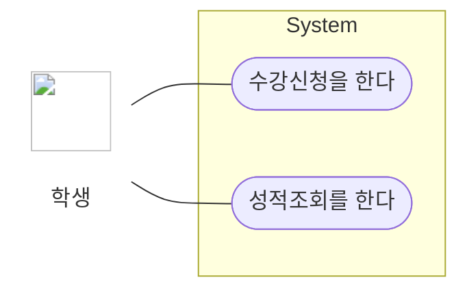

#### 구성요소 간의 관계

| 관계 | 설명 | 표기 |
|---|---|:---:|
| 연관 (Association) | 유스케이스와 액터 간 상호 작용이 있음을 표현 | 실선 |
| 포함 (Include) | 하나의 유스케이스가 다른 유스케이스의 실행을 **전제**로 할 때 형성 | 점선 화살표 + `<<include>>` |
| 확장 (Extend) | **특정 조건에 따라** 확장 기능 유스케이스를 수행 | 점선 화살표 + `<<extend>>` |
| 일반화 (Generalization) | 유사한 유스케이스·액터를 모아 추상화한 것과 연결해 그룹을 만들어 이해도를 높임 | 속이 빈 삼각형 화살표 |

**포함(Include)** — 글등록은 반드시 로그인을 필요로 한다. 화살표는 **필수 실행되는 쪽으로** 향한다.

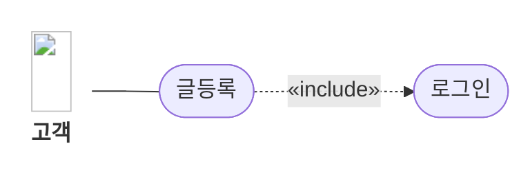

**확장(Extend)** — 파일첨부는 조건에 따라 실행될 수도, 안 될 수도 있다. 화살표는 **기본 유스케이스 쪽으로** 향한다(포함과 반대 방향).

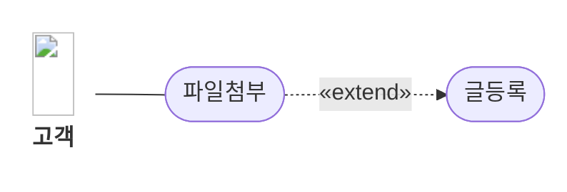

**일반화(Generalization)** — 회원·비회원 액터를 '고객'으로 추상화.

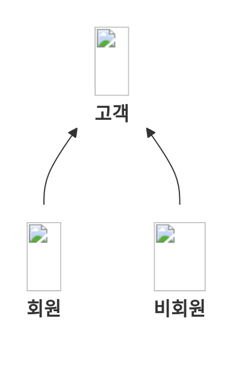

> ![star] **포함 vs 확장 구분법**: 포함은 "반드시 실행"(필수), 확장은 "실행할 수도 있음"(선택). **화살표 방향이 서로 반대**인 것도 자주 출제된다.

### 시퀀스 다이어그램

객체 간 상호 작용을 **메시지 흐름**으로 표현한 다이어그램이다. 순차 다이어그램이라고도 하며, **동적 다이어그램**으로 구분된다.

| 구성요소 | 설명 | 표기 |
|---|---|:---:|
| **객체 (Object)** | 위쪽에 표시되며 아래로 생명선을 가짐. 사각형 안에 **밑줄 친 이름**으로 명시 | ┌──────────┐    │ <u>객체명</u> │    └──────────┘ |
| **생명선 (Lifeline)** | 객체로부터 뻗어 나가는 점선. 객체의 생명주기 동안 발생하는 이벤트를 명시 | ┊    ┊    ┊ |
| **실행 (Activation)** | 오퍼레이션(함수)이 실행되는 시간. 길어질수록 수행 시간이 김 | ┊    ┌┐    ││    ││    └┘    ┊ |
| **메시지 (Message)** | 한 객체에서 다른 객체로 메시지를 전달하여 오퍼레이션을 수행 | ────────➔ |
| **회귀 메시지 (Self-Message)** | 같은 객체의 함수(메서드)를 호출. 본인의 Lifeline으로 회귀 | ──┐    &nbsp;&nbsp;&nbsp;&nbsp;▼    ◄──┘ |

**예시** — 세로 점선이 생명선, 좁은 직사각형이 실행(Activation), 서버가 자기 자신에게 보내는 것이 회귀 메시지다.

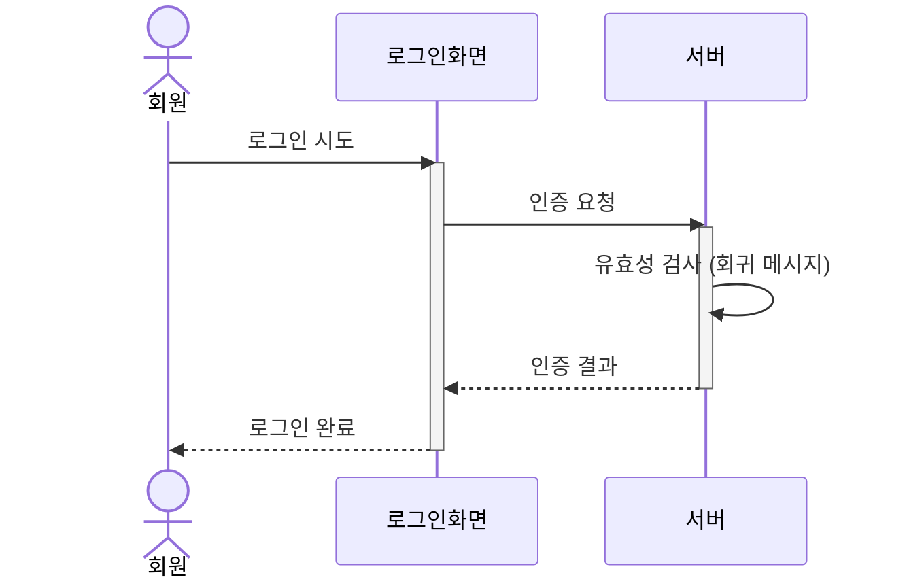
### 상태 다이어그램 <small>(23년 2회, 25년 1회)</small>

하나의 객체가 자신이 속한 클래스의 상태 변화 혹은 다른 객체와의 상호 작용에 따라 **상태가 어떻게 변화하는지** 표현하는 다이어그램이다.

| 구성요소 | 설명 | 표기 |
|---|---|:---:|
| **상태 (State)** | 객체가 존재할 수 있는 조건 | 둥근 사각형 ▢ |
| **시작 상태 (Initial State)** | 객체의 시작 상태 | 속이 채워진 원 ● |
| **종료 상태 (Final State)** | 객체의 종료 상태 | 원 안에 채워진 원 ◉ |
| **전이 (Transition)** | 객체의 상태가 다른 상태로 변경 | 실선 화살표 ➔ |
| **이벤트 (Event)** | 상태의 변화를 주는 현상 (전이 위에 이벤트 이름 표시) 예: 시간의 흐름, 조건, 외부 신호 | 이벤트    ───────➔ |
| **전이 조건 (Transition Condition)** | 특정 조건 만족 시 전이가 발생하도록 하는 속성값의 불린 식 | [전이 조건]    ───────➔ |

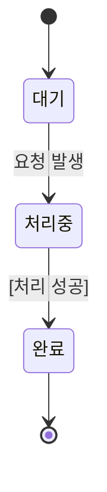

## 7. UML의 관계 <small>(20년 3회, 21년 2·3회, 24년 3회)</small>

사물과 사물 사이의 연관성을 표현한다. 연관, 의존, 일반화, 실체화, 포함, 집합 관계가 있다.

| 구분 | 설명 |
|---|---|
| 연관 (Association) | 2개 이상의 사물이 서로 관련된 상태. 실선으로 연결하고 방향성은 화살표로 표현. **양방향이면 화살표 생략**, 실선만 연결 |
| 의존 (Dependency) | 필요에 따라 **짧은 시간 동안만** 연관을 유지. 한 클래스가 다른 클래스를 오퍼레이션의 매개변수로 사용할 때 나타남. 영향을 주는 쪽에서 받는 쪽으로 **점선 화살표** |
| 일반화 (Generalization) | 하나의 사물이 다른 사물보다 더 일반적인지 구체적인지 표현. 일반적 개념이 부모(상위), 구체적 개념이 자식(하위). **하위 → 상위** 방향으로 속이 빈 화살표 |
| 실체화 (Realization) | 한 객체가 다른 객체에 오퍼레이션을 수행하도록 지정. 사물에서 기능 쪽으로 속이 빈 **점선** 화살표 |
| 포함 (Composition) | 집합 관계의 특수한 형태. 포함하는 사물의 변화가 포함되는 사물에 **영향을 미침**. 부분 → 전체 방향으로 **속이 채워진 마름모** ◆ |
| 집합 (Aggregation) | 하나의 사물이 다른 사물에 포함된 관계. 부분 → 전체 방향으로 **속이 빈 마름모** ◇ |

**연관 · 의존 · 일반화**

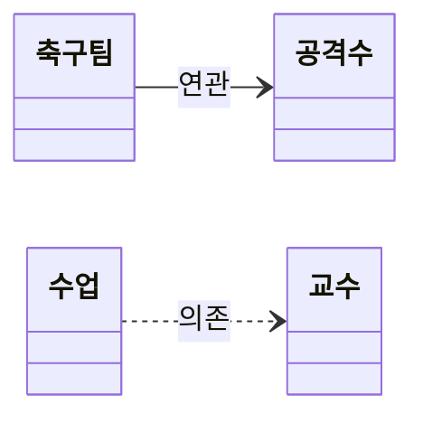

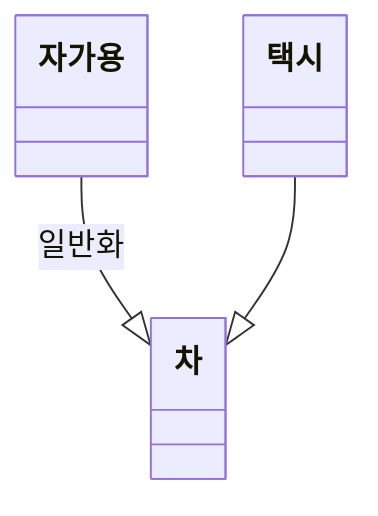

**실체화 · 포함 · 집합**

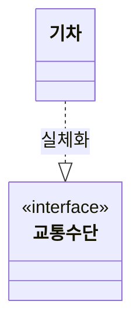

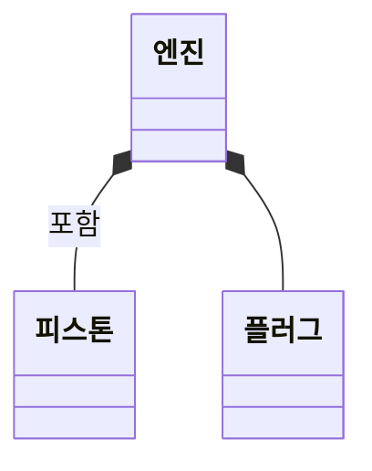

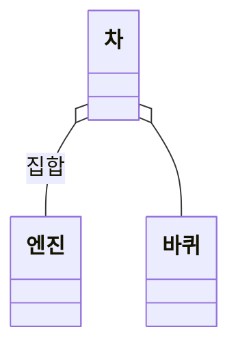

> ![star] **포함 vs 집합**: 엔진-피스톤(포함, 생명주기 공유)과 차-엔진(집합, 독립적 존재 가능)의 예시로 구분한다. 마름모가 **채워졌으면 포함(◆), 비었으면 집합(◇)**.

## 8. UML 확장 모델의 스테레오 타입 <small>(20년 1회, 21년 1회, 25년 1회)</small>

스테레오 타입은 UML의 기본 요소 이외의 **새로운 요소를 만들어 내기 위한 확장 메커니즘**이다. 형태는 기존 UML 요소를 그대로 사용하지만, 내부 의미는 다른 목적으로 확장한다. `<< >>` **길러멧(Guillemet)** 기호를 사용한다.

| 타입 | 설명 |
|:---:|---|
| `<<include>>` | 하나의 유스케이스가 어떤 시점에 **반드시** 다른 유스케이스를 실행하는 포함 관계 |
| `<<extend>>` | 하나의 유스케이스가 다른 유스케이스를 실행**할 수도, 안 할 수도** 있는 확장 관계. 기본 유스케이스 수행 시 특별한 조건을 만족할 때 수행 |
| `<<interface>>` | 모든 메서드가 추상 메서드이며 바로 인스턴스를 만들 수 없는 클래스. 추상 메서드와 상수만으로 구성 |

> ![star] "길러멧"이라는 기호 명칭 자체가 단답형으로 출제된 적 있다.

## 9. 애자일(Agile) 방법론 ★★★

### 개념

애자일 방법론은 개발과 함께 **즉시 피드백**을 받아 **유동적으로 개발**하는 소프트웨어 개발방법론이다.

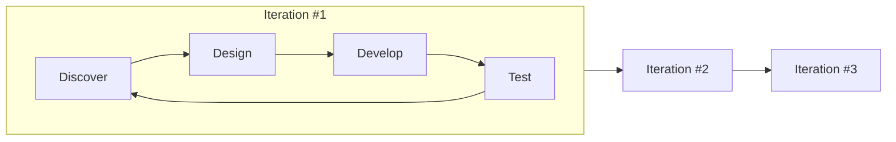

### 등장 배경

| 등장 배경 | 설명 |
|:---:|---|
| 소프트웨어 개발 환경의 변화 | 개발 트렌드가 모바일 환경으로 변화. 시장 적시성과 잦은 배포의 중요성 부각 |
| 기존 개발방법론의 한계 | 전통적 방법론은 문서·절차 위주로 변화에 신속한 대응이 어려움. 빠르고 효율적인 방법론의 필요성 증가 |

### 특징 <small>(20년 3·4회, 22년 2회)</small>

- 프로젝트의 요구사항은 **기능 중심**으로 정의한다.
- 절차와 도구보다 **개인과 소통**을 중요하게 생각한다.
- 작업 계획을 짧게 세워 **요구 변화에 유연하고 신속하게** 대응한다.
- 소프트웨어가 **잘 실행되는 데** 가치를 둔다.
- **고객과의 피드백**을 중요하게 생각한다.

### 애자일 선언문 <small>(21년 1·3회, 22년 1회, 24년 2회, 25년 3회)</small>

애자일 방법론을 실천하기 위한 주요 원칙이다. **"~보다 ~"의 대응 쌍**을 정확히 외워야 한다.

| ~보다 | ~를 |
|---|---|
| 공정과 도구보다 | **개인과 상호 작용** |
| 포괄적인 문서보다 | **동작하는 소프트웨어** |
| 계약 협상보다 | **고객과의 협력** |
| 계획을 따르기보다 | **변화에 대응하기** |

## 10. 애자일 방법론 유형 <small>(20년 2·4회, 21년 3회, 22년 2회, 24년 1·2·3회)</small>

대표적으로 **XP, 스크럼(SCRUM), 린(Lean), 크리스탈(Crystal), ASD, FDD** 등이 있다.

### XP (eXtreme Programming)

- **의사소통 개선과 즉각적 피드백**으로 소프트웨어 품질을 높이기 위한 방법론이다.
- 기존 방법론에 비해 **실용성**을 강조한다.
- **1~3주의 반복(Iteration) 개발 주기**를 가지며, **5가지 가치와 12개의 실천 항목**이 존재한다.

#### XP의 5가지 가치

| 가치 | 설명 |
|---|---|
| 용기 (Courage) | 용기를 가지고 자신감 있게 개발한다. 코드 작성 전 테스트, 빠른 피드백, 테스트에 부합하지 못하는 코드를 리팩토링할 수 있는 용기 |
| 단순성 (Simplicity) | 필요한 것만 하고 그 이상의 것들은 하지 않는다 |
| 의사소통 (Communication) | 개발자, 관리자, 고객 간의 원활한 소통 |
| 피드백 (Feedback) | 의사소통에 대한 빠른 피드백 |
| 존중 (Respect) | 팀원 간의 상호 존중 |

> ![star] 5가지 세트는 "**용·단·의·피·존**"으로 암기.

#### XP의 12가지 기본원리

| 기본원리 | 설명 |
|---|---|
| 짝 프로그래밍 (Pair Programming) | 개발자 둘이서 짝으로 코딩하는 원리 |
| 공동 코드 소유 (Collective Ownership) | 시스템에 있는 코드는 누구든지 언제라도 수정 가능하다는 원리 |
| 지속적인 통합 (CI; Continuous Integration) | 매일 여러 번씩 소프트웨어를 통합하고 빌드해야 한다는 원리 |
| 계획 세우기 (Planning Process) | 고객이 요구하는 비즈니스 가치를 정의하고, 개발자가 필요한 것은 무엇이며 어떤 부분에서 지연될 수 있는지를 알려주어야 한다는 원리 |
| 작은 릴리즈 (Small Release) | 작은 시스템을 먼저 만들고, 짧은 단위로 업데이트한다는 원리 |
| 메타포어 (Metaphor) | 공통적인 이름 체계와 시스템 서술서를 통해 고객과 개발자 간의 의사소통을 원활하게 한다는 원리 |
| 간단한 디자인 (Simple Design) | 현재의 요구사항에 적합한 가장 단순한 시스템을 설계한다는 원리 |
| 테스트 기반 개발 (TDD; Test Driven Development) | 작성해야 하는 프로그램에 대한 테스트를 먼저 수행하고, 이 테스트를 통과할 수 있도록 실제 프로그램의 코드를 작성한다는 원리 |
| 리팩토링 (Refactoring) | 프로그램의 기능을 바꾸지 않으면서 중복 제거, 단순화 등을 통해 코드의 내부 구조를 개선하고 재구성하는 원리 |
| 40시간 작업 (40-Hour Work) | 개발자가 피곤으로 인해 실수하지 않도록 일주일에 40시간 이상을 일하지 말아야 한다는 원리 |
| 고객 상주 (On Site Customer) | 개발자들의 질문에 즉각 대답해 줄 수 있는 고객을 프로젝트에 풀 타임으로 상주시켜야 한다는 원리 |
| 코드 표준 (Coding Standard) | 효과적인 공동 작업을 위해서는 모든 코드에 대한 코딩 표준을 정의해야 한다는 원리 |

### 스크럼 (SCRUM) <small>(22년 1회, 23년 1회, 24년 3회, 25년 2회)</small>

스크럼은 **매일 정해진 시간, 장소에서 짧은 시간의 개발을 하는 팀**을 위한 **프로젝트 관리 중심** 방법론이다.

#### 스크럼 주요 용어

| 주요 용어 | 설명 |
|---|---|
| 제품 책임자 (Product Owner) | 이해관계자의 의견을 종합하여 제품에 대한 **요구사항을 작성하는 주체**. 주로 개발 의뢰자나 사용자가 담당. 이해관계자 중 개발될 제품에 대한 이해도가 높고, 요구사항을 책임지고 의사 결정할 사람으로 선정 |
| 제품 백로그 (Product Backlog) | 제품과 프로젝트에 대한 **모든 요구사항**. 스크럼 팀이 해결해야 하는 목록으로 소프트웨어 요구사항, 아키텍처 정의 등이 포함될 수 있음 |
| 스프린트 (Sprint) | **실제 개발 작업 기간**. 2~4주의 짧은 개발 기간으로 되어 있고, 반복적 수행으로 개발 품질 향상 |
| 스크럼 미팅 (Scrum Meeting) | **매일 15분 정도** 미팅으로 To-Do List 계획수립. 데일리 미팅(Daily Meeting)이라고도 함 |
| 스크럼 마스터 (Scrum Master) | **프로젝트 리더**. 스크럼 수행 시 문제를 인지 및 해결하는 사람. 스크럼 프로세스를 따르고, 팀이 스크럼을 효과적으로 활용할 수 있도록 보장하는 역할 |
| 스프린트 회고 (Sprint Retrospective) | 스프린트 주기를 되돌아보며 정해놓은 **규칙 준수 여부, 개선점** 등을 확인 및 기록. 해당 스프린트가 끝난 시점이나 일정 주기로 시행 |
| 번 다운 차트 (Burn Down Chart) | **남아있는 백로그 대비 시간**을 그래픽적으로 표현한 차트. 백로그는 보통 수직축, 시간은 수평축 |
| 속도 (Velocity) | 한 번의 스프린트에서 한 팀이 어느 정도의 제품 백로그를 감당할 수 있는지에 대한 **추정치** |

> ![star] 스크럼 용어는 "역할(책임자·마스터) / 산출물(백로그·차트) / 활동(스프린트·미팅·회고)"으로 묶어서 외우면 안 헷갈린다.

### 린 (Lean)

- **도요타의 린 시스템 품질 기법**을 소프트웨어 개발 프로세스에 적용해서 **낭비 요소를 제거**하여 품질을 향상시킨 방법론이다.
- 린은 **JIT(Just In Time), 칸반 보드**를 사용한다.

### 크리스탈 (Crystal)

- 일반적으로 프로세스나 도구보다 **사람에게 더 많은 중점**을 두는 방법론이다.
- 생명이 중요하지 않은 시스템에서 작업하는 **최대 6명 또는 8명**의 공동 배치 소프트웨어 개발자 팀에 적용한다.

### ASD (Adaptive Software Development)

- 개발을 **혼란 자체로 규정**하고, 혼란을 대전제로 그에 적응할 수 있는 소프트웨어 방법을 제시하는 방법론이다.
- **합동 애플리케이션 개발**(Joint Application Development)을 사용한다.

### FDD (Feature Driven Development; 기능 중심 개발)

- 프로젝트를 **작은 기능 단위**로 나누어 개발하고, 빠른 피드백과 지속적인 개선을 추구하는 방법론이다.

---

## 📝 오답노트

이 단원의 오답은 별도 포스트에서 관리한다.

👉 **[오답노트 — 1과목 소프트웨어 설계](/정처기/wrong-note-part1/)**

[star]: /assets/images/star.png#blog-star-emoji "star"
