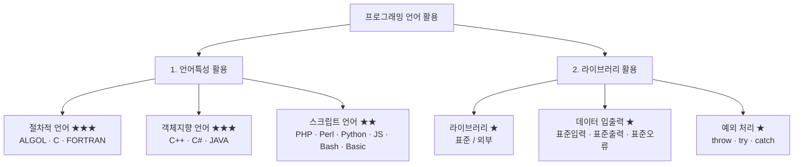
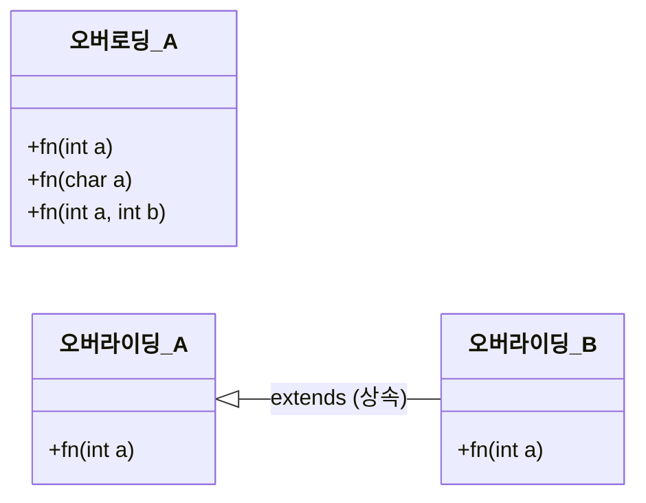
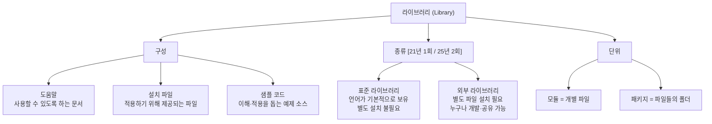
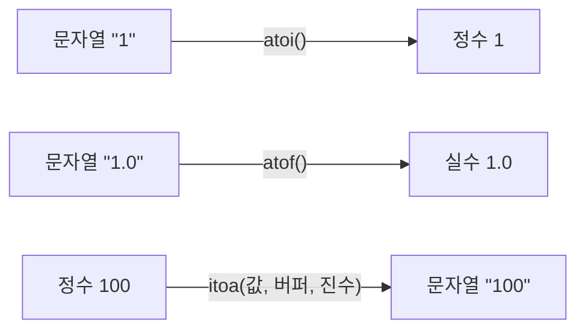
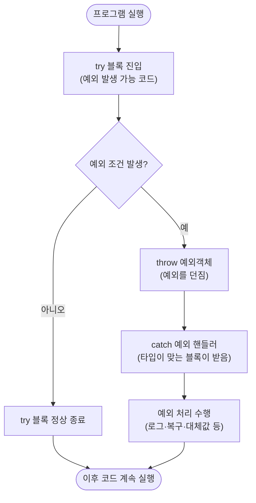
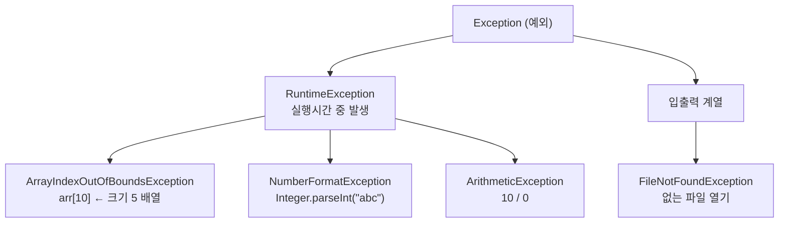

## 0. 전체 구조 한눈에 보기



---

# 1. 언어특성 활용

## (1) 절차적 프로그래밍 언어 ★★★

### 개념

- 절차적 프로그래밍 언어는 **프로시저 호출의 개념을 바탕**으로 하고 있는 프로그래밍 언어다.
- **명령형 프로그래밍**이라고도 불린다.

### 종류

| 종류 | 설명 |
|---|---|
| **알골 (ALGOL)** | · 알고리즘의 연구개발에 이용하기 위한 목적으로 생성<br/>· 절차형 언어로는 **최초로 재귀 호출이 가능**<br/>· 이후 언어의 발전에 큰 영향을 미침 |
| **C언어** | · **유닉스 운영체제**에서 사용하기 위해 개발한 프로그래밍 언어<br/>· 모든 컴퓨터 시스템에서 사용할 수 있도록 설계된 프로그래밍 언어 |
| **포트란 (FORTRAN)** | · 과학계산에서 필수적인 **벡터, 행렬 계산 기능**이 내장된 과학기술 전문 언어<br/>· 산술 기호, 삼각 함수, 지수함수, 대수함수 등 수학 함수 사용 가능 |

> ![star] **보충** — 세 언어를 구분하는 키워드만 잡으면 된다.
> ALGOL = *재귀 호출 최초*, C = *유닉스*, FORTRAN = *과학계산·수학함수*.

---

## (2) 객체지향 프로그래밍 언어 ★★★

### 개념

- 객체지향 프로그래밍 언어는 컴퓨터 프로그램을 **명령어의 목록으로 보는 시각에서 벗어나**, 여러 개의 독립된 단위인 **"객체" 중심**의 프로그래밍 언어다.

### 객체지향 프로그래밍 언어 기능 `[20년 1회 / 23년 3회 / 24년 1회·3회]`

| 기능 | 설명 |
|---|---|
| **추상화 (Abstraction)** | 공통 성질을 추출하여 추상 클래스를 설정하는 기법 |
| **상속 (Inheritance)** | 어떤 객체가 있을 때 그 객체의 **변수와 메서드**를 다른 객체가 물려받는 기능 |
| **다형성 (Polymorphism)** | · 상속받은 여러 개의 하위 객체들이 다른 형태의 특성을 갖는 객체로 이용될 수 있는 성질<br/>· **오버로딩, 오버라이딩**이 대표적 |
| **바인딩 (Binding)** | 프로그래밍에서 변수나 함수 등의 **이름과 해당하는 메모리 주소를 연결**하는 과정 |
| **접근 제어자 (Access Modifier)** | 지정된 클래스, 변수, 메서드를 외부(같은 패키지이거나 다른 패키지)에서 접근할 수 있도록 **권한을 설정**하는 기능 |

#### 다형성의 두 축

| 종류 | 설명 |
|---|---|
| **오버로딩 (Overloading)** | 매개변수의 **유형과 개수를 다르게** 하여 같은 이름의 메서드를 여러 개 가지는 기법 |
| **오버라이딩 (Overriding)** | 상위 클래스에서 정의한 일반 메서드의 구현을 **하위 클래스에서 무시하고 재정의**할 수 있는 기법 |



**교재 예제 코드**

```java
// 오버로딩(Overloading) — 같은 이름, 다른 매개변수
class A {
    void fn(int a);
    void fn(char a);
    void fn(int a, int b);
};

// 오버라이딩(Overriding) — 상속받아 같은 이름의 함수를 재정의
class A {
    void fn(int a);
};
class B extends A {   // A 클래스를 상속
    void fn(int a);
};
```

> ![star] **보충 (바인딩과 묶어서 외우면 좋다)**
> · 오버로딩 → 어떤 함수를 부를지 **컴파일 시점**에 결정된다 → **정적 바인딩**
> · 오버라이딩 → 실제 객체 타입에 따라 **실행 시점**에 결정된다 → **동적 바인딩**
> 즉 "다형성"이 실제로 동작하는 원리가 바로 위의 "바인딩"이다.

---

### 자바 접근 제어자 (개념 박살내기)

| 종류 | 설명 |
|---|---|
| **public** | 외부의 모든 클래스에서 접근이 가능한 접근제어자 |
| **protected** | · 같은 패키지 내부에 있는 클래스, **하위 클래스(상속받은 경우)** 에서 접근 가능<br/>· 자기 자신과 상속받은 하위 클래스 둘 다 접근 가능 |
| **default** | · 접근제어자를 **명시하지 않은 경우**<br/>· 같은 패키지 내부에 있는 클래스에서 접근 가능 |
| **private** | **같은 클래스 내에서만** 접근이 가능한 접근제어자 |

**허용 범위 (O / X)**

| 허용 범위 | public | protected | default | private |
|---|:---:|:---:|:---:|:---:|
| 클래스 내부 | O | O | O | O |
| 동일 패키지 | O | O | O | X |
| 하위 클래스(패키지) | O | O | X | X |
| 다른 패키지 | O | X | X | X |

<svg viewBox="0 0 760 350" xmlns="http://www.w3.org/2000/svg" width="100%" role="img" aria-label="자바 접근 제어자 허용 범위">
  <rect x="0" y="0" width="760" height="350" fill="#ffffff"/>
  <text x="20" y="28" font-family="sans-serif" font-size="17" font-weight="700" fill="#1f2937">JAVA 접근 제어자 허용 범위 (넓을수록 개방적)</text>
  <text x="150" y="62" font-family="sans-serif" font-size="12" fill="#6b7280" text-anchor="middle">클래스 내부</text>
  <text x="290" y="62" font-family="sans-serif" font-size="12" fill="#6b7280" text-anchor="middle">동일 패키지</text>
  <text x="430" y="62" font-family="sans-serif" font-size="12" fill="#6b7280" text-anchor="middle">하위 클래스</text>
  <text x="570" y="62" font-family="sans-serif" font-size="12" fill="#6b7280" text-anchor="middle">다른 패키지</text>
  <line x1="80" y1="72" x2="720" y2="72" stroke="#e5e7eb" stroke-width="1"/>
  <line x1="220" y1="72" x2="220" y2="330" stroke="#f3f4f6" stroke-width="1"/>
  <line x1="360" y1="72" x2="360" y2="330" stroke="#f3f4f6" stroke-width="1"/>
  <line x1="500" y1="72" x2="500" y2="330" stroke="#f3f4f6" stroke-width="1"/>
  <text x="72" y="108" font-family="monospace" font-size="14" font-weight="700" fill="#2563eb" text-anchor="end">public</text>
  <rect x="84" y="88" width="552" height="30" rx="6" fill="#dbeafe" stroke="#2563eb" stroke-width="1.5"/>
  <text x="360" y="108" font-family="sans-serif" font-size="12" fill="#1e40af" text-anchor="middle">어디서든 접근 가능</text>
  <text x="72" y="163" font-family="monospace" font-size="14" font-weight="700" fill="#0891b2" text-anchor="end">protected</text>
  <rect x="84" y="143" width="412" height="30" rx="6" fill="#cffafe" stroke="#0891b2" stroke-width="1.5"/>
  <text x="290" y="163" font-family="sans-serif" font-size="12" fill="#155e75" text-anchor="middle">같은 패키지 + 상속받은 하위 클래스</text>
  <text x="72" y="218" font-family="monospace" font-size="14" font-weight="700" fill="#059669" text-anchor="end">default</text>
  <rect x="84" y="198" width="272" height="30" rx="6" fill="#d1fae5" stroke="#059669" stroke-width="1.5"/>
  <text x="220" y="218" font-family="sans-serif" font-size="12" fill="#065f46" text-anchor="middle">같은 패키지까지 (미명시 시 기본값)</text>
  <text x="72" y="273" font-family="monospace" font-size="14" font-weight="700" fill="#dc2626" text-anchor="end">private</text>
  <rect x="84" y="253" width="132" height="30" rx="6" fill="#fee2e2" stroke="#dc2626" stroke-width="1.5"/>
  <text x="150" y="273" font-family="sans-serif" font-size="12" fill="#991b1b" text-anchor="middle">같은 클래스만</text>
  <text x="84" y="318" font-family="sans-serif" font-size="12.5" fill="#374151">개방 범위 순서 :  public  &gt;  protected  &gt;  default  &gt;  private</text>
</svg>

> ![star] **보충** — 접근 범위는 항상 `public > protected > default > private` 순으로 좁아진다.
> `default`는 키워드가 따로 없고, **아무것도 안 쓰면 default**라는 점이 자주 함정으로 나온다.

---

### 객체지향 프로그래밍 언어 종류 `[20년 4회 / 21년 1회·3회 / 23년 2회 / 24년 1회 / 25년 2회·3회]`

| 종류 | 설명 |
|---|---|
| **C++** | · C 문법에 객체지향 개념과 일반화 프로그래밍을 위한 **템플릿 기능**이 추가<br/>· 원하는 많은 작업들을 **성능 하락이 없는 형태**로 개발 가능<br/>· 직접 신경써야 하는 것들(**메모리 관리**)이 많아 개발이 어려움 |
| **C#** | · **마이크로소프트**에서 개발한 객체지향 프로그래밍 언어<br/>· C++와 자바의 문법과 비슷한 문법을 가짐<br/>· 자바와 달리 **불안전 코드(Unsafe Code)** 와 같은 기술을 통해 플랫폼 간 상호 운용성 확보 |
| **자바 (JAVA)** | · **썬 마이크로시스템즈(Oracle에 합병)** 가 개발한 객체지향 언어<br/>· 자바 컴파일러는 자바 프로그램을 **바이트 코드**라는 특수한 바이너리 형태로 변환 |

#### JAVA 원시 타입(Primitive Type) 8가지

| 분류 | 자료형 |
|---|---|
| 논리형 | `boolean` (1바이트) |
| 문자 | `char` (2바이트) |
| 정수 | `byte`(1) , `short`(2) , `int`(4) , `long`(8) |
| 실수 | `float`(4) , `double`(8) |

<svg viewBox="0 0 760 400" xmlns="http://www.w3.org/2000/svg" width="100%" role="img" aria-label="JAVA 원시 타입 8가지와 크기">
  <rect x="0" y="0" width="760" height="400" fill="#ffffff"/>
  <text x="20" y="30" font-family="sans-serif" font-size="17" font-weight="700" fill="#1f2937">JAVA 원시 타입(Primitive Type) 8가지 — 바이트 크기</text>
  <text x="20" y="52" font-family="sans-serif" font-size="12" fill="#6b7280">막대 길이가 곧 메모리 크기다 (1바이트 = 55px)</text>

  <text x="60" y="101" font-family="sans-serif" font-size="12.5" font-weight="700" fill="#7c3aed" text-anchor="end">논리형</text>
  <text x="118" y="101" font-family="monospace" font-size="13" fill="#374151" text-anchor="end">boolean</text>
  <rect x="128" y="84" width="55" height="24" rx="4" fill="#ede9fe" stroke="#7c3aed"/>
  <text x="196" y="101" font-family="sans-serif" font-size="12" fill="#6b7280">1바이트</text>

  <text x="60" y="141" font-family="sans-serif" font-size="12.5" font-weight="700" fill="#db2777" text-anchor="end">문자</text>
  <text x="118" y="141" font-family="monospace" font-size="13" fill="#374151" text-anchor="end">char</text>
  <rect x="128" y="124" width="110" height="24" rx="4" fill="#fce7f3" stroke="#db2777"/>
  <text x="251" y="141" font-family="sans-serif" font-size="12" fill="#6b7280">2바이트</text>

  <text x="60" y="215" font-family="sans-serif" font-size="12.5" font-weight="700" fill="#2563eb" text-anchor="end">정수</text>
  <text x="118" y="181" font-family="monospace" font-size="13" fill="#374151" text-anchor="end">byte</text>
  <rect x="128" y="164" width="55" height="24" rx="4" fill="#dbeafe" stroke="#2563eb"/>
  <text x="196" y="181" font-family="sans-serif" font-size="12" fill="#6b7280">1바이트</text>
  <text x="118" y="215" font-family="monospace" font-size="13" fill="#374151" text-anchor="end">short</text>
  <rect x="128" y="198" width="110" height="24" rx="4" fill="#dbeafe" stroke="#2563eb"/>
  <text x="251" y="215" font-family="sans-serif" font-size="12" fill="#6b7280">2바이트</text>
  <text x="118" y="249" font-family="monospace" font-size="13" fill="#374151" text-anchor="end">int</text>
  <rect x="128" y="232" width="220" height="24" rx="4" fill="#dbeafe" stroke="#2563eb"/>
  <text x="361" y="249" font-family="sans-serif" font-size="12" fill="#6b7280">4바이트</text>
  <text x="118" y="283" font-family="monospace" font-size="13" fill="#374151" text-anchor="end">long</text>
  <rect x="128" y="266" width="440" height="24" rx="4" fill="#dbeafe" stroke="#2563eb"/>
  <text x="581" y="283" font-family="sans-serif" font-size="12" fill="#6b7280">8바이트</text>

  <text x="60" y="341" font-family="sans-serif" font-size="12.5" font-weight="700" fill="#059669" text-anchor="end">실수</text>
  <text x="118" y="324" font-family="monospace" font-size="13" fill="#374151" text-anchor="end">float</text>
  <rect x="128" y="307" width="220" height="24" rx="4" fill="#d1fae5" stroke="#059669"/>
  <text x="361" y="324" font-family="sans-serif" font-size="12" fill="#6b7280">4바이트</text>
  <text x="118" y="358" font-family="monospace" font-size="13" fill="#374151" text-anchor="end">double</text>
  <rect x="128" y="341" width="440" height="24" rx="4" fill="#d1fae5" stroke="#059669"/>
  <text x="581" y="358" font-family="sans-serif" font-size="12" fill="#6b7280">8바이트</text>

  <text x="128" y="390" font-family="sans-serif" font-size="12" fill="#374151">원시 타입 8개 외의 배열(Array) · 클래스(Class)는 참조 값을 가지는 레퍼런스 타입이다</text>
</svg>

- **레퍼런스 타입(Reference Type)** 은 참조 값을 가지는 자료형으로, 대표적으로 **배열(Array), 클래스(Class)** 등이 있다.

#### 자바의 5대 기능

| 기능 | 설명 |
|---|---|
| **분산처리 지원** | 대규모 분산 환경을 고려하여 설계된 언어 |
| **GC (Garbage Collection) 사용** | 프로그램이 동적으로 할당했던 메모리 영역 중 **필요 없게 된 영역을 해제**하는 기능 |
| **운영체제 독립적** | 자바로 작성된 프로그램은 운영체제에 상관없이 실행 |
| **멀티 스레드 지원** | 하나의 프로세스 내에서 **둘 이상의 스레드가 동시에 작업** 가능 |
| **동적 로딩 지원** | 실행 시에 모든 클래스가 로딩되지 않고 **필요한 시점에 클래스를 로딩**하여 사용 |

> ![star] **보충** — "운영체제 독립적"이 가능한 이유가 바로 위의 **바이트 코드**다.
> 소스 → (컴파일) → 바이트 코드 → 각 OS의 JVM이 해석 → 실행. 그래서 *WORA(Write Once, Run Anywhere)* 라고 부른다.

---

## (3) 스크립트 언어 ★★

### 개념

- 스크립트 언어는 소스 코드를 **컴파일하지 않고도 실행할 수 있는** 프로그래밍 언어다.
- 응용 프로그램과 **독립하여 사용**되고, 일반적으로 응용 프로그램의 언어와 다른 언어로 사용되어 **최종사용자가 응용 프로그램의 동작을 자기 요구에 맞게 수행**할 수 있도록 해준다.

### 스크립트 언어 종류 `[20년 3회 / 21년 2회 / 23년 1회·3회 / 25년 1회]`

| 종류 | 설명 |
|---|---|
| **PHP** | · **동적 웹 페이지**를 만들기 위해 설계됨<br/>· PHP로 작성된 코드를 HTML에 입력 시 **웹 서버**에서 해당 코드를 인식하여 작성자가 원하는 웹 페이지를 생성<br/>· 명령줄 인터페이스 방식의 자체 인터프리터를 제공 |
| **펄 (Perl)** | · **인터프리터** 방식의 프로그래밍 언어<br/>· 실용성을 모토로 하여 C, 쉘 스크립트(sh) 등 다른 언어에서 뛰어난 기능을 많이 도입<br/>· 불특정한 데이터 길이의 제약 없이 **강력한 문자열 처리 기능** 제공 |
| **파이썬 (Python)** | · 인터프리터 방식이자 **객체 지향적**이며, 배우기 쉽고 **이식성이 좋음**<br/>· 다양한 플랫폼에서 쓸 수 있고 라이브러리(모듈)가 풍부<br/>· **들여쓰기**를 사용하여 블록을 구분하는 문법 채용 |
| **자바스크립트 (JavaScript)** | · **객체 기반**의 스크립트 프로그래밍 언어<br/>· 웹 브라우저 내에서 주로 사용하며, 다른 응용 프로그램의 내장 객체에도 접근 가능<br/>· **브라우저마다 지원되는 버전이 상이**<br/>· **타입을 명시할 필요가 없는** 인터프리터 언어<br/>· **프로토타입(Prototype)** 의 개념이 존재 |
| **배시 (Bash)** | · sh와 대부분 호환되며 **리눅스에 기본 탑재**됨<br/>· 제어문에는 조건을 위한 `if`, 반복을 위한 `for`, `while`이 있음 |
| **베이직 (Basic)** | · **교육용**으로 개발된 언어<br/>· 다양한 종류가 존재하며 **문법 차이가 큼** |

#### 자바스크립트의 프로토타입 `[25년 1회 단골]`

| 구분 | 설명 |
|---|---|
| **Prototype Link** | 자신을 **만들어낸** 객체의 원형 |
| **Prototype Object** | 자신을 **통해 만들어질** 객체의 원형 |

> ![star] **암기 팁** — Link는 *과거(나를 만든 것)*, Object는 *미래(내가 만들 것)* 로 방향을 잡으면 헷갈리지 않는다.

---

# 2. 라이브러리 활용

## (1) 라이브러리 ★

### 개념

- 라이브러리는 효율적인 프로그램 개발을 위해 **필요한 프로그램을 모아 놓은 집합체**다.
- 라이브러리는 **모듈과 패키지를 총칭**하며, **모듈이 개별 파일**이라면 **패키지는 파일들을 모아 놓은 폴더**라고 볼 수 있다.



### 구성

| 구성 | 설명 |
|---|---|
| 도움말 | 라이브러리를 사용할 수 있도록 하는 도움말 문서 |
| 설치 파일 | 라이브러리를 적용하기 위해 제공되는 설치 파일 |
| 샘플 코드 | 라이브러리를 이해하고 손쉽게 적용하기 위해 제공되는 샘플 소스 코드 |

### 종류 `[21년 1회 / 25년 2회]`

| 종류 | 설명 |
|---|---|
| **표준 라이브러리** | · 프로그래밍 언어가 **기본적으로 가지고 있는** 라이브러리<br/>· 여러 종류의 모듈과 패키지를 가지며, **별도의 파일 설치 없이** 날짜·시간 등의 기능을 이용 가능 |
| **외부 라이브러리** | · 표준 라이브러리와 달리 **별도의 파일을 설치**<br/>· 누구나 개발하여 설치할 수 있으며, 인터넷 등을 이용하여 **공유** 가능 |

---

### 표준 라이브러리 상세 `[21년 2회·3회 / 22년 3회 / 23년 2회 / 24년 1회·3회 / 25년 3회]`

- 입출력, 문자열 등 일반적으로 많이 사용하는 라이브러리를 표준 라이브러리 형태로 제공한다.
- 표준 라이브러리의 함수들을 조합하여 **새로운 함수 및 라이브러리를 만들 수 있다.**

| 표준 라이브러리 | 설명 | C언어 | JAVA |
|---|---|---|---|
| **입출력** | 핵심 입력과 출력 함수들을 정의 | `<stdio.h>` | Scanner Class |
| **문자열** | 문자열 처리 함수들을 정의 | `<string.h>` | String Class |
| **시간 처리** | 데이터와 시간 처리 함수들을 정의 | `<time.h>` | Date Class |
| **수학** | 일반적인 수학 함수 정의 | `<math.h>` | Math Class |

> 📌 **학습 Point** — C언어는 표준 라이브러리를 **헤더 파일**로 제공하는데, 각 헤더 파일에는 입출력(I/O)처리, 문자열 처리 등 응용 프로그램 개발에 필요한 함수들이 정리되어 있다.

---

### ① 문자열 라이브러리 함수 `#include <string.h>`

| 함수 | 형식 | 설명 |
|---|---|---|
| **strcat** | `strcat(dest, src);` | 문자열끼리 **연결**(String Concatenate) — src를 dest 뒤에 붙임 |
| **strcpy** | `strcpy(dest, src);` | 문자열을 **복사**(String Copy) — src를 dest에 복사 |
| **strcmp** | `strcmp(s1, s2);` | 문자열 **비교**(String Compare) — `s1 < s2`면 −1, `s1 == s2`면 0, `s1 > s2`면 1 반환 |
| **strlen** | `strlen(s);` | 문자열 **길이** 반환(String Length) |
| **strrev** | `strrev(str);` | 문자열을 **거꾸로 뒤집음**(String Reverse) |
| **strchr** | `strchr(str, c);` | 문자열 내에 **일치하는 문자가 있는지 검사**, 첫 번째 위치 반환 |

**교재 예제**

```c
char a[20] = "Hello";
char b[10] = "Soojebi";

strcat(a, b);   // a는 "HelloSoojebi", b는 "Soojebi" 그대로
strcpy(a, b);   // a와 b 모두 "Soojebi"
strcmp(a, b);   // "Hello"가 "Soojebi"보다 앞서므로 -1 반환

char a[20] = "Hello";
strlen(a);      // Hello는 5글자이므로 5 출력

char a[6] = "Hello";
strrev(a);      // a에 저장된 Hello가 "olleH"로 변경

char a[20] = "Soojebi";
strchr(a, 'o'); // 첫 번째 o가 나온 위치를 반환
```

<svg viewBox="0 0 760 430" xmlns="http://www.w3.org/2000/svg" width="100%" role="img" aria-label="문자열 함수 동작 도식">
  <rect x="0" y="0" width="760" height="430" fill="#ffffff"/>
  <text x="20" y="28" font-family="sans-serif" font-size="17" font-weight="700" fill="#1f2937">문자열 함수 동작 비교 (a = "Hello", b = "Soojebi")</text>

  <text x="20" y="70" font-family="monospace" font-size="14" font-weight="700" fill="#2563eb">strcat(a, b)</text>
  <rect x="150" y="52" width="110" height="26" rx="4" fill="#f3f4f6" stroke="#9ca3af"/>
  <text x="205" y="70" font-family="monospace" font-size="13" fill="#374151" text-anchor="middle">a: Hello</text>
  <text x="272" y="70" font-family="sans-serif" font-size="14" fill="#6b7280">+</text>
  <rect x="288" y="52" width="120" height="26" rx="4" fill="#f3f4f6" stroke="#9ca3af"/>
  <text x="348" y="70" font-family="monospace" font-size="13" fill="#374151" text-anchor="middle">b: Soojebi</text>
  <path d="M418 65 L452 65" stroke="#2563eb" stroke-width="2" marker-end="url(#ar)"/>
  <rect x="462" y="52" width="180" height="26" rx="4" fill="#dbeafe" stroke="#2563eb"/>
  <text x="552" y="70" font-family="monospace" font-size="13" fill="#1e40af" text-anchor="middle">a: HelloSoojebi</text>
  <text x="655" y="70" font-family="sans-serif" font-size="11.5" fill="#6b7280">b는 그대로</text>

  <text x="20" y="140" font-family="monospace" font-size="14" font-weight="700" fill="#059669">strcpy(a, b)</text>
  <rect x="150" y="122" width="110" height="26" rx="4" fill="#f3f4f6" stroke="#9ca3af"/>
  <text x="205" y="140" font-family="monospace" font-size="13" fill="#374151" text-anchor="middle">a: Hello</text>
  <text x="272" y="140" font-family="sans-serif" font-size="14" fill="#6b7280">←</text>
  <rect x="288" y="122" width="120" height="26" rx="4" fill="#f3f4f6" stroke="#9ca3af"/>
  <text x="348" y="140" font-family="monospace" font-size="13" fill="#374151" text-anchor="middle">b: Soojebi</text>
  <path d="M418 135 L452 135" stroke="#059669" stroke-width="2" marker-end="url(#ar2)"/>
  <rect x="462" y="122" width="180" height="26" rx="4" fill="#d1fae5" stroke="#059669"/>
  <text x="552" y="140" font-family="monospace" font-size="13" fill="#065f46" text-anchor="middle">a: Soojebi</text>
  <text x="655" y="140" font-family="sans-serif" font-size="11.5" fill="#6b7280">a·b 동일</text>

  <text x="20" y="210" font-family="monospace" font-size="14" font-weight="700" fill="#dc2626">strcmp(a, b)</text>
  <text x="150" y="210" font-family="monospace" font-size="13" fill="#374151">"Hello" &lt; "Soojebi"  (H가 S보다 사전순 앞)</text>
  <path d="M470 205 L504 205" stroke="#dc2626" stroke-width="2" marker-end="url(#ar3)"/>
  <rect x="514" y="192" width="70" height="26" rx="4" fill="#fee2e2" stroke="#dc2626"/>
  <text x="549" y="210" font-family="monospace" font-size="13" fill="#991b1b" text-anchor="middle">-1</text>
  <text x="596" y="210" font-family="sans-serif" font-size="11.5" fill="#6b7280">같으면 0 / 뒤면 1</text>

  <text x="20" y="280" font-family="monospace" font-size="14" font-weight="700" fill="#7c3aed">strlen(a)</text>
  <g font-family="monospace" font-size="14" fill="#374151">
    <rect x="150" y="262" width="30" height="26" fill="#ede9fe" stroke="#7c3aed"/><text x="165" y="280" text-anchor="middle">H</text>
    <rect x="180" y="262" width="30" height="26" fill="#ede9fe" stroke="#7c3aed"/><text x="195" y="280" text-anchor="middle">e</text>
    <rect x="210" y="262" width="30" height="26" fill="#ede9fe" stroke="#7c3aed"/><text x="225" y="280" text-anchor="middle">l</text>
    <rect x="240" y="262" width="30" height="26" fill="#ede9fe" stroke="#7c3aed"/><text x="255" y="280" text-anchor="middle">l</text>
    <rect x="270" y="262" width="30" height="26" fill="#ede9fe" stroke="#7c3aed"/><text x="285" y="280" text-anchor="middle">o</text>
    <rect x="300" y="262" width="30" height="26" fill="#f3f4f6" stroke="#9ca3af" stroke-dasharray="3 2"/><text x="315" y="280" text-anchor="middle" font-size="11" fill="#9ca3af">\0</text>
  </g>
  <text x="345" y="280" font-family="sans-serif" font-size="12.5" fill="#6b7280">→ 반환값 5 (널문자 \0 은 길이에서 제외, 저장 공간은 6 필요)</text>

  <text x="20" y="350" font-family="monospace" font-size="14" font-weight="700" fill="#db2777">strrev(a)</text>
  <rect x="150" y="332" width="110" height="26" rx="4" fill="#f3f4f6" stroke="#9ca3af"/>
  <text x="205" y="350" font-family="monospace" font-size="13" fill="#374151" text-anchor="middle">Hello</text>
  <path d="M270 345 L304 345" stroke="#db2777" stroke-width="2" marker-end="url(#ar4)"/>
  <rect x="314" y="332" width="110" height="26" rx="4" fill="#fce7f3" stroke="#db2777"/>
  <text x="369" y="350" font-family="monospace" font-size="13" fill="#9d174d" text-anchor="middle">olleH</text>

  <text x="20" y="400" font-family="monospace" font-size="14" font-weight="700" fill="#0891b2">strchr(a,'o')</text>
  <text x="150" y="400" font-family="monospace" font-size="13" fill="#374151">"S o o j e b i" 에서 첫 번째 'o' 의 위치를 반환</text>

  <defs>
    <marker id="ar" markerWidth="8" markerHeight="8" refX="7" refY="4" orient="auto"><path d="M0,0 L8,4 L0,8 z" fill="#2563eb"/></marker>
    <marker id="ar2" markerWidth="8" markerHeight="8" refX="7" refY="4" orient="auto"><path d="M0,0 L8,4 L0,8 z" fill="#059669"/></marker>
    <marker id="ar3" markerWidth="8" markerHeight="8" refX="7" refY="4" orient="auto"><path d="M0,0 L8,4 L0,8 z" fill="#dc2626"/></marker>
    <marker id="ar4" markerWidth="8" markerHeight="8" refX="7" refY="4" orient="auto"><path d="M0,0 L8,4 L0,8 z" fill="#db2777"/></marker>
  </defs>
</svg>

> ![star] **보충**
> · `strcat`은 **원본 b는 그대로**, `strcpy`는 **a가 b로 덮어써진다**는 점이 핵심 차이다.
> · 교재의 `char a[6] = "Hello";` 에서 6인 이유는 문자 5개 + **널 문자(`\0`) 1개**가 필요하기 때문이다.
> · `strcmp`는 "앞서면 음수, 같으면 0, 뒤면 양수"로 기억하면 된다.

---

### ② 표준 라이브러리 함수 `#include <stdlib.h>` `[21년 1회 / 25년 3회]`

| 함수 | 형식 | 설명 |
|---|---|---|
| **atoi** | `atoi(str)` | 문자열(str)을 **정수(int)형**으로 변환 |
| **atof** | `atof(str)` | 문자열(str)을 **실수형(float, double)** 으로 변환 |
| **itoa** | `itoa(value, str, radix);` | **정수(int)형을 문자열(str)** 로 변환, radix 진수로 저장 |

```c
int num = 0;
char *str_num = "1";
num = atoi(str_num);        // 문자열 "1" → 숫자 1

double num = 0.0;
char *str_num = "1.0";
num = atof(str_num);        // 문자열 "1.0" → 숫자 1.0

char buffer[4] = {0};       // 변환된 값을 저장할 버퍼
int num = 100;
itoa(num, buffer, 10);      // 숫자 100 → 문자열 "100" (10진수)
```



> ![star] **암기 팁** — `a to i` = **A**SCII **to** **I**nteger, `a to f` = ASCII to Float, `i to a` = Integer to ASCII.
> 앞글자가 **출발지**, 뒷글자가 **도착지**다.

---

### ③ 수학 라이브러리 함수 `#include <math.h>`

| 함수 | 형식 | 설명 |
|---|---|---|
| **ceil** | `ceil(n);` | 소숫점 **올림** 함수 |
| **floor** | `floor(n);` | 소숫점 **내림** 함수 |

```c
double a = 1.1;
ceil(a);    // 1.1을 올림하여 2.0이 됨
floor(a);   // 1.1을 내림하여 1.0이 됨
```

> ![star] **암기 팁** — `ceil`(천장) = 위로, `floor`(바닥) = 아래로.

---

## (2) 데이터 입출력 ★

### 개념

- 데이터 입출력은 **프로그램으로 데이터가 입력** 및 **프로그램으로부터 데이터가 출력**되도록 하기 위한 기법이다.

### 데이터 입출력 구성

- 데이터 입출력 구성은 **표준 입력, 표준 출력, 표준 오류**가 있다.

| 구성 | 설명 |
|---|---|
| **표준 입력** | · 프로그램으로 **들어가는** 데이터(보통은 문자열) 스트림<br/>· 프로그램은 **읽기(Read)** 명령을 이용하여 데이터 전송을 요청 |
| **표준 출력** | · 프로그램이 **출력 데이터를 기록**하는 스트림<br/>· 프로그램은 **쓰기(Write)** 명령을 이용하여 데이터 전송을 요청 |
| **표준 오류** | · 프로그램이 **오류 메시지나 진단을 출력**하기 위해 일반적으로 쓰이는 또 다른 출력 스트림 |

<svg viewBox="0 0 760 300" xmlns="http://www.w3.org/2000/svg" width="100%" role="img" aria-label="표준 입출력 스트림 도식">
  <rect x="0" y="0" width="760" height="300" fill="#ffffff"/>
  <text x="20" y="28" font-family="sans-serif" font-size="17" font-weight="700" fill="#1f2937">데이터 입출력 구성 — 3가지 표준 스트림</text>

  <rect x="290" y="90" width="180" height="120" rx="10" fill="#eef2ff" stroke="#4f46e5" stroke-width="2"/>
  <text x="380" y="142" font-family="sans-serif" font-size="16" font-weight="700" fill="#312e81" text-anchor="middle">프로그램</text>
  <text x="380" y="166" font-family="sans-serif" font-size="12" fill="#4f46e5" text-anchor="middle">(Process)</text>

  <rect x="30" y="120" width="130" height="52" rx="8" fill="#d1fae5" stroke="#059669" stroke-width="1.5"/>
  <text x="95" y="143" font-family="sans-serif" font-size="14" font-weight="700" fill="#065f46" text-anchor="middle">표준 입력</text>
  <text x="95" y="162" font-family="monospace" font-size="11.5" fill="#047857" text-anchor="middle">stdin · 키보드</text>
  <path d="M164 146 L282 146" stroke="#059669" stroke-width="2.5" marker-end="url(#gin)"/>
  <text x="223" y="136" font-family="sans-serif" font-size="12" fill="#059669" text-anchor="middle">읽기(Read)</text>

  <rect x="600" y="70" width="130" height="52" rx="8" fill="#dbeafe" stroke="#2563eb" stroke-width="1.5"/>
  <text x="665" y="93" font-family="sans-serif" font-size="14" font-weight="700" fill="#1e40af" text-anchor="middle">표준 출력</text>
  <text x="665" y="112" font-family="monospace" font-size="11.5" fill="#1d4ed8" text-anchor="middle">stdout · 모니터</text>
  <path d="M478 130 L592 100" stroke="#2563eb" stroke-width="2.5" marker-end="url(#bout)"/>
  <text x="536" y="105" font-family="sans-serif" font-size="12" fill="#2563eb" text-anchor="middle">쓰기(Write)</text>

  <rect x="600" y="180" width="130" height="52" rx="8" fill="#fee2e2" stroke="#dc2626" stroke-width="1.5"/>
  <text x="665" y="203" font-family="sans-serif" font-size="14" font-weight="700" fill="#991b1b" text-anchor="middle">표준 오류</text>
  <text x="665" y="222" font-family="monospace" font-size="11.5" fill="#b91c1c" text-anchor="middle">stderr · 오류메시지</text>
  <path d="M478 170 L592 200" stroke="#dc2626" stroke-width="2.5" marker-end="url(#rerr)"/>
  <text x="536" y="200" font-family="sans-serif" font-size="12" fill="#dc2626" text-anchor="middle">오류·진단 출력</text>

  <text x="380" y="266" font-family="sans-serif" font-size="12.5" fill="#374151" text-anchor="middle">표준 오류는 표준 출력과 별개의 스트림이라 화면에는 함께 보여도 리다이렉션 시 분리된다</text>

  <defs>
    <marker id="gin" markerWidth="9" markerHeight="9" refX="8" refY="4.5" orient="auto"><path d="M0,0 L9,4.5 L0,9 z" fill="#059669"/></marker>
    <marker id="bout" markerWidth="9" markerHeight="9" refX="8" refY="4.5" orient="auto"><path d="M0,0 L9,4.5 L0,9 z" fill="#2563eb"/></marker>
    <marker id="rerr" markerWidth="9" markerHeight="9" refX="8" refY="4.5" orient="auto"><path d="M0,0 L9,4.5 L0,9 z" fill="#dc2626"/></marker>
  </defs>
</svg>

> ![star] **보충** — 출력이 두 갈래(표준 출력 / 표준 오류)로 나뉜 이유는, **정상 결과와 오류 메시지를 분리**해서 처리하기 위해서다.
> 그래서 `프로그램 > result.txt` 로 결과만 파일에 저장해도 오류 메시지는 화면에 그대로 남는다.

---

## (3) 예외 처리 ★

### 개념

- 예외 처리는 **오류 발생 시 오류를 그대로 실행시키지 않고**, 오류에 대응하는 방법으로 처리하는 프로그래밍 기법이다.

### 예외 처리 구성 `[22년 1회 / 23년 3회 / 24년 1회·3회 / 25년 1회]`

- 예외 처리 구성에는 **throw, try, catch**가 있다.

| 구성 | 설명 |
|---|---|
| **throw** | · 프로그램이 정상적으로 실행될 수 없는 상황일 때 예외를 **던짐**<br/>· **강제로 예외를 발생**시키는 경우에 사용하는 명령 |
| **try** | · 예외가 발생할만한 **코드 블록을 지정**<br/>· `try { }` 괄호 안에 예외 대상 코드를 작성<br/>· 블록 안에서 예외가 발생했을 때 throw 명령으로 예외를 던짐 |
| **catch** | · `if~else` 문처럼 `try~catch` 문으로 **한 쌍**으로 쓰임<br/>· try 안에서 throw 한 예외 객체에 대한 예외 처리<br/>· catch 블록을 **예외 핸들러**라고 부름<br/>· JAVA의 예외는 RuntimeException, ArrayIndexOutOfBoundsException, FileNotFoundException 등이 있음 |

> 🧠 **두음 (교재)** — 예외 처리 구성 = **「쓰트캐」**
> **쓰**로우(throw) · **트**라이(try) · **캐**치(catch) → *"쓰다고 트집 잡힌 캐익"*

**예외 처리 사용 예시**

```java
try {
    if (예외조건)
        throw 예외객체;
}
catch (타입 예외객체) {
    예외처리;
}
```



### JAVA 예외 종류

| 예외 | 설명 |
|---|---|
| **RuntimeException** | 오동작이나 결과에 악영향을 미칠 수 있는 **실행시간 동안** 발생한 오류 |
| **ArrayIndexOutOfBoundsException** | **배열의 인덱스가 그 범위를 넘어서는** 경우 발생하는 오류 |
| **FileNotFoundException** | **존재하지 않는 파일**을 읽으려고 하는 경우에 발생하는 오류 |
| **NumberFormatException** | **숫자가 아닌 문자열을 숫자로 변환**할 때 발생하는 오류 |
| **ArithmeticException** | **산술 연산(0으로 나누기 시도 등)** 에서 발생하는 오류 |



> 📌 **학습 Point** — 예외 처리는 **런타임(프로그램 실행 도중)** 에 발생하는 에러를 처리한다.
> **문법 오류는 컴파일타임(프로그램 컴파일할 때)** 에 발생하는 에러로 **예외 처리와 관계가 없다.**

<svg viewBox="0 0 760 260" xmlns="http://www.w3.org/2000/svg" width="100%" role="img" aria-label="컴파일 오류와 런타임 오류 비교">
  <rect x="0" y="0" width="760" height="260" fill="#ffffff"/>
  <text x="20" y="28" font-family="sans-serif" font-size="17" font-weight="700" fill="#1f2937">컴파일타임 오류 vs 런타임 오류 — 예외 처리의 대상은?</text>

  <rect x="30" y="100" width="150" height="60" rx="8" fill="#f3f4f6" stroke="#9ca3af" stroke-width="1.5"/>
  <text x="105" y="126" font-family="sans-serif" font-size="14" font-weight="700" fill="#374151" text-anchor="middle">소스 코드</text>
  <text x="105" y="146" font-family="monospace" font-size="11.5" fill="#6b7280" text-anchor="middle">.java / .c</text>

  <path d="M186 130 L246 130" stroke="#6b7280" stroke-width="2" marker-end="url(#g1)"/>
  <text x="216" y="120" font-family="sans-serif" font-size="11.5" fill="#6b7280" text-anchor="middle">컴파일</text>

  <rect x="254" y="100" width="150" height="60" rx="8" fill="#fef3c7" stroke="#d97706" stroke-width="1.5"/>
  <text x="329" y="126" font-family="sans-serif" font-size="14" font-weight="700" fill="#92400e" text-anchor="middle">컴파일타임</text>
  <text x="329" y="146" font-family="sans-serif" font-size="11.5" fill="#b45309" text-anchor="middle">문법 오류 검출</text>

  <path d="M410 130 L470 130" stroke="#6b7280" stroke-width="2" marker-end="url(#g1)"/>
  <text x="440" y="120" font-family="sans-serif" font-size="11.5" fill="#6b7280" text-anchor="middle">실행</text>

  <rect x="478" y="100" width="150" height="60" rx="8" fill="#fee2e2" stroke="#dc2626" stroke-width="1.5"/>
  <text x="553" y="126" font-family="sans-serif" font-size="14" font-weight="700" fill="#991b1b" text-anchor="middle">런타임</text>
  <text x="553" y="146" font-family="sans-serif" font-size="11.5" fill="#b91c1c" text-anchor="middle">예외(Exception) 발생</text>

  <rect x="254" y="192" width="150" height="34" rx="6" fill="#ffffff" stroke="#d97706" stroke-dasharray="4 3"/>
  <text x="329" y="214" font-family="sans-serif" font-size="12" fill="#92400e" text-anchor="middle">예외 처리 대상 ✕</text>
  <line x1="329" y1="162" x2="329" y2="190" stroke="#d97706" stroke-width="1.5" stroke-dasharray="4 3"/>

  <rect x="478" y="192" width="150" height="34" rx="6" fill="#ffffff" stroke="#dc2626" stroke-dasharray="4 3"/>
  <text x="553" y="214" font-family="sans-serif" font-size="12" font-weight="700" fill="#991b1b" text-anchor="middle">예외 처리 대상 ○</text>
  <line x1="553" y1="162" x2="553" y2="190" stroke="#dc2626" stroke-width="1.5" stroke-dasharray="4 3"/>

  <defs>
    <marker id="g1" markerWidth="9" markerHeight="9" refX="8" refY="4.5" orient="auto"><path d="M0,0 L9,4.5 L0,9 z" fill="#6b7280"/></marker>
  </defs>
</svg>

> ![star] **보충 (시험에는 잘 안 나오지만 이해에 도움)**
> · `try ~ catch` 뒤에 **`finally`** 블록을 붙이면 예외 발생 여부와 상관없이 **항상 실행**된다. 주로 파일·연결 닫기에 쓴다.
> · JAVA에서 `RuntimeException` 계열은 **Unchecked Exception**(컴파일러가 처리 강제 X), `FileNotFoundException` 같은 IO 계열은 **Checked Exception**(처리 강제 O)이다.

---

# 3. 최종 암기 체크리스트

| 구분 | 반드시 외울 것 |
|---|---|
| 절차적 언어 | ALGOL = **재귀 호출 최초** / C = **유닉스** / FORTRAN = **과학계산** |
| 객체지향 기능 | 추상화 · 상속 · **다형성(오버로딩/오버라이딩)** · 바인딩 · 접근제어자 |
| 오버로딩 vs 오버라이딩 | 로딩 = **매개변수가 다름(같은 클래스)** / 라이딩 = **상속받아 재정의** |
| 접근 제어자 | `public > protected > default > private` |
| JAVA 자료형 | 원시 8개 (boolean·char·byte·short·int·long·float·double) |
| JAVA 특징 | 분산처리 · **GC** · OS 독립적 · 멀티스레드 · 동적 로딩 |
| 스크립트 언어 | JS = **Prototype Link(나를 만든 것) / Object(내가 만들 것)** |
| 라이브러리 | 표준(기본 내장) / 외부(별도 설치) · 모듈=파일, 패키지=폴더 |
| 표준 라이브러리 | 입출력 `stdio.h`·Scanner / 문자열 `string.h`·String / 시간 `time.h`·Date / 수학 `math.h`·Math |
| 문자열 함수 | strcat(연결) strcpy(복사) strcmp(비교) strlen(길이) strrev(역순) strchr(문자검색) |
| 변환 함수 | atoi(→int) atof(→실수) itoa(int→문자열) |
| 데이터 입출력 | 표준 입력 · 표준 출력 · 표준 오류 |
| 예외 처리 | **「쓰트캐」** throw · try · catch → 런타임 오류만 대상 |


[star]: /assets/images/star.png#blog-star-emoji "star"
