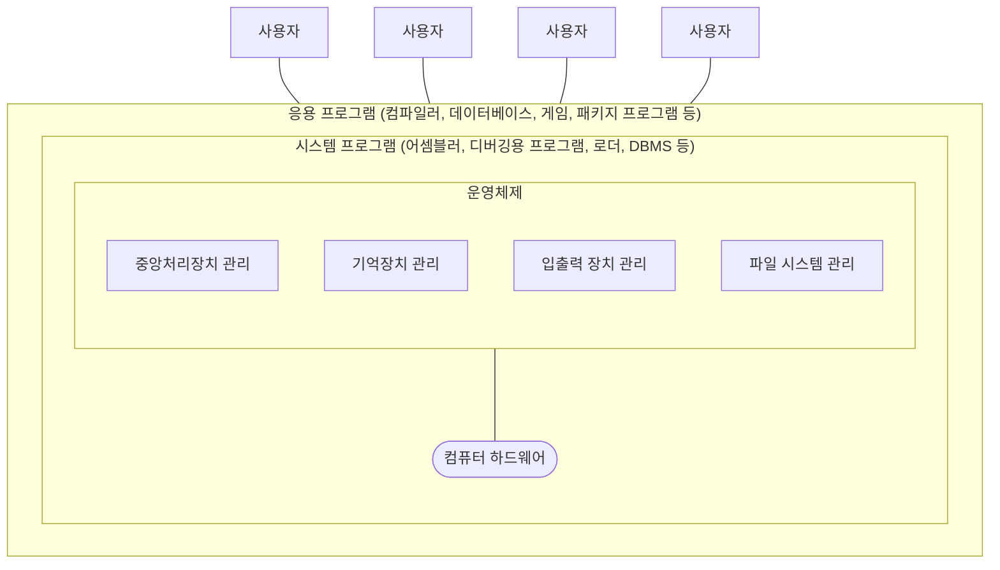
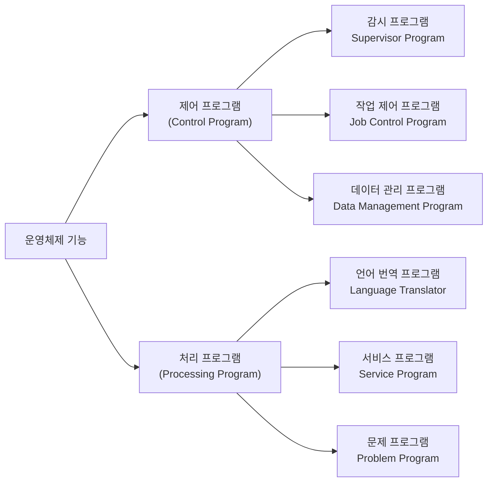
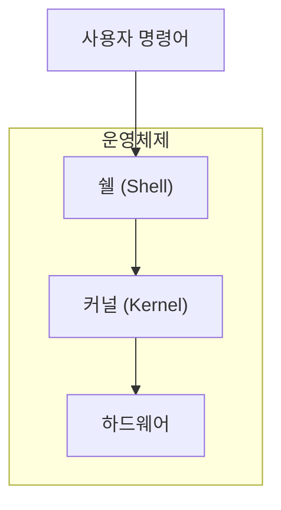
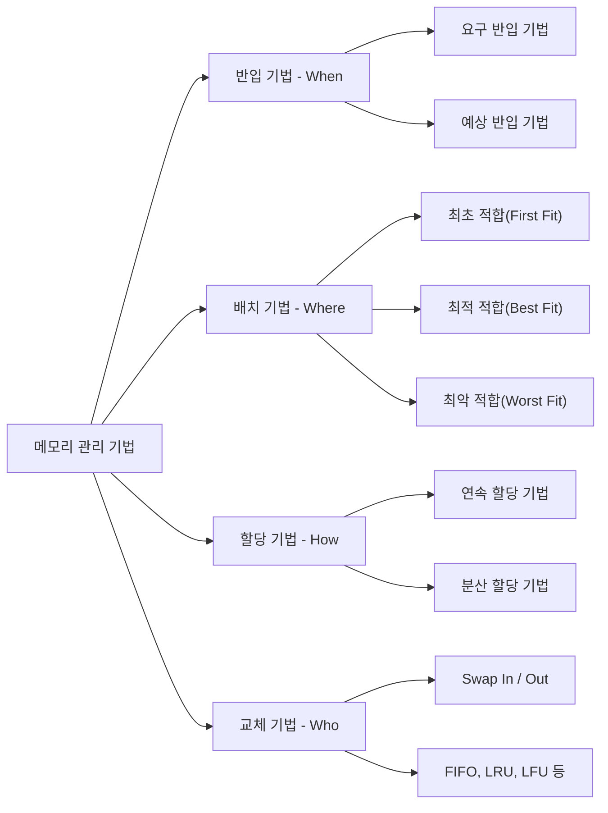
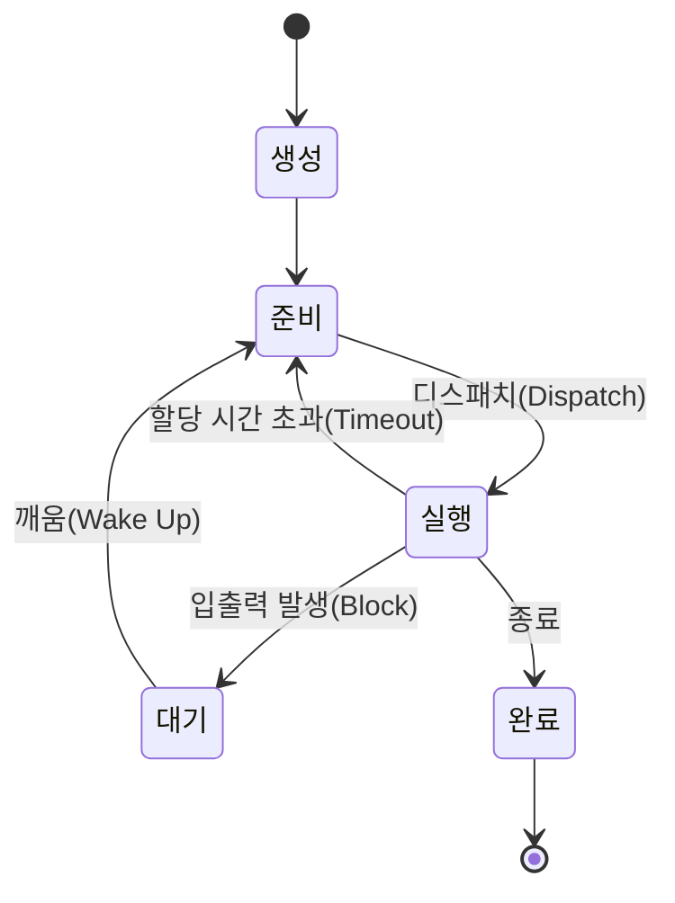

## 1. 운영체제 기초 활용

### 1.1 운영체제(OS; Operating System)의 개념

- 운영체제는 사용자가 컴퓨터의 하드웨어를 쉽게 사용할 수 있도록 **인터페이스를 제공해 주는 소프트웨어**다.
- 하드웨어는 다음과 같이 구분된다.
  - **중앙 처리 장치** : 컴퓨터의 장치를 제어하고 데이터를 처리
  - **기억 장치** : 데이터를 저장
  - **통신 장치** : 외부와의 통신을 담당
  - **입출력 장치** : 데이터 입력과 출력을 담당

#### 운영체제의 개념도

> **학습 Point**
> CPU, 메모리, 보조기억장치, 입출력 장치 등 프로그램 실행에 필요한 요소들을 가리켜 **자원**이라고 한다.
> 운영체제는 프로그램에 필요한 자원을 할당하고, 프로그램이 올바르게 실행되도록 돕는 **컴퓨터 운영의 핵심 프로그램**이다.

---

### 1.2 운영체제 특징 `[20년 3회]` `[22년 3회]`

운영체제는 사용자 편리성, 인터페이스, 스케줄링, 자원관리, 제어 기능의 특징이 있다.

| 특징 | 설명 |
|---|---|
| 사용자 편리성 | 한정된 시스템 자원을 효과적으로 사용할 수 있도록 관리 및 운영 |
| 인터페이스 기능 | 컴퓨터 시스템과 사용자를 연결 |
| 스케줄링 | 다중 사용자와 다중 응용 프로그램 환경 아래 자원의 현재 상태를 파악하고 자원 분배를 위한 스케줄링을 담당 |
| 자원 관리 | CPU, 메모리 공간, 기억 장치, 입출력 장치 등의 자원을 관리 |
| 제어 기능 | 입출력 장치와 사용자 프로그램을 제어 |

---

### 1.3 운영체제 기능 `[21년 1회]` `[23년 1회]` `[24년 1회]`

운영체제는 기능에 따라 **제어 프로그램**과 **처리 프로그램**으로 구분한다.

#### 제어 프로그램의 종류

> **두음** 「제감작데」 → **제**어 프로그램 = **감**시 / **작**업 제어 / **데**이터 관리

| 종류 | 기능 |
|---|---|
| 감시 프로그램 (Supervisor Program) | 각종 프로그램의 실행과 시스템 전체의 작동 상태 감시 및 감독 |
| 작업 제어 프로그램 (Job Control Program) | 작업의 연속 처리를 위한 스케줄 및 시스템 자원 할당 담당 예) Job Scheduler, Master Scheduler |
| 데이터 관리 프로그램 (Data Management Program) | 주기억 장치와 보조기억 장치 사이의 데이터 전송과 보조기억 장치의 자료 갱신 및 유지보수 기능을 수행 |

#### 처리 프로그램의 종류

| 종류 | 기능 |
|---|---|
| 언어 번역 프로그램 (Language Translator Program) | 원시 프로그램을 기계어 형태의 목적 프로그램으로 번역하는 프로그램 어셈블러, 컴파일러, 인터프리터가 있음 |
| 서비스 프로그램 (Service Program) | 효율성을 위해 사용 빈도가 높은 프로그램 링커(Linker), 정렬 프로그램, 라이브러리(Library), 유틸리티 프로그램이 있음 |
| 문제 프로그램 (Problem Program) | 특정 업무 해결을 위해 사용자가 작성한 프로그램 |

---

### 1.4 운영체제에서 커널의 기능

- 운영체제는 크게 **인터페이스(쉘)** 와 **커널**로 구성되어 있다.
- 운영체제의 핵심적인 기능들이 커널에 모여있다면, 인터페이스(쉘)는 이러한 커널을 사용자가 더 편리하게 사용할 수 있게 해준다.

#### 운영체제 커널과 쉘

#### 쉘(Shell) `[22년 1회]` `[23년 1회]` `[24년 1회·3회]`

- 쉘은 사용자가 입력시킨 **명령어 라인을 읽어 필요한 시스템 기능을 실행시키는 명령어 해석기**다.
- 시스템과 사용자 간의 인터페이스를 제공한다.
- 여러 가지의 내장 명령어를 가지고 있다.

#### 커널(Kernel) `[20년 4회]` `[23년 3회]`

- 커널은 운영체제의 **핵심이 되는 기능들이 모여있는 컴퓨터 프로그램**이다.
- 컴퓨터가 부팅될 때 주기억 장치에 적재된 후 **상주하면서 실행**하며, 프로그램과 하드웨어 간의 **인터페이스 역할**을 담당한다.

| 기능 | 설명 |
|---|---|
| 프로세스 관리 | 프로세스 스케줄링 및 동기화 관리를 담당 프로세스 생성과 제거, 시작과 정지, 메시지 전달 등의 기능 담당 |
| 기억 장치 관리 | 프로세스에게 메모리 할당 및 회수 관리 담당 |
| 주변장치 관리 | 입·출력 장치 스케줄링 및 전반적인 관리 담당 |
| 파일 관리 | 파일의 생성과 삭제, 변경, 유지 등의 관리 담당 |

> **학습 Point**
> 운영체제는 컴퓨터가 부팅될 때 메모리 내 **커널 영역**에 적재되어 사용된다. 커널 영역 외에 응용 프로그램이 적재되는 **사용자 영역**이 있다.

---

### 1.5 운영체제의 종류 `[20년 3회]` `[24년 2회]` `[25년 2회]`

#### 윈도우 계열 운영체제

- 윈도우는 MS-DOS의 멀티태스킹 기능과 GUI 환경을 제공하는 응용 프로그램으로서, 마이크로소프트사가 개발한 운영체제다.
- 마이크로소프트사(MS)에서 1995년도에 윈도우 95(Windows 95)를 발표한 이후에 98, ME, XP, 7, 8, 10, 11 등의 버전으로 지속해서 출시하고 있다.

> **두음** 「지선자 오」 → **G**UI 제공 / **선**점형 멀티태스킹 방식 제공 / **자**동 감지 기능 제공 / **O**LE 사용
> (→ 지선자씨의 오빠)

| 특징 | 설명 |
|---|---|
| 그래픽 사용자 인터페이스(GUI) 제공 | 키보드 없이 마우스로 아이콘이나 메뉴를 선택하여 작업을 수행하는 그래픽 기반의 인터페이스 방식 |
| 선점형 멀티태스킹 방식 제공 | 동시에 여러 개의 프로그램을 실행하면서 운영체제가 각 작업의 CPU 이용시간을 제어 |
| 자동 감지 기능(Plug & Play) 제공 | 하드웨어를 설치했을 때 필요한 시스템 환경을 운영체제가 자동으로 구성해주는 자동 감지 기능 제공 |
| OLE(Object Linking and Embedding) 사용 | 개체를 현재 작성 중인 문서에 자유롭게 연결 또는 삽입하여 편집할 수 있게 하는 기능 제공 |

> Microsoft의 Windows 운영체제는 소스가 공개되지 않았으며, 소스가 공개된 개방형 운영체제로는 리눅스가 존재한다.

#### 리눅스 / 유닉스 계열 운영체제 `[22년 2회]`

- 유닉스는 1960년대 AT&T Bell 연구소, MIT 및 General Electric 사가 공동으로 연구, 개발한 운영체제다.
- 초기 운영체제는 **Multics**이고, **C언어로 재이식**되어 대중화 기반을 마련하였고, 1970년대에 AT&T가 본격적으로 유닉스 시스템을 판매하게 되었다.

> **두음** 「대작 사이계」 → **대**화식 운영체제 / 다중 **작**업 / 다중 **사**용자 / **이**식성 / **계**층적 파일 시스템 제공

| 특징 | 설명 |
|---|---|
| 대화식 운영체제 | 사용자가 명령을 입력하면 시스템이 명령을 수행하는 기능을 제공 |
| 다중 작업 | 한 번에 하나 이상의 작업을 수행하는 기능을 제공 |
| 다중 사용자 | 여러 사람이 동시에 시스템을 사용하여 각각의 작업을 수행할 수 있는 기능을 제공 |
| 이식성 | 90% 이상 C언어로 구현되어 있고, 시스템 프로그램이 모듈화되어 있어서 다른 하드웨어 기종으로 쉽게 이식 가능 |
| 계층적 파일 시스템 제공 | 유닉스는 계층적 트리 구조를 가짐으로써 통합적인 파일 관리가 용이 |

- 리눅스는 유닉스의 **호환 커널**이다.
- 1991년 리누스 토발즈(Linus Tovalds)는 '프리(Free) 소프트웨어' 정책을 두고, 자유롭고 재배포가 가능한 운영체제인 리눅스를 만들었다.
- 리눅스는 데비안, 레드햇, Fedora, Ubuntu, CentOS와 같이 다양하게 출시되고 있다.

#### 유닉스와 리눅스의 차이점

| 항목 | 리눅스 | 유닉스 |
|---|---|---|
| 비용 | 대부분 무료이며 지원 정책별로 일부 유료 서비스 제품 존재 | 대부분 유료 제품 |
| 사용자 | 개발자, 일반 사용자 | 메인프레임 및 워크스테이션 등 대형 시스템 관리자 |
| 배포 | 오픈소스 개발 | 사업자에 의해 배포 비용 수반됨 |
| 사용자 편의 | GUI 제공, 파일시스템 지원, BASH 쉘 사용 | 커맨드 기반이 주였으나 GUI도 제공하는 추세 파일 시스템 제공 |
| 활용 | 스마트폰, 태블릿 등 다양하게 사용 | 인터넷 서버, 워크스테이션 등 대형 시스템에 주로 사용 |

---

## 2. 메모리 관리

### 2.1 메모리 관리 개념

- 메모리 관리는 한정된 메모리 공간을 효율적으로 사용하기 위하여 보조기억장치의 프로그램이나 데이터를 주기억장치에 **적재시키는 시기, 적재 위치** 등을 지정하여 관리하는 기법이다.
- CPU가 프로그램을 읽어서 연속적으로 동작하기 위해서는 메모리 관리의 역할이 중요하다.

### 2.2 메모리 관리 기법

- 운영체제의 역할에서 메모리 관리가 큰 역할을 차지하는 이유는 메모리가 **고가의 자원**이고, 시스템에서 중요한 역할을 수행하기 때문이다.
- 메모리 관리 기법은 **반입 기법, 배치 기법, 할당 기법, 교체 기법**이 있다.

> **두음** 「반배할교」 → **반**입 기법 / **배**치 기법 / **할**당 기법 / **교**체 기법

| 기법 | 설명 | 세부 기법 |
|---|---|---|
| 반입 기법 | 주기억 장치에 적재할 다음 프로세스의 반입 시기를 결정하는 기법 메모리로 적재 시기 결정(**When**) | 요구 반입 기법 예상 반입 기법 |
| 배치 기법 | 디스크에 있는 프로세스를 주기억 장치의 어느 위치에 저장할 것인지 결정하는 기법 메모리 적재 위치 결정(**Where**) | 최초 적합(First Fit) 최적 적합(Best Fit) 최악 적합(Worst Fit) |
| 할당 기법 | 실행해야 할 프로세스를 주기억 장치에 어떤 방법으로 할당할 것인지 결정하는 기법 메모리 적재 방법 결정(**How**) | 연속 할당 기법 분산 할당 기법 |
| 교체 기법 | 재배치 기법으로 주기억 장치에 있는 프로세스 중 어떤 프로세스를 제거할 것인지를 결정하는 기법 메모리 교체 대상 결정(**Who**) | 프로세스의 Swap In/Out FIFO, LRU, LFU |

---

### 2.3 메모리 반입 기법

- 메모리 반입 기법은 보조기억장치에 보관 중인 프로그램이나 데이터를 **언제 주기억장치로 적재할 것인지**를 결정하는 기법이다.

| 기법 | 설명 |
|---|---|
| 요구 반입 기법 | 다음에 실행될 프로세스가 참조 요구가 있을 경우에 적재하는 기법 |
| 예상 반입 기법 | 시스템의 요구를 예측하여 미리 메모리에 적재하는 방법으로 요구되는 페이지 이외 다른 페이지도 함께 적재 |

---

### 2.4 메모리 배치 기법 `[20년 3회]` `[21년 1회]` `[22년 1회]` `[23년 2회]` `[24년 1회]` `[25년 2회]`

> **두음** 「초적악」 → **최초** 적합(First Fit) / **최적** 적합(Best Fit) / **최악** 적합(Worst Fit)
> (→ 초저각(초적악) Shot)

| 기법 | 설명 |
|---|---|
| 최초 적합(First Fit) | 프로세스가 적재될 수 있는 가용 공간 중에서 **첫 번째 분할**에 할당하는 방식 |
| 최적 적합(Best Fit) | 가용 공간 중에서 **가장 크기가 비슷한** 공간을 선택하여 프로세스를 적재하는 방식 공백 최소화 장점이 있음 |
| 최악 적합(Worst Fit) | 프로세스의 가용 공간 중에서 **가장 큰** 공간에 할당하는 방식 |

#### 개념 박살내기 - 메모리 배치 기법

주기억장치 가용 공간이 아래와 같을 때, **프로세스 A(215MB) → 프로세스 B(171MB) → 프로세스 C(86MB)** 순서로 적재한다.

| 160MB | 360MB | 400MB | 700MB | 200MB |
|---|---|---|---|---|

**① 최초 적합(First Fit)**

| 160MB | 360MB | 400MB | 700MB | 200MB |
|---|---|---|---|---|
| 프로세스 C | 프로세스 A | 프로세스 B | | |

- 빈 영역 중에서 프로세스 A(215MB)가 들어갈 수 있는 첫 번째 영역은 360MB 공간이다.
- B(171MB)는 400MB 공간, C(86MB)는 160MB 공간이 적재할 수 있는 첫 번째 영역이다.

**② 최적 적합(Best Fit)**

| 160MB | 360MB | 400MB | 700MB | 200MB |
|---|---|---|---|---|
| 프로세스 C | 프로세스 A | | | 프로세스 B |

- 빈 영역 중에서 프로세스 A(215MB)가 들어갈 수 있는 가장 크기가 비슷하고 공백이 최소가 되는 영역은 360MB 공간이다.
- B(171MB)는 200MB 공간, C(86MB)는 160MB 공간에 적재할 때 가장 공백이 최소가 된다.

**③ 최악 적합(Worst Fit)**

| 160MB | 360MB | 400MB | 700MB | 200MB |
|---|---|---|---|---|
| | 프로세스 C | 프로세스 B | 프로세스 A | |

- 빈 영역 중에서 프로세스 A(215MB)가 들어갈 수 있는 가장 큰 영역은 700MB 공간이다.
- B(171MB)는 400MB 공간, C(86MB)는 360MB 공간에 적재할 수 있는 가장 큰 공간이다.

---

### 2.5 메모리 할당 기법 `[21년 1회]`

- 메모리 할당 기법은 프로세스를 실행시키기 위해 주기억 장치에 **어떻게 할당할 것인지**에 대한 기법이다.
- **연속 할당 기법**과 **분산 할당 기법**으로 분류할 수 있다.

| 종류 | 설명 | 기법 |
|---|---|---|
| 연속 할당 기법 | 실행을 위한 각 프로세스를 주기억 장치 공간 내에서 인접하게 연속하여 저장하는 방법 프로세스를 주기억 장치에 연속으로 할당하는 기법 | 단일 분할 할당 기법(오버레이, 스와핑) 다중 분할 할당 기법(고정 분할 할당 기법, 동적 분할 할당 기법) |
| 분산 할당 기법 | 하나의 프로세스를 여러 개의 조각으로 나누어 주기억 장치 공간 내 분산하여 배치하는 기법 주로 가상기억 장치에서 사용 | 페이징 기법 세그먼테이션 기법 페이징/세그먼테이션 기법 |

> **학습 Point**
> 프로세스를 메모리에 연속적으로 할당하는 방식은 물리 메모리보다 큰 프로세스를 실행할 수 없는 문제가 발생한다.
> 이를 해결하기 위해 하나의 프로그램을 일부만 적재하여 실제 물리 메모리 크기보다 큰 프로세스를 실행할 수 있게 하는 **가상 메모리(Virtual Memory)** 기술이 등장했다.

#### ㉮ 페이징 기법(Paging) `[21년 2회]` `[24년 1회]`

- 페이징 기법은 가상기억 장치 내의 프로세스를 **일정하게 분할**하여 주기억 장치의 분산된 공간에 적재시킨 후 프로세스를 수행시키는 기법이다.
- 실제 공간은 페이지 크기와 같은 **페이지 프레임**으로 나누어 사용한다.

> **잠깐! 알고가기 - 프레임(Frame)** : 물리 메모리를 일정한 크기로 나눈 블록이다.

**페이징 기법 장단점**

| 장점 | 단점 |
|---|---|
| 공유 페이지 이용 메모리 활용을 통한 다중 처리 프로그래밍 가능 | 페이징 사상을 위한 하드웨어 비용 소요, 속도 저하 내부 단편화 현상 발생 |

> **잠깐! 알고가기 - 사상(Mapping; 주소 매핑)**
> 논리적인 가상주소를 물리적인 실제 주기억장치의 주소로 변환하는 동작이다. 사상을 통해서 가상 메모리에 있는 프로그램이 주기억장치의 실제 주소로 적재되어 실행된다.

**페이지 크기가 작을 경우와 클 경우 발생하는 현상**

| 항목 | 페이지 크기가 작을 경우 | 페이지 크기가 클 경우 |
|---|---|---|
| 페이지 맵 테이블 크기 | 큼 | 작음 |
| 내부 단편화 | 작음 | 큼 |
| 입·출력 시간 | 김 | 짧음 |
| 기억장소 이용 효율 | 높음 | 낮음 |

> 페이지 크기가 작을 경우는 클 경우에 비해 디스크 접근 횟수가 많아지기 때문에 전체적인 입출력 시간이 늘어나게 된다.

#### ㉯ 세그먼테이션 기법(Segmentation) `[21년 2회]` `[24년 1회]` `[25년 3회]`

- 세그먼테이션 기법은 가상기억 장치 내의 프로세스를 **가변적인 크기의 블록**으로 나누고 메모리를 할당하는 기법이다.
- 분할 형태가 배열이나 함수와 같은 논리적인 다양한 크기의 가변적인 크기로 관리한다.

| 장점 | 단점 |
|---|---|
| 가변적인 데이터 구조와 모듈 처리 자원의 효율적 이용 | 외부 단편화 현상 발생 |

#### ㉰ 페이징/세그먼테이션 혼용기법

- 하나의 세그먼트를 정수 배의 부분 페이지로 다시 분할하는 방식이다.
- **외부 단편화 및 내부 단편화 최소화**를 위하여 세그먼테이션 기법과 페이징 기법을 결합한 페이징/세그먼테이션 기법이 개발되었다.

---

### 2.6 메모리 교체 기법

#### ㉮ 교체 기법 개념

- 교체 기법은 주기억 장치에 있는 프로세스 중 **어떤 프로세스를 제거할 것인지** 결정하는 기법이다.
- 새로운 페이지를 할당하기 위해 현재 할당된 페이지 중 어느 것과 교체할지를 결정하는 방법이다.

> **잠깐! 알고가기 - 페이지 부재(Page Fault)**
> CPU가 접근하려는 가상 메모리 페이지가 물리적 메모리에 없을 때 발생하는 현상이다. 페이지 부재가 발생하면 디스크에서 필요한 페이지를 읽어 물리적 메모리에 적재해야 한다.

#### ㉯ 교체 기법 유형 `[21년 3회]` `[23년 2회]` `[24년 1회]` `[25년 2회]`

교체 기법의 대표적인 알고리즘은 **FIFO, LRU, LFU, OPT, NUR, SCR** 등이 있다.

| 세부 기법 | 설명 |
|---|---|
| FIFO (First In First Out) | 각 페이지가 주기억 장치에 적재될 때마다 그때의 시간을 기억시켜 **가장 먼저 들어와서 가장 오래 있던 페이지**를 교체하는 기법(선입선출) |
| LRU (Least Recently Used) | 사용된 **시간**을 확인하여 가장 오랫동안 사용되지 않은 페이지를 선택하여 교체하는 기법 프로그램의 지역성의 원리에 따라서 최근에 참조된 페이지는 앞으로도 참조될 가능성이 크고, 최근에 참조되지 않은 페이지는 앞으로도 참조되지 않을 가능성이 크다는 전제로 구현된 알고리즘 |
| LFU (Least Frequently Used) | 사용된 **횟수**를 확인하여 참조 횟수가 가장 적은 페이지를 선택하여 교체하는 기법 기억 장치에 저장된 페이지 중에서 사용한 횟수가 가장 적은 페이지를 교체하는 알고리즘 |
| OPT (OPTimal Replacement) | 앞으로 가장 오랫동안 사용하지 않을 페이지를 교체하는 기법 페이지 부재 횟수가 가장 적게 발생하는 가장 효율적인 알고리즘 |
| NUR (Not Used Recently) | LRU와 비슷한 알고리즘으로, 최근에 사용하지 않은 페이지를 교체하는 기법 최근에 사용되지 않은 페이지는 앞으로도 사용되지 않을 가능성이 크다는 것을 전제로, LRU에서 나타나는 시간적인 오버헤드를 줄일 수 있음 최근의 사용 여부를 확인하기 위해서 페이지마다 **참조 비트와 변형 비트** 사용 |
| SCR (Second Chance Replacement) | 가장 오랫동안 주기억 장치에 있던 페이지 중 자주 사용되는 페이지의 교체를 방지하기 위한 기법으로 **FIFO 기법의 단점을 보완**하는 기법 |

> **학습 Point**
> SCR은 다른 말로 **2차 기회 교체 알고리즘**이라고 한다. SCR은 페이지의 참조 비트를 사용하여 페이지의 교체 여부를 결정한다.
> 페이지가 최근에 사용되었으면 1, 페이지가 최근에 사용되지 않았으면 0으로 표기해서 참조 비트가 0이면 해당 페이지를 교체한다.

---

### 2.7 교체 기법 알고리즘 계산 `[20년 1회·4회]` `[22년 1회·2회·3회]` `[23년 2회]` `[24년 1회]` `[25년 1회]`

> **학습 Point**
> 참조 스트링과 참조 페이지는 같은 용어다. 문제에서 참조 스트링으로 출제될 수도 있고, 참조 페이지로 출제될 수도 있다. 둘 다 알아두자.
> 페이지 교체 기법 문제는 **Page Fault의 횟수**를 묻는 문제가 자주 출제된다. FIFO, LRU, LFU의 교체 방식의 원리를 생각하고 계산하면 된다.

#### ① FIFO(First-In-First-Out; 선입선출) 알고리즘

FIFO는 주기억 장치 페이지에 순차적으로 참조 스트링이 들어오고, 페이지 교체는 **가장 먼저 들어온 페이지**부터 교체하는 알고리즘이다.

**개념 박살내기 - FIFO 알고리즘 계산**

- 프로세스에 3개의 페이지 프레임이 고정으로 할당되어 있고, 초기에 3개의 페이지 프레임이 모두 비어 있다고 가정한다.
- `ω = 0 1 2 3 0 1 4 0 1 2 3 4`

| 참조 스트링 | 0 | 1 | 2 | 3 | 0 | 1 | 4 | 0 | 1 | 2 | 3 | 4 |
|---|---|---|---|---|---|---|---|---|---|---|---|---|
| **주기억 장치 상태** (페이지 프레임) | 0 | 1 | 2 | 3 | 0 | 1 | 4 | 4 | 4 | 2 | 3 | 3 |
| | | 0 | 1 | 2 | 3 | 0 | 1 | 1 | 1 | 4 | 2 | 2 |
| | | | 0\* | 1\* | 2\* | 3\* | 0 | 0 | 0\* | 1\* | 4 | 4 |
| **페이지 부재** (Page Fault) | ① | ② | ③ | ④ | ⑤ | ⑥ | ⑦ | | | ⑧ | ⑨ | |

- **①②③** 페이지 프레임에 CPU가 필요한 참조 스트링이 없는 상태이므로 페이지 부재가 발생하고 새로운 값을 페이지 프레임에 적재한다.
- **④** 참조 스트링 3이 페이지 프레임에 없으므로 페이지 교체 대상을 선정해야 한다. (가장 먼저 들어와 가장 오래 있던 0이 빠지고 3이 들어와서 교체된다.)
- **⑤** 참조 스트링 0이 없으므로, 가장 먼저 들어온 1이 빠지고 0이 들어온다.
- **⑥** 참조 스트링 1이 없으므로, 가장 먼저 들어온 2가 빠지고 1이 들어온다.
- **⑦** 참조 스트링 4가 없으므로, 가장 먼저 들어온 3이 빠지고 4가 들어온다.
- **⑧** 참조 스트링 2가 없으므로, 가장 먼저 들어온 0이 빠지고 2가 들어온다.
- **⑨** 참조 스트링 3이 없으므로, 가장 먼저 들어온 1이 빠지고 3이 들어온다.
- → **페이지 부재는 9회**다.

> FIFO 알고리즘은 한마디로 "오래 머물러 있었으면 그만 나가라"는 알고리즘이다. 구현은 간단하지만 자주 사용되는 페이지가 교체되는 단점 때문에 FIFO 알고리즘을 개선한 **SCR 알고리즘**이 더 많이 사용된다.

#### ② LRU(Least Recently Used) 알고리즘

LRU는 사용된 **시간**을 확인하여 가장 오랫동안 사용되지 않은 페이지를 선택하여 교체하는 알고리즘이다.

**개념 박살내기 - LRU 알고리즘 계산**

- 페이지 프레임 3개, 초기에 모두 비어 있다고 가정한다.
- `ω = 2 3 2 1 5 2 3 5`

| 참조 스트링 | 2 | 3 | 2 | 1 | 5 | 2 | 3 | 5 |
|---|---|---|---|---|---|---|---|---|
| **주기억 장치 상태** (페이지 프레임) | 2 | 3 | 2 | 1 | 5 | 2 | 3 | 5 |
| | | 2 | 3 | 2 | 1 | 5 | 2 | 3 |
| | | | | 3 | 2 | 1\* | 5 | 2 |
| **페이지 부재** (Page Fault) | ① | ② | | ③ | ④ | | ⑤ | |

- **①②③** 페이지 프레임에 CPU가 필요한 참조 스트링이 없는 상태이므로 페이지 부재가 발생하고 새로운 값을 페이지 프레임에 적재한다.
- **④** 참조 스트링 5가 없으므로 교체 대상을 선정한다. (1은 이전 참조 스트링에서 사용했고, 2는 전전 참조 스트링에서 사용했고, 3은 전전전 참조 스트링에서 사용했으므로 가장 오랫동안 사용하지 않은 **3이 빠지고 5**가 들어와서 교체된다.)
- **⑤** 참조 스트링 3이 없으므로 교체 대상을 선정한다. (1은 전전전 참조 스트링에서, 2는 이전 참조 스트링에서, 5는 전전 참조 스트링에서 사용했으므로 가장 오랫동안 사용하지 않은 **1이 빠지고 3**이 들어와서 교체된다.)
- → **페이지 부재는 5회**다.

#### ③ LFU(Least Frequently Used) 알고리즘

LFU는 사용된 **횟수**를 확인하여 참조 횟수가 가장 적은 페이지를 선택하여 교체하는 알고리즘이다.

**개념 박살내기 - LFU 알고리즘 계산**

- 페이지 프레임 4개, 초기에 모두 비어 있다고 가정한다.
- `ω = 2 3 1 3 1 2 4 5`

| 참조 스트링 | 2 | 3 | 1 | 3 | 1 | 2 | 4 | 5 |
|---|---|---|---|---|---|---|---|---|
| **주기억 장치 상태** (페이지 프레임) | 2 | 3 | 1 | 1 | 1 | 1 | 4 | 5 |
| | | 2 | 3 | 3 | 3 | 3 | 1 | 1 |
| | | | 2 | 2 | 2 | 2 | 3 | 3 |
| | | | | | | | 2 | 2 |
| **페이지 부재** (Page Fault) | ① | ② | ③ | | | | ④ | ⑤ |

- **①②③④** 페이지 프레임에 CPU가 필요한 참조 스트링이 없는 상태이므로 페이지 부재가 발생하고 새로운 값을 페이지 프레임에 적재한다.
- **⑤** 참조 스트링 5가 없으므로 교체 대상을 선정한다. (이 시점 참조 횟수를 비교해 보면 1은 2번, 2는 2번, 3은 2번, 4는 1번 참조되어 가장 참조 횟수가 적은 **4가 빠지고 5**가 들어와서 교체된다.)
- → **페이지 부재는 5회**다.

---

### 2.8 메모리 단편화

- 메모리 단편화는 분할된 주기억 장치에 프로세스를 **할당, 반납** 과정에서 사용되지 못하고 낭비되는 기억 장치가 발생하는 현상이다.
- 유형으로는 **내부 단편화**와 **외부 단편화**가 있다.

> **학습 Point**
> 메모리 단편화는 메모리 할당과 해제 과정에서 발생하는 메모리 공간의 비효율적인 현상으로, 시스템의 효율성과 성능에 중요한 영향을 미치므로 이를 최소화해야 한다.

#### ① 내부 단편화(Internal Fragmentation)

- 내부 단편화는 분할된 공간에 프로세스를 적재한 후 **남은 공간**이다.
- **고정 분할 할당 방식** 또는 **페이징 기법** 사용 시 발생하는 메모리 단편화다.

<svg viewBox="0 0 640 220" width="100%" xmlns="http://www.w3.org/2000/svg" role="img" aria-label="내부 단편화 개념도">
  
  <text x="20" y="24" class="ttl">주기억장치</text>
  <text x="130" y="24" class="sm">· 고정적으로 50KB로 페이지를 나눔</text>

  <!-- 4 fixed partitions, each 120px = 50KB -->
  <rect x="20" y="40" width="120" height="50" class="used"/>
  <rect x="140" y="40" width="120" height="50" class="used"/>
  <rect x="260" y="40" width="95"  height="50" class="used"/>
  <rect x="355" y="40" width="25"  height="50" class="free"/>
  <rect x="380" y="40" width="70"  height="50" class="used"/>
  <rect x="450" y="40" width="50"  height="50" class="free"/>

  <!-- partition borders -->
  <rect x="20"  y="40" width="120" height="50" class="part"/>
  <rect x="140" y="40" width="120" height="50" class="part"/>
  <rect x="260" y="40" width="120" height="50" class="part"/>
  <rect x="380" y="40" width="120" height="50" class="part"/>

  <!-- 50KB spans -->
  <g stroke="#8a5a5a" fill="none">
    <path d="M22 104 H138"/><path d="M142 104 H258"/><path d="M262 104 H378"/><path d="M382 104 H498"/>
  </g>
  <g class="sm" fill="#8a5a5a" text-anchor="middle">
    <text x="80" y="120">50KB</text><text x="200" y="120">50KB</text>
    <text x="320" y="120">50KB</text><text x="440" y="120">50KB</text>
  </g>
  <text x="520" y="120" class="sm">고정분할(페이징 기법)</text>

  <!-- legend -->
  <rect x="20" y="145" width="16" height="16" class="used"/>
  <text x="44" y="158" class="lbl">할당완료</text>
  <rect x="20" y="172" width="16" height="16" class="free"/>
  <text x="44" y="185" class="lbl">고정된 분할영역 외 남는 공간 → 내부 단편화</text>
</svg>

> **학습 Point**
> 페이징 기법에서 외부 단편화는 발생하지 않으나 내부 단편화가 발생할 수 있다.
> 페이지 크기가 5KB이고, 사용할 프로그램의 크기가 21KB라고 하면 프로그램은 페이지 단위로 5KB씩 나눠서 적재되고, 마지막 페이지에 1KB만 적재되고 **4KB의 내부 단편화**가 발생한다.

**내부 단편화 해결 방안**

| 해결 방안 | 설명 |
|---|---|
| 슬랩 할당자 (Slab Allocator) | 페이지 프레임을 할당받아 공간을 작은 크기로 분할하고(캐시 집합) 메모리 요청 시 작은 크기로 메모리를 할당/해제하는 동적 메모리 관리 기법 |
| 통합 (Coalescing) | 인접한 단편화 영역을 찾아 하나로 통합하는 기법 |
| 압축 (Compaction) | 메모리의 모든 단편화 영역을 하나로 압축하는 기법 |

> 압축은 다른 말로 **메모리 조각 모음**이라고 부른다. 압축은 여기저기 흩어져 있는 빈 공간들을 하나로 모으는 방식으로 메모리 내에 저장된 프로세스를 적당히 재배치시켜서 여기저기 흩어져 있는 작은 빈 공간들을 하나의 큰 빈 공간으로 만드는 방법이다.

#### ② 외부 단편화(External Fragmentation)

- 외부 단편화는 할당된 크기가 프로세스 크기보다 작아서 **사용하지 못하는 공간**이다.
- **가변 분할 할당 방식** 또는 **세그먼테이션 기법** 사용 시 발생하는 메모리 단편화다.

<svg viewBox="0 0 700 230" width="100%" xmlns="http://www.w3.org/2000/svg" role="img" aria-label="외부 단편화 개념도">
  
  <text x="20" y="22" class="ttl2">주기억장치</text>
  <text x="140" y="22" class="sm2">· 가변적 크기로 주기억장치를 분할</text>

  <rect x="20"  y="38" width="90"  height="46" class="u2"/><text x="65"  y="66" class="lbl2" text-anchor="middle">30KB</text>
  <rect x="110" y="38" width="55"  height="46" class="f2"/>
  <rect x="165" y="38" width="150" height="46" class="u2"/><text x="240" y="66" class="lbl2" text-anchor="middle">100KB</text>
  <rect x="315" y="38" width="32"  height="46" class="f2"/>
  <rect x="347" y="38" width="80"  height="46" class="u2"/><text x="387" y="66" class="lbl2" text-anchor="middle">40KB</text>
  <rect x="427" y="38" width="45"  height="46" class="u2"/><text x="449" y="66" class="sm2" text-anchor="middle">15KB</text>
  <rect x="472" y="38" width="68"  height="46" class="f2"/>

  <!-- request -->
  <rect x="600" y="38" width="80" height="46" class="u2"/>
  <text x="640" y="66" class="lbl2" text-anchor="middle">40KB</text>
  <text x="640" y="98" class="sm2" text-anchor="middle">할당불가</text>
  <path d="M598 61 H548" stroke="#8a5a5a" stroke-width="6" marker-end="url(#ah)"/>
  <defs>
    <marker id="ah" markerWidth="8" markerHeight="8" refX="6" refY="4" orient="auto">
      <path d="M0,0 L8,4 L0,8 z" fill="#8a5a5a"/>
    </marker>
  </defs>

  <!-- free-hole callouts -->
  <g stroke="#666" fill="none">
    <path d="M137 88 V108"/><path d="M331 88 V108"/><path d="M506 88 V108"/>
  </g>
  <g class="sm2" text-anchor="middle">
    <text x="137" y="122">20KB</text><text x="331" y="122">10KB</text><text x="506" y="122">25KB</text>
  </g>
  <text x="360" y="146" class="sm2" text-anchor="middle">가변분할(세그멘테이션 기법)</text>

  <rect x="20" y="162" width="16" height="16" class="u2"/>
  <text x="44" y="175" class="lbl2">할당완료</text>
  <rect x="20" y="188" width="16" height="16" class="f2"/>
  <text x="44" y="201" class="lbl2">빈 공간이나 적재가 불가능한 공간 → 외부 단편화</text>
</svg>

> 빈 공간의 총합(20 + 10 + 25 = 55KB)은 요청 크기(40KB)보다 크지만, 연속된 하나의 공간이 없어서 할당이 불가능하다. 이게 외부 단편화의 핵심이다.

**외부 단편화 해결 방안**

| 해결 방안 | 설명 |
|---|---|
| 버디 메모리 할당 (Buddy Memory Allocation) | 요청한 프로세스 크기에 가장 알맞은 크기를 할당하기 위해 메모리를 2ⁿ의 크기로 분할하여 메모리를 할당하는 기법 |
| 통합 (Coalescing) | 인접한 단편화 영역을 찾아 하나로 통합하는 기법 |
| 압축 (Compaction) | 메모리의 모든 단편화 영역을 하나로 압축하는 기법 |

> 세그먼테이션 기법을 적용할 때 발생하는 문제점인 외부 단편화는 메모리 낭비, 시스템 성능 저하, 메모리 접근 지연의 문제점이 발생하므로 다양한 기법을 활용해서 해결해야 한다.

---

### 2.9 페이징 기법의 문제 및 해결 방안

#### ① 페이징 기법의 문제점 - 스레싱(Thrashing) `[21년 2회]` `[23년 1회]` `[24년 1회]`

- 스레싱은 어떤 프로세스가 계속적으로 페이지 부재가 발생하여 프로세스의 **실제 처리 시간보다 페이지 교체 시간이 더 많아지는 현상**이다.
- 오류율이 클수록 스레싱이 많이 발생하고, 스레싱으로 인해 전체 시스템의 성능 및 처리율은 저하된다.
- 페이지 부재가 계속 증가하면 기억 장치 접근 시간도 증가한다.

<svg viewBox="0 0 620 300" width="100%" xmlns="http://www.w3.org/2000/svg" role="img" aria-label="스레싱 그래프">
  
  <defs>
    <marker id="a2" markerWidth="9" markerHeight="9" refX="7" refY="4.5" orient="auto">
      <path d="M0,0 L9,4.5 L0,9 z" fill="#333"/>
    </marker>
  </defs>

  <path d="M80 250 H560" class="ax" marker-end="url(#a2)"/>
  <path d="M80 250 V40"  class="ax" marker-end="url(#a2)"/>

  <path d="M80 250 C 200 230, 300 90, 380 70 C 420 62, 440 80, 460 150 C 472 200, 490 235, 520 245" class="cv"/>

  <path d="M400 250 V60" class="gd"/>
  <path d="M470 250 V60" class="gd"/>
  <path d="M400 55 H470" stroke="#8a5a5a" stroke-width="1.5" fill="none"/>
  <text x="435" y="45" class="tb" text-anchor="middle">스레싱</text>

  <text x="320" y="278" class="t" text-anchor="middle">다중 프로그래밍의 정도</text>
  <text x="52" y="150" class="t" text-anchor="middle" transform="rotate(-90 52 150)">중앙처리장치의 효율성</text>
</svg>

> **학습 Point**
> 다중 프로그래밍의 정도가 높아짐에 따라 어느 특정 시점에 CPU 성능이 급격히 저하되는 스레싱 현상이 나타나게 된다.
> 스레싱은 다중 프로그래밍 환경에서 성능을 저하하는 심각한 문제이므로 이를 예방하고 대응하기 위해서는 시스템의 메모리 관리 전략을 적절히 조정하고, 다중 프로그래밍 수준을 조절하는 등의 방법이 필요하다.

#### ② 페이징 기법의 문제점 해결 방안

##### ㉮ 워킹 세트(Working Set) `[21년 1회]` `[23년 3회]`

- 워킹 세트는 각 프로세스가 많이 참조하는 **페이지들의 집합**을 주기억 장치 공간에 계속 상주하게 하여 빈번한 페이지 교체 현상을 줄이고자 하는 기법이다.

<svg viewBox="0 0 660 210" width="100%" xmlns="http://www.w3.org/2000/svg" role="img" aria-label="워킹 세트 개념도">
  
  <defs>
    <marker id="a3" markerWidth="9" markerHeight="9" refX="7" refY="4.5" orient="auto">
      <path d="M0,0 L9,4.5 L0,9 z" fill="#333"/>
    </marker>
  </defs>

  <text x="20" y="34" class="t3">참조된 페이지</text>
  <text x="20" y="62" class="ws">A A B B B B C A A C C C C D D E E C F</text>
  <path d="M20 76 H600" class="s3" marker-end="url(#a3)"/>
  <text x="560" y="100" class="t3">프로세스 실행시간</text>

  <path d="M196 76 V150" class="g3"/>
  <path d="M420 76 V150" class="g3"/>
  <path d="M196 110 H420" class="s3"/>
  <text x="308" y="102" class="t3" text-anchor="middle">윈도우</text>
  <text x="308" y="126" class="t3" text-anchor="middle">w</text>
  <text x="196" y="166" class="t3" text-anchor="middle">t-w</text>
  <text x="420" y="166" class="t3" text-anchor="middle">t</text>

  <text x="308" y="196" class="t3" text-anchor="middle">W(t, w) = {A, C, D}</text>
</svg>

- 윈도우를 **A, C, D**로 선정한다.

| 장점 | 단점 |
|---|---|
| 멀티프로그래밍 정도를 높일 수 있고(Page Hit 증가), CPU 활용률을 최적화할 수 있음 | 워킹 세트 추적관리가 복잡하고, 워킹 세트 크기 설정의 모호함이 발생 |

##### ㉯ 페이지 부재 빈도(PFF; Page-Fault Frequency)

- 페이지 부재 빈도는 페이지 부재율의 **상한과 하한**을 정해서 직접적으로 페이지 부재율을 예측하고 조절하는 기법이다.
- 페이지 부재 비율에 따라 **페이지 프레임 개수**를 조절한다.

<svg viewBox="0 0 640 300" width="100%" xmlns="http://www.w3.org/2000/svg" role="img" aria-label="페이지 부재 빈도 그래프">
  
  <defs>
    <marker id="a4" markerWidth="9" markerHeight="9" refX="7" refY="4.5" orient="auto">
      <path d="M0,0 L9,4.5 L0,9 z" fill="#333"/>
    </marker>
  </defs>

  <path d="M90 250 H580" class="ax4" marker-end="url(#a4)"/>
  <path d="M90 250 V40"  class="ax4" marker-end="url(#a4)"/>

  <path d="M110 55 C 200 70, 240 150, 300 180 C 370 214, 460 228, 550 232" class="cv4"/>

  <path d="M90 120 H520" class="gd4"/>
  <text x="470" y="112" class="t4">상한 값</text>
  <path d="M90 205 H520" class="gd4"/>
  <text x="470" y="222" class="t4">하한 값</text>

  <ellipse cx="330" cy="163" rx="58" ry="34" fill="none" stroke="#999" stroke-dasharray="4 4"/>
  <text x="360" y="150" class="t4">적정 영역</text>

  <path d="M230 120 V250" class="gd4"/>
  <path d="M430 205 V250" class="gd4"/>
  <path d="M200 262 H240" stroke="#333" marker-end="url(#a4)"/>
  <path d="M460 262 H420" stroke="#333" marker-end="url(#a4)"/>
  <text x="200" y="284" class="t4" text-anchor="middle">프레임 개수 증가로 상한 값 유지</text>
  <text x="470" y="284" class="t4" text-anchor="middle">프레임 개수 감소로 하한 값 유지</text>

  <text x="560" y="240" class="t4">프레임 개수</text>
  <text x="62" y="70" class="t4" text-anchor="middle">페이지</text>
  <text x="62" y="86" class="t4" text-anchor="middle">부재비율</text>
</svg>

| 장점 | 단점 |
|---|---|
| 페이지 부재 발생 시 실행하여 부하가 적고, 직접적으로 페이지 부재율 조절이 가능한 기법 | 프로세스를 중지시키는 과정이 발생하고, 페이지 참조가 새로운 지역성으로 이동할 수 있음 |

> **학습 Point**
> 운영체제는 프로세스 실행 초기에 임의의 페이지 프레임을 할당하고, 페이지 부재율을 감시한다.
> 만일 페이지 부재율이 상한선을 넘어가면 해당 프로세스에 더 많은 페이지 프레임을 할당하고, 페이지 부재율이 하한선 미만이면 일부 페이지 프레임을 회수하여 다른 프로세스에 할당하거나 시스템의 여유 메모리로 유지한다.

---

### 2.10 지역성(Locality)

#### ① 지역성의 개념 `[22년 3회]` `[24년 1회]`

- 지역성(국부성; 구역성; 국소성)은 프로세스가 실행되는 동안 주기억 장치를 참조할 때 **일부 페이지만 집중적으로 참조하는 특성**이다.
- 프로세스가 집중적으로 사용하는 페이지를 알아내는 방법의 하나로, 가상기억 장치 관리의 **이론적인 근거**가 되었다.
- 스레싱을 방지하기 위한 **워킹 셋 이론의 기반**이 되었다.
- 참조 지역성(Locality of Reference)이라고도 불리며, 3가지 유형이 존재한다.

#### ② 지역성의 유형 `[25년 1회]`

> **두음** 「시공순」 → **시**간 지역성 / **공**간 지역성 / **순**차 지역성

| 유형 | 설명 | 사례 |
|---|---|---|
| 시간(Temporal) 지역성 | 최근 사용되었던 기억장소들이 집중적으로 액세스하는 현상 참조했던 메모리는 빠른 시간에 다시 참조될 확률이 높은 특성 | Loop(반복, 순환), 스택(Stack), 부프로그램(Sub Routine), Counting(1씩 증감), 집계(Totaling)에 사용되는 변수(기억장소) |
| 공간(Spatial) 지역성 | 프로세스 실행 시 일정 위치의 페이지를 집중적으로 액세스하는 현상 참조된 메모리 근처의 메모리를 참조하는 특성 | 배열 순회, 프로그래머들이 관련된 변수(데이터 저장 기억장소)들을 서로 근처에 선언하여 할당되는 기억장소, 같은 영역에 있는 변수 참조 |
| 순차(Sequential) 지역성 | 데이터가 순차적으로 액세스 되는 현상 프로그램 내의 명령어가 순차적으로 구성된 특성 공간 지역성에 편입되어 설명되기도 함 | 순차적 코드 실행 |

- 지역성의 원리는 메모리의 효율성을 극대화할 수 있는 기억·저장 장치의 **계층적 구조화, 캐시 메모리, 가상 메모리** 기법들의 이론적 기반이 되었다.

---

## 3. 프로세스 스케줄링

### 3.1 프로세스 `[21년 3회]`

#### ① 프로세스(Process) 개념

- 프로세스는 CPU에 의해 처리되는 사용자 프로그램, 시스템 프로그램, **실행 중인 프로그램**이다.
- 프로세스는 **작업(Job)** 또는 **태스크(Task)** 라고도 한다.

> **학습 Point**
> 프로세스는 PCB를 가진 프로그램, 프로세서가 할당되는 실체로서, 디스패치가 가능한 단위, 프로시저가 활동 중인 것, 운영체제가 관리하는 실행 단위 등으로 정의할 수도 있다.

#### ② 프로세스 상태 `[20년 1회]` `[23년 2회]` `[25년 3회]`

- 프로세스 상태는 운영체제에서 하나의 프로그램이 실행되는 동안 나올 수 있는 **상태 변화 단계**다.

> **두음** 「생준 실대완」 → **생**성 / **준**비 / **실**행 / **대**기 / **완**료

| 프로세스 상태 | 설명 |
|---|---|
| 생성(Create) 상태 | 사용자에 의해 프로세스가 생성된 상태 |
| 준비(Ready) 상태 | CPU를 할당받을 수 있는 상태 준비 리스트는 각각 우선순위를 부여하여 가장 높은 우선순위를 갖는 프로세스가 다음 순서에 CPU를 할당받음 |
| 실행(Running) 상태 | 프로세스가 CPU를 할당받아 동작 중인 상태 |
| 대기(Waiting) 상태 | 프로세스 실행 중 입출력 처리 등으로 인해 CPU를 양도하고 입출력 처리가 완료까지 대기 리스트에서 기다리는 상태 대기 리스트는 우선순위가 존재하지 않음 |
| 완료(Complete) 상태 / 종료(Terminated; Exit) 상태 | 프로세스가 CPU를 할당받아 주어진 시간 내에 완전히 수행을 종료한 상태 |

---

### 3.2 프로세스 상태 전이

- 프로세스의 상태 전이는 하나의 작업이 컴퓨터 시스템에 입력되어 완료되기까지 프로세스의 상태가 준비, 실행 및 대기 상태 등으로 변하는 활동이다.

| 상태 전이 | 설명 |
|---|---|
| 디스패치 (Dispatch) | 준비 상태에 있는 여러 프로세스(Ready List) 중 실행될 프로세스를 선정(Scheduling)하여 CPU를 할당(Dispatching) → **문맥 교환 발생** 프로세스는 준비 상태에서 실행 상태로 전이 |
| 할당 시간 초과 (Timeout) | CPU를 할당받은 프로세스는 지정된 시간을 초과하면 스케줄러에 의해 PCB 저장, CPU 반납 후 다시 준비 상태로 전이됨 프로세스는 실행 상태에서 준비 상태로 전이 타임 슬라이스(Time Slice) 만료, 선점(Preemption) 시 타임아웃 발생 |

> **학습 Point**
> 디스패치의 수행은 **디스패처(Dispatcher)** 라는 요소가 수행한다.
> 어느 프로세스를 생성 단계에서 준비 단계로 보낼지는 **Job Scheduler**가 결정하고, 프로세스에 CPU를 할당하는 결정은 **CPU Scheduler**가 결정한다.
> 또한 **교통량 제어기(Traffic Controller)** 가 프로세스의 상태를 관찰하고, 조사와 통보를 담당한다.

> **잠깐! 알고가기 - 문맥 교환(Context Switching)**
> CPU가 현재 실행하고 있는 프로세스의 문맥 상태를 프로세스제어블록(PCB)에 저장하고 다음 프로세스의 PCB로부터 문맥을 복원하는 작업을 문맥 교환이라고 한다.

> **잠깐! 알고가기 - PCB(Process Control Block; 프로세스 제어 블록)**
> 운영체제가 프로세스 관리를 위해 필요한 자료를 담고 있는 자료 구조다.

---

## 부록 - 시험 직전 두음 정리

| 구분 | 두음 | 내용 |
|---|---|---|
| 운영체제 제어 프로그램 종류 | 제감작데 | 제어 프로그램 = 감시 / 작업 제어 / 데이터 관리 |
| 윈도우 계열 특징 | 지선자 오 | GUI / 선점형 멀티태스킹 / 자동 감지(PnP) / OLE |
| 유닉스 계열 특징 | 대작 사이계 | 대화식 / 다중 작업 / 다중 사용자 / 이식성 / 계층적 파일 시스템 |
| 메모리 관리 기법 종류 | 반배할교 | 반입(When) / 배치(Where) / 할당(How) / 교체(Who) |
| 배치 기법 유형 | 초적악 | 최초 적합 / 최적 적합 / 최악 적합 |
| 지역성 유형 | 시공순 | 시간 / 공간 / 순차 |
| 프로세스 상태 | 생준 실대완 | 생성 / 준비 / 실행 / 대기 / 완료 |

### 단편화 한 줄 비교

| 구분 | 발생 기법 | 원인 | 해결 |
|---|---|---|---|
| 내부 단편화 | 고정 분할, 페이징 | 분할 공간에 적재 후 **남은 공간** | 슬랩 할당자, 통합, 압축 |
| 외부 단편화 | 가변 분할, 세그먼테이션 | 할당 크기가 프로세스보다 **작아서 못 쓰는 공간** | 버디 메모리 할당, 통합, 압축 |

### 페이지 교체 알고리즘 계산 결과 요약

| 알고리즘 | 참조 스트링 | 프레임 수 | 페이지 부재 |
|---|---|---|---|
| FIFO | 0 1 2 3 0 1 4 0 1 2 3 4 | 3 | **9회** |
| LRU | 2 3 2 1 5 2 3 5 | 3 | **5회** |
| LFU | 2 3 1 3 1 2 4 5 | 4 | **5회** |
