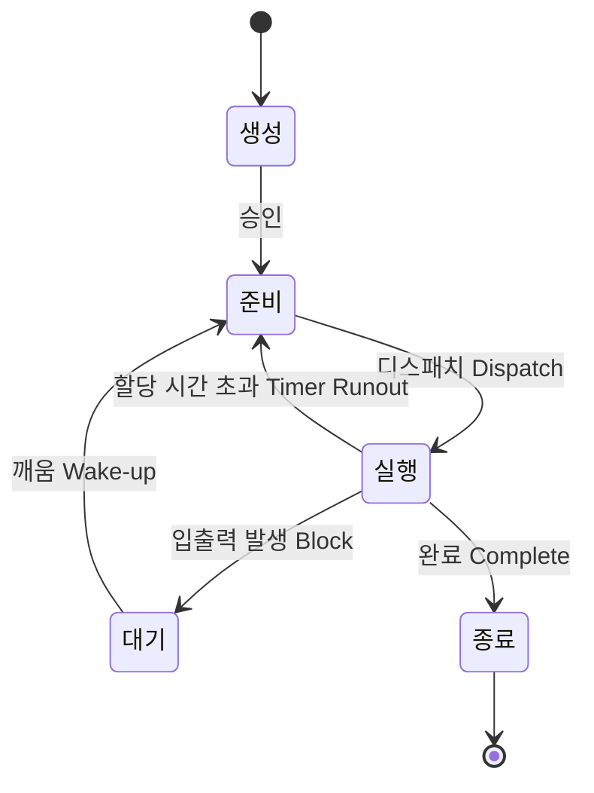
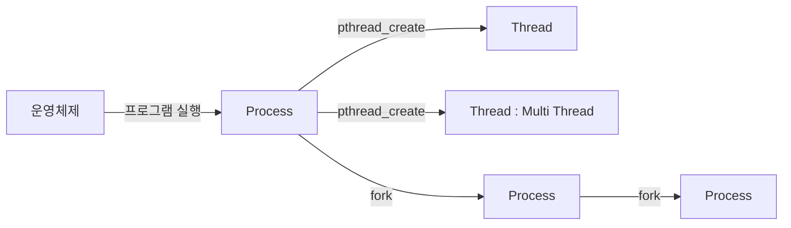
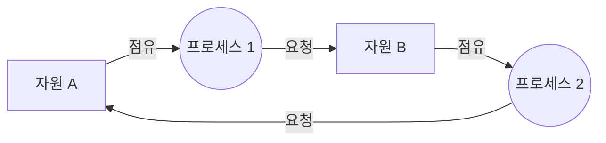

## 1. 프로세스

### 1.1 프로세스 상태 전이



| 상태 전이 | 설명 |
| --- | --- |
| 디스패치(Dispatch) | 준비 상태의 프로세스가 CPU를 할당받아 실행 상태로 전이 |
| 할당 시간 초과(Timer Runout) | 지정된 할당 시간을 초과하면 실행 상태에서 준비 상태로 전이 |
| 입출력 발생(Block) | 실행 상태에 있는 프로세스가 지정된 할당 시간을 초과하기 전에 입출력이나 기타 사건이 발생하면 CPU를 스스로 반납하고, 입출력이 완료될 때까지 대기 상태로 전이됨. 즉시 실행 불가능한 시스템 콜, I/O 작업 시작, 프로세스 간 통신 시 Block이 발생 |
| 깨움(Wake-up) | 어느 순간에 입출력이 종료되면 대기 상태의 프로세스에게 입출력 종료 사실을 즉시 알려주고, 대기 상태에서 준비 상태로 전이 |
| 완료(Complete) | 실행이 끝나 CPU를 반납하고 종료 상태로 전이 |

### 1.2 프로세스 구성요소

프로세스는 **사용자 작성 코드, 사용자 사용 데이터, 스택, 프로세스 제어 블록**으로 구성된다.

| 프로세스 구성요소 | 설명 |
| --- | --- |
| 사용자 작성 코드 | 사용자가 작성한 프로그램 코드 |
| 사용자 사용 데이터 | 사용자 작성 프로그램 코드에서 사용하는 데이터 |
| 스택(Stack) | 함수 호출(Procedure Call) 및 인자 값 전송(Arguments Passing)에 사용하는 공간 |
| 프로세스 제어 블록(PCB; Process Control Block) | 운영체제가 프로세스 관리를 위해 필요한 자료를 담고 있는 자료 구조. 프로세스 생성 시 만들어지고 메인 메모리에 유지되며, 운영체제에서 한 프로세스의 전체를 정의함 |

PCB에는 PID(프로세스 식별자), 프로세스 상태, 프로그램 카운터, 레지스터 저장 영역, 프로세서 스케줄링 정보, 계정 정보, 입출력 상태 정보, 메모리 관리 정보가 들어간다.

> **두음 - PCB 구성요소**: 「프상카레 스계입메」
> **프**로세스 식별자 / 프로세스 **상**태 / 프로그램 **카**운터 / **레**지스터 저장 영역 / 프로세서 **스**케줄링 정보 / **계**정 정보 / **입**출력 상태 정보 / **메**모리 관리 정보
> → 프로 상차림을 위해 카레와 스시 계통의 음식과 입맛 돋는 메실 준비

---

## 2. 스레드

### 2.1 스레드 개념

- 스레드는 프로세스보다 가벼운, 독립적으로 수행되는 순차적인 제어의 흐름이며, 실행 단위이다.
- 스레드는 프로세스에서 실행 제어만 분리한 실행 단위로 한 개의 프로세스는 여러 개의 스레드를 가질 수 있다.



### 2.2 스레드 종류

생성 주체에 따라 **커널 수준 스레드(Kernel Level Thread)** 와 **사용자 수준 스레드(User Level Thread)** 로 구분된다.

| 항목 | 커널 수준 스레드 | 사용자 수준 스레드 |
| --- | --- | --- |
| 개념 | 스레드를 생성하고 스케줄링하는 주체가 커널인 스레드 | 사용자 영역에서 라이브러리를 통해 구현되는 스레드 |
| 장점 | 커널이 각 스레드를 개별적으로 관리할 수 있음 / 다른 스레드가 입출력 작업이 다 끝날 때까지 다른 스레드를 사용해 다른 작업을 진행할 수 있음 / 커널이 직접 스레드를 제공해 주기 때문에 안정성과 다양한 기능이 제공 | 스케줄링 결정이나 동기화를 위해 커널 모드로 전환하지 않기 때문에 인터럽트가 발생할 때 오버헤드가 적음 / 사용자 영역의 스레드에서 행동하기 때문에 OS 스케줄러의 문맥 교환(Context Switching)이 없음 |
| 단점 | 사용자 모드에서 커널 모드로의 전환이 빈번하게 이뤄져 오버헤드가 많음 / 사용자 스레드에 비해 생성 및 관리하는 것이 느림 | 스케줄링 우선순위를 지원하지 않으므로 어떤 스레드가 먼저 동작할지 알 수 없음 / 여러 개의 사용자 스레드 중 하나의 스레드가 시스템 호출 등으로 블록이 걸리면 나머지 모든 스레드 역시 블록 됨 |

- 사용자 레벨 스레드는 프로세스 1개당 커널 스레드 1개가 할당된다.
- 커널 수준 스레드는 더 높은 병렬 처리 성능과 안정성을 제공하지만 오버헤드와 복잡성이 증가한다. 반면 사용자 수준 스레드는 더 간단하고 효율적이지만, 병렬 처리 능력과 블로킹 호출 처리에서 제한이 있다. 실제 시스템에서는 이 두 가지 접근 방식을 혼합하여 사용하는 경우가 많다.

> **인터럽트(Interrupt)**: 컴퓨터 시스템에 하드웨어나 소프트웨어 이벤트가 발생했을 때, CPU가 이를 처리하기 위해 현재 수행 중인 작업을 잠시 멈추고, 이벤트 처리 루틴으로 제어를 넘기는 기능이다.

### 2.3 프로세스와 스레드 비교

| 구분 | 프로세스(Process) | 스레드(Thread) |
| --- | --- | --- |
| 요소 기술 | PCB(Program Control Block), 텍스트, 데이터, 힙, 스택 | 스레드 ID, 레지스터 집합, 스택 |
| 통신 방법 | 프로세스 간 통신은 IPC(Pipe, Message, 공유메모리 등) 사용 | 스레드 간 통신에는 IPC뿐 아니라, 전역 변수를 사용할 수 있음 |
| 시스템 부하 | 문맥 교환을 통해 프로세스 간 전환이 일어나기 때문에 시스템 부하가 큼 | 경량화된 문맥 교환을 사용하여 시스템 부하가 적음 |

- 커널 스레드의 경우 운영체제에 의해 스레드를 운용한다.
- 사용자 스레드의 경우 사용자가 만든 라이브러리를 사용하여 스레드를 운용한다.

> **IPC(Inter-Process Communication)**: 모듈 간 통신 방식을 구현하기 위해 사용되는 프로그래밍 인터페이스 집합으로, 복수의 프로세스를 수행해 이뤄지는 프로세스 간 통신까지 구현이 가능하다.

---

## 3. 프로세스 스케줄링

### 3.1 개념

- 프로세스 스케줄링은 CPU를 사용하려고 하는 프로세스들 사이의 우선순위를 관리하는 작업이다.
- 스케줄링은 처리율과 CPU 이용률을 증가시키고 오버헤드, 응답시간, 반환시간, 대기시간을 최소화하기 위한 기법이다.
- 특정 프로세스가 적합하게 실행되도록 프로세스 스케줄링에 의해 프로세스 사이에서 CPU 교체가 일어난다.
- 스케줄러의 유형에는 **장기, 중기, 단기** 스케줄러가 있다.
  - 장기 스케줄러: Job Scheduler라고 부르고, 시작 프로세스 중 어떤 것들을 Ready Queue에 보낼지 결정한다.
  - 중기 스케줄러: 여유 공간 마련을 위해 프로세스를 통째로 메모리에서 디스크로 보낸다(Swapping).
  - 단기 스케줄러: CPU Scheduler라고 부르고, 프로세스에 CPU를 할당할 결정을 한다.
- 스케줄링 큐에는 CPU 할당을 기다리는 프로세스들의 **준비 큐(Ready Queue)** 와, 입출력(I/O) 등의 특정 이벤트가 발생하기를 기다리는 **대기 큐(Wait Queue = 블록 큐, Blocked Queue)** 가 있다.

프로세스 스케줄링 유형에는 **선점형 스케줄링**과 **비선점형 스케줄링**이 있다.

### 3.2 선점형 스케줄링(Preemptive Scheduling)

하나의 프로세스가 CPU를 차지하고 있을 때, 우선순위가 높은 다른 프로세스가 현재 프로세스를 중단시키고 CPU를 점유하는 방식이다. 유형은 **SRT, MLQ, MFQ, RR** 이 있다.

| 유형 | 설명 |
| --- | --- |
| SRT(Shortest Remaining Time First) | 가장 짧은 시간이 소요되는 프로세스를 먼저 수행하고, 남은 처리 시간이 더 짧다고 판단되는 프로세스가 준비 큐에 생기면 언제라도 프로세스가 선점되는 기법 |
| 다단계 큐(MLQ; Multi Level Queue) | 작업들을 여러 종류 그룹으로 분할, 여러 개의 큐를 이용하여 상위 단계 작업에 의한 하위단계 작업이 선점당하는 기법. 각 큐는 독자적으로 스케줄링함 |
| 다단계 피드백 큐(MFQ; Multi Level Feedback Queue) | 입출력 위주와 CPU 위주인 프로세스의 특성에 따라 큐마다 서로 다른 CPU 시간 할당량을 부여하는 기법. FCFS(FIFO)와 라운드 로빈 스케줄링 방식을 혼합한 것으로 상위 단계에서 완료되지 못한 작업은 하위 단계로 전달되어 마지막 단계에서는 라운드 로빈 방식을 사용하는 기법 |
| 라운드 로빈(RR; Round Robin) | 프로세스는 같은 크기의 CPU 시간을 할당(시간 할당량)하고 프로세스가 할당된 시간 내에 처리 완료를 못 하면 준비 큐 리스트의 가장 뒤로 보내지고, CPU는 대기 중인 다음 프로세스로 넘어가는 기법. 시간 할당량이 너무 커지면 FCFS와 비슷하게 되고, 시간 할당량이 너무 적으면 오버헤드가 커지게 됨. 시분할 시스템에서 사용됨 |

> **두음 - 선점 스케줄링 알고리즘**: 「SMMR」 SRT / MLQ / MLFQ(MFQ) / RR
> → Show Me the Money 다음 Round에 진출!

> **시분할 시스템(Time Sharing System)**: CPU 스케줄링과 다중 프로그래밍을 이용해서 각 사용자들에게 컴퓨터 자원을 시간적으로 분할하여 사용할 수 있게 해주는 대화식 시스템이다.

### 3.3 비선점형 스케줄링(Non Preemptive Scheduling)

| 유형 | 설명 |
| --- | --- |
| 우선순위(Priority) | 프로세스별로 우선순위가 주어지고, 우선순위에 따라 CPU를 할당하는 기법. 동일 순위는 FCFS |
| 기한부(Deadline) | 작업들이 명시된 시간이나 기한 내에 완료되도록 계획하는 기법 |
| HRN(Highest Response Ratio Next) | 우선순위 계산 공식을 이용하여 서비스(실행) 시간이 짧은 프로세스나 대기 시간이 긴 프로세스에게 우선순위를 주어 프로세스를 할당하는 기법. SJF의 약점인 기아 현상을 보완한 기법으로 긴 작업과 짧은 작업 간의 불평등 완화 |
| FCFS(First Come First Service; FIFO) | 프로세스가 대기 큐에 도착한 순서에 따라 CPU를 할당하는 기법 |
| SJF(Shortest Job First) | 작업이 끝날 때까지의 실행 시간 추정치가 가장 작은 작업을 먼저 실행시키는 기법. CPU 요구시간이 긴 작업과 짧은 작업 간의 불평등이 심하여, CPU 요구시간이 긴 프로세스는 오랫동안 대기하는 기아 현상 발생 |

**HRN 우선순위 공식**

$$
\text{우선순위} = \frac{(\text{대기 시간}) + (\text{서비스 시간})}{\text{서비스 시간}}
$$

> **두음 - 비선점 스케줄링 알고리즘**: 「우기 HFS」 우선순위 / 기한부 / HRN / FCFS / SJF
> → 우리 기업은 홈 패밀리 서비스(HFS)를 제공한다.
> **두음 - HRN 우선순위 공식**: 「대서서」 (대기 시간 + 서비스 시간) / (서비스 시간)

> **기아(Starvation) 현상**: 시스템 부하가 많아서 낮은 등급에 있는 준비 큐에 있는 프로세스가 무한정 기다리는 현상이다. 기아 현상을 해결하기 위한 기법으로 오랫동안 기다린 프로세스에 우선순위를 높여줌으로써 처리하는 기법인 **에이징(Aging)** 을 활용한다.

---

## 4. 프로세스 스케줄링 알고리즘 계산 방법

- 각 프로세스들의 평균 대기시간, 평균 반환시간을 계산한다.
- 프로세서가 시간 0에 시작한다고 가정하며, 운영체제로 인한 오버헤드는 무시한다.

$$
\text{반환시간} = \text{종료 시간} - \text{도착 시간}, \qquad \text{대기시간} = \text{반환시간} - \text{서비스 시간}
$$

> **두음 - 반환시간 및 대기시간 계산 방법**: 「반종도 대반서」
> **반**환시간 = **종**료 시간 - **도**착 시간 / **대**기시간 = **반**환시간 - **서**비스 시간

공통 예제 데이터(FIFO, SJF, RR에서 동일하게 사용)

| 프로세스 | 도착 시간 | 서비스 시간 |
| --- | --- | --- |
| P1 | 0 | 3 |
| P2 | 1 | 7 |
| P3 | 3 | 2 |
| P4 | 5 | 5 |

### 4.1 FIFO(First-In-First-Out) 스케줄링 - 비선점

<svg viewBox="0 0 720 110" width="100%" xmlns="http://www.w3.org/2000/svg" role="img" aria-label="FIFO 스케줄링 간트 차트">
  <text x="20" y="16" font-family="sans-serif" font-size="12" fill="#334155">FIFO (비선점) - 도착 순서대로 처리</text>
  <rect x="20" y="25" width="114" height="44" fill="#dbeafe" stroke="#475569"/>
  <rect x="134" y="25" width="266" height="44" fill="#fde68a" stroke="#475569"/>
  <rect x="400" y="25" width="76" height="44" fill="#bbf7d0" stroke="#475569"/>
  <rect x="476" y="25" width="190" height="44" fill="#fecaca" stroke="#475569"/>
  <text x="77" y="52" text-anchor="middle" font-family="sans-serif" font-size="13" fill="#1f2937">P1</text>
  <text x="267" y="52" text-anchor="middle" font-family="sans-serif" font-size="13" fill="#1f2937">P2</text>
  <text x="438" y="52" text-anchor="middle" font-family="sans-serif" font-size="13" fill="#1f2937">P3</text>
  <text x="571" y="52" text-anchor="middle" font-family="sans-serif" font-size="13" fill="#1f2937">P4</text>
  <line x1="20" y1="69" x2="20" y2="77" stroke="#475569"/>
  <line x1="134" y1="69" x2="134" y2="77" stroke="#475569"/>
  <line x1="400" y1="69" x2="400" y2="77" stroke="#475569"/>
  <line x1="476" y1="69" x2="476" y2="77" stroke="#475569"/>
  <line x1="666" y1="69" x2="666" y2="77" stroke="#475569"/>
  <text x="20" y="92" text-anchor="middle" font-family="sans-serif" font-size="11" fill="#334155">0</text>
  <text x="134" y="92" text-anchor="middle" font-family="sans-serif" font-size="11" fill="#334155">3</text>
  <text x="400" y="92" text-anchor="middle" font-family="sans-serif" font-size="11" fill="#334155">10</text>
  <text x="476" y="92" text-anchor="middle" font-family="sans-serif" font-size="11" fill="#334155">12</text>
  <text x="666" y="92" text-anchor="middle" font-family="sans-serif" font-size="11" fill="#334155">17</text>
</svg>

**동작 방식 상세 설명**

| 시간 | 사건 |
| --- | --- |
| 0 | 0시간에 P1만 도착해서 P1이 자원 점유. P1이 3시간까지 자원을 점유 |
| 3 | 3시간에 P1 종료. P2가 P3보다 먼저 도착했으므로 P2가 자원을 점유 |
| 10 | 10시간에 P2 종료. P3가 3시간에 도착, P4가 5시간에 도착해 있어서, 먼저 도착한 P3가 자원을 점유 |
| 12 | 12시간에 P3 종료. P3가 종료 후 남은 P4가 자원을 점유하여 17시간까지 서비스를 수행하고 종료 |

| 프로세스 | 도착 시간 | 서비스 시간 | 종료 시간 | 반환시간 | 대기시간 |
| --- | --- | --- | --- | --- | --- |
| P1 | 0 | 3 | 3 | 3 (3-0) | 0 (3-3) |
| P2 | 1 | 7 | 10 | 9 (10-1) | 2 (9-7) |
| P3 | 3 | 2 | 12 | 9 (12-3) | 7 (9-2) |
| P4 | 5 | 5 | 17 | 12 (17-5) | 7 (12-5) |

- 평균 반환 시간 = (3 + 9 + 9 + 12) / 4 = **8.25**
- 평균 대기 시간 = (0 + 2 + 7 + 7) / 4 = **4**

### 4.2 SJF(Shortest Job First) 스케줄링 - 비선점

<svg viewBox="0 0 720 110" width="100%" xmlns="http://www.w3.org/2000/svg" role="img" aria-label="SJF 스케줄링 간트 차트">
  <text x="20" y="16" font-family="sans-serif" font-size="12" fill="#334155">SJF (비선점) - 서비스 시간이 짧은 순서로 처리</text>
  <rect x="20" y="25" width="114" height="44" fill="#dbeafe" stroke="#475569"/>
  <rect x="134" y="25" width="76" height="44" fill="#bbf7d0" stroke="#475569"/>
  <rect x="210" y="25" width="190" height="44" fill="#fecaca" stroke="#475569"/>
  <rect x="400" y="25" width="266" height="44" fill="#fde68a" stroke="#475569"/>
  <text x="77" y="52" text-anchor="middle" font-family="sans-serif" font-size="13" fill="#1f2937">P1</text>
  <text x="172" y="52" text-anchor="middle" font-family="sans-serif" font-size="13" fill="#1f2937">P3</text>
  <text x="305" y="52" text-anchor="middle" font-family="sans-serif" font-size="13" fill="#1f2937">P4</text>
  <text x="533" y="52" text-anchor="middle" font-family="sans-serif" font-size="13" fill="#1f2937">P2</text>
  <line x1="20" y1="69" x2="20" y2="77" stroke="#475569"/>
  <line x1="134" y1="69" x2="134" y2="77" stroke="#475569"/>
  <line x1="210" y1="69" x2="210" y2="77" stroke="#475569"/>
  <line x1="400" y1="69" x2="400" y2="77" stroke="#475569"/>
  <line x1="666" y1="69" x2="666" y2="77" stroke="#475569"/>
  <text x="20" y="92" text-anchor="middle" font-family="sans-serif" font-size="11" fill="#334155">0</text>
  <text x="134" y="92" text-anchor="middle" font-family="sans-serif" font-size="11" fill="#334155">3</text>
  <text x="210" y="92" text-anchor="middle" font-family="sans-serif" font-size="11" fill="#334155">5</text>
  <text x="400" y="92" text-anchor="middle" font-family="sans-serif" font-size="11" fill="#334155">10</text>
  <text x="666" y="92" text-anchor="middle" font-family="sans-serif" font-size="11" fill="#334155">17</text>
</svg>

**동작 방식 상세 설명**

| 시간 | 사건 |
| --- | --- |
| 0 | 0시간에 P1만 도착해서 P1이 자원 점유. P1이 3시간까지 자원을 점유 |
| 3 | 3시간에 P1 종료. 3시간에 P2, P3가 도착했지만, P2는 서비스 시간이 7이고 P3는 서비스 시간이 2이므로 서비스 시간이 가장 짧은 P3가 자원을 점유 |
| 5 | 5시간에 P3 종료. 5시간에 이미 도착한 P2와 방금 도착한 P4가 있는데, P2는 서비스 시간이 7이고 P4는 서비스 시간이 5이므로 서비스 시간이 더 짧은 P4가 자원을 점유 |
| 10 | 10시간에 P4 종료. 마지막으로 남아있는 P2가 자원을 점유하여 17시간까지 서비스를 수행하고 종료 |

| 프로세스 | 도착 시간 | 서비스 시간 | 종료 시간 | 반환시간 | 대기시간 |
| --- | --- | --- | --- | --- | --- |
| P1 | 0 | 3 | 3 | 3 (3-0) | 0 (3-3) |
| P2 | 1 | 7 | 17 | 16 (17-1) | 9 (16-7) |
| P3 | 3 | 2 | 5 | 2 (5-3) | 0 (2-2) |
| P4 | 5 | 5 | 10 | 5 (10-5) | 0 (5-5) |

- 평균 반환 시간 = (3 + 16 + 2 + 5) / 4 = **6.5**
- 평균 대기 시간 = (0 + 9 + 0 + 0) / 4 = **2.25**

### 4.3 RR(Round-Robin) 스케줄링 - 선점

해당 RR에서는 **시간 할당량이 2**라고 가정한다.

<svg viewBox="0 0 720 110" width="100%" xmlns="http://www.w3.org/2000/svg" role="img" aria-label="RR 스케줄링 간트 차트">
  <text x="20" y="16" font-family="sans-serif" font-size="12" fill="#334155">RR (선점, 시간 할당량 = 2)</text>
  <rect x="20" y="25" width="76" height="44" fill="#dbeafe" stroke="#475569"/>
  <rect x="96" y="25" width="76" height="44" fill="#fde68a" stroke="#475569"/>
  <rect x="172" y="25" width="38" height="44" fill="#dbeafe" stroke="#475569"/>
  <rect x="210" y="25" width="76" height="44" fill="#bbf7d0" stroke="#475569"/>
  <rect x="286" y="25" width="76" height="44" fill="#fde68a" stroke="#475569"/>
  <rect x="362" y="25" width="76" height="44" fill="#fecaca" stroke="#475569"/>
  <rect x="438" y="25" width="76" height="44" fill="#fde68a" stroke="#475569"/>
  <rect x="514" y="25" width="76" height="44" fill="#fecaca" stroke="#475569"/>
  <rect x="590" y="25" width="38" height="44" fill="#fde68a" stroke="#475569"/>
  <rect x="628" y="25" width="38" height="44" fill="#fecaca" stroke="#475569"/>
  <text x="58" y="52" text-anchor="middle" font-family="sans-serif" font-size="12" fill="#1f2937">P1</text>
  <text x="134" y="52" text-anchor="middle" font-family="sans-serif" font-size="12" fill="#1f2937">P2</text>
  <text x="191" y="52" text-anchor="middle" font-family="sans-serif" font-size="11" fill="#1f2937">P1</text>
  <text x="248" y="52" text-anchor="middle" font-family="sans-serif" font-size="12" fill="#1f2937">P3</text>
  <text x="324" y="52" text-anchor="middle" font-family="sans-serif" font-size="12" fill="#1f2937">P2</text>
  <text x="400" y="52" text-anchor="middle" font-family="sans-serif" font-size="12" fill="#1f2937">P4</text>
  <text x="476" y="52" text-anchor="middle" font-family="sans-serif" font-size="12" fill="#1f2937">P2</text>
  <text x="552" y="52" text-anchor="middle" font-family="sans-serif" font-size="12" fill="#1f2937">P4</text>
  <text x="609" y="52" text-anchor="middle" font-family="sans-serif" font-size="11" fill="#1f2937">P2</text>
  <text x="647" y="52" text-anchor="middle" font-family="sans-serif" font-size="11" fill="#1f2937">P4</text>
  <line x1="20" y1="69" x2="20" y2="77" stroke="#475569"/>
  <line x1="96" y1="69" x2="96" y2="77" stroke="#475569"/>
  <line x1="172" y1="69" x2="172" y2="77" stroke="#475569"/>
  <line x1="210" y1="69" x2="210" y2="77" stroke="#475569"/>
  <line x1="286" y1="69" x2="286" y2="77" stroke="#475569"/>
  <line x1="362" y1="69" x2="362" y2="77" stroke="#475569"/>
  <line x1="438" y1="69" x2="438" y2="77" stroke="#475569"/>
  <line x1="514" y1="69" x2="514" y2="77" stroke="#475569"/>
  <line x1="590" y1="69" x2="590" y2="77" stroke="#475569"/>
  <line x1="628" y1="69" x2="628" y2="77" stroke="#475569"/>
  <line x1="666" y1="69" x2="666" y2="77" stroke="#475569"/>
  <text x="20" y="92" text-anchor="middle" font-family="sans-serif" font-size="11" fill="#334155">0</text>
  <text x="96" y="92" text-anchor="middle" font-family="sans-serif" font-size="11" fill="#334155">2</text>
  <text x="172" y="92" text-anchor="middle" font-family="sans-serif" font-size="11" fill="#334155">4</text>
  <text x="210" y="92" text-anchor="middle" font-family="sans-serif" font-size="11" fill="#334155">5</text>
  <text x="286" y="92" text-anchor="middle" font-family="sans-serif" font-size="11" fill="#334155">7</text>
  <text x="362" y="92" text-anchor="middle" font-family="sans-serif" font-size="11" fill="#334155">9</text>
  <text x="438" y="92" text-anchor="middle" font-family="sans-serif" font-size="11" fill="#334155">11</text>
  <text x="514" y="92" text-anchor="middle" font-family="sans-serif" font-size="11" fill="#334155">13</text>
  <text x="590" y="92" text-anchor="middle" font-family="sans-serif" font-size="11" fill="#334155">15</text>
  <text x="628" y="92" text-anchor="middle" font-family="sans-serif" font-size="11" fill="#334155">16</text>
  <text x="666" y="92" text-anchor="middle" font-family="sans-serif" font-size="11" fill="#334155">17</text>
</svg>

**동작 방식 상세 설명**

| 시간 | 사건 | 큐 | 프로세스 실행 |
| --- | --- | --- | --- |
| 0 | P1만 도착하고 시간 할당량 2만큼 할당받아 자원을 점유 | - | P1 |
| 1 | P2가 도착하고, 큐의 맨 뒤에 대기 | P2 | P1 |
| 2 | P1은 시간 할당량 2를 채웠기 때문에 큐의 맨 뒤에 대기 / 큐의 맨 앞에 있는 P2가 시간 할당량 2만큼 자원을 점유 | P1 | P2 |
| 3 | P3가 도착하고, 큐의 맨 뒤에 대기 | P1, P3 | P2 |
| 4 | P2는 시간 할당량 2를 채웠기 때문에 큐의 맨 뒤에 대기 / 큐의 맨 앞에 있는 P1이 시간 할당량 2만큼 자원을 점유 | P3, P2 | P1 |
| 5 | P4가 도착하고, 큐의 맨 뒤에 대기 / P1은 시간 할당량 2시간만큼 자원을 점유할 수 있으나, 총 서비스 시간인 3시간을 모두 채웠기 때문에 종료 / 큐의 맨 앞에 있는 P3가 시간 할당량 2만큼 자원을 점유 | P2, P4 | P3 |
| 7 | P3는 총 서비스 시간인 2시간을 모두 채웠기 때문에 종료 / 큐의 맨 앞에 있는 P2가 시간 할당량 2만큼 자원을 점유 | P4 | P2 |
| 9 | P2는 시간 할당량 2를 채웠기 때문에 큐의 맨 뒤에 대기 / 큐의 맨 앞에 있는 P4가 할당량 2만큼 자원을 점유 | P2 | P4 |
| 11 | P4는 시간 할당량 2를 채웠기 때문에 큐의 맨 뒤에 대기 / 큐의 맨 앞에 있는 P2가 시간 할당량 2만큼 자원을 점유 | P4 | P2 |
| 13 | P2는 시간 할당량 2를 채웠기 때문에 큐의 맨 뒤에 대기 / 큐의 맨 앞에 있는 P4가 시간 할당량 2만큼 자원을 점유 | P2 | P4 |
| 15 | P4는 시간 할당량 2를 채웠기 때문에 큐의 맨 뒤에 대기 / 큐의 맨 앞에 있는 P2가 시간 할당량 2만큼 자원을 점유 | P4 | P2 |
| 16 | P2는 2시간을 할당받았지만, 남은 시간이 1시간이므로 1시간 동안만 자원을 점유하여 서비스를 수행하고 종료 / 큐의 맨 앞에 있는 P4가 자원을 점유하여 17시간까지 서비스를 수행하고 종료 | - | P4 |

| 프로세스 | 도착 시간 | 서비스 시간 | 종료 시간 | 반환시간 | 대기시간 |
| --- | --- | --- | --- | --- | --- |
| P1 | 0 | 3 | 5 | 5 (5-0) | 2 (5-3) |
| P2 | 1 | 7 | 16 | 15 (16-1) | 8 (15-7) |
| P3 | 3 | 2 | 7 | 4 (7-3) | 2 (4-2) |
| P4 | 5 | 5 | 17 | 12 (17-5) | 7 (12-5) |

- 평균 반환 시간 = (5 + 15 + 4 + 12) / 4 = **9**
- 평균 대기 시간 = (2 + 8 + 2 + 7) / 4 = **4.75**

> 라운드 로빈은 시간 할당량의 크기가 매우 중요하다. 시간 할당량이 지나치게 크면 사실상 FIFO 스케줄링과 다를 바 없고, 시간 할당량이 지나치게 작으면 문맥 교환에 발생하는 비용이 증가하여 시스템의 효율이 떨어진다.

### 4.4 SRT(Shortest Remaining Time) 스케줄링 - 선점

SRT는 도착/서비스 시간이 앞의 예제와 다른 별도의 데이터를 사용한다.

| 프로세스 | 도착 시간 | 서비스 시간 |
| --- | --- | --- |
| P1 | 0 | 3 |
| P2 | 2 | 6 |
| P3 | 4 | 4 |
| P4 | 8 | 2 |

<svg viewBox="0 0 720 110" width="100%" xmlns="http://www.w3.org/2000/svg" role="img" aria-label="SRT 스케줄링 간트 차트">
  <text x="20" y="16" font-family="sans-serif" font-size="12" fill="#334155">SRT (선점) - 남은 처리 시간이 가장 짧은 프로세스가 점유</text>
  <rect x="20" y="25" width="132" height="44" fill="#dbeafe" stroke="#475569"/>
  <rect x="152" y="25" width="44" height="44" fill="#fde68a" stroke="#475569"/>
  <rect x="196" y="25" width="176" height="44" fill="#bbf7d0" stroke="#475569"/>
  <rect x="372" y="25" width="88" height="44" fill="#fecaca" stroke="#475569"/>
  <rect x="460" y="25" width="220" height="44" fill="#fde68a" stroke="#475569"/>
  <text x="86" y="52" text-anchor="middle" font-family="sans-serif" font-size="13" fill="#1f2937">P1</text>
  <text x="174" y="52" text-anchor="middle" font-family="sans-serif" font-size="11" fill="#1f2937">P2</text>
  <text x="284" y="52" text-anchor="middle" font-family="sans-serif" font-size="13" fill="#1f2937">P3</text>
  <text x="416" y="52" text-anchor="middle" font-family="sans-serif" font-size="13" fill="#1f2937">P4</text>
  <text x="570" y="52" text-anchor="middle" font-family="sans-serif" font-size="13" fill="#1f2937">P2</text>
  <line x1="20" y1="69" x2="20" y2="77" stroke="#475569"/>
  <line x1="152" y1="69" x2="152" y2="77" stroke="#475569"/>
  <line x1="196" y1="69" x2="196" y2="77" stroke="#475569"/>
  <line x1="372" y1="69" x2="372" y2="77" stroke="#475569"/>
  <line x1="460" y1="69" x2="460" y2="77" stroke="#475569"/>
  <line x1="680" y1="69" x2="680" y2="77" stroke="#475569"/>
  <text x="20" y="92" text-anchor="middle" font-family="sans-serif" font-size="11" fill="#334155">0</text>
  <text x="152" y="92" text-anchor="middle" font-family="sans-serif" font-size="11" fill="#334155">3</text>
  <text x="196" y="92" text-anchor="middle" font-family="sans-serif" font-size="11" fill="#334155">4</text>
  <text x="372" y="92" text-anchor="middle" font-family="sans-serif" font-size="11" fill="#334155">8</text>
  <text x="460" y="92" text-anchor="middle" font-family="sans-serif" font-size="11" fill="#334155">10</text>
  <text x="680" y="92" text-anchor="middle" font-family="sans-serif" font-size="11" fill="#334155">15</text>
</svg>

**동작 방식 상세 설명**

| 시간 | 사건 |
| --- | --- |
| 0 | P1이 도착하고, P1이 자원을 점유 |
| 2 | P2가 도착. P1의 남은 서비스 시간은 1, P2의 남은 서비스 시간은 6이므로 남은 서비스 시간이 가장 적은 P1이 계속해서 자원을 점유 |
| 3 | P1이 종료되고, 남은 서비스 시간이 가장 적게 남은 P2가 자원을 점유 |
| 4 | P3가 도착. P2의 남은 서비스 시간은 5, P3의 남은 서비스 시간은 4이므로 P3가 자원을 점유 |
| 8 | P4가 도착. P3가 종료되고, 남은 서비스 시간이 가장 적은 P4가 자원을 점유(P2의 남은 서비스 시간은 5, P4의 남은 서비스 시간은 2) |
| 10 | P4가 종료되고, 마지막으로 남은 P2가 자원을 점유하여 15시간까지 서비스를 수행하고 종료 |

| 프로세스 | 도착 시간 | 서비스 시간 | 종료 시간 | 반환시간 | 대기시간 |
| --- | --- | --- | --- | --- | --- |
| P1 | 0 | 3 | 3 | 3 (3-0) | 0 (3-3) |
| P2 | 2 | 6 | 15 | 13 (15-2) | 7 (13-6) |
| P3 | 4 | 4 | 8 | 4 (8-4) | 0 (4-4) |
| P4 | 8 | 2 | 10 | 2 (10-8) | 0 (2-2) |

- 평균 반환 시간 = (3 + 13 + 4 + 2) / 4 = **5.5**
- 평균 대기 시간 = (0 + 7 + 0 + 0) / 4 = **1.75**

### 4.5 SJF 기법과 SRT 기법의 비교

| 구분 | SJF(Shortest Job First) | SRT(Shortest Remaining Time) |
| --- | --- | --- |
| 개념 | 프로세스가 도착하는 시점에 따라 그 당시 가장 작은 서비스 시간을 갖는 프로세스가 종료 시까지 자원을 점유하는 비선점 기법 | 가장 짧은 시간이 소요되는 프로세스를 먼저 수행, 남은 처리 시간이 더 짧다고 판단되는 프로세스가 준비 큐에 생기면 언제라도 프로세스가 점유되는 선점 기법 |
| 장점 | 일괄처리 환경에서 구현이 용이함 | 시분할 시스템에 활용 시 유용 / SJF에 비해 평균 대기시간이나 반환시간이 짧음 |
| 단점 | 작업 시간이 적은 프로세스가 계속 들어오는 경우, 기존작업 시간이 긴 프로세스는 기아 현상 발생 / SRT에 비해 평균 대기시간이 긺 | 준비 상태 큐에 있는 각 프로세스의 서비스 시간을 지속적으로 추적해야 하므로 오버헤드 증가 |

---

## 5. 프로세스 관리 - 교착상태(Deadlock)

### 5.1 개념

교착상태는 다중프로세싱 환경에서 두 개 이상의 프로세스가 특정 자원 할당을 무한정 대기하는 상태이다.



### 5.2 교착상태 발생 조건

교착상태 발생 조건에는 상호배제, 점유와 대기, 비선점, 환형 대기가 있고 이 조건이 **모두 충족되어야만** 교착상태가 발생한다.

| 발생 조건 | 설명 |
| --- | --- |
| 상호배제(Mutual Exclusive) | 프로세스가 자원을 배타적으로 점유하여 다른 프로세스가 그 자원을 사용할 수 없는 상태 |
| 점유와 대기(Hold & Wait) | 한 프로세스가 자원을 점유하고 있으면서 또 다른 자원을 요청하여 대기하고 있는 상태 |
| 비선점(Non Preemption) | 프로세스가 어떤 자원을 점유하고 있는 동안에는 다른 프로세스가 그 자원을 강제로 빼앗을 수 없는 상태 |
| 환형 대기(Circular Wait) | 두 개 이상의 프로세스 간 자원의 점유와 대기가 하나의 원형을 구성한 상태 |

> **두음 - 교착상태 발생 조건**: 「상점비환」 상호배제 / 점유와 대기 / 비선점 / 환형 대기
> 상호배제 기법에는 데커 알고리즘, 램포트 알고리즘, 피터슨 알고리즘, 세마포어가 있다.

### 5.3 교착상태 해결 방법

| 해결 방법 | 동작 방식 | 세부 기법 |
| --- | --- | --- |
| 예방(Prevention) | 교착상태 발생 조건 네 가지 조건 중에서 어느 하나를 충족하지 못하게 하는 방법 / 사전에 교착상태가 발생하지 않도록 제어하는 방법 | 점유 자원 해제 후 새 자원 요청 |
| 회피(Avoidance) | 안전한 상태를 유지할 수 있는 요구만 수락(프로세스별 자원 최대 요구량 확보)하는 방안 | 은행가 알고리즘, Wound-Wait, Wait-Die |
| 발견(Detection) | 시스템의 상태를 감시 알고리즘을 통해 검사하여 교착상태를 발견하는 방안 | 자원할당 그래프, Wait for Graph |
| 복구(Recovery) | 교착상태가 없어질 때까지 순차적으로 강제 종료(Kill)하여 회복하는 방법 / 교착 상태가 해결될 때까지 한 프로세스씩 자원을 선점하게 하여 회복하는 방법 | 프로세스 강제 종료(Kill), 자원 선점 |

> **두음 - 교착상태 해결 방법**: 「예회발복」 예방 / 회피 / 발견 / 복구
> **은행가 알고리즘(Banker's Algorithm)**: 사용자 프로세스는 사전에 자기 작업에 필요한 자원의 수를 제시하고 운영체제가 자원의 상태를 감시, 안전상태일 때만 자원을 할당하는 교착상태 회피기법이다.

---

## 6. 디스크 스케줄링

### 6.1 개념

- 디스크 스케줄링은 사용할 데이터가 디스크상의 여러 곳에 저장되어 있을 경우, 데이터를 액세스하기 위해 디스크 헤드를 움직이는 경로를 결정하는 기법이다.
- 디스크 스케줄링은 운영체제(OS)가 담당하고 목적은 **처리량 최대화, 응답시간 최소화**이다.

### 6.2 디스크 스케줄링 종류

종류에는 FCFS, SSTF, SCAN, C-SCAN, LOOK, N-STEP SCAN, SLTF 스케줄링 기법 등이 있다.

| 종류 | 설명 |
| --- | --- |
| FCFS(First Come First Served; FIFO) | 디스크 큐에 가장 먼저 들어온 트랙에 대한 요청을 가장 먼저 서비스하는 기법. 알고리즘이 단순하고 구현이 쉬움 |
| SSTF(Shortest Seek Time First) | 현재 위치에서 탐색 거리(Seek Distance)가 가장 짧은 트랙에 대한 요청을 먼저 서비스하는 기법. 일괄 처리 시스템에 유용. 현재 헤드 위치에서 가장 가까운 거리에 있는 트랙으로 헤드를 이동시킴 |
| SCAN | 현재 헤드의 위치에서 진행 방향이 결정되면 탐색 거리가 짧은 순서에 따라 그 방향의 모든 요청을 서비스하고, 끝까지 이동한 후 역방향의 요청 사항을 서비스하는 기법 |
| C-SCAN(Circular SCAN) | 항상 바깥쪽에서 안쪽으로 움직이며 가장 짧은 탐색 거리를 갖는 요청을 서비스하는 기법. 안쪽 끝까지 이동했으면 다시 바깥쪽부터 탐색하는 방법으로 비교적 공평한 기법 |
| LOOK(엘리베이터 알고리즘) | SCAN을 기초로 사용하는 기법으로 진행 방향으로 더 이상의 요청이 없으면 역방향으로 진행하는 기법. SCAN은 이동 방향의 끝까지 간 후 방향을 바꾸지만, LOOK은 요청까지만 간 후 방향을 바꿈 |
| N-STEP SCAN | SCAN 기법을 기초로 하며 어떤 방향의 진행이 시작될 당시에 대기 중이던 요청들만 서비스하고, 진행 도중 도착한 요청들은 한꺼번에 모아서 다음의 반대 진행 방향으로 진행할 때 서비스하는 기법 |
| SLTF(Shortest Latency Time First) | 섹터 큐잉(Sector Queuing)이라고 하며, 회전지연시간 최적화를 위해 구현된 기법. 디스크 헤드가 특정 실린더에 도착하면 그 실린더 내의 여러 트랙에 대한 요청들을 검사한 후, 회전지연시간이 가장 짧은 요청부터 서비스하는 기법 |

### 6.3 디스크의 대기 큐의 트랙 번호 계산

대기 큐의 트랙 번호가 다음과 같다.

| 150 | 70 | 200 | 30 | 20 | 60 |
| --- | --- | --- | --- | --- | --- |

초기 헤드 위치가 **50번 트랙**이고 방향은 **안쪽 방향(0번)** 으로 이동 중이라고 하면 다음과 같이 계산한다.

| 알고리즘 | 이동 순서 | 헤드의 이동 거리 |
| --- | --- | --- |
| FCFS | 50 → 150 → 70 → 200 → 30 → 20 → 60 | 530 |
| SSTF | 50 → 60 → 70 → 30 → 20 → 150 → 200 | 250 |
| SCAN | 50 → 30 → 20 → 0 → 60 → 70 → 150 → 200 | 250 |
| C-SCAN | 50 → 30 → 20 → 0 → 200 → 150 → 70 → 60 | 390 |
| LOOK | 50 → 30 → 20 → 60 → 70 → 150 → 200 | 210 |

<svg viewBox="0 0 720 250" width="100%" xmlns="http://www.w3.org/2000/svg" role="img" aria-label="SCAN, C-SCAN, LOOK 헤드 이동 비교">
  <text x="10" y="16" font-family="sans-serif" font-size="12" fill="#334155">SCAN / C-SCAN / LOOK 헤드 이동 비교 (초기 헤드 50, 안쪽 방향)</text>
  <line x1="60" y1="40" x2="660" y2="40" stroke="#94a3b8"/>
  <text x="60" y="32" text-anchor="middle" font-family="sans-serif" font-size="10" fill="#64748b">0</text>
  <text x="120" y="32" text-anchor="middle" font-family="sans-serif" font-size="10" fill="#64748b">20</text>
  <text x="150" y="32" text-anchor="middle" font-family="sans-serif" font-size="10" fill="#64748b">30</text>
  <text x="210" y="32" text-anchor="middle" font-family="sans-serif" font-size="10" fill="#64748b">50</text>
  <text x="240" y="32" text-anchor="middle" font-family="sans-serif" font-size="10" fill="#64748b">60</text>
  <text x="270" y="32" text-anchor="middle" font-family="sans-serif" font-size="10" fill="#64748b">70</text>
  <text x="510" y="32" text-anchor="middle" font-family="sans-serif" font-size="10" fill="#64748b">150</text>
  <text x="660" y="32" text-anchor="middle" font-family="sans-serif" font-size="10" fill="#64748b">200</text>
  <line x1="60" y1="36" x2="60" y2="44" stroke="#94a3b8"/>
  <line x1="120" y1="36" x2="120" y2="44" stroke="#94a3b8"/>
  <line x1="150" y1="36" x2="150" y2="44" stroke="#94a3b8"/>
  <line x1="210" y1="36" x2="210" y2="44" stroke="#94a3b8"/>
  <line x1="240" y1="36" x2="240" y2="44" stroke="#94a3b8"/>
  <line x1="270" y1="36" x2="270" y2="44" stroke="#94a3b8"/>
  <line x1="510" y1="36" x2="510" y2="44" stroke="#94a3b8"/>
  <line x1="660" y1="36" x2="660" y2="44" stroke="#94a3b8"/>
  <text x="10" y="80" font-family="sans-serif" font-size="12" fill="#1f2937">SCAN</text>
  <polyline points="210,70 150,80 120,90 60,100 240,110 270,120 510,130 660,140" fill="none" stroke="#2563eb" stroke-width="2"/>
  <circle cx="210" cy="70" r="3" fill="#2563eb"/>
  <text x="672" y="105" font-family="sans-serif" font-size="11" fill="#2563eb">250</text>
  <text x="10" y="165" font-family="sans-serif" font-size="12" fill="#1f2937">C-SCAN</text>
  <polyline points="210,155 150,163 120,171 60,179 660,187 510,195 270,203 240,211" fill="none" stroke="#dc2626" stroke-width="2" stroke-dasharray="5 3"/>
  <circle cx="210" cy="155" r="3" fill="#dc2626"/>
  <text x="672" y="190" font-family="sans-serif" font-size="11" fill="#dc2626">390</text>
  <text x="10" y="235" font-family="sans-serif" font-size="12" fill="#1f2937">LOOK</text>
  <polyline points="210,225 150,231 120,237 240,243 270,243 510,243 660,243" fill="none" stroke="#059669" stroke-width="2"/>
  <circle cx="210" cy="225" r="3" fill="#059669"/>
  <text x="672" y="243" font-family="sans-serif" font-size="11" fill="#059669">210</text>
</svg>

> SCAN 알고리즘은 이동 방향 끝까지(0번) 이동하고, LOOK 알고리즘은 요청까지만 진행한 후 요청이 없으면 방향을 바꿔서 이동한다. 이 차이가 SCAN 250 vs LOOK 210의 차이를 만든다.

---

## 7. 환경 변수(Environment Variable)

### 7.1 개념

- 환경 변수는 프로세스가 컴퓨터에서 동작하는 방식에 많은 영향을 미치는 동적 값들의 모임이다.
- 환경 변수는 운영체제와 응용 프로그램에 대한 환경 설정 정보를 저장하는 변수이다. 사용자나 시스템 전체에서 공통으로 사용될 수 있으며, 주로 실행 파일이 위치한 디렉터리 경로 설정 정보, 사용자 정보, 시스템 설정 정보, 언어 및 지역 설정 정보를 포함한다.

### 7.2 유닉스(Unix) 시스템 환경 변수 설정

- `env`, `set`, `printenv` 명령어들은 변수 없이 사용하면, 모든 환경 변수 및 그에 따른 모든 값을 보여준다.
- `env`와 `set`은 환경 변수를 설정하는 데 쓰일 수도 있으며 셸에 직접 통합되기도 한다.
- `printenv`는 변수 이름을 명령어에 단일 변수로 주면, 하나의 단일 변수 인쇄에 쓰일 수 있다.

| 명령 | 설명 |
| --- | --- |
| env | 전역 변수 설정 및 조회 |
| set | 사용자 환경 변수 설정 및 조회 |
| export | 사용자 환경 변수를 전역 변수로 설정 / 사용자가 생성하는 변수는 export 명령어로 표시하지 않는 한 현재 셸에 국한 |

```bash
export 변수=값     # Bourne, bash, 다른 셸에서 쓰임
setenv 변수 값     # csh와 관련된 셸에서 쓰임
```

- 유닉스에서 변수들은 export 없이 할당되기도 한다. 이러한 방법으로 변수를 정의하면 `set` 명령어를 통해 보이기는 하지만 자식 프로세스에 종속되지는 않는다.

---

## 8. 셸 스크립트(Shell Script)

- 셸 스크립트는 셸이나 명령줄 인터프리터에서 돌아가도록 작성되었거나 운영체제를 위해 사용되는 스크립트이다.
- 셸 스크립트가 수행하는 일반 기능으로는 파일 이용, 프로그램 실행, 문자열 출력 등이 있다.

> **셸(Shell)**: 사용자의 명령어를 인식하여 프로그램을 호출하고 명령을 수행하는 명령어 해석기이다.
> **스크립트(Script)**: 특정 작업이나 기능을 자동화하기 위해 작성된 일련의 명령어들을 포함하는 파일이다. 프로그래밍 언어로 작성되며, 운영체제나 응용 프로그램이 실행할 수 있는 명령어를 포함한다.

---

## 9. 리눅스/유닉스 계열 운영체제의 기본 명령어

명령어는 파일 디렉터리 관리, 유저 관리, 권한 관리, 프로세스 관리, 통신 관련 등으로 구분할 수 있다.

| 구분 | 명령어 | 설명 |
| --- | --- | --- |
| 시스템 관련 | uname -a | 시스템의 모든 정보를 확인하는 명령어. 시스템 이름, 사용 중인 운영체제와 버전, 호스트명, 하드웨어 정보 등 |
| 시스템 관련 | uname -r | 운영체제의 배포 버전 출력하는 명령어 |
| 시스템 관련 | cat | 파일의 내용을 화면에 출력하는 명령어 |
| 시스템 관련 | uptime | 시스템의 가동 시간과 현재 사용자 수, 평균 부하량 등을 확인하는 명령어 |
| 사용자 | id | 사용자의 로그인명, id, 그룹 id 등 출력하는 명령어 |
| 사용자 | last | 시스템의 부팅부터 현재까지의 모든 사용자의 로그인과 로그아웃에 대한 정보를 표시하는 명령어 |
| 사용자 | who | 현재 접속한 사용자 정보 표시하는 명령어 |
| 파일 처리 | ls | 현재 디렉터리 내 파일 및 폴더들의 목록을 표시하는 명령어 |
| 파일 처리 | pwd | print working directory의 약자로서, 현재 작업 중인 디렉터리의 절대경로를 출력하는 명령어 |
| 파일 처리 | rm | 파일 삭제 명령어 |
| 파일 처리 | cp | 파일 복사 명령어 |
| 파일 처리 | mv | 파일 이동 명령어 |
| 프로세스 | ps | 현재 실행되고 있는 프로세스 목록 출력 |
| 프로세스 | pmap | 프로세스 ID를 기준으로 메모리 맵 정보를 출력하는 명령어 |
| 프로세스 | kill | 특정 프로세스 종료 명령어 |
| 프로세스 | fork | 새로운 프로세스를 생성하는 명령어 |
| 파일 권한 | chmod | 특정 파일 또는 디렉터리의 사용 권한을 수정 명령어 |
| 파일 권한 | chown | 파일이나 디렉터리의 소유자, 소유 그룹 수정 명령어 |
| 네트워크 | ifconfig | 네트워크 인터페이스를 설정하거나 확인하는 명령어 |
| 네트워크 | host | 도메인(호스트) 명은 알고 있는데 IP 주소를 모르거나 혹은 그 반대의 경우에 사용하는 명령어 |
| 압축 | tar | 여러 개의 파일을 하나의 파일로 묶거나 풀 때 사용하는 명령어(압축은 불가) |
| 압축 | gzip | 파일을 묶거나 풀 수는 없지만 압축을 담당 |
| 검색 | grep | 입력으로 전달된 파일의 내용에서 특정 문자열을 찾고자 할 때 사용하는 명령어 |
| 검색 | find | 특정한 파일을 찾는 명령어 |
| 동기화 | rsync | 로컬 또는 원격의 파일과 디렉터리를 복사하고 동기화하는 명령어 |
| 디스크 사용 | df | 시스템에 마운트된 하드디스크의 남은 용량을 확인할 때 사용하는 명령어 |
| 디스크 사용 | du | 파일 크기를 kbyte 단위로 보여주는 명령어 |
| 디렉터리 이동 | cd | 디렉터리를 이동하는 명령어 |

> `chmod` 명령은 해당 파일의 소유주나 슈퍼 유저 root만이 실행할 수 있다.

---

## 10. 파일 디스크립터(File Descriptor)

### 10.1 개념

- 파일 디스크립터는 운영체제가 필요로 하는 파일에 대한 정보를 갖고 있는 제어 블록이다.
- **파일 제어 블록(File Control Block)** 이라고도 한다.
- 파일마다 독립적으로 존재하며, 시스템에 따라 다른 구조를 가질 수 있다.
- 보통 보조기억 장치 내에 저장되어 있다가 해당 파일이 개방(Open)될 때 주기억 장치로 이동된다.
- 파일 디스크립터는 파일 시스템에서 관리하므로 사용자가 직접 참조할 수 없다.

> 파일 디스크립터는 열려 있는 파일을 프로세스가 식별할 수 있도록 만들어진 정수 형태의 고유한 식별자이다. 파일 디스크립터는 운영체제가 관리한다.

### 10.2 파일 디스크립터의 정보

| 정보 | 설명 |
| --- | --- |
| 이름 | 파일 이름 및 파일의 크기 |
| 위치 | 보조기억 장치에서의 파일 위치 |
| 파일 구조 | 순차 파일, 색인 순차 파일, 색인 파일 등의 구조 |
| 보조기억 장치 유형 | 자기 디스크, 자기 테이프 등의 유형 |
| 파일 유형 | 텍스트 파일, 목적 프로그램 파일(이진 파일, 기계어 파일, 실행 파일) 등의 유형 |
| 시간 | 생성 날짜와 시간, 제거 날짜와 시간 / 최종 수정 날짜 및 시간 |
| 액세스 | 액세스 제어 정보 / 액세스한 횟수(파일 사용 횟수) |

---

## 11. 시험 대비 핵심 요약

| 주제 | 반드시 외울 것 |
| --- | --- |
| PCB 구성요소 | 「프상카레 스계입메」 |
| 선점 스케줄링 | 「SMMR」 SRT, MLQ, MLFQ(MFQ), RR |
| 비선점 스케줄링 | 「우기 HFS」 우선순위, 기한부, HRN, FCFS, SJF |
| HRN 공식 | (대기 시간 + 서비스 시간) / 서비스 시간 |
| 반환/대기시간 | 반환 = 종료 - 도착, 대기 = 반환 - 서비스 |
| 교착상태 발생 조건 | 「상점비환」 상호배제, 점유와 대기, 비선점, 환형 대기 |
| 교착상태 해결 | 「예회발복」 예방, 회피, 발견, 복구 |
| 디스크 스케줄링 | FCFS, SSTF, SCAN, C-SCAN, LOOK, N-STEP SCAN, SLTF / SCAN은 끝까지, LOOK은 요청까지 |
| 환경 변수 | env(전역), set(사용자), export(사용자→전역) |
| 파일 디스크립터 | = 파일 제어 블록(FCB), 사용자가 직접 참조 불가 |
