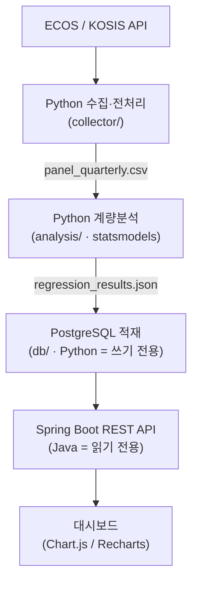

> **진행 중인 프로젝트입니다.** 데이터 수집·계량분석 파이프라인까지 완성,
> Spring Boot API와 대시보드는 개발 중. 과정은 [연재 포스트](#관련-포스트)로 기록하고 있습니다.

## 무엇을 알아보려는 프로젝트인가

"대전의 경제를 움직이는 요인은 대구·울산과 다른가?" — 한국은행 ECOS와 통계청 KOSIS의
공개 데이터를 이용해 지역별 경제 결정요인을 통계적으로 비교하고, 그 결과를 누구나 볼 수 있는
대시보드로 만드는 프로젝트입니다.

## 아키텍처

## 핵심 설계 결정

### 왜 Python은 쓰기 전용, Java는 읽기 전용인가

분석(Python 생태계가 압도적)과 서빙(운영·타입 안정성)의 책임을 언어 경계로 분리했습니다.
DB를 유일한 접점으로 두면 두 세계가 서로의 코드를 몰라도 되고, 장애 원인 추적도 단순해집니다.
서빙 쪽은 쓰기 로직이 없으므로 전 구간 `@Transactional(readOnly = true)`.

### 왜 단순 OLS가 아니라 Newey-West HAC인가

- 수준 변수를 그대로 회귀하면 가성회귀 위험 → 모든 변수를 **전년동기비 증가율**로 변환 (계절성도 흡수)
- 변환 후 **ADF 검정**으로 정상성 확인 — 검정 결과 자체를 DB에 저장해 대시보드 방법론 탭에 노출
- 전년동기비 변환은 자기상관을 유발 → **Newey-West HAC(maxlags=4)** 표준오차로 대응
- 지역 소비·고용 변수 간 다중공선성은 **VIF > 10** 기준으로 제거

### 지역 간 차이를 어떻게 "검정"하는가

지역별 회귀 결과를 눈대중으로 비교하지 않고, 풀링 모형에 **상호작용항**을 넣어
γ 계수의 유의성으로 판단합니다. 모델은 M1(실물) → M2(+금융) → M3(+대외·심리)로
단계 확장하며 조정 R²로 비교합니다.

## 정직한 한계

신용카드 사용액과 서비스업 생산은 동시에 움직이는 변수라 인과 방향을 특정할 수 없습니다.
시차 모형(R1)으로 강건성만 확인하고, 결론은 인과가 아닌 **연관성**으로 서술합니다.

## 다음 단계

Spring Boot 조회 API 3개(`/api/series`, `/api/regressions`, `/api/diagnostics`)와
프론트 대시보드, GitHub Actions 월 1회 자동 갱신이 남아 있습니다.
향후 6~7개 광역시 패널 고정효과 모형(`linearmodels.PanelOLS`)으로 확장 예정.

## 관련 포스트

(연재를 시작하면 여기에 링크가 쌓입니다)

## 기술 스택 & 저장소

`Python` `statsmodels` `PostgreSQL` `Spring Boot` `JPA` `Chart.js`

[GitHub 저장소 보기](https://github.com/sungjin-dev/저장소명){: .btn .btn--primary}
